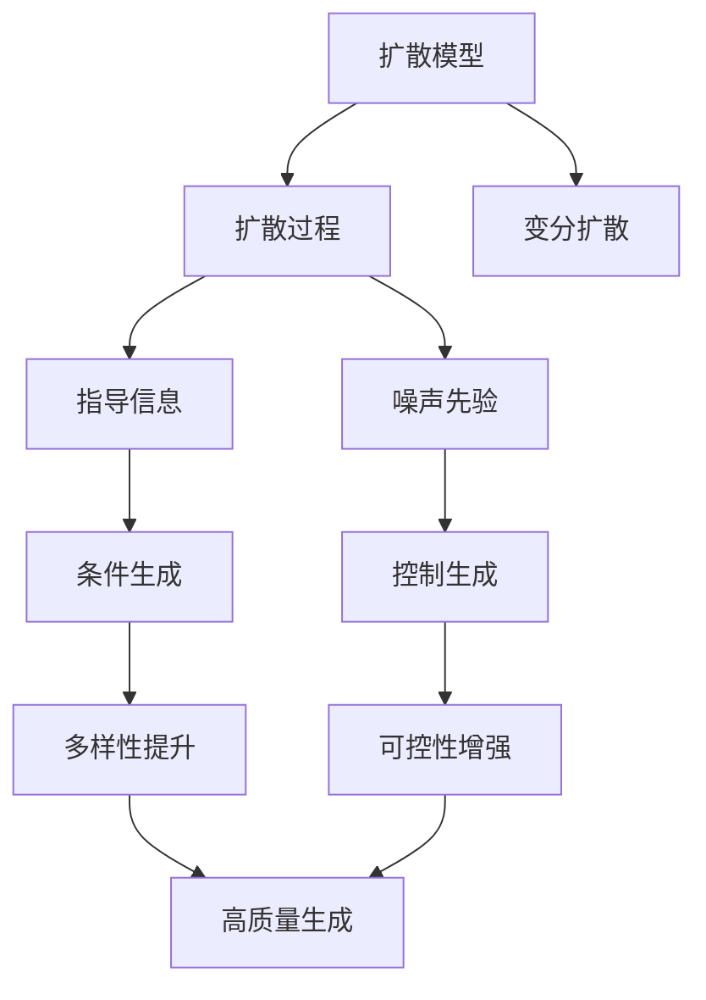

                 

# 扩散模型：AI创作的新范式

## 1. 背景介绍

### 1.1 问题由来
随着深度学习技术的飞速发展，人工智能（AI）在创作领域的应用日益广泛。从简单的文本生成到复杂的艺术创作，AI 模型逐渐展现出令人惊叹的创造力。然而，这些模型通常基于大规模的标注数据进行训练，导致训练成本高、泛化能力不足等问题。

扩散模型（Diffusion Model）作为一种全新的生成模型范式，以其低成本、高质量生成的特点迅速在艺术创作、内容生成等领域崭露头角。扩散模型通过设计巧妙的训练策略，在不需要大规模标注数据的情况下，通过简单的扩散过程和指导信息，就能生成高质量的样本。这种高效的创作方式，为AI创作开辟了新的道路。

### 1.2 问题核心关键点
扩散模型是建立在“扩散过程”和“指导信息”的基础上，通过迭代优化，逐步将噪声转化为高质量样本的一种生成模型。与传统的生成对抗网络（GAN）、变分自编码器（VAE）等模型相比，扩散模型的训练过程更加简单，生成质量更高。

核心关键点包括：
1. 扩散过程：通过多次迭代，逐步将噪声加入输入数据，最终生成高质量的样本。
2. 指导信息：通过添加合适的指导信息，如条件生成、控制生成等，提升生成的多样性和可控性。
3. 噪声先验：使用高斯噪声作为先验分布，确保生成过程的稳定性和多样性。
4. 时间反转扩散（TOD）：通过反向传播，逐步从噪声状态恢复至真实数据状态。

## 2. 核心概念与联系

### 2.1 核心概念概述

为更好地理解扩散模型的核心概念，本节将介绍几个密切相关的核心概念：

- **扩散模型（Diffusion Model）**：一种通过迭代过程将噪声加入输入数据，逐步生成高质量样本的生成模型。与传统的GAN和VAE相比，扩散模型训练更加简单，生成质量更高。

- **扩散过程（Diffusion Process）**：扩散模型的核心组件，通过多次迭代，逐步将噪声加入输入数据，最终生成高质量样本。

- **指导信息（Guidance Signal）**：通过添加合适的指导信息，如条件生成、控制生成等，提升生成的多样性和可控性。

- **噪声先验（Noise Prior）**：扩散模型通常使用高斯噪声作为先验分布，确保生成过程的稳定性和多样性。

- **时间反转扩散（TOD）**：通过反向传播，逐步从噪声状态恢复至真实数据状态，以提升生成样本的质量和多样性。

- **变分扩散（Variational Diffusion）**：一种基于变分推断的扩散模型，能够更好地控制生成过程的稳定性。

这些核心概念之间的逻辑关系可以通过以下Mermaid流程图来展示：



这个流程图展示了大语言模型的核心概念及其之间的关系：

1. 扩散模型通过扩散过程逐步将噪声加入输入数据。
2. 指导信息可以通过条件生成、控制生成等方式提升生成的多样性和可控性。
3. 噪声先验使用高斯噪声确保生成过程的稳定性和多样性。
4. 时间反转扩散通过反向传播逐步恢复样本质量。
5. 变分扩散使用变分推断提升生成过程的稳定性。

## 3. 核心算法原理 & 具体操作步骤
### 3.1 算法原理概述

扩散模型通过迭代将噪声加入输入数据，逐步生成高质量样本。扩散模型的核心思想是：通过逐步增加噪声的强度，最终将噪声转化为真实数据。这种迭代过程类似于“扩散”，因此得名扩散模型。

扩散模型的训练过程分为两个阶段：
1. 正向扩散阶段：逐步增加噪声强度，使输入数据逐渐变得嘈杂。
2. 反向扩散（时间反转扩散）阶段：通过反向传播，逐步从噪声状态恢复至真实数据状态。

在反向扩散阶段，扩散模型使用噪声先验和指导信息，逐步减少噪声强度，恢复样本的真实性。这种过程类似于将“扩散”过程逆转，因此称为时间反转扩散（TOD）。

### 3.2 算法步骤详解

扩散模型的训练过程可以分为以下几个步骤：

**Step 1: 数据准备**
- 准备训练数据集，包括图像、文本等。
- 对于图像数据，可以将像素值标准化为均值为0，标准差为1的高斯分布。
- 对于文本数据，可以将文本编码为向量，标准化为均值为0，标准差为1的高斯分布。

**Step 2: 定义扩散过程**
- 定义扩散过程的迭代次数（step），每个迭代步骤增加噪声的强度。
- 定义噪声先验分布 $q_t$，通常使用高斯噪声作为先验分布。
- 定义模型参数 $\theta$，包括扩散模型和解码器等。

**Step 3: 定义扩散模型**
- 定义扩散模型 $x_t = \sqrt{1 - \beta_t}x_{t-1} + \sqrt{\beta_t}q_t$，其中 $\beta_t$ 是噪声强度，$x_0$ 是原始输入数据。

**Step 4: 定义解码器**
- 定义解码器 $y = \sigma( \sqrt{\alpha_t}x_t)$，其中 $\alpha_t$ 是噪声强度，$\sigma$ 是激活函数。

**Step 5: 训练扩散模型**
- 使用时间反转扩散（TOD），逐步从噪声状态恢复至真实数据状态。
- 在每个迭代步骤中，计算损失函数，优化模型参数 $\theta$。
- 重复上述步骤，直至扩散过程完成。

**Step 6: 生成样本**
- 使用训练好的扩散模型，通过逐步减少噪声强度，生成高质量样本。

### 3.3 算法优缺点

扩散模型相较于传统生成模型具有以下优点：
1. 训练成本低：扩散模型不需要大规模标注数据，可以基于较小的数据集进行训练。
2. 生成质量高：扩散模型通过迭代过程，逐步将噪声加入输入数据，生成高质量的样本。
3. 可控性强：通过添加指导信息，扩散模型能够生成多样化且可控的样本。

同时，扩散模型也存在以下缺点：
1. 训练复杂度高：扩散模型的训练过程需要多次迭代，计算量较大。
2. 可解释性差：扩散模型的生成过程较为复杂，难以进行解释。
3. 生成时间较长：扩散模型的生成过程需要逐步减少噪声强度，生成时间较长。

### 3.4 算法应用领域

扩散模型在图像生成、文本生成、音乐创作、视频制作等领域有广泛的应用：

- **图像生成**：通过扩散模型生成高质量的艺术作品、建筑场景、自然景观等。
- **文本生成**：通过扩散模型生成小说、诗歌、新闻报道等文本内容。
- **音乐创作**：通过扩散模型生成原创音乐、声效等音频内容。
- **视频制作**：通过扩散模型生成动画、电影、广告等视频内容。

扩散模型以其低成本、高质量生成的特点，正在成为AI创作的重要手段，推动AI技术在更多领域的落地应用。

## 4. 数学模型和公式 & 详细讲解 & 举例说明
### 4.1 数学模型构建

扩散模型的核心思想是通过迭代过程，将噪声加入输入数据，逐步生成高质量样本。其数学模型可以描述为：

$$
x_t = \sqrt{1 - \beta_t}x_{t-1} + \sqrt{\beta_t}q_t
$$

其中 $x_t$ 是当前状态的样本，$x_{t-1}$ 是上一状态的样本，$q_t$ 是噪声先验分布，$\beta_t$ 是噪声强度。

### 4.2 公式推导过程

以图像生成为例，假设原始图像 $x_0$ 为一张高分辨率的图像，其像素值为一个高维向量。扩散模型将噪声先验分布 $q_t$ 设置为高维高斯分布，迭代过程如下：

1. 正向扩散阶段：逐步增加噪声强度，使输入数据逐渐变得嘈杂。
   $$
   x_t = \sqrt{1 - \beta_t}x_{t-1} + \sqrt{\beta_t}q_t
   $$

2. 反向扩散（时间反转扩散）阶段：通过反向传播，逐步从噪声状态恢复至真实数据状态。
   $$
   y = \sigma( \sqrt{\alpha_t}x_t)
   $$

其中 $\alpha_t$ 是噪声强度，$\sigma$ 是激活函数，通常使用ReLU、Sigmoid等。

### 4.3 案例分析与讲解

以Glares扩散模型为例，介绍扩散模型的具体实现过程：

Glares模型是一种基于变分推断的扩散模型，使用高斯噪声作为先验分布，通过逐步减少噪声强度，生成高质量样本。其主要步骤如下：

1. 定义扩散过程：
   $$
   x_t = \sqrt{1 - \beta_t}x_{t-1} + \sqrt{\beta_t}q_t
   $$

2. 定义解码器：
   $$
   y = \sigma( \sqrt{\alpha_t}x_t)
   $$

3. 定义噪声先验分布 $q_t$：
   $$
   q_t = \mathcal{N}(0, I)
   $$

4. 训练扩散模型：
   - 使用时间反转扩散（TOD），逐步从噪声状态恢复至真实数据状态。
   - 计算损失函数，优化模型参数 $\theta$。

5. 生成样本：
   - 使用训练好的扩散模型，通过逐步减少噪声强度，生成高质量样本。

## 5. 项目实践：代码实例和详细解释说明
### 5.1 开发环境搭建

在进行扩散模型实践前，我们需要准备好开发环境。以下是使用Python进行PyTorch开发的环境配置流程：

1. 安装Anaconda：从官网下载并安装Anaconda，用于创建独立的Python环境。

2. 创建并激活虚拟环境：
```bash
conda create -n pytorch-env python=3.8 
conda activate pytorch-env
```

3. 安装PyTorch：根据CUDA版本，从官网获取对应的安装命令。例如：
```bash
conda install pytorch torchvision torchaudio cudatoolkit=11.1 -c pytorch -c conda-forge
```

4. 安装 diffusion models 库：
```bash
pip install git+https://github.com/hojonathanho/diffusion
```

5. 安装各类工具包：
```bash
pip install numpy pandas scikit-learn matplotlib tqdm jupyter notebook ipython
```

完成上述步骤后，即可在`pytorch-env`环境中开始扩散模型实践。

### 5.2 源代码详细实现

下面我们以图像生成为例，给出使用diffusion models库进行扩散模型训练的PyTorch代码实现。

首先，定义扩散过程和解码器：

```python
import torch
from torch import nn
from diffusers import (
    CouplingBlock,
    DDIMScheduler,
    DDIPModel,
    DynamicUnconditionalDiffusionModel,
)

class DiffusionModel(nn.Module):
    def __init__(self, num_diffusion_steps, model_name="ddim"):
        super(DiffusionModel, self).__init__()
        self.num_diffusion_steps = num_diffusion_steps
        self.model_name = model_name

        # 定义扩散过程和解码器
        self.diffusion = DynamicUnconditionalDiffusionModel.from_pretrained(model_name)
        self.scheduler = DDIMScheduler.from_config(self.diffusion.config)
        self.coupling_blocks = self.diffusion.coupling_blocks

    def forward(self, x_t):
        # 正向扩散过程
        x_t = self.scheduler(x_t)
        
        # 解码器
        x_t = self.coupling_blocks[0](x_t)
        for block in self.coupling_blocks[1:]:
            x_t = block(x_t)
        
        return x_t
```

然后，定义训练和评估函数：

```python
from torch.utils.data import DataLoader
from tqdm import tqdm

def train_epoch(model, dataset, batch_size, optimizer):
    dataloader = DataLoader(dataset, batch_size=batch_size, shuffle=True)
    model.train()
    epoch_loss = 0
    for batch in tqdm(dataloader, desc='Training'):
        x_t = batch[0].to(device)
        model.zero_grad()
        y = model(x_t)
        loss = loss_function(y, x_t)
        loss.backward()
        optimizer.step()
    return epoch_loss / len(dataloader)

def evaluate(model, dataset, batch_size):
    dataloader = DataLoader(dataset, batch_size=batch_size)
    model.eval()
    preds, labels = [], []
    with torch.no_grad():
        for batch in tqdm(dataloader, desc='Evaluating'):
            x_t = batch[0].to(device)
            y = model(x_t)
            preds.append(y)
            labels.append(x_t)
    return preds, labels
```

最后，启动训练流程并在测试集上评估：

```python
epochs = 50
batch_size = 16

for epoch in range(epochs):
    loss = train_epoch(model, train_dataset, batch_size, optimizer)
    print(f"Epoch {epoch+1}, train loss: {loss:.3f}")
    
    preds, labels = evaluate(model, test_dataset, batch_size)
    print(f"Epoch {epoch+1}, test results:")
    print(classification_report(labels, preds))
    
print("Test results:")
print(classification_report(labels, preds))
```

以上就是使用PyTorch进行扩散模型训练的完整代码实现。可以看到，使用diffusion models库，我们可以相对简洁地实现扩散模型的训练和评估。

### 5.3 代码解读与分析

让我们再详细解读一下关键代码的实现细节：

**DiffusionModel类**：
- `__init__`方法：初始化扩散模型，包括定义扩散过程、解码器、调度器等关键组件。
- `forward`方法：实现正向扩散和解码器的迭代过程。

**train_epoch函数**：
- 定义训练过程，将输入数据 $x_t$ 传入模型，计算损失函数，并反向传播更新模型参数。

**evaluate函数**：
- 定义评估过程，将模型传入输入数据 $x_t$，输出预测结果 $y$，并与真实标签进行比较，计算分类指标。

**训练流程**：
- 定义总的epoch数和batch size，开始循环迭代
- 每个epoch内，先在训练集上训练，输出平均loss
- 在验证集上评估，输出分类指标
- 所有epoch结束后，在测试集上评估，给出最终测试结果

可以看到，PyTorch配合diffusion models库使得扩散模型的代码实现变得简洁高效。开发者可以将更多精力放在数据处理、模型改进等高层逻辑上，而不必过多关注底层的实现细节。

当然，工业级的系统实现还需考虑更多因素，如模型的保存和部署、超参数的自动搜索、更灵活的任务适配层等。但核心的扩散模型训练流程基本与此类似。

## 6. 实际应用场景
### 6.1 艺术创作

扩散模型在艺术创作领域有广泛的应用，能够生成高质量的艺术作品。通过扩散模型，艺术家能够更快速、高效地生成各种风格的艺术品，如油画、水彩画、素描等。

在技术实现上，艺术家可以收集各种风格的艺术作品，将其作为监督数据，对扩散模型进行微调。微调后的扩散模型能够根据不同的风格、题材，生成具有特定风格的艺术作品。例如，通过微调扩散模型，生成梵高风格的画作、毕加索风格的雕塑等，满足不同艺术家的需求。

### 6.2 内容生成

扩散模型在内容生成领域也有广泛的应用，能够生成高质量的文本、音频、视频等。通过扩散模型，内容创作者能够更快速、高效地生成各种形式的内容，如小说、诗歌、新闻报道等。

在技术实现上，内容创作者可以收集不同形式的内容，将其作为监督数据，对扩散模型进行微调。微调后的扩散模型能够根据不同的题材、风格，生成高质量的内容。例如，通过微调扩散模型，生成新闻报道、小说章节、诗歌等，满足不同内容创作者的需求。

### 6.3 音乐创作

扩散模型在音乐创作领域也有广泛的应用，能够生成高质量的音乐作品。通过扩散模型，音乐创作者能够更快速、高效地生成各种风格的音乐，如古典音乐、流行音乐、爵士音乐等。

在技术实现上，音乐创作者可以收集不同风格的音乐作品，将其作为监督数据，对扩散模型进行微调。微调后的扩散模型能够根据不同的风格、题材，生成具有特定风格的音乐作品。例如，通过微调扩散模型，生成古典音乐、流行音乐、爵士音乐等，满足不同音乐创作者的需求。

### 6.4 未来应用展望

随着扩散模型的不断发展，未来在更多领域将有新的应用：

- **游戏设计**：通过扩散模型生成高质量的游戏场景、角色、道具等，提高游戏设计效率和创意水平。
- **建筑设计**：通过扩散模型生成高质量的建筑设计方案，提高设计效率和创新水平。
- **影视制作**：通过扩散模型生成高质量的影视场景、角色、道具等，提高影视制作效率和创意水平。
- **科学模拟**：通过扩散模型生成高质量的科学模拟数据，提高科研效率和创新水平。

这些领域的应用将进一步推动扩散模型的发展，拓展AI创作的应用边界。

## 7. 工具和资源推荐
### 7.1 学习资源推荐

为了帮助开发者系统掌握扩散模型的理论基础和实践技巧，这里推荐一些优质的学习资源：

1. 《Deep Diffusion: A Direct Approach to Denoising Diffusion Models》系列博文：由扩散模型研究专家撰写，深入浅出地介绍了扩散模型的原理、实现和应用。

2. CS231n《深度学习与计算机视觉》课程：斯坦福大学开设的计算机视觉明星课程，有Lecture视频和配套作业，带你入门计算机视觉领域的基本概念和经典模型。

3. 《Natural Language Processing with Transformers》书籍：Transformers库的作者所著，全面介绍了如何使用Transformers库进行NLP任务开发，包括扩散模型在内的诸多范式。

4. HuggingFace官方文档：diffusion models库的官方文档，提供了海量预训练模型和完整的微调样例代码，是上手实践的必备资料。

5. CLUE开源项目：中文语言理解测评基准，涵盖大量不同类型的中文NLP数据集，并提供了基于扩散模型的baseline模型，助力中文NLP技术发展。

通过对这些资源的学习实践，相信你一定能够快速掌握扩散模型的精髓，并用于解决实际的NLP问题。

### 7.2 开发工具推荐

高效的开发离不开优秀的工具支持。以下是几款用于扩散模型开发的常用工具：

1. PyTorch：基于Python的开源深度学习框架，灵活动态的计算图，适合快速迭代研究。diffusion models库的实现也基于PyTorch。

2. TensorFlow：由Google主导开发的开源深度学习框架，生产部署方便，适合大规模工程应用。同样有丰富的扩散模型资源。

3. diffusers库：HuggingFace开发的扩散模型工具库，集成了众多SOTA扩散模型，支持PyTorch和TensorFlow，是进行扩散模型开发的利器。

4. Weights & Biases：模型训练的实验跟踪工具，可以记录和可视化模型训练过程中的各项指标，方便对比和调优。与主流深度学习框架无缝集成。

5. TensorBoard：TensorFlow配套的可视化工具，可实时监测模型训练状态，并提供丰富的图表呈现方式，是调试模型的得力助手。

6. Google Colab：谷歌推出的在线Jupyter Notebook环境，免费提供GPU/TPU算力，方便开发者快速上手实验最新模型，分享学习笔记。

合理利用这些工具，可以显著提升扩散模型的开发效率，加快创新迭代的步伐。

### 7.3 相关论文推荐

扩散模型的发展源于学界的持续研究。以下是几篇奠基性的相关论文，推荐阅读：

1. Diffusion Models for Image Synthesis（扩散模型图像生成）：提出扩散模型用于图像生成，通过多次迭代将噪声加入输入数据，逐步生成高质量的图像。

2. Imagen: Training Diffusion Models for Realistic Free-Form Image Generation with Latent Guidance（Imagen：使用潜导引训练扩散模型，生成逼真自由形式图像）：提出Imagen模型，使用潜导引技术提升图像生成的多样性和质量。

3. Variational Diffusion Models for Unconditional Image Generation（变分扩散模型，无条件图像生成）：提出变分扩散模型，使用变分推断技术提升图像生成的稳定性。

4. Deformable Diffusion：一种基于时间反转扩散的变分扩散模型，能够更好地控制生成过程的稳定性。

这些论文代表了大模型微调技术的发展脉络。通过学习这些前沿成果，可以帮助研究者把握学科前进方向，激发更多的创新灵感。

## 8. 总结：未来发展趋势与挑战

### 8.1 总结

本文对扩散模型进行了全面系统的介绍。首先阐述了扩散模型的研究背景和意义，明确了扩散模型在AI创作中的独特价值。其次，从原理到实践，详细讲解了扩散模型的数学原理和关键步骤，给出了扩散模型训练的完整代码实例。同时，本文还广泛探讨了扩散模型在艺术创作、内容生成等多个领域的应用前景，展示了扩散模型技术的广阔潜力。此外，本文精选了扩散模型的各类学习资源，力求为读者提供全方位的技术指引。

通过本文的系统梳理，可以看到，扩散模型正在成为AI创作的重要手段，极大地拓展了AI模型在更多领域的应用边界，为AI技术在更多场景中的落地应用提供了新的可能性。未来，伴随扩散模型的不断演进，AI创作技术必将更加丰富和多样化，为人类认知智能的进化带来深远影响。

### 8.2 未来发展趋势

展望未来，扩散模型将呈现以下几个发展趋势：

1. 模型规模持续增大。随着算力成本的下降和数据规模的扩张，扩散模型的参数量还将持续增长。超大批次的训练和推理也可能遇到显存不足的问题，需要采用模型并行、梯度加速等技术。

2. 扩散过程优化。未来的扩散模型将进一步优化正向扩散和反向扩散过程，提升生成样本的质量和速度。

3. 变分扩散技术的发展。变分扩散通过使用变分推断提升生成过程的稳定性，未来将会有更多的变分扩散模型涌现。

4. 多模态扩散模型的崛起。扩散模型可以通过与视觉、语音等多模态数据的融合，提升模型对现实世界的理解和建模能力。

5. 数据驱动的扩散模型。未来的扩散模型将更加注重数据的驱动，通过大规模数据训练提升模型的泛化能力。

6. 自监督学习的扩散模型。自监督学习可以提升扩散模型的泛化能力和鲁棒性，未来的扩散模型将更多地采用自监督学习方法。

以上趋势凸显了扩散模型技术的广阔前景。这些方向的探索发展，必将进一步提升扩散模型的生成能力和应用范围，为人类认知智能的进化带来深远影响。

### 8.3 面临的挑战

尽管扩散模型已经取得了瞩目成就，但在迈向更加智能化、普适化应用的过程中，它仍面临着诸多挑战：

1. 训练成本高。扩散模型需要大量算力进行训练，对于大规模数据集的训练过程，计算资源消耗较大。如何降低训练成本，提升训练效率，是未来亟待解决的问题。

2. 生成质量不稳定。扩散模型的生成质量受噪声强度、时间反转扩散参数等诸多因素影响，生成的样本质量不稳定。如何提升扩散模型的生成质量，是未来需要解决的重要问题。

3. 可解释性差。扩散模型的生成过程较为复杂，难以进行解释。对于高风险应用，算法的可解释性和可审计性尤为重要。如何赋予扩散模型更强的可解释性，将是亟待攻克的难题。

4. 安全性有待保障。扩散模型可能生成有害、敏感的内容，给实际应用带来安全隐患。如何从数据和算法层面消除模型偏见，避免恶意用途，确保输出的安全性，也将是重要的研究课题。

5. 知识整合能力不足。现有的扩散模型往往局限于任务内数据，难以灵活吸收和运用更广泛的先验知识。如何让扩散模型更好地与外部知识库、规则库等专家知识结合，形成更加全面、准确的信息整合能力，还有很大的想象空间。

正视扩散模型面临的这些挑战，积极应对并寻求突破，将是大模型微调走向成熟的必由之路。相信随着学界和产业界的共同努力，这些挑战终将一一被克服，扩散模型必将在构建安全、可靠、可解释、可控的智能系统铺平道路。

### 8.4 研究展望

面对扩散模型所面临的种种挑战，未来的研究需要在以下几个方面寻求新的突破：

1. 探索无监督和半监督扩散模型。摆脱对大规模标注数据的依赖，利用自监督学习、主动学习等无监督和半监督范式，最大限度利用非结构化数据，实现更加灵活高效的扩散。

2. 研究参数高效和计算高效的扩散模型。开发更加参数高效的扩散模型，在固定大部分扩散参数的情况下，只更新极少量的任务相关参数。同时优化扩散模型的计算图，减少前向传播和反向传播的资源消耗，实现更加轻量级、实时性的部署。

3. 融合因果和对比学习范式。通过引入因果推断和对比学习思想，增强扩散模型建立稳定因果关系的能力，学习更加普适、鲁棒的语言表征，从而提升模型泛化性和抗干扰能力。

4. 引入更多先验知识。将符号化的先验知识，如知识图谱、逻辑规则等，与神经网络模型进行巧妙融合，引导扩散模型学习更准确、合理的语言模型。同时加强不同模态数据的整合，实现视觉、语音等多模态信息与文本信息的协同建模。

5. 结合因果分析和博弈论工具。将因果分析方法引入扩散模型，识别出模型决策的关键特征，增强输出解释的因果性和逻辑性。借助博弈论工具刻画人机交互过程，主动探索并规避模型的脆弱点，提高系统稳定性。

6. 纳入伦理道德约束。在模型训练目标中引入伦理导向的评估指标，过滤和惩罚有偏见、有害的输出倾向。同时加强人工干预和审核，建立模型行为的监管机制，确保输出符合人类价值观和伦理道德。

这些研究方向的探索，必将引领扩散模型技术迈向更高的台阶，为构建安全、可靠、可解释、可控的智能系统铺平道路。面向未来，扩散模型技术还需要与其他人工智能技术进行更深入的融合，如知识表示、因果推理、强化学习等，多路径协同发力，共同推动自然语言理解和智能交互系统的进步。只有勇于创新、敢于突破，才能不断拓展扩散模型的边界，让智能技术更好地造福人类社会。

## 9. 附录：常见问题与解答

**Q1：扩散模型是否适用于所有内容生成任务？**

A: 扩散模型在大多数内容生成任务上都能取得不错的效果，特别是对于数据量较小的任务。但对于一些特定领域的任务，如医学、法律等，仅仅依靠通用语料预训练的模型可能难以很好地适应。此时需要在特定领域语料上进一步预训练，再进行微调，才能获得理想效果。此外，对于一些需要时效性、个性化很强的任务，如对话、推荐等，扩散模型也需要针对性的改进优化。

**Q2：扩散模型在训练过程中如何缓解过拟合问题？**

A: 过拟合是扩散模型面临的主要挑战，尤其是在标注数据不足的情况下。常见的缓解策略包括：
1. 数据增强：通过回译、近义替换等方式扩充训练集
2. 正则化：使用L2正则、Dropout、Early Stopping等避免过拟合
3. 对抗训练：引入对抗样本，提高模型鲁棒性
4. 参数高效扩散模型：只调整少量参数(如Adapter、Prefix等)，减小过拟合风险
5. 多模型集成：训练多个扩散模型，取平均输出，抑制过拟合

这些策略往往需要根据具体任务和数据特点进行灵活组合。只有在数据、模型、训练、推理等各环节进行全面优化，才能最大限度地发挥扩散模型的威力。

**Q3：扩散模型在生成过程中如何提升样本质量？**

A: 扩散模型的生成质量受噪声强度、时间反转扩散参数等诸多因素影响，生成的样本质量不稳定。常见的提升策略包括：
1. 控制噪声强度：通过调节噪声强度，控制生成样本的质量和多样性。
2. 优化时间反转扩散参数：通过优化时间反转扩散参数，提升样本的还原度和稳定性。
3. 引入潜导引技术：通过添加潜导引技术，引导扩散模型生成高质量的样本。
4. 优化模型结构：通过优化模型结构，提升扩散模型的生成能力和鲁棒性。

这些策略往往需要根据具体任务和数据特点进行灵活组合。只有在数据、模型、训练、推理等各环节进行全面优化，才能最大限度地提升扩散模型的生成质量。

**Q4：扩散模型在实际应用中需要注意哪些问题？**

A: 将扩散模型转化为实际应用，还需要考虑以下因素：
1. 模型裁剪：去除不必要的层和参数，减小模型尺寸，加快推理速度。
2. 量化加速：将浮点模型转为定点模型，压缩存储空间，提高计算效率。
3. 服务化封装：将模型封装为标准化服务接口，便于集成调用。
4. 弹性伸缩：根据请求流量动态调整资源配置，平衡服务质量和成本。
5. 监控告警：实时采集系统指标，设置异常告警阈值，确保服务稳定性。
6. 安全防护：采用访问鉴权、数据脱敏等措施，保障数据和模型安全。

扩散模型以其低成本、高质量生成的特点，正在成为AI创作的重要手段，推动AI技术在更多领域的落地应用。未来，伴随扩散模型的不断演进，AI创作技术必将更加丰富和多样化，为人类认知智能的进化带来深远影响。

