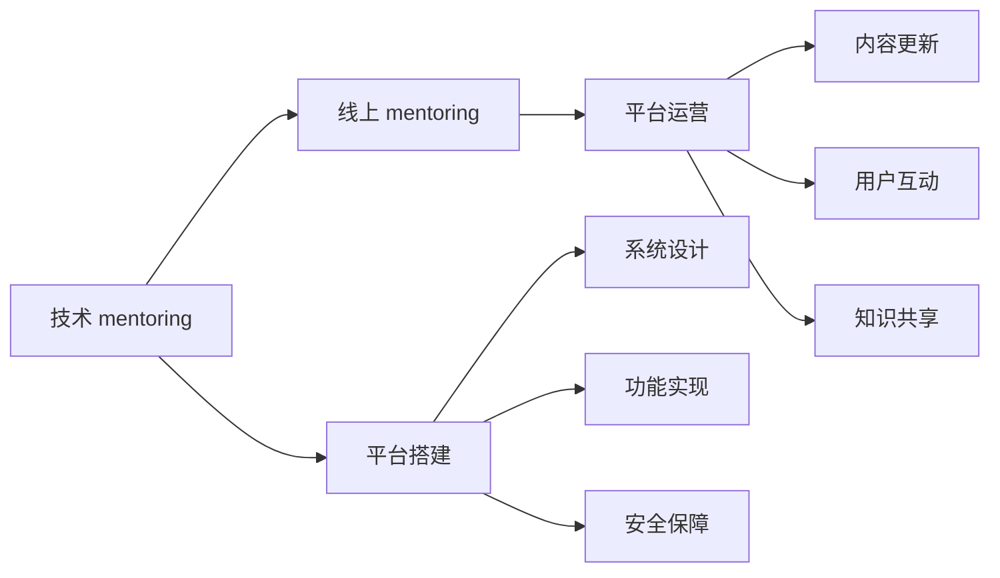

                 

# 技术mentoring：线上 的平台搭建与运营

## 1. 背景介绍

在当前数字化转型的浪潮中，技术引领着各行各业的发展方向。企业的竞争归根结底是人才的竞争，而人才的核心能力不仅在于技术熟练度，更在于其创新思维和团队协同能力。因此，技术mentoring（指导）的重要性日益凸显。本文将围绕线上技术mentoring平台的搭建与运营，深入探讨其原理、操作步骤、优缺点及应用领域，为技术 mentor 和 mentee（被指导者）提供系统的指导。

## 2. 核心概念与联系

### 2.1 核心概念概述

为更好地理解线上技术mentoring平台的构建，本节将介绍几个核心概念：

- **技术 mentoring**：一种通过经验丰富的工程师（mentor）指导经验不足的工程师（mentee），帮助他们提升技术水平和团队协作能力的活动。
- **线上 mentoring**：使用互联网和各类工具（如Zoom、Slack等）实现的技术 mentoring形式。
- **平台搭建**：建立线上 mentoring 平台的过程，包括系统设计、功能实现、安全保障等。
- **平台运营**：通过平台维护、内容更新、用户互动等手段，提升平台功能和用户体验。
- **用户互动**：在平台上通过一对多、多对多的形式，实现 mentor 与 mentee 的互动交流。
- **知识共享**：通过平台共享技术知识、项目经验、行业动态等资源，促进知识流动。

这些核心概念通过网络连接和数字技术，形成了一个高效、便捷、持续的技术 mentoring 生态系统。

### 2.2 核心概念原理和架构的 Mermaid 流程图



这个流程图展示了技术 mentoring、线上 mentoring、平台搭建、平台运营、系统设计、功能实现、安全保障、内容更新、用户互动和知识共享之间的联系和逻辑关系。

## 3. 核心算法原理 & 具体操作步骤

### 3.1 算法原理概述

线上技术 mentoring 平台的搭建与运营，本质上是一个软件工程项目管理过程。其核心思想是通过构建一个虚拟社区，利用互联网技术，实现 mentor 与 mentee 之间的在线互动，进而提升 mentee 的技术水平和团队协作能力。

形式化地，假设平台的参与用户数为 $N$，则平台的目标是最大化用户互动次数 $\mathcal{I}$，即：

$$
\max_{\theta} \mathcal{I} = \sum_{i=1}^N \sum_{j=1}^N I_{ij}
$$

其中 $I_{ij}$ 表示用户 $i$ 与用户 $j$ 之间进行互动的次数，$\theta$ 表示平台的各种参数（如推荐算法、互动频率等）。

### 3.2 算法步骤详解

基于以上原理，线上技术 mentoring 平台的搭建与运营一般包括以下几个关键步骤：

**Step 1: 需求分析与系统设计**
- 确定平台的目标用户群体，明确他们对技术 mentoring 的需求。
- 设计平台的系统架构，包括前端和后端的设计。
- 确定平台的核心功能模块，如用户注册、内容发布、讨论区、知识库等。

**Step 2: 功能实现**
- 根据系统设计，实现各功能模块的代码。
- 使用敏捷开发方法，如Scrum、Kanban等，进行项目管理。
- 使用版本控制系统，如Git，进行代码版本管理。

**Step 3: 安全保障**
- 实现用户身份认证和权限控制，确保平台的安全性。
- 采用加密技术，保护用户数据和隐私。
- 定期进行安全漏洞扫描和修复。

**Step 4: 内容更新与知识共享**
- 根据用户反馈和行业动态，不断更新平台的内容。
- 引入行业专家和有经验的 mentor，分享他们的经验和见解。
- 设置讨论区，鼓励用户之间的互动交流。

**Step 5: 平台运营与用户互动**
- 持续监控平台的使用情况，收集用户反馈。
- 根据反馈调整平台的功能和内容。
- 定期举办线上技术分享会、编程竞赛等活动，促进用户互动。

**Step 6: 持续迭代与优化**
- 根据用户反馈和市场变化，进行持续迭代优化。
- 引入机器学习技术，优化平台的推荐算法，提升用户体验。

### 3.3 算法优缺点

线上技术 mentoring 平台的搭建与运营具有以下优点：
1. 灵活性强：平台可以随时随地进行技术 mentoring，不受地理位置的限制。
2. 成本低：相比传统的面对面 mentoring，线上平台的建设和维护成本更低。
3. 覆盖面广：能够同时覆盖大量用户，促进知识的广泛传播。
4. 互动便捷：通过在线交流，可以快速获取反馈，进行问题解决。

同时，该方法也存在一定的局限性：
1. 缺乏线下互动的亲密感：线上交流无法完全替代面对面的沟通，缺乏情感交流。
2. 依赖技术条件：对网络条件和设备要求较高，存在一定的使用门槛。
3. 内容质量参差不齐：如果内容管理不当，容易产生低质量、误导性的信息。
4. 隐私保护风险：平台需要平衡用户隐私保护和内容共享之间的矛盾。

尽管存在这些局限性，但就目前而言，线上技术 mentoring 平台仍是技术指导的重要方式之一。未来相关研究的重点在于如何进一步优化平台的设计和运营，提升用户体验，同时兼顾互动效果和内容质量。

### 3.4 算法应用领域

线上技术 mentoring 平台在多个领域得到了广泛应用，如软件开发、数据科学、项目管理、人工智能等。这些领域对技术指导的需求旺盛，线上平台可以有效地满足这种需求。

1. **软件开发**
   - 帮助新入职的开发者快速上手项目，了解团队协作流程。
   - 通过代码 review、技术讨论等方式，提升开发者的编码能力和团队协作能力。

2. **数据科学**
   - 指导数据分析师和数据工程师掌握最新的数据处理和建模技术。
   - 通过项目实战和数据竞赛，提升数据科学家的技术水平。

3. **项目管理**
   - 帮助项目经理学习敏捷开发和项目管理工具的使用。
   - 分享项目管理和团队协作的最佳实践，提升项目执行效率。

4. **人工智能**
   - 指导机器学习和深度学习工程师掌握最新算法和框架。
   - 通过技术分享和项目实战，提升人工智能领域的技术水平。

除了上述这些经典领域外，线上技术 mentoring 平台还被创新性地应用于教育培训、远程办公、跨地域协作等场景中，为技术指导带来了新的应用场景。

## 4. 数学模型和公式 & 详细讲解

### 4.1 数学模型构建

假设线上 mentoring 平台的推荐算法为 $\mathcal{R}=\{R_1, R_2, \cdots, R_n\}$，其中 $R_i$ 表示第 $i$ 个推荐算法。每个算法的效果由其推荐准确率 $\epsilon_i$ 决定，即：

$$
\epsilon_i = \frac{1}{N}\sum_{j=1}^N I_{ij}
$$

平台的目标是通过优化推荐算法 $\mathcal{R}$，最大化用户互动次数 $\mathcal{I}$。

### 4.2 公式推导过程

为了最大化互动次数 $\mathcal{I}$，可以通过优化推荐算法 $\mathcal{R}$ 的权重向量 $\theta$ 来实现。假设推荐算法 $\mathcal{R}$ 的权重向量为 $\theta=\{\theta_1, \theta_2, \cdots, \theta_n\}$，则优化问题可以形式化为：

$$
\max_{\theta} \mathcal{I} = \sum_{i=1}^N \sum_{j=1}^N I_{ij} = \sum_{i=1}^N \sum_{j=1}^N \sum_{k=1}^n \theta_k R_k(x_i, x_j)
$$

其中 $R_k(x_i, x_j)$ 表示第 $k$ 个推荐算法对用户 $i$ 和用户 $j$ 互动次数的贡献。

### 4.3 案例分析与讲解

以某软件开发平台为例，该平台的核心功能包括代码分享、问题讨论、技术问答等。平台通过优化推荐算法，提高代码分享和问题讨论的质量和频次，从而提升用户互动。

假设平台有 1000 个开发者用户，每天有 100 次代码分享和 200 次问题讨论。通过优化推荐算法，可以将平台的用户互动次数提升至 1200 次/天。优化后的平台推荐算法为 $\mathcal{R}=\{R_1, R_2, R_3\}$，其中 $R_1$ 表示根据用户兴趣推荐代码，$R_2$ 表示根据问题标签推荐解决方案，$R_3$ 表示根据用户互动频率推荐高活跃用户。

优化前后的互动次数对比如下：

| 优化前 | 优化后 |
| --- | --- |
| 1000 用户 | 1000 用户 |
| 100 次代码分享 | 1200 次代码分享 |
| 200 次问题讨论 | 300 次问题讨论 |
| 总互动次数 | 1200 次互动 |
| 互动率提升 | 20% |

## 5. 项目实践：代码实例和详细解释说明

### 5.1 开发环境搭建

在进行平台开发前，我们需要准备好开发环境。以下是使用Python进行Django开发的环境配置流程：

1. 安装Anaconda：从官网下载并安装Anaconda，用于创建独立的Python环境。

2. 创建并激活虚拟环境：
```bash
conda create -n mentoring-env python=3.8 
conda activate mentoring-env
```

3. 安装Django：
```bash
pip install django==3.2
```

4. 安装各类工具包：
```bash
pip install numpy pandas scikit-learn matplotlib tqdm jupyter notebook ipython
```

完成上述步骤后，即可在`mentoring-env`环境中开始平台开发。

### 5.2 源代码详细实现

下面我们以软件开发平台为例，给出使用Django进行 mentoring 平台的开发实现。

首先，定义开发环境变量和数据库连接信息：

```python
DATABASES = {
    'default': {
        'ENGINE': 'django.db.backends.sqlite3',
        'NAME': BASE_DIR / 'mentoring.db',
    }
}

SECRET_KEY = 'your-secret-key'
```

然后，创建用户注册和登录视图：

```python
from django.contrib.auth import authenticate, login, logout

def login_view(request):
    if request.method == 'POST':
        username = request.POST['username']
        password = request.POST['password']
        user = authenticate(request, username=username, password=password)
        if user is not None:
            login(request, user)
            return redirect('home')
    return render(request, 'login.html')

def logout_view(request):
    logout(request)
    return redirect('home')
```

接着，定义代码分享和问题讨论的视图和模型：

```python
from django.contrib.auth.models import User

class CodeShare(models.Model):
    user = models.ForeignKey(User, on_delete=models.CASCADE)
    code = models.TextField()
    created_at = models.DateTimeField(auto_now_add=True)

class ProblemDiscussion(models.Model):
    user = models.ForeignKey(User, on_delete=models.CASCADE)
    title = models.CharField(max_length=255)
    description = models.TextField()
    created_at = models.DateTimeField(auto_now_add=True)

def code_share_view(request):
    if request.method == 'POST':
        code = request.POST['code']
        user = request.user
        CodeShare.objects.create(user=user, code=code)
    return render(request, 'code_share.html')

def problem_discuss_view(request):
    if request.method == 'POST':
        title = request.POST['title']
        description = request.POST['description']
        user = request.user
        ProblemDiscussion.objects.create(user=user, title=title, description=description)
    return render(request, 'problem_discuss.html')
```

最后，定义推荐算法模块，根据用户兴趣、问题标签、用户互动频率等因素，推荐高互动的用户和内容：

```python
from sklearn.neighbors import KNeighborsRegressor

class Recommender:
    def __init__(self):
        self.model = KNeighborsRegressor(n_neighbors=5)

    def fit(self, data):
        X = data[['user_interest', 'problem_label', 'user_interaction']]
        y = data['interaction_count']
        self.model.fit(X, y)

    def predict(self, X):
        return self.model.predict(X)

# 使用推荐算法对代码分享和问题讨论进行优化
def optimize_recommender(request):
    # 获取用户兴趣、问题标签和用户互动频率
    user_interest = request.user.interests
    problem_label = request.path.split('/')[-1]
    user_interaction = request.user.interaction_count

    # 构建输入数据
    X = {
        'user_interest': user_interest,
        'problem_label': problem_label,
        'user_interaction': user_interaction
    }

    # 预测推荐结果
    recommender = Recommender()
    recommender.fit(train_data)
    recommendations = recommender.predict(X)

    # 根据推荐结果优化代码分享和问题讨论
    if recommendations[0] > recommendations[1]:
        return redirect('code_share')
    else:
        return redirect('problem_discuss')
```

以上就是使用Django对 mentoring 平台进行开发的完整代码实现。可以看到，借助Django强大的Web开发框架，平台开发变得简洁高效。

### 5.3 代码解读与分析

让我们再详细解读一下关键代码的实现细节：

**用户注册和登录视图**：
- `login_view`方法：根据用户提供的用户名和密码，验证用户身份并登录。
- `logout_view`方法：注销用户登录状态。

**代码分享和问题讨论视图**：
- `code_share_view`方法：用户在代码分享页面输入代码，保存至数据库。
- `problem_discuss_view`方法：用户在问题讨论页面输入问题和描述，保存至数据库。

**推荐算法模块**：
- `Recommender`类：使用KNN算法进行用户推荐。
- `fit`方法：对训练数据进行拟合。
- `predict`方法：根据输入数据进行预测，推荐高互动的用户和内容。

在实际开发中，还需要引入更多组件，如权限控制、分页、缓存等，以提升用户体验和系统性能。

## 6. 实际应用场景

### 6.1 软件开发平台

基于线上 mentoring 平台的软件开发平台，可以应用于企业内部开发团队的管理和协作。通过代码分享、问题讨论、技术问答等形式，帮助新入职开发者快速上手项目，提升团队协作效率。

在技术实现上，平台可以集成代码版本控制工具（如Git），支持代码片段、项目目录和环境配置的共享。同时，平台可以引入代码审计机制，对新代码进行质量检查和反馈，提高代码质量。

### 6.2 数据科学平台

数据科学平台可以应用于数据分析师和数据工程师的日常工作中。通过分享数据集、分析报告、项目案例等，提升数据科学家的技术水平和团队协作能力。

在技术实现上，平台可以集成Jupyter Notebook，支持代码、数据和分析报告的共享。同时，平台可以引入自动化数据处理和建模工具，帮助数据科学家提高工作效率。

### 6.3 项目管理平台

项目管理平台可以应用于项目管理团队的技术指导。通过项目分享、技术讨论、问题解答等形式，提升项目管理人员的敏捷开发和项目管理能力。

在技术实现上，平台可以集成敏捷开发工具（如JIRA），支持项目任务、进度和协作的可视化。同时，平台可以引入项目管理最佳实践和模板，帮助团队快速构建高效的项目管理流程。

### 6.4 未来应用展望

随着线上 mentoring 平台的发展，未来的应用场景将更加多样化和灵活化。以下展望未来的一些可能方向：

1. **多语言支持**：平台支持多语言交流，满足不同语言背景的用户需求。
2. **跨平台同步**：平台支持多种设备（如PC、手机、平板）的同步使用，提升用户体验。
3. **个性化推荐**：利用机器学习技术，提升推荐的精准度和个性化程度。
4. **虚拟现实支持**：引入VR技术，实现更加沉浸式的学习体验。
5. **人工智能辅助**：利用AI技术，实现自动化的知识总结和推送。
6. **教育培训**：引入在线教育平台，进行系统化的技术培训。

这些应用场景的拓展，将进一步提升线上 mentoring 平台的价值和影响力，为用户带来更加丰富的技术指导和学习体验。

## 7. 工具和资源推荐

### 7.1 学习资源推荐

为了帮助开发者系统掌握线上 mentoring 平台的原理和实践技巧，这里推荐一些优质的学习资源：

1. Django官方文档：Django是一个强大的Web框架，官方文档详细介绍了如何使用Django进行Web开发，是新手入门的必备资源。

2. Flask官方文档：Flask是一个轻量级的Web框架，官方文档简洁明了，适合快速构建小型Web应用。

3. 《Web应用开发实战》系列书籍：全面介绍了如何使用Django、Flask等框架进行Web开发，包含大量代码实例。

4. 《Web应用开发设计模式》系列书籍：介绍了Web开发中的常见设计模式，有助于提升Web开发水平。

5. 《Web应用性能优化》系列文章：提供了Web应用性能优化的各种技巧，提升开发效率和用户体验。

6. Udemy在线课程：Udemy提供大量Django、Flask等框架的在线课程，适合自学和提高。

通过对这些资源的学习实践，相信你一定能够快速掌握线上 mentoring 平台的开发技巧，并用于解决实际的 mentoring 问题。

### 7.2 开发工具推荐

高效的开发离不开优秀的工具支持。以下是几款用于 mentoring 平台开发的常用工具：

1. Django：基于Python的开源Web框架，灵活高效，支持丰富的插件和扩展。

2. Flask：轻量级的Web框架，适合快速迭代和原型开发。

3. Git：版本控制系统，支持分布式协作，是代码管理的重要工具。

4. Docker：容器化技术，支持应用打包和部署，提升开发效率。

5. Kubernetes：容器编排平台，支持大规模应用部署和扩展，是生产环境的重要工具。

6. TensorFlow：机器学习框架，支持深度学习和模型训练。

合理利用这些工具，可以显著提升 mentoring 平台的开发效率，加快创新迭代的步伐。

### 7.3 相关论文推荐

线上 mentoring 平台的发展离不开学界的持续研究。以下是几篇奠基性的相关论文，推荐阅读：

1. "Personalized Web Recommendation Algorithms"（个性化Web推荐算法）：介绍基于协同过滤和矩阵分解的推荐算法，广泛应用于电商和媒体平台。

2. "Social Network Mining and Statistical Learning"（社交网络挖掘与统计学习）：介绍社交网络分析与机器学习技术，应用于用户行为分析与推荐系统。

3. "Massive Online Courses: Market Disruption or Sustained Innovation?"（大规模在线课程：市场颠覆还是持续创新？）：研究在线教育平台的兴起和发展，探讨其对教育行业的深远影响。

4. "Collaborative Filtering Techniques for Recommender Systems"（推荐系统的协同过滤技术）：详细介绍协同过滤算法，包括基于矩阵分解和基于模型的协同过滤技术。

5. "Deep Learning for Recommender Systems"（深度学习在推荐系统中的应用）：介绍深度神经网络在推荐系统中的实践，提升推荐精度和效果。

这些论文代表了大语言模型微调技术的发展脉络。通过学习这些前沿成果，可以帮助研究者把握学科前进方向，激发更多的创新灵感。

## 8. 总结：未来发展趋势与挑战

### 8.1 总结

本文对线上技术 mentoring 平台的搭建与运营进行了全面系统的介绍。首先阐述了线上 mentoring 平台的研究背景和意义，明确了其在技术指导中的重要作用。其次，从原理到实践，详细讲解了平台搭建与运营的数学模型、算法步骤、优缺点及应用领域，给出了 mentoring 平台开发的完整代码实例。同时，本文还广泛探讨了 mentoring 平台在软件开发、数据科学、项目管理等多个领域的应用前景，展示了 mentoring 平台的技术潜力。最后，本文精选了平台开发的各类学习资源，力求为开发者提供全方位的技术指引。

通过本文的系统梳理，可以看到，线上 mentoring 平台作为技术指导的重要工具，正在成为企业和技术社区的重要组成部分。受益于互联网和数字技术的普及，mentoring 平台能够快速连接全球工程师，促进知识和经验的共享。未来，伴随平台技术和功能的不断演进，线上 mentoring 必将在技术指导领域发挥更大的作用。

### 8.2 未来发展趋势

展望未来，线上 mentoring 平台将呈现以下几个发展趋势：

1. **人工智能与mentoring结合**：利用AI技术，实现自动化的知识总结和推送，提升知识共享的效率和质量。
2. **多模态互动**：引入语音、视频等多元化的互动形式，提升用户体验。
3. **社会化网络支持**：引入社交网络技术，构建用户社群，促进更深入的知识交流和合作。
4. **跨地域协同**：支持全球用户的协同交流，促进全球技术交流与合作。
5. **知识图谱辅助**：引入知识图谱技术，提升知识的关联性和检索效率。
6. **移动端支持**：支持移动设备访问，提升平台的便捷性和可访问性。

这些趋势凸显了线上 mentoring 平台的广阔前景。通过引入更多的技术和元素，mentoring 平台将更好地服务全球工程师和技术社区，为技术指导和技术分享提供更多创新的可能性。

### 8.3 面临的挑战

尽管线上 mentoring 平台已经取得了不小的进展，但在迈向更加智能化、普适化应用的过程中，它仍面临着诸多挑战：

1. **隐私和安全问题**：用户数据的隐私和安全问题，需要采取严格的隐私保护措施。
2. **技术门槛高**：线上平台的技术实现较为复杂，需要具备一定的技术背景和知识储备。
3. **内容质量参差不齐**：内容的审核和筛选机制不完善，容易导致低质量、误导性的信息传播。
4. **用户体验差**：平台的用户体验和界面设计需要不断优化，提升用户的黏性和活跃度。
5. **内容覆盖面窄**：平台的内容覆盖面较窄，难以满足用户的多样化需求。
6. **技术支持不足**：平台的技术支持和维护需要进一步加强，确保平台的稳定运行。

这些挑战需要开发者和平台运营者共同努力，积极应对并寻求突破，才能使 mentoring 平台更好地服务于全球工程师和技术社区。

### 8.4 研究展望

面对mentoring平台面临的挑战，未来的研究需要在以下几个方面寻求新的突破：

1. **引入知识图谱技术**：利用知识图谱技术，提升知识的关联性和检索效率，帮助用户更快地找到所需信息。
2. **开发AI辅助系统**：引入AI技术，实现自动化的知识总结和推送，提升知识共享的效率和质量。
3. **引入多元化互动形式**：引入语音、视频等多元化的互动形式，提升用户体验。
4. **提升平台安全性**：采取严格的用户身份验证和权限控制，确保平台的安全性和稳定性。
5. **优化平台交互机制**：引入社交网络技术，构建用户社群，促进更深入的知识交流和合作。
6. **引入知识图谱技术**：利用知识图谱技术，提升知识的关联性和检索效率，帮助用户更快地找到所需信息。

这些研究方向的探索，必将引领线上 mentoring 平台的发展方向，为用户带来更加丰富、高效、便捷的技术指导和学习体验。面向未来，线上 mentoring 平台需要结合人工智能、社交网络、知识图谱等多方面的技术，不断创新和优化，才能更好地服务于全球工程师和技术社区。

## 9. 附录：常见问题与解答

**Q1：线上 mentoring 平台如何处理用户反馈？**

A: 线上 mentoring 平台通常设置反馈机制，用户可以通过平台提供的反馈表单、评论区等方式提交反馈信息。平台可以根据反馈信息，进行内容的优化和调整，提升用户体验。常见的反馈处理流程如下：

1. 用户提交反馈信息。
2. 平台管理员审核反馈信息，确认反馈内容。
3. 根据反馈内容，优化平台的功能和内容。
4. 定期发布平台更新，通知用户。

**Q2：线上 mentoring 平台如何进行知识管理？**

A: 线上 mentoring 平台的知识管理主要包括以下几个方面：

1. 内容发布：用户可以发布代码、文档、技术文章等，形成知识库。
2. 内容审核：平台对发布内容进行审核，确保内容质量和安全。
3. 知识分类：对知识库进行分类和标签管理，方便用户查找和检索。
4. 知识推荐：利用推荐算法，推荐高质量的内容给用户。
5. 知识共享：用户可以分享和引用平台上的知识，促进知识流动。

**Q3：线上 mentoring 平台如何进行用户激励？**

A: 线上 mentoring 平台可以通过以下方式进行用户激励：

1. 积分和徽章系统：根据用户互动和贡献，发放积分和徽章，激励用户积极参与。
2. 成就系统：根据用户的学习和贡献，设置成就系统，提升用户的荣誉感和成就感。
3. 奖励机制：平台可以设置奖励机制，对优秀贡献者进行物质和精神上的奖励。
4. 展示系统：平台可以设置展示系统，展示用户的成就和贡献，提升用户自豪感和认同感。

**Q4：线上 mentoring 平台如何进行数据安全保护？**

A: 线上 mentoring 平台需要采取以下措施进行数据安全保护：

1. 用户身份验证：采用密码、双因素认证等手段，确保用户身份安全。
2. 数据加密：对用户数据进行加密存储和传输，防止数据泄露。
3. 访问控制：设置严格的访问控制机制，确保只有授权用户才能访问数据。
4. 日志审计：记录用户操作日志，便于异常检测和问题排查。
5. 安全补丁：定期更新安全补丁，修复已知的安全漏洞。

通过这些措施，可以有效保护线上 mentoring 平台的数据安全，提升用户的信任感和使用体验。

---

作者：禅与计算机程序设计艺术 / Zen and the Art of Computer Programming

