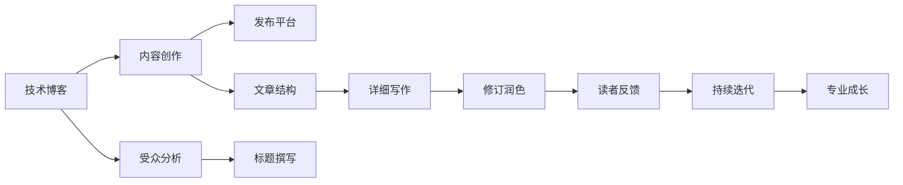

                 

# 技术写作：从博客到专栏作家之路

## 1. 背景介绍

### 1.1 问题由来

随着信息技术的飞速发展，技术博客与专栏成为了人们获取知识、交流观点和跟踪行业动态的重要渠道。无论是软件工程师、数据科学家、AI专家还是产品经理，几乎所有的IT从业者都曾尝试过通过撰写博客来分享自己的技术见解和实践经验。

然而，要在众多技术博客中脱颖而出，成为受人尊重的专栏作家，并非易事。一方面，技术内容往往高度专业化，需要深厚的专业知识和深入浅出的表达能力；另一方面，作者还需具备一定的创意思维和深度分析，才能在众多博文中脱颖而出。

本文将从技术写作的入门到专栏作家的成长路径，系统介绍如何通过撰写高质量的技术博客，逐步提升写作水平，最终实现技术专栏作家的梦想。

## 2. 核心概念与联系

### 2.1 核心概念概述

要成为技术写作高手和专栏作家，首先需要明确一些核心概念：

- **技术博客**：以技术为主题的博客，主要分享技术知识、项目经验、行业洞察等内容，是技术从业者展示自己专业能力的重要平台。

- **专栏作家**：在特定技术领域内，持续输出高质量、有深度、有影响力的文章，建立广泛读者群体的作者。

- **内容创作**：技术写作的核心，通过准确、简洁、生动的语言，表达出深刻的技术见解和实践经验。

- **受众分析**：了解目标读者的需求和兴趣，针对性地撰写文章，提高内容的阅读率和影响力。

- **持续迭代**：写作是一个不断优化、不断进步的过程，需定期回顾和总结以往作品，持续改进写作技巧和方法。

这些核心概念之间存在紧密的联系，通过持续学习和实践，最终能够在技术写作领域实现从入门到精通的跨越。

### 2.2 核心概念原理和架构的 Mermaid 流程图



通过以上流程图可以看出，技术写作的流程从内容创作到发布，再到受众分析，是一个不断循环的过程。只有不断优化写作技巧，才能逐步成长为专栏作家。

## 3. 核心算法原理 & 具体操作步骤

### 3.1 算法原理概述

技术写作的原理可以类比为一个优化问题，其目标是最小化读者获取知识的难度和成本，同时最大化文章的影响力和传播度。

假设一篇技术文章的读者体验可以通过以下指标来衡量：
- 易读性（$R$）：文章结构是否清晰，语言是否简明易懂。
- 相关性（$C$）：文章内容是否切合目标受众的需求和兴趣。
- 新颖性（$N$）：文章是否提供了新的观点和信息。

优化目标为：

$$
\minimize_{\text{文章}} (R + C + N)
$$

### 3.2 算法步骤详解

**Step 1: 确定主题**
- 根据自身专业和兴趣领域，选择有价值且受众感兴趣的主题。
- 利用搜索引擎和论坛，确认该主题目前的热点和未被充分探讨的方面。

**Step 2: 受众分析**
- 调研目标受众的特征，如年龄、职业、技术背景等。
- 参考相关评论和反馈，理解受众的痛点和需求。

**Step 3: 结构设计**
- 确定文章结构，如引言、正文、结论等，确保逻辑清晰。
- 每个部分设定核心观点和关键信息点，确保内容紧凑。

**Step 4: 内容创作**
- 撰写引言，明确文章目的和核心观点。
- 详述技术原理和实现细节，确保描述准确、全面。
- 讨论实际应用场景，举例说明，增加可读性。
- 总结和展望，提出未来研究方向或改进建议。

**Step 5: 修订润色**
- 检查语法和拼写错误，确保文章流畅。
- 精简不必要的文字，保持信息密度。
- 引入图表和代码片段，提高信息展示效果。
- 邀请同事或同行评审，获取反馈和改进建议。

**Step 6: 发布和反馈**
- 选择合适的发布平台，如博客、技术社区、个人网站等。
- 定时更新，保持读者关注。
- 收集读者反馈，了解受众需求和问题。
- 根据反馈进行持续迭代，提升文章质量。

### 3.3 算法优缺点

技术写作的算法具有以下优点：
- 结构化设计，使得文章逻辑清晰，易于理解。
- 基于受众分析，定制化撰写，提升文章相关性。
- 采用修订润色，确保文章质量，提升读者体验。
- 持续迭代，不断优化写作技巧，实现专业成长。

同时，也存在一些局限性：
- 需要较多的时间和精力，特别是在初期阶段。
- 需要较好的专业知识和表达能力。
- 对于复杂主题，可能难以全面覆盖。
- 受众反馈有时难以量化。

### 3.4 算法应用领域

技术写作算法不仅适用于技术博客的写作，还可以应用于多种场景，如项目文档、技术报告、培训材料等。其通用性和适用性使其成为技术写作领域的核心方法论。

## 4. 数学模型和公式 & 详细讲解 & 举例说明

### 4.1 数学模型构建

我们可以使用以下数学模型来描述技术写作的优化目标：

$$
\minimize_{\text{文章}} \quad f(\text{文章}) = w_R \times R + w_C \times C + w_N \times N
$$

其中 $w_R$, $w_C$, $w_N$ 为各指标的权重，可以通过调研和实验确定。

### 4.2 公式推导过程

以一篇关于深度学习模型的博客为例，我们推导一下其易读性指标的计算公式：

1. 文章长度（$L$）：越短的篇幅，越容易阅读，记 $L$ 为文章长度。
2. 段落长度（$P$）：每一段落的平均长度，记 $P$ 为段落长度。
3. 词汇丰富度（$V$）：词汇多样性越高，越易读，记 $V$ 为词汇丰富度。

易读性 $R$ 可以表示为：

$$
R = \frac{1}{L \times P} \times \sum_{i} V_i
$$

其中 $V_i$ 为第 $i$ 段落的词汇丰富度。

### 4.3 案例分析与讲解

以一篇关于Transformer模型的博客为例，我们将其分为引言、理论基础、代码实现、实际应用四个部分。

- 引言：明确Transformer模型的引入背景和研究意义，确保读者了解文章目的。
- 理论基础：详细阐述Transformer的原理和创新点，确保描述准确、全面。
- 代码实现：通过代码示例和注释，帮助读者理解和实现模型。
- 实际应用：结合具体应用场景，如文本分类、机器翻译等，展示模型的实用价值。

通过这种结构化设计，文章的结构清晰，读者可以轻松把握重点。

## 5. 项目实践：代码实例和详细解释说明

### 5.1 开发环境搭建

要撰写高质量的技术博客，首先需要搭建一个稳定的开发环境。以下是一些常用的开发工具和平台：

- **编辑器**：如Visual Studio Code、Atom、Sublime Text等，选择适合自己的代码编辑器。
- **版本控制**：如Git，帮助管理代码版本和协作。
- **文档生成工具**：如Sphinx、Doxygen，生成代码文档和API文档。
- **云平台**：如Github、GitLab等，托管代码和发布文章。

### 5.2 源代码详细实现

以一篇关于机器学习模型的博客为例，我们撰写的代码示例如下：

```python
import pandas as pd
from sklearn.linear_model import LogisticRegression
from sklearn.metrics import accuracy_score

# 数据准备
data = pd.read_csv('data.csv')
X = data.drop(['target'], axis=1)
y = data['target']

# 模型训练
model = LogisticRegression()
model.fit(X, y)

# 预测并评估
y_pred = model.predict(X)
accuracy = accuracy_score(y, y_pred)
print(f'Accuracy: {accuracy:.2f}')
```

在代码中，我们首先使用Pandas库读取数据集，然后使用Scikit-learn库中的LogisticRegression模型进行训练和预测，并计算模型的准确率。

### 5.3 代码解读与分析

这段代码实现了简单的逻辑回归模型训练和评估过程。首先，我们使用Pandas库读取数据集，并将其分为特征 $X$ 和标签 $y$。接着，使用Scikit-learn库的LogisticRegression模型进行训练，并使用evaluate()方法评估模型的准确率。

## 6. 实际应用场景

### 6.1 技术博客

技术博客是展示技术水平和专业能力的绝佳平台。通过撰写博客，不仅能加深自己对技术的理解和掌握，还能帮助他人解决实际问题。

### 6.2 技术报告

技术报告常用于项目评审、技术交流等场合。高质量的技术报告不仅能体现作者的专业能力，还能提升团队的技术水平。

### 6.3 培训材料

技术培训材料是帮助新人快速上手新技术的重要工具。编写清晰、详细的培训材料，可以帮助新人在较短时间内掌握新技能。

### 6.4 未来应用展望

随着技术的不断进步，技术写作将更多地结合人工智能和大数据技术，如自然语言处理(NLP)、机器学习(ML)等，实现自动生成文章摘要、自动校对等智能化功能，进一步提升技术写作的效率和质量。

## 7. 工具和资源推荐

### 7.1 学习资源推荐

要成为技术写作高手，需要不断学习和积累。以下是一些推荐的资源：

- **在线课程**：如Coursera、Udacity上的技术写作课程，系统学习写作技巧。
- **书籍**：《写作的艺术》、《风格的要素》等经典书籍，提升写作基础。
- **博客**：如Medium、CSDN等平台，阅读优秀博文，学习写作范例。

### 7.2 开发工具推荐

高效的工具能够大大提升写作效率，以下是一些推荐的开发工具：

- **Markdown编辑器**：如Typora、Jekyll等，支持语法高亮和自动排版。
- **代码高亮器**：如Prism.js，自动生成代码高亮效果。
- **在线工具**：如GitHub Pages、Medium等，发布和分享文章。

### 7.3 相关论文推荐

技术写作相关的论文研究，能够提供深入的理论支撑。以下是几篇推荐的论文：

- **《技术写作中的模型与方法》**：探讨技术写作的模型和方法，提供理论支撑。
- **《如何写好技术博客》**：提供技术写作的实用技巧和方法。
- **《基于自然语言处理的技术写作优化》**：利用NLP技术优化技术写作，提升文章质量。

## 8. 总结：未来发展趋势与挑战

### 8.1 研究成果总结

技术写作是一项综合性的能力，包括内容创作、受众分析、结构设计、写作技巧等多个方面。通过不断实践和学习，逐步提升写作水平，实现从入门到精通的跨越。

### 8.2 未来发展趋势

未来技术写作将更加智能化和自动化，利用人工智能和大数据技术提升写作效率和质量。同时，技术写作将更多地结合多媒体和互动技术，提升文章的交互性和可读性。

### 8.3 面临的挑战

技术写作需要不断积累和实践，对于刚入门者来说，可能会面临以下挑战：
- 缺乏经验和知识储备。
- 难以找到合适的受众。
- 保持持续的创作热情。

### 8.4 研究展望

未来的研究可以从以下几个方面展开：
- 自动化写作工具的研究，提升写作效率。
- 利用大数据分析受众行为，优化写作内容。
- 引入多媒体和互动技术，提升文章表现力。

## 9. 附录：常见问题与解答

### Q1: 如何提高技术写作的表达能力？

A: 提高表达能力需要大量的实践和积累。可以从以下几个方面入手：
- 多阅读优秀博文，学习写作范例。
- 多练习写作，不断总结和反思。
- 学习文学和语言学知识，提升语言表达能力。

### Q2: 如何找到合适的受众？

A: 可以通过以下几个渠道找到合适的受众：
- 在专业论坛和社区发布文章，获取反馈。
- 利用社交媒体推广，扩大影响力。
- 参与技术会议和讲座，与读者互动。

### Q3: 如何保持持续的创作热情？

A: 持续的创作热情需要不断找到写作的乐趣和成就感。可以从以下几个方面入手：
- 设定明确的写作目标，如每月一篇文章。
- 参加写作社群，互相激励和监督。
- 不断探索新技术和新领域，保持好奇心和热情。

### Q4: 如何提升文章的互动性？

A: 提升文章的互动性可以通过以下几个方法：
- 在文章中加入问答环节，引导读者留言讨论。
- 利用投票和评论功能，了解读者反馈。
- 制作互动图表和代码示例，增加文章的趣味性。

总之，技术写作是一个不断学习和实践的过程。通过系统学习和持续改进，最终能够实现从技术博客到专栏作家的成长，为行业贡献更多有价值的技术见解和实践经验。

---

作者：禅与计算机程序设计艺术 / Zen and the Art of Computer Programming

