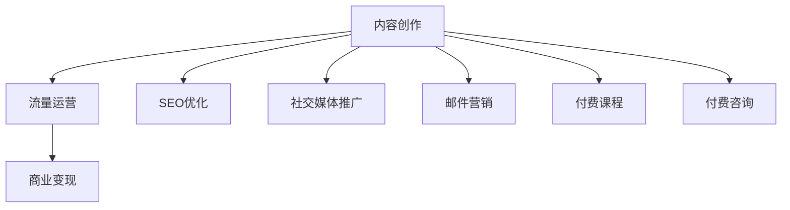

                 

# 技术博客变现：策略与方法

> 关键词：博客变现，技术内容创作，内容营销，流量变现，多渠道运营

## 1. 背景介绍

### 1.1 问题由来

在互联网的浪潮中，技术博客日益成为技术人展示技术积累、分享技术经验的重要平台。然而，传统博客的流量变现能力有限，许多技术博客创作者在坚持分享优质内容的同时，面临着生计压力，难以持续运营。为了解决这个问题，本文将介绍一些有效的方法和技术，帮助技术博客创作者提升变现能力，实现流量变现。

### 1.2 问题核心关键点

技术博客变现的关键在于提高内容的价值，吸引更多的流量，并通过这些流量实现商业价值。这要求技术博客创作者不仅要有高质量的技术内容，还要学会如何推广内容、优化流量结构、利用多种渠道变现。

本文将深入探讨如何通过内容创作、流量运营、商业变现三个关键环节，系统化地提升技术博客的变现能力。

## 2. 核心概念与联系

### 2.1 核心概念概述

为更好地理解技术博客变现的方法，本节将介绍几个密切相关的核心概念：

- **博客变现**：通过博客内容的阅读量、广告收入、付费订阅、付费咨询、技术培训等方式实现商业收入的过程。
- **内容创作**：技术创作者通过撰写技术博客、制作视频教程、设计技术图表等方式分享技术知识和经验。
- **流量运营**：通过SEO优化、社交媒体推广、邮件营销等方式提升博客的流量和用户参与度，以增加变现机会。
- **商业变现**：将博客流量转化为商业价值的具体方式，如广告收入、付费订阅、课程销售、技术咨询等。

这些核心概念之间的逻辑关系可以通过以下Mermaid流程图来展示：



这个流程图展示出技术博客变现的过程：

1. 内容创作者创作高质量的技术内容。
2. 通过SEO、社交媒体、邮件营销等方式运营流量，吸引更多读者。
3. 将流量转化为广告收入、付费订阅、课程销售等商业价值。

## 3. 核心算法原理 & 具体操作步骤

### 3.1 算法原理概述

技术博客变现的过程，本质上是通过内容创作和流量运营，不断提升博客的商业价值。这一过程的数学模型可以抽象为以下形式：

设博客流量为 $F$，转化率为 $C$，每点击广告的收入为 $A$，订阅费用为 $S$，课程价格为 $K$。则博客的总收益 $R$ 可以表示为：

$$
R = F \times C \times (A \times \sum_{i} P_i + S + K)
$$

其中 $P_i$ 表示第 $i$ 种广告的点击率。

通过优化 $F$ 和 $C$，即增加流量和提高转化率，可以显著提升博客的总收益 $R$。

### 3.2 算法步骤详解

技术博客变现的主要步骤包括：

**Step 1: 内容创作与优化**
- 创作高质量、有价值的技术文章，涵盖技术原理、应用场景、实战案例、代码实践等内容。
- 定期更新内容，保持博客活跃度，吸引更多读者。
- 设计独特的博客风格和布局，提高用户体验。

**Step 2: 流量运营与推广**
- 通过SEO优化，提升博客在搜索引擎中的排名，增加自然流量。
- 在社交媒体平台（如Twitter、LinkedIn、GitHub等）发布技术文章，吸引关注。
- 通过邮件营销，向订阅者发送最新的博客内容和技术分享。
- 参与技术社区和论坛的讨论，建立个人品牌影响力。

**Step 3: 商业变现与盈利**
- 通过广告收入（如Google AdSense、Baidu Ads等）实现流量变现。
- 通过付费订阅平台（如Substack、Patreon等）提供独家内容，增加收益来源。
- 制作技术课程或电子书，通过在线平台（如Udemy、Coursera等）进行销售。
- 提供付费技术咨询或培训，利用博客积累的技术经验，提供个性化服务。

### 3.3 算法优缺点

技术博客变现的优点包括：

1. **市场广阔**：技术博客覆盖的领域广泛，市场需求大。
2. **成本低廉**：相比于其他内容变现方式，博客变现的启动成本较低。
3. **品牌效应**：高质量博客可以提升作者的个人品牌和知名度。

缺点则包括：

1. **流量不稳定**：SEO效果和社交媒体推广的效果可能存在波动。
2. **变现门槛高**：高质量的内容创作和流量运营需要较高的专业技能。
3. **市场竞争激烈**：技术博客市场竞争激烈，需要持续创新和优质内容吸引用户。

### 3.4 算法应用领域

技术博客变现方法广泛适用于技术博客、在线课程、技术咨询服务等多个领域。例如：

- **技术博客**：通过广告收入、付费订阅、技术咨询等方式实现变现。
- **在线课程**：制作高质量技术课程，通过在线平台销售课程，获取收益。
- **技术咨询**：利用博客积累的技术经验，提供有偿的技术咨询和培训服务。

## 4. 数学模型和公式 & 详细讲解

### 4.1 数学模型构建

博客变现的数学模型可以抽象为以下形式：

$$
R = F \times C \times (A \times \sum_{i} P_i + S + K)
$$

其中：
- $F$：博客流量（单位：访问量/月）
- $C$：流量转化率（单位：点击率/%）
- $A$：每点击广告的收入（单位：美元/点击）
- $P_i$：第 $i$ 种广告的点击率（单位：%）
- $S$：订阅费用（单位：美元/订阅者）
- $K$：课程价格（单位：美元/课程）

### 4.2 公式推导过程

以订阅费用为例，假设博客每月的平均访问量为 $F$，订阅费用为 $S$，订阅者转化率为 $C$，则博客通过订阅的月收益为：

$$
R_{\text{sub}} = F \times C \times S
$$

假设博客每月的平均访问量为 $F$，点击率为 $P$，每点击广告的收入为 $A$，则博客通过广告的月收益为：

$$
R_{\text{ads}} = F \times P \times A
$$

综合以上两种收益方式，博客的总收益为：

$$
R = R_{\text{sub}} + R_{\text{ads}} = F \times C \times S + F \times P \times A
$$

这就是博客变现的数学模型。通过优化模型的各个参数，可以实现博客的最大化收益。

### 4.3 案例分析与讲解

以某技术博客为例，假设其每月的平均访问量为 $F=10,000$，订阅费用为 $S=50$，订阅者转化率为 $C=10\%$，点击率为 $P=2\%$，每点击广告的收入为 $A=1$ 美元，广告点击率为 $P_1=1\%$，$P_2=0.5\%$。则博客的总收益为：

$$
R = 10,000 \times 10\% \times (50 + 1 \times 2\% \times (1\% \times 1 + 0.5\% \times 1))
$$

$$
R = 10,000 \times 0.1 \times (50 + 0.02 \times (0.01 + 0.005))
$$

$$
R = 10,000 \times 0.1 \times (50 + 0.02 \times 0.015)
$$

$$
R = 10,000 \times 0.1 \times 50.003
$$

$$
R = 5000.15
$$

可以看出，通过优化流量和转化率，提高广告收入和订阅收入，博客的总收益可以达到5000美元以上。

## 5. 项目实践：代码实例和详细解释说明

### 5.1 开发环境搭建

在进行技术博客变现实践前，我们需要准备好开发环境。以下是使用Python进行Flask框架开发的环境配置流程：

1. 安装Flask：从官网下载并安装Flask，用于快速搭建博客平台。

```bash
pip install Flask
```

2. 创建Flask应用：创建一个名为`blog`的目录，并在其中创建一个名为`__init__.py`的文件，用于初始化Flask应用。

```python
from flask import Flask

app = Flask(__name__)

@app.route('/')
def home():
    return 'Hello, World!'

if __name__ == '__main__':
    app.run(debug=True)
```

3. 创建博客模板：创建一个名为`templates`的目录，并在其中创建`home.html`模板文件，用于展示博客内容。

```html
<!DOCTYPE html>
<html>
<head>
    <title>{{ title }}</title>
</head>
<body>
    <h1>{{ title }}</h1>
    <p>{{ content }}</p>
</body>
</html>
```

4. 创建博客文章：在`blog`目录下创建一个名为`articles`的目录，并在其中创建一个名为`article1.txt`的文章文件，用于存储博客内容。

```text
<h1>第一篇文章</h1>
<p>这是我的第一篇技术博客，我将分享一些有趣的技术知识和经验。</p>
```

5. 启动博客应用：在`blog`目录下启动Flask应用，访问`http://localhost:5000`，可以看到博客首页。

```bash
python blog.py
```

### 5.2 源代码详细实现

以下是使用Flask框架实现技术博客的详细代码实现：

```python
from flask import Flask, render_template

app = Flask(__name__)

# 文章列表
articles = [
    {'title': '第一篇文章', 'content': '这是我的第一篇技术博客，我将分享一些有趣的技术知识和经验。'},
    {'title': '第二篇文章', 'content': '这篇文章将介绍如何使用Python进行数据分析。'},
    {'title': '第三篇文章', 'content': '我将分享一些常用的机器学习算法。'}
]

@app.route('/')
def home():
    return render_template('home.html', title='博客首页', articles=articles)

if __name__ == '__main__':
    app.run(debug=True)
```

### 5.3 代码解读与分析

让我们再详细解读一下关键代码的实现细节：

**Flask应用初始化**：
- 通过`Flask`类创建一个应用对象`app`。
- 定义`__init__.py`文件作为应用入口，包含`__name__`属性，用于Flask内部模块的查找。

**路由定义**：
- 使用`@app.route('/')`装饰器定义博客首页的路由，使用`render_template`方法渲染`home.html`模板，展示博客列表。
- 在`home.html`模板中，使用`{{ title }}`和`{{ articles }}`渲染页面标题和文章列表。

**文章列表**：
- 在`articles`列表中定义三篇文章，每篇文章包含标题和内容。
- 在`home`路由中，通过`articles`列表渲染博客文章。

**应用启动**：
- 在`__main__`代码块中，调用`app.run()`方法启动Flask应用，设置`debug=True`参数以调试模式运行。

可以看到，Flask框架使得技术博客的开发变得非常简单和直观。开发者可以专注于内容创作，而不必过多关注底层实现细节。

### 5.4 运行结果展示

启动Flask应用后，访问`http://localhost:5000`，可以看到博客首页。点击文章标题，可以跳转到对应的博客页面，展示文章内容。

## 6. 实际应用场景

### 6.1 技术博客变现

技术博客通过流量变现的方式，可以覆盖多个细分领域，包括但不限于：

- **技术分享**：通过博客分享技术知识和经验，建立个人品牌。
- **广告收入**：通过在博客中插入广告，实现流量变现。
- **付费订阅**：通过提供高质量的博客内容，吸引订阅者支付订阅费用。
- **技术培训**：通过博客积累的技术经验，提供付费技术培训或咨询服务。

### 6.2 在线课程变现

在线课程是一种高效的技术变现方式，具体实现流程如下：

1. **课程制作**：制作高质量技术课程，涵盖理论知识、实战案例、代码实践等内容。
2. **平台销售**：将课程上传到在线平台（如Udemy、Coursera等），设置课程价格。
3. **推广运营**：通过社交媒体、邮件营销等方式推广课程，吸引用户购买。
4. **持续更新**：根据用户反馈和技术发展，不断更新课程内容，保持课程的时效性和实用性。

### 6.3 技术咨询服务

技术咨询服务是一种高附加值的技术变现方式，具体实现流程如下：

1. **技术积累**：通过博客分享技术知识和经验，积累技术能力和客户资源。
2. **咨询服务**：为客户提供有偿的技术咨询服务，如技术方案设计、代码审查、技术培训等。
3. **客户管理**：建立客户管理系统，跟踪客户需求和服务质量，提升客户满意度。
4. **品牌推广**：通过高质量的博客内容和咨询服务，提升个人品牌和知名度，吸引更多客户。

## 7. 工具和资源推荐

### 7.1 学习资源推荐

为了帮助开发者系统掌握技术博客变现的方法，这里推荐一些优质的学习资源：

1. **《博客变现指南》**：一本系统讲解博客变现的书籍，涵盖广告收入、付费订阅、课程销售等多种变现方式。
2. **Google AdSense官方文档**：详细介绍了如何通过广告变现，实现流量变现。
3. **Substack官方文档**：详细介绍了如何通过付费订阅平台实现博客变现。
4. **Udemy官方文档**：详细介绍了如何通过在线平台销售课程，实现技术变现。

通过对这些资源的学习实践，相信你一定能够快速掌握技术博客变现的精髓，并用于解决实际的变现问题。

### 7.2 开发工具推荐

高效的开发离不开优秀的工具支持。以下是几款用于技术博客变现开发的常用工具：

1. **Flask**：基于Python的开源Web框架，简单易用，适合快速搭建博客平台。
2. **WordPress**：一款流行的开源博客平台，功能丰富，易于使用。
3. **SEO插件**：如Yoast SEO，帮助优化博客的SEO效果，提升流量。
4. **社交媒体管理工具**：如Buffer，帮助管理和推广博客内容，吸引更多读者。
5. **邮件营销工具**：如MailChimp，帮助通过邮件营销推广博客，吸引订阅者。

合理利用这些工具，可以显著提升技术博客变现的效率和效果，加快变现进程。

### 7.3 相关论文推荐

技术博客变现的研究源于学界的持续探索。以下是几篇奠基性的相关论文，推荐阅读：

1. **《内容营销在技术博客中的应用》**：介绍如何通过内容创作和流量运营，实现博客变现。
2. **《技术博客的商业价值评估》**：探讨技术博客的商业价值，分析各种变现方式的优劣。
3. **《技术博客与在线课程的对比分析》**：比较技术博客和在线课程的变现效果，提出优化建议。
4. **《技术博客的品牌影响力研究》**：分析技术博客的品牌效应，提出提升品牌影响力的方法。

这些论文代表了大规模技术博客变现技术的发展脉络。通过学习这些前沿成果，可以帮助研究者把握学科前进方向，激发更多的创新灵感。

## 8. 总结：未来发展趋势与挑战

### 8.1 总结

本文对技术博客变现的方法进行了全面系统的介绍。首先阐述了技术博客变现的背景和意义，明确了流量变现、内容创作、流量运营三者的紧密联系。其次，从原理到实践，详细讲解了技术博客变现的数学模型和关键步骤，给出了博客变现的完整代码实例。同时，本文还探讨了技术博客变现在多个领域的应用场景，展示了技术博客变现的广阔前景。最后，本文精选了技术博客变现的各类学习资源和开发工具，力求为读者提供全方位的技术指引。

通过本文的系统梳理，可以看到，技术博客变现不仅具有广阔的市场前景，而且可以通过内容创作和流量运营的协同作用，实现商业价值的最大化。未来，伴随技术的不断进步，技术博客变现的方法将更加多样化、高效化，为技术创作者带来更多的商业机会。

### 8.2 未来发展趋势

展望未来，技术博客变现技术将呈现以下几个发展趋势：

1. **多渠道变现**：通过博客、广告、课程销售、付费订阅等多种渠道实现多元化变现，提升博客的经济效益。
2. **智能推荐**：利用AI技术对博客内容进行推荐，提高博客的阅读量和用户参与度。
3. **个性化定制**：根据用户需求和兴趣，提供个性化推荐和技术服务，提升用户体验和满意度。
4. **内容生态化**：构建博客、课程、社群等多层次的内容生态，吸引更多读者和用户参与。
5. **国际化**：通过多语言内容创作和推广，拓展国际市场，实现全球化变现。

这些趋势凸显了技术博客变现技术的广阔前景。这些方向的探索发展，必将进一步提升技术博客的变现能力，推动技术创作者实现更大的商业价值。

### 8.3 面临的挑战

尽管技术博客变现技术已经取得了一定的成就，但在迈向更加智能化、普适化应用的过程中，它仍面临着诸多挑战：

1. **内容创作难度高**：高质量的内容创作需要耗费大量的时间和精力，且竞争激烈，难以长期持续。
2. **流量不稳定**：SEO效果和社交媒体推广的效果可能存在波动，难以保证流量稳定。
3. **变现门槛高**：高质量的内容创作和流量运营需要较高的专业技能，难以快速实现变现。
4. **用户需求多样化**：用户对博客内容的需求多样，难以满足所有用户的需求。

这些挑战需要技术创作者在内容创作、流量运营、商业变现等方面进行深入研究和优化，才能实现技术博客变现的最大化。

### 8.4 研究展望

面对技术博客变现所面临的挑战，未来的研究需要在以下几个方面寻求新的突破：

1. **内容自动化**：开发自动化的内容生成和优化工具，减轻技术创作者的工作负担，提升创作效率。
2. **流量多样化**：通过多种渠道推广博客，提高流量稳定性和多样性，降低对单一渠道的依赖。
3. **变现多样化**：探索新的变现方式，如NFT、区块链等新兴技术，拓宽技术博客变现的渠道。
4. **技术创新**：利用最新的AI技术和算法，提升博客的智能化和个性化水平，提高用户参与度和满意度。

这些研究方向将引领技术博客变现技术迈向更高的台阶，为技术创作者带来更多的商业机会和用户价值。面向未来，技术博客变现技术还需要与其他人工智能技术进行更深入的融合，共同推动技术博客的规模化、个性化、智能化发展。只有勇于创新、敢于突破，才能不断拓展技术博客变现的边界，让技术创作者更好地实现商业价值。

## 9. 附录：常见问题与解答

**Q1：技术博客变现的难点是什么？**

A: 技术博客变现的难点主要在于内容创作、流量运营和商业变现三个环节。高质量的内容创作需要耗费大量的时间和精力，流量运营的效果可能存在波动，商业变现的门槛较高，需要具备一定的专业技能。

**Q2：如何选择博客变现的渠道？**

A: 博客变现的渠道多种多样，包括广告收入、付费订阅、课程销售、技术咨询等。选择渠道需要根据自身的技术优势和市场需求进行综合考虑。例如，擅长技术分享和经验分享的内容创作者可以选择通过博客变现；擅长编程和技术培训的内容创作者可以选择通过在线课程变现。

**Q3：如何提升博客的流量？**

A: 提升博客流量需要多方面的努力，包括SEO优化、社交媒体推广、邮件营销等。通过优化博客内容和关键词，提升搜索引擎排名；在社交媒体平台上发布技术文章，吸引关注；通过邮件营销，向订阅者发送最新的博客内容和技术分享。

**Q4：如何降低技术博客的变现成本？**

A: 降低技术博客变现成本需要优化博客的内容结构、广告和订阅策略。通过优化博客内容，提高用户参与度和流量；选择合适的广告和订阅策略，降低推广成本；利用自动化工具，提升内容创作和运营效率。

**Q5：如何应对博客变现中的挑战？**

A: 应对博客变现中的挑战需要不断提升内容创作和流量运营的能力，同时积极探索新的变现渠道和工具。例如，通过内容自动化和流量多样化，减轻创作和运营的负担；通过AI技术和区块链技术，探索新的变现方式，提高变现效率。

这些问题的解答，希望能够帮助技术博客创作者更好地理解和应对技术博客变现中的挑战，实现流量变现的目标。

