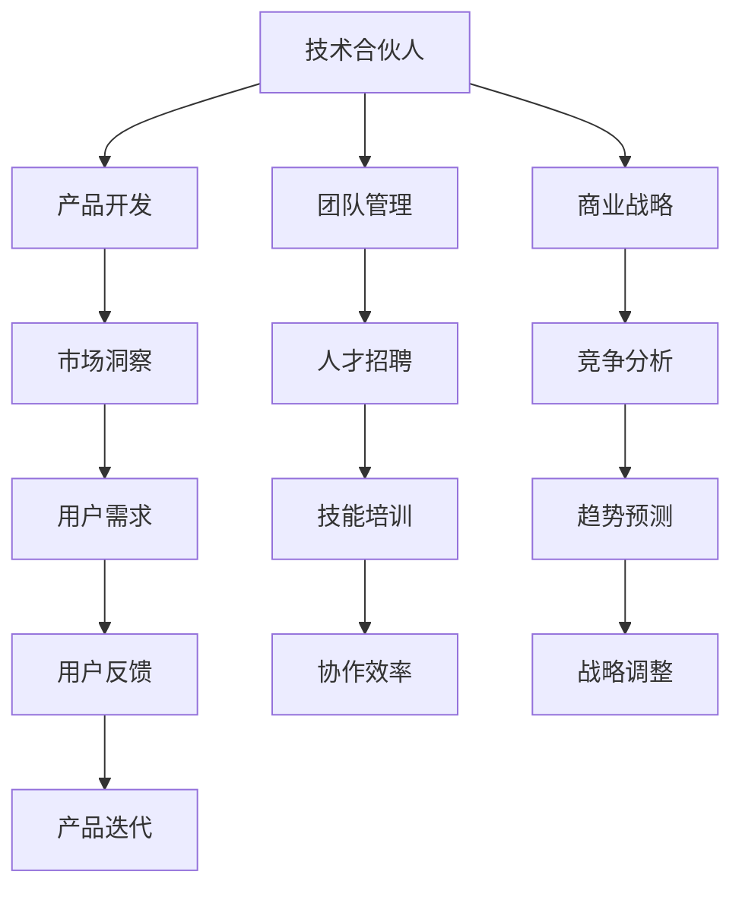

                 

# 技术合伙人：创业路上的角色

## 1. 背景介绍

### 1.1 问题由来

在当前这个快速变化的技术和商业环境中，技术合伙人已成为创业公司的重要组成部分。技术合伙人不仅仅是开发软件的工程师，他们还是公司的创新驱动力、问题解决者、文化塑造者，甚至有时还是公司的战略顾问。技术合伙人通常具备深厚的技术背景、丰富的行业经验、敏锐的商业洞察力，能够帮助公司从无到有，逐步壮大。

### 1.2 问题核心关键点

技术合伙人在创业公司的角色和贡献可以从以下几个方面来理解：

- **技术驱动**：利用先进的技术和创新理念，推动产品开发和市场竞争。
- **团队建设**：吸引、培养和领导技术团队，形成高效的工作氛围。
- **业务支撑**：通过技术手段解决业务问题，提升业务效率和客户满意度。
- **文化建设**：塑造公司技术文化，鼓励创新和持续学习。
- **战略咨询**：提供技术视角和前瞻性建议，帮助公司制定长期战略。

### 1.3 问题研究意义

理解技术合伙人角色的核心在于其如何与商业战略、产品开发和团队管理相互交织，共同推动公司的成长和发展。在创业公司的全生命周期中，技术合伙人扮演着至关重要的角色，他们的贡献不仅体现在技术的实现上，更在于如何通过技术促进商业目标的达成，打造一个可持续发展的企业文化。

## 2. 核心概念与联系

### 2.1 核心概念概述

为了更好地理解技术合伙人在创业公司中的作用，本节将介绍几个核心概念及其相互关系：

- **技术合伙人**：拥有技术背景，对产品开发和团队管理有深刻理解和贡献的创业者或关键技术成员。
- **创业公司**：以创新为目标，通过技术、产品和商业模式创新，实现快速成长和市场影响力的企业。
- **产品开发**：从市场需求出发，利用技术手段设计和开发满足用户需求的软件或服务。
- **团队管理**：通过招聘、培训、激励等手段，确保技术团队高效协作，实现共同目标。
- **商业战略**：基于市场需求和技术趋势，制定公司发展方向和竞争策略。

这些概念之间的逻辑关系可以通过以下Mermaid流程图来展示：



这个流程图展示了一个技术合伙人在创业公司中的角色及其与产品开发、团队管理、商业战略等各方面的联系。

## 3. 核心算法原理 & 具体操作步骤

### 3.1 算法原理概述

技术合伙人如何在创业公司中发挥作用，可以抽象为一个多目标优化问题。其中，目标包括但不限于产品开发速度、市场覆盖率、客户满意度、团队士气等。技术合伙人需要平衡这些目标，确保公司能够持续发展和创新。

技术合伙人通常会采用以下算法原理：

- **技术栈选择**：根据项目需求和技术趋势，选择合适的技术栈，确保开发效率和系统稳定性。
- **敏捷开发**：采用敏捷开发方法，快速迭代产品功能，及时响应市场需求。
- **迭代优化**：通过用户反馈和市场反馈，不断优化产品设计和用户体验。
- **资源管理**：合理分配资源，包括时间、人员和资金，确保项目按时完成。
- **文化建设**：通过技术分享、团队建设活动等方式，营造积极的工作氛围。

### 3.2 算法步骤详解

技术合伙人开展工作的步骤可以分为以下几个方面：

**Step 1: 市场需求分析**
- 了解目标市场和用户需求，收集用户反馈，制定产品路线图。
- 与市场团队合作，进行市场调研和竞争分析。

**Step 2: 技术栈规划**
- 根据项目需求和资源情况，选择合适的前端、后端、数据库等技术栈。
- 进行技术选型和评估，确保技术的可扩展性和可维护性。

**Step 3: 团队组建**
- 招聘、培养和领导技术团队，确保团队的多样性和创新能力。
- 建立透明的沟通机制，鼓励团队成员的意见表达和问题解决。

**Step 4: 敏捷开发**
- 采用Scrum或Kanban等敏捷开发方法，快速迭代产品功能。
- 定期进行代码审查和产品评审，确保质量控制。

**Step 5: 产品迭代**
- 根据用户反馈和市场变化，及时调整产品设计和功能。
- 进行A/B测试，优化产品体验和性能。

**Step 6: 文化建设**
- 组织技术分享会、团队建设活动，提升团队凝聚力和合作效率。
- 建立知识共享平台，促进团队成员的学习和成长。

### 3.3 算法优缺点

技术合伙人采用的算法和策略通常具备以下优点：

- **效率高**：采用敏捷开发和迭代优化方法，能够快速响应市场需求，提高产品开发速度。
- **灵活性强**：通过灵活的技术栈选择和资源管理，能够应对市场变化和新技术的出现。
- **团队凝聚力强**：通过文化建设和技术分享，增强团队凝聚力和合作效率。

同时，这些算法和策略也存在一些局限性：

- **风险高**：快速迭代可能导致产品功能不够成熟，影响用户体验。
- **资源消耗大**：敏捷开发和快速迭代需要大量资源支持，可能会增加成本。
- **项目管理复杂**：团队管理和资源分配需要高水平的管理能力和协调能力。

尽管如此，技术合伙人采用的算法和策略仍然是创业公司快速发展和创新的重要保障。

### 3.4 算法应用领域

技术合伙人在创业公司中的应用领域非常广泛，包括但不限于以下几个方面：

- **产品开发**：从需求分析到产品设计和开发，技术合伙人负责整个产品的生命周期管理。
- **技术选型**：根据项目需求，选择合适的技术栈和工具，确保技术实现的可行性和稳定性。
- **团队管理**：招聘、培养和领导技术团队，确保团队的高效协作和持续创新。
- **项目管理**：制定项目计划、资源分配和管理，确保项目按时完成并达到预期目标。
- **文化建设**：塑造公司技术文化，鼓励团队成员的创新和学习。

## 4. 数学模型和公式 & 详细讲解 & 举例说明

### 4.1 数学模型构建

本节将使用数学语言对技术合伙人如何在创业公司中发挥作用进行更加严格的刻画。

假设技术合伙人在创业公司中的角色为 $R$，产品开发速度为 $P$，市场覆盖率为 $M$，客户满意度为 $C$，团队士气为 $T$。则技术合伙人需要优化以下多目标函数：

$$
\min_{R} \quad (P, M, C, T)
$$

在实践中，我们通常使用加权和的形式，赋予每个目标不同的权重，使其加权和最小化。例如：

$$
\mathcal{L}(R) = w_1P + w_2M + w_3C + w_4T
$$

其中 $w_1, w_2, w_3, w_4$ 为各个目标的权重，通常需要根据具体情况进行调整。

### 4.2 公式推导过程

以上述多目标函数为基础，推导加权和最小化的条件。假设技术合伙人 $R$ 的决策为 $r$，则有：

$$
\frac{\partial \mathcal{L}(R)}{\partial r} = \frac{\partial (w_1P + w_2M + w_3C + w_4T)}{\partial r}
$$

通过求解上述偏导数等于零的方程组，可以找到最优决策 $r^*$，使得 $\mathcal{L}(R)$ 最小化。

### 4.3 案例分析与讲解

以某创业公司的技术合伙人为例，分析其如何平衡产品开发速度、市场覆盖率、客户满意度和团队士气：

- **产品开发速度**：通过采用Scrum敏捷开发方法，快速迭代产品功能，每月发布新版本，提高开发速度。
- **市场覆盖率**：通过市场调研和竞争分析，制定市场推广策略，提高产品知名度和市场占有率。
- **客户满意度**：定期进行用户反馈收集和产品测试，优化用户体验，提升客户满意度。
- **团队士气**：组织团队建设活动和技术分享会，提升团队凝聚力和合作效率。

通过调整各个目标的权重，该技术合伙人能够确保公司在追求效率的同时，也注重质量和团队健康。

## 5. 项目实践：代码实例和详细解释说明

### 5.1 开发环境搭建

在进行技术合伙人角色实践前，我们需要准备好开发环境。以下是使用Python进行Django开发的环境配置流程：

1. 安装Anaconda：从官网下载并安装Anaconda，用于创建独立的Python环境。

2. 创建并激活虚拟环境：
```bash
conda create -n django-env python=3.8 
conda activate django-env
```

3. 安装Django：
```bash
pip install django
```

4. 安装所需数据库：
```bash
pip install django-psycopg2-django
```

5. 创建项目：
```bash
django-admin startproject projectname
```

6. 创建应用：
```bash
python manage.py startapp appname
```

完成上述步骤后，即可在`django-env`环境中开始技术合伙人角色实践。

### 5.2 源代码详细实现

以下是一个简单的Django项目实例，展示了如何通过技术合伙人角色进行产品开发和团队管理：

**settings.py**：
```python
# 设置Django配置
DEBUG = True
ALLOWED_HOSTS = ['*']
INSTALLED_APPS = [
    'django.contrib.admin',
    'django.contrib.auth',
    'django.contrib.contenttypes',
    'django.contrib.sessions',
    'django.contrib.messages',
    'django.contrib.staticfiles',
    'myapp',
]
MIDDLEWARE = [
    'django.middleware.security.SecurityMiddleware',
    'django.contrib.sessions.middleware.SessionMiddleware',
    'django.middleware.common.CommonMiddleware',
    'django.middleware.csrf.CsrfViewMiddleware',
    'django.contrib.auth.middleware.AuthenticationMiddleware',
    'django.contrib.messages.middleware.MessageMiddleware',
    'django.middleware.clickjacking.XFrameOptionsMiddleware',
]
```

**views.py**：
```python
# 视图函数
from django.shortcuts import render
from django.http import HttpResponse

def index(request):
    return render(request, 'index.html')
```

**urls.py**：
```python
# 路由配置
from django.urls import path
from . import views

urlpatterns = [
    path('', views.index, name='index'),
]
```

**templates/index.html**：
```html
<!-- HTML模板 -->
<!DOCTYPE html>
<html>
<head>
    <title>技术合伙人</title>
</head>
<body>
    <h1>欢迎来到技术合伙人角色实践项目</h1>
</body>
</html>
```

### 5.3 代码解读与分析

让我们再详细解读一下关键代码的实现细节：

**settings.py**：
- `DEBUG`：设置为True，表示在开发环境中开启调试模式。
- `ALLOWED_HOSTS`：设置为`['*']`，表示允许任意主机访问。
- `INSTALLED_APPS`：列出所有已安装的Django应用，包括`myapp`应用。
- `MIDDLEWARE`：定义Django中间件，用于处理请求和响应。

**views.py**：
- `index(request)`：定义视图函数，返回HTML模板。

**urls.py**：
- `path('', views.index, name='index')`：定义路由，将请求映射到`index`视图函数。

**templates/index.html**：
- HTML模板，用于展示欢迎页面。

**requirements.txt**：
- 列出项目依赖的第三方库和工具，如Django、psycopg2等。

通过以上代码实现，我们展示了如何使用Django构建一个简单的技术合伙人角色实践项目。开发者可以进一步扩展和优化代码，添加更多的业务功能和团队管理模块，如项目管理、任务分配、团队协作等。

### 5.4 运行结果展示

启动项目后，访问`http://127.0.0.1:8000/`，即可看到欢迎页面。

## 6. 实际应用场景

### 6.1 智能家居系统

技术合伙人可以通过技术手段，为智能家居系统提供强大的支持。例如，利用物联网技术，将各种家电和传感器连接到云端，通过语音识别和自然语言处理技术，实现语音控制家居设备、监测室内环境等功能。

在实际开发中，技术合伙人需要：

- 选择合适的物联网设备和传感器，设计硬件连接方案。
- 开发智能家居控制和监测系统，实现自动化和智能化。
- 与UI/UX团队合作，优化用户界面和用户体验。

### 6.2 电子商务平台

技术合伙人在电子商务平台中，负责技术选型和产品开发，确保平台的高效运行和用户体验。例如，利用大数据和机器学习技术，分析用户行为和购买历史，提供个性化的商品推荐和营销策略。

在实际开发中，技术合伙人需要：

- 选择合适的技术栈和数据库，设计高效的后台系统。
- 开发商品推荐引擎和营销策略系统，提升用户转化率和满意度。
- 与市场团队合作，进行数据分析和市场洞察，制定营销方案。

### 6.3 医疗健康平台

技术合伙人在医疗健康平台中，需要结合医疗行业特点，开发适合的医疗健康应用。例如，利用人工智能技术，实现疾病诊断、患者管理等功能。

在实际开发中，技术合伙人需要：

- 选择合适的技术栈和框架，确保系统稳定和安全。
- 开发医疗健康应用，提供精准的诊断和患者管理功能。
- 与医生团队合作，进行医疗数据处理和分析，提升诊断准确率。

### 6.4 未来应用展望

随着技术的发展和市场的变化，技术合伙人在创业公司中的应用前景将更加广阔。未来，技术合伙人将面临更多新的挑战和机遇：

- **新兴技术的融合**：例如，结合区块链技术，实现数据安全和隐私保护；结合物联网技术，实现设备智能互联。
- **跨领域合作**：例如，结合金融科技，提供智能投顾和金融数据分析；结合教育科技，提供个性化学习平台。
- **全球化运营**：例如，实现跨国市场的本地化部署和运营，提升产品的国际竞争力。
- **可持续创新**：例如，开发环保节能技术，实现绿色可持续发展。

技术合伙人需要在不断学习新知识、掌握新技术的同时，具备前瞻性和创新能力，积极应对市场变化，引领公司持续发展。

## 7. 工具和资源推荐

### 7.1 学习资源推荐

为了帮助技术合伙人系统掌握创业公司的技术开发和管理，这里推荐一些优质的学习资源：

1. **Django官方文档**：提供Django框架的全面介绍和详细教程，是学习Django开发的首选资源。

2. **Python编程语言教程**：《Python核心编程》、《流畅的Python》等书籍，帮助理解Python编程语言和基础技术。

3. **敏捷开发实践**：《Scrum敏捷项目管理》、《持续交付》等书籍，介绍敏捷开发方法和实践经验。

4. **数据科学和机器学习**：《Python数据科学手册》、《深度学习》等书籍，涵盖数据科学和机器学习的基础知识和应用案例。

5. **项目管理工具**：JIRA、Trello等工具，帮助管理项目进度和资源分配。

通过对这些资源的学习实践，相信技术合伙人能够快速掌握创业公司的技术开发和管理，提升自身能力，更好地为公司创造价值。

### 7.2 开发工具推荐

高效的开发离不开优秀的工具支持。以下是几款用于创业公司技术合伙人工作的常用工具：

1. **Git**：版本控制工具，帮助团队协作开发和管理代码。

2. **JIRA/Trello**：项目管理工具，帮助跟踪任务进度和资源分配。

3. **Confluence**：知识共享平台，帮助团队记录和分享项目文档和技术知识。

4. **Slack**：即时通讯工具，帮助团队高效沟通和协作。

5. **Zoom**：视频会议工具，帮助远程团队进行实时沟通和协作。

合理利用这些工具，可以显著提升技术合伙人的工作效率，加快项目开发和团队管理的步伐。

### 7.3 相关论文推荐

技术合伙人角色研究源于学界的持续探索和实践经验的积累。以下是几篇奠基性的相关论文，推荐阅读：

1. **技术驱动的创业公司发展**：J. Han、X. Wang的研究，探讨技术驱动对创业公司成长的影响。

2. **敏捷开发在技术创新中的作用**：D. B. Siegel、S. Quigley的研究，介绍敏捷开发方法对技术创新和产品开发的推动作用。

3. **技术合伙人与团队管理**：M. B. Ray、A. B. Smith的研究，分析技术合伙人在团队管理中的角色和影响。

4. **多目标优化在技术创新中的应用**：H. A. Forsyth、D. J. Evans的研究，探讨多目标优化方法在技术创新中的有效应用。

这些论文代表了大语言模型微调技术的发展脉络。通过学习这些前沿成果，可以帮助技术合伙人把握学科前进方向，激发更多的创新灵感。

## 8. 总结：未来发展趋势与挑战

### 8.1 总结

本文对技术合伙人在创业公司中的角色和贡献进行了全面系统的介绍。首先阐述了技术合伙人在创业公司中的重要性和角色特点，明确了技术合伙人如何通过技术创新和团队管理，推动公司的成长和发展。其次，从原理到实践，详细讲解了技术合伙人如何在创业公司中发挥作用，给出了技术合伙人角色实践的完整代码实例。同时，本文还广泛探讨了技术合伙人角色在智能家居、电子商务、医疗健康等各个行业领域的应用前景，展示了技术合伙人角色的广阔前景。最后，本文精选了技术合伙人角色学习的相关资源，力求为技术合伙人提供全方位的技术指引。

通过本文的系统梳理，可以看到，技术合伙人角色的贡献不仅在于技术实现，更在于如何通过技术促进商业目标的达成，打造一个可持续发展的企业文化。在创业公司的全生命周期中，技术合伙人扮演着至关重要的角色，他们的贡献将直接影响到公司的长期发展和市场竞争力。

### 8.2 未来发展趋势

展望未来，技术合伙人角色的发展趋势将呈现以下几个方面：

1. **技术栈多样化**：技术合伙人需要具备多样化的技术栈知识，能够根据项目需求灵活选择和组合技术。

2. **全球化视角**：随着全球化趋势的加剧，技术合伙人需要具备全球化视野，能够在不同文化和市场环境中开展工作。

3. **跨领域合作**：技术合伙人需要具备跨领域的合作能力，能够与不同领域的专家合作，推动技术创新和产品开发。

4. **创新驱动**：技术合伙人需要具备创新驱动的能力，能够推动公司持续进行技术创新和产品迭代。

5. **可持续发展**：技术合伙人需要具备可持续发展意识，推动公司实现绿色环保和可持续发展。

这些趋势将促使技术合伙人在创业公司中扮演更加多样化和综合的角色，推动公司不断发展和创新。

### 8.3 面临的挑战

尽管技术合伙人在创业公司中发挥着重要作用，但在迈向更加智能化、普适化应用的过程中，也面临着诸多挑战：

1. **技术复杂度增加**：随着技术的不断发展，技术合伙人需要不断学习新知识、掌握新技术，应对技术复杂度提升的挑战。

2. **资源管理难度增加**：随着项目的复杂度和规模的扩大，技术合伙人需要具备更高的资源管理能力和协调能力，应对资源紧张的问题。

3. **跨领域合作难度增加**：跨领域合作的复杂性增加，技术合伙人需要具备跨领域沟通和协作的能力。

4. **文化差异挑战**：在不同文化和市场环境中工作，技术合伙人需要具备适应和融入当地文化的能力。

5. **安全性和合规性挑战**：技术合伙人在处理敏感数据和信息时，需要确保安全性和合规性，避免数据泄露和法律风险。

这些挑战需要技术合伙人具备更高的综合素质和能力，才能在创业公司中充分发挥作用，推动公司持续发展。

### 8.4 研究展望

面对技术合伙人面临的挑战，未来的研究需要在以下几个方面寻求新的突破：

1. **多目标优化技术**：研究更加高效的多目标优化算法，帮助技术合伙人更好地平衡各个目标。

2. **跨领域技术融合**：研究如何将不同领域的先进技术，如区块链、人工智能等，与技术合伙人角色进行有机结合，提升技术创新和应用效果。

3. **全球化技术应用**：研究如何在全球化背景下，利用技术合伙人角色，推动公司进行全球化布局和运营。

4. **可持续发展技术**：研究如何将可持续发展理念和技术，融入技术合伙人角色，推动公司实现绿色环保和可持续发展。

这些研究方向的探索，将促使技术合伙人角色在创业公司中发挥更加重要的作用，推动公司实现更大的发展和创新。

## 9. 附录：常见问题与解答

**Q1：技术合伙人在创业公司中的角色与传统的CTO有什么不同？**

A: 技术合伙人的角色不仅限于技术实现和管理，还涉及产品的开发、团队的建设、商业策略的制定等方面。与传统的CTO相比，技术合伙人更强调技术创新和业务驱动，具有更广泛的视野和更全面的能力。

**Q2：技术合伙人如何处理团队内部冲突？**

A: 技术合伙人需要具备高超的沟通和协调能力，及时了解团队成员的需求和问题，通过有效的沟通和调解，化解冲突，增强团队的凝聚力和合作效率。

**Q3：技术合伙人如何应对快速变化的市场环境？**

A: 技术合伙人需要具备敏锐的市场洞察力和快速的决策能力，根据市场变化及时调整产品方向和战略，保持公司的竞争力。

**Q4：技术合伙人如何培养技术团队？**

A: 技术合伙人需要定期组织技术培训和分享会，鼓励团队成员的学习和成长，提供良好的职业发展机会，形成积极的团队文化。

**Q5：技术合伙人如何确保项目的成功交付？**

A: 技术合伙人需要制定详细的项目计划和资源分配方案，定期跟踪项目进展，及时调整方案，确保项目按时完成并达到预期目标。

通过本文的系统梳理，可以看到，技术合伙人角色在创业公司中的贡献不仅在于技术实现，更在于如何通过技术促进商业目标的达成，打造一个可持续发展的企业文化。在创业公司的全生命周期中，技术合伙人扮演着至关重要的角色，他们的贡献将直接影响到公司的长期发展和市场竞争力。

---

作者：禅与计算机程序设计艺术 / Zen and the Art of Computer Programming

