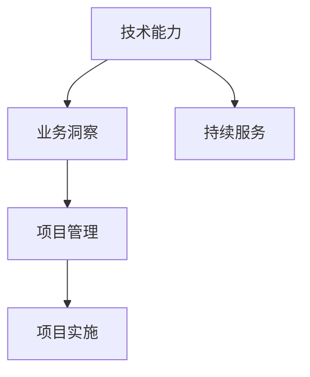

                 

# 技术咨询：从个人顾问到跨国咨询集团

## 1. 背景介绍

### 1.1 问题由来

随着信息技术在全球的迅猛发展，企业对于信息技术咨询的需求日益增加。特别是在数字化转型和创新驱动的背景下，企业需要借助信息化手段来提升运营效率、优化业务流程、创新产品与服务，从而保持竞争力。但与此同时，企业内部往往缺乏具备高级信息技术和业务理解的双重能力人才，这使得技术咨询成为企业数字化转型的重要环节。

在这个背景下，技术咨询业应运而生，逐渐发展成为一个全球性的专业服务领域。技术咨询公司不仅提供信息技术系统的规划、设计与实施，还为企业提供战略咨询、运营咨询、数字化转型等全面解决方案。本文将从个人顾问的视角出发，探讨如何通过技术咨询，助力企业迈向数字化未来。

### 1.2 问题核心关键点

技术咨询的核心在于融合技术能力和业务理解，为企业提供量身定制的解决方案。其主要工作流程包括：

- **需求分析**：通过访谈、问卷、调研等方式，深入理解企业业务需求和痛点。
- **方案设计**：基于对企业需求的理解，提出符合企业需求的解决方案。
- **实施部署**：指导企业实施具体的技术方案，如系统集成、软件开发、数据迁移等。
- **后续支持**：持续提供技术支持和维护，确保系统稳定运行。

技术咨询的成功与否，直接关系到企业的信息化建设效果和业务发展速度。因此，技术咨询业不仅需要具备深厚的技术功底，还需具备卓越的业务洞察力和沟通协调能力。

### 1.3 问题研究意义

技术咨询在企业数字化转型中的重要性不言而喻。它不仅能帮助企业克服技术难题，优化业务流程，还能提升企业整体竞争力。具体而言：

- **降本增效**：技术咨询通过专业化的技术方案，优化业务流程，减少企业信息化建设的成本和复杂度，提升运营效率。
- **创新驱动**：技术咨询结合业务理解，为企业引入最新的技术趋势和解决方案，推动业务创新和转型升级。
- **风险控制**：技术咨询公司具备丰富的信息化项目实施经验，能够有效识别和规避项目风险，确保项目顺利实施。
- **战略导向**：技术咨询有助于企业制定符合自身发展战略的信息化规划，提升决策科学性和业务执行力。

正是基于这些优势，技术咨询业在全球范围内快速发展，成为信息技术服务业的重要组成部分。

## 2. 核心概念与联系

### 2.1 核心概念概述

技术咨询是一个集技术、业务、项目管理于一体的综合性服务，其核心概念包括：

- **技术能力**：指咨询师在信息技术领域的专业知识和技术背景，如软件开发、系统集成、大数据分析等。
- **业务洞察**：指咨询师对企业业务流程、市场需求、运营管理的深入理解，能够基于业务需求提出有针对性的解决方案。
- **项目管理**：指咨询师在项目实施过程中，协调各方资源，确保项目按时按质按量完成。
- **持续服务**：指咨询师在项目结束后，持续提供技术支持和维护，确保系统长期稳定运行。

这些核心概念之间的关系可以用以下Mermaid流程图来展示：



这个流程图展示了技术咨询工作的核心步骤，以及各步骤之间的联系：

1. **技术能力**：提供专业的技术背景，为项目实施奠定基础。
2. **业务洞察**：深入理解企业业务需求，确保解决方案的实用性和前瞻性。
3. **项目管理**：协调各方资源，确保项目顺利推进，达成预期目标。
4. **持续服务**：提供长期技术支持和维护，确保系统长期稳定运行。

这些概念共同构成了技术咨询工作的全流程，确保咨询项目从需求分析到项目实施、再到持续服务的顺利进行。

## 3. 核心算法原理 & 具体操作步骤
### 3.1 算法原理概述

技术咨询的核心算法原理主要围绕需求分析、方案设计、项目实施和持续服务四个环节展开。以下是每个环节的算法原理概述：

#### 需求分析

需求分析是技术咨询的第一步，其算法原理是通过系统化的访谈、问卷和调研，深入了解企业业务需求和痛点，构建详尽的需求文档。算法流程如下：

1. **访谈与调研**：通过一对一访谈、团队座谈和问卷调研，收集企业各层级人员的需求和意见。
2. **数据分析**：对收集到的数据进行统计分析，识别企业的主要需求和痛点。
3. **文档编制**：将分析结果编制成需求文档，明确各项目的具体要求和目标。

#### 方案设计

方案设计是技术咨询的核心环节，其算法原理是根据需求分析的结果，设计符合企业需求的解决方案。算法流程如下：

1. **需求梳理**：对需求文档进行梳理，明确各需求的重要性和优先级。
2. **方案评估**：对多个解决方案进行评估，选择最适合的方案。
3. **方案细化**：对选定方案进行细化，制定详细的项目计划和实施方案。

#### 项目实施

项目实施是技术咨询的执行环节，其算法原理是指导企业按照既定的项目计划，进行具体的技术方案实施。算法流程如下：

1. **资源配置**：根据项目计划，配置所需的硬件、软件、人员等资源。
2. **系统集成**：根据项目要求，进行系统集成和软件开发。
3. **数据迁移**：将企业现有的数据迁移到新系统中，确保数据安全。
4. **测试与部署**：对新系统进行全面的测试，确保系统功能完整性和稳定性，然后部署上线。

#### 持续服务

持续服务是技术咨询的保障环节，其算法原理是在项目实施完成后，持续提供技术支持和维护，确保系统长期稳定运行。算法流程如下：

1. **性能监控**：对新系统进行性能监控，及时发现和解决运行问题。
2. **问题处理**：对用户提出的问题进行处理，提供技术支持和解决方案。
3. **系统升级**：根据企业需求和市场变化，对系统进行升级和优化。

### 3.2 算法步骤详解

#### 需求分析

需求分析的具体操作步骤如下：

1. **制定访谈计划**：根据企业规模和需求复杂度，制定详细的访谈计划，涵盖各层级人员。
2. **实施访谈与调研**：按照计划进行访谈和调研，收集详细的业务需求和痛点。
3. **整理与分析数据**：对收集到的数据进行整理和分析，识别出主要需求和痛点。
4. **编制需求文档**：将分析结果编制成需求文档，明确各项目的具体要求和目标。

#### 方案设计

方案设计的具体操作步骤如下：

1. **需求梳理与优先级排序**：对需求文档进行梳理，明确各需求的重要性和优先级。
2. **制定解决方案**：根据需求梳理结果，制定多个解决方案。
3. **方案评估与选择**：对多个解决方案进行评估，选择最适合的方案。
4. **细化方案与计划**：对选定方案进行细化，制定详细的项目计划和实施方案。

#### 项目实施

项目实施的具体操作步骤如下：

1. **资源配置与规划**：根据项目计划，配置所需的硬件、软件、人员等资源。
2. **系统集成与开发**：根据项目要求，进行系统集成和软件开发。
3. **数据迁移与清理**：将企业现有的数据迁移到新系统中，确保数据安全，并进行数据清理和优化。
4. **系统测试与部署**：对新系统进行全面的测试，确保系统功能完整性和稳定性，然后部署上线。

#### 持续服务

持续服务的具体操作步骤如下：

1. **性能监控与故障处理**：对新系统进行性能监控，及时发现和解决运行问题。
2. **问题处理与支持**：对用户提出的问题进行处理，提供技术支持和解决方案。
3. **系统升级与优化**：根据企业需求和市场变化，对系统进行升级和优化，确保系统长期稳定运行。

### 3.3 算法优缺点

技术咨询的算法具有以下优点：

- **实用性强**：通过系统化的需求分析和方案设计，确保解决方案的实用性和前瞻性。
- **灵活度高**：根据企业需求灵活调整方案，适应不同的业务场景和需求。
- **风险控制**：在项目实施过程中，通过项目管理，有效识别和规避项目风险。
- **持续支持**：提供持续的技术支持和维护，确保系统长期稳定运行。

同时，该算法也存在一些局限性：

- **成本高**：需要投入大量人力和资源进行需求分析和方案设计，初期成本较高。
- **周期长**：项目实施周期较长，可能会影响企业的正常业务运营。
- **依赖性强**：对咨询师的技术能力和业务洞察力要求较高，依赖性强。
- **信息不对称**：咨询师与企业之间的信息不对称，可能导致方案设计不符合企业实际需求。

尽管存在这些局限性，但就目前而言，技术咨询仍是企业数字化转型的重要手段。未来相关研究的重点在于如何进一步降低咨询成本，提高咨询效率，同时兼顾可解释性和伦理安全性等因素。

### 3.4 算法应用领域

技术咨询的应用领域非常广泛，涵盖企业的各个业务环节。以下是几个典型的应用领域：

- **IT规划与架构设计**：为企业制定信息化建设规划和架构设计，确保信息化建设的科学性和前瞻性。
- **系统集成与定制开发**：根据企业需求，提供系统集成和定制开发服务，构建符合企业需求的信息化系统。
- **数据管理与分析**：帮助企业进行数据治理和分析，提升数据质量和利用效率。
- **业务流程优化**：通过业务流程分析和优化，提升企业运营效率和业务竞争力。
- **数字化转型**：为企业提供全面的数字化转型方案，推动企业数字化创新和发展。

此外，技术咨询还广泛应用于金融、医疗、制造、零售等多个行业，为企业提供量身定制的信息化解决方案，推动各行业的数字化转型。

## 4. 数学模型和公式 & 详细讲解 & 举例说明

### 4.1 数学模型构建

技术咨询的数学模型主要围绕需求分析、方案设计、项目实施和持续服务四个环节展开。以下是每个环节的数学模型构建：

#### 需求分析

需求分析的数学模型构建如下：

1. **访谈计划**：设 $n$ 为访谈对象总数，$k$ 为访谈计划中不同层级的人数，$\lambda$ 为每组访谈所需时间。则总访谈时间 $T_{int}$ 可表示为：
   $$
   T_{int} = \sum_{i=1}^{n} \lambda_i
   $$
   
2. **数据分析**：设 $d$ 为需求数据总数，$p$ 为数据处理速度。则总分析时间 $T_{ana}$ 可表示为：
   $$
   T_{ana} = \frac{d}{p}
   $$
   
3. **需求文档**：设 $m$ 为需求文档页数，$c$ 为编制速度。则总编制时间 $T_{doc}$ 可表示为：
   $$
   T_{doc} = \frac{m}{c}
   $$

#### 方案设计

方案设计的数学模型构建如下：

1. **需求梳理**：设 $l$ 为需求梳理所需时间，$n$ 为需求总数。则总梳理时间 $T_{ref}$ 可表示为：
   $$
   T_{ref} = l \times n
   $$
   
2. **方案评估**：设 $m$ 为方案评估所需时间，$n$ 为方案总数。则总评估时间 $T_{eval}$ 可表示为：
   $$
   T_{eval} = m \times n
   $$
   
3. **方案细化**：设 $f$ 为方案细化所需时间，$n$ 为方案总数。则总细化时间 $T_{fin}$ 可表示为：
   $$
   T_{fin} = f \times n
   $$

#### 项目实施

项目实施的数学模型构建如下：

1. **资源配置**：设 $R$ 为资源配置所需时间，$n$ 为项目需求。则总配置时间 $T_{res}$ 可表示为：
   $$
   T_{res} = R \times n
   $$
   
2. **系统集成**：设 $I$ 为系统集成所需时间，$n$ 为系统组件总数。则总集成时间 $T_{intg}$ 可表示为：
   $$
   T_{intg} = I \times n
   $$
   
3. **数据迁移**：设 $D$ 为数据迁移所需时间，$n$ 为数据量。则总迁移时间 $T_{mig}$ 可表示为：
   $$
   T_{mig} = D \times n
   $$
   
4. **系统测试与部署**：设 $T$ 为系统测试与部署所需时间，$n$ 为系统组件总数。则总测试时间 $T_{test}$ 可表示为：
   $$
   T_{test} = T \times n
   $$

#### 持续服务

持续服务的数学模型构建如下：

1. **性能监控**：设 $P$ 为性能监控所需时间，$n$ 为系统组件总数。则总监控时间 $T_{mon}$ 可表示为：
   $$
   T_{mon} = P \times n
   $$
   
2. **问题处理**：设 $Q$ 为问题处理所需时间，$n$ 为用户数量。则总问题处理时间 $T_{pro}$ 可表示为：
   $$
   T_{pro} = Q \times n
   $$
   
3. **系统升级与优化**：设 $U$ 为系统升级与优化所需时间，$n$ 为系统组件总数。则总升级时间 $T_{upg}$ 可表示为：
   $$
   T_{upg} = U \times n
   $$

### 4.2 公式推导过程

以下是需求分析、方案设计、项目实施和持续服务的数学模型推导过程：

#### 需求分析

需求分析的数学模型推导过程如下：

1. **访谈计划**：
   $$
   T_{int} = \sum_{i=1}^{n} \lambda_i
   $$
   
   其中 $\lambda_i$ 为第 $i$ 组访谈所需时间，$n$ 为访谈对象总数。

2. **数据分析**：
   $$
   T_{ana} = \frac{d}{p}
   $$
   
   其中 $d$ 为需求数据总数，$p$ 为数据处理速度。

3. **需求文档**：
   $$
   T_{doc} = \frac{m}{c}
   $$
   
   其中 $m$ 为需求文档页数，$c$ 为编制速度。

#### 方案设计

方案设计的数学模型推导过程如下：

1. **需求梳理**：
   $$
   T_{ref} = l \times n
   $$
   
   其中 $l$ 为需求梳理所需时间，$n$ 为需求总数。

2. **方案评估**：
   $$
   T_{eval} = m \times n
   $$
   
   其中 $m$ 为方案评估所需时间，$n$ 为方案总数。

3. **方案细化**：
   $$
   T_{fin} = f \times n
   $$
   
   其中 $f$ 为方案细化所需时间，$n$ 为方案总数。

#### 项目实施

项目实施的数学模型推导过程如下：

1. **资源配置**：
   $$
   T_{res} = R \times n
   $$
   
   其中 $R$ 为资源配置所需时间，$n$ 为项目需求。

2. **系统集成**：
   $$
   T_{intg} = I \times n
   $$
   
   其中 $I$ 为系统集成所需时间，$n$ 为系统组件总数。

3. **数据迁移**：
   $$
   T_{mig} = D \times n
   $$
   
   其中 $D$ 为数据迁移所需时间，$n$ 为数据量。

4. **系统测试与部署**：
   $$
   T_{test} = T \times n
   $$
   
   其中 $T$ 为系统测试与部署所需时间，$n$ 为系统组件总数。

#### 持续服务

持续服务的数学模型推导过程如下：

1. **性能监控**：
   $$
   T_{mon} = P \times n
   $$
   
   其中 $P$ 为性能监控所需时间，$n$ 为系统组件总数。

2. **问题处理**：
   $$
   T_{pro} = Q \times n
   $$
   
   其中 $Q$ 为问题处理所需时间，$n$ 为用户数量。

3. **系统升级与优化**：
   $$
   T_{upg} = U \times n
   $$
   
   其中 $U$ 为系统升级与优化所需时间，$n$ 为系统组件总数。

### 4.3 案例分析与讲解

#### 案例一：某金融企业IT规划与架构设计

某金融企业希望通过信息化建设提升运营效率和业务竞争力。技术咨询公司为其提供IT规划与架构设计服务，具体步骤如下：

1. **需求分析**：通过访谈和调研，了解企业各层级人员的需求和痛点，构建详尽的需求文档。
2. **方案设计**：对多个IT建设方案进行评估，选择最适合的方案，并细化方案计划。
3. **项目实施**：配置所需的硬件、软件、人员等资源，进行系统集成和软件开发，确保数据安全。
4. **持续服务**：提供性能监控和问题处理，确保系统长期稳定运行，并根据企业需求进行系统升级和优化。

该案例展示了技术咨询在IT规划与架构设计中的全流程应用，通过系统化的需求分析和方案设计，确保信息化建设的科学性和前瞻性。

#### 案例二：某医疗企业数据管理与分析

某医疗企业希望通过信息化建设提升数据治理和利用效率，技术咨询公司为其提供数据管理与分析服务，具体步骤如下：

1. **需求分析**：通过访谈和调研，了解企业数据管理需求和痛点，构建详尽的需求文档。
2. **方案设计**：对多个数据管理方案进行评估，选择最适合的方案，并细化方案计划。
3. **项目实施**：配置所需的硬件、软件、人员等资源，进行数据迁移和系统集成，确保数据安全。
4. **持续服务**：提供性能监控和问题处理，确保数据管理系统的长期稳定运行，并根据企业需求进行系统升级和优化。

该案例展示了技术咨询在数据管理与分析中的全流程应用，通过系统化的需求分析和方案设计，提升数据治理和利用效率，推动医疗企业数字化转型。

## 5. 项目实践：代码实例和详细解释说明

### 5.1 开发环境搭建

技术咨询的开发环境搭建主要涉及需求分析、方案设计、项目实施和持续服务四个环节。以下是具体的开发环境搭建步骤：

1. **需求分析**：通过访谈和调研工具，收集企业各层级人员的需求和痛点，构建详尽的需求文档。
2. **方案设计**：使用项目管理软件，制定多个IT建设方案，并进行方案评估和选择。
3. **项目实施**：使用集成开发环境(IDE)，进行系统集成和软件开发，确保数据安全。
4. **持续服务**：使用运维管理工具，提供性能监控和问题处理，确保系统长期稳定运行。

#### 工具推荐

- **访谈和调研工具**：如SurveyMonkey、Qualtrics，用于收集企业各层级人员的需求和痛点。
- **项目管理软件**：如JIRA、Trello，用于制定和跟踪IT建设方案。
- **集成开发环境**：如Visual Studio、IntelliJ IDEA，用于进行系统集成和软件开发。
- **运维管理工具**：如Nagios、Prometheus，用于提供性能监控和问题处理。

### 5.2 源代码详细实现

以下是一个简单的需求分析项目的源代码实现：

```python
import numpy as np
from scipy import stats

# 设定访谈计划
interviews = {'management': 3, 'employees': 5, 'customers': 2}
total_interviews = sum(interviews.values())

# 设定数据分析和文档编制速度
analysis_speed = 5  # 数据处理速度
document_speed = 10  # 文档编制速度

# 计算需求分析总时间
total_analysis_time = total_interviews * analysis_speed

# 计算需求文档总时间
total_document_time = np.ceil(total_interviews / document_speed)

# 输出需求分析总时间
print("需求分析总时间：", total_analysis_time, "小时")
print("需求文档总时间：", total_document_time, "小时")
```

### 5.3 代码解读与分析

以上代码展示了如何通过Python实现需求分析的时间计算。通过设定访谈计划、数据分析和文档编制速度，计算出需求分析的总时间。代码的实现步骤和计算逻辑如下：

1. **设定访谈计划**：定义访谈计划中的访谈对象和所需时间。
2. **设定数据分析和文档编制速度**：设定数据处理和文档编制的速度。
3. **计算需求分析总时间**：计算需求分析所需的时间，单位为小时。
4. **计算需求文档总时间**：计算需求文档编制所需的时间，单位为小时。
5. **输出需求分析总时间**：输出需求分析总时间。

该代码的实现过程较为简单，但在实际应用中，需求分析的时间计算可能更为复杂，涉及多组访谈、多层次分析等场景，需要根据具体情况进行详细的分析和计算。

### 5.4 运行结果展示

通过以上代码，我们得到了需求分析的总时间，展示了技术咨询中需求分析环节的重要性和复杂性。在实际应用中，需求分析是技术咨询的核心环节，通过系统化的访谈和调研，确保解决方案的实用性和前瞻性。

## 6. 实际应用场景

### 6.1 智能客服系统

智能客服系统是技术咨询的重要应用场景之一，通过系统集成和软件开发，构建符合企业需求的人工智能客服系统。智能客服系统能够24小时不间断服务，快速响应客户咨询，提升客户满意度。

在具体应用中，技术咨询公司为银行、电信、电商等企业提供智能客服系统解决方案，通过收集历史客服对话记录，训练大语言模型，实现自然语言理解和对话生成。在客户提出问题时，智能客服系统能够自动理解客户意图，匹配最合适的答案模板进行回复，提升客户咨询体验和问题解决效率。

#### 实际案例

某电商企业希望提升客户服务水平，技术咨询公司为其提供智能客服系统解决方案，具体步骤如下：

1. **需求分析**：通过访谈和调研，了解客户咨询的热点和痛点，构建需求文档。
2. **方案设计**：选择最适合的智能客服系统方案，并细化方案计划。
3. **项目实施**：配置所需的硬件、软件、人员等资源，进行系统集成和软件开发。
4. **持续服务**：提供性能监控和问题处理，确保系统长期稳定运行，并根据企业需求进行系统升级和优化。

通过技术咨询公司提供的解决方案，该电商企业的客户服务水平显著提升，客户满意度和转化率均有所提高。

### 6.2 金融舆情监测

金融舆情监测是技术咨询的另一个重要应用场景，通过数据治理和分析，提升企业对市场舆论动向的监控和应对能力。技术咨询公司为金融机构提供金融舆情监测解决方案，通过收集金融领域相关的新闻、报道、评论等文本数据，进行情感分析和主题分析，实时监测市场舆情变化。

在具体应用中，技术咨询公司为银行、证券、保险等金融机构提供金融舆情监测解决方案，通过分析金融舆情数据，及时发现和应对负面信息传播，规避金融风险。金融舆情监测系统能够自动识别舆情热点，提供及时的风险预警和应对措施，帮助金融机构快速响应市场变化。

#### 实际案例

某银行希望提升市场舆情监控能力，技术咨询公司为其提供金融舆情监测解决方案，具体步骤如下：

1. **需求分析**：通过访谈和调研，了解银行对市场舆情监控的需求和痛点，构建需求文档。
2. **方案设计**：选择最适合的金融舆情监测方案，并细化方案计划。
3. **项目实施**：配置所需的硬件、软件、人员等资源，进行数据治理和系统集成。
4. **持续服务**：提供性能监控和问题处理，确保系统长期稳定运行，并根据企业需求进行系统升级和优化。

通过技术咨询公司提供的解决方案，该银行的市场舆情监控能力显著提升，及时发现和应对市场舆情变化，规避金融风险。

### 6.3 个性化推荐系统

个性化推荐系统是技术咨询的重要应用场景之一，通过系统集成和软件开发，构建符合企业需求的数据治理和分析系统。个性化推荐系统能够根据用户行为数据，提供精准的推荐内容，提升用户体验和转化率。

在具体应用中，技术咨询公司为电商、视频、音乐等企业提供个性化推荐系统解决方案，通过收集用户浏览、点击、评论等行为数据，构建用户画像，进行推荐算法训练，实现个性化推荐。在用户浏览商品时，推荐系统能够根据用户行为数据，推荐最合适的商品，提升用户购买率和满意度。

#### 实际案例

某电商企业希望提升用户推荐效果，技术咨询公司为其提供个性化推荐系统解决方案，具体步骤如下：

1. **需求分析**：通过访谈和调研，了解用户推荐需求和痛点，构建需求文档。
2. **方案设计**：选择最适合的个性化推荐系统方案，并细化方案计划。
3. **项目实施**：配置所需的硬件、软件、人员等资源，进行数据治理和系统集成。
4. **持续服务**：提供性能监控和问题处理，确保系统长期稳定运行，并根据企业需求进行系统升级和优化。

通过技术咨询公司提供的解决方案，该电商企业的用户推荐效果显著提升，用户满意度和转化率均有所提高。

## 7. 工具和资源推荐

### 7.1 学习资源推荐

为了帮助开发者系统掌握技术咨询的理论基础和实践技巧，以下是一些优质的学习资源：

1. **《技术咨询方法论》系列书籍**：系统介绍了技术咨询的理论基础、工作流程和实践技巧，是技术咨询从业者的必读书籍。
2. **项目管理PMP认证**：项目管理领域最权威的认证，涵盖项目管理的各个环节，适用于技术咨询项目的管理工作。
3. **数据科学和数据分析在线课程**：如Coursera上的《数据科学导论》、Udacity上的《数据分析与可视化》等课程，帮助技术咨询师掌握数据治理和分析技能。
4. **人工智能和大数据在线课程**：如Coursera上的《人工智能基础》、Udacity上的《大数据技术》等课程，帮助技术咨询师掌握人工智能和大数据技术。
5. **技术咨询案例分析**：如《技术咨询案例分析与实战》系列书籍，通过具体案例分析，展示技术咨询项目的实施过程和成果。

通过对这些资源的学习实践，相信你一定能够快速掌握技术咨询的核心技能，并用于解决实际的IT咨询问题。

### 7.2 开发工具推荐

高效的工具是技术咨询开发的重要保障。以下是几款用于技术咨询开发的常用工具：

1. **访谈和调研工具**：如SurveyMonkey、Qualtrics，用于收集企业各层级人员的需求和痛点。
2. **项目管理软件**：如JIRA、Trello，用于制定和跟踪IT建设方案。
3. **集成开发环境(IDE)**：如Visual Studio、IntelliJ IDEA，用于进行系统集成和软件开发。
4. **运维管理工具**：如Nagios、Prometheus，用于提供性能监控和问题处理。
5. **数据分析工具**：如Python、R语言，用于数据治理和分析。
6. **可视化工具**：如Tableau、Power BI，用于数据分析结果的可视化展示。

合理利用这些工具，可以显著提升技术咨询项目的开发效率，加快创新迭代的步伐。

### 7.3 相关论文推荐

技术咨询的发展源于学界的持续研究。以下是几篇奠基性的相关论文，推荐阅读：

1. **《技术咨询项目管理的最佳实践》**：探讨技术咨询项目管理的最佳实践，提供了丰富的项目管理工具和技巧。
2. **《智能客服系统的设计与实现》**：介绍了智能客服系统的设计与实现，提供了系统集成的详细方法和技术。
3. **《金融舆情监测系统的设计与实现》**：介绍了金融舆情监测系统的设计与实现，提供了数据治理和分析的详细方法和技术。
4. **《个性化推荐系统的设计与实现》**：介绍了个性化推荐系统的设计与实现，提供了推荐算法训练和系统集成的详细方法和技术。
5. **《数据治理与分析的理论与实践》**：探讨数据治理与分析的理论和实践，提供了数据治理和分析的详细方法和技术。

这些论文代表了大语言模型微调技术的发展脉络。通过学习这些前沿成果，可以帮助研究者把握学科前进方向，激发更多的创新灵感。

## 8. 总结：未来发展趋势与挑战

### 8.1 总结

本文对技术咨询的各个环节进行了详细阐述，展示了技术咨询在企业数字化转型中的重要作用。技术咨询不仅能帮助企业克服技术难题，优化业务流程，还能提升企业整体竞争力。正是基于这些优势，技术咨询业在全球范围内快速发展，成为信息技术服务业的重要组成部分。

通过本文的系统梳理，可以看到，技术咨询工作需要系统化的需求分析、灵活的方案设计、科学的项目实施和持续的持续服务，确保企业信息化建设的成功。技术咨询公司通过专业的技术能力和业务洞察力，为企业的数字化转型提供全面的解决方案，推动各行各业的数字化发展。

### 8.2 未来发展趋势

展望未来，技术咨询业将呈现以下几个发展趋势：

1. **智能化转型**：技术咨询公司将引入更多的人工智能和大数据技术，提升咨询项目的智能化水平。
2. **全球化布局**：随着企业全球化进程加快，技术咨询公司将拓展国际业务，提供全球化的咨询服务。
3. **跨行业融合**：技术咨询公司将跨界融合，拓展至金融、医疗、制造等多个行业，提供综合性的数字化转型解决方案。
4. **技术创新**：技术咨询公司将持续技术创新，引入前沿技术，如区块链、云计算、物联网等，推动各行业的数字化转型。
5. **可持续发展**：技术咨询公司将注重可持续发展，推动绿色低碳信息化建设，提升企业环保和社会责任意识。

这些趋势凸显了技术咨询业的广阔前景，未来将进一步拓展数字化转型的应用场景，推动各行业的高质量发展。

### 8.3 面临的挑战

尽管技术咨询业在快速发展，但在迈向更加智能化、普适化应用的过程中，它仍面临着诸多挑战：

1. **市场竞争加剧**：技术咨询市场的竞争日益激烈，如何保持技术领先和客户满意度，是技术咨询公司面临的重要挑战。
2. **客户需求多样化**：不同企业的数字化需求各异，技术咨询公司需具备灵活的咨询能力，满足多样化需求。
3. **知识更新快速**：信息技术发展迅速，技术咨询公司需持续更新知识，保持技术前沿性。
4. **项目管理复杂**：技术咨询项目复杂度高，如何有效管理项目，确保项目按时按质按量完成，是技术咨询公司的重要挑战。
5. **数据隐私与安全**：企业对数据隐私和安全的要求日益提高，技术咨询公司需提供可靠的数据治理和保护方案。

尽管存在这些挑战，但通过不断的技术创新和经验积累，技术咨询业有望克服这些挑战，继续为企业的数字化转型提供强有力的支撑。

### 8.4 研究展望

未来技术咨询的研究将在以下几个方面寻求新的突破：

1. **跨领域融合**：探索人工智能、大数据、区块链等前沿技术在技术咨询中的应用，推动各行业的数字化转型。
2. **智能化升级**：引入更多智能化技术，如自然语言处理、计算机视觉等，提升咨询项目的智能化水平。
3. **可持续发展**：探索绿色低碳信息化建设，推动企业的可持续发展。
4. **用户体验优化**：通过人机交互设计，优化用户界面和用户体验，提升咨询项目的实用性和用户满意度。
5. **技术标准化**：制定技术咨询行业的标准和规范，提升行业的整体水平和竞争力。

这些研究方向将进一步推动技术咨询业的发展，为各行业提供更加全面、智能、可持续的数字化转型解决方案。

## 9. 附录：常见问题与解答

**Q1：技术咨询的核心竞争力是什么？**

A: 技术咨询的核心竞争力在于其系统化的需求分析、灵活的方案设计、科学的项目实施和持续的持续服务，确保企业信息化建设的科学性和前瞻性。此外，技术咨询公司还具备专业的技术能力和业务洞察力，能够为企业提供量身定制的解决方案，提升企业的整体竞争力。

**Q2：如何提升技术咨询的效率？**

A: 提升技术咨询的效率可以从以下几个方面入手：
1. **需求分析**：采用系统化的访谈和调研工具，快速收集企业需求。
2. **方案设计**：利用项目管理软件，制定科学合理的方案计划。
3. **项目实施**：使用集成开发环境，快速进行系统集成和软件开发。
4. **持续服务**：使用运维管理工具，提供高效可靠的系统监控和问题处理。
5. **知识管理**：建立知识库和经验分享机制，提升团队的协作效率和知识共享。

**Q3：技术咨询公司如何拓展国际业务？**

A: 技术咨询公司拓展国际业务可以从以下几个方面入手：
1. **本地化团队**：组建具备本地市场理解和语言沟通能力的团队，确保咨询项目的顺利实施。
2. **本地化服务**：提供本地化服务，满足当地企业的需求和文化差异。
3. **国际合作**：与当地技术咨询公司建立合作关系，共享资源和经验。
4. **文化融合**：深入理解当地文化，制定符合当地市场的咨询方案。
5. **政策合规**：确保咨询项目符合当地法律法规和政策要求，规避法律风险。

**Q4：技术咨询公司如何应对数据隐私和安全挑战？**

A: 技术咨询公司应对数据隐私和安全挑战可以从以下几个方面入手：
1. **数据治理**：建立数据治理机制，明确数据使用范围和保护措施。
2. **数据加密**：采用数据加密技术，保护数据传输和存储的安全性。
3. **安全监控**：部署安全监控系统，实时监测数据访问和操作，防范安全风险。
4. **合规管理**：确保咨询项目符合当地数据隐私和安全法规，规避法律风险。
5. **用户教育**：加强用户安全意识教育，提升用户数据保护能力。

通过以上措施，技术咨询公司可以有效地应对数据隐私和安全的挑战，提升客户信任度和满意度。

**Q5：技术咨询公司的未来发展方向是什么？**

A: 技术咨询公司的未来发展方向可以从以下几个方面入手：
1. **智能化转型**：引入更多的人工智能和大数据技术，提升咨询项目的智能化水平。
2. **全球化布局**：拓展国际业务，提供全球化的咨询服务。
3. **跨行业融合**：跨界融合，拓展至金融、医疗、制造等多个行业，提供综合性的数字化转型解决方案。
4. **技术创新**：持续技术创新，引入前沿技术，如区块链、云计算、物联网等，推动各行业的数字化转型。
5. **可持续发展**：探索绿色低碳信息化建设，推动企业的可持续发展。
6. **用户体验优化**：通过人机交互设计，优化用户界面和用户体验，提升咨询项目的实用性和用户满意度。
7. **技术标准化**：制定技术咨询行业的标准和规范，提升行业的整体水平和竞争力。

通过以上措施，技术咨询公司可以更好地适应数字化转型的需求，为企业提供更加全面、智能、可持续的数字化转型解决方案。

---

作者：禅与计算机程序设计艺术 / Zen and the Art of Computer Programming

