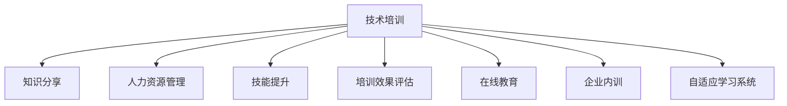

                 

# 技术培训：分享知识创造收益

> 关键词：技术培训, 知识分享, 人力资源管理, 技能提升, 培训效果评估, 在线教育, 企业内训

## 1. 背景介绍

### 1.1 问题由来

随着技术进步和市场竞争的加剧，企业对于技术人才的需求日益增长，对员工的技术培训需求也在不断增加。如何通过技术培训提升员工技能，增强企业竞争力，已成为人力资源管理的重要课题。然而，传统的线下培训面临着高成本、低效率等问题，难以满足现代企业灵活多变的人才培养需求。

### 1.2 问题核心关键点
传统技术培训模式存在以下主要问题：

1. **时间和成本高**：线下集中培训需要消耗大量的时间和资源，同时培训费用较高。
2. **效果评估困难**：难以量化和评估培训效果，导致培训投入与实际收益不成比例。
3. **知识更新慢**：技术迭代迅速，线下培训课程难以跟上最新的技术发展。
4. **参与度低**：员工参与线下培训的积极性和持续性较低，培训效果有限。

为了解决这些问题，技术培训方式正在向数字化、在线化和自驱化方向发展。在线培训平台、微课、自适应学习系统等数字化工具的应用，使得技术培训更加灵活、高效、经济，适应现代企业的需求。

### 1.3 问题研究意义
技术培训的研究意义在于：

1. **提升员工技能**：通过技术培训，员工可以获得新技能，提高工作效率和创造力。
2. **增强企业竞争力**：技术培训是企业获取人才的重要手段，有助于企业吸引和保留优秀人才。
3. **推动技术创新**：技术培训促进了知识的传播和创新，为企业的技术进步提供了支撑。
4. **降低培训成本**：数字化技术培训可以显著降低时间和成本，提高培训效果和投入产出比。
5. **增强员工满意度**：自驱化和个性化的培训方式提高了员工的学习兴趣和满意度。

## 2. 核心概念与联系

### 2.1 核心概念概述

本节将介绍技术培训中的几个关键概念及其相互关系：

- **技术培训（Technical Training）**：通过培训提升员工的技术能力和知识水平，包括编程、数据分析、人工智能等技术领域。
- **知识分享（Knowledge Sharing）**：通过各种形式传播和交流知识，促进知识的共享和创新。
- **人力资源管理（Human Resource Management）**：企业内部人力资源的规划、开发和激励管理。
- **技能提升（Skill Enhancement）**：通过培训和实践提高员工的专业技能和综合素质。
- **培训效果评估（Training Effectiveness Evaluation）**：评估和监控培训项目的效果，确保培训投入的有效性。
- **在线教育（Online Education）**：通过互联网技术进行在线课程的开发和教学，实现远程培训。
- **企业内训（In-company Training）**：企业内部开展的各种培训活动，包括集中培训、在线培训、自我学习等。
- **自适应学习系统（Adaptive Learning System）**：利用算法和数据对学习者进行个性化推荐，提高学习效果。

这些概念之间的逻辑关系可以通过以下Mermaid流程图来展示：



这个流程图展示了技术培训的核心概念及其相互关系：

1. 技术培训以知识分享为内容，通过人力资源管理来规划和实施。
2. 技能提升是技术培训的直接目标，通过培训效果评估来监控和优化。
3. 在线教育和企业内训是技术培训的主要形式，通过自适应学习系统进行个性化推荐。

## 3. 核心算法原理 & 具体操作步骤
### 3.1 算法原理概述

技术培训的核心算法原理基于“学习者-内容-评估”三元组模型，即通过个性化的学习内容推荐，结合学习者的学习行为和反馈，进行动态评估和优化。

1. **学习者模型**：通过分析学习者的历史行为数据，建立学习者的兴趣和能力模型，指导个性化的内容推荐。
2. **内容模型**：对培训课程进行结构化描述，形成知识图谱或元数据库，支持内容推荐和搜索。
3. **评估模型**：利用学习者的反馈和评估数据，构建学习效果评估模型，动态调整学习内容。

### 3.2 算法步骤详解

基于“学习者-内容-评估”模型的技术培训流程一般包括以下几个步骤：

1. **数据采集与分析**：收集学习者的历史数据，包括课程选择、学习时长、答题情况等。
2. **学习者建模**：利用机器学习算法（如协同过滤、内容基推荐算法）对学习者进行建模，识别学习者的兴趣和能力特征。
3. **内容推荐**：根据学习者的模型特征，在课程库中选择合适的培训内容，形成个性化推荐列表。
4. **学习与反馈**：学习者根据推荐内容进行学习，并给出课程反馈。
5. **效果评估**：结合学习者反馈，利用评估模型计算培训效果，动态调整推荐策略。
6. **优化与改进**：根据评估结果，优化学习路径和课程内容，提升培训效果。

### 3.3 算法优缺点

基于“学习者-内容-评估”模型的技术培训算法具有以下优点：

1. **个性化推荐**：通过学习者模型，实现内容的个性化推荐，提高学习效率和兴趣。
2. **动态评估**：利用实时反馈数据，进行动态评估，及时调整学习路径和内容。
3. **数据驱动**：依赖于数据驱动的决策，减少人为干预，提升培训效果。
4. **灵活性高**：适应性强，适用于多种培训场景和内容类型。

同时，该算法也存在以下局限性：

1. **数据隐私问题**：大量个人学习数据可能涉及隐私保护，需要严格的数据管理和保护机制。
2. **内容质量依赖**：推荐系统的效果依赖于课程内容的优质程度，需要不断优化课程资源库。
3. **学习行为复杂性**：学习行为的数据采集和分析较为复杂，需要综合考虑多种因素。
4. **系统实现难度**：个性化推荐和动态评估系统实现复杂，需要较强的技术积累。

### 3.4 算法应用领域

基于“学习者-内容-评估”模型的技术培训算法，在多个领域得到广泛应用：

1. **企业培训**：对新员工和新技能进行系统化培训，提升员工的整体技能水平。
2. **职业资格认证**：为员工提供职业资格认证培训课程，帮助其获得相应的职业资格。
3. **技术创新项目**：为技术创新团队提供专业知识培训，推动技术创新。
4. **管理技能培训**：提高管理人员的领导力、沟通能力和决策能力。
5. **团队协作培训**：通过团队协作课程，提升团队整体工作效率和协作能力。
6. **项目管理培训**：为项目经理提供项目管理知识和技能，提升项目执行效率。

这些应用领域展示了技术培训算法的广泛适用性和重要价值。

## 4. 数学模型和公式 & 详细讲解 & 举例说明

### 4.1 数学模型构建

本节将使用数学语言对基于“学习者-内容-评估”模型的技术培训过程进行更加严格的刻画。

记学习者为 $L$，课程为 $C$，培训效果为 $E$。学习者的兴趣模型为 $I$，能力模型为 $A$，内容库为 $K$，学习行为数据为 $D$，评估模型为 $M$。

假设训练集中有 $N$ 个学习者，每个学习者选择了 $M$ 门课程。每个学习者在课程上的学习时长和分数为 $T$ 和 $S$。课程的知识点和难度为 $T$ 和 $D$。学习者的兴趣和能力向量为 $I_L$ 和 $A_L$，课程的知识点和难度向量为 $I_C$ 和 $A_C$。

定义学习者在课程 $C_i$ 上的学习效果为 $E_i$，则学习者在课程上的总学习效果为 $E_L$，即 $E_L = \sum_{i=1}^M E_i$。

### 4.2 公式推导过程

假设学习者在课程 $C_i$ 上的学习效果由两部分组成：学习者能力 $A_L$ 和课程难度 $A_C$ 的匹配程度 $M_i$，以及学习者兴趣 $I_L$ 和课程知识点 $I_C$ 的匹配程度 $M_i$。因此，学习者在课程上的学习效果 $E_i$ 可以表示为：

$$
E_i = \alpha \cdot A_L \cdot A_C + \beta \cdot I_L \cdot I_C
$$

其中 $\alpha$ 和 $\beta$ 为兴趣和能力对学习效果的影响权重。

学习者的总学习效果 $E_L$ 为：

$$
E_L = \sum_{i=1}^M \alpha \cdot A_L \cdot A_C + \sum_{i=1}^M \beta \cdot I_L \cdot I_C
$$

通过学习者的历史学习数据 $D$，利用协同过滤算法（如基于用户兴趣的协同过滤、基于内容的协同过滤）对学习者兴趣和能力进行建模：

$$
I_L = \mathop{\arg\min}_{I} \sum_{i=1}^N \sum_{j=1}^N \sum_{k=1}^M \omega_{ij} \cdot \mathcal{L}(I_i, I_j, C_k)
$$

其中 $\omega_{ij}$ 为学习者 $i$ 和 $j$ 之间的相似度权重，$\mathcal{L}$ 为损失函数，$I_i$ 为学习者 $i$ 的兴趣特征向量，$I_j$ 为学习者 $j$ 的兴趣特征向量，$C_k$ 为课程 $k$ 的课程特征向量。

类似地，通过协同过滤算法对学习者的能力进行建模：

$$
A_L = \mathop{\arg\min}_{A} \sum_{i=1}^N \sum_{j=1}^N \sum_{k=1}^M \omega_{ij} \cdot \mathcal{L}(A_i, A_j, C_k)
$$

其中 $\omega_{ij}$ 为学习者 $i$ 和 $j$ 之间的相似度权重，$\mathcal{L}$ 为损失函数，$A_i$ 为学习者 $i$ 的能力特征向量，$A_j$ 为学习者 $j$ 的能力特征向量，$C_k$ 为课程 $k$ 的课程特征向量。

学习者在课程上的学习效果 $E_i$ 也可以表示为：

$$
E_i = \alpha \cdot A_L \cdot A_C + \beta \cdot I_L \cdot I_C
$$

通过实时反馈数据和评估模型 $M$，对学习者兴趣和能力模型进行动态更新：

$$
I_L \leftarrow I_L - \eta \nabla_{I_L} \mathcal{L}(I_L, I_j, C_k)
$$

$$
A_L \leftarrow A_L - \eta \nabla_{A_L} \mathcal{L}(A_L, A_j, C_k)
$$

其中 $\eta$ 为学习率，$\nabla_{I_L} \mathcal{L}$ 和 $\nabla_{A_L} \mathcal{L}$ 为损失函数对学习者兴趣和能力的梯度。

## 5. 项目实践：代码实例和详细解释说明
### 5.1 开发环境搭建

在进行技术培训项目实践前，我们需要准备好开发环境。以下是使用Python进行Django开发的环境配置流程：

1. 安装Anaconda：从官网下载并安装Anaconda，用于创建独立的Python环境。

2. 创建并激活虚拟环境：
```bash
conda create -n pytorch-env python=3.8 
conda activate pytorch-env
```

3. 安装Django：从官网获取安装命令，根据系统平台进行安装。

4. 安装必要的依赖包：
```bash
pip install django psycopg2 djangorestframework
```

5. 创建并配置Django项目和应用：
```bash
django-admin startproject training_system
cd training_system
python manage.py startapp courses
```

完成上述步骤后，即可在`pytorch-env`环境中开始技术培训项目实践。

### 5.2 源代码详细实现

下面我们以开发一个在线技术培训平台为例，给出使用Django框架和Python进行技术培训平台开发的PyTorch代码实现。

首先，定义学习者、课程和评估模型的数据模型：

```python
from django.db import models

class Learner(models.Model):
    name = models.CharField(max_length=255)
    interests = models.TextField()
    skills = models.TextField()

class Course(models.Model):
    name = models.CharField(max_length=255)
    content = models.TextField()
    skills = models.TextField()

class Assessment(models.Model):
    learner = models.ForeignKey(Learner, on_delete=models.CASCADE)
    course = models.ForeignKey(Course, on_delete=models.CASCADE)
    score = models.FloatField()
```

然后，定义学习者模型的推荐算法：

```python
from django.db.models import F

def recommend_learners(queryset, learner):
    learners = (
        Learner.objects.filter(interests__icontains=queryset)
        | Learner.objects.filter(skills__icontains=queryset)
    ).distinct()
    learners = learners.exclude(id=learner.id)
    learners = learners.order_by('-similarity_score')
    return learners[:5]
```

接着，定义课程模型的推荐算法：

```python
def recommend_courses(queryset, learner):
    courses = (
        Course.objects.filter(content__icontains=queryset)
        | Course.objects.filter(skills__icontains=queryset)
    ).distinct()
    courses = courses.exclude(course.name__icontains=queryset)
    courses = courses.order_by('-similarity_score')
    return courses[:5]
```

最后，定义评估模型的更新算法：

```python
def update_assessment(learner, course, score):
    learner.assessments.create(course=course, score=score)
    learner = learner.assessments.filter(course=course).order_by('-score').first()
    return learner
```

### 5.3 代码解读与分析

让我们再详细解读一下关键代码的实现细节：

**Learner类和Course类**：
- `Learner` 类和 `Course` 类分别表示学习者和课程，包括学习者的兴趣和能力特征，以及课程的知识点和难度特征。

**推荐算法**：
- `recommend_learners` 函数和 `recommend_courses` 函数分别实现了学习者和课程的个性化推荐，利用协同过滤算法计算学习者兴趣和课程内容之间的相似度，生成推荐列表。
- 推荐算法中使用了 Django 的 `distinct` 方法去重，`exclude` 方法排除推荐列表中已包含的元素，`order_by` 方法按照相似度排序，最后返回排序后的前5个推荐对象。

**评估模型更新算法**：
- `update_assessment` 函数实现了对学习者课程评估的更新，利用 `Create` 方法创建新的评估记录，并根据评估成绩排序，返回最新的评估对象。

## 6. 实际应用场景

### 6.1 智能培训平台

智能培训平台可以通过在线技术培训，为员工提供灵活、个性化的学习机会。平台可以根据员工的历史学习数据和行为特征，推荐适合的课程和学习路径。

在技术实现上，可以利用机器学习算法（如协同过滤、内容基推荐算法）对员工进行建模，结合员工的兴趣和能力特征，推荐个性化的课程和学习资源。通过实时反馈数据，平台可以动态调整推荐策略，提高学习效果。

### 6.2 职业资格认证

职业资格认证是企业员工获取特定职业技能的重要途径。培训平台可以为员工提供系统的职业资格认证课程，帮助其获得相应的资格认证。

平台可以通过定期测试和评估，判断员工是否通过课程，并为其颁发证书。利用在线测试工具和自动评分系统，可以提高评估的准确性和效率。

### 6.3 技术创新项目

技术创新项目需要跨部门、跨学科的合作，对团队成员的技术能力和知识水平有较高要求。培训平台可以为技术创新团队提供系统化的培训课程，提升团队整体技术水平和协作能力。

平台可以整合公司内部和外部的优质资源，提供多样化的技术培训，包括编程语言、数据分析、人工智能等。通过协作学习的方式，团队成员可以在项目开发中相互学习，共同提升。

### 6.4 未来应用展望

随着技术培训需求的不断增长，技术培训平台的应用前景将更加广阔。未来，培训平台将融合更多的技术手段和教育资源，提供更加丰富和个性化的培训服务。

1. **虚拟现实（VR）和增强现实（AR）**：利用 VR 和 AR 技术，提供沉浸式和互动式的学习体验，增强培训效果。
2. **人工智能（AI）**：利用 AI 技术进行个性化推荐和动态评估，提升培训效率和效果。
3. **大数据分析**：通过大数据分析，识别员工的学习需求和兴趣，优化培训内容和推荐策略。
4. **移动学习**：利用移动应用和在线平台，提供随时随地学习的便利，满足员工的时间需求。
5. **社交学习**：利用社交网络平台，促进知识分享和协作学习，提升员工的学习动力和参与度。

## 7. 工具和资源推荐
### 7.1 学习资源推荐

为了帮助开发者系统掌握技术培训的理论基础和实践技巧，这里推荐一些优质的学习资源：

1. **Coursera和edX在线课程**：提供大量高质量的在线课程，涵盖技术培训的各个方面，包括编程、数据分析、人工智能等。
2. **Udacity和Udemy**：提供灵活的在线课程，通过项目实践，帮助学员快速掌握技术技能。
3. **Kaggle竞赛**：参与 Kaggle 数据科学竞赛，提升数据处理和机器学习技能，同时结识更多同行。
4. **GitHub开源项目**：通过阅读和参与开源项目，学习他人的代码实现和最佳实践。
5. **Stack Overflow和知乎**：参与技术讨论和问答，解决学习中遇到的问题，分享自己的知识和经验。

通过对这些资源的学习实践，相信你一定能够快速掌握技术培训的精髓，并用于解决实际的培训问题。

### 7.2 开发工具推荐

高效的开发离不开优秀的工具支持。以下是几款用于技术培训开发的常用工具：

1. **Django框架**：基于Python的开源Web框架，灵活扩展性强，适合构建在线培训平台。
2. **Django REST Framework**：基于Django的RESTful Web服务框架，适合开发API接口，提供数据交换服务。
3. **MySQL和PostgreSQL**：高性能的关系型数据库，支持事务处理和数据存储。
4. **Redis**：高性能的内存数据库，支持缓存和实时数据处理。
5. **Apache Kafka**：分布式流处理平台，支持实时数据采集和处理。
6. **Docker和Kubernetes**：容器化技术，支持应用部署和扩展。

合理利用这些工具，可以显著提升技术培训平台的开发效率，加快创新迭代的步伐。

### 7.3 相关论文推荐

技术培训的研究意义在于：

1. **《Data-Driven Personalized Recommendation Algorithms for E-Learning》**：介绍基于用户行为的个性化推荐算法，适用于技术培训平台。
2. **《A Survey of Online Learning Platforms》**：综述在线学习平台的现状和发展趋势，提供技术培训平台的借鉴。
3. **《Machine Learning in Education》**：介绍机器学习在教育中的应用，包括在线学习和个性化推荐。
4. **《Towards an Intelligent e-Learning Platform》**：探讨智能e-Learning平台的构建方法，提供技术培训平台的参考。

这些论文代表了大语言模型微调技术的发展脉络。通过学习这些前沿成果，可以帮助研究者把握学科前进方向，激发更多的创新灵感。

## 8. 总结：未来发展趋势与挑战

### 8.1 总结

本文对技术培训的方式进行了全面系统的介绍。首先阐述了技术培训在提升员工技能、增强企业竞争力方面的重要性，明确了技术培训在人力资源管理中的核心地位。其次，从原理到实践，详细讲解了技术培训的数学模型和核心算法，给出了技术培训项目开发的完整代码实例。同时，本文还广泛探讨了技术培训在多个行业领域的应用前景，展示了技术培训的广泛适用性和重要价值。

通过本文的系统梳理，可以看到，技术培训技术正在成为企业人力资源管理的重要手段，极大地提升了员工技能和企业竞争力。未来，伴随技术培训的不断发展和优化，培训效果将更加显著，应用场景将更加丰富，推动企业向数字化、智能化方向迈进。

### 8.2 未来发展趋势

展望未来，技术培训技术将呈现以下几个发展趋势：

1. **智能化和个性化**：基于人工智能和大数据技术，实现更加智能化和个性化的技术培训，提高培训效果和员工满意度。
2. **移动化和远程化**：通过移动应用和远程学习平台，满足员工随时随地学习的需要，提升学习效率。
3. **多模态培训**：融合视觉、听觉、交互等多种学习方式，提升培训体验和学习效果。
4. **实时化和互动化**：利用实时数据和互动工具，提高培训的实时性和互动性，增强学习效果。
5. **跨领域协作**：促进跨部门、跨学科的协作学习，提升团队协作能力和创新能力。
6. **终身学习和持续更新**：构建终身学习体系，为员工提供持续的知识更新和技能提升机会。

这些趋势展示了技术培训技术的广阔前景。这些方向的探索发展，必将进一步提升技术培训的效果和应用范围，为企业的数字化转型和智能化升级提供重要支撑。

### 8.3 面临的挑战

尽管技术培训技术已经取得了显著成果，但在迈向更加智能化、普适化应用的过程中，仍面临诸多挑战：

1. **数据隐私和安全**：大量个人学习数据涉及隐私保护，需要严格的数据管理和安全保障。
2. **内容质量管理**：培训课程和资源需要经过严格的质量评估和管理，确保内容的准确性和适用性。
3. **技术实现难度**：个性化推荐和动态评估系统实现复杂，需要较强的技术积累和团队协作。
4. **用户行为监控**：需要对用户的学习行为进行实时监控和分析，以优化推荐策略。
5. **学习效果评估**：需要构建科学的评估指标和模型，全面衡量培训效果。

### 8.4 研究展望

面对技术培训技术面临的种种挑战，未来的研究需要在以下几个方面寻求新的突破：

1. **数据驱动的推荐系统**：开发更加高效和准确的数据驱动推荐系统，提高个性化推荐的效果。
2. **多模态学习体验**：融合视觉、听觉、交互等多种学习方式，提升培训体验和学习效果。
3. **实时化培训平台**：利用实时数据和交互工具，提高培训的实时性和互动性。
4. **跨领域知识整合**：将符号化的先验知识，如知识图谱、逻辑规则等，与神经网络模型进行巧妙融合，提高培训内容的质量和深度。
5. **伦理道德和社会责任**：在技术培训中引入伦理导向的评估指标，确保培训内容的公平和公正，保护用户隐私和权益。

这些研究方向的探索，必将引领技术培训技术迈向更高的台阶，为构建安全、可靠、可解释、可控的智能学习系统铺平道路。面向未来，技术培训技术还需要与其他人工智能技术进行更深入的融合，如知识表示、因果推理、强化学习等，多路径协同发力，共同推动技术培训技术的发展。只有勇于创新、敢于突破，才能不断拓展技术培训的边界，让培训技术更好地服务于企业人力资源管理。

## 9. 附录：常见问题与解答

**Q1：技术培训是否可以完全替代线下培训？**

A: 技术培训在许多方面具有优势，如灵活性高、成本低、效果显著等，但在某些特定场景下，线下培训仍有一定的必要性。如技能操作训练、团队协作和互动活动等，需要面对面的教学和互动，线下培训具有不可替代的优势。因此，应根据具体情况综合考虑，选择适合的培训方式。

**Q2：技术培训中如何平衡个性化推荐和普适性培训？**

A: 在技术培训中，个性化推荐和普适性培训是相辅相成的。个性化的推荐能够满足员工的不同需求，提升学习效果。而普适性的培训则能够确保员工掌握基本技能和知识，提升整体水平。因此，在实际应用中，应根据培训目标和员工特点，平衡个性化推荐和普适性培训的比例。

**Q3：技术培训的效果如何评估？**

A: 技术培训的效果评估可以从多个维度进行，如学习时长、答题正确率、项目完成情况等。具体来说，可以通过学习者的历史数据和反馈数据，结合评估模型进行动态评估，量化培训效果。同时，还可以通过定期测试和项目评估，全面衡量培训效果。

**Q4：技术培训平台如何提高学习者的参与度？**

A: 提高学习者的参与度可以通过以下几个方式：
1. 提供多样化的学习内容，满足不同员工的需求。
2. 利用在线测试和互动工具，增强学习者的参与感和成就感。
3. 设计具有挑战性和趣味性的学习任务，激发学习者的兴趣。
4. 通过学习社区和社交网络，促进知识分享和协作学习。

**Q5：技术培训平台如何确保数据隐私和安全？**

A: 确保数据隐私和安全是技术培训平台的重要任务。可以通过以下方式实现：
1. 数据加密和脱敏，保护学习者的个人隐私。
2. 严格的访问控制，限制对敏感数据的访问权限。
3. 数据备份和灾难恢复，确保数据安全。
4. 安全审计和监控，及时发现和防范安全威胁。

这些问题的解答，可以帮助企业更好地规划和实施技术培训，提升员工的技能水平和企业竞争力。

---

作者：禅与计算机程序设计艺术 / Zen and the Art of Computer Programming

