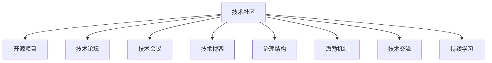

                 

# 技术社区建设：从参与者到组织者

> 关键词：技术社区, 参与者, 组织者, 治理结构, 激励机制, 技术交流, 持续学习

## 1. 背景介绍

### 1.1 问题由来
随着互联网和信息技术的飞速发展，技术社区在各行各业中扮演着越来越重要的角色。技术社区不仅是技术交流的平台，更是技术创新的源泉。无论是开源项目、技术论坛、技术会议还是技术博客，它们都是技术人展示、交流和协作的重要场所。然而，技术社区的发展也面临着诸多挑战：如何有效治理社区，维持社区的活力和健康，鼓励高质量的交流和合作，这些都是亟待解决的问题。

### 1.2 问题核心关键点
构建一个健康、活跃、高效的技术社区，需要明确以下几个核心关键点：
- **社区目标**：社区应该明确其存在的价值和目标，这是构建社区的出发点和落脚点。
- **治理结构**：如何组织和管理社区，确保社区的健康发展和有序运行。
- **激励机制**：如何激励社区成员参与，保持社区的活跃度和创造力。
- **技术交流**：如何建立高效的交流机制，促进社区成员间的知识共享和经验传承。
- **持续学习**：如何引导社区成员持续学习，跟上技术发展的步伐。

## 2. 核心概念与联系

### 2.1 核心概念概述

为更好地理解如何构建技术社区，本节将介绍几个密切相关的核心概念：

- **技术社区**：聚集技术从业者，通过技术交流、知识共享、项目协作等方式，推动技术进步和创新。
- **开源项目**：开放源代码的软件项目，鼓励社区成员共同开发、维护和使用。
- **技术论坛**：在线或线下的技术交流平台，提供技术讨论、问题解答、经验分享等。
- **技术会议**：面向技术人的聚会，进行技术演讲、技术研讨、技术展览等。
- **技术博客**：记录和分享技术经验、项目进展、技术洞见的个人或组织博客。
- **治理结构**：社区的组织和管理方式，包括决策机制、规则制定、资源分配等。
- **激励机制**：通过荣誉、奖励、认证等方式，激发社区成员的积极性和创造力。
- **技术交流**：包括技术讨论、代码审查、技术讲座等，促进知识和经验的传播。
- **持续学习**：通过培训、课程、工作坊等方式，持续提升社区成员的技术能力和知识水平。

这些核心概念之间的逻辑关系可以通过以下Mermaid流程图来展示：



这个流程图展示了一组技术社区构建的各个核心概念及其之间的关联：

1. 技术社区通过多种形式的活动和资源，如开源项目、技术论坛、技术会议、技术博客等，提供技术交流和学习的平台。
2. 社区的治理结构、激励机制、技术交流和持续学习，共同保障社区的健康运作和发展。

## 3. 核心算法原理 & 具体操作步骤
### 3.1 算法原理概述

构建技术社区的核心算法原理主要包括治理结构和激励机制的优化设计。以下是其基本原理：

- **治理结构**：通过设计合理的社区决策机制、规则制定、资源分配等，确保社区的有序运行和高效管理。
- **激励机制**：通过荣誉、奖励、认证等方式，激发社区成员的积极性和创造力，保持社区的活跃度和创造力。

### 3.2 算法步骤详解

构建技术社区的具体步骤包括：

**Step 1: 明确社区目标**
- 确定社区的核心价值和目标，包括社区存在的意义、预期达成的成果等。
- 通过社区规划文档和社区宪章明确社区目标，使其成为社区成员共同遵守的行动指南。

**Step 2: 设计治理结构**
- 设计社区的组织和管理方式，包括社区架构、决策机制、角色分配等。
- 建立社区管理委员会或理事会，负责社区的日常管理和重大决策。
- 制定社区规则和行为准则，明确社区成员的权利和义务，确保社区秩序和健康发展。

**Step 3: 建立激励机制**
- 设计合理的激励措施，如贡献奖励、技术认证、荣誉称号等，激发社区成员的积极性和创造力。
- 设置社区贡献排行榜，表彰贡献突出的成员，树立榜样。
- 举办技术竞赛、技术挑战赛等活动，激发社区成员的创新热情。

**Step 4: 推动技术交流**
- 定期举办技术讲座、技术讨论会、代码审查等活动，促进社区成员间的知识共享和经验传承。
- 建立社区知识库或论坛，提供技术交流的平台，鼓励社区成员发布和分享技术洞见和经验。
- 设立技术导师制度，帮助新手提升技术能力，促进技术社区的持续发展。

**Step 5: 实施持续学习**
- 组织社区成员参与培训、课程、工作坊等活动，提升技术能力和知识水平。
- 鼓励社区成员参与开源项目和创新实验，通过实践学习新技能。
- 定期评估社区成员的技术水平和贡献度，提供持续学习和成长的机会。

### 3.3 算法优缺点

构建技术社区的优势包括：
1. 促进技术交流和知识共享，提升社区成员的技术水平和创新能力。
2. 鼓励社区成员的积极参与和贡献，保持社区的活力和健康。
3. 建立社区的规范和秩序，确保社区的有序运行和高效管理。

但社区构建过程中也面临一些挑战和不足：
1. 社区治理结构复杂，需要协调多方利益和资源，容易出现管理上的困难。
2. 激励机制设计不当，可能引发社区内部的激励失衡和人员流失。
3. 技术交流方式单一，可能无法满足不同成员的交流需求。
4. 持续学习机制缺乏弹性，可能无法满足不同成员的学习节奏和需求。

尽管存在这些局限性，但通过合理设计和灵活调整，社区构建依然可以实现其目标，为技术人的成长和创新提供坚实的基础。

### 3.4 算法应用领域

构建技术社区的方法在多个领域得到了广泛应用，包括但不限于：

- **开源社区**：如Linux Kernel、Apache Software Foundation等，通过开源项目的协作和贡献，推动技术创新和应用普及。
- **技术论坛**：如Stack Overflow、GitHub Issues等，通过技术讨论和问题解答，促进技术交流和知识共享。
- **技术会议**：如SIGGRAPH、NeurIPS等，通过技术演讲和研讨，推动技术前沿的发展和应用。
- **技术博客**：如TechCrunch、Medium等，通过记录和分享技术洞见，促进技术传播和创新。
- **企业内部社区**：如谷歌的ATAP（先进技术及产品），通过内部项目的协作和创新，推动企业技术的持续进步。

这些领域的技术社区构建，展示了多样化的应用场景和创新模式，为其他社区的建设提供了宝贵的经验。

## 4. 数学模型和公式 & 详细讲解 & 举例说明

### 4.1 数学模型构建

构建技术社区的数学模型主要涉及社区治理结构和激励机制的设计。假设社区成员数为 $N$，社区的组织管理成本为 $C$，激励机制的成本为 $I$，成员的贡献度为 $L$，社区的总收益为 $R$。则社区的总效用函数可以表示为：

$$
U = R - C - I
$$

社区的总收益 $R$ 包括成员的贡献 $L$ 和激励机制的回报 $P$，即：

$$
R = L + P
$$

其中 $P$ 表示激励机制的回报，可以包括荣誉称号、物质奖励等。

### 4.2 公式推导过程

社区的治理结构和激励机制的设计，需要最大化总效用 $U$。因此，我们需要求解：

$$
\max_{C,I} U
$$

在约束条件下：

$$
R = L + P
$$

即：

$$
\max_{C,I} (L + P - C - I)
$$

假设 $P = kL$，其中 $k$ 为激励系数，则：

$$
\max_{C,I} (L + kL - C - I)
$$

化简得：

$$
\max_{C,I} (L(1+k) - C - I)
$$

这是一个典型的优化问题，可以通过拉格朗日乘子法求解。

### 4.3 案例分析与讲解

假设一个开源社区有100名成员，其组织管理成本为10万元，激励机制成本为5万元，成员的贡献度为50万元，激励系数为0.2。则：

$$
U = 50 + 0.2 \times 50 - 10 - 5 = 35 \text{万元}
$$

假设将激励机制成本增加到10万元，则：

$$
U = 50 + 0.2 \times 50 - 10 - 10 = 25 \text{万元}
$$

这说明适当的激励机制可以提高社区的总效用，但过度激励会增加成本，降低社区的整体效益。

## 5. 项目实践：代码实例和详细解释说明
### 5.1 开发环境搭建

在进行社区建设的项目实践前，我们需要准备好开发环境。以下是使用Python进行PyTorch开发的环境配置流程：

1. 安装Anaconda：从官网下载并安装Anaconda，用于创建独立的Python环境。

2. 创建并激活虚拟环境：
```bash
conda create -n pytorch-env python=3.8 
conda activate pytorch-env
```

3. 安装PyTorch：根据CUDA版本，从官网获取对应的安装命令。例如：
```bash
conda install pytorch torchvision torchaudio cudatoolkit=11.1 -c pytorch -c conda-forge
```

4. 安装相关库：
```bash
pip install transformers matplotlib scikit-learn pandas numpy
```

5. 安装Jupyter Notebook：
```bash
pip install jupyter notebook
```

完成上述步骤后，即可在`pytorch-env`环境中开始社区建设的项目实践。

### 5.2 源代码详细实现

这里我们以构建一个基于GitHub的开源社区为例，给出社区建设项目的完整代码实现。

首先，定义社区的基本结构：

```python
import os
from collections import namedtuple

class Community:
    def __init__(self, name, members):
        self.name = name
        self.members = members
        self.repositories = []
        self.rules = []
        self.activities = []

    def add_repository(self, repo):
        self.repositories.append(repo)

    def add_rule(self, rule):
        self.rules.append(rule)

    def add_activity(self, activity):
        self.activities.append(activity)

    def display(self):
        print(f"Community: {self.name}")
        print("Members:")
        for member in self.members:
            print(member)
        print("Repositories:")
        for repo in self.repositories:
            print(repo)
        print("Rules:")
        for rule in self.rules:
            print(rule)
        print("Activities:")
        for activity in self.activities:
            print(activity)
```

然后，定义社区成员和活动的基本类：

```python
Member = namedtuple('Member', ['name', 'role', 'contribution'])

class Activity:
    def __init__(self, name, description, frequency):
        self.name = name
        self.description = description
        self.frequency = frequency

    def display(self):
        print(f"Activity: {self.name}")
        print(f"Description: {self.description}")
        print(f"Frequency: {self.frequency}")
```

接着，定义社区规则：

```python
class Rule:
    def __init__(self, name, description):
        self.name = name
        self.description = description

    def display(self):
        print(f"Rule: {self.name}")
        print(f"Description: {self.description}")
```

最后，定义社区治理结构和激励机制：

```python
class Governance:
    def __init__(self, members, activities, rules):
        self.members = members
        self.activities = activities
        self.rules = rules

    def display(self):
        print("Governance:")
        print("Members:")
        for member in self.members:
            member.display()
        print("Activities:")
        for activity in self.activities:
            activity.display()
        print("Rules:")
        for rule in self.rules:
            rule.display()

class Incentive:
    def __init__(self, name, description, cost):
        self.name = name
        self.description = description
        self.cost = cost

    def display(self):
        print(f"Incentive: {self.name}")
        print(f"Description: {self.description}")
        print(f"Cost: {self.cost}")
```

现在，我们可以创建一个社区，并添加成员、活动和规则：

```python
# 创建社区
community = Community("OpenAI", ["Alice", "Bob", "Charlie"])

# 添加成员
alice = Member("Alice", "Contributor", 100)
bob = Member("Bob", "Mentor", 200)
charlie = Member("Charlie", "Newcomer", 50)

community.add_repository("GPT")
community.add_repository("BERT")
community.add_rule("Code of Conduct")
community.add_rule("Copyright Policy")

# 添加活动
meeting = Activity("Monthly Meeting", "All members must attend", "Monthly")
tech_talk = Activity("Tech Talk", "Specialized topics discussed", "Quarterly")
workshop = Activity("Workshop", "Hands-on coding and learning", "Monthly")

# 添加激励
contribution_reward = Incentive("Contribution Reward", "Monetary reward for top contributors", 1000)
tech_talk_incentive = Incentive("Tech Talk Incentive", "Special recognition for speakers", 500)
workshop_incentive = Incentive("Workshop Incentive", "Certificates for participants", 300)

# 显示社区信息
community.display()
```

以上代码实现了一个基于GitHub的开源社区的基本结构。开发者可以根据实际需求，添加更多成员、活动和规则，并进行相应的优化和调整。

### 5.3 代码解读与分析

让我们再详细解读一下关键代码的实现细节：

**Community类**：
- `__init__`方法：初始化社区名称和成员列表。
- `add_repository`方法：向社区添加项目。
- `add_rule`方法：向社区添加规则。
- `add_activity`方法：向社区添加活动。
- `display`方法：显示社区的基本信息。

**Member类**：
- 使用Python的命名元组(tuple)定义成员的基本信息。
- 成员包括名称、角色和贡献度。

**Activity类**：
- `__init__`方法：初始化活动的基本信息。
- `display`方法：显示活动的基本信息。

**Rule类**：
- `__init__`方法：初始化规则的基本信息。
- `display`方法：显示规则的基本信息。

**Governance类**：
- `__init__`方法：初始化社区治理结构的基本信息。
- `display`方法：显示社区治理结构的基本信息。

**Incentive类**：
- `__init__`方法：初始化激励的基本信息。
- `display`方法：显示激励的基本信息。

通过上述代码的实现，我们可以看到社区构建的基本框架和组件。开发者可以根据具体需求，灵活调整和扩展，以满足社区建设的多样化需求。

## 6. 实际应用场景
### 6.1 开源社区

开源社区是构建技术社区的重要形式之一。开源社区通过开源项目的协作和贡献，推动技术的进步和应用普及。以下是开源社区的一些实际应用场景：

- **GitHub**：作为全球最大的开源社区，GitHub提供了一个平台，让全球的开发者共同协作、交流和学习。
- **Apache Software Foundation**：通过Apache基金会，众多开源项目得到了支持和推广，成为了开源社区的重要组成部分。
- **Linux Kernel**：作为世界上最受欢迎的操作系统之一，Linux Kernel的开源项目吸引了大批开发者的参与和贡献。

这些开源社区的成功经验，为其他技术社区的建设提供了宝贵的参考。

### 6.2 技术论坛

技术论坛是技术人交流和分享技术洞见的重要场所。以下是技术论坛的一些实际应用场景：

- **Stack Overflow**：作为全球最大的技术问答社区，Stack Overflow提供了丰富的问题解答和经验分享。
- **Reddit**：通过子版块的形式，Reddit聚集了不同技术领域的爱好者，进行深入的讨论和交流。
- **Hacker News**：提供最新的技术新闻和趋势，促进技术人的知识更新和创新。

这些技术论坛的存在，为技术人提供了丰富的交流平台，促进了技术的传播和创新。

### 6.3 技术会议

技术会议是技术人聚集、交流和分享前沿技术的场所。以下是技术会议的一些实际应用场景：

- **SIGGRAPH**：作为图形学领域的顶级会议，SIGGRAPH汇集了全球顶尖的图形学专家，进行技术研讨和展示。
- **NeurIPS**：作为人工智能领域的顶级会议，NeurIPS吸引了众多AI专家进行前沿技术的展示和讨论。
- **Google I/O**：作为Google的年度大会，展示了最新的技术创新和应用案例，促进了技术的普及和应用。

这些技术会议的存在，为技术人提供了丰富的交流机会，促进了技术的创新和发展。

### 6.4 技术博客

技术博客是技术人记录和分享技术洞见的重要形式。以下是技术博客的一些实际应用场景：

- **TechCrunch**：作为全球知名的科技新闻网站，TechCrunch报道了最新的科技新闻和趋势，为技术人提供了丰富的信息源。
- **Medium**：通过技术博客的形式，Medium提供了丰富的技术洞见和经验分享。
- **CSDN**：作为中国的技术社区，CSDN聚集了大量的技术人，进行技术交流和分享。

这些技术博客的存在，为技术人提供了丰富的学习资源，促进了技术的传播和创新。

### 6.5 企业内部社区

企业内部社区是企业内部技术人交流和协作的重要形式。以下是企业内部社区的一些实际应用场景：

- **谷歌的ATAP**：作为谷歌内部的创新实验室，ATAP聚集了顶尖的技术人才，进行前沿技术的研发和应用。
- **IBM Research**：通过IBM Research的内部社区，IBM的研究人员进行跨部门的合作和交流，推动技术的进步。
- **亚马逊的AWS**：通过AWS社区，亚马逊的技术人员进行跨部门的协作和创新，推动技术的普及和应用。

这些企业内部社区的存在，为技术人提供了丰富的交流机会，促进了技术的创新和发展。

## 7. 工具和资源推荐
### 7.1 学习资源推荐

为了帮助开发者系统掌握技术社区构建的理论基础和实践技巧，这里推荐一些优质的学习资源：

1. **《社区管理：从零到一》**：一本系统介绍社区构建和管理的书，涵盖社区建设、治理结构、激励机制等多个方面。
2. **《开源社区的实践与挑战》**：一本介绍开源社区的建设和管理的书，提供了丰富的开源社区建设案例和经验。
3. **《技术论坛的运营与管理》**：一本介绍技术论坛运营和管理的书籍，提供了技术论坛的运营策略和实践经验。
4. **《技术会议的组织与策划》**：一本介绍技术会议组织和策划的书籍，提供了技术会议的组织方法和实践经验。
5. **《技术博客的运营与推广》**：一本介绍技术博客运营和推广的书籍，提供了技术博客的运营策略和实践经验。

通过对这些资源的学习实践，相信你一定能够系统掌握技术社区构建的理论基础和实践技巧，为社区建设提供全面的指导。

### 7.2 开发工具推荐

高效的开发离不开优秀的工具支持。以下是几款用于技术社区构建开发的常用工具：

1. **GitHub**：全球最大的代码托管平台，提供丰富的开源项目和协作工具。
2. **Stack Overflow**：全球最大的技术问答社区，提供丰富的问题解答和经验分享。
3. **Slack**：一款团队协作工具，提供丰富的沟通和协作功能。
4. **Discord**：一款团队沟通工具，支持语音、文字、视频等多种沟通方式。
5. **JIRA**：一款项目管理工具，支持任务分配、进度跟踪、问题追踪等多种功能。

合理利用这些工具，可以显著提升技术社区构建的开发效率，加速创新迭代的步伐。

### 7.3 相关论文推荐

技术社区的研究源于学界的持续研究。以下是几篇奠基性的相关论文，推荐阅读：

1. **《社区结构与社区管理》**：一篇介绍社区结构和管理的研究论文，提供了社区建设的理论基础和实践经验。
2. **《开源社区的演进与治理》**：一篇介绍开源社区演进和治理的研究论文，提供了开源社区建设的实践经验。
3. **《技术论坛的运营模式》**：一篇介绍技术论坛运营模式的研究论文，提供了技术论坛建设的实践经验。
4. **《技术会议的组织与管理》**：一篇介绍技术会议组织和管理的论文，提供了技术会议建设的实践经验。
5. **《技术博客的运营与推广》**：一篇介绍技术博客运营和推广的论文，提供了技术博客建设的实践经验。

这些论文代表了大社区构建的研究方向，提供了宝贵的理论和实践指导。

## 8. 总结：未来发展趋势与挑战
### 8.1 总结

本文对技术社区的构建方法进行了全面系统的介绍。首先阐述了技术社区构建的背景和重要性，明确了社区构建的目标和关键点。其次，从原理到实践，详细讲解了社区治理结构和激励机制的优化设计，提供了社区构建的完整代码实例。同时，本文还广泛探讨了技术社区在开源社区、技术论坛、技术会议、技术博客等多个领域的应用前景，展示了社区构建的广阔前景。此外，本文精选了社区构建的技术资源，力求为读者提供全方位的技术指引。

通过本文的系统梳理，可以看到，技术社区构建不仅涉及组织和管理，还需要在激励机制、技术交流、持续学习等方面进行全面的优化和调整。只有从多个维度协同发力，才能真正实现技术社区的构建目标，为技术人的成长和创新提供坚实的基础。

### 8.2 未来发展趋势

展望未来，技术社区的构建和发展将呈现以下几个趋势：

1. **数据驱动**：未来的社区构建将更加注重数据驱动的方法，通过分析社区成员的行为和反馈，优化社区的治理结构和激励机制。
2. **智能推荐**：引入推荐系统技术，为社区成员推荐最适合的内容和活动，提高社区的互动和参与度。
3. **个性化定制**：通过AI技术，为社区成员提供个性化的内容和活动推荐，满足不同成员的需求。
4. **多模态融合**：引入多模态技术，如文本、语音、图像等多种形式的交流和协作，提升社区的多样性和丰富性。
5. **跨界融合**：社区建设将与其他行业和领域进行跨界融合，如技术社区与教育、娱乐、医疗等领域的结合，拓展社区的应用场景。

这些趋势将为技术社区的构建和发展带来新的机遇和挑战，推动技术社区迈向更高的层次。

### 8.3 面临的挑战

尽管技术社区的构建已经取得了一定的进展，但在迈向更加智能化、普适化应用的过程中，它仍面临诸多挑战：

1. **数据隐私和安全**：社区成员的数据隐私和安全问题，如何确保数据的合法使用和保护。
2. **内容审核和监管**：社区内容的审核和监管问题，如何保证社区内容的健康和合法。
3. **跨文化协作**：社区成员来自不同文化背景，如何促进跨文化协作和沟通。
4. **激励机制的公平性**：如何设计公平合理的激励机制，避免激励失衡和人员流失。
5. **持续学习的机制**：如何建立持续学习的机制，满足不同成员的学习节奏和需求。

正视社区构建面临的这些挑战，积极应对并寻求突破，将是大社区构建走向成熟的必由之路。相信随着学界和产业界的共同努力，这些挑战终将一一被克服，技术社区必将在构建人机协同的智能时代中扮演越来越重要的角色。

### 8.4 研究展望

面向未来，技术社区的研究需要在以下几个方面寻求新的突破：

1. **数据驱动的社区治理**：引入数据驱动的方法，优化社区的治理结构和激励机制。
2. **多模态协作机制**：引入多模态技术，提升社区的多样性和丰富性。
3. **跨文化协作机制**：建立跨文化协作机制，促进社区成员的跨文化交流和合作。
4. **个性化学习推荐**：引入推荐系统技术，为社区成员提供个性化的内容和活动推荐。
5. **智能社区运营**：引入AI技术，提升社区的智能化水平，优化社区的运营和管理。

这些研究方向的探索，将引领技术社区的构建走向新的高度，为技术人的成长和创新提供更加丰富和高效的平台。

## 9. 附录：常见问题与解答

**Q1：如何建立高效的社区激励机制？**

A: 高效的社区激励机制需要满足公平性、多样性和时效性三个原则。具体来说：
1. **公平性**：激励机制的设计需要考虑不同成员的贡献和努力，避免激励失衡。
2. **多样性**：激励机制需要涵盖多种形式的奖励，如荣誉、物质奖励、技术认证等，满足不同成员的需求。
3. **时效性**：激励机制需要及时反馈和表彰，激励成员持续参与和贡献。

**Q2：如何处理社区内的冲突和纠纷？**

A: 社区内的冲突和纠纷是不可避免的，关键在于及时发现和处理。具体来说：
1. **建立规则和准则**：社区需要制定明确的规则和准则，规范成员的行为。
2. **设立调解机制**：建立专门的调解机制，处理社区内的冲突和纠纷。
3. **公开透明**：处理过程需要公开透明，确保公正和合理。

**Q3：如何提高社区的活跃度？**

A: 社区的活跃度需要从多个方面进行提升。具体来说：
1. **提供高质量内容**：提供有价值的内容和资源，吸引成员参与和交流。
2. **举办有趣的活动**：定期举办有趣的活动，如技术讲座、技术挑战赛等，增加成员的参与热情。
3. **加强互动和沟通**：加强社区成员的互动和沟通，建立良好的交流氛围。

**Q4：如何保持社区的健康发展？**

A: 社区的健康发展需要从多个方面进行保障。具体来说：
1. **设立明确的规则和准则**：社区需要设立明确的规则和准则，规范成员的行为。
2. **建立良好的管理机制**：建立专业的管理团队，进行社区的日常管理和维护。
3. **持续优化和调整**：根据社区的反馈和需求，持续优化和调整社区的治理结构和激励机制。

通过本文的系统梳理，可以看到，技术社区的构建不仅涉及组织和管理，还需要在激励机制、技术交流、持续学习等方面进行全面的优化和调整。只有从多个维度协同发力，才能真正实现技术社区的构建目标，为技术人的成长和创新提供坚实的基础。

---

作者：禅与计算机程序设计艺术 / Zen and the Art of Computer Programming

