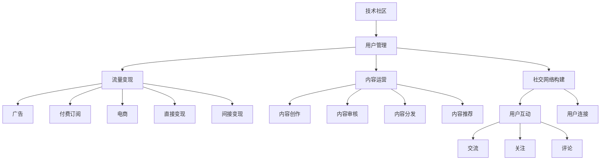

                 

# 技术社区运营：从管理到盈利模式

> 关键词：技术社区, 用户管理, 盈利模式, 流量变现, 内容运营, 社交网络

## 1. 背景介绍

### 1.1 问题由来

在过去的十年里，互联网社区经历了飞速的发展。技术社区作为其中的重要组成部分，不仅承载着技术交流、知识分享的功能，还成为了技术创新和人才汇聚的平台。然而，随着用户基数的不断增长，技术社区的管理和盈利模式面临前所未有的挑战。一方面，如何提升社区的活跃度和用户粘性，已成为社区管理者不得不面对的重要课题；另一方面，如何在规模化运营的同时实现盈利，又成为了社区运营者面临的核心问题。

### 1.2 问题核心关键点

- **用户管理**：如何吸引、留存并激活社区用户，保持社区的活跃度和参与度，是技术社区管理的首要任务。
- **流量变现**：如何将社区流量转化为商业价值，实现盈利模式的探索和实施，是社区运营者的重要目标。
- **内容运营**：如何确保社区内容的丰富性和高质量，满足用户需求，提升社区的吸引力和权威性，是社区成功的关键。
- **社交网络构建**：如何构建和维护一个健康、积极的社交网络，增强用户之间的互动和连接，是社区的长期发展基石。
- **盈利模式设计**：如何结合社区特点，探索出可持续的盈利模式，是社区运营的核心课题。

## 2. 核心概念与联系

### 2.1 核心概念概述

为更好地理解技术社区的管理和盈利模式，本节将介绍几个密切相关的核心概念：

- **技术社区**：以技术交流、知识分享为主导的互联网社区，包括开源社区、开发者社区、技术论坛等。
- **用户管理**：包括用户引入、留存、激活、流失等全生命周期的管理策略。
- **流量变现**：将社区流量转化为直接或间接的商业收益，包括广告、订阅、电商等变现方式。
- **内容运营**：内容创作、审核、分发、推荐等全流程的管理和运营工作，确保内容的丰富性和高质量。
- **社交网络构建**：促进用户之间互动和连接的社交网络，如用户之间的交流、关注、评论等。
- **盈利模式设计**：结合社区特点和用户需求，设计出可持续的商业模式，包括广告、付费订阅、电商等。

这些核心概念之间的逻辑关系可以通过以下Mermaid流程图来展示：



这个流程图展示了一系列概念之间的联系和作用关系。技术社区的运营涉及到用户管理、流量变现、内容运营、社交网络构建和盈利模式设计等多个环节，它们相互依存、相互作用，共同推动社区的持续发展和盈利。

## 3. 核心算法原理 & 具体操作步骤
### 3.1 算法原理概述

技术社区的运营，本质上是一个多目标优化问题。其核心思想是通过科学的管理和运营手段，最大化社区的活跃度和用户粘性，同时实现流量变现和盈利。在实践中，可以采用多种算法和技术手段，如机器学习、数据分析、推荐系统等，来优化社区运营效果。

形式化地，设社区用户数为 $U$，日活跃用户数为 $DAU$，内容数为 $C$，用户互动次数为 $I$，广告收入为 $A$，付费订阅收入为 $S$，电商收入为 $E$，则技术社区的运营目标是最大化以下目标函数：

$$
\max \left(\log(DAU) + \alpha \log(I) + \beta A + \gamma S + \delta E\right)
$$

其中 $\alpha, \beta, \gamma, \delta$ 为各个目标的权重，需要通过实验调整来确定。通过优化上述目标函数，可以在保持社区活跃度和用户粘性的同时，实现流量变现和盈利。

### 3.2 算法步骤详解

基于上述目标函数，技术社区的运营可以分为以下几个关键步骤：

**Step 1: 用户管理策略设计**

- **用户引入**：通过SEO、社交媒体推广、内容营销等方式吸引新用户。
- **用户留存**：通过新手引导、社区活动、用户积分系统等方式提高用户粘性。
- **用户激活**：通过邮件营销、推送通知、定向广告等方式引导新用户进行首次互动。

**Step 2: 流量变现策略制定**

- **广告变现**：根据用户行为数据和广告定向技术，精准投放广告，提高广告转化率。
- **付费订阅**：设计有吸引力的付费计划，提供高级内容和专属权限，提升付费用户比例。
- **电商变现**：构建社区电商平台，提供相关产品推荐和优惠活动，促进用户购买。

**Step 3: 内容运营策略优化**

- **内容创作**：通过激励机制、社区征文活动等方式鼓励用户生成优质内容。
- **内容审核**：制定严格的内容审核标准，确保内容质量和社区环境。
- **内容分发**：利用推荐算法和社交网络机制，提高内容的曝光度和互动率。

**Step 4: 社交网络构建策略实施**

- **用户互动**：通过评论、点赞、转发等机制促进用户互动。
- **用户连接**：利用关注、好友系统，构建用户之间的社交关系网。
- **社区氛围**：通过话题引导、话题讨论等方式，营造积极向上的社区氛围。

**Step 5: 盈利模式设计**

- **广告盈利**：根据社区特性和用户需求，设计合适的广告产品，提高广告收入。
- **订阅盈利**：设计合理的付费套餐和内容分级，引导用户付费订阅。
- **电商盈利**：整合社区资源，提供独特的产品推荐和优惠活动，促进电商交易。

### 3.3 算法优缺点

技术社区的运营方法具有以下优点：
1. 全面覆盖社区运营的关键环节，确保社区的各个方面都能得到有效管理和优化。
2. 通过多目标优化，平衡社区活跃度、用户粘性、流量变现和盈利之间的矛盾，实现整体优化。
3. 应用广泛，适用于各种类型的技术社区，包括开源社区、开发者社区、技术论坛等。

同时，该方法也存在一定的局限性：
1. 数据要求高。需要大量的用户行为数据和社区数据，对数据采集和处理能力提出较高要求。
2. 复杂度高。多目标优化问题求解复杂，需要丰富的经验和专业技能。
3. 定制化需求高。不同的社区特点和用户需求，可能需要定制化的运营策略和算法。
4. 实时性要求高。社区运营需要实时监测和调整，对技术系统的实时响应能力有较高要求。

尽管存在这些局限性，但就目前而言，综合考虑社区的活跃度、用户粘性和盈利需求，多目标优化方法仍然是社区运营的核心范式。未来相关研究的重点在于如何进一步降低运营成本，提高运营效率，同时兼顾社区的长期发展和盈利目标。

### 3.4 算法应用领域

技术社区的运营方法已经在多个领域得到了广泛应用，例如：

- **开源社区**：如GitHub、Stack Overflow等，通过用户管理策略提升社区活跃度，利用流量变现和订阅盈利。
- **开发者社区**：如Medium、Stack Overflow等，通过内容运营提升社区质量，利用电商和广告变现。
- **技术论坛**：如CSDN、知乎等，通过社交网络构建促进用户互动，利用付费订阅和广告盈利。

除了上述这些经典应用外，技术社区的运营方法也在不断创新，如知识付费、专业培训、线下活动等，为社区的可持续发展提供了新的可能性。

## 4. 数学模型和公式 & 详细讲解 & 举例说明

### 4.1 数学模型构建

本节将使用数学语言对技术社区的运营管理进行更加严格的刻画。

设社区用户数为 $U$，日活跃用户数为 $DAU$，内容数为 $C$，用户互动次数为 $I$，广告收入为 $A$，付费订阅收入为 $S$，电商收入为 $E$。社区运营的目标是最大化以下目标函数：

$$
\max \left(\log(DAU) + \alpha \log(I) + \beta A + \gamma S + \delta E\right)
$$

其中 $\alpha, \beta, \gamma, \delta$ 为各个目标的权重，需要通过实验调整来确定。

### 4.2 公式推导过程

根据上述目标函数，我们可以推导出对应的优化算法。以下以最大化日活跃用户数 $DAU$ 为例，推导目标函数对 $DAU$ 的偏导数：

$$
\frac{\partial \log(DAU)}{\partial DAU} = \frac{1}{DAU}
$$

对于广告收入 $A$，其偏导数为：

$$
\frac{\partial \beta A}{\partial A} = \beta
$$

对于付费订阅收入 $S$，其偏导数为：

$$
\frac{\partial \gamma S}{\partial S} = \gamma
$$

对于电商收入 $E$，其偏导数为：

$$
\frac{\partial \delta E}{\partial E} = \delta
$$

因此，基于上述目标函数的优化算法可以表示为：

$$
\theta \leftarrow \theta - \eta \sum_{i=1}^n \frac{\partial L(\theta)}{\partial \theta_i}
$$

其中 $\theta$ 为优化变量，$\eta$ 为学习率，$L(\theta)$ 为目标函数，$\partial L(\theta)/\partial \theta_i$ 为目标函数对各变量的偏导数。

### 4.3 案例分析与讲解

以下以GitHub为例，详细讲解技术社区运营的案例。

GitHub作为全球最大的开源社区之一，其用户管理、内容运营、社交网络构建和流量变现策略设计，已经成为社区运营的经典案例。GitHub通过以下策略实现了良好的运营效果：

- **用户引入**：GitHub通过SEO优化、社交媒体推广、内容营销等方式吸引开发者加入。
- **用户留存**：GitHub通过Git Hook、Git Ignore、Git Flow等工具和实践，提高开发者粘性。
- **用户激活**：GitHub通过邮箱注册验证、邮件营销、首次登录向导等方式引导新用户进行首次互动。
- **广告变现**：GitHub通过精准投放广告，提高广告转化率，实现了广告收入的持续增长。
- **付费订阅**：GitHub提供GitHub Premium、GitHub Enterprise等付费计划，提升付费用户比例，增加订阅收入。
- **电商变现**：GitHub构建GitHub Store平台，提供GitHub Logo、GitHub T恤等周边产品，促进用户购买。

通过上述策略，GitHub不仅吸引了大量的开发者用户，还实现了高水平的社区活跃度和高质量的内容产出，成功构建了一个健康的社交网络。同时，GitHub通过多种流量变现方式，实现了稳定的收入增长。

## 5. 项目实践：代码实例和详细解释说明
### 5.1 开发环境搭建

在进行社区运营的实践前，我们需要准备好开发环境。以下是使用Python进行Flask框架开发的环境配置流程：

1. 安装Anaconda：从官网下载并安装Anaconda，用于创建独立的Python环境。

2. 创建并激活虚拟环境：
```bash
conda create -n flask-env python=3.8 
conda activate flask-env
```

3. 安装Flask：
```bash
pip install Flask
```

4. 安装相关库：
```bash
pip install SQLAlchemy Flask-SQLAlchemy
```

5. 安装数据库：
```bash
pip install mysql-connector-python
```

完成上述步骤后，即可在`flask-env`环境中开始社区运营的实践。

### 5.2 源代码详细实现

下面我们以开发者社区为例，给出使用Flask框架对社区进行运营管理的PyTorch代码实现。

首先，定义用户模型和相关数据表：

```python
from flask_sqlalchemy import SQLAlchemy
from flask_login import UserMixin, LoginManager
from werkzeug.security import generate_password_hash, check_password_hash

db = SQLAlchemy()

class User(UserMixin, db.Model):
    id = db.Column(db.Integer, primary_key=True)
    username = db.Column(db.String(50), unique=True, nullable=False)
    email = db.Column(db.String(120), unique=True, nullable=False)
    password_hash = db.Column(db.String(128), nullable=False)
    posts = db.relationship('Post', backref='author', lazy='dynamic')

    def __init__(self, username, email, password):
        self.username = username
        self.email = email
        self.password_hash = generate_password_hash(password)

    def check_password(self, password):
        return check_password_hash(self.password_hash, password)

class Post(db.Model):
    id = db.Column(db.Integer, primary_key=True)
    title = db.Column(db.String(50), nullable=False)
    body = db.Column(db.Text, nullable=False)
    timestamp = db.Column(db.DateTime, default=datetime.utcnow, nullable=False)
    user_id = db.Column(db.Integer, db.ForeignKey('user.id'))

    def __repr__(self):
        return f'<Post {self.title}>'

login_manager = LoginManager()
login_manager.init_app(app)

@login_manager.user_loader
def load_user(user_id):
    return User.query.get(int(user_id))
```

然后，定义社区登录、注册和内容管理相关的视图函数：

```python
from flask import render_template, request, redirect, url_for
from flask_login import login_user, logout_user, login_required

@app.route('/')
def index():
    return render_template('index.html')

@app.route('/login', methods=['GET', 'POST'])
def login():
    if request.method == 'POST':
        username = request.form.get('username')
        password = request.form.get('password')
        user = User.query.filter_by(username=username).first()
        if user and user.check_password(password):
            login_user(user)
            return redirect(url_for('index'))
    return render_template('login.html')

@app.route('/logout')
@login_required
def logout():
    logout_user()
    return redirect(url_for('index'))

@app.route('/register', methods=['GET', 'POST'])
def register():
    if request.method == 'POST':
        username = request.form.get('username')
        email = request.form.get('email')
        password = request.form.get('password')
        user = User(username=username, email=email, password=password)
        db.session.add(user)
        db.session.commit()
        return redirect(url_for('login'))
    return render_template('register.html')

@app.route('/posts')
@login_required
def posts():
    posts = Post.query.all()
    return render_template('posts.html', posts=posts)

@app.route('/posts/new', methods=['GET', 'POST'])
@login_required
def new_post():
    if request.method == 'POST':
        title = request.form.get('title')
        body = request.form.get('body')
        post = Post(title=title, body=body, author=current_user)
        db.session.add(post)
        db.session.commit()
        return redirect(url_for('posts'))
    return render_template('new_post.html')
```

最后，定义社区运营相关的辅助函数和数据管理：

```python
@app.route('/admin')
@login_required
def admin():
    if current_user.is_admin:
        return render_template('admin.html')
    return redirect(url_for('index'))

@app.route('/delete/<int:post_id>', methods=['POST'])
@login_required
def delete_post(post_id):
    post = Post.query.get(post_id)
    if post and post.author == current_user:
        db.session.delete(post)
        db.session.commit()
        return redirect(url_for('posts'))
    return redirect(url_for('index'))
```

以上就是使用Flask框架对开发者社区进行运营管理的完整代码实现。可以看到，Flask框架提供了一套灵活、易于扩展的Web开发框架，使得社区运营管理的代码实现变得简洁高效。

### 5.3 代码解读与分析

让我们再详细解读一下关键代码的实现细节：

**User模型**：
- `id`、`username`、`email`、`password_hash` 分别代表用户的唯一ID、用户名、邮箱和哈希后的密码。
- `__init__` 方法用于初始化用户对象。
- `check_password` 方法用于验证用户输入的密码是否正确。

**Post模型**：
- `id`、`title`、`body`、`timestamp`、`user_id` 分别代表帖子ID、标题、内容、发布时间和作者ID。
- `__repr__` 方法用于返回帖子的字符串表示。

**login_manager模块**：
- 用于用户认证管理，通过`user_loader`函数实现用户身份验证。

**视图函数**：
- `/` 路由表示社区主页。
- `/login` 路由表示用户登录页面，`POST` 方法用于处理用户登录请求。
- `/logout` 路由表示用户注销，`@login_required` 装饰器确保用户已登录。
- `/register` 路由表示用户注册页面，`POST` 方法用于处理用户注册请求。
- `/posts` 路由表示所有帖子列表，`@login_required` 装饰器确保用户已登录。
- `/new_post` 路由表示新建帖子页面，`@login_required` 装饰器确保用户已登录。
- `/admin` 路由表示管理员页面，`@login_required` 装饰器和`is_admin`属性确保管理员身份。
- `/delete/<int:post_id>` 路由表示删除帖子，`@login_required` 装饰器和`current_user`属性确保用户身份。

## 6. 实际应用场景
### 6.1 智能客服系统

技术社区的运营方法也可以应用于智能客服系统的构建。传统客服往往需要配备大量人力，高峰期响应缓慢，且一致性和专业性难以保证。使用技术社区的运营策略，可以7x24小时不间断服务，快速响应客户咨询，用自然流畅的语言解答各类常见问题。

在技术社区的运营策略中，可以通过用户管理策略吸引客户加入，利用流量变现策略提供各类服务，同时通过内容运营策略确保服务质量，构建一个高效、可靠、智能的客服系统。

### 6.2 金融舆情监测

金融机构需要实时监测市场舆论动向，以便及时应对负面信息传播，规避金融风险。传统的人工监测方式成本高、效率低，难以应对网络时代海量信息爆发的挑战。使用技术社区的运营策略，可以实现对金融舆情的实时监测和分析，快速识别市场变化趋势，为金融决策提供支持。

在技术社区的运营策略中，可以通过用户管理策略吸引用户发布相关内容，利用流量变现策略提供订阅服务，同时通过内容运营策略确保内容质量和真实性，构建一个权威、可信的金融舆情监测系统。

### 6.3 个性化推荐系统

当前的推荐系统往往只依赖用户的历史行为数据进行物品推荐，无法深入理解用户的真实兴趣偏好。使用技术社区的运营策略，可以更好地挖掘用户行为背后的语义信息，从而提供更精准、多样的推荐内容。

在技术社区的运营策略中，可以通过用户管理策略吸引用户分享行为数据，利用流量变现策略提供个性化推荐服务，同时通过内容运营策略确保推荐内容的高质量和多样化，构建一个智能、高效的个性化推荐系统。

### 6.4 未来应用展望

随着技术社区运营方法的不断演进，其在更多领域的应用前景将愈加广阔。

在智慧医疗领域，技术社区的运营策略可以用于医疗问答、病历分析、药物研发等，提升医疗服务的智能化水平，辅助医生诊疗，加速新药开发进程。

在智能教育领域，技术社区的运营策略可以用于作业批改、学情分析、知识推荐等方面，因材施教，促进教育公平，提高教学质量。

在智慧城市治理中，技术社区的运营策略可以用于城市事件监测、舆情分析、应急指挥等环节，提高城市管理的自动化和智能化水平，构建更安全、高效的未来城市。

此外，在企业生产、社会治理、文娱传媒等众多领域，技术社区的运营策略也将不断涌现，为NLP技术带来全新的突破。

## 7. 工具和资源推荐
### 7.1 学习资源推荐

为了帮助开发者系统掌握技术社区的运营管理理论基础和实践技巧，这里推荐一些优质的学习资源：

1. 《社区运营实战指南》书籍：系统介绍了社区运营的核心概念、策略和工具，适合NLP领域从业者学习。
2. 《社区管理与运营》课程：由知名社区运营专家讲授，涵盖社区运营的全流程和关键技术。
3. 《社区数据科学与分析》课程：由数据科学专家讲授，涵盖社区数据的采集、处理和分析技术。
4. 《社区内容运营技巧》课程：由内容运营专家讲授，涵盖内容创作、审核和分发等全流程管理。
5. 《社区盈利模式设计》课程：由商业专家讲授，涵盖社区广告、电商和订阅等各类盈利模式设计。

通过对这些资源的学习实践，相信你一定能够快速掌握技术社区运营管理的精髓，并用于解决实际的社区运营问题。

### 7.2 开发工具推荐

高效的开发离不开优秀的工具支持。以下是几款用于技术社区运营开发的常用工具：

1. Flask：基于Python的开源Web框架，灵活易于扩展，适合社区运营网站的开发。
2. SQLAlchemy：Python ORM框架，方便与数据库进行交互，适合社区数据管理。
3. PyMySQL：Python MySQL库，方便与MySQL数据库进行交互，适合社区数据存储。
4. ELK Stack：Elasticsearch、Logstash和Kibana的组合，适合社区数据的实时分析和可视化。
5. Redis：高吞吐量、低延迟的数据库，适合社区数据的缓存和实时分析。

合理利用这些工具，可以显著提升技术社区运营的开发效率，加快创新迭代的步伐。

### 7.3 相关论文推荐

技术社区的运营方法源自学界的持续研究。以下是几篇奠基性的相关论文，推荐阅读：

1. "The Economics of Community"：分析了社区生态的经济学原理，揭示了社区用户、内容创作者和平台之间的互动关系。
2. "The Crowdflower Datasets: An Exploration in Crowdsourcing for Web Engineering"：介绍了Crowdflower平台上的社区数据集，分析了社区数据的特点和应用。
3. "A Survey on Social Media Analytics"：综述了社交媒体数据分析的最新进展，涵盖用户行为分析、情感分析等技术。
4. "Social Media's Role in Health Information Dissemination and Social Influence"：分析了社交媒体在健康信息传播和公共卫生中的作用，探讨了社区运营的社会价值。
5. "Community Dynamics and User Participation"：研究了社区参与度的动态变化规律，揭示了用户行为和社区环境之间的互动关系。

这些论文代表了大规模社区运营理论的研究方向，通过学习这些前沿成果，可以帮助研究者把握学科前进方向，激发更多的创新灵感。

## 8. 总结：未来发展趋势与挑战
### 8.1 总结

本文对技术社区的运营管理进行了全面系统的介绍。首先阐述了社区运营的背景和意义，明确了用户管理、流量变现、内容运营、社交网络构建和盈利模式设计等多方面的核心任务。其次，从原理到实践，详细讲解了社区运营的数学模型和优化算法，给出了社区运营的完整代码实现。同时，本文还广泛探讨了社区运营方法在智能客服、金融舆情、个性化推荐等多个领域的应用前景，展示了社区运营范式的广阔前景。

通过本文的系统梳理，可以看到，技术社区的运营管理是社区持续发展和盈利的基础。在社区管理、用户粘性、流量变现和盈利模式设计等多个环节，科学的管理和运营手段可以显著提升社区的活跃度和用户粘性，实现流量变现和盈利目标。未来，伴随技术社区的不断演进，社区运营管理将迎来更多新的挑战和机遇。

### 8.2 未来发展趋势

展望未来，技术社区的运营管理将呈现以下几个发展趋势：

1. **智能运营**：引入机器学习和推荐系统，实现社区内容的智能推荐和个性化展示，提升用户体验和粘性。
2. **用户行为分析**：通过数据分析和挖掘技术，深入理解用户行为和需求，实现精准的用户管理。
3. **内容生态建设**：构建内容创作者和消费者之间的良性互动，形成健康的内容生态，促进内容生产和传播。
4. **社交网络优化**：通过算法优化和用户引导，提升社区的社交网络质量和互动频率。
5. **盈利模式创新**：结合社区特点和用户需求，探索新的盈利模式，如知识付费、订阅增值等。

以上趋势凸显了技术社区运营管理的未来发展方向。通过技术手段的不断升级和创新，社区运营管理将能够更好地服务用户，提升社区的活跃度和用户粘性，实现可持续的盈利发展。

### 8.3 面临的挑战

尽管技术社区的运营管理已经取得了显著成效，但在迈向更加智能化、普适化应用的过程中，它仍面临着诸多挑战：

1. **数据隐私和安全**：如何在保证用户隐私的前提下，利用社区数据进行高效运营，是社区管理的重要课题。
2. **内容质量控制**：如何确保社区内容的高质量和真实性，避免虚假信息和低质量内容的传播，是社区运营的核心问题。
3. **用户行为引导**：如何有效引导用户行为，避免用户流失和社区分裂，是社区管理的关键难题。
4. **盈利模式单一**：当前的社区运营主要依赖广告和付费订阅，如何在多维度上实现盈利，是社区运营的长期挑战。
5. **平台监管责任**：如何承担起平台监管责任，避免有害内容的传播，保障社区环境的健康和安全，是社区运营的法律和伦理问题。

正视这些挑战，积极应对并寻求突破，将是大规模社区运营管理的重要方向。只有从数据、内容、用户、盈利和监管等多个维度协同发力，才能真正实现技术社区的可持续发展。

### 8.4 研究展望

面对技术社区运营管理所面临的种种挑战，未来的研究需要在以下几个方面寻求新的突破：

1. **智能社区分析**：引入智能分析技术，实现用户行为、内容质量和社区氛围的智能监测和分析，提升社区管理效率。
2. **内容推荐算法**：研究高效的内容推荐算法，提升内容展示和推荐的效果，提高用户粘性和满意度。
3. **用户行为引导**：研究用户行为引导策略，有效激励用户参与和互动，避免用户流失和社区分裂。
4. **多样化盈利模式**：研究多样化盈利模式，结合社区特点和用户需求，探索新的盈利路径，实现社区的可持续发展。
5. **平台监管机制**：研究平台监管机制，明确平台责任，保障社区环境的健康和安全，构建安全的社区生态。

这些研究方向的探索，必将引领技术社区运营管理迈向更高的台阶，为构建安全、可靠、可解释、可控的智能社区提供新的技术路径。面向未来，技术社区运营管理需要与其他技术手段进行更深入的融合，如知识表示、因果推理、强化学习等，多路径协同发力，共同推动社区的持续发展和盈利目标的实现。

## 9. 附录：常见问题与解答

**Q1：社区管理中如何提升用户粘性？**

A: 提升用户粘性是社区管理的重要任务，以下是一些有效策略：
- **社区互动**：通过评论、点赞、分享等机制，促进用户之间的互动和交流。
- **内容奖励**：提供积分、徽章、排名等激励措施，鼓励用户生成和分享高质量内容。
- **用户引导**：通过新手引导、社区活动等方式，帮助新用户快速融入社区，参与社区建设。
- **用户教育**：提供社区规则和操作指南，引导用户遵守社区规范，提升社区环境。

**Q2：社区盈利模式如何设计？**

A: 社区盈利模式的设计需要结合社区特点和用户需求，以下是几种常见模式：
- **广告盈利**：通过精准投放广告，实现广告收入的稳定增长。
- **付费订阅**：设计有吸引力的付费套餐，提供专属内容和权限，提升付费用户比例。
- **电商盈利**：构建社区电商平台，提供相关产品推荐和优惠活动，促进用户购买。
- **知识付费**：提供高质量的课程、培训、咨询等服务，实现知识变现。
- **内容分发**：通过付费订阅或内容付费，实现内容变现。

**Q3：社区数据管理需要注意哪些问题？**

A: 社区数据管理需要保证数据的安全、准确和高效，以下是一些注意事项：
- **数据隐私保护**：确保用户数据的安全，避免数据泄露和滥用。
- **数据质量控制**：对社区数据进行清洗、去重和校验，确保数据的准确性。
- **数据存储优化**：采用数据库优化技术，提高数据存储和查询的效率。
- **数据备份和恢复**：定期备份社区数据，确保数据的安全性和可恢复性。

**Q4：社区内容管理需要注意哪些问题？**

A: 社区内容管理需要保证内容的丰富性和高质量，以下是一些注意事项：
- **内容审核机制**：建立严格的内容审核机制，确保内容的真实性和健康性。
- **内容激励机制**：通过激励措施鼓励用户生成高质量内容。
- **内容推荐算法**：利用推荐算法，提升内容展示和推荐的效果，提高用户粘性和满意度。
- **内容多样性**：保证内容的多样性，避免单一内容占据主导。

**Q5：社区运营过程中如何平衡用户需求和平台利益？**

A: 社区运营过程中，平衡用户需求和平台利益是关键，以下是一些策略：
- **用户反馈机制**：建立用户反馈机制，及时了解用户需求和意见，改进社区服务。
- **社区规则制定**：制定合理的社区规则，平衡用户自由和平台管理。
- **利益共享机制**：通过利益共享机制，激励用户参与社区建设，实现用户和平台的双赢。

这些问题的解答展示了社区运营管理中的核心问题及其解决方案，为社区运营管理者提供了宝贵的参考。通过持续优化和管理，社区运营管理将能够更好地服务用户，提升社区的活跃度和用户粘性，实现社区的持续发展和盈利目标。

---

作者：禅与计算机程序设计艺术 / Zen and the Art of Computer Programming

