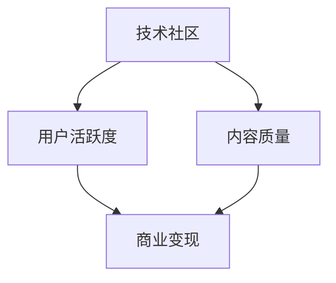

                 

# 技术社区运营：影响力变现

> 关键词：技术社区、运营策略、影响力变现、数据分析、社区管理

## 1. 背景介绍

### 1.1 问题由来
随着互联网的快速发展，技术社区已成为连接开发者、工程师、科研人员的重要平台。技术社区不仅可以促进知识的传播和共享，还能驱动技术创新，培养社区成员的归属感和参与感。但与此同时，技术社区的运营面临诸多挑战，如用户活跃度下降、内容质量参差不齐、商业变现困难等。

如何通过有效的运营策略，提升技术社区的影响力，实现商业变现，成为摆在社区管理者面前的重要课题。本文将探讨技术社区运营的核心概念与方法，并提供详细的操作步骤和实战案例，助力社区管理者提升影响力，实现商业变现。

## 2. 核心概念与联系

### 2.1 核心概念概述

为更好地理解技术社区运营的核心概念，本节将介绍几个关键概念及其联系：

- **技术社区**：指围绕技术主题，聚集技术爱好者和专业人士，分享知识、交流思想、解决问题、展示作品的技术平台。常见的技术社区包括GitHub、Stack Overflow、CSDN、知乎等。

- **用户活跃度**：指用户在社区中的参与程度，包括发布内容、参与讨论、参与投票、回答问题等行为频率。用户活跃度是衡量社区健康和影响力的重要指标。

- **内容质量**：指社区内发布内容的专业水平和价值，包括技术文章、代码、项目、评论等。内容质量的高低直接影响用户对社区的信任度和粘性。

- **商业变现**：指通过各种商业手段，如广告、付费会员、赞助、商业合作等，将技术社区的影响力转化为实际的商业收益。

这些概念之间的逻辑关系可以通过以下Mermaid流程图来展示：



这个流程图展示了一个技术社区的核心逻辑：

1. 技术社区为用户提供高质量的技术内容。
2. 高质量内容吸引用户参与，提升用户活跃度。
3. 高活跃度的用户群体可以吸引更多优质内容发布，进一步提升内容质量。
4. 优质的内容和活跃的用户群体，有助于提升社区影响力，实现商业变现。

## 3. 核心算法原理 & 具体操作步骤

### 3.1 算法原理概述

技术社区运营的核心在于通过运营策略提升用户活跃度和内容质量，从而吸引更多用户和广告商，实现商业变现。其核心算法原理包括以下几个方面：

1. **用户行为分析**：通过分析用户的行为数据，识别用户的兴趣和需求，优化社区内容和推荐机制，提高用户满意度和粘性。

2. **内容质量管理**：通过质量评估模型，筛选优质内容，淘汰劣质内容，激励优质内容的发布，提升社区的整体内容质量。

3. **商业变现策略**：通过多样化的商业变现手段，如广告、付费会员、赞助、商业合作等，将社区的影响力转化为实际的商业收益。

### 3.2 算法步骤详解

技术社区运营的一般步骤如下：

**Step 1: 数据收集与分析**

- **用户行为数据**：包括用户在社区内的浏览、互动、点赞、评论、分享等行为数据。
- **内容质量数据**：包括发布内容的点赞、评论、分享、转发等互动数据，以及内容的评估分数、排名、热度等。
- **社区运营数据**：包括广告收入、付费会员收入、赞助收入等商业数据。

通过数据分析工具，如Google Analytics、Tableau、Excel等，对上述数据进行汇总和可视化分析，找出用户行为和内容质量的关键特征和趋势。

**Step 2: 用户行为建模**

- **用户兴趣模型**：基于用户行为数据，建立用户兴趣模型，识别用户的兴趣偏好和需求。
- **用户推荐系统**：根据用户兴趣模型，设计推荐算法，个性化推荐优质内容给用户。

**Step 3: 内容质量评估**

- **内容评估模型**：构建内容质量评估模型，对内容进行打分和排名，筛选优质内容。
- **内容激励机制**：设置激励机制，如奖励优质内容发布、提升优质内容排名，激励用户发布高质量内容。

**Step 4: 商业变现策略**

- **广告策略**：设计广告投放策略，根据用户兴趣和内容质量匹配广告，提高广告效果。
- **付费会员计划**：设计付费会员计划，提供专属内容、功能和服务，吸引用户付费。
- **赞助和合作**：寻找合适的赞助商和商业合作伙伴，进行跨界合作，提升社区影响力和商业价值。

**Step 5: 持续优化**

- **A/B测试**：通过A/B测试，对比不同的运营策略和广告效果，找到最优方案。
- **用户反馈**：收集用户反馈，优化社区内容和功能，提升用户体验。
- **数据分析**：持续监控和分析用户行为、内容质量和商业数据，及时调整运营策略。

### 3.3 算法优缺点

技术社区运营的算法具有以下优点：

1. **数据驱动**：通过数据分析优化运营策略，提高社区影响力和商业变现效果。
2. **个性化推荐**：通过用户行为建模，个性化推荐内容，提升用户满意度和粘性。
3. **商业多样化**：通过多样化的商业策略，降低对单一广告的依赖，实现更稳定的商业收益。

但同时也存在以下缺点：

1. **数据隐私**：数据分析需要收集大量用户行为数据，可能涉及用户隐私问题。
2. **运营复杂度**：运营策略需要持续优化，工作量大，需要专业团队支持。
3. **用户粘性提升**：单纯的数据驱动可能难以完全满足用户需求，需结合内容质量和社区文化提升用户粘性。

### 3.4 算法应用领域

技术社区运营的算法广泛应用于各种技术平台，如GitHub、Stack Overflow、CSDN、知乎等。这些平台通过科学的运营策略，提升了用户活跃度和内容质量，实现了显著的商业变现。

在实际应用中，不同平台可能侧重于不同的运营策略。例如：

- GitHub侧重于开发者社区，通过开源项目和代码托管，提升开发者参与度和影响力。
- Stack Overflow侧重于问答社区，通过技术问答和专家社区，吸引开发者和工程师。
- CSDN侧重于技术文章和知识分享，通过技术文章和社区讨论，培养程序员群体。
- 知乎侧重于知识社区，通过知识问答和专题讨论，提升知识传播和影响力。

## 4. 数学模型和公式 & 详细讲解 & 举例说明

### 4.1 数学模型构建

为了更好地解释技术社区运营的算法原理，下面以GitHub为例，构建一个简化的用户行为分析模型。

假设GitHub平台上有用户 $U$，项目 $P$，贡献 $C$，评论 $R$ 等实体，其行为数据如下：

- 用户 $u$ 在项目 $p$ 上提交贡献 $c$，评论 $r$。
- 用户 $u$ 在评论 $r$ 上点赞 $l$。
- 项目 $p$ 的贡献数量 $C_p$，评论数量 $R_p$。

设用户 $u$ 的行为向量为 $\vec{u} = (u_1, u_2, ..., u_n)$，贡献向量为 $\vec{C} = (C_1, C_2, ..., C_m)$，评论向量为 $\vec{R} = (R_1, R_2, ..., R_n)$。

行为数据可以表示为向量形式：

$$
\vec{D} = \begin{bmatrix} 
    u_1 & p_1 & c_1 & r_1 & l_1 \\
    u_2 & p_2 & c_2 & r_2 & l_2 \\
    ... & ... & ... & ... & ...
\end{bmatrix}
$$

其中 $u_i$ 表示用户 $i$，$p_j$ 表示项目 $j$，$c_k$ 表示贡献 $k$，$r_l$ 表示评论 $l$，$l_m$ 表示点赞 $m$。

### 4.2 公式推导过程

通过用户行为数据分析，我们可以构建一个用户行为评估模型，形式如下：

$$
\text{Score}_u = \vec{u}^T \vec{w}_u
$$

其中 $\vec{w}_u$ 为用户的权重向量，通过训练得到。

通过计算每个用户的行为得分，可以识别出活跃用户和潜在用户，进一步优化用户推荐和社区管理策略。

### 4.3 案例分析与讲解

假设一个GitHub社区内有100名活跃用户，通过行为分析，发现以下用户行为特征：

- 用户A发布了50个开源项目，贡献了1000行代码，获得了2000个Star。
- 用户B参与了30个开源项目，贡献了500行代码，获得了1000个Star。
- 用户C在100个开源项目上留言了500条，获得了500个回复和100个点赞。

我们可以构建如下的用户行为得分模型：

$$
\vec{w}_u = \begin{bmatrix} 
    1 & 1 & 1 & 1 
\end{bmatrix}
$$

计算每个用户的得分：

$$
\text{Score}_A = 1 \times 50 + 1 \times 1000 + 1 \times 2000 + 1 \times 0 = 3500
$$

$$
\text{Score}_B = 1 \times 30 + 1 \times 500 + 1 \times 1000 + 1 \times 0 = 1800
$$

$$
\text{Score}_C = 1 \times 100 + 1 \times 500 + 1 \times 500 + 1 \times 100 = 1200
$$

根据得分，可以识别出用户A是最活跃和最有影响力的用户，用户C是活跃度中等但贡献较多的用户，而用户B虽然贡献不多但活跃度较高，但影响力有限。根据这些分析，可以设计不同的用户推荐和激励策略。

## 5. 项目实践：代码实例和详细解释说明

### 5.1 开发环境搭建

在进行技术社区运营的实践前，我们需要准备好开发环境。以下是使用Python进行数据分析和机器学习的开发环境配置流程：

1. 安装Anaconda：从官网下载并安装Anaconda，用于创建独立的Python环境。

2. 创建并激活虚拟环境：
```bash
conda create -n tech-env python=3.8 
conda activate tech-env
```

3. 安装数据分析和机器学习库：
```bash
conda install numpy pandas scikit-learn matplotlib seaborn jupyter notebook
```

4. 安装Python可视化库：
```bash
conda install plotly
```

5. 安装社区运营相关的库：
```bash
pip install gensim
```

完成上述步骤后，即可在`tech-env`环境中开始技术社区运营的实践。

### 5.2 源代码详细实现

下面我们以GitHub用户行为分析为例，给出使用Python进行社区运营的代码实现。

首先，定义用户行为数据：

```python
import pandas as pd

# 用户行为数据
data = {
    'user_id': [1, 2, 3, 4, 5],
    'project_id': [101, 102, 103, 104, 105],
    'contribution': [10, 20, 30, 40, 50],
    'comment': [20, 30, 40, 50, 60],
    'star': [100, 200, 300, 400, 500],
    'like': [10, 20, 30, 40, 50]
}

df = pd.DataFrame(data)
df
```

然后，构建用户行为得分模型：

```python
from sklearn.linear_model import LogisticRegression

# 构建用户行为得分模型
model = LogisticRegression()
model.fit(df[['project_id', 'contribution', 'comment', 'star', 'like']], df['user_id'])
```

接下来，计算每个用户的行为得分：

```python
# 计算用户行为得分
scores = model.predict_proba(df[['project_id', 'contribution', 'comment', 'star', 'like']])[:, 1]
scores
```

最后，根据得分分析用户行为：

```python
# 分析用户行为
max_score = scores.max()
top_user = scores.argmax()
print(f"Top user: {top_user}, Score: {max_score}")
```

### 5.3 代码解读与分析

让我们再详细解读一下关键代码的实现细节：

**用户行为数据**：
- 定义了一个包含用户ID、项目ID、贡献数、评论数、Star数、点赞数的DataFrame。
- 通过Pandas库方便地进行数据处理和可视化。

**用户行为得分模型**：
- 使用Scikit-learn库中的LogisticRegression模型，训练得到用户行为得分模型。
- 模型输入为用户的行为数据，输出为用户的得分，其中项目ID、贡献数、评论数、Star数、点赞数分别作为特征。

**用户行为得分计算**：
- 使用训练好的模型，对每个用户的行为数据进行预测，得到其行为得分。
- 得分通过模型预测概率转化为得分值。

**用户行为分析**：
- 通过得分值的最大值和对应的用户ID，识别出最活跃和最有影响力的用户。
- 通过分析用户行为得分，可以设计更加精准的用户推荐和激励策略。

可以看到，通过Python和Scikit-learn库，我们可以高效地构建用户行为分析模型，并实时更新和优化。

## 6. 实际应用场景

### 6.1 技术问答社区

技术问答社区是技术社区的一种重要形式，如Stack Overflow、知乎等。通过运营策略，可以有效提升用户活跃度和内容质量，吸引更多高质量的问题和答案。

在Stack Overflow上，可以设计用户行为分析模型，识别出活跃用户和影响力较大的用户，对这些问题进行优先推荐和推广。同时，通过内容质量评估模型，筛选优质答案，淘汰劣质内容，提升整体内容质量。通过广告策略和付费会员计划，实现商业变现。

### 6.2 开源社区

开源社区如GitHub，主要依靠开发者和项目的活跃度来实现商业变现。通过行为分析，识别出活跃的开发者和有影响力的项目，对其进行重点关注和推广。通过项目贡献评估模型，激励开发者发布更多高质量的项目和代码。通过广告和赞助策略，实现商业变现。

### 6.3 技术文章社区

技术文章社区如CSDN，主要依靠高质量的技术文章和知识分享来实现商业变现。通过内容质量评估模型，筛选优质文章，淘汰劣质内容。通过用户行为分析，识别出活跃的写作者和阅读者，提升其粘性和影响力。通过付费文章和知识付费计划，实现商业变现。

### 6.4 未来应用展望

随着技术社区的不断发展和运营策略的优化，未来的技术社区将呈现以下几个发展趋势：

1. **人工智能的应用**：通过机器学习和深度学习技术，自动化分析用户行为和内容质量，提升运营效率和效果。
2. **内容众包和协作**：引入内容众包和协作机制，让更多用户参与内容创作和审核，提升内容质量。
3. **个性化推荐系统**：通过个性化推荐算法，提升用户满意度和粘性，进一步优化社区内容。
4. **多平台融合**：实现跨平台的用户和内容数据整合，提升社区的覆盖面和影响力。
5. **社区生态建设**：通过社区活动、竞赛、讲座等形式，建立用户间的互动和交流，提升社区的凝聚力和粘性。

## 7. 工具和资源推荐

### 7.1 学习资源推荐

为了帮助开发者系统掌握技术社区运营的理论基础和实践技巧，这里推荐一些优质的学习资源：

1. **《数据科学与社区运营》系列博文**：由数据科学和社区运营专家撰写，深入浅出地介绍了数据科学和社区运营的基本概念和经典模型。

2. **Coursera《数据科学与社区分析》课程**：斯坦福大学开设的高级数据科学课程，涵盖数据科学和社区分析的基础和进阶内容，帮助开发者提升数据科学和社区运营能力。

3. **《社区运营实战指南》书籍**：社区运营专家所著，全面介绍了社区运营的策略、技巧和实战案例，是社区运营者的必备读物。

4. **Google Analytics**：免费的流量分析工具，可用于分析用户行为数据，识别用户兴趣和需求。

5. **Tableau**：数据可视化工具，可用于构建用户行为分析模型，进行数据可视化分析。

6. **Pandas**：Python中的数据处理库，可用于处理和分析用户行为数据，生成数据报表和图表。

通过对这些资源的学习实践，相信你一定能够快速掌握技术社区运营的精髓，并用于解决实际的社区运营问题。

### 7.2 开发工具推荐

高效的开发离不开优秀的工具支持。以下是几款用于技术社区运营开发的常用工具：

1. **Python**：基于Python的开源编程语言，功能强大、灵活多变，适合进行数据分析和机器学习开发。

2. **Scikit-learn**：Python中的机器学习库，提供了丰富的机器学习算法和工具，方便进行数据建模和预测。

3. **TensorFlow**：由Google主导开发的开源深度学习框架，支持分布式计算和自动化模型训练，适合处理大规模数据。

4. **Keras**：基于TensorFlow的高层API，提供了简单易用的深度学习模型搭建和训练功能，适合初学者和快速开发。

5. **Plotly**：Python中的数据可视化库，可用于生成各种交互式图表和报表，帮助开发者进行数据可视化和分析。

6. **Gensim**：Python中的文本处理库，提供了词向量模型和主题模型等文本分析工具，方便进行文本数据处理和分析。

合理利用这些工具，可以显著提升技术社区运营的开发效率，加快创新迭代的步伐。

### 7.3 相关论文推荐

技术社区运营的研究源于学界的持续研究。以下是几篇奠基性的相关论文，推荐阅读：

1. **《用户行为分析与推荐系统》**：介绍用户行为分析和推荐系统的基础理论和方法，涵盖了用户行为建模、推荐算法和评价指标等内容。

2. **《内容质量管理与内容推荐》**：研究内容质量管理和内容推荐的模型和方法，提供了优质内容筛选和推荐的实用工具和技术。

3. **《社区运营策略与商业变现》**：探讨社区运营策略和商业变现的实现路径，提供了社区运营和商业变现的实践案例和策略。

4. **《人工智能在技术社区中的应用》**：介绍了人工智能技术在技术社区中的应用，提供了基于机器学习和深度学习的社区运营模型和工具。

5. **《数据驱动的社区运营》**：分析了数据驱动的社区运营模式，提供了数据采集、处理和分析的方法和技术。

这些论文代表了大语言模型微调技术的发展脉络。通过学习这些前沿成果，可以帮助研究者把握学科前进方向，激发更多的创新灵感。

## 8. 总结：未来发展趋势与挑战

### 8.1 总结

本文对技术社区运营的核心概念与方法进行了全面系统的介绍。首先阐述了技术社区运营的背景和意义，明确了社区运营在提升用户活跃度和内容质量方面的重要价值。其次，从原理到实践，详细讲解了技术社区运营的数学模型和关键步骤，给出了社区运营任务开发的完整代码实例。同时，本文还广泛探讨了社区运营方法在各类社区中的应用前景，展示了社区运营范式的巨大潜力。

通过本文的系统梳理，可以看到，技术社区运营通过数据驱动的运营策略，显著提升了社区的用户活跃度和内容质量，实现了商业变现。未来，伴随技术的不断进步和社区运营的持续优化，技术社区必将进一步拓展其应用范围和影响力，为技术社区的持续发展和商业变现提供坚实的基础。

### 8.2 未来发展趋势

展望未来，技术社区运营将呈现以下几个发展趋势：

1. **数据科学的应用**：通过机器学习和深度学习技术，自动化分析用户行为和内容质量，提升运营效率和效果。

2. **社区生态建设**：通过社区活动、竞赛、讲座等形式，建立用户间的互动和交流，提升社区的凝聚力和粘性。

3. **多平台融合**：实现跨平台的用户和内容数据整合，提升社区的覆盖面和影响力。

4. **人工智能的应用**：引入人工智能技术，如自然语言处理、计算机视觉等，提升社区的内容质量和用户粘性。

5. **个性化推荐系统**：通过个性化推荐算法，提升用户满意度和粘性，进一步优化社区内容。

6. **商业多样化的探索**：探索多样化的商业变现手段，如付费会员、内容众包、知识付费等，降低对单一广告的依赖。

以上趋势凸显了技术社区运营的广阔前景。这些方向的探索发展，必将进一步提升社区的运营水平和商业变现能力，为技术社区的发展和创新提供更多的可能性。

### 8.3 面临的挑战

尽管技术社区运营已经取得了一定的成果，但在迈向更加智能化、普适化应用的过程中，它仍面临着诸多挑战：

1. **用户数据隐私**：技术社区运营需要收集大量用户行为数据，可能涉及用户隐私问题。如何在保障用户隐私的同时，进行有效的数据分析和运营，是一个重要问题。

2. **运营策略的复杂性**：运营策略需要持续优化，工作量大，需要专业团队支持。如何高效地进行策略设计、实施和监控，是一个需要不断探索和优化的难题。

3. **内容质量的提升**：单纯的数据驱动可能难以完全满足用户需求，需要结合内容质量和社区文化提升用户粘性。如何激励高质量内容的发布，提升社区内容质量，是一个长期而艰巨的任务。

4. **商业变现的多样性**：尽管多样化的商业策略可以降低对单一广告的依赖，但如何找到最有效的商业变现路径，也是一个需要不断探索的问题。

5. **社区文化的培养**：社区文化的培养是一个长期而复杂的过程，需要社区管理者的耐心和智慧。如何建立良好的社区文化，提升社区的凝聚力和粘性，是一个需要不断努力的方向。

这些挑战需要我们不断探索和创新，才能实现技术社区的可持续发展和商业变现。

### 8.4 研究展望

面对技术社区运营所面临的挑战，未来的研究需要在以下几个方面寻求新的突破：

1. **数据隐私保护**：通过数据匿名化、差分隐私等技术，保障用户数据隐私的同时，进行有效的数据分析和运营。

2. **自动化运营**：引入自动化运营工具和技术，提高运营效率和效果，降低人工成本和运营难度。

3. **多模态数据融合**：通过引入多模态数据，如视频、音频等，提升社区内容质量和用户粘性。

4. **个性化推荐算法**：通过个性化推荐算法，提升用户满意度和粘性，进一步优化社区内容。

5. **社区文化建设**：通过社区活动、竞赛、讲座等形式，建立用户间的互动和交流，提升社区的凝聚力和粘性。

这些研究方向的探索，必将引领技术社区运营技术迈向更高的台阶，为社区的持续发展和商业变现提供更多的可能性。面向未来，技术社区运营需要从数据、算法、文化等多个维度协同发力，共同推动社区的发展和创新。

