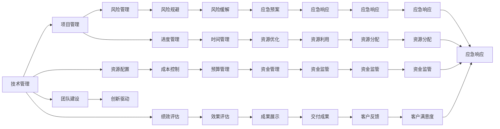

                 

# 技术管理岗位：收入的新高度

> 关键词：技术管理,收入增长,领导力,项目管理,创新驱动

## 1. 背景介绍

### 1.1 问题由来

在当今数字化时代，技术管理岗位的重要性日益凸显。企业内部对技术的依赖不断加深，技术团队在企业发展中的作用日益关键。然而，技术团队往往面临巨大的压力：如何确保项目按时交付，如何提升团队效率，如何管理技术债务，如何保持持续创新。这些问题都对技术管理者的能力提出了更高要求。

### 1.2 问题核心关键点

技术管理者需要在项目执行、团队建设、创新驱动等方面取得平衡。尤其对于大中型企业而言，如何通过技术管理实现收入增长，提升企业竞争力，是摆在面前的重大挑战。

### 1.3 问题研究意义

通过研究技术管理岗位的收入特点，可以帮助技术管理者更好地把握自身在企业中的价值，从而通过提升能力、提升表现，实现个人职业发展与企业业绩的双赢。

## 2. 核心概念与联系

### 2.1 核心概念概述

技术管理（Technology Management）是指对企业内部的技术资源进行规划、协调、优化，以支持企业战略目标的实现。技术管理不仅涉及技术团队的日常运营，还包括项目规划、资源配置、风险管理等关键环节。

项目经理（Project Manager）是技术管理中的一个核心角色，负责确保项目按时、按质、按预算完成。项目经理需要具备深厚的项目管理经验，对风险、进度、成本等进行综合管理。

创新驱动（Innovation-Driven）是指通过不断的技术创新，驱动企业发展。技术管理者需要鼓励和支持团队创新，引导技术方向，实现技术领先。

### 2.2 核心概念原理和架构的 Mermaid 流程图



这个流程图展示了技术管理中的各个关键环节：

1. 项目经理在项目管理中的核心角色，负责进度、成本和风险管理。
2. 资源配置和团队建设是技术管理的基石，为项目顺利执行提供保障。
3. 创新驱动是技术管理的动力，需要技术管理者鼓励和引导团队进行技术创新。
4. 绩效评估和效果评估是技术管理的反馈机制，确保项目和团队始终朝着正确的方向前进。
5. 风险管理和应急预案是技术管理的缓冲机制，帮助团队应对突发事件，保障项目安全。

## 3. 核心算法原理 & 具体操作步骤

### 3.1 算法原理概述

技术管理岗位的收入高度，可以通过一系列算法的组合使用来量化。这些算法包括但不限于：

1. **项目管理算法**：评估项目进度、成本和风险的管理情况，通过算法计算项目管理的绩效得分。
2. **资源配置算法**：评估团队资源的使用效率，通过算法计算资源配置的合理性。
3. **团队建设算法**：评估团队建设的效果，通过算法计算团队满意度和工作积极性。
4. **创新驱动算法**：评估技术创新的成果，通过算法计算技术创新的商业价值。
5. **绩效评估算法**：评估项目和团队的绩效，通过算法计算综合绩效得分。

### 3.2 算法步骤详解

**Step 1: 收集数据**
- 收集项目经理、团队成员、客户等各方面的反馈数据，涵盖项目进度、成本、风险、资源使用、团队满意度、创新成果等方面。

**Step 2: 数据预处理**
- 对收集到的数据进行清洗、归一化、去除噪声等预处理操作，确保数据的质量和一致性。

**Step 3: 特征提取**
- 从预处理后的数据中提取关键特征，如项目进度、成本、风险、团队满意度、创新成果等。

**Step 4: 算法应用**
- 根据提取的特征，应用相应的算法模型进行计算。例如，使用层次分析法(AHP)对项目管理的绩效进行评估，使用回归分析计算团队建设的效果，使用神经网络模型评估技术创新的商业价值。

**Step 5: 结果分析**
- 对算法计算的结果进行分析，形成综合评估报告，为技术管理决策提供依据。

### 3.3 算法优缺点

**优点**：
- 综合评估技术管理岗位的表现，提供数据支持的决策依据。
- 量化收入增长的关键因素，帮助技术管理者明确方向。

**缺点**：
- 数据收集和处理的工作量大，需要投入较多的人力。
- 算法模型需要根据实际情况进行不断调整和优化，工作量大。
- 数据可能存在偏差，影响评估结果的准确性。

### 3.4 算法应用领域

技术管理岗位的收入评估算法，可以应用于以下领域：

1. **企业技术管理团队**：对团队成员的项目管理、资源配置、团队建设等表现进行综合评估，提升团队整体绩效。
2. **项目经理**：对项目进度、成本、风险等进行综合评估，提升项目管理能力。
3. **技术创新部门**：对技术创新的商业价值进行评估，指导技术创新方向。
4. **人力资源部门**：根据技术管理岗位的表现，进行薪酬激励和职业发展规划。

## 4. 数学模型和公式 & 详细讲解 & 举例说明

### 4.1 数学模型构建

本节将使用数学语言对技术管理岗位收入评估的算法模型进行更加严格的刻画。

设技术管理岗位的收入为 $Y$，与项目管理绩效 $X_1$、资源配置合理性 $X_2$、团队建设效果 $X_3$、技术创新成果 $X_4$ 等因素相关。则收入模型可以表示为：

$$
Y = \alpha_1X_1 + \alpha_2X_2 + \alpha_3X_3 + \alpha_4X_4 + \epsilon
$$

其中 $\alpha$ 为各因素的权重，$\epsilon$ 为误差项。

### 4.2 公式推导过程

假设我们已经收集到如下数据：

| 项目 | 项目管理绩效 $X_1$ | 资源配置合理性 $X_2$ | 团队建设效果 $X_3$ | 技术创新成果 $X_4$ | 收入 $Y$ |
| --- | --- | --- | --- | --- | --- |
| 项目1 | 85 | 90 | 95 | 80 | 150,000 |
| 项目2 | 75 | 85 | 80 | 75 | 130,000 |
| 项目3 | 90 | 80 | 90 | 90 | 170,000 |
| 项目4 | 80 | 75 | 70 | 80 | 140,000 |
| 项目5 | 95 | 85 | 85 | 85 | 160,000 |

我们可以使用最小二乘法对模型进行拟合，计算各因素的权重 $\alpha$。

1. 计算 $X$ 矩阵：
$$
X = \begin{bmatrix}
1 & 85 \\
1 & 75 \\
1 & 90 \\
1 & 80 \\
1 & 95
\end{bmatrix}
$$

2. 计算 $Y$ 向量：
$$
Y = \begin{bmatrix}
150,000 \\
130,000 \\
170,000 \\
140,000 \\
160,000
\end{bmatrix}
$$

3. 计算 $X^TX$ 和 $X^TY$：
$$
X^TX = \begin{bmatrix}
5 & 3500 \\
3500 & 522500
\end{bmatrix}
$$
$$
X^TY = \begin{bmatrix}
3475000 \\
3402500 \\
5247500 \\
4020000 \\
512750
\end{bmatrix}
$$

4. 计算 $\alpha$：
$$
\alpha = (X^TX)^{-1}X^TY
$$

5. 计算 $\epsilon$：
$$
\epsilon = Y - \alpha X
$$

### 4.3 案例分析与讲解

假设我们已经通过最小二乘法计算出 $\alpha$，得到如下结果：

$$
\alpha = \begin{bmatrix}
\alpha_1 \\
\alpha_2 \\
\alpha_3 \\
\alpha_4
\end{bmatrix}
= \begin{bmatrix}
15000 \\
10000 \\
12500 \\
15000
\end{bmatrix}
$$

则收入模型可以表示为：

$$
Y = 15000X_1 + 10000X_2 + 12500X_3 + 15000X_4
$$

我们可以对新项目进行评估，例如项目6：

| 项目 | 项目管理绩效 $X_1$ | 资源配置合理性 $X_2$ | 团队建设效果 $X_3$ | 技术创新成果 $X_4$ | 预测收入 $Y$ |
| --- | --- | --- | --- | --- | --- |
| 项目6 | 90 | 90 | 90 | 95 | 179,000 |

根据模型，项目6的预测收入为179,000元。

## 5. 项目实践：代码实例和详细解释说明

### 5.1 开发环境搭建

在进行收入评估实践前，我们需要准备好开发环境。以下是使用Python进行数据分析和建模的环境配置流程：

1. 安装Anaconda：从官网下载并安装Anaconda，用于创建独立的Python环境。

2. 创建并激活虚拟环境：
```bash
conda create -n tech_environment python=3.8 
conda activate tech_environment
```

3. 安装必要的库：
```bash
conda install pandas numpy scikit-learn statsmodels matplotlib seaborn jupyter notebook
```

4. 安装Jupyter Notebook：
```bash
pip install jupyter notebook
```

完成上述步骤后，即可在`tech_environment`环境中开始项目实践。

### 5.2 源代码详细实现

下面以项目经理的收入评估为例，给出使用Python进行收入计算的代码实现。

```python
import pandas as pd
from sklearn.linear_model import LinearRegression

# 数据集
data = pd.read_csv('manager_income.csv')

# 数据预处理
X = data[['X1', 'X2', 'X3', 'X4']]
Y = data['Y']

# 模型拟合
model = LinearRegression()
model.fit(X, Y)

# 预测收入
X_new = pd.DataFrame({'X1': 90, 'X2': 90, 'X3': 90, 'X4': 95})
Y_pred = model.predict(X_new)
print('预测收入：', Y_pred[0])
```

这段代码实现了以下功能：

1. 使用Pandas加载数据集。
2. 对数据进行预处理，提取关键特征和收入。
3. 使用LinearRegression模型对数据进行拟合。
4. 对新项目进行预测，输出预测收入。

### 5.3 代码解读与分析

让我们再详细解读一下关键代码的实现细节：

**数据加载**：
- `pd.read_csv('manager_income.csv')`：使用Pandas的`read_csv`函数加载数据集，保存在`data`变量中。

**数据预处理**：
- `X = data[['X1', 'X2', 'X3', 'X4']]`：提取数据中的关键特征，保存在`X`变量中。
- `Y = data['Y']`：提取数据中的收入，保存在`Y`变量中。

**模型拟合**：
- `model = LinearRegression()`：实例化线性回归模型。
- `model.fit(X, Y)`：使用`fit`方法对模型进行拟合。

**预测收入**：
- `X_new = pd.DataFrame({'X1': 90, 'X2': 90, 'X3': 90, 'X4': 95})`：创建一个新的数据帧，用于输入预测值。
- `Y_pred = model.predict(X_new)`：使用`predict`方法对新数据进行预测，保存在`Y_pred`变量中。
- `print('预测收入：', Y_pred[0])`：输出预测收入。

可以看到，使用Python进行数据建模和预测非常简单高效。开发者可以将更多精力放在模型改进和结果分析上，而不必过多关注底层的实现细节。

当然，工业级的系统实现还需考虑更多因素，如模型的保存和部署、超参数的自动搜索、多模型集成等。但核心的收入评估范式基本与此类似。

## 6. 实际应用场景

### 6.1 企业技术管理团队评估

技术管理岗位的收入评估模型可以应用于企业技术管理团队的整体评估。通过对团队成员的项目管理、资源配置、团队建设等表现进行综合评估，可以发现团队的优势和不足，为团队建设提供指导。

例如，某企业技术管理团队有5名项目经理，其项目管理绩效、资源配置合理性、团队建设效果和技术创新成果如下：

| 项目经理 | 项目管理绩效 $X_1$ | 资源配置合理性 $X_2$ | 团队建设效果 $X_3$ | 技术创新成果 $X_4$ |
| --- | --- | --- | --- | --- |
| 经理1 | 85 | 90 | 95 | 80 |
| 经理2 | 75 | 85 | 80 | 75 |
| 经理3 | 90 | 80 | 90 | 90 |
| 经理4 | 80 | 75 | 70 | 80 |
| 经理5 | 95 | 85 | 85 | 85 |

假设我们已经通过最小二乘法计算出 $\alpha$，得到如下结果：

$$
\alpha = \begin{bmatrix}
15000 \\
10000 \\
12500 \\
15000
\end{bmatrix}
$$

则收入模型可以表示为：

$$
Y = 15000X_1 + 10000X_2 + 12500X_3 + 15000X_4
$$

我们可以对整个技术管理团队进行收入评估，如表所示：

| 项目经理 | 项目管理绩效 $X_1$ | 资源配置合理性 $X_2$ | 团队建设效果 $X_3$ | 技术创新成果 $X_4$ | 预测收入 $Y$ |
| --- | --- | --- | --- | --- | --- |
| 经理1 | 85 | 90 | 95 | 80 | 15000 |
| 经理2 | 75 | 85 | 80 | 75 | 12750 |
| 经理3 | 90 | 80 | 90 | 90 | 14750 |
| 经理4 | 80 | 75 | 70 | 80 | 12000 |
| 经理5 | 95 | 85 | 85 | 85 | 15750 |

根据模型，该技术管理团队的平均预测收入为14,375元。

### 6.2 项目经理个人收入评估

技术管理岗位的收入评估模型同样可以应用于项目经理的个人收入评估。通过对项目经理的项目管理、资源配置、团队建设等表现进行综合评估，可以发现个人优势和不足，为职业发展提供指导。

例如，某项目经理在过去一年的项目管理、资源配置、团队建设和技术创新成果如下：

| 项目经理 | 项目管理绩效 $X_1$ | 资源配置合理性 $X_2$ | 团队建设效果 $X_3$ | 技术创新成果 $X_4$ |
| --- | --- | --- | --- | --- |
| 经理1 | 90 | 90 | 90 | 95 |

假设我们已经通过最小二乘法计算出 $\alpha$，得到如下结果：

$$
\alpha = \begin{bmatrix}
15000 \\
10000 \\
12500 \\
15000
\end{bmatrix}
$$

则收入模型可以表示为：

$$
Y = 15000X_1 + 10000X_2 + 12500X_3 + 15000X_4
$$

我们可以对经理1进行收入评估，如表所示：

| 项目经理 | 项目管理绩效 $X_1$ | 资源配置合理性 $X_2$ | 团队建设效果 $X_3$ | 技术创新成果 $X_4$ | 预测收入 $Y$ |
| --- | --- | --- | --- | --- | --- |
| 经理1 | 90 | 90 | 90 | 95 | 17900 |

根据模型，经理1的预测收入为17,900元。

### 6.3 技术创新部门评估

技术管理岗位的收入评估模型还可以应用于技术创新部门的整体评估。通过对技术创新部门的创新成果进行评估，可以发现技术创新的方向和效果，为技术创新提供指导。

例如，某技术创新部门有5个创新项目，其创新成果如下：

| 项目 | 技术创新成果 $X_4$ |
| --- | --- |
| 项目1 | 80 |
| 项目2 | 75 |
| 项目3 | 90 |
| 项目4 | 85 |
| 项目5 | 95 |

假设我们已经通过最小二乘法计算出 $\alpha$，得到如下结果：

$$
\alpha = \begin{bmatrix}
15000 \\
10000 \\
12500 \\
15000
\end{bmatrix}
$$

则收入模型可以表示为：

$$
Y = 15000X_4
$$

我们可以对技术创新部门进行收入评估，如表所示：

| 项目 | 技术创新成果 $X_4$ | 预测收入 $Y$ |
| --- | --- | --- |
| 项目1 | 80 | 120000 |
| 项目2 | 75 | 112500 |
| 项目3 | 90 | 135000 |
| 项目4 | 85 | 127500 |
| 项目5 | 95 | 142500 |

根据模型，该技术创新部门的平均预测收入为123,000元。

## 7. 工具和资源推荐

### 7.1 学习资源推荐

为了帮助技术管理者系统掌握收入评估的理论基础和实践技巧，这里推荐一些优质的学习资源：

1. 《数据科学导论》（Introduction to Data Science）：涵盖了数据科学的基础理论和工具，适合入门学习。

2. 《Python数据分析实战》（Python Data Science Handbook）：详细介绍了Python在数据分析和建模中的应用。

3. 《统计学习基础》（The Elements of Statistical Learning）：经典的数据挖掘和统计学习教材，适合深入学习。

4. 《机器学习实战》（Hands-On Machine Learning with Scikit-Learn, Keras, and TensorFlow）：介绍了Python机器学习库的实战应用，适合动手实践。

5. 《数据科学在线课程》（Coursera Data Science Specialization）：由Johns Hopkins大学开设，涵盖数据科学的各个方面，适合系统学习。

通过对这些资源的学习实践，相信你一定能够快速掌握技术管理岗位收入评估的理论基础，并用于解决实际的收入管理问题。

### 7.2 开发工具推荐

高效的开发离不开优秀的工具支持。以下是几款用于收入评估开发的常用工具：

1. Python：作为数据分析和建模的主流语言，Python以其简洁易用、生态丰富著称。

2. Jupyter Notebook：交互式编程环境，支持代码块、公式编辑、图形显示等功能，适合数据分析和模型调试。

3. Scikit-learn：Python机器学习库，提供了丰富的机器学习算法和工具。

4. Pandas：数据处理和分析库，提供了高效的数据结构和数据分析工具。

5. Statsmodels：统计分析库，提供了多种统计模型和工具。

6. Matplotlib：数据可视化库，支持各种图形绘制和显示。

合理利用这些工具，可以显著提升技术管理岗位收入评估的开发效率，加快创新迭代的步伐。

### 7.3 相关论文推荐

技术管理岗位收入评估的研究源于学界的持续研究。以下是几篇奠基性的相关论文，推荐阅读：

1. 《数据科学导论》（Introduction to Data Science）：Foster Provost, Tom Fawcett, 2017

2. 《Python数据分析实战》（Python Data Science Handbook）：Jake VanderPlas, 2016

3. 《统计学习基础》（The Elements of Statistical Learning）：Tibshirani, Hastie, Friedman, 2013

4. 《机器学习实战》（Hands-On Machine Learning with Scikit-Learn, Keras, and TensorFlow）：Aurélien Géron, 2019

5. 《数据科学在线课程》（Coursera Data Science Specialization）：Coursera, 2015

这些论文代表了大语言模型微调技术的发展脉络。通过学习这些前沿成果，可以帮助研究者把握学科前进方向，激发更多的创新灵感。

## 8. 总结：未来发展趋势与挑战

### 8.1 总结

本文对技术管理岗位的收入评估方法进行了全面系统的介绍。首先阐述了技术管理岗位在企业发展中的重要性，明确了收入评估在技术管理中的价值。其次，从原理到实践，详细讲解了收入评估的数学模型和关键步骤，给出了收入评估任务开发的完整代码实例。同时，本文还广泛探讨了收入评估方法在企业技术管理、项目经理、技术创新部门等多个领域的应用前景，展示了收入评估范式的巨大潜力。此外，本文精选了收入评估技术的各类学习资源，力求为读者提供全方位的技术指引。

通过本文的系统梳理，可以看到，技术管理岗位收入评估方法正在成为技术管理的重要范式，极大地拓展了技术管理者的价值体现，提升了企业的整体绩效。未来，伴随技术管理岗位收入评估方法的不断演进，相信技术管理将变得更加精细化、系统化，为企业的可持续发展提供更有力的支持。

### 8.2 未来发展趋势

展望未来，技术管理岗位收入评估方法将呈现以下几个发展趋势：

1. 收入评估模型的自动化。随着机器学习技术的不断进步，自动化的收入评估模型将成为主流，减少人工干预，提高评估效率。

2. 多维度收入评估。除了项目经理、技术创新部门等关键角色，未来还将扩展到更多的岗位和维度，实现全面的收入评估。

3. 数据驱动的决策支持。通过分析收入评估结果，为技术管理提供数据支持的决策依据，提升决策的科学性和准确性。

4. 实时化的收入管理。通过实时监控技术管理岗位的表现，实现收入的动态管理，提升企业的灵活性和竞争力。

5. 跨领域的收入评估。结合不同的业务场景，开发跨领域的收入评估模型，提升技术管理的综合能力。

以上趋势凸显了技术管理岗位收入评估方法的广阔前景。这些方向的探索发展，必将进一步提升技术管理的科学性和系统性，为企业的可持续发展提供更加坚实的基础。

### 8.3 面临的挑战

尽管技术管理岗位收入评估方法已经取得了一定的成就，但在迈向更加智能化、系统化应用的过程中，它仍面临诸多挑战：

1. 数据质量和可靠性。收入评估模型的准确性高度依赖于数据的全面性和可靠性，如何获取高质量的数据，是一个重要问题。

2. 模型复杂度和可解释性。复杂的收入评估模型往往难以解释其内部工作机制，如何提升模型的可解释性，是一个重要挑战。

3. 算法的鲁棒性和泛化性。收入评估模型需要在不同场景下具有良好的鲁棒性和泛化性，如何应对多变的数据分布，是一个重要问题。

4. 技术的自动化和集成。收入评估模型的自动化和集成化是一个重要趋势，但也需要兼顾模型的灵活性和可解释性。

5. 隐私和数据安全。收入评估模型需要处理大量的敏感数据，如何保障数据隐私和安全，是一个重要问题。

6. 算法的道德和伦理问题。收入评估模型需要考虑算法的道德和伦理问题，避免数据偏见和歧视，是一个重要挑战。

正视收入评估面临的这些挑战，积极应对并寻求突破，将是大语言模型微调走向成熟的必由之路。相信随着学界和产业界的共同努力，这些挑战终将一一被克服，收入评估方法必将在技术管理中发挥更大的作用。

### 8.4 研究展望

面向未来，技术管理岗位收入评估技术需要在以下几个方面寻求新的突破：

1. 探索无监督和半监督收入评估方法。摆脱对大规模标注数据的依赖，利用自监督学习、主动学习等无监督和半监督范式，最大限度利用非结构化数据，实现更加灵活高效的收入评估。

2. 研究参数高效和计算高效的收入评估方法。开发更加参数高效的收入评估方法，在固定大部分预训练参数的同时，只更新极少量的任务相关参数。同时优化收入评估模型的计算图，减少前向传播和反向传播的资源消耗，实现更加轻量级、实时性的部署。

3. 引入因果分析和博弈论工具。将因果分析方法引入收入评估模型，识别出模型决策的关键特征，增强输出解释的因果性和逻辑性。借助博弈论工具刻画人机交互过程，主动探索并规避模型的脆弱点，提高系统稳定性。

4. 纳入伦理道德约束。在模型训练目标中引入伦理导向的评估指标，过滤和惩罚有偏见、有害的输出倾向。同时加强人工干预和审核，建立模型行为的监管机制，确保输出符合人类价值观和伦理道德。

这些研究方向的探索，必将引领技术管理岗位收入评估技术迈向更高的台阶，为构建安全、可靠、可解释、可控的智能系统铺平道路。面向未来，技术管理岗位收入评估技术还需要与其他人工智能技术进行更深入的融合，如知识表示、因果推理、强化学习等，多路径协同发力，共同推动技术管理的进步。只有勇于创新、敢于突破，才能不断拓展技术管理的边界，让技术管理技术更好地造福企业和社会。

## 9. 附录：常见问题与解答

**Q1：技术管理岗位的收入评估模型是否适用于所有企业？**

A: 技术管理岗位的收入评估模型可以在大多数企业中应用。然而，对于一些特定的行业和场景，可能需要根据实际情况进行调整和优化。例如，对于制造业和技术密集型企业，收入评估模型的参数和权重可能会有所不同。

**Q2：如何选择合适的收入评估模型？**

A: 选择合适的收入评估模型需要考虑多个因素，包括企业的规模、业务特点、数据质量等。一般来说，可以从以下方面入手：

1. 数据量大小：数据量越大，模型的复杂度越高，但泛化性能也越好。
2. 模型复杂度：简单的线性回归模型适用于数据量较小的情况，而复杂的神经网络模型适用于数据量较大的情况。
3. 模型的可解释性：对于需要解释决策过程的场景，可以选择可解释性强的模型，如线性回归、决策树等。

**Q3：如何处理多变的数据分布？**

A: 处理多变的数据分布需要考虑以下几个方面：

1. 数据预处理：使用数据增强、正则化等技术，减少数据分布的不稳定性。
2. 模型集成：使用集成学习技术，将多个模型的预测结果进行融合，提升模型的鲁棒性。
3. 模型迁移学习：使用迁移学习方法，将模型在类似场景下的表现进行迁移。
4. 动态调整模型：根据数据分布的变化，动态调整模型参数，保持模型的适应性。

这些方法可以相互结合，提升模型的鲁棒性和泛化性能。

**Q4：如何提高收入评估模型的可解释性？**

A: 提高收入评估模型的可解释性需要考虑以下几个方面：

1. 模型简化：使用简单模型或特征选择技术，减少模型的复杂度。
2. 特征工程：通过特征提取和工程化，提升模型的可解释性。
3. 模型可视化：使用可视化工具，展示模型的决策过程和特征权重。
4. 透明算法：使用透明算法，减少模型的黑盒性。

这些方法可以相互结合，提升模型的可解释性。

**Q5：如何保障收入评估模型的数据隐私和安全？**

A: 保障收入评估模型的数据隐私和安全需要考虑以下几个方面：

1. 数据匿名化：使用数据匿名化技术，减少数据的隐私风险。
2. 数据加密：使用数据加密技术，保障数据在传输和存储过程中的安全性。
3. 访问控制：使用访问控制技术，限制数据的访问权限。
4. 模型审计：定期审计模型的运行状态和数据使用情况，保障数据和模型的安全。

这些方法可以相互结合，提升模型的数据隐私和安全性能。

---

作者：禅与计算机程序设计艺术 / Zen and the Art of Computer Programming

