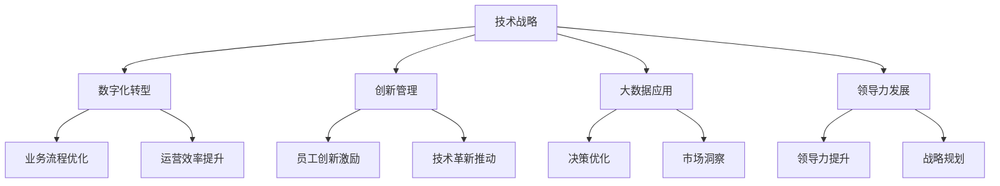

                 

# 技术管理：利用新技术提高竞争力

> 关键词：技术管理,竞争力提升,技术战略,企业转型,数字化转型,创新管理,数字化工具,领导力发展,员工培训,市场分析,大数据应用

## 1. 背景介绍

### 1.1 问题由来
在快速变化的市场环境中，企业之间的竞争愈发激烈，技术管理已成为企业战略规划和运营管理的核心。技术管理不仅关乎企业的长期发展，更是提升企业竞争力的关键因素。

随着人工智能、大数据、云计算等新兴技术的迅猛发展，企业面临着前所未有的机遇与挑战。如何有效利用这些新技术，提升企业的运营效率、创新能力以及市场竞争力，成为了企业技术管理的重要课题。

### 1.2 问题核心关键点
技术管理的核心在于如何通过合理规划和应用新技术，实现企业的持续增长和转型升级。其主要包括以下几个关键点：

- **技术战略制定**：制定科学合理的技术战略，明确企业技术发展的方向和目标。
- **数字化转型**：通过数字化工具和平台，提升企业运营效率，优化业务流程。
- **创新管理**：建立健全的创新管理体系，激励员工创新，推动技术革新。
- **大数据应用**：利用大数据分析技术，洞察市场趋势，优化决策。
- **领导力发展**：培养具有技术视角的领导团队，引领技术驱动的创新和变革。

### 1.3 问题研究意义
研究技术管理对于提升企业竞争力具有重要意义：

1. **优化业务流程**：通过技术手段，提高企业运营效率，降低成本，提升竞争力。
2. **推动创新**：利用新技术，激发员工创新潜力，持续推出新产品和服务。
3. **增强市场响应速度**：快速响应市场变化，捕捉商业机会，增强市场竞争力。
4. **提升客户体验**：利用技术手段，改善客户体验，增强客户忠诚度。
5. **优化资源配置**：通过数据分析，优化资源配置，提高资源利用效率。

## 2. 核心概念与联系

### 2.1 核心概念概述

为更好地理解技术管理，本节将介绍几个核心概念：

- **技术战略**：企业基于外部环境、内部资源、技术趋势等因素，制定的长期技术发展计划和目标。
- **数字化转型**：通过数字化工具和平台，重构企业业务流程，提升运营效率，实现数字化运营。
- **创新管理**：通过制度设计、文化营造、资源配置等手段，激发和引导员工创新活动，推动技术创新。
- **大数据应用**：利用大数据分析技术，从海量数据中提取有价值信息，支持决策。
- **领导力发展**：培养具有技术视角的领导团队，引领企业技术创新和转型。

这些概念之间的逻辑关系可以通过以下Mermaid流程图来展示：



这个流程图展示了技术管理的核心概念及其之间的关系：

1. 技术战略制定是技术管理的起点，明确企业技术发展的方向和目标。
2. 数字化转型是实现技术战略的重要手段，通过数字化工具和平台提升运营效率。
3. 创新管理激发和引导员工创新，推动技术创新。
4. 大数据应用通过数据分析优化决策，洞察市场趋势。
5. 领导力发展培养具有技术视角的领导团队，引领技术创新和转型。

## 3. 核心算法原理 & 具体操作步骤
### 3.1 算法原理概述

技术管理中的核心算法和具体操作步骤，主要涉及以下几个方面：

- **战略规划与评估**：利用PEST分析、SWOT分析等工具，评估外部环境和技术趋势，制定技术战略。
- **数字化工具选择与部署**：选择适合的数字化工具和平台，进行企业级部署和集成。
- **创新管理机制建设**：建立创新激励机制，营造创新文化，构建创新生态系统。
- **大数据平台搭建与分析**：搭建大数据分析平台，进行数据采集、清洗、存储、分析和应用。
- **领导力培训与发展**：培养具有技术视角的领导团队，提升领导力和技术能力。

### 3.2 算法步骤详解

基于技术管理的主要步骤，以下是详细的具体操作步骤：

**Step 1: 战略规划与评估**
- **PEST分析**：分析宏观环境中的政治、经济、社会、技术因素，评估对企业技术战略的影响。
- **SWOT分析**：分析企业的优势、劣势、机会和威胁，制定符合企业实际情况的技术战略。
- **技术趋势分析**：利用技术雷达、专利分析等工具，评估前沿技术趋势，确定技术投资方向。

**Step 2: 数字化工具选择与部署**
- **需求分析**：明确企业数字化转型的需求，包括业务流程优化、数据管理、生产自动化等。
- **工具选择**：根据需求选择适合的数字化工具和平台，如ERP、CRM、BPM等。
- **部署实施**：制定详细的实施计划，逐步部署和集成数字化工具，确保平滑过渡。

**Step 3: 创新管理机制建设**
- **创新激励机制**：设计员工创新奖励机制，如专利申请奖励、创新竞赛等，激发员工创新活力。
- **创新文化营造**：建立创新文化，鼓励跨部门合作，营造创新氛围。
- **创新生态系统构建**：与外部创新资源（如大学、研究机构、创新企业）合作，构建开放型创新生态系统。

**Step 4: 大数据平台搭建与分析**
- **数据采集**：搭建数据采集系统，从内部系统、第三方数据源、传感器等采集数据。
- **数据清洗与存储**：进行数据清洗和标准化，存储于大数据平台中。
- **数据分析与应用**：利用大数据分析技术，进行业务洞察、预测分析、个性化推荐等应用。

**Step 5: 领导力培训与发展**
- **领导力评估**：通过360度反馈、心理测评等工具，评估领导团队的技术能力和管理水平。
- **领导力培训**：制定领导力培训计划，提升领导团队的技术理解和应用能力。
- **领导力发展**：鼓励领导团队参与技术创新项目，实践技术管理经验，培养技术视角。

### 3.3 算法优缺点

技术管理中的主要算法和操作步骤具有以下优点：

- **系统性**：通过系统化的规划和部署，确保技术管理的各个环节有序进行，减少盲目性和风险。
- **效率提升**：通过引入数字化工具，优化业务流程，提升运营效率，降低成本。
- **创新驱动**：通过创新管理机制，激发员工创新潜力，推动技术创新。
- **数据洞察**：利用大数据分析，提供数据驱动的决策支持，优化决策过程。
- **领导力发展**：通过领导力培训，提升领导团队的技术和管理能力，引领企业创新和转型。

同时，该方法也存在一定的局限性：

- **实施难度大**：技术管理涉及多个部门和环节，实施过程中需协调多方利益，管理复杂。
- **投入成本高**：数字化工具和平台的选择、部署和集成需要大量资金和技术支持。
- **变革阻力**：企业在技术管理过程中，可能面临来自员工和管理层的阻力，需加强沟通和引导。
- **数据安全风险**：大数据分析涉及大量敏感数据，需严格管理和保护，避免数据泄露和安全风险。

### 3.4 算法应用领域

技术管理的方法广泛应用于以下几个领域：

- **制造业**：通过自动化和数字化技术，优化生产流程，提升生产效率和产品质量。
- **零售业**：利用大数据和AI技术，实现库存管理、客户推荐、营销策略优化。
- **金融业**：通过区块链和人工智能，提升金融安全、风险控制、客户服务质量。
- **医疗健康**：利用大数据和AI技术，实现精准医疗、病患管理、医疗资源优化。
- **教育培训**：通过数字化工具和平台，提升教育质量、优化教学管理、实现个性化学习。
- **政府管理**：通过大数据分析，提升政府决策能力、优化公共服务、实现智慧治理。

## 4. 数学模型和公式 & 详细讲解 & 举例说明

### 4.1 数学模型构建

在技术管理中，数学模型和公式的应用主要涉及以下几个方面：

- **决策树模型**：用于业务决策分析和风险评估。
- **线性回归模型**：用于数据分析和预测。
- **聚类分析模型**：用于数据分类和市场细分。
- **优化模型**：用于资源配置和成本控制。

### 4.2 公式推导过程

以下以线性回归模型为例，详细推导其公式和应用过程。

假设有一个回归问题，输入特征为 $x_1, x_2, ..., x_n$，目标变量为 $y$。线性回归模型的目标是找到一个线性函数 $f(x) = w_0 + w_1x_1 + w_2x_2 + ... + w_nx_n$，使得 $f(x)$ 尽可能接近目标变量 $y$。则线性回归问题可以表示为：

$$
\min_{w_0, w_1, ..., w_n} \sum_{i=1}^N (y_i - f(x_i))^2
$$

其中 $y_i$ 为目标变量，$x_i$ 为输入特征，$N$ 为样本数量。

通过求解上述最小二乘问题，可以得到线性回归模型的参数 $w$，即：

$$
w = (X^TX)^{-1}X^Ty
$$

其中 $X$ 为特征矩阵，$y$ 为目标变量向量。

### 4.3 案例分析与讲解

**案例：制造业生产效率优化**

某制造企业希望通过技术管理提升生产效率。通过数据分析发现，机器故障、设备维护、生产调度等因素对生产效率有显著影响。因此，企业建立了一个线性回归模型，用于预测生产效率。

具体步骤如下：

1. **数据收集**：收集机器故障次数、设备维护次数、生产调度数据等，作为输入特征。
2. **模型建立**：建立线性回归模型，将生产效率作为目标变量。
3. **模型训练**：利用历史数据，训练线性回归模型，得到最优参数 $w$。
4. **预测与优化**：使用训练好的模型，对新数据进行预测，优化生产调度，提升生产效率。

## 5. 项目实践：代码实例和详细解释说明
### 5.1 开发环境搭建

在进行技术管理项目实践前，我们需要准备好开发环境。以下是使用Python进行Scikit-learn和TensorFlow开发的典型环境配置流程：

1. 安装Anaconda：从官网下载并安装Anaconda，用于创建独立的Python环境。

2. 创建并激活虚拟环境：
```bash
conda create -n tech management python=3.8 
conda activate tech management
```

3. 安装Scikit-learn和TensorFlow：根据CUDA版本，从官网获取对应的安装命令。例如：
```bash
conda install scikit-learn tensorflow -c conda-forge -c pytorch
```

4. 安装各类工具包：
```bash
pip install numpy pandas scikit-learn tensorflow jupyter notebook ipython
```

完成上述步骤后，即可在`tech management`环境中开始技术管理项目实践。

### 5.2 源代码详细实现

下面我们以制造业生产效率优化为例，给出使用Scikit-learn和TensorFlow进行线性回归模型训练的Python代码实现。

首先，定义数据处理函数：

```python
import pandas as pd
from sklearn.model_selection import train_test_split
from sklearn.linear_model import LinearRegression

def load_data(file_path):
    data = pd.read_csv(file_path)
    X = data.drop('production_efficiency', axis=1)
    y = data['production_efficiency']
    return X, y

def train_model(X, y, test_size=0.2):
    X_train, X_test, y_train, y_test = train_test_split(X, y, test_size=test_size)
    model = LinearRegression()
    model.fit(X_train, y_train)
    return model, X_test, y_test

def evaluate_model(model, X_test, y_test):
    y_pred = model.predict(X_test)
    mse = ((y_pred - y_test) ** 2).mean()
    print(f'Mean Squared Error: {mse:.2f}')
```

然后，定义数据加载、模型训练和评估函数：

```python
X, y = load_data('production_data.csv')
model, X_test, y_test = train_model(X, y)
evaluate_model(model, X_test, y_test)
```

最后，启动训练流程并在测试集上评估：

```python
epochs = 100
batch_size = 32

for epoch in range(epochs):
    model.fit(X_train, y_train, batch_size=batch_size, epochs=1)
    evaluate_model(model, X_test, y_test)
```

以上就是使用Scikit-learn和TensorFlow进行制造业生产效率优化的完整代码实现。可以看到，利用Scikit-learn的线性回归模型，可以很方便地对数据进行训练和评估。

### 5.3 代码解读与分析

让我们再详细解读一下关键代码的实现细节：

**load_data函数**：
- `load_data`方法：从指定CSV文件中加载数据，将生产效率作为目标变量，特征作为输入变量。

**train_model函数**：
- `train_model`方法：将数据集划分为训练集和测试集，训练线性回归模型，并返回模型对象和测试集数据。

**evaluate_model函数**：
- `evaluate_model`方法：使用训练好的模型对测试集进行预测，计算均方误差（MSE），评估模型性能。

**训练流程**：
- 定义总的训练轮数和批次大小，开始循环迭代
- 每个epoch内，在训练集上训练，输出MSE
- 在测试集上评估模型性能，输出MSE

可以看到，Scikit-learn提供了简单易用的API，可以快速构建和训练线性回归模型。结合TensorFlow的高效计算能力，可以进一步提升模型的训练和预测效率。

## 6. 实际应用场景
### 6.1 智能制造

智能制造是技术管理在制造业的重要应用场景之一。通过引入物联网(IoT)和人工智能(AI)技术，实现生产过程的数字化、智能化和自动化，大幅提升生产效率和质量。

具体而言，可以通过以下步骤实现智能制造：

1. **数据采集与集成**：利用传感器和监测设备，采集生产过程中的各项数据，包括设备状态、温度、湿度、振动等。
2. **数据分析与建模**：利用大数据分析工具，对采集的数据进行清洗、处理和建模，构建预测模型。
3. **智能决策与控制**：通过智能决策系统，实时分析生产数据，优化生产调度，提高生产效率。
4. **设备维护与故障预测**：利用机器学习算法，对设备状态进行预测和诊断，及时进行维护和检修。

通过智能制造，企业可以实现生产过程的精细化管理，减少浪费，降低成本，提高市场竞争力。

### 6.2 智慧城市

智慧城市是技术管理在城市治理中的应用典范。通过数字化技术，实现城市管理的信息化、智能化和协同化，提升城市管理水平和居民生活质量。

具体而言，可以通过以下步骤实现智慧城市：

1. **数据采集与共享**：利用物联网设备，采集城市各类数据，包括交通流量、环境监测、公共安全等。
2. **数据融合与分析**：利用大数据技术，对采集的数据进行融合与分析，提供城市管理决策支持。
3. **智能应用与优化**：通过智能应用，优化城市资源配置，提高城市管理效率，提升居民生活品质。
4. **公众参与与反馈**：利用社交媒体等渠道，收集公众反馈，优化城市管理。

通过智慧城市，城市可以实现高效管理、智能服务和环境治理，提升城市的综合竞争力。

### 6.3 智慧医疗

智慧医疗是技术管理在医疗领域的应用案例。通过大数据和人工智能技术，实现医疗资源的优化配置和医疗服务的智能化，提高医疗质量和效率。

具体而言，可以通过以下步骤实现智慧医疗：

1. **数据采集与整合**：利用电子病历、医疗影像等数据，建立医疗数据仓库。
2. **数据分析与建模**：利用大数据分析和机器学习技术，对医疗数据进行分析和建模，提供疾病预测、诊断和治疗建议。
3. **智能应用与优化**：通过智能诊疗系统，提升医疗诊断和治疗效率，优化医疗资源配置。
4. **个性化医疗与预防**：利用人工智能技术，提供个性化医疗方案和预防措施，提升医疗服务水平。

通过智慧医疗，医疗机构可以实现医疗服务的智能化和个性化，提升医疗质量和效率。

### 6.4 未来应用展望

随着技术管理方法的不断演进，未来的应用场景将更加广泛和深入。

在智慧农业、智慧交通、智慧教育等领域，技术管理将继续发挥重要作用，推动各行各业的数字化转型和智能化升级。

此外，技术管理还将与大数据、物联网、区块链等前沿技术深度融合，实现更加全面和精准的管理和优化。

## 7. 工具和资源推荐
### 7.1 学习资源推荐

为了帮助开发者系统掌握技术管理的理论和实践，这里推荐一些优质的学习资源：

1. **《技术管理：理念与实践》书籍**：系统介绍技术管理的理念、方法和案例，适合技术管理者学习。
2. **Coursera《技术创新管理》课程**：斯坦福大学开设的技术管理课程，涵盖技术战略、创新管理等重要内容。
3. **Udacity《智能系统设计》课程**：深度学习与智能系统设计相结合的课程，提供丰富的项目实践机会。
4. **IEEE《技术管理期刊》**：提供最新的技术管理研究和实践案例，提升技术管理水平。
5. **《哈佛商业评论》**：提供全球最新的商业和技术管理文章，帮助企业技术管理者洞察前沿动态。

通过对这些资源的学习实践，相信你一定能够系统掌握技术管理的精髓，并在实际工作中发挥重要作用。

### 7.2 开发工具推荐

高效的开发离不开优秀的工具支持。以下是几款用于技术管理开发的常用工具：

1. **Jupyter Notebook**：轻量级的交互式开发环境，支持Python、R等多种编程语言，适合数据科学和机器学习项目。
2. **Git**：分布式版本控制系统，方便代码管理和团队协作。
3. **Docker**：容器化技术，支持跨平台部署和环境隔离。
4. **Kubernetes**：容器编排平台，支持大规模集群管理和自动化部署。
5. **AWS云平台**：提供丰富的云计算资源和服务，支持企业级数字化转型。

合理利用这些工具，可以显著提升技术管理项目的开发效率，加快创新迭代的步伐。

### 7.3 相关论文推荐

技术管理的研究源于学界的持续研究。以下是几篇奠基性的相关论文，推荐阅读：

1. **《技术创新与企业绩效：理论与实践》**：研究技术创新对企业绩效的影响，提出技术创新管理的策略。
2. **《大数据在技术管理中的应用》**：探讨大数据技术在技术管理中的应用，提升数据驱动的决策能力。
3. **《智能制造的数字化转型》**：介绍智能制造的数字化技术和管理方法，推动制造业的智能化升级。
4. **《智慧城市的综合治理框架》**：构建智慧城市治理框架，提升城市管理水平。
5. **《医疗大数据分析与智慧医疗》**：研究医疗大数据在智慧医疗中的应用，提升医疗质量和效率。

这些论文代表了大数据时代技术管理的发展脉络。通过学习这些前沿成果，可以帮助研究者把握学科前进方向，激发更多的创新灵感。

## 8. 总结：未来发展趋势与挑战
### 8.1 研究成果总结

本文对技术管理的核心概念和操作步骤进行了全面系统的介绍。主要内容包括技术战略制定、数字化转型、创新管理、大数据应用、领导力发展等方面。通过详细讲解和代码实例，展示了技术管理在实际应用中的具体方法。

通过本文的系统梳理，可以看到，技术管理作为提升企业竞争力的关键手段，已经在多个行业得到了广泛应用，并取得了显著的效果。未来，随着新兴技术的不断发展，技术管理将进一步推动企业的数字化转型和智能化升级，助力企业在激烈的市场竞争中脱颖而出。

### 8.2 未来发展趋势

展望未来，技术管理的发展趋势如下：

1. **智能化升级**：利用大数据、AI等技术，实现生产、管理、服务的智能化升级，提升运营效率和市场竞争力。
2. **数字化转型深化**：进一步深化数字化转型，利用云计算、物联网等技术，优化业务流程，提升企业数字化水平。
3. **创新管理机制优化**：优化创新管理机制，构建开放型创新生态系统，激发员工创新活力，推动技术创新。
4. **数据驱动决策**：通过大数据分析和AI技术，提供数据驱动的决策支持，优化资源配置和运营策略。
5. **领导力提升**：提升领导团队的技术和管理能力，引领企业技术创新和转型，推动企业可持续发展。

以上趋势凸显了技术管理在提升企业竞争力的重要性。这些方向的探索发展，必将进一步提升企业的运营效率和市场响应速度，增强企业的创新能力和市场竞争力。

### 8.3 面临的挑战

尽管技术管理已经取得了显著成效，但在实施过程中仍面临诸多挑战：

1. **资源投入大**：技术管理需要大量资金和技术支持，涉及多个部门和环节，协调难度大。
2. **变革阻力**：技术管理需要企业全体员工的配合和支持，可能面临来自员工和管理层的阻力。
3. **数据安全风险**：技术管理涉及大量敏感数据，需严格管理和保护，避免数据泄露和安全风险。
4. **技术适应性差**：企业在实施技术管理时，可能面临技术适应性差的问题，需加强技术培训和管理。
5. **效果评估难**：技术管理的效果评估复杂，需建立科学合理的评估体系，确保效果可衡量。

### 8.4 研究展望

未来的技术管理研究需要关注以下几个方面：

1. **数字化转型与智能化升级**：进一步深化数字化转型，利用前沿技术推动智能化升级，提升企业竞争力。
2. **创新管理机制优化**：优化创新管理机制，构建开放型创新生态系统，激发员工创新活力，推动技术创新。
3. **数据驱动决策**：通过大数据分析和AI技术，提供数据驱动的决策支持，优化资源配置和运营策略。
4. **领导力提升**：提升领导团队的技术和管理能力，引领企业技术创新和转型，推动企业可持续发展。
5. **技术培训与教育**：加强技术培训和教育，提升员工技术素养，增强企业技术创新能力。

通过在这些领域的持续研究和实践，技术管理将更好地服务于企业的发展需求，推动企业向智能化、数字化方向迈进，实现可持续发展。

## 9. 附录：常见问题与解答

**Q1：技术管理是否适用于所有行业？**

A: 技术管理适用于大多数行业，但不同行业的技术管理方法和重点略有差异。例如，制造业需要更多关注生产流程的数字化和智能化，金融业需要更多关注金融安全和风险控制，医疗业需要更多关注个性化医疗和数据隐私保护。

**Q2：实施技术管理需要多少资金投入？**

A: 技术管理的实施需要根据企业实际情况进行详细评估。通常包括数字化工具和平台的购买、部署和维护成本，以及相关人员培训和升级成本。建议企业在实施前进行详细的财务规划和成本估算。

**Q3：如何选择合适的数字化工具和平台？**

A: 选择合适的数字化工具和平台需要考虑企业需求、成本预算、技术能力和未来扩展性等因素。建议进行详细的需求分析和市场调研，选择最适合企业的工具和平台。

**Q4：技术管理的实施过程中如何确保数据安全？**

A: 确保数据安全是技术管理实施中的重要环节。建议采取以下措施：
1. 数据加密和备份：对敏感数据进行加密和备份，防止数据泄露和丢失。
2. 访问控制和审计：采用严格的访问控制和审计机制，确保数据只能被授权人员访问和操作。
3. 安全培训和意识提升：加强员工安全意识培训，防止人为疏忽导致的数据泄露。

**Q5：技术管理的效果如何评估？**

A: 技术管理的效果评估需要结合企业实际情况进行科学合理的评估。一般包括：
1. 业务指标：如生产效率、运营成本、市场份额等关键业务指标的变化情况。
2. 技术指标：如系统稳定性、数据准确性、工具使用率等技术指标的变化情况。
3. 用户体验：如客户满意度、员工幸福感等用户体验的变化情况。

通过对以上指标的全面评估，可以综合判断技术管理的效果和改进方向。

---

作者：禅与计算机程序设计艺术 / Zen and the Art of Computer Programming

