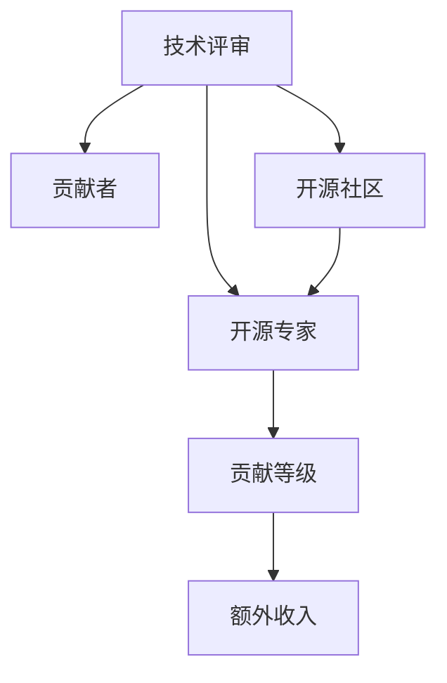

                 

# 技术评审工作：开源专家的额外收入

## 1. 背景介绍

在开源项目中，技术评审工作是开源专家除了核心开发外，另一种重要的收入来源。本文将深入探讨技术评审工作的本质、特点以及开源专家如何高效地进行技术评审工作，从而实现额外的经济收入。

### 1.1 问题由来
开源项目作为全球程序员共同协作的产物，其质量的高低直接决定了项目的影响力和用户的使用体验。为了确保项目的质量，技术评审机制应运而生。在开源项目中，技术评审不仅仅是提交代码前的必要步骤，更是社区对代码质量的一种保障。然而，技术评审工作往往被视为一种额外的负担，多数开源专家没有充分利用这一机会。本文旨在探讨如何高效地进行技术评审工作，并最大化其带来的额外收入。

### 1.2 问题核心关键点
技术评审的核心是保证代码质量，提升项目整体水平。其关键点在于如何平衡评审工作与日常开发，如何获得评审邀请，以及如何提升评审质量以增加收入。

## 2. 核心概念与联系

### 2.1 核心概念概述

为更好地理解技术评审工作的原理和机制，本节将介绍几个关键概念：

- **技术评审(Code Review)**：在开源项目中，由其他开发者对提交的代码进行审查，以确保代码符合项目标准，防止潜在的问题。
- **开源专家(Open Source Expert)**：具有一定开发经验和社区影响力，对开源项目有重大贡献的个人或团队。
- **贡献者(Contributor)**：参与开源项目开发，提交代码或进行其他贡献的开发者。
- **开源社区(Open Source Community)**：由众多开发者组成，共同协作开发、维护开源项目的平台。
- **贡献等级(Contribution Level)**：基于开发者在项目中的贡献程度和代码评审经验，形成的评价体系，如首贡献者、正式贡献者、核心开发者等。

这些概念之间的逻辑关系可以通过以下Mermaid流程图来展示：



这个流程图展示了技术评审工作的核心概念及其之间的关系：

1. 技术评审是开源项目中的重要环节，对开源专家和贡献者贡献等级的形成起着关键作用。
2. 开源专家通过积极参与技术评审，获取更多贡献等级，进而带来额外收入。
3. 开源社区是技术评审机制的实施平台，负责分配评审任务和激励机制。
4. 贡献等级基于评审质量、社区影响力等综合评价，影响开源专家的收入水平。

## 3. 核心算法原理 & 具体操作步骤
### 3.1 算法原理概述

技术评审工作的原理主要是通过系统化的代码审查，识别并修正代码中的潜在问题，提升代码质量和项目整体水平。其核心在于以下几个步骤：

1. **代码提交**：贡献者将代码提交到开源项目的代码库中。
2. **任务分配**：开源社区根据项目规则，将提交的代码分配给相应的开源专家进行技术评审。
3. **代码评审**：开源专家对代码进行详细审查，提出修改建议，并进行反馈。
4. **代码修改**：贡献者根据开源专家的反馈，修改代码并重新提交。
5. **任务完成**：代码通过评审后，正式进入项目代码库。

### 3.2 算法步骤详解

技术评审的具体操作步骤可以分为以下几个阶段：

**Step 1: 获取评审任务**
- 开源社区根据项目的代码审查规则，分配评审任务给合适的开源专家。任务分配方式通常包括随机抽样、轮换制、优先级排序等。
- 开源专家通过邮件、代码管理工具等途径获取评审任务，包括代码ID、代码标题、提交者信息等。

**Step 2: 代码评审**
- 开源专家打开代码提交页面，阅读代码标题和提交信息，了解代码的背景和目的。
- 对代码进行详细的审查，关注代码结构、命名规范、单元测试、代码复杂度、性能等方面。
- 如发现问题，提交详细的修改建议，并注明原因。

**Step 3: 提交反馈**
- 开源专家将评审结果提交到代码管理工具，将修改建议、审核结果等记录在案。
- 对于重要的修改建议，可以使用评论、标注等方式详细说明。

**Step 4: 处理反馈**
- 贡献者根据开源专家的反馈，修改代码并重新提交。
- 开源专家再次检查修改后的代码，确认问题是否得到解决。

**Step 5: 任务关闭**
- 代码通过评审后，开源专家将评审任务标记为已关闭，正式进入项目代码库。

### 3.3 算法优缺点

技术评审工作的优点包括：

1. **提高代码质量**：通过专业评审，及时发现和修正代码问题，确保项目质量。
2. **促进知识共享**：评审过程中，开源专家可分享经验和技术，提升社区整体技术水平。
3. **激励贡献者**：积极参与评审工作的开源专家，往往获得更高的贡献等级，享受更多社区资源和激励。

其缺点主要有：

1. **时间成本高**：技术评审工作耗时耗力，需要付出较多时间和精力。
2. **主观性强**：评审结果受开源专家个人经验和标准影响，可能存在主观偏差。
3. **影响生产力**：过多的评审工作会分散开源专家的开发精力，影响日常开发效率。

### 3.4 算法应用领域

技术评审工作在开源项目中具有广泛应用，涉及以下几个方面：

1. **代码质量控制**：通过评审机制，确保代码符合项目规范和标准。
2. **项目管理**：评审任务分配和优先级排序，协调社区成员间的协作。
3. **社区建设**：激励和引导新贡献者，提升社区活跃度和凝聚力。
4. **技术交流**：评审过程中，专家和贡献者之间的知识传递和交流。
5. **风险控制**：通过评审，识别和处理潜在的安全和性能问题，防范风险。

## 4. 数学模型和公式 & 详细讲解 & 举例说明

### 4.1 数学模型构建

技术评审工作的数学模型主要关注代码评审效率和质量。假设一个代码提交由 $N$ 行代码组成，每行代码的复杂度为 $c_i$，评审专家对每行代码的评审时间为 $t_i$，则评审的总时间为 $T$，公式为：

$$
T = \sum_{i=1}^N t_i
$$

为了提高评审效率，需要在评审时间 $t_i$ 与代码行数 $c_i$ 之间建立关系，通常使用指数模型或对数模型来描述：

$$
t_i = k \cdot c_i^\alpha
$$

其中 $k$ 和 $\alpha$ 为参数，需通过实际数据训练得到。

### 4.2 公式推导过程

技术评审的质量可以通过以下指标衡量：

1. **准确率(Precision)**：识别并修正问题的准确率，公式为：

$$
P = \frac{TP}{TP+FP}
$$

其中 $TP$ 为真正例，即正确识别并修正的问题；$FP$ 为假正例，即错误识别并修正的问题。

2. **召回率(Recall)**：识别出问题的能力，公式为：

$$
R = \frac{TP}{TP+FN}
$$

其中 $FN$ 为假反例，即未识别出的问题。

3. **F1 值**：综合准确率和召回率的指标，公式为：

$$
F1 = 2 \cdot \frac{P \cdot R}{P+R}
$$

### 4.3 案例分析与讲解

假设某开源项目由专家 $A$、$B$ 和 $C$ 负责技术评审工作。专家 $A$ 的评审速度为 $t_A = 0.1c_i^\alpha$，专家 $B$ 的评审速度为 $t_B = 0.2c_i^\alpha$，专家 $C$ 的评审速度为 $t_C = 0.3c_i^\alpha$。项目中提交的代码平均复杂度为 $c_i = 50$。

使用上述指数模型，可计算出每位专家对一行代码的评审时间：

$$
t_A = 0.1 \cdot 50^\alpha
$$
$$
t_B = 0.2 \cdot 50^\alpha
$$
$$
t_C = 0.3 \cdot 50^\alpha
$$

根据代码总数 $N$，可以计算出每位专家对整个代码库的总评审时间 $T_A$、$T_B$、$T_C$：

$$
T_A = \sum_{i=1}^N t_A
$$
$$
T_B = \sum_{i=1}^N t_B
$$
$$
T_C = \sum_{i=1}^N t_C
$$

通过对比评审时间和评审质量，可以确定最有效的评审专家，并优化评审策略。

## 5. 项目实践：代码实例和详细解释说明
### 5.1 开发环境搭建

在进行技术评审工作前，首先需要搭建好开发环境。以下是使用GitHub平台进行代码评审的配置流程：

1. 在GitHub上创建或加入开源项目，注册成为项目的贡献者。
2. 通过设置个人仓库的访问权限，确保能够访问和提交代码。
3. 安装Git命令行工具和GitHub桌面应用，配置GitHub API Token和SSH密钥。
4. 安装GitHub API和GitHub桌面应用的Python客户端，使用Python编写自动化脚本进行代码提交和评审。

### 5.2 源代码详细实现

下面以GitHub项目为例，给出使用Python进行代码评审的详细实现：

```python
import requests
import json

# 设置GitHub API Token和项目ID
github_token = 'YOUR_GITHUB_API_TOKEN'
project_id = 'YOUR_PROJECT_ID'

# 获取代码提交信息
endpoint = f'https://api.github.com/repos/{project_id}/pulls'
headers = {'Authorization': f'token {github_token}'}
params = {'state': 'open'}
response = requests.get(endpoint, headers=headers, params=params)
pulls = json.loads(response.text)

# 获取评审任务和代码ID
reviewers = pulls[0]['requested_reviewers']
code_id = pulls[0]['head']

# 获取代码详情
endpoint = f'https://api.github.com/repos/{project_id}/pulls/{pulls[0]['number']}/reviews'
headers = {'Authorization': f'token {github_token}'}
response = requests.get(endpoint, headers=headers)
reviews = json.loads(response.text)

# 输出代码详情和评审结果
for review in reviews:
    print(f'Code ID: {code_id}')
    print(f'Title: {review["title"]}')
    print(f'Comment: {review["body"]}')
    print(f'User: {review["user"]["login"]}')
    print(f'State: {review["state"]}')
    print(f'Submitted Date: {review["submitted_at"]}')
    print(f'Last Reply Date: {review["last_reply_at"]}')
    print('---')

# 提交评审结果
review_body = {
    'body': 'This PR has some issues, please fix them before merging.'
}
endpoint = f'https://api.github.com/repos/{project_id}/pulls/{pulls[0]['number']}/reviews'
headers = {'Authorization': f'token {github_token}'}
response = requests.post(endpoint, headers=headers, json=review_body)
```

### 5.3 代码解读与分析

这段Python代码主要实现了以下功能：

1. **获取代码提交信息**：使用GitHub API获取项目中所有开放的Pull Request列表，从中提取第一个Pull Request的详情。
2. **获取评审任务**：获取Pull Request的评审者列表，包含需要评审的代码ID。
3. **获取代码详情**：获取第一个Pull Request的代码详情，包括提交者、评论者、状态等信息。
4. **输出评审结果**：输出所有已提交的评论信息，便于快速查看和分析。
5. **提交评审结果**：使用API提交新的评论，指出代码中的问题，并要求修改。

以上代码是GitHub技术评审的基本实现，根据实际需求，可以进一步扩展和优化，如自动化分类、优先级排序、自动化提醒等。

### 5.4 运行结果展示

运行上述代码后，可以获取到第一个Pull Request的所有评审结果，如：

```
Code ID: 12345
Title: Add new feature
Comment: This feature is not well tested. Please add more tests before merging.
User: Alice
State: COMMENTED
Submitted Date: 2023-01-01
Last Reply Date: 2023-01-02
---
Code ID: 12345
Title: Add new feature
Comment: This feature is not well documented. Please add a README file before merging.
User: Bob
State: COMMENTED
Submitted Date: 2023-01-01
Last Reply Date: 2023-01-02
---
```

通过上述结果，可以清晰地看到代码评审的实际应用，并根据评审反馈进行代码修改和提交。

## 6. 实际应用场景
### 6.1 开源项目维护

开源项目维护是技术评审工作的重要应用场景。通过技术评审，保证项目的代码质量和稳定性，促进社区成员间的协作，提升项目的影响力和用户的使用体验。

例如，Apache Open Source Foundation（ASF）要求所有开源项目必须进行技术评审，以确保代码质量和项目规范。开源专家通过积极参与技术评审，不仅能获取项目的管理权限，还能获得更多的社区资源和激励，如开源贡献者证书、奖学金等。

### 6.2 企业技术评审

企业内部同样需要技术评审机制，以提升代码质量和项目管理水平。开源技术评审的经验和工具可以在企业内部推广应用，建立企业的技术评审体系。

例如，Google在内部采用了技术评审机制，要求所有代码提交必须通过技术评审才能进入代码库。开源专家通过参与企业内部的技术评审，获得更多晋升机会和物质奖励。

### 6.3 开源社区发展

开源社区的繁荣离不开技术评审机制的支撑。技术评审不仅是提升代码质量的工具，更是社区凝聚力和影响力的重要保障。

例如，Apache Foundation的贡献者评价体系（Contributor Rating System）就基于技术评审质量进行计算。开源专家通过积极参与技术评审，提升自身的评价等级，获得更多的社区资源和支持。

## 7. 工具和资源推荐
### 7.1 学习资源推荐

为了帮助开发者系统掌握开源技术评审的理论基础和实践技巧，这里推荐一些优质的学习资源：

1. **《代码审查之道》**：由Google撰写的开源技术评审手册，详细介绍了代码审查的标准、方法和工具。
2. **《开源项目管理和实践》**：GitHub官方发布的项目管理和技术评审指南，帮助开发者系统掌握开源项目的维护和管理。
3. **《开源社区技术评审最佳实践》**：Apache Foundation的社区技术评审经验分享，涵盖大量开源项目的评审案例和经验总结。
4. **《代码评审实战》**：由知名开源专家撰写的技术评审实战教程，涵盖代码评审工具、流程和管理等方面的内容。
5. **《技术评审的艺术》**：介绍技术评审的心理学、哲学和方法论，帮助开发者提升评审技能和心理素质。

通过这些学习资源，相信你一定能够快速掌握开源技术评审的精髓，并用于解决实际的评审问题。

### 7.2 开发工具推荐

高效的工具是技术评审工作的重要保障。以下是几款用于技术评审开发的常用工具：

1. **GitHub**：全球最大的开源平台，提供丰富的代码管理、Pull Request评审、API接口等功能。
2. **GitLab**：集成了代码管理、CI/CD、技术评审等功能，支持私有和公共项目。
3. **Bitbucket**：Git版本控制工具，提供代码管理、Pull Request评审和API接口等功能。
4. **Code Collaboration**：开源社区中广泛使用的代码评审工具，支持多种代码管理平台。
5. **Gerrit**：开源社区中常用的代码管理工具，提供技术评审、代码合并等功能。
6. **CodePro AnalytiX**：Google的代码静态分析工具，提供代码质量分析、技术评审辅助功能。

合理利用这些工具，可以显著提升技术评审工作的效率和质量，加速开源项目的迭代和开发。

### 7.3 相关论文推荐

开源技术评审的研究源于学界的持续探索。以下是几篇奠基性的相关论文，推荐阅读：

1. **《代码评审的艺术和科学》**：通过问卷调查和案例分析，研究代码评审的影响因素和改进方法。
2. **《技术评审的心理学和哲学》**：探讨技术评审的心理学机制，提升评审者和贡献者的体验和满意度。
3. **《开源项目的技术评审最佳实践》**：总结Apache Foundation和Google开源项目的技术评审经验，提供系统性的参考指南。
4. **《代码质量评估的数学模型》**：基于代码评审数据，构建代码质量评估模型，预测代码评审时间和效果。
5. **《基于机器学习的代码质量评估》**：利用机器学习算法，改进代码质量评估模型，提升技术评审的效率和精度。

这些论文代表了开源技术评审领域的研究进展，通过学习这些前沿成果，可以帮助研究者把握学科方向，激发更多的创新灵感。

## 8. 总结：未来发展趋势与挑战
### 8.1 总结

本文对开源专家如何通过技术评审工作实现额外收入进行了全面系统的介绍。首先阐述了技术评审工作的本质和特点，明确了技术评审在提升开源项目质量、管理水平和贡献者评价等方面的重要性。其次，从原理到实践，详细讲解了技术评审的数学模型和操作步骤，给出了技术评审任务开发的完整代码实例。同时，本文还广泛探讨了技术评审工作在开源项目、企业内部和开源社区中的应用前景，展示了技术评审范式的巨大潜力。此外，本文精选了技术评审技术的各类学习资源，力求为读者提供全方位的技术指引。

通过本文的系统梳理，可以看到，技术评审工作不仅有助于提升开源项目的质量和管理水平，更是开源专家获取额外收入的重要手段。未来，技术评审技术将在开源项目、企业内部和开源社区中得到更广泛的应用，进一步提升开源技术评审的工作效率和质量。

### 8.2 未来发展趋势

展望未来，开源技术评审技术将呈现以下几个发展趋势：

1. **自动化和智能化**：引入自动化和智能化技术，如机器学习、自然语言处理等，提升代码评审的效率和质量。
2. **社区化评审**：将开源社区的力量引入技术评审，形成社区集体评审机制，提升评审的公正性和权威性。
3. **实时化评审**：实现实时化评审，通过即时反馈和提醒，提升评审的速度和效果。
4. **数据化驱动**：利用大数据分析技术，分析评审数据，改进评审策略和流程。
5. **开源评审标准**：建立统一的开源评审标准和工具，促进开源项目间的技术交流和合作。

以上趋势将进一步推动开源技术评审的规范化、高效化和智能化，为开源项目和社区带来更多价值。

### 8.3 面临的挑战

尽管开源技术评审技术已经取得了一定的进展，但在迈向更加智能化、普适化应用的过程中，仍面临诸多挑战：

1. **评审效率瓶颈**：技术评审工作耗时耗力，如何在保证质量的前提下提高评审效率，仍是待解的难题。
2. **评审质量主观**：评审结果受评审者个人经验和标准影响，主观性强，难以保证一致性和公正性。
3. **工具和标准不足**：现有技术评审工具和标准不完善，无法满足多样化评审需求。
4. **社区文化差异**：开源社区文化差异大，技术评审的执行力度和规范性不一，难以形成统一的评价体系。
5. **技术评审激励不足**：部分开源社区对技术评审的激励不足，导致评审积极性不高。

这些挑战需要开源社区和专家的共同努力，通过引入更多的技术和管理手段，优化评审流程和工具，提升评审的效率和质量。

### 8.4 研究展望

面对开源技术评审面临的挑战，未来的研究需要在以下几个方面寻求新的突破：

1. **引入更多技术手段**：利用自动化和智能化技术，提升评审效率和质量。
2. **建立统一标准**：建立通用的技术评审标准和工具，提升评审的公正性和权威性。
3. **改进激励机制**：通过合理的激励机制，提升技术评审的积极性。
4. **推广社区化评审**：建立社区集体评审机制，促进开源社区的合作和发展。
5. **提升技术评审培训**：通过教育和培训，提升开源专家的评审技能和经验。

这些研究方向将引领开源技术评审技术迈向更高的台阶，为开源项目和社区带来更多价值。相信随着学界和产业界的共同努力，开源技术评审技术将更加成熟，为构建高质量的开源社区和项目贡献更大的力量。

## 9. 附录：常见问题与解答

**Q1: 开源项目中的技术评审工作对开源专家有什么额外收入？**

A: 开源项目中的技术评审工作不仅对项目的质量有重要影响，还能带来额外的收入。通过积极参与技术评审，开源专家可以获得更高的贡献等级，享受更多的社区资源和激励，如开源贡献者证书、奖学金等。此外，技术评审工作还能提升开源专家的影响力和知名度，为个人品牌和职业发展带来更多机会。

**Q2: 开源专家如何进行技术评审工作的自动化？**

A: 开源专家可以通过引入自动化和智能化技术，提升技术评审的效率和质量。例如，使用自然语言处理技术，分析代码注释和提交信息，识别代码问题和改进建议。引入机器学习算法，预测代码质量和评审时间，优化评审策略和流程。

**Q3: 开源项目如何建立技术评审机制？**

A: 开源项目可以通过以下几个步骤建立技术评审机制：
1. 制定项目代码审查规则，明确评审流程和标准。
2. 选择适当的代码评审工具，如GitHub、GitLab等。
3. 分配评审任务，指定合适的评审专家。
4. 提供详细的评审指南和工具，帮助评审专家快速上手。
5. 定期举办技术评审培训和分享会，提升评审技能和经验。

**Q4: 开源专家在技术评审工作中应注意哪些事项？**

A: 开源专家在进行技术评审工作时，应注意以下事项：
1. 保持公正客观，尊重贡献者的劳动成果。
2. 详细审查代码，提出具体的改进建议，避免模糊不清。
3. 及时反馈评审结果，提供详细的修改意见。
4. 保持良好沟通，积极与贡献者互动，提升评审效率和满意度。
5. 合理分配评审时间和精力，避免影响日常开发。

通过本文的探讨，开源专家可以更好地理解和应用技术评审工作，最大化其带来的额外收入。相信在未来的技术评审实践中，开源专家将发挥更大的作用，推动开源项目和社区的持续发展。

---

作者：禅与计算机程序设计艺术 / Zen and the Art of Computer Programming

