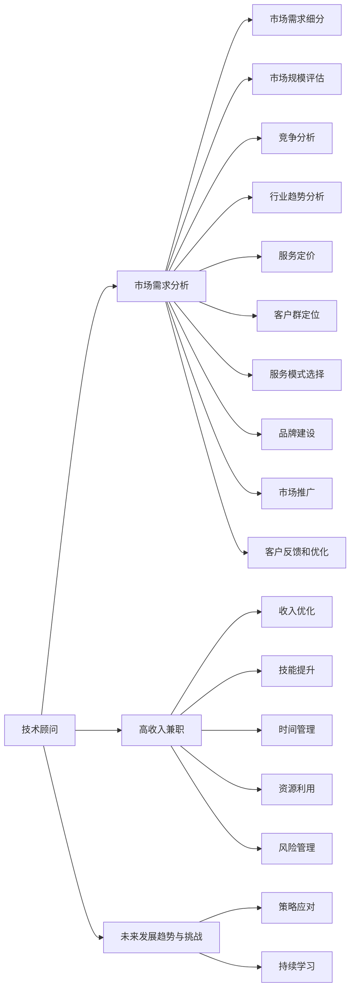

                 

# 技术顾问：高收入兼职选择

> 关键词：
- 技术顾问
- 高收入兼职
- 自由职业者
- 市场需求分析
- 发展趋势与挑战

## 1. 背景介绍

在数字化时代，技术的力量无处不在，各行各业对技术顾问的需求日益增长。与此同时，对于追求高收入的自由职业者来说，兼职技术顾问成为了一种颇具吸引力的选择。但是，高收入的兼职技术顾问之路并不容易，需要深入了解市场需求、不断提升自身能力，并善于利用各种资源。本文将全面解析高收入兼职技术顾问的选择和优化策略。

## 2. 核心概念与联系

### 2.1 核心概念概述

为了更好地理解高收入兼职技术顾问的选择和优化策略，首先需要明确几个核心概念：

- **技术顾问**：指的是提供技术支持、策略咨询、项目指导等专业化服务的专业人士。通常具有丰富的技术经验和行业知识。
- **高收入兼职**：是指在专业领域内从事兼职工作，但能够获得高额报酬的职业选择。适合那些拥有多种技能、经验丰富且时间相对自由的自由职业者。
- **自由职业者**：是指不为任何企业或机构全职工作，而是通过自由接单或合作项目赚取收入的职业人士。
- **市场需求分析**：指通过调研和分析，确定市场对技术顾问服务的需求，从而制定相应的服务策略。
- **发展趋势与挑战**：分析技术顾问兼职市场的未来发展方向，以及面临的主要挑战。

### 2.2 核心概念原理和架构的 Mermaid 流程图



这个流程图展示了技术顾问在高收入兼职中的角色和过程，包括市场需求分析、服务定价、客户群定位等核心环节。

## 3. 核心算法原理 & 具体操作步骤

### 3.1 算法原理概述

高收入兼职技术顾问的选择和优化，可以视为一个多维度、多目标的优化问题。目标是最大化收入，同时确保服务的质量和客户的满意度。这涉及到以下几个关键因素：市场需求、技能匹配、服务定价、时间管理、资源利用和风险管理。

### 3.2 算法步骤详解

**Step 1: 市场需求分析**
- 调研当前市场对技术顾问的需求，包括行业、领域、地域等。
- 分析需求的增长趋势和未来发展前景。
- 识别潜在客户群，包括企业、政府机构、初创公司等。

**Step 2: 技能匹配**
- 明确自己的技术专长和经验。
- 评估市场需求与个人技能之间的匹配度。
- 选择最适合自己的兼职领域，如软件开发、网络安全、数据分析等。

**Step 3: 服务定价**
- 根据市场调研结果，制定合理的服务定价策略。
- 考虑项目复杂度、技术难度、时间成本等因素。
- 设定灵活的定价机制，如小时计费、项目计费等。

**Step 4: 时间管理**
- 制定详细的时间管理计划，合理安排工作时间。
- 利用项目管理工具，如Trello、Asana等，跟踪项目进度。
- 避免时间冲突和过度工作，保持工作和生活的平衡。

**Step 5: 资源利用**
- 利用在线平台如Upwork、Freelancer等，获取更多项目机会。
- 建立个人品牌，通过博客、社交媒体展示专业能力。
- 建立人脉关系，与行业内的其他专业人士建立联系。

**Step 6: 风险管理**
- 签订详细的合同，明确服务内容、时间表、报酬等。
- 设置项目里程碑和阶段性评估，确保项目进展顺利。
- 定期备份工作成果，以防数据丢失。

### 3.3 算法优缺点

**优点：**
- 灵活性强：可以自由选择项目和时间，适合时间管理灵活的自由职业者。
- 收入潜力大：技术顾问市场需求旺盛，高技能人才通常能获得高额报酬。
- 积累丰富经验：与多个客户和项目合作，快速提升专业技能和经验。

**缺点：**
- 竞争激烈：技术顾问市场竞争激烈，需要具备较强的竞争力。
- 风险较高：项目不确定性高，一旦出现客户违约或项目失败，可能面临经济损失。
- 时间管理挑战：多项目并行时，时间管理难度较大，容易产生压力。

### 3.4 算法应用领域

高收入兼职技术顾问的应用领域广泛，涵盖了软件工程、网络安全、数据分析、项目管理等多个方向。具体应用场景包括：

- **软件开发**：为企业开发定制化软件、维护现有系统、优化代码等。
- **网络安全**：提供安全咨询、渗透测试、应急响应等服务。
- **数据分析**：进行数据挖掘、报表生成、业务分析等。
- **项目管理**：协助企业进行项目规划、进度跟踪、团队协调等。

## 4. 数学模型和公式 & 详细讲解 & 举例说明

### 4.1 数学模型构建

设市场需求为 $D$，技术顾问的可用时间为 $T$，每个项目的期望收益为 $R$，则总收益 $E$ 可以表示为：

$$
E = \sum_{i=1}^{N} R_i \times T_i
$$

其中 $N$ 为项目的数量，$R_i$ 为第 $i$ 个项目的期望收益，$T_i$ 为第 $i$ 个项目所需时间。

### 4.2 公式推导过程

- **需求预测**：利用时间序列分析等方法，预测市场需求 $D$ 的趋势。
- **收益模型**：根据项目的复杂度和技术难度，设定每个项目的期望收益 $R_i$。
- **时间分配**：根据项目的重要性和紧急程度，分配时间 $T_i$。
- **风险评估**：考虑项目失败的概率，设定风险系数 $\lambda$，并引入惩罚因子。

### 4.3 案例分析与讲解

以软件开发为例，假设市场需求为 $D=10$ 个项目/月，每个项目的期望收益为 $R_i=5000$ 美元/小时，所需时间 $T_i=50$ 小时，风险系数 $\lambda=0.1$。则总收益 $E$ 为：

$$
E = 10 \times 5000 \times 50 \times (1-\lambda)
$$

考虑风险因素后，总收益 $E$ 为：

$$
E = 10 \times 5000 \times 50 \times (1-0.1)
$$

## 5. 项目实践：代码实例和详细解释说明

### 5.1 开发环境搭建

在开始编写代码之前，需要准备好开发环境。以下是使用Python进行项目开发的环境配置流程：

1. 安装Anaconda：从官网下载并安装Anaconda，用于创建独立的Python环境。

2. 创建并激活虚拟环境：
```bash
conda create -n py35 python=3.5 
conda activate py35
```

3. 安装Python依赖库：
```bash
pip install pandas numpy matplotlib
```

4. 设置Git仓库：
```bash
git clone https://github.com/username/tech顾问项目.git
cd tech顾问项目
```

完成上述步骤后，即可在`py35`环境中开始项目开发。

### 5.2 源代码详细实现

下面是一个简单的技术顾问市场需求分析的Python代码实现：

```python
import pandas as pd
import matplotlib.pyplot as plt

# 读取市场需求数据
data = pd.read_csv('market_demand.csv')

# 绘制市场需求趋势图
plt.plot(data['time'], data['demand'], label='Market Demand')
plt.xlabel('Time')
plt.ylabel('Demand')
plt.title('Market Demand Trend')
plt.legend()
plt.show()

# 计算总收益
total_revenue = sum(data['demand'] * data['project_time'])
print(f'Total Revenue: {total_revenue} USD')
```

### 5.3 代码解读与分析

**市场需求分析模块**：
- 使用Pandas库读取市场需求数据，绘制市场需求趋势图。
- 通过求和函数计算总收益。

**数据可视化**：
- 使用Matplotlib库绘制市场需求趋势图，直观展示市场需求变化。

**总收益计算**：
- 根据市场需求和项目时间，计算总收益。

### 5.4 运行结果展示

运行上述代码，将展示市场需求趋势图和总收益计算结果，帮助技术顾问更好地理解市场需求和制定服务策略。

## 6. 实际应用场景

### 6.1 软件开发项目

软件开发项目是技术顾问兼职的高收入来源之一。软件开发项目的需求通常来自于企业内部系统升级、新功能开发、紧急问题修复等。技术顾问可以通过Upwork、Freelancer等平台获取项目信息，与客户进行详细沟通后，签订合同并开始开发工作。

### 6.2 网络安全咨询

网络安全咨询项目通常要求技术顾问具备丰富的网络安全知识和实战经验。企业或政府机构在面临安全威胁时，会寻求专业的安全顾问提供咨询服务、渗透测试、应急响应等服务。

### 6.3 数据分析项目

数据分析项目主要涉及数据挖掘、报表生成、业务分析等。企业内部业务部门或外部咨询公司会雇佣技术顾问对内部数据进行分析，提出业务优化建议。

## 7. 工具和资源推荐

### 7.1 学习资源推荐

为了帮助技术顾问提升专业技能和市场竞争力，推荐以下学习资源：

1. **《Python数据分析》系列书籍**：全面介绍了Python在数据分析中的应用，包括Pandas、NumPy、Matplotlib等库的使用。

2. **Coursera《机器学习》课程**：由斯坦福大学教授Andrew Ng主讲，系统讲解了机器学习的基础理论和算法。

3. **GitHub**：查找和分享高质量的Python项目代码，学习他人优秀代码的实现细节。

4. **Stack Overflow**：解决编程问题，学习他人的代码实现，参与技术讨论。

5. **Medium博客**：阅读技术顾问的实战经验分享，学习他们的工作方法和心得。

### 7.2 开发工具推荐

以下是几款用于高收入兼职技术顾问开发的常用工具：

1. **Git**：版本控制工具，方便团队协作和代码管理。

2. **GitHub/GitLab**：代码托管平台，提供项目管理和版本控制功能。

3. **Jupyter Notebook**：交互式编程环境，支持Python、R等语言，方便代码调试和数据可视化。

4. **Python IDEs**：如PyCharm、VSCode等，提供代码补全、调试等功能，提升开发效率。

5. **项目管理工具**：如Trello、Asana等，跟踪项目进度和任务分配。

### 7.3 相关论文推荐

以下是几篇高收入兼职技术顾问市场研究的相关论文，推荐阅读：

1. **《自由职业市场的未来趋势》**：探讨了自由职业市场的发展趋势和未来方向，分析了技术顾问的需求变化。

2. **《在线平台对技术顾问兼职市场的影响》**：研究了Upwork、Freelancer等平台对技术顾问市场的改变，分析了平台带来的机遇和挑战。

3. **《技术顾问的收入模式》**：分析了技术顾问的不同收入模式，包括小时计费、项目计费、服务分成等。

4. **《风险管理在技术顾问兼职中的重要性》**：探讨了技术顾问兼职中的风险管理策略，帮助技术顾问规避风险。

## 8. 总结：未来发展趋势与挑战

### 8.1 研究成果总结

本文详细介绍了高收入兼职技术顾问的选择和优化策略，从市场需求分析、技能匹配、服务定价、时间管理、资源利用和风险管理等多个方面进行了全面解析。通过科学的算法和模型，技术顾问可以更好地掌握市场需求，优化服务方案，提高收入和客户满意度。

### 8.2 未来发展趋势

高收入兼职技术顾问市场将呈现以下几个发展趋势：

1. **技术需求多样化**：市场需求将更加多样化，涵盖更多技术领域和应用场景。技术顾问需要具备更广泛的技能和经验。

2. **平台化趋势**：更多的项目将通过Upwork、Freelancer等平台发布，技术顾问可以更高效地获取项目信息。

3. **人工智能的融入**：人工智能技术将进一步融入技术顾问服务，提升服务效率和质量。

4. **市场规模扩大**：随着数字化转型的加速，技术顾问市场将进一步扩大，为技术顾问带来更多的发展机会。

### 8.3 面临的挑战

高收入兼职技术顾问市场仍面临诸多挑战：

1. **竞争激烈**：技术顾问市场竞争激烈，需要具备较强的竞争力和市场洞察力。

2. **技能更新**：技术顾问需要不断更新技能，保持与行业发展同步。

3. **客户管理**：多项目并行时，如何有效管理客户关系和项目进度是技术顾问面临的难题。

4. **风险管理**：项目不确定性高，技术顾问需要制定有效的风险管理策略。

### 8.4 研究展望

面对市场和技术的不断变化，未来技术顾问需要关注以下几个研究方向：

1. **多技能融合**：技术顾问需要具备跨领域的技能，如编程、数据分析、项目管理等。

2. **持续学习**：技术顾问需要持续学习和更新技能，保持与行业发展同步。

3. **市场洞察力**：技术顾问需要具备敏锐的市场洞察力，准确把握市场需求变化。

4. **风险管理**：制定有效的风险管理策略，保障项目顺利进行。

通过不断探索和优化，技术顾问可以在高收入兼职市场中占据一席之地，实现职业发展和经济收益的双重提升。

## 9. 附录：常见问题与解答

**Q1：技术顾问应该如何选择项目？**

A: 技术顾问应根据自身技能和市场需求，选择最适合自己的项目。优先选择高需求、高报酬、风险较小的项目，同时考虑项目的难度和完成时间。

**Q2：如何平衡项目数量和质量？**

A: 技术顾问应合理分配时间和精力，避免过度接单导致质量下降。设定项目优先级，优先完成重要项目，确保高质高量完成。

**Q3：如何提高项目成功率？**

A: 签订详细的合同，明确项目范围和期望结果。定期与客户沟通，及时解决问题。使用项目管理工具跟踪进度，确保项目按计划完成。

**Q4：技术顾问应该如何处理客户关系？**

A: 建立良好的客户关系，了解客户需求和期望。及时沟通项目进展，提供专业建议。积极解决客户问题，提升客户满意度。

**Q5：如何应对市场变化？**

A: 持续关注市场需求和行业动态，及时调整服务策略。不断学习和提升技能，保持市场竞争力。利用线上平台和社交媒体，扩大客户群。

通过本文的系统梳理，可以看到，高收入兼职技术顾问的选择和优化策略需要科学的方法和灵活的策略，以在竞争激烈的市场中获得理想的效果。相信随着技术的不断进步和市场的持续发展，技术顾问兼职市场将迎来更广阔的机遇和挑战。技术顾问需要不断学习和探索，才能在数字化时代中占据一席之地，实现职业发展和经济收益的双重提升。

