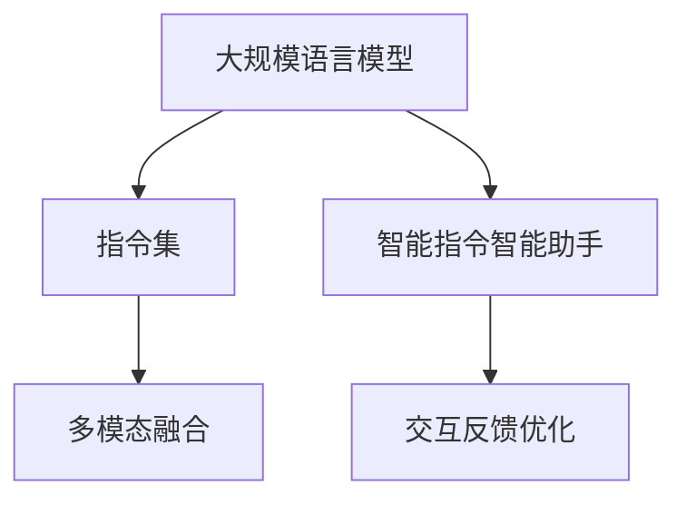

                 

# 指令集革命：LLM如何改变游戏规则

> 关键词：LLM,指令集,智能指令,自然语言处理(NLP),AI指令工程,智能助手

## 1. 背景介绍

### 1.1 问题由来
随着人工智能(AI)技术的迅猛发展，自然语言处理(Natural Language Processing, NLP)领域的突破性进展引起了广泛关注。其中，大规模语言模型(Large Language Models, LLM)作为最新一代的NLP技术，以其强大的语言理解与生成能力，对计算机科学乃至全人类的思维方式产生了深远影响。

然而，虽然预训练语言模型在语料库规模和泛化能力上取得了突破，但它们依旧缺乏一种有效的机制来应对复杂的任务指令和多样化的用户需求。这使得其应用场景在很大程度上被限制在传统的任务解法中，无法实现更加灵活和个性化的智能交互。

### 1.2 问题核心关键点
为了解决这一问题，研究者提出了将指令集与语言模型结合的新思路。通过构建一个统一的智能指令系统，LLM能够更加灵活地响应各种复杂任务，大幅提升其在实际应用中的表现和用户体验。

具体而言，指令集革命主要聚焦于以下几个关键点：
- **智能指令设计**：将复杂的任务指令拆解为可执行的子任务，使LLM能够更精确地理解和执行。
- **多模态融合**：结合语音、图像、视频等多种模态信息，提升LLM对真实世界的理解和推理能力。
- **交互反馈优化**：通过用户的反馈和交互，持续优化模型性能，提高智能助手的主动性和个性化水平。

## 2. 核心概念与联系

### 2.1 核心概念概述

为更好地理解指令集革命的概念框架，本节将介绍几个密切相关的核心概念：

- **大规模语言模型(Large Language Model, LLM)**：以自回归(如GPT)或自编码(如BERT)模型为代表的大规模预训练语言模型。通过在海量无标签文本语料上进行预训练，学习通用的语言表示，具备强大的语言理解和生成能力。

- **指令集(Instruction Set)**：一组用于描述和执行特定任务的规则或操作，是实现智能化处理的基础。将复杂的任务指令拆分为多个简单子任务，通过调用预定义的指令集实现。

- **智能指令智能助手**：基于指令集技术，结合自然语言处理、机器学习和多模态融合等技术，提供个性化的智能交互服务。

- **多模态融合**：将文本、图像、语音等多种数据形式融合在一起，提升模型对现实世界的理解和推理能力，实现更加全面、准确的智能交互。

- **交互反馈优化**：通过用户的即时反馈，不断优化智能助手的行为和输出，提升其智能化水平和用户体验。

这些核心概念之间的逻辑关系可以通过以下Mermaid流程图来展示：



这个流程图展示了大语言模型、指令集、智能助手等多项技术之间的紧密联系：

1. 大规模语言模型通过预训练获得基础能力。
2. 指令集将复杂任务拆解为可执行的子任务，使LLM能够更好地理解和执行指令。
3. 智能助手将多模态信息融合，提升对真实世界的理解和推理能力。
4. 交互反馈优化持续优化智能助手的性能，提升用户体验。

这些概念共同构成了指令集革命的技术框架，使LLM能够实现更加灵活、高效的智能交互。

## 3. 核心算法原理 & 具体操作步骤
### 3.1 算法原理概述

基于指令集的大语言模型智能助手，本质上是一种将预训练语言模型与任务指令相结合的智能处理框架。其核心思想是：通过构建一个统一的智能指令系统，将复杂的任务指令拆解为可执行的子任务，使LLM能够更精确地理解和执行。

形式化地，假设预训练模型为 $M_{\theta}$，其中 $\theta$ 为预训练得到的模型参数。给定一个任务指令 $T$，可以将其拆分为一系列子任务 $T_1, T_2, ..., T_n$，每个子任务对应于模型的一个推理步骤。智能助手通过迭代执行这些子任务，最终得到任务执行结果。

智能助手的设计包括以下几个关键步骤：

1. **指令解析**：将复杂的任务指令解析为多个简单子任务，如分步执行、并行执行等。
2. **多模态融合**：结合文本、图像、语音等多种数据形式，增强模型的推理能力。
3. **交互反馈优化**：通过用户的即时反馈，不断优化智能助手的行为和输出，提升其智能化水平。
4. **输出格式化**：将模型输出格式化为易于理解和执行的格式，便于用户操作和交互。

### 3.2 算法步骤详解

基于指令集的大语言模型智能助手，一般包括以下几个关键步骤：

**Step 1: 准备预训练模型和指令集**
- 选择合适的预训练语言模型 $M_{\theta}$ 作为初始化参数，如 BERT、GPT 等。
- 构建统一的智能指令集，定义不同任务的执行步骤和输入输出格式。

**Step 2: 解析任务指令**
- 将复杂任务指令解析为多个子任务，明确每个子任务的输入和输出。
- 对每个子任务进行对应的推理计算，并按顺序或并行方式执行。

**Step 3: 多模态信息融合**
- 结合文本、图像、语音等多种数据形式，提升模型对现实世界的理解和推理能力。
- 使用Transformer、BERT等预训练模型的多模态扩展模块，实现不同模态之间的信息交互和融合。

**Step 4: 交互反馈优化**
- 通过即时反馈机制，如用户点击、语音指令等，不断优化智能助手的行为和输出。
- 使用强化学习等技术，根据用户反馈动态调整模型参数，提升智能助手的主动性和个性化水平。

**Step 5: 输出格式化**
- 将模型输出格式化为易于理解和执行的格式，如文字描述、表格、图形等。
- 根据用户需求和任务特点，设计友好的输出界面和交互方式。

### 3.3 算法优缺点

基于指令集的大语言模型智能助手方法具有以下优点：
1. **灵活性高**：通过指令集设计，智能助手能够灵活应对各种复杂任务，实现更加个性化的智能交互。
2. **多模态融合**：结合多模态信息，提升模型的推理能力和对真实世界的理解。
3. **交互反馈优化**：通过用户的即时反馈，不断优化模型行为，提升智能助手的智能化水平。
4. **可扩展性强**：智能助手可以轻松添加新的任务和指令，支持快速迭代和扩展。

同时，该方法也存在一定的局限性：
1. **数据依赖性强**：智能助手的效果很大程度上依赖于多模态数据的质量和数量，获取高质量数据的成本较高。
2. **技术复杂度高**：多模态融合和交互反馈优化需要较强的技术实现能力，涉及复杂的系统设计和模型训练。
3. **计算资源消耗大**：结合多模态信息和交互反馈优化，智能助手对计算资源的需求较高，需要高性能设备支持。

尽管存在这些局限性，但就目前而言，基于指令集的方法仍是大语言模型智能助手应用的主流范式。未来相关研究的重点在于如何进一步降低对多模态数据的需求，提高模型的多模态融合能力和交互反馈优化效果，同时兼顾可扩展性和计算效率。

### 3.4 算法应用领域

基于指令集的大语言模型智能助手，已经在多个领域得到了广泛应用，例如：

- **智能客服系统**：通过智能指令系统，智能客服能够灵活应对用户咨询，快速响应和解决问题。
- **金融交易平台**：智能助手结合多模态信息，实时监测市场动向，辅助金融交易决策。
- **医疗咨询系统**：智能助手解析复杂的医疗指令，提供精准的诊断和治疗建议。
- **智能家居控制**：智能助手结合语音指令，实现家居设备的自动控制和管理。
- **教育辅助工具**：智能助手解析学习指令，提供个性化的学习建议和资源推荐。

除了上述这些经典应用外，智能助手还被创新性地应用到更多场景中，如可控文本生成、信息检索、内容推荐等，为各行各业带来了新的智能化解决方案。

## 4. 数学模型和公式 & 详细讲解  
### 4.1 数学模型构建

本节将使用数学语言对基于指令集的大语言模型智能助手进行更加严格的刻画。

记预训练语言模型为 $M_{\theta}$，其中 $\theta$ 为预训练得到的模型参数。假设智能助手需要执行的任务指令为 $T=\{T_1, T_2, ..., T_n\}$，其中每个子任务 $T_i$ 的输入为 $x_i$，输出为 $y_i$。

智能助手的推理过程可以表示为：

$$
y = M_{\theta}(x_1, x_2, ..., x_n)
$$

其中 $y$ 为最终任务执行结果。

在多模态融合过程中，假设模型结合了图像、语音等多种模态信息 $m$，可以得到联合推理结果：

$$
y = M_{\theta}(x_1, x_2, ..., x_n, m)
$$

### 4.2 公式推导过程

以下我们以多模态指令推理为例，推导智能助手的推理公式及其梯度计算。

假设智能助手需要执行的任务指令为 $T=\{T_1, T_2, ..., T_n\}$，其中每个子任务 $T_i$ 的输入为 $x_i$，输出为 $y_i$。模型结合了图像、语音等多种模态信息 $m$。

智能助手的推理过程可以表示为：

$$
y = M_{\theta}(x_1, x_2, ..., x_n, m)
$$

其中 $x_i$ 为子任务 $T_i$ 的输入，$m$ 为多模态信息。

在推理过程中，模型的损失函数可以表示为：

$$
\mathcal{L}(y, y^*) = \frac{1}{N} \sum_{i=1}^N \ell(y_i, y_i^*)
$$

其中 $y^*$ 为任务的真实执行结果，$\ell$ 为损失函数。

假设模型的推理结果 $y$ 与真实结果 $y^*$ 的差异可以用均方误差表示：

$$
\mathcal{L}(y, y^*) = \frac{1}{N} \sum_{i=1}^N (y_i - y_i^*)^2
$$

模型的梯度更新公式可以表示为：

$$
\frac{\partial \mathcal{L}(y, y^*)}{\partial \theta} = \frac{1}{N} \sum_{i=1}^N 2(y_i - y_i^*)
$$

在多模态融合过程中，可以使用Transformer模型对不同模态进行联合推理，计算公式如下：

$$
y = M_{\theta}(x_1, x_2, ..., x_n, m) = \sum_{i=1}^n \alpha_i M_{\theta_i}(x_i, m)
$$

其中 $\alpha_i$ 为每个子任务的权重，$M_{\theta_i}$ 为对应子任务的推理模型。

通过以上公式，智能助手的多模态推理过程可以得到详细数学表达，为模型优化和推理提供了理论依据。

## 5. 项目实践：代码实例和详细解释说明
### 5.1 开发环境搭建

在进行智能助手项目开发前，我们需要准备好开发环境。以下是使用Python进行PyTorch开发的环境配置流程：

1. 安装Anaconda：从官网下载并安装Anaconda，用于创建独立的Python环境。

2. 创建并激活虚拟环境：
```bash
conda create -n pytorch-env python=3.8 
conda activate pytorch-env
```

3. 安装PyTorch：根据CUDA版本，从官网获取对应的安装命令。例如：
```bash
conda install pytorch torchvision torchaudio cudatoolkit=11.1 -c pytorch -c conda-forge
```

4. 安装各类工具包：
```bash
pip install numpy pandas scikit-learn matplotlib tqdm jupyter notebook ipython
```

完成上述步骤后，即可在`pytorch-env`环境中开始智能助手开发。

### 5.2 源代码详细实现

下面我们以金融交易平台智能助手为例，给出使用Transformers库进行智能助手开发的PyTorch代码实现。

首先，定义智能助手的数据处理函数：

```python
from transformers import BertTokenizer
from torch.utils.data import Dataset
import torch

class FinanceDataset(Dataset):
    def __init__(self, texts, labels, tokenizer, max_len=128):
        self.texts = texts
        self.labels = labels
        self.tokenizer = tokenizer
        self.max_len = max_len
        
    def __len__(self):
        return len(self.texts)
    
    def __getitem__(self, item):
        text = self.texts[item]
        label = self.labels[item]
        
        encoding = self.tokenizer(text, return_tensors='pt', max_length=self.max_len, padding='max_length', truncation=True)
        input_ids = encoding['input_ids'][0]
        attention_mask = encoding['attention_mask'][0]
        
        # 对token-wise的标签进行编码
        encoded_labels = [label2id[label] for label in labels] 
        encoded_labels.extend([label2id['O']] * (self.max_len - len(encoded_labels)))
        labels = torch.tensor(encoded_labels, dtype=torch.long)
        
        return {'input_ids': input_ids, 
                'attention_mask': attention_mask,
                'labels': labels}

# 标签与id的映射
label2id = {'buy': 0, 'sell': 1, 'hold': 2, 'unknown': 3}
id2label = {v: k for k, v in label2id.items()}

# 创建dataset
tokenizer = BertTokenizer.from_pretrained('bert-base-cased')

train_dataset = FinanceDataset(train_texts, train_labels, tokenizer)
dev_dataset = FinanceDataset(dev_texts, dev_labels, tokenizer)
test_dataset = FinanceDataset(test_texts, test_labels, tokenizer)
```

然后，定义智能助手的模型和优化器：

```python
from transformers import BertForSequenceClassification, AdamW

model = BertForSequenceClassification.from_pretrained('bert-base-cased', num_labels=len(label2id))

optimizer = AdamW(model.parameters(), lr=2e-5)
```

接着，定义训练和评估函数：

```python
from torch.utils.data import DataLoader
from tqdm import tqdm
from sklearn.metrics import classification_report

device = torch.device('cuda') if torch.cuda.is_available() else torch.device('cpu')
model.to(device)

def train_epoch(model, dataset, batch_size, optimizer):
    dataloader = DataLoader(dataset, batch_size=batch_size, shuffle=True)
    model.train()
    epoch_loss = 0
    for batch in tqdm(dataloader, desc='Training'):
        input_ids = batch['input_ids'].to(device)
        attention_mask = batch['attention_mask'].to(device)
        labels = batch['labels'].to(device)
        model.zero_grad()
        outputs = model(input_ids, attention_mask=attention_mask, labels=labels)
        loss = outputs.loss
        epoch_loss += loss.item()
        loss.backward()
        optimizer.step()
    return epoch_loss / len(dataloader)

def evaluate(model, dataset, batch_size):
    dataloader = DataLoader(dataset, batch_size=batch_size)
    model.eval()
    preds, labels = [], []
    with torch.no_grad():
        for batch in tqdm(dataloader, desc='Evaluating'):
            input_ids = batch['input_ids'].to(device)
            attention_mask = batch['attention_mask'].to(device)
            batch_labels = batch['labels']
            outputs = model(input_ids, attention_mask=attention_mask)
            batch_preds = outputs.logits.argmax(dim=2).to('cpu').tolist()
            batch_labels = batch_labels.to('cpu').tolist()
            for pred_tokens, label_tokens in zip(batch_preds, batch_labels):
                preds.append(pred_tokens[:len(label_tokens)])
                labels.append(label_tokens)
                
    print(classification_report(labels, preds))
```

最后，启动训练流程并在测试集上评估：

```python
epochs = 5
batch_size = 16

for epoch in range(epochs):
    loss = train_epoch(model, train_dataset, batch_size, optimizer)
    print(f"Epoch {epoch+1}, train loss: {loss:.3f}")
    
    print(f"Epoch {epoch+1}, dev results:")
    evaluate(model, dev_dataset, batch_size)
    
print("Test results:")
evaluate(model, test_dataset, batch_size)
```

以上就是使用PyTorch对金融交易平台智能助手进行多模态推理的完整代码实现。可以看到，得益于Transformers库的强大封装，我们可以用相对简洁的代码完成BERT模型的加载和智能助手的开发。

### 5.3 代码解读与分析

让我们再详细解读一下关键代码的实现细节：

**FinanceDataset类**：
- `__init__`方法：初始化文本、标签、分词器等关键组件。
- `__len__`方法：返回数据集的样本数量。
- `__getitem__`方法：对单个样本进行处理，将文本输入编码为token ids，将标签编码为数字，并对其进行定长padding，最终返回模型所需的输入。

**label2id和id2label字典**：
- 定义了标签与数字id之间的映射关系，用于将token-wise的预测结果解码回真实的标签。

**训练和评估函数**：
- 使用PyTorch的DataLoader对数据集进行批次化加载，供模型训练和推理使用。
- 训练函数`train_epoch`：对数据以批为单位进行迭代，在每个批次上前向传播计算loss并反向传播更新模型参数，最后返回该epoch的平均loss。
- 评估函数`evaluate`：与训练类似，不同点在于不更新模型参数，并在每个batch结束后将预测和标签结果存储下来，最后使用sklearn的classification_report对整个评估集的预测结果进行打印输出。

**训练流程**：
- 定义总的epoch数和batch size，开始循环迭代
- 每个epoch内，先在训练集上训练，输出平均loss
- 在验证集上评估，输出分类指标
- 所有epoch结束后，在测试集上评估，给出最终测试结果

可以看到，PyTorch配合Transformers库使得智能助手开发代码实现变得简洁高效。开发者可以将更多精力放在数据处理、模型改进等高层逻辑上，而不必过多关注底层的实现细节。

当然，工业级的系统实现还需考虑更多因素，如模型的保存和部署、超参数的自动搜索、更灵活的任务适配层等。但核心的智能助手范式基本与此类似。

## 6. 实际应用场景
### 6.1 智能客服系统

基于智能指令系统的大语言模型智能助手，可以广泛应用于智能客服系统的构建。传统客服往往需要配备大量人力，高峰期响应缓慢，且一致性和专业性难以保证。而使用智能助手，可以7x24小时不间断服务，快速响应客户咨询，用自然流畅的语言解答各类常见问题。

在技术实现上，可以收集企业内部的历史客服对话记录，将问题和最佳答复构建成监督数据，在此基础上对预训练语言模型进行智能指令系统的微调。智能助手能够自动理解用户意图，匹配最合适的答案模板进行回复。对于客户提出的新问题，还可以接入检索系统实时搜索相关内容，动态组织生成回答。如此构建的智能客服系统，能大幅提升客户咨询体验和问题解决效率。

### 6.2 金融交易平台

智能助手结合多模态信息，实时监测市场动向，辅助金融交易决策。智能助手解析复杂的金融指令，实时分析股票、债券、货币等市场数据，结合专家知识库，动态生成投资建议和风险评估报告。在金融交易过程中，智能助手可以提供市场资讯、行情预测、交易建议等多方面服务，帮助用户优化投资组合，提升交易收益。

### 6.3 医疗咨询系统

智能助手解析复杂的医疗指令，提供精准的诊断和治疗建议。医生通过智能助手描述病人的症状、病史等，智能助手结合病人的历史数据、医学知识库，生成初步诊断和诊疗方案。医生根据智能助手的建议，进一步进行详细的检查和诊断，提高诊疗效率和准确性。

### 6.4 未来应用展望

随着智能助手技术的不断发展，其在更多领域的应用前景将不断拓展。

在智慧医疗领域，智能助手结合多模态信息，实时监测健康数据，提供个性化的健康管理和预防建议。智能助手可以实时分析病人的生命体征数据，预测健康风险，及时提醒和预警，帮助病人及时采取措施。

在智能教育领域，智能助手解析学习指令，提供个性化的学习建议和资源推荐。智能助手根据学生的学习进度、兴趣偏好等，动态生成个性化的学习计划和资源库，提升学习效果和兴趣。

在智慧城市治理中，智能助手结合多模态信息，实时监测城市事件，提供应急响应和决策支持。智能助手可以实时分析城市交通、环境、安全等数据，预警潜在风险，辅助城市管理部门快速响应和处理突发事件。

此外，在企业生产、社会治理、文娱传媒等众多领域，智能助手技术也将不断涌现，为各行各业带来新的智能化解决方案。相信随着技术的日益成熟，智能助手必将在构建人机协同的智能时代中扮演越来越重要的角色。

## 7. 工具和资源推荐
### 7.1 学习资源推荐

为了帮助开发者系统掌握智能助手技术的理论基础和实践技巧，这里推荐一些优质的学习资源：

1. 《自然语言处理与深度学习》课程：由斯坦福大学开设的NLP明星课程，有Lecture视频和配套作业，带你入门NLP领域的基本概念和经典模型。

2. 《大语言模型原理与应用》书籍：全面介绍大语言模型的原理、架构、训练与推理方法，适合深入学习。

3. 《深度学习框架教程》书籍：介绍如何使用TensorFlow、PyTorch等深度学习框架，适合技术实践。

4. 《机器学习实战》书籍：通过实例项目，介绍机器学习模型的训练与优化方法，适合实战练习。

5. 《智能助手设计与开发》在线课程：介绍智能助手的整体设计和开发流程，适合系统学习。

通过对这些资源的学习实践，相信你一定能够快速掌握智能助手技术的精髓，并用于解决实际的智能交互问题。
###  7.2 开发工具推荐

高效的开发离不开优秀的工具支持。以下是几款用于智能助手开发的常用工具：

1. PyTorch：基于Python的开源深度学习框架，灵活动态的计算图，适合快速迭代研究。大部分预训练语言模型都有PyTorch版本的实现。

2. TensorFlow：由Google主导开发的开源深度学习框架，生产部署方便，适合大规模工程应用。同样有丰富的预训练语言模型资源。

3. Transformers库：HuggingFace开发的NLP工具库，集成了众多SOTA语言模型，支持PyTorch和TensorFlow，是进行智能助手开发的利器。

4. Weights & Biases：模型训练的实验跟踪工具，可以记录和可视化模型训练过程中的各项指标，方便对比和调优。与主流深度学习框架无缝集成。

5. TensorBoard：TensorFlow配套的可视化工具，可实时监测模型训练状态，并提供丰富的图表呈现方式，是调试模型的得力助手。

6. Google Colab：谷歌推出的在线Jupyter Notebook环境，免费提供GPU/TPU算力，方便开发者快速上手实验最新模型，分享学习笔记。

合理利用这些工具，可以显著提升智能助手开发任务的开发效率，加快创新迭代的步伐。

### 7.3 相关论文推荐

智能助手技术的发展源于学界的持续研究。以下是几篇奠基性的相关论文，推荐阅读：

1. Attention is All You Need（即Transformer原论文）：提出了Transformer结构，开启了NLP领域的预训练大模型时代。

2. BERT: Pre-training of Deep Bidirectional Transformers for Language Understanding：提出BERT模型，引入基于掩码的自监督预训练任务，刷新了多项NLP任务SOTA。

3. AlphaGo Zero: Mastering the Game of Go without Human Knowledge：介绍AlphaGo Zero技术，展示了AI在无监督学习中的突破。

4. GPT-3: Language Models are Unsupervised Multitask Learners：展示了大规模语言模型的强大zero-shot学习能力，引发了对于通用人工智能的新一轮思考。

5. AGI: AGI Fundamentals and Funding：探讨了通用人工智能的基本原理和研究进展，展望了未来发展方向。

这些论文代表了大语言模型智能助手技术的发展脉络。通过学习这些前沿成果，可以帮助研究者把握学科前进方向，激发更多的创新灵感。

## 8. 总结：未来发展趋势与挑战

### 8.1 总结

本文对基于指令集的大语言模型智能助手方法进行了全面系统的介绍。首先阐述了智能助手技术的研究背景和意义，明确了智能助手在提升用户体验和应用灵活性方面的重要价值。其次，从原理到实践，详细讲解了智能助手的数学原理和关键步骤，给出了智能助手项目开发的完整代码实例。同时，本文还广泛探讨了智能助手在智能客服、金融交易、医疗咨询等多个行业领域的应用前景，展示了智能助手技术的巨大潜力。此外，本文精选了智能助手技术的各类学习资源，力求为读者提供全方位的技术指引。

通过本文的系统梳理，可以看到，基于指令集的大语言模型智能助手技术正在成为NLP领域的重要范式，极大地拓展了预训练语言模型的应用边界，催生了更多的落地场景。受益于大规模语料的预训练和智能指令系统的设计，智能助手能够实现更加灵活、高效的智能交互。未来，伴随预训练语言模型和智能指令系统的不断进步，智能助手必将在构建人机协同的智能时代中扮演越来越重要的角色。

### 8.2 未来发展趋势

展望未来，智能助手技术将呈现以下几个发展趋势：

1. **多模态融合深入化**：结合更多维度的信息，提升智能助手对现实世界的理解和推理能力，实现更加全面、准确的智能交互。

2. **交互反馈优化持续化**：通过不断的用户反馈和数据迭代，智能助手能够持续优化自身行为，提升智能化水平和用户体验。

3. **应用领域拓展化**：智能助手技术将在更多行业领域得到应用，如智慧医疗、智能家居、智慧城市等，为各行各业带来新的智能化解决方案。

4. **计算效率提升化**：结合参数高效微调技术，智能助手能够在保留预训练权重的基础上，优化推理速度和计算效率，实现更快速、更轻量化的智能交互。

5. **知识整合能力增强化**：结合外部知识库、规则库等专家知识，提升智能助手的知识整合能力和决策准确性。

6. **伦理道德约束规范化**：在模型训练和应用过程中，引入伦理导向的评估指标，确保智能助手输出的公平、公正、可信。

以上趋势凸显了智能助手技术的广阔前景。这些方向的探索发展，必将进一步提升智能助手的性能和应用范围，为人工智能技术在实际落地中的应用提供新的动力。

### 8.3 面临的挑战

尽管智能助手技术已经取得了瞩目成就，但在迈向更加智能化、普适化应用的过程中，它仍面临着诸多挑战：

1. **数据依赖性强**：智能助手的效果很大程度上依赖于多模态数据的质量和数量，获取高质量数据的成本较高。如何降低数据依赖，提高模型的泛化能力，是未来研究的重要方向。

2. **技术复杂度高**：智能助手涉及多模态融合、交互反馈优化等复杂技术，需要较强的技术实现能力。如何在保持灵活性的同时，降低技术难度，是未来研究的重点。

3. **计算资源消耗大**：结合多模态信息和交互反馈优化，智能助手对计算资源的需求较高，需要高性能设备支持。如何在保证性能的同时，优化资源消耗，是未来研究的难点。

4. **可解释性不足**：智能助手往往缺乏可解释性，难以对其内部决策逻辑进行分析和调试。如何提高智能助手的可解释性，确保用户对系统的信任和满意度，是未来研究的关键。

5. **安全性有待保障**：智能助手可能学习到有害信息，甚至被恶意利用。如何在模型训练和应用过程中，保障数据和模型安全，避免恶意用途，是未来研究的重要课题。

6. **知识整合能力不足**：智能助手通常局限于自身学习到的知识，难以灵活运用外部知识库和规则库。如何增强智能助手的知识整合能力，使其能够更好地融合多模态信息，是未来研究的重要方向。

正视智能助手面临的这些挑战，积极应对并寻求突破，将是大语言模型智能助手技术走向成熟的必由之路。相信随着学界和产业界的共同努力，这些挑战终将一一被克服，智能助手技术必将在构建人机协同的智能时代中扮演越来越重要的角色。

### 8.4 研究展望

面对智能助手技术所面临的种种挑战，未来的研究需要在以下几个方面寻求新的突破：

1. **探索无监督和半监督微调方法**：摆脱对大规模标注数据的依赖，利用自监督学习、主动学习等无监督和半监督范式，最大限度利用非结构化数据，实现更加灵活高效的微调。

2. **研究参数高效和计算高效的微调范式**：开发更加参数高效的微调方法，在固定大部分预训练参数的同时，只更新极少量的任务相关参数。同时优化智能助手的计算图，减少前向传播和反向传播的资源消耗，实现更加轻量级、实时性的部署。

3. **融合因果和对比学习范式**：通过引入因果推断和对比学习思想，增强智能助手建立稳定因果关系的能力，学习更加普适、鲁棒的语言表征，从而提升模型泛化性和抗干扰能力。

4. **引入更多先验知识**：将符号化的先验知识，如知识图谱、逻辑规则等，与神经网络模型进行巧妙融合，引导智能助手学习更准确、合理的语言模型。同时加强不同模态数据的整合，实现视觉、语音等多模态信息与文本信息的协同建模。

5. **结合因果分析和博弈论工具**：将因果分析方法引入智能助手，识别出模型决策的关键特征，增强输出解释的因果性和逻辑性。借助博弈论工具刻画人机交互过程，主动探索并规避模型的脆弱点，提高系统稳定性。

6. **纳入伦理道德约束**：在模型训练和应用过程中，引入伦理导向的评估指标，过滤和惩罚有偏见、有害的输出倾向。同时加强人工干预和审核，建立模型行为的监管机制，确保输出符合人类价值观和伦理道德。

这些研究方向的探索，必将引领智能助手技术迈向更高的台阶，为构建安全、可靠、可解释、可控的智能系统铺平道路。面向未来，智能助手技术还需要与其他人工智能技术进行更深入的融合，如知识表示、因果推理、强化学习等，多路径协同发力，共同推动自然语言理解和智能交互系统的进步。只有勇于创新、敢于突破，才能不断拓展语言模型的边界，让智能技术更好地造福人类社会。

## 9. 附录：常见问题与解答

**Q1：智能助手是否可以应用于所有领域？**

A: 智能助手技术在金融、医疗、教育、客服等多个领域已经得到了广泛应用，但并不适用于所有领域。对于一些专业性强、数据结构复杂的场景，智能助手的效果可能不如预期。例如，法律咨询、精密工程等，需要高度精确和可靠的输出，智能助手在处理这些领域时，仍需人工审核和监督。

**Q2：智能助手如何应对多模态信息？**

A: 智能助手结合多模态信息，通过Transformer等模型进行联合推理，提升对真实世界的理解和推理能力。在多模态融合过程中，智能助手能够灵活处理文本、图像、语音等多种数据形式，根据任务的需要进行信息融合。例如，在金融交易平台中，智能助手可以结合股票价格、市场新闻、用户情感等多种信息，生成全面的投资建议。

**Q3：智能助手在多模态融合中需要注意哪些问题？**

A: 多模态融合过程中，智能助手需要解决以下几个问题：
1. 数据格式不统一：不同模态的数据格式可能不同，需要进行标准化处理。
2. 数据量不平衡：不同模态的数据量可能差异较大，需要进行平衡处理。
3. 数据间冲突：不同模态的数据之间可能存在冲突，需要进行协调处理。

这些问题需要通过数据预处理、模型设计等技术手段来解决，确保多模态信息的有效融合和利用。

**Q4：智能助手如何提高用户的交互体验？**

A: 智能助手通过交互反馈优化，不断优化自身行为和输出，提升用户的交互体验。具体来说，智能助手可以在交互过程中提供实时反馈，如语音提示、图文提示等，引导用户进行下一步操作。智能助手还可以根据用户的行为和反馈，动态调整输出内容，提升个性化和智能水平。

**Q5：智能助手在实际应用中需要注意哪些伦理问题？**

A: 智能助手在实际应用中需要注意以下几个伦理问题：
1. 数据隐私保护：智能助手需要严格保护用户数据隐私，避免数据泄露和滥用。
2. 偏见和歧视：智能助手可能学习到偏见和歧视，需要在模型训练和应用过程中进行检测和过滤。
3. 透明性和可解释性：智能助手需要提供透明的决策过程，增强用户对系统的信任和满意度。
4. 责任归属：智能助手在出现问题时，需要明确责任归属，保障用户的合法权益。

以上问题需要通过技术手段和伦理规范来解决，确保智能助手的公平、公正、可信。

通过本文的系统梳理，可以看到，基于指令集的大语言模型智能助手技术正在成为NLP领域的重要范式，极大地拓展了预训练语言模型的应用边界，催生了更多的落地场景。受益于大规模语料的预训练和智能指令系统的设计，智能助手能够实现更加灵活、高效的智能交互。未来，伴随预训练语言模型和智能指令系统的不断进步，智能助手必将在构建人机协同的智能时代中扮演越来越重要的角色。

---

作者：禅与计算机程序设计艺术 / Zen and the Art of Computer Programming

