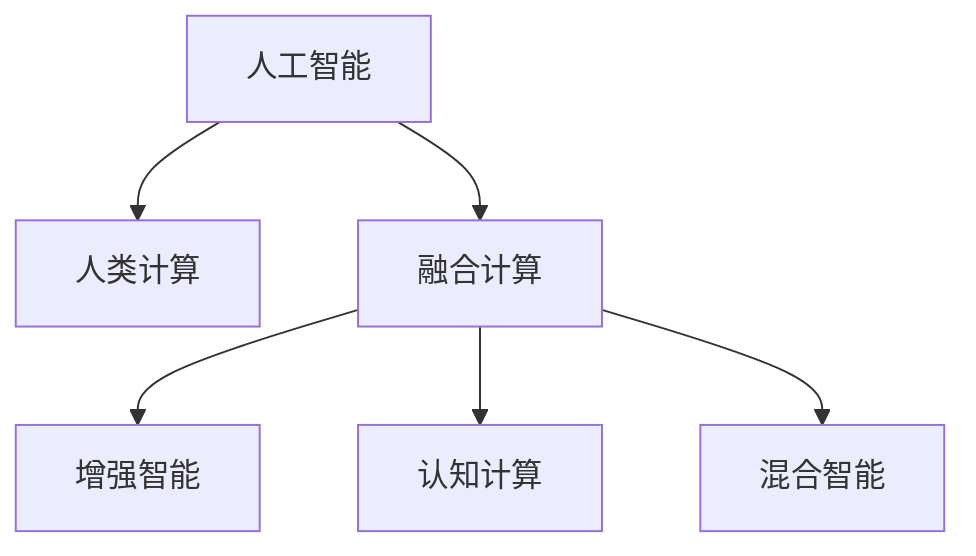

                 

# 探索人类思维的奥秘：人类计算的认知价值

## 1. 背景介绍

### 1.1 问题由来

随着人工智能(AI)技术的迅猛发展，人类计算的力量逐渐被机器所替代，传统计算范式正在被重新定义。现代科技的进步使得人类不再只是信息接收者，更是信息生成者。人类计算的能力，不仅仅在于计算机硬件的性能提升，更在于人类思维与计算机制的深度融合。

在人工智能领域，对于人类计算的认知价值，既有广泛认可，也有诸多疑问。有人认为，人类计算正在被机器取代，未来人工智能将独步天下；也有人认为，人类计算具有不可替代的独特价值，机器智能永远无法取代人类智慧。本文旨在探讨人类计算在当前和未来，以及人工智能发展中的地位与作用。

### 1.2 问题核心关键点

人类计算与人工智能的深度融合，是当前科技发展的趋势。其关键在于理解人类计算与机器智能各自的优点与局限，如何利用人类计算的优势，为人工智能发展提供新的方向和思路。以下将详细探讨人类计算与机器智能的融合路径，以及未来人类计算在人工智能领域的发展方向。

## 2. 核心概念与联系

### 2.1 核心概念概述

为更好地理解人类计算与人工智能的融合，本节将介绍几个密切相关的核心概念：

- **人工智能**：通过计算机模拟人类智能行为，实现问题解决、决策制定等能力的系统。
- **人类计算**：人类以逻辑思维、创新能力等为核心，进行信息处理、计算推理等活动。
- **融合计算**：将人类计算与机器智能结合，形成新的计算模式，提升计算效率和智能水平。
- **增强智能**：通过增强智能算法，利用人类计算辅助机器智能，提升决策的鲁棒性和可解释性。
- **认知计算**：模拟人类认知过程，结合生理与心理机制，实现高效智能计算。
- **混合智能**：整合人类智能与机器智能，形成具有高度适应性和灵活性的智能系统。

这些核心概念之间的逻辑关系可以通过以下Mermaid流程图来展示：



这个流程图展示了一些关键概念的相互关系：

1. 人工智能与人类计算相互补充。
2. 融合计算、增强智能、认知计算和混合智能是融合路径的不同实现方式。

## 3. 核心算法原理 & 具体操作步骤
### 3.1 算法原理概述

人类计算与人工智能的融合计算，其核心思想是通过模拟人类认知过程，利用人类计算的逻辑思维和创新能力，辅助机器智能实现更高效的智能推理和决策。具体来说，融合计算算法通常包括以下步骤：

1. **数据预处理**：将原始数据进行清洗、归一化和特征工程，形成可供人类和机器智能共同处理的格式。
2. **人类计算介入**：利用人类的逻辑推理、直觉判断等能力，对数据进行初步分析和解释。
3. **机器智能处理**：通过机器学习模型，对人类计算的结果进行进一步处理和优化。
4. **反馈与迭代**：将机器智能的处理结果反馈给人类，由人类进行复审和调整，形成更加准确、合理的决策。

### 3.2 算法步骤详解

以下以智能问答系统为例，介绍融合计算算法的详细步骤：

**Step 1: 数据预处理**
- 收集用户提问和已有回答，进行文本清洗、分词、去停用词等预处理步骤。
- 构建文本向量表示，便于后续机器学习和人类计算的融合处理。

**Step 2: 人类计算介入**
- 将问题摘要输入到人类专家的知识库中，进行初步理解和判断。
- 专家通过逻辑推理、直觉判断等方式，对问题进行解释和分析，生成初步答案。

**Step 3: 机器智能处理**
- 将人类专家的初步答案输入到预训练的问答模型中，进行进一步的语义理解和答案生成。
- 利用机器学习模型，优化答案质量，减少歧义和错误。

**Step 4: 反馈与迭代**
- 将机器智能生成的答案返回给专家，专家根据经验和上下文信息，进行复审和调整。
- 反馈到机器学习模型中，不断迭代优化，提升模型效果。

### 3.3 算法优缺点

融合计算算法的优点包括：
1. 结合人类计算与机器智能，提升智能系统的决策鲁棒性和可解释性。
2. 利用人类专家的知识和经验，提高机器智能的适应性和灵活性。
3. 通过人类计算的逻辑推理，减少机器智能的误判和歧义。

其缺点主要包括：
1. 人类计算过程复杂，效率较低，可能影响整体系统响应速度。
2. 人类专家的知识和经验具有局限性，可能存在主观偏差和认知误差。
3. 需要高水平的人类专家，成本较高，难以大规模应用。

### 3.4 算法应用领域

融合计算算法在诸多领域中得到了广泛应用，包括但不限于：

- 医疗诊断：结合医学专家的经验，通过机器智能进行医学影像分析、诊断结果优化等。
- 金融投资：利用金融专家的知识，通过机器学习进行市场预测、风险评估等。
- 智能客服：通过自然语言理解与人类专家的互动，提供更加智能、个性化的客服服务。
- 法律咨询：结合法律专家的法律知识，通过机器学习进行合同审核、案件预测等。
- 教育辅导：利用教育专家的教学经验，通过机器学习进行学习路径推荐、智能批改等。
- 智能制造：结合制造专家的经验，通过机器学习进行生产优化、质量控制等。

这些领域中的成功应用，展示了融合计算算法在实际应用中的强大潜力。

## 4. 数学模型和公式 & 详细讲解 & 举例说明

### 4.1 数学模型构建

本节将使用数学语言对融合计算算法进行严格刻画。

设问题描述为 $Q$，专家知识库为 $K$，人类专家的初步答案为 $A_h$，机器智能生成的答案为 $A_m$。融合计算的目标是构建模型 $F$，使得 $F(Q, K) \rightarrow A$，其中 $A$ 为最终决策结果。

模型 $F$ 通常是一个复合函数，包含以下几个部分：

1. **知识编码**：将专家知识库 $K$ 编码为向量表示，供后续计算使用。
2. **知识融合**：将人类专家的初步答案 $A_h$ 与知识编码 $K$ 进行融合，生成融合结果 $A_c$。
3. **决策生成**：利用机器智能模型，对融合结果 $A_c$ 进行优化和生成，得到最终决策 $A$。

数学上，融合计算的过程可以表示为：

$$
A = F(Q, K) = G(H(A_h, K))
$$

其中，$H$ 为知识融合函数，$G$ 为决策生成函数。

### 4.2 公式推导过程

以下以智能问答系统为例，推导知识融合和决策生成的具体公式。

**知识融合函数 $H$**：

假设专家知识库 $K$ 包含 $n$ 个知识片段，每个知识片段 $k_i$ 可以表示为向量形式 $v_i$。人类专家的初步答案 $A_h$ 也可以表示为向量形式 $v_h$。

知识融合函数 $H$ 的作用是将 $A_h$ 与 $K$ 进行结合，生成融合结果 $A_c$。假设知识融合函数为加权和形式：

$$
A_c = \sum_{i=1}^n w_i v_i + v_h
$$

其中，$w_i$ 为知识片段 $k_i$ 的权重，可以由人工专家或机器学习模型自动学习。

**决策生成函数 $G$**：

将融合结果 $A_c$ 输入到预训练的问答模型中，利用机器学习模型对答案进行优化和生成。假设问答模型的损失函数为 $L$，优化目标为最小化损失函数：

$$
\min_{\theta} L(A_m, A_c)
$$

其中，$A_m$ 为机器智能生成的答案，$\theta$ 为问答模型的参数。

通过反向传播算法，可以求解出优化目标对应的最优参数 $\theta^*$，得到最终决策 $A$。

### 4.3 案例分析与讲解

以下以医疗影像诊断为例，介绍融合计算在实际应用中的具体实现。

**数据预处理**：
- 收集大量的医学影像数据和对应的病理报告，进行标注和预处理。
- 对医学影像进行归一化、标准化等处理，生成可输入到模型的图像数据。

**人类计算介入**：
- 将病理报告输入到人类专家的知识库中，进行初步理解和判断。
- 专家根据病理报告和医学知识，生成初步的诊断结果。

**机器智能处理**：
- 将病理报告和专家初步诊断结果输入到预训练的医学影像识别模型中，进行进一步的分析和优化。
- 利用机器学习模型，对医学影像特征进行提取和分析，生成更准确的诊断结果。

**反馈与迭代**：
- 将机器智能生成的诊断结果返回给专家，专家根据经验和医学知识，进行复审和调整。
- 反馈到机器学习模型中，不断迭代优化，提升模型效果。

## 5. 项目实践：代码实例和详细解释说明
### 5.1 开发环境搭建

在进行融合计算实践前，我们需要准备好开发环境。以下是使用Python进行TensorFlow开发的环境配置流程：

1. 安装Anaconda：从官网下载并安装Anaconda，用于创建独立的Python环境。

2. 创建并激活虚拟环境：
```bash
conda create -n tf-env python=3.8 
conda activate tf-env
```

3. 安装TensorFlow：根据CUDA版本，从官网获取对应的安装命令。例如：
```bash
conda install tensorflow tensorflow-gpu -c conda-forge -c pypi
```

4. 安装各类工具包：
```bash
pip install numpy pandas scikit-learn matplotlib tqdm jupyter notebook ipython
```

完成上述步骤后，即可在`tf-env`环境中开始融合计算实践。

### 5.2 源代码详细实现

这里我们以智能问答系统为例，给出使用TensorFlow对融合计算模型的PyTorch代码实现。

首先，定义融合计算模型的结构：

```python
import tensorflow as tf
from tensorflow.keras.layers import Dense, Input

# 定义输入层和输出层
input_ = Input(shape=(input_size,))
output_ = Dense(output_size, activation='softmax')(input_)

# 定义知识融合层和决策生成层
fusion_layer = Dense(fusion_size, activation='relu')(input_)
decision_layer = Dense(decision_size, activation='relu')(fusion_layer)

# 定义融合计算模型
fusion_model = tf.keras.Model(inputs=input_, outputs=decision_layer)
```

然后，定义训练和评估函数：

```python
from tensorflow.keras.optimizers import Adam

# 定义损失函数
loss_function = tf.keras.losses.CategoricalCrossentropy()

# 定义优化器
optimizer = Adam(learning_rate=0.001)

# 训练函数
def train_model(model, train_data, train_labels, epochs):
    model.compile(optimizer=optimizer, loss=loss_function, metrics=['accuracy'])
    model.fit(train_data, train_labels, epochs=epochs, batch_size=32)

# 评估函数
def evaluate_model(model, test_data, test_labels):
    test_loss, test_acc = model.evaluate(test_data, test_labels, verbose=0)
    print(f'Test accuracy: {test_acc:.2f}')
```

最后，启动训练流程并在测试集上评估：

```python
epochs = 10
batch_size = 32

# 定义训练集和测试集
train_data, train_labels = prepare_train_data()
test_data, test_labels = prepare_test_data()

# 初始化模型
model = fusion_model

# 训练模型
train_model(model, train_data, train_labels, epochs)

# 评估模型
evaluate_model(model, test_data, test_labels)
```

以上就是使用TensorFlow对融合计算模型进行智能问答系统开发的完整代码实现。可以看到，利用TensorFlow的Keras API，可以很方便地定义、训练和评估融合计算模型。

### 5.3 代码解读与分析

让我们再详细解读一下关键代码的实现细节：

**定义融合计算模型**：
- 使用Keras定义输入层、输出层、融合层和决策生成层。
- 通过拼接和激活函数，将知识融合层和决策生成层组成完整的融合计算模型。

**训练函数**：
- 使用Keras的compile方法，定义损失函数、优化器和评估指标。
- 使用fit方法，对模型进行训练，设置训练轮数和批次大小。

**评估函数**：
- 使用evaluate方法，对模型进行评估，返回测试损失和准确率。

**训练流程**：
- 定义训练集和测试集，分别准备训练和测试数据。
- 初始化模型，加载预训练的融合计算模型。
- 在训练集上训练模型，在测试集上评估模型。

可以看到，TensorFlow的Keras API使得融合计算模型的开发变得简洁高效。开发者可以将更多精力放在数据处理、模型改进等高层逻辑上，而不必过多关注底层的实现细节。

当然，工业级的系统实现还需考虑更多因素，如模型的保存和部署、超参数的自动搜索、更灵活的任务适配层等。但核心的融合计算范式基本与此类似。

## 6. 实际应用场景
### 6.1 智能客服系统

融合计算算法可以广泛应用于智能客服系统的构建。传统客服往往需要配备大量人力，高峰期响应缓慢，且一致性和专业性难以保证。而利用融合计算，可以构建更加智能和高效的客服系统。

在技术实现上，可以收集企业内部的历史客服对话记录，将问题和最佳答复构建成监督数据，在此基础上对融合计算模型进行训练。训练后的模型可以自动理解用户意图，匹配最合适的答案模板进行回复。对于客户提出的新问题，还可以接入检索系统实时搜索相关内容，动态组织生成回答。如此构建的智能客服系统，能大幅提升客户咨询体验和问题解决效率。

### 6.2 金融舆情监测

金融机构需要实时监测市场舆论动向，以便及时应对负面信息传播，规避金融风险。传统的人工监测方式成本高、效率低，难以应对网络时代海量信息爆发的挑战。融合计算算法可以应用于金融舆情监测，提升监测系统的智能化水平。

具体而言，可以收集金融领域相关的新闻、报道、评论等文本数据，并对其进行主题标注和情感标注。在此基础上对融合计算模型进行微调，使其能够自动判断文本属于何种主题，情感倾向是正面、中性还是负面。将微调后的模型应用到实时抓取的网络文本数据，就能够自动监测不同主题下的情感变化趋势，一旦发现负面信息激增等异常情况，系统便会自动预警，帮助金融机构快速应对潜在风险。

### 6.3 个性化推荐系统

当前的推荐系统往往只依赖用户的历史行为数据进行物品推荐，无法深入理解用户的真实兴趣偏好。融合计算算法可以应用于个性化推荐系统，更好地挖掘用户行为背后的语义信息。

在实践中，可以收集用户浏览、点击、评论、分享等行为数据，提取和用户交互的物品标题、描述、标签等文本内容。将文本内容作为模型输入，用户的后续行为（如是否点击、购买等）作为监督信号，在此基础上训练融合计算模型。训练后的模型能够从文本内容中准确把握用户的兴趣点。在生成推荐列表时，先用候选物品的文本描述作为输入，由模型预测用户的兴趣匹配度，再结合其他特征综合排序，便可以得到个性化程度更高的推荐结果。

### 6.4 未来应用展望

随着融合计算算法的不断发展，在更多领域中得到应用，为传统行业带来变革性影响。

在智慧医疗领域，融合计算算法可以应用于医疗问答、病历分析、药物研发等，提升医疗服务的智能化水平，辅助医生诊疗，加速新药开发进程。

在智能教育领域，融合计算算法可以应用于作业批改、学情分析、知识推荐等方面，因材施教，促进教育公平，提高教学质量。

在智慧城市治理中，融合计算算法可以应用于城市事件监测、舆情分析、应急指挥等环节，提高城市管理的自动化和智能化水平，构建更安全、高效的未来城市。

此外，在企业生产、社会治理、文娱传媒等众多领域，融合计算算法也将不断涌现，为经济社会发展注入新的动力。相信随着技术的日益成熟，融合计算算法必将在构建人机协同的智能时代中扮演越来越重要的角色。

## 7. 工具和资源推荐
### 7.1 学习资源推荐

为了帮助开发者系统掌握融合计算理论基础和实践技巧，这里推荐一些优质的学习资源：

1. 《认知计算与人工智能》系列博文：由认知计算领域的专家撰写，深入浅出地介绍了认知计算原理、融合计算算法等前沿话题。

2. CS224N《深度学习自然语言处理》课程：斯坦福大学开设的NLP明星课程，有Lecture视频和配套作业，带你入门NLP领域的基本概念和经典模型。

3. 《深度学习》书籍：Goodfellow等人所著，全面介绍了深度学习的基本原理和前沿技术，包括融合计算在内的诸多应用场景。

4. TensorFlow官方文档：TensorFlow配套的官方文档，提供了丰富的模型库和工具，是进行融合计算任务开发的利器。

5. Weights & Biases：模型训练的实验跟踪工具，可以记录和可视化模型训练过程中的各项指标，方便对比和调优。与主流深度学习框架无缝集成。

6. Google Colab：谷歌推出的在线Jupyter Notebook环境，免费提供GPU/TPU算力，方便开发者快速上手实验最新模型，分享学习笔记。

通过对这些资源的学习实践，相信你一定能够快速掌握融合计算的精髓，并用于解决实际的NLP问题。
###  7.2 开发工具推荐

高效的开发离不开优秀的工具支持。以下是几款用于融合计算开发的常用工具：

1. TensorFlow：由Google主导开发的开源深度学习框架，生产部署方便，适合大规模工程应用。同样有丰富的预训练语言模型资源。

2. PyTorch：基于Python的开源深度学习框架，灵活动态的计算图，适合快速迭代研究。大部分预训练语言模型都有PyTorch版本的实现。

3. Transformers库：HuggingFace开发的NLP工具库，集成了众多SOTA语言模型，支持PyTorch和TensorFlow，是进行融合计算任务开发的利器。

4. Weights & Biases：模型训练的实验跟踪工具，可以记录和可视化模型训练过程中的各项指标，方便对比和调优。与主流深度学习框架无缝集成。

5. Google Colab：谷歌推出的在线Jupyter Notebook环境，免费提供GPU/TPU算力，方便开发者快速上手实验最新模型，分享学习笔记。

合理利用这些工具，可以显著提升融合计算任务的开发效率，加快创新迭代的步伐。

### 7.3 相关论文推荐

融合计算技术的发展源于学界的持续研究。以下是几篇奠基性的相关论文，推荐阅读：

1. "Cognitive Computing: A Research Framework"（认知计算研究框架）：介绍了认知计算的基本概念、理论基础和应用场景，为融合计算提供了理论支持。

2. "Deep Learning with Cognitive Architectures"（带有认知架构的深度学习）：提出将认知架构融入深度学习，提升模型的智能推理能力。

3. "Cognitive Modeling of Human Computation"（人类计算的认知建模）：通过认知计算方法，模拟人类计算过程，提升计算模型的智能水平。

4. "Knowledge-Fusion Learning"（知识融合学习）：提出知识融合算法，结合人类计算与机器智能，提升模型的知识整合能力。

5. "Hybrid Intelligent Systems"（混合智能系统）：研究混合智能系统的设计方法，实现人类智能与机器智能的有机结合。

这些论文代表了大语言模型微调技术的发展脉络。通过学习这些前沿成果，可以帮助研究者把握学科前进方向，激发更多的创新灵感。

## 8. 总结：未来发展趋势与挑战
### 8.1 总结

本文对融合计算算法进行了全面系统的介绍。首先阐述了融合计算与人工智能的关系，明确了融合计算在构建智能系统中的独特价值。其次，从原理到实践，详细讲解了融合计算的数学模型和操作步骤，给出了融合计算任务开发的完整代码实例。同时，本文还广泛探讨了融合计算算法在智能客服、金融舆情、个性化推荐等多个行业领域的应用前景，展示了融合计算算法的强大潜力。此外，本文精选了融合计算技术的各类学习资源，力求为读者提供全方位的技术指引。

通过本文的系统梳理，可以看到，融合计算与人工智能的深度融合，正在成为人工智能发展的重要方向。这将使得智能系统具备更加全面、灵活的智能推理和决策能力，为更多领域带来变革性影响。

### 8.2 未来发展趋势

展望未来，融合计算技术将呈现以下几个发展趋势：

1. 与机器智能的深度融合。随着融合计算技术的不断发展，将与机器智能结合得更加紧密，实现更加全面、高效的智能推理。
2. 多模态融合的普及。融合计算将突破单一模态的限制，支持多模态数据的融合，如视觉、语音、文本等，提升智能系统的感知和推理能力。
3. 实时计算能力的提升。融合计算系统将具备更高的实时计算能力，能够实时处理大规模数据流，满足实时智能应用的需求。
4. 知识图谱的应用。融合计算将与知识图谱结合，构建更加全面、准确的知识表示，提升智能系统的决策效果。
5. 增强智能的普及。融合计算将与增强智能技术结合，增强智能系统的可解释性和鲁棒性，提升决策的合理性和公正性。
6. 混合智能系统的普及。融合计算将与增强智能、认知计算等多种智能技术结合，构建更加全面、智能的混合智能系统。

这些趋势凸显了融合计算技术的广阔前景。随着技术的不断进步，融合计算必将在更多的领域中得到应用，为经济社会发展注入新的动力。

### 8.3 面临的挑战

尽管融合计算技术已经取得了瞩目成就，但在迈向更加智能化、普适化应用的过程中，它仍面临着诸多挑战：

1. 数据多样性和异构性。不同领域的数据具有高度的多样性和异构性，难以统一处理和融合。
2. 数据隐私和安全。融合计算需要处理大量的用户数据，如何保护用户隐私和数据安全是一个重要问题。
3. 算法复杂度和可解释性。融合计算算法通常较为复杂，如何简化模型，提高算法的可解释性，是一个关键挑战。
4. 计算资源和成本。融合计算需要大量的计算资源，如何降低计算成本，提高计算效率，是一个重要研究方向。
5. 系统集成与互操作性。不同领域、不同技术之间的系统集成和互操作性问题，需要统一的技术标准和规范。

这些挑战需要不断进行技术攻关和标准制定，以促进融合计算技术的成熟和普及。相信随着技术的不断进步，融合计算必将在构建智能系统、促进科技发展中发挥更大的作用。

### 8.4 研究展望

面对融合计算面临的挑战，未来的研究需要在以下几个方面寻求新的突破：

1. 开发多模态融合算法。结合视觉、语音、文本等多模态数据，构建更加全面、准确的融合计算模型。
2. 引入增强智能技术。通过增强智能算法，增强融合计算模型的可解释性和鲁棒性，提升决策的合理性和公正性。
3. 研究实时计算技术。通过优化计算图和算法，提升融合计算系统的实时计算能力，满足实时智能应用的需求。
4. 开发知识图谱与融合计算的结合方法。通过知识图谱与融合计算的结合，提升系统的知识整合能力和决策效果。
5. 引入联邦学习和隐私保护技术。通过联邦学习等技术，保护用户隐私和数据安全，提升融合计算系统的可信度。
6. 研究混合智能系统的设计与实现。通过混合智能技术，构建更加全面、智能的智能系统，实现人类智能与机器智能的有机结合。

这些研究方向的探索，必将引领融合计算技术迈向更高的台阶，为构建安全、可靠、可解释、可控的智能系统铺平道路。面向未来，融合计算技术还需要与其他人工智能技术进行更深入的融合，如知识表示、因果推理、强化学习等，多路径协同发力，共同推动自然语言理解和智能交互系统的进步。只有勇于创新、敢于突破，才能不断拓展智能系统的边界，让智能技术更好地造福人类社会。

## 9. 附录：常见问题与解答
**Q1：融合计算是否可以替代人工智能中的机器智能？**

A: 融合计算与人工智能的机器智能具有互补性，而非替代性。融合计算利用人类计算的优势，结合机器智能的高效处理能力，可以提升系统的决策鲁棒性和可解释性，但无法完全替代机器智能。未来，融合计算将成为人工智能的重要组成部分，与机器智能协同工作，共同提升智能系统的智能化水平。

**Q2：融合计算在应用中需要注意哪些问题？**

A: 融合计算在应用中需要注意以下问题：
1. 数据质量：确保输入数据的质量和可靠性，避免噪声和偏见对融合计算的影响。
2. 模型复杂度：避免模型过于复杂，提高融合计算的效率和可解释性。
3. 用户隐私：保护用户隐私，确保数据处理过程的合法合规。
4. 计算资源：合理配置计算资源，避免计算资源的浪费和过度消耗。
5. 系统集成：确保系统与其他系统的无缝集成和互操作性。

**Q3：融合计算在实际部署中需要注意哪些问题？**

A: 将融合计算模型转化为实际应用，还需要考虑以下问题：
1. 模型裁剪：去除不必要的层和参数，减小模型尺寸，加快推理速度。
2. 量化加速：将浮点模型转为定点模型，压缩存储空间，提高计算效率。
3. 服务化封装：将模型封装为标准化服务接口，便于集成调用。
4. 弹性伸缩：根据请求流量动态调整资源配置，平衡服务质量和成本。
5. 监控告警：实时采集系统指标，设置异常告警阈值，确保服务稳定性。
6. 安全防护：采用访问鉴权、数据脱敏等措施，保障数据和模型安全。

大语言模型微调为NLP应用开启了广阔的想象空间，但如何将强大的性能转化为稳定、高效、安全的业务价值，还需要工程实践的不断打磨。总之，融合计算需要开发者根据具体任务，不断迭代和优化模型、数据和算法，方能得到理想的效果。

---

作者：禅与计算机程序设计艺术 / Zen and the Art of Computer Programming

