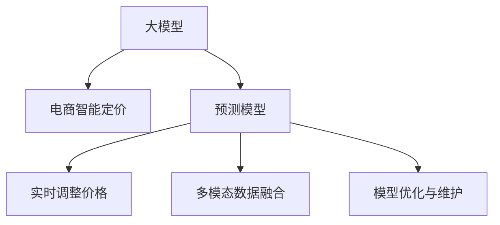

                 

# 探索基于大模型的电商智能定价系统

> 关键词：电商, 智能定价, 大模型, 自动化, 预测模型, 多模态数据

## 1. 背景介绍

随着电商平台的高速发展，商家面临着激烈的市场竞争和不断变化的消费者需求。智能定价系统通过精准预测市场需求和竞争态势，帮助商家自动化调整商品价格，以最大化利润和提升用户体验。传统电商定价往往依赖手动调价或简单算法，难以应对复杂的市场动态和多样的消费者行为。基于大模型的智能定价系统通过深度学习和自然语言处理技术，提供了更智能、更灵活的定价方案，大幅提升了电商运营的效率和精准度。

### 1.1 问题由来
电商平台的商品定价是一个复杂多变的问题，受多种因素影响，包括市场供需、竞争态势、消费者行为、季节性变化等。传统电商定价方法如成本加成定价、竞争对手定价、市场份额定价等，往往缺乏对实际需求的动态响应和长期优化。基于大模型的智能定价系统通过深度学习技术，可以从海量数据中学习商品价格与销量、用户行为等复杂非线性关系，提供更加精准和动态的定价策略。

### 1.2 问题核心关键点
智能定价系统的核心在于构建一个能够实时预测市场需求的模型，同时根据预测结果自动调整商品价格。关键点包括：
- 构建预测模型：使用深度学习算法对历史销售数据进行建模，预测未来的市场需求和价格趋势。
- 实时调整价格：根据模型预测结果，自动调整商品价格，优化销售策略。
- 多模态数据融合：整合销售数据、用户行为数据、市场情报等多元信息，提升预测准确性。
- 模型优化与维护：不断优化模型，处理异常数据，确保预测准确性和系统稳定性。

### 1.3 问题研究意义
构建基于大模型的智能定价系统，对电商平台具有重要意义：
- 提升运营效率：自动化调整商品价格，减少人工操作，提高运营效率。
- 增加收入：精准定价策略提升商品销量和利润率，优化库存管理。
- 增强竞争力：根据市场动态调整价格，保持市场竞争力。
- 改善用户体验：动态定价策略增强用户感知价值，提升购买意愿。
- 数据驱动决策：利用数据驱动定价策略，提高决策的科学性和准确性。

## 2. 核心概念与联系

### 2.1 核心概念概述

为更好地理解基于大模型的电商智能定价系统，本节将介绍几个密切相关的核心概念：

- **大模型(Large Model)**：指采用Transformer等深度学习架构，参数量达数亿甚至数十亿的大规模预训练语言模型。这些模型通过在大规模无标签文本数据上进行预训练，学习到了丰富的语言知识，能够处理复杂的文本理解和生成任务。

- **电商智能定价系统(E-commerce Pricing System)**：指基于深度学习和大数据技术，构建的智能定价决策系统。该系统通过预测市场动态和消费者行为，自动调整商品价格，实现电商运营的自动化和智能化。

- **预测模型(Prediction Model)**：指用于预测市场变化、用户行为等目标变量的深度学习模型，如回归模型、分类模型、序列模型等。

- **多模态数据融合(Multimodal Data Fusion)**：指将不同来源和格式的数据（如销售数据、用户行为数据、市场情报等）进行整合，利用模型学习不同模态信息之间的关联性，提升预测准确性。

- **模型优化与维护(Model Optimization and Maintenance)**：指对模型进行参数更新、数据清洗、异常处理等维护操作，确保模型性能的稳定性和长期有效性。

这些核心概念之间的逻辑关系可以通过以下Mermaid流程图来展示：



这个流程图展示了智能定价系统中各组件之间的相互关系：

1. 大模型通过预训练学习通用语言知识，为预测模型提供基础。
2. 预测模型根据历史数据和市场情报，预测未来价格和销量。
3. 实时调整价格模块根据预测结果，自动调整商品价格。
4. 多模态数据融合模块整合不同来源数据，提升预测精度。
5. 模型优化与维护模块对模型进行优化，确保其长期有效性。

## 3. 核心算法原理 & 具体操作步骤
### 3.1 算法原理概述

基于大模型的电商智能定价系统主要利用深度学习技术，通过构建预测模型来预测市场动态和用户行为，从而自动调整商品价格。核心算法流程包括数据准备、模型训练、预测与价格调整等步骤。

### 3.2 算法步骤详解

#### 3.2.1 数据准备
- 收集历史销售数据、市场情报、用户行为数据等，建立训练集和验证集。
- 对数据进行清洗和预处理，包括数据归一化、特征工程等。
- 对多模态数据进行融合，如将销售数据与用户行为数据结合，构建综合特征向量。

#### 3.2.2 模型训练
- 选择合适的深度学习模型，如RNN、CNN、Transformer等。
- 使用训练集数据，优化模型参数，最小化预测误差。
- 在验证集上评估模型性能，调整超参数。

#### 3.2.3 预测与价格调整
- 对实时市场数据和用户行为数据进行输入，通过预测模型输出价格预测结果。
- 根据预测结果，自动调整商品价格。
- 实时监控系统性能，处理异常数据，确保系统稳定运行。

#### 3.2.4 模型优化与维护
- 定期对模型进行参数更新，处理异常数据，提升模型性能。
- 利用数据增量更新，保持模型对市场变化的及时响应。
- 进行模型维护，确保系统的长期稳定性和可靠性。

### 3.3 算法优缺点

基于大模型的电商智能定价系统具有以下优点：
1. 预测精度高：通过深度学习模型对复杂数据进行建模，预测结果准确性高。
2. 实时响应：模型能够实时处理市场动态和用户行为，快速调整价格。
3. 自动化操作：减少人工干预，提高运营效率。
4. 提升收入：通过精准定价提升销量和利润率。
5. 数据驱动决策：利用数据驱动定价策略，提高决策科学性。

同时，该系统也存在一些局限性：
1. 对数据质量依赖高：预测模型依赖大量高质量数据，数据质量差会影响预测结果。
2. 计算资源需求高：大模型和深度学习模型需要大量的计算资源。
3. 模型解释性差：深度学习模型为"黑盒"系统，难以解释其内部工作机制。
4. 维护复杂：模型和系统需要定期优化和维护，复杂度高。

### 3.4 算法应用领域

基于大模型的电商智能定价系统在电商领域具有广泛的应用前景，适用于以下场景：

- **商品定价**：根据市场需求、竞争态势、用户行为等预测商品价格，实现自动调价。
- **库存管理**：利用预测结果优化库存水平，避免库存积压或缺货。
- **促销策略**：动态调整促销活动的时间和力度，提升销售效果。
- **客户推荐**：根据用户行为预测其偏好，个性化推荐商品。
- **市场分析**：分析市场趋势，调整定价策略，提升市场竞争力。

此外，该系统在在线旅游、金融、物流等多元化场景中也有广泛应用，通过深度学习和大数据分析，实现各行业的智能决策和运营优化。

## 4. 数学模型和公式 & 详细讲解  
### 4.1 数学模型构建

本节将使用数学语言对基于大模型的电商智能定价系统进行更加严格的刻画。

记历史销售数据为 $D=\{(x_i, y_i)\}_{i=1}^N, x_i \in \mathcal{X}, y_i \in \mathcal{Y}$，其中 $x_i$ 为特征向量，$y_i$ 为目标变量（价格或销量）。

定义预测模型的损失函数为 $L(y_i, \hat{y}_i) = (y_i - \hat{y}_i)^2$，则在训练集 $D$ 上的经验风险为：

$$
\mathcal{L}(\theta) = \frac{1}{N}\sum_{i=1}^N L(y_i, M_{\theta}(x_i))
$$

其中 $M_{\theta}(x_i)$ 为预测模型的输出，$\theta$ 为模型参数。

目标是最小化经验风险，即找到最优参数：

$$
\theta^* = \mathop{\arg\min}_{\theta} \mathcal{L}(\theta)
$$

在实践中，我们通常使用基于梯度的优化算法（如SGD、Adam等）来近似求解上述最优化问题。设 $\eta$ 为学习率，则参数的更新公式为：

$$
\theta \leftarrow \theta - \eta \nabla_{\theta}\mathcal{L}(\theta)
$$

其中 $\nabla_{\theta}\mathcal{L}(\theta)$ 为损失函数对参数 $\theta$ 的梯度，可通过反向传播算法高效计算。

### 4.2 公式推导过程

以线性回归模型为例，推导预测模型的损失函数及其梯度的计算公式。

假设预测模型为 $M_{\theta}(x) = \theta_0 + \sum_{i=1}^d \theta_i x_i$，其中 $\theta = (\theta_0, \theta_1, ..., \theta_d)$ 为模型参数。则预测模型的输出为：

$$
\hat{y}_i = \theta_0 + \sum_{i=1}^d \theta_i x_{i,i}
$$

根据均方误差损失函数，定义预测模型的损失函数为：

$$
L(y_i, \hat{y}_i) = \frac{1}{2}(y_i - \hat{y}_i)^2
$$

将其代入经验风险公式，得：

$$
\mathcal{L}(\theta) = \frac{1}{N}\sum_{i=1}^N L(y_i, \hat{y}_i)
$$

根据链式法则，损失函数对参数 $\theta_k$ 的梯度为：

$$
\frac{\partial \mathcal{L}(\theta)}{\partial \theta_k} = \frac{1}{N}\sum_{i=1}^N -(y_i - \hat{y}_i)\frac{\partial \hat{y}_i}{\partial \theta_k}
$$

其中 $\frac{\partial \hat{y}_i}{\partial \theta_k}$ 可进一步递归展开，利用自动微分技术完成计算。

在得到损失函数的梯度后，即可带入参数更新公式，完成模型的迭代优化。重复上述过程直至收敛，最终得到适应电商智能定价任务的预测模型参数 $\theta^*$。

## 5. 项目实践：代码实例和详细解释说明
### 5.1 开发环境搭建

在进行电商智能定价系统开发前，我们需要准备好开发环境。以下是使用Python进行PyTorch开发的环境配置流程：

1. 安装Anaconda：从官网下载并安装Anaconda，用于创建独立的Python环境。

2. 创建并激活虚拟环境：
```bash
conda create -n pytorch-env python=3.8 
conda activate pytorch-env
```

3. 安装PyTorch：根据CUDA版本，从官网获取对应的安装命令。例如：
```bash
conda install pytorch torchvision torchaudio cudatoolkit=11.1 -c pytorch -c conda-forge
```

4. 安装Pandas、Numpy等常用工具包：
```bash
pip install pandas numpy
```

5. 安装TensorFlow、Keras等深度学习框架：
```bash
pip install tensorflow keras
```

完成上述步骤后，即可在`pytorch-env`环境中开始开发实践。

### 5.2 源代码详细实现

这里我们以线性回归模型为例，给出一个使用TensorFlow进行电商智能定价系统微调的PyTorch代码实现。

首先，定义数据处理函数：

```python
import pandas as pd
import numpy as np
from sklearn.preprocessing import StandardScaler
from sklearn.model_selection import train_test_split
from tensorflow.keras import Sequential, Dense
from tensorflow.keras.losses import MeanSquaredError

def load_data(file_path):
    data = pd.read_csv(file_path)
    features = data.drop(['price', 'time'], axis=1)
    target = data[['price', 'time']]
    features = features.values
    target = target.values.reshape(-1, 2)
    return features, target

def preprocess_data(features, target, train_ratio=0.8):
    features_train, features_test, target_train, target_test = train_test_split(features, target, train_size=train_ratio, random_state=42)
    scaler = StandardScaler()
    features_train = scaler.fit_transform(features_train)
    features_test = scaler.transform(features_test)
    return features_train, features_test, target_train, target_test

def build_model(input_dim):
    model = Sequential([
        Dense(32, activation='relu', input_dim=input_dim),
        Dense(16, activation='relu'),
        Dense(1, activation='linear')
    ])
    model.compile(optimizer='adam', loss=MeanSquaredError())
    return model

def train_model(model, features_train, features_test, target_train, target_test):
    model.fit(features_train, target_train, epochs=50, batch_size=32, validation_data=(features_test, target_test))
    return model
```

然后，定义模型和优化器：

```python
features_train, features_test, target_train, target_test = load_data('sales_data.csv')
features_train, features_test, target_train, target_test = preprocess_data(features_train, target_train)

input_dim = features_train.shape[1]
model = build_model(input_dim)
optimizer = Adam(model.optimizer)
```

接着，定义训练和评估函数：

```python
def evaluate_model(model, features_test, target_test):
    mse = mean_squared_error(target_test, model.predict(features_test))
    rmse = np.sqrt(mse)
    print(f'RMSE: {rmse:.4f}')

def train_and_evaluate(model, features_train, features_test, target_train, target_test):
    model = train_model(model, features_train, features_test, target_train, target_test)
    evaluate_model(model, features_test, target_test)
```

最后，启动训练流程：

```python
train_and_evaluate(model, features_train, features_test, target_train, target_test)
```

以上就是使用PyTorch对线性回归模型进行电商智能定价系统微调的完整代码实现。可以看到，借助TensorFlow和Keras等工具，模型的构建和训练变得简洁高效。

### 5.3 代码解读与分析

让我们再详细解读一下关键代码的实现细节：

**load_data函数**：
- 读取历史销售数据文件，并将其分割为特征和目标变量。

**preprocess_data函数**：
- 对数据进行标准化处理，防止不同特征的尺度差异影响模型效果。
- 将数据分割为训练集和测试集。

**build_model函数**：
- 定义一个简单的神经网络模型，包括输入层、隐藏层和输出层。

**train_model函数**：
- 在训练集上训练模型，并使用测试集进行验证。

**evaluate_model函数**：
- 计算模型在测试集上的均方误差（MSE）和均方根误差（RMSE），用于评估模型性能。

**train_and_evaluate函数**：
- 训练模型并在测试集上评估性能。

这些函数是电商智能定价系统的核心部分，通过这些代码，可以快速搭建一个基于深度学习的智能定价系统。

## 6. 实际应用场景

### 6.1 智能定价系统

电商智能定价系统通过深度学习和大数据分析，实时预测市场动态和用户行为，自动调整商品价格，实现自动化的智能定价。

在技术实现上，可以收集历史销售数据、用户行为数据、市场情报等多元信息，建立综合预测模型。模型通过学习不同数据之间的关联性，预测未来的价格和销量，并根据预测结果自动调整商品价格。对于新商品或特殊活动，系统可以自动生成定价策略，提升促销效果。

### 6.2 库存管理

电商平台的库存管理是运营中的重要环节。通过智能定价系统，可以优化库存水平，避免库存积压或缺货。系统可以根据实时市场需求和预测结果，自动调整库存量，保持合理的库存水平。同时，系统还可以预测商品的热销周期，提前进行补货，提高库存周转率。

### 6.3 促销策略

智能定价系统可以动态调整促销活动的力度和时机，提升销售效果。系统根据预测的市场变化和用户行为，自动生成促销方案，调整折扣力度和时间，最大化促销效益。例如，对于热门商品，系统可以提前启动促销活动，提高销量；对于冷门商品，系统可以延长促销时间，提高用户关注度。

### 6.4 客户推荐

基于智能定价系统的用户行为数据，可以构建个性化推荐系统。系统可以分析用户的历史购买记录和浏览行为，预测其未来购买意向，推荐相关商品。这种推荐系统可以提升用户满意度，增加复购率。

### 6.5 市场分析

智能定价系统可以分析市场趋势，调整定价策略，提升市场竞争力。系统可以监控竞争对手的价格变化，预测市场供需，自动调整价格，保持价格竞争力。同时，系统还可以分析用户评论和反馈，优化商品描述和展示，提升用户购买意愿。

## 7. 工具和资源推荐

### 7.1 学习资源推荐

为了帮助开发者系统掌握电商智能定价系统的理论基础和实践技巧，这里推荐一些优质的学习资源：

1. 《深度学习与电子商务》系列博文：详细介绍了深度学习在电商领域的应用，包括智能定价、库存管理、推荐系统等。

2. 《Python深度学习》一书：由深度学习专家撰写，全面介绍了深度学习在电商智能定价中的应用。

3. 《E-commerce Analytics》课程：由Coursera提供的电商数据分析课程，涵盖数据分析、市场预测、客户行为分析等主题。

4. 《E-commerce Pricing Strategy》一书：由行业专家撰写，详细介绍了电商定价策略的制定和优化。

5. Kaggle电商数据集：提供丰富的电商数据集，包含销售数据、用户行为数据等，支持各种机器学习实践。

通过对这些资源的学习实践，相信你一定能够快速掌握电商智能定价系统的精髓，并用于解决实际的电商问题。

### 7.2 开发工具推荐

高效的开发离不开优秀的工具支持。以下是几款用于电商智能定价系统开发的常用工具：

1. PyTorch：基于Python的开源深度学习框架，灵活动态的计算图，适合快速迭代研究。

2. TensorFlow：由Google主导开发的开源深度学习框架，生产部署方便，适合大规模工程应用。

3. Keras：高层次的深度学习框架，易于上手，支持多种模型架构和预训练模型。

4. Scikit-learn：Python机器学习库，提供多种经典模型和工具，方便数据预处理和模型评估。

5. Jupyter Notebook：交互式编程环境，支持代码单元格和数据可视化，便于快速开发和调试。

6. Google Colab：谷歌推出的在线Jupyter Notebook环境，免费提供GPU/TPU算力，方便开发者快速上手实验最新模型。

合理利用这些工具，可以显著提升电商智能定价系统的开发效率，加快创新迭代的步伐。

### 7.3 相关论文推荐

电商智能定价系统的发展得益于学界的持续研究。以下是几篇奠基性的相关论文，推荐阅读：

1. "Deep Neural Networks for E-commerce Pricing and Inventory Optimization"（电商定价和库存优化的深度学习网络）：探讨了深度学习在电商智能定价中的应用，提出了一种基于LSTM的预测模型。

2. "Predicting Sales with Deep Learning: A Comparative Study"（基于深度学习的销售预测研究）：比较了多种深度学习模型在销售预测任务上的表现，并讨论了模型选择和调参技巧。

3. "E-commerce Pricing Strategy in the Age of Big Data"（大数据时代的电商定价策略）：分析了大数据在电商定价中的应用，提出了基于用户行为数据和市场情报的定价策略。

4. "Personalized Pricing in E-commerce: A Survey"（电商个性化定价综述）：总结了电商个性化定价的研究现状和趋势，讨论了不同定价策略的优势和适用场景。

5. "AI-Powered Pricing Optimization for E-commerce"（基于AI的电商定价优化）：介绍了AI技术在电商定价优化中的应用，包括智能定价、库存管理、客户推荐等。

这些论文代表了大模型在电商智能定价领域的研究进展，通过学习这些前沿成果，可以帮助研究者把握学科前进方向，激发更多的创新灵感。

## 8. 总结：未来发展趋势与挑战

### 8.1 总结

本文对基于大模型的电商智能定价系统进行了全面系统的介绍。首先阐述了电商智能定价系统的背景和意义，明确了深度学习在大模型中的应用。其次，从原理到实践，详细讲解了智能定价系统的数学模型和算法流程，给出了具体的代码实现。同时，本文还广泛探讨了智能定价系统在电商、库存管理、促销策略等多个领域的应用前景，展示了大模型在智能决策中的强大能力。此外，本文精选了电商智能定价系统的各类学习资源，力求为读者提供全方位的技术指引。

通过本文的系统梳理，可以看到，基于大模型的电商智能定价系统正在成为电商运营的重要工具，极大地提升了电商运营的效率和精准度。未来，伴随深度学习和大数据技术的不断进步，智能定价系统必将在电商领域乃至更多行业发挥更大的作用。

### 8.2 未来发展趋势

展望未来，电商智能定价系统将呈现以下几个发展趋势：

1. **模型复杂度提升**：未来的大模型将更加复杂，能够处理更多维度和更深层次的市场动态和用户行为数据。

2. **实时性增强**：通过优化算法和硬件架构，智能定价系统将实现更高效的实时计算和预测。

3. **多模态融合**：系统将整合多种数据源（如销售数据、用户行为数据、市场情报等），提升预测准确性。

4. **自动化优化**：系统将具备更强的自动化调参和优化能力，减少人工干预。

5. **个性化定价**：系统将利用深度学习和大数据分析，实现更精准的用户个性化定价。

6. **风险控制**：系统将具备更强的异常检测和风险控制能力，确保定价策略的稳定性和可靠性。

以上趋势凸显了电商智能定价系统的广阔前景。这些方向的探索发展，必将进一步提升电商运营的效率和精准度，为电商企业带来更大的竞争优势。

### 8.3 面临的挑战

尽管电商智能定价系统已经取得了瞩目成就，但在迈向更加智能化、普适化应用的过程中，它仍面临着诸多挑战：

1. **数据质量问题**：历史数据的质量和完整性直接影响模型的预测效果，如何获取高质量、实时性的数据是一个难题。

2. **计算资源瓶颈**：大模型和深度学习模型需要大量的计算资源，如何高效利用计算资源是一个关键问题。

3. **模型可解释性**：深度学习模型为"黑盒"系统，难以解释其内部工作机制，如何提升模型的可解释性和透明度是一个重要研究方向。

4. **系统稳定性**：智能定价系统需要保持稳定性和可靠性，如何处理异常数据和系统故障是一个挑战。

5. **隐私保护**：系统需要处理大量用户数据，如何确保用户隐私和安全是一个重要问题。

6. **用户体验**：如何提升用户购物体验，减少价格波动对用户购物决策的影响是一个挑战。

正视电商智能定价系统面临的这些挑战，积极应对并寻求突破，将是大模型在电商智能决策中走向成熟的必由之路。相信随着学界和产业界的共同努力，这些挑战终将一一被克服，电商智能定价系统必将在构建智能电商生态中扮演越来越重要的角色。

### 8.4 研究展望

面对电商智能定价系统面临的种种挑战，未来的研究需要在以下几个方面寻求新的突破：

1. **数据预处理与清洗**：开发更高效的数据预处理和清洗技术，确保数据质量，提升模型性能。

2. **模型优化与调参**：研究更高效、自动化的模型调参和优化技术，减少人工干预，提高模型效果。

3. **多模态数据融合**：研究多模态数据的融合方法，提升预测精度和系统鲁棒性。

4. **异常检测与风险控制**：开发更强的异常检测和风险控制算法，确保系统稳定性和可靠性。

5. **用户隐私保护**：研究隐私保护技术，确保用户数据的安全和隐私。

6. **个性化定价**：研究个性化定价策略，提升用户购物体验和满意度。

这些研究方向的探索，必将引领电商智能定价系统迈向更高的台阶，为电商企业带来更大的竞争优势。面向未来，电商智能定价系统还需要与其他人工智能技术进行更深入的融合，如知识表示、因果推理、强化学习等，多路径协同发力，共同推动电商智能决策和运营优化。

## 9. 附录：常见问题与解答

**Q1：电商智能定价系统如何处理异常数据？**

A: 电商智能定价系统需要处理大量的实时数据，其中可能包含异常值和噪声。异常数据会直接影响模型的预测效果，因此需要进行异常检测和清洗。常用的方法包括：
- 基于统计学的方法，如均值方差法、IQR法等，检测数据中的异常值。
- 基于模型的方法，如回归残差法、孤立森林法等，检测数据中的异常点。
- 基于机器学习的方法，如One-class SVM、Autoencoder等，检测数据中的异常数据。
- 数据插值和补全方法，如KNN插值、多重插补等，处理缺失数据。

**Q2：电商智能定价系统如何提升用户满意度？**

A: 电商智能定价系统可以通过以下方法提升用户满意度：
- 精准定价：根据用户历史行为和市场动态，制定精准的个性化定价策略。
- 动态调整：根据实时市场变化和用户反馈，动态调整商品价格，保持用户感知价值。
- 推荐系统：利用用户行为数据，构建个性化推荐系统，提升购物体验。
- 用户反馈：定期收集用户反馈，优化定价策略，提升用户满意度。

**Q3：电商智能定价系统如何确保数据隐私和安全？**

A: 电商智能定价系统需要处理大量的用户数据，确保数据隐私和安全是关键问题。常用的方法包括：
- 数据脱敏：对敏感数据进行匿名化和脱敏处理，保护用户隐私。
- 访问控制：限制数据访问权限，确保数据仅被授权人员使用。
- 加密传输：使用加密协议传输数据，防止数据泄露。
- 数据安全审计：定期审计数据使用情况，确保数据安全。

这些措施可以提升电商智能定价系统的数据隐私和安全保障能力，确保用户数据的安全和隐私。

**Q4：电商智能定价系统如何处理多模态数据？**

A: 电商智能定价系统需要处理多种数据源（如销售数据、用户行为数据、市场情报等），通常需要采用以下方法：
- 特征工程：将不同模态的数据进行融合，构建综合特征向量。
- 数据对齐：对齐不同数据源的时间戳和格式，确保数据一致性。
- 数据融合：使用融合技术（如加权融合、集成学习等），整合不同数据源的信息。
- 模型优化：优化模型结构，提升多模态数据的融合效果。

通过多模态数据的融合，系统可以更全面地理解市场动态和用户行为，提升预测精度和决策效果。

**Q5：电商智能定价系统如何实现实时定价？**

A: 电商智能定价系统需要实现实时定价，关键在于优化计算效率和系统架构。通常可以采用以下方法：
- 分布式计算：使用分布式计算框架（如Spark、Hadoop等），提高计算效率。
- 模型压缩：使用模型压缩技术（如剪枝、量化、稀疏化等），减小模型尺寸，提升计算速度。
- 硬件加速：使用GPU/TPU等硬件加速设备，提升模型推理速度。
- 数据增量更新：使用增量学习技术，快速处理新数据，提升实时性。

通过优化计算效率和系统架构，电商智能定价系统可以实现更高效的实时定价。

---

作者：禅与计算机程序设计艺术 / Zen and the Art of Computer Programming

