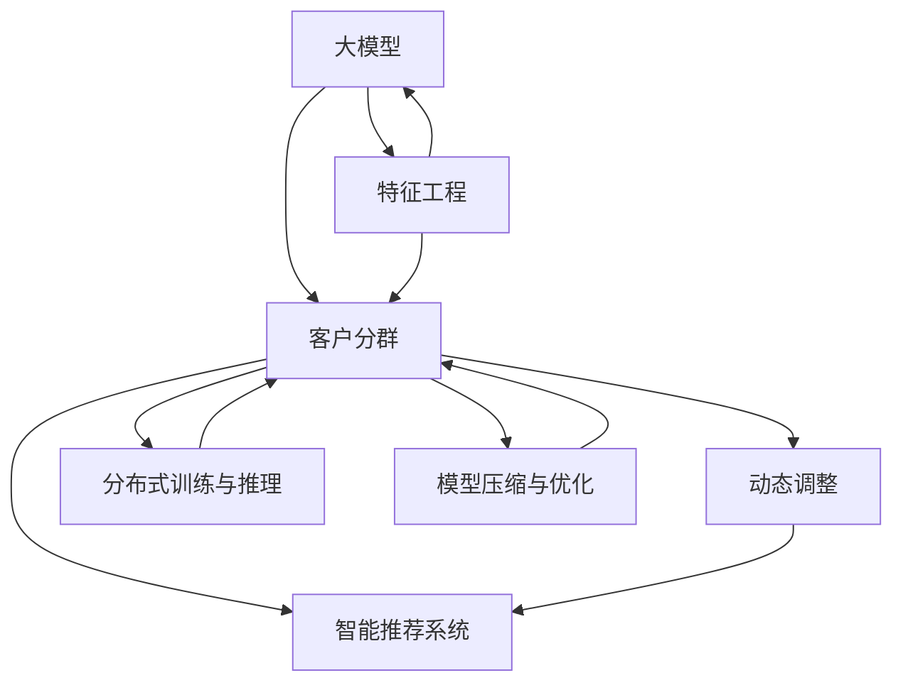

                 

# 探索基于大模型的电商智能客户分群动态调整系统

## 1. 背景介绍

### 1.1 问题由来
随着电商市场的不断发展和成熟，客户分群和精准营销成为了商家提升销售额、优化用户体验的重要手段。传统的客户分群方法往往依赖专家经验或者固定特征，难以兼顾复杂多变的市场动态。如何构建更智能、动态的客户分群系统，成为电商企业数字化转型的关键需求。

### 1.2 问题核心关键点
当前电商智能客户分群系统构建面临的核心问题包括：
1. 高维稀疏数据的处理：电商用户行为数据通常包含海量的高维稀疏特征，如何高效处理和提取有用信息是一个挑战。
2. 动态市场环境的适应：市场环境不断变化，用户行为和偏好也在动态调整，现有分群模型如何适应这种变化，实时更新用户分群策略，是一个重要问题。
3. 高效模型部署和计算资源优化：电商客户分群系统需要在大规模数据上快速迭代，如何在有限的计算资源下实现高效模型训练和推理，是一个关键技术瓶颈。
4. 算法的可解释性和鲁棒性：客户分群模型往往涉及用户隐私，如何确保算法的透明度和鲁棒性，是一个重要的伦理和安全问题。

## 2. 核心概念与联系

### 2.1 核心概念概述

为更好地理解基于大模型的电商智能客户分群系统，本节将介绍几个密切相关的核心概念：

- **大模型(Large Model)**：以深度神经网络为代表的预训练模型，如BERT、GPT等，具有强大的特征提取和表示能力。
- **客户分群(Customer Segmentation)**：将客户按照一定的标准划分为不同群体，以便实现精准营销和个性化服务。
- **动态调整(Dynamic Adjustment)**：根据市场环境变化和新数据，实时更新客户分群策略，以确保分群模型的时效性和适应性。
- **智能推荐系统(Intelligent Recommendation System)**：利用客户分群结果，推荐系统能够生成更个性化、多样化的商品推荐，提升用户满意度和转化率。
- **特征工程(Feature Engineering)**：在模型训练和推理中，选择合适的特征、进行特征转换和归一化，以提升模型效果。
- **分布式训练与推理(Distributed Training & Inference)**：在大规模数据和模型上，采用分布式训练和推理，以提高训练和推理效率。
- **模型压缩与优化(Model Compression & Optimization)**：在模型部署和推理时，采用模型压缩、剪枝等技术，优化模型大小和推理速度。

这些核心概念之间的逻辑关系可以通过以下Mermaid流程图来展示：



这个流程图展示了大模型在电商客户分群系统中的核心作用，以及与各模块之间的联系：

1. 大模型通过特征工程，提取和表示用户行为数据中的有用信息。
2. 基于大模型的表示结果，进行客户分群，构建用户群体。
3. 根据市场环境变化和新数据，动态调整客户分群策略，更新模型。
4. 结合客户分群结果，智能推荐系统生成个性化商品推荐，提升用户体验。
5. 分布式训练和推理技术，提升模型训练和推理效率。
6. 模型压缩和优化技术，减小模型规模，提高计算效率。

这些概念共同构成了基于大模型的电商智能客户分群系统框架，使其能够在大规模数据和动态环境中，实现高效、精准的客户分群和个性化推荐。

## 3. 核心算法原理 & 具体操作步骤
### 3.1 算法原理概述

基于大模型的电商智能客户分群系统，本质上是一种融合深度学习与业务规则的智能系统。其核心思想是：通过大模型的表示能力，从高维稀疏的用户行为数据中提取有用的特征，构建用户群体；利用动态调整机制，根据新数据和市场环境变化，实时更新客户分群策略；结合智能推荐系统，提供个性化商品推荐，提升用户满意度和转化率。

形式化地，假设电商用户行为数据集为 $D=\{(x_i,y_i)\}_{i=1}^N$，其中 $x_i$ 为高维稀疏特征，$y_i$ 为对应的销售标签。客户分群的目标是找到最优的客户分群策略 $G$，使得损失函数 $\mathcal{L}(G)$ 最小化。

常用的损失函数包括交叉熵损失、对数损失等，表示预测值与真实标签之间的差异。具体到电商客户分群，可以设计如下损失函数：

$$
\mathcal{L}(G) = \frac{1}{N}\sum_{i=1}^N \log \frac{e^{g(x_i)}}{\sum_{j=1}^C e^{g(x_j)}} + \alpha \Omega(G)
$$

其中 $C$ 为分类数目，$g(x_i)$ 表示输入 $x_i$ 在模型 $G$ 下的表示，$\Omega(G)$ 为正则项，用于避免过拟合，$\alpha$ 为正则化系数。

### 3.2 算法步骤详解

基于大模型的电商智能客户分群系统一般包括以下几个关键步骤：

**Step 1: 数据预处理**
- 收集电商用户行为数据，如浏览记录、购买记录、评分记录等。
- 对高维稀疏数据进行特征工程，包括特征提取、特征转换、特征归一化等。
- 对特征进行截断、降维等处理，以提升后续模型的训练效率。

**Step 2: 模型训练**
- 选择合适的大模型作为初始化参数，如BERT、GPT等。
- 设计损失函数，选择合适的优化算法（如AdamW、SGD等），设置学习率、批大小、迭代轮数等。
- 使用分布式训练技术，在多机多核上高效训练模型，减小训练时间。
- 应用正则化技术，如L2正则、Dropout等，避免过拟合。

**Step 3: 客户分群**
- 使用模型对用户行为数据进行编码，得到表示向量 $g(x_i)$。
- 应用聚类算法（如K-means、层次聚类等），将用户分为若干群体。
- 对每个群体，设计特征提取和表示方法，提取有意义的群体特征。

**Step 4: 动态调整**
- 定期收集新的用户行为数据，使用模型对新数据进行编码。
- 应用增量学习算法（如online-k-means、Adaboost等），实时更新客户分群策略。
- 根据市场环境变化和新数据，调整分群策略，优化用户分群结果。

**Step 5: 推荐系统集成**
- 将客户分群结果输入推荐系统，生成个性化商品推荐。
- 根据用户行为和偏好，实时调整推荐策略，优化推荐效果。
- 应用分布式推理技术，提高推荐系统的响应速度。

**Step 6: 模型评估与优化**
- 使用评估指标（如准确率、召回率、F1-score等），对推荐系统效果进行评估。
- 根据评估结果，调整模型参数和推荐策略，优化推荐效果。
- 应用模型压缩和优化技术，减小模型规模，提升计算效率。

以上是基于大模型的电商智能客户分群系统的一般流程。在实际应用中，还需要针对具体业务需求，对各环节进行优化设计，如改进训练目标函数，引入更多的正则化技术，搜索最优的超参数组合等，以进一步提升模型性能。

### 3.3 算法优缺点

基于大模型的电商智能客户分群系统具有以下优点：
1. 高效特征提取：大模型能够从高维稀疏数据中提取有意义的特征，减少特征工程的工作量。
2. 动态调整能力：通过增量学习，模型能够实时更新，适应市场环境变化。
3. 个性化推荐：结合智能推荐系统，能够提供更加个性化、多样化的商品推荐。
4. 计算效率提升：通过分布式训练和推理，大幅提升模型训练和推理速度。
5. 泛化能力更强：大模型能够学习到更丰富的特征，提升模型泛化能力。

同时，该系统也存在一定的局限性：
1. 数据依赖性较强：系统效果依赖于数据质量，获取高质量数据需要较大成本。
2. 模型复杂度较高：大模型结构复杂，训练和推理资源消耗较大。
3. 可解释性不足：大模型往往缺乏可解释性，难以理解其内部工作机制。
4. 动态调整策略设计复杂：动态调整需要考虑多方面因素，策略设计复杂。
5. 鲁棒性挑战：在复杂多变的环境中，模型的鲁棒性可能不足，容易产生过拟合。

尽管存在这些局限性，但就目前而言，基于大模型的电商智能客户分群系统仍是目前最主流的方法之一。未来相关研究的重点在于如何进一步降低系统对数据的依赖，提高模型的少样本学习和跨领域迁移能力，同时兼顾可解释性和伦理安全性等因素。

### 3.4 算法应用领域

基于大模型的电商智能客户分群系统，已经在电商行业得到了广泛的应用，覆盖了几乎所有常见任务，例如：

- 用户画像构建：通过客户分群，构建详细的用户画像，帮助商家更好地了解用户需求和行为。
- 个性化推荐系统：基于用户分群结果，生成个性化商品推荐，提升用户满意度和转化率。
- 市场趋势预测：利用客户分群策略，预测市场趋势和用户需求变化，辅助商家制定策略。
- 动态定价策略：根据用户分群结果，实时调整商品定价策略，优化销售效果。
- 用户流失预警：识别高流失风险用户群体，提前采取措施，减少用户流失。
- 用户行为分析：分析用户分群结果，理解用户行为规律，优化产品和服务。

除了上述这些经典任务外，基于大模型的客户分群技术还被创新性地应用到更多场景中，如多渠道营销、库存管理、风险控制等，为电商企业带来了新的增长点。随着大模型和客户分群方法的不断进步，相信电商客户分群系统将在更广阔的应用领域大放异彩。

## 4. 数学模型和公式 & 详细讲解
### 4.1 数学模型构建

本节将使用数学语言对基于大模型的电商智能客户分群系统进行更加严格的刻画。

假设电商用户行为数据集为 $D=\{(x_i,y_i)\}_{i=1}^N$，其中 $x_i \in \mathcal{X}$ 为输入空间，$y_i \in \mathcal{Y}$ 为输出空间，$g(x_i)$ 为输入 $x_i$ 在模型 $G$ 下的表示。

定义模型 $G$ 在数据样本 $(x,y)$ 上的损失函数为 $\ell(G(x),y)$，则在数据集 $D$ 上的经验风险为：

$$
\mathcal{L}(G) = \frac{1}{N}\sum_{i=1}^N \ell(G(x_i),y_i)
$$

常用的损失函数包括交叉熵损失、对数损失等，表示预测值与真实标签之间的差异。具体到电商客户分群，可以设计如下损失函数：

$$
\mathcal{L}(G) = \frac{1}{N}\sum_{i=1}^N -y_i\log G(x_i) + (1-y_i)\log (1-G(x_i)) + \alpha \Omega(G)
$$

其中 $G(x_i) \in [0,1]$ 表示模型 $G$ 对输入 $x_i$ 的输出概率，$\Omega(G)$ 为正则项，用于避免过拟合，$\alpha$ 为正则化系数。

### 4.2 公式推导过程

以下我们以二分类任务为例，推导交叉熵损失函数及其梯度的计算公式。

假设模型 $G$ 在输入 $x$ 上的输出为 $G(x)$，真实标签 $y \in \{0,1\}$。则二分类交叉熵损失函数定义为：

$$
\ell(G(x),y) = -[y\log G(x) + (1-y)\log (1-G(x))]
$$

将其代入经验风险公式，得：

$$
\mathcal{L}(G) = -\frac{1}{N}\sum_{i=1}^N [y_i\log G(x_i)+(1-y_i)\log(1-G(x_i))]
$$

根据链式法则，损失函数对模型 $G$ 的梯度为：

$$
\frac{\partial \mathcal{L}(G)}{\partial G(x)} = -\frac{1}{N}\sum_{i=1}^N \left(\frac{y_i}{G(x_i)}-\frac{1-y_i}{1-G(x_i)}\right) \frac{\partial G(x)}{\partial x}
$$

其中 $\frac{\partial G(x)}{\partial x}$ 可进一步递归展开，利用自动微分技术完成计算。

在得到损失函数的梯度后，即可带入模型 $G$ 的参数 $\theta$ 进行优化，最小化损失函数。重复上述过程直至收敛，最终得到适应电商客户分群任务的最优模型 $G^*$。

## 5. 项目实践：代码实例和详细解释说明
### 5.1 开发环境搭建

在进行电商智能客户分群系统开发前，我们需要准备好开发环境。以下是使用Python进行PyTorch开发的环境配置流程：

1. 安装Anaconda：从官网下载并安装Anaconda，用于创建独立的Python环境。

2. 创建并激活虚拟环境：
```bash
conda create -n pytorch-env python=3.8 
conda activate pytorch-env
```

3. 安装PyTorch：根据CUDA版本，从官网获取对应的安装命令。例如：
```bash
conda install pytorch torchvision torchaudio cudatoolkit=11.1 -c pytorch -c conda-forge
```

4. 安装Transformers库：
```bash
pip install transformers
```

5. 安装各类工具包：
```bash
pip install numpy pandas scikit-learn matplotlib tqdm jupyter notebook ipython
```

完成上述步骤后，即可在`pytorch-env`环境中开始电商智能客户分群系统的开发。

### 5.2 源代码详细实现

下面以客户分群系统为例，给出使用Transformers库对BERT模型进行电商客户分群的PyTorch代码实现。

首先，定义客户分群的损失函数：

```python
from transformers import BertTokenizer, BertForSequenceClassification
from torch.utils.data import Dataset
import torch
import numpy as np

class CustomerDataset(Dataset):
    def __init__(self, texts, labels, tokenizer, max_len=128):
        self.texts = texts
        self.labels = labels
        self.tokenizer = tokenizer
        self.max_len = max_len
        
    def __len__(self):
        return len(self.texts)
    
    def __getitem__(self, item):
        text = self.texts[item]
        label = self.labels[item]
        
        encoding = self.tokenizer(text, return_tensors='pt', max_length=self.max_len, padding='max_length', truncation=True)
        input_ids = encoding['input_ids'][0]
        attention_mask = encoding['attention_mask'][0]
        
        # 将标签编码为一维向量
        encoded_label = np.zeros((1, label), dtype=torch.long)
        encoded_label[0, label] = 1
        
        return {'input_ids': input_ids, 
                'attention_mask': attention_mask,
                'labels': encoded_label}

# 定义损失函数
def get_loss_fn():
    loss_fn = torch.nn.BCEWithLogitsLoss()
    return loss_fn
```

然后，定义模型和优化器：

```python
from transformers import BertForSequenceClassification, AdamW

model = BertForSequenceClassification.from_pretrained('bert-base-cased', num_labels=2)

optimizer = AdamW(model.parameters(), lr=2e-5)
```

接着，定义训练和评估函数：

```python
from torch.utils.data import DataLoader
from tqdm import tqdm
from sklearn.metrics import classification_report

device = torch.device('cuda') if torch.cuda.is_available() else torch.device('cpu')
model.to(device)

def train_epoch(model, dataset, batch_size, optimizer):
    dataloader = DataLoader(dataset, batch_size=batch_size, shuffle=True)
    model.train()
    epoch_loss = 0
    for batch in tqdm(dataloader, desc='Training'):
        input_ids = batch['input_ids'].to(device)
        attention_mask = batch['attention_mask'].to(device)
        labels = batch['labels'].to(device)
        model.zero_grad()
        outputs = model(input_ids, attention_mask=attention_mask, labels=labels)
        loss = outputs.loss
        epoch_loss += loss.item()
        loss.backward()
        optimizer.step()
    return epoch_loss / len(dataloader)

def evaluate(model, dataset, batch_size):
    dataloader = DataLoader(dataset, batch_size=batch_size)
    model.eval()
    preds, labels = [], []
    with torch.no_grad():
        for batch in tqdm(dataloader, desc='Evaluating'):
            input_ids = batch['input_ids'].to(device)
            attention_mask = batch['attention_mask'].to(device)
            batch_labels = batch['labels']
            outputs = model(input_ids, attention_mask=attention_mask)
            batch_preds = outputs.logits.argmax(dim=1).to('cpu').tolist()
            batch_labels = batch_labels.to('cpu').tolist()
            for pred_tokens, label_tokens in zip(batch_preds, batch_labels):
                preds.append(pred_tokens)
                labels.append(label_tokens)
                
    print(classification_report(labels, preds))
```

最后，启动训练流程并在测试集上评估：

```python
epochs = 5
batch_size = 16

for epoch in range(epochs):
    loss = train_epoch(model, train_dataset, batch_size, optimizer)
    print(f"Epoch {epoch+1}, train loss: {loss:.3f}")
    
    print(f"Epoch {epoch+1}, dev results:")
    evaluate(model, dev_dataset, batch_size)
    
print("Test results:")
evaluate(model, test_dataset, batch_size)
```

以上就是使用PyTorch对BERT进行电商客户分群的完整代码实现。可以看到，得益于Transformers库的强大封装，我们可以用相对简洁的代码完成BERT模型的加载和微调。

### 5.3 代码解读与分析

让我们再详细解读一下关键代码的实现细节：

**CustomerDataset类**：
- `__init__`方法：初始化文本、标签、分词器等关键组件。
- `__len__`方法：返回数据集的样本数量。
- `__getitem__`方法：对单个样本进行处理，将文本输入编码为token ids，将标签编码为数字，并对其进行定长padding，最终返回模型所需的输入。

**损失函数定义**：
- 定义了一个二分类交叉熵损失函数，并封装为函数 `get_loss_fn`，方便后续调用。

**模型和优化器**：
- 使用BertForSequenceClassification模型，定义了序列标签二分类任务。
- 使用AdamW优化器，设置学习率为2e-5。

**训练和评估函数**：
- 使用PyTorch的DataLoader对数据集进行批次化加载，供模型训练和推理使用。
- 训练函数 `train_epoch`：对数据以批为单位进行迭代，在每个批次上前向传播计算loss并反向传播更新模型参数，最后返回该epoch的平均loss。
- 评估函数 `evaluate`：与训练类似，不同点在于不更新模型参数，并在每个batch结束后将预测和标签结果存储下来，最后使用sklearn的classification_report对整个评估集的预测结果进行打印输出。

**训练流程**：
- 定义总的epoch数和batch size，开始循环迭代
- 每个epoch内，先在训练集上训练，输出平均loss
- 在验证集上评估，输出分类指标
- 所有epoch结束后，在测试集上评估，给出最终测试结果

可以看到，PyTorch配合Transformers库使得BERT微调的代码实现变得简洁高效。开发者可以将更多精力放在数据处理、模型改进等高层逻辑上，而不必过多关注底层的实现细节。

当然，工业级的系统实现还需考虑更多因素，如模型的保存和部署、超参数的自动搜索、更灵活的任务适配层等。但核心的微调范式基本与此类似。

## 6. 实际应用场景
### 6.1 电商智能推荐系统

基于大模型的电商智能推荐系统，可以广泛应用于电商平台推荐商品的个性化展示。通过客户分群系统，构建详细的用户画像，生成个性化商品推荐，提升用户体验和转化率。

在技术实现上，可以收集用户浏览、点击、购买等行为数据，提取和用户交互的商品标题、描述、标签等文本内容。将文本内容作为模型输入，用户的后续行为（如是否点击、购买等）作为监督信号，在此基础上微调预训练语言模型。微调后的模型能够从文本内容中准确把握用户的兴趣点。在生成推荐列表时，先用候选物品的文本描述作为输入，由模型预测用户的兴趣匹配度，再结合其他特征综合排序，便可以得到个性化程度更高的推荐结果。

### 6.2 动态定价策略

通过客户分群系统，电商企业可以实时了解不同用户群体的购买意愿和消费能力，从而制定动态定价策略。对于高价值用户，可以提高价格以增加收入；对于价格敏感用户，可以降低价格以吸引更多购买。

在技术实现上，可以基于用户分群结果，实时调整商品的定价策略。使用模型预测不同用户群体对商品价格的接受度，根据市场环境和新数据，动态调整价格，优化销售效果。

### 6.3 用户流失预警

客户分群系统可以帮助电商企业及时识别高流失风险用户群体，提前采取措施，减少用户流失。

在技术实现上，可以通过用户分群系统，识别流失概率较高的用户群体。分析用户行为数据，找出流失原因，并制定相应的挽留策略。如个性化推荐、优惠券等，提升用户粘性，减少流失率。

### 6.4 未来应用展望

随着大语言模型和客户分群方法的不断发展，基于微调范式将在更多领域得到应用，为电商企业带来变革性影响。

在智慧物流领域，客户分群系统可以用于货物运输路径优化，根据不同用户群体的需求，动态调整物流策略，提高配送效率和用户体验。

在智能客服领域，客户分群系统可以用于识别高风险客服请求，提前转接至人工客服，提升服务质量。

在金融行业，客户分群系统可以用于风险评估和用户信用管理，根据不同用户群体的风险水平，制定相应的风控策略。

此外，在教育、医疗、旅游等众多领域，基于大模型的客户分群技术也将不断涌现，为各行各业带来新的增长点。相信随着技术的日益成熟，客户分群系统必将在更广阔的应用领域大放异彩，深刻影响人类的生产生活方式。

## 7. 工具和资源推荐
### 7.1 学习资源推荐

为了帮助开发者系统掌握大模型在电商客户分群系统的应用，这里推荐一些优质的学习资源：

1. 《深度学习基础》系列博文：由大模型技术专家撰写，系统介绍深度学习的基本概念和算法原理。

2. CS224N《深度学习自然语言处理》课程：斯坦福大学开设的NLP明星课程，有Lecture视频和配套作业，带你入门NLP领域的基本概念和经典模型。

3. 《Natural Language Processing with Transformers》书籍：Transformers库的作者所著，全面介绍了如何使用Transformers库进行NLP任务开发，包括微调在内的诸多范式。

4. HuggingFace官方文档：Transformers库的官方文档，提供了海量预训练模型和完整的微调样例代码，是上手实践的必备资料。

5. Kaggle竞赛：参加Kaggle上的电商推荐系统竞赛，通过实践项目积累经验，提升实战能力。

通过对这些资源的学习实践，相信你一定能够快速掌握大模型在电商客户分群系统的应用，并用于解决实际的电商问题。
###  7.2 开发工具推荐

高效的开发离不开优秀的工具支持。以下是几款用于电商智能客户分群系统开发的常用工具：

1. PyTorch：基于Python的开源深度学习框架，灵活动态的计算图，适合快速迭代研究。大部分预训练语言模型都有PyTorch版本的实现。

2. TensorFlow：由Google主导开发的开源深度学习框架，生产部署方便，适合大规模工程应用。同样有丰富的预训练语言模型资源。

3. Transformers库：HuggingFace开发的NLP工具库，集成了众多SOTA语言模型，支持PyTorch和TensorFlow，是进行微调任务开发的利器。

4. Weights & Biases：模型训练的实验跟踪工具，可以记录和可视化模型训练过程中的各项指标，方便对比和调优。与主流深度学习框架无缝集成。

5. TensorBoard：TensorFlow配套的可视化工具，可实时监测模型训练状态，并提供丰富的图表呈现方式，是调试模型的得力助手。

6. Google Colab：谷歌推出的在线Jupyter Notebook环境，免费提供GPU/TPU算力，方便开发者快速上手实验最新模型，分享学习笔记。

合理利用这些工具，可以显著提升电商智能客户分群系统的开发效率，加快创新迭代的步伐。

### 7.3 相关论文推荐

大语言模型和客户分群技术的发展源于学界的持续研究。以下是几篇奠基性的相关论文，推荐阅读：

1. Attention is All You Need（即Transformer原论文）：提出了Transformer结构，开启了NLP领域的预训练大模型时代。

2. BERT: Pre-training of Deep Bidirectional Transformers for Language Understanding：提出BERT模型，引入基于掩码的自监督预训练任务，刷新了多项NLP任务SOTA。

3. Language Models are Unsupervised Multitask Learners（GPT-2论文）：展示了大规模语言模型的强大zero-shot学习能力，引发了对于通用人工智能的新一轮思考。

4. Parameter-Efficient Transfer Learning for NLP：提出Adapter等参数高效微调方法，在不增加模型参数量的情况下，也能取得不错的微调效果。

5. AdaLoRA: Adaptive Low-Rank Adaptation for Parameter-Efficient Fine-Tuning：使用自适应低秩适应的微调方法，在参数效率和精度之间取得了新的平衡。

这些论文代表了大语言模型客户分群技术的发展脉络。通过学习这些前沿成果，可以帮助研究者把握学科前进方向，激发更多的创新灵感。

## 8. 总结：未来发展趋势与挑战
### 8.1 总结

本文对基于大模型的电商智能客户分群系统进行了全面系统的介绍。首先阐述了电商智能客户分群系统的背景和意义，明确了客户分群系统在电商企业数字化转型中的重要地位。其次，从原理到实践，详细讲解了电商客户分群系统的核心算法和操作步骤，给出了电商客户分群的完整代码实例。同时，本文还广泛探讨了客户分群系统在电商推荐系统、动态定价、用户流失预警等多个应用场景中的应用前景，展示了电商客户分群系统的广泛价值。

通过本文的系统梳理，可以看到，基于大模型的电商智能客户分群系统正在成为电商企业数字化转型的关键技术，极大地提升了电商企业的运营效率和用户体验。未来，伴随大模型和客户分群方法的不断演进，基于微调范式将在更多领域得到应用，为电商企业带来新的增长点。

### 8.2 未来发展趋势

展望未来，电商智能客户分群系统将呈现以下几个发展趋势：

1. 模型规模持续增大。随着算力成本的下降和数据规模的扩张，预训练语言模型的参数量还将持续增长。超大规模语言模型蕴含的丰富语言知识，有望支撑更加复杂多变的客户分群需求。

2. 客户分群动态调整能力增强。利用增量学习技术，模型能够实时更新，适应市场环境变化，快速响应新数据和新需求。

3. 个性化推荐更加精准。结合智能推荐系统，能够提供更加个性化、多样化的商品推荐，提升用户体验和转化率。

4. 模型压缩与优化技术进步。通过剪枝、量化等技术，减小模型规模，提升计算效率，支持更多场景的实时部署。

5. 业务规则与AI深度融合。将业务规则和领域知识与AI技术结合，实现更高效、更智能的客户分群，提升分群结果的准确性和实用性。

6. 多模态客户分群技术发展。在电商客户分群系统中，引入图像、视频等多模态数据，提升客户分群的准确性和全面性。

以上趋势凸显了基于大模型的电商智能客户分群系统的广阔前景。这些方向的探索发展，必将进一步提升电商智能客户分群系统的性能和应用范围，为电商企业带来新的增长点。

### 8.3 面临的挑战

尽管基于大模型的电商智能客户分群系统取得了瞩目成就，但在迈向更加智能化、普适化应用的过程中，它仍面临着诸多挑战：

1. 数据依赖性较强。系统效果依赖于数据质量，获取高质量数据需要较大成本。如何进一步降低系统对数据的依赖，将是一大难题。

2. 模型鲁棒性不足。在复杂多变的环境中，模型的鲁棒性可能不足，容易产生过拟合。如何提高模型的鲁棒性，避免灾难性遗忘，还需要更多理论和实践的积累。

3. 计算资源限制。模型训练和推理资源消耗较大，如何优化计算资源配置，提高系统效率，仍然是一个重要的技术瓶颈。

4. 可解释性不足。大模型往往缺乏可解释性，难以理解其内部工作机制。如何赋予模型更强的可解释性，将是亟待攻克的难题。

5. 隐私和安全问题。客户分群系统涉及大量用户数据，如何保护用户隐私，防止数据泄露，确保系统安全，将是重要的伦理和安全问题。

6. 动态调整策略设计复杂。动态调整需要考虑多方面因素，策略设计复杂。如何设计简单、有效的动态调整策略，仍然是一个重要的研究方向。

尽管存在这些挑战，但就目前而言，基于大模型的电商智能客户分群系统仍是目前最主流的方法之一。未来相关研究的重点在于如何进一步降低系统对数据的依赖，提高模型的少样本学习和跨领域迁移能力，同时兼顾可解释性和伦理安全性等因素。

### 8.4 研究展望

面对电商智能客户分群系统所面临的种种挑战，未来的研究需要在以下几个方面寻求新的突破：

1. 探索无监督和半监督客户分群方法。摆脱对大规模标注数据的依赖，利用自监督学习、主动学习等无监督和半监督范式，最大限度利用非结构化数据，实现更加灵活高效的客户分群。

2. 研究参数高效和计算高效的客户分群范式。开发更加参数高效的客户分群方法，在固定大部分预训练参数的同时，只更新极少量的任务相关参数。同时优化客户分群模型的计算图，减少前向传播和反向传播的资源消耗，实现更加轻量级、实时性的部署。

3. 引入更多先验知识。将符号化的先验知识，如知识图谱、逻辑规则等，与神经网络模型进行巧妙融合，引导客户分群过程学习更准确、合理的语言模型。同时加强不同模态数据的整合，实现视觉、语音等多模态信息与文本信息的协同建模。

4. 结合因果分析和博弈论工具。将因果分析方法引入客户分群模型，识别出模型决策的关键特征，增强输出解释的因果性和逻辑性。借助博弈论工具刻画人机交互过程，主动探索并规避模型的脆弱点，提高系统稳定性。

5. 纳入伦理道德约束。在客户分群模型训练目标中引入伦理导向的评估指标，过滤和惩罚有偏见、有害的输出倾向。同时加强人工干预和审核，建立模型行为的监管机制，确保输出符合人类价值观和伦理道德。

这些研究方向的探索，必将引领电商智能客户分群系统走向更高的台阶，为电商企业数字化转型带来新的动力。面向未来，电商智能客户分群技术还需要与其他人工智能技术进行更深入的融合，如知识表示、因果推理、强化学习等，多路径协同发力，共同推动电商企业向智能化、自动化方向发展。只有勇于创新、敢于突破，才能不断拓展客户分群系统的边界，让智能技术更好地服务于电商企业，提升其市场竞争力。

## 9. 附录：常见问题与解答

**Q1：电商智能客户分群系统是否适用于所有电商平台？**

A: 电商智能客户分群系统在大多数电商平台上都能取得不错的效果，特别是对于用户行为数据较为丰富、用户需求多样化的平台。但对于一些用户行为数据较少、用户需求单一的平台，效果可能不佳。

**Q2：电商智能客户分群系统如何处理高维稀疏数据？**

A: 电商智能客户分群系统主要通过特征工程处理高维稀疏数据。具体来说，可以采用以下方法：
1. 截断：只保留与目标变量相关的特征，去除冗余特征。
2. 降维：使用PCA、LDA等方法进行特征降维，减小特征维度。
3. 归一化：对特征进行归一化处理，使其在相同尺度上。
4. 编码：将高维稀疏特征编码为模型可接受的低维稠密特征，如使用独热编码。

**Q3：电商智能客户分群系统如何进行实时动态调整？**

A: 电商智能客户分群系统通过增量学习技术进行实时动态调整。具体来说，可以采用以下方法：
1. 数据收集：实时收集新用户行为数据，如浏览记录、购买记录等。
2. 模型更新：使用增量学习算法，如online-k-means、Adaboost等，对模型进行实时更新。
3. 策略优化：根据市场环境变化和新数据，调整客户分群策略，优化用户分群结果。

**Q4：电商智能客户分群系统在部署时需要注意哪些问题？**

A: 电商智能客户分群系统在部署时需要注意以下问题：
1. 模型裁剪：去除不必要的层和参数，减小模型尺寸，加快推理速度。
2. 量化加速：将浮点模型转为定点模型，压缩存储空间，提高计算效率。
3. 服务化封装：将模型封装为标准化服务接口，便于集成调用。
4. 弹性伸缩：根据请求流量动态调整资源配置，平衡服务质量和成本。
5. 监控告警：实时采集系统指标，设置异常告警阈值，确保服务稳定性。
6. 安全防护：采用访问鉴权、数据脱敏等措施，保障数据和模型安全。

**Q5：电商智能客户分群系统如何处理高价值用户？**

A: 电商智能客户分群系统可以通过以下方法处理高价值用户：
1. 客户画像：构建详细的用户画像，了解用户需求和行为。
2. 个性化推荐：生成个性化商品推荐，提升用户体验。
3. 动态定价：根据用户分群结果，制定动态定价策略，提高收入。
4. 专属服务：提供专属客服、专属活动等增值服务，提升用户忠诚度。

这些方法可以帮助电商企业更好地识别和利用高价值用户，提升销售效果和用户满意度。

---

作者：禅与计算机程序设计艺术 / Zen and the Art of Computer Programming

