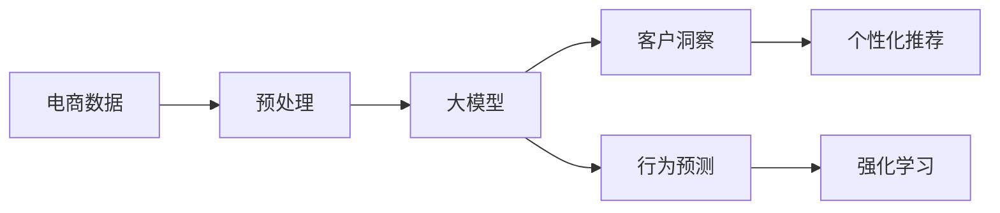

                 

# 探索基于大模型的电商智能客户洞察与行为预测系统

> 关键词：大模型, 客户洞察, 电商, 行为预测, 自然语言处理(NLP), 深度学习, 强化学习, 个性化推荐

## 1. 背景介绍

### 1.1 问题由来
电商行业已进入存量时代，同质化竞争加剧，消费者需求和行为愈发多样化和复杂化。商家如何精准洞察客户，预测其行为，从而实现个性化推荐、定制化营销和提升客户满意度，成为电商发展的核心问题。

传统电商客户洞察主要依赖于基于规则和历史数据的统计方法，如用户标签系统、行为路径分析、CRM数据挖掘等。但这些方法存在数据量少、更新慢、业务理解不足等缺点，难以在实时和多维度场景下提供精准的客户洞察。

近年来，大模型在电商客户洞察和行为预测领域的应用，已展现出卓越的表现。基于深度学习和自然语言处理(NLP)的大模型，能够从海量的电商数据中提取复杂的用户行为特征，结合强化学习等方法，实现高效的行为预测和个性化推荐。

本文将系统介绍基于大模型的电商智能客户洞察与行为预测系统的构建方法，包括模型的设计、训练、评估和应用流程。

## 2. 核心概念与联系

### 2.1 核心概念概述

为更好地理解本文所述的系统构建方法，本节将介绍几个关键概念：

- **大模型(Large Model)**：指参数量巨大、结构复杂的深度学习模型，如BERT、GPT-3等，通过大规模数据训练，具备强大的特征提取和模式学习能力。
- **客户洞察**：指对客户需求、行为、情感等维度的全面理解和分析，支持电商的精准营销和个性化服务。
- **行为预测**：指基于客户的历史数据，预测其未来行为，如购买意向、点击率、复购率等，支持动态推荐和促销策略。
- **自然语言处理(NLP)**：指使用计算技术，实现自然语言理解和生成，是大模型在电商客户洞察和行为预测中的重要应用。
- **强化学习(Reinforcement Learning, RL)**：指通过与环境的交互，逐步学习最优策略，以最大化预期奖励，广泛应用于推荐系统、广告优化等领域。
- **个性化推荐**：指根据客户的历史行为和偏好，提供定制化的商品和服务，提升用户体验和业务价值。

这些概念共同构成了电商智能客户洞察与行为预测系统的基础架构，通过深度学习与自然语言处理技术的结合，可以实现高效、精准的客户洞察和行为预测，进一步推动电商业务的创新发展。

### 2.2 核心概念原理和架构的 Mermaid 流程图(Mermaid 流程节点中不要有括号、逗号等特殊字符)



这个流程图展示了电商智能客户洞察与行为预测系统的核心流程：

1. **电商数据**：收集电商网站的用户行为数据，包括浏览、点击、购买、评价等行为数据。
2. **预处理**：对数据进行清洗、归一化、特征提取等处理，形成输入大模型的标准格式。
3. **大模型**：使用预训练的NLP大模型对客户数据进行处理，提取语义特征。
4. **客户洞察**：基于大模型提取的特征，分析客户的兴趣、偏好、情感等信息，构建客户画像。
5. **行为预测**：利用强化学习等算法，对客户的行为进行预测，如购买意向、点击率等。
6. **个性化推荐**：根据行为预测结果，生成个性化的商品推荐列表，提升用户体验。

## 3. 核心算法原理 & 具体操作步骤

### 3.1 算法原理概述

基于大模型的电商智能客户洞察与行为预测系统，本质上是一个包含自然语言处理、深度学习和强化学习的多模态模型，旨在通过学习客户的历史行为数据，预测其未来的行为和需求。该系统的工作原理可以分为以下几个关键步骤：

1. **数据预处理**：对电商数据进行清洗、归一化、特征提取等处理，为模型输入准备数据。
2. **大模型特征提取**：使用预训练的自然语言处理模型，如BERT、GPT-3等，提取客户文本数据的语义特征。
3. **客户洞察构建**：基于大模型提取的语义特征，构建客户的兴趣、偏好、情感等信息。
4. **行为预测建模**：利用强化学习算法，建立客户行为预测模型，如购买意向、点击率等。
5. **个性化推荐生成**：根据客户的行为预测结果，生成个性化的商品推荐列表。

### 3.2 算法步骤详解

以下是基于大模型的电商智能客户洞察与行为预测系统的详细操作步骤：

#### 3.2.1 数据预处理

1. **数据收集**：
   - 收集电商网站的用户行为数据，包括浏览、点击、购买、评价等行为数据。
   - 确保数据的完整性和时效性，避免缺失和过时数据的影响。

2. **数据清洗**：
   - 去除重复数据和异常值，保证数据的一致性和准确性。
   - 处理缺失值和异常值，确保数据完整性。

3. **特征提取**：
   - 对用户行为数据进行特征提取，如行为序列、兴趣标签、评价内容等。
   - 使用统计方法、文本处理技术等手段，提取有意义的特征。

#### 3.2.2 大模型特征提取

1. **选择大模型**：
   - 选择合适的预训练自然语言处理模型，如BERT、GPT-3等。
   - 确保大模型的语义表示能力强，能够提取复杂的客户语义特征。

2. **模型加载和微调**：
   - 加载预训练的大模型，使用电商数据对其进行微调，优化模型参数。
   - 使用自定义的微调目标，优化模型在电商场景下的语义表示能力。

3. **特征提取**：
   - 将客户文本数据输入大模型，提取其语义特征。
   - 使用大模型的输出作为客户洞察和行为预测的输入特征。

#### 3.2.3 客户洞察构建

1. **兴趣提取**：
   - 基于大模型提取的语义特征，识别客户的兴趣点和偏好。
   - 使用聚类、分类等技术，对客户进行分类，形成客户兴趣标签。

2. **情感分析**：
   - 利用NLP技术，分析客户文本数据中的情感倾向，如积极、消极、中性等。
   - 使用情感词典、情感分类器等工具，对客户情感进行标注。

3. **行为模式识别**：
   - 分析客户的购买行为、浏览路径、评价内容等，识别行为模式。
   - 使用行为序列分析、关联规则挖掘等技术，构建客户行为序列和模式。

#### 3.2.4 行为预测建模

1. **选择预测任务**：
   - 确定电商客户行为预测的目标，如购买意向、点击率、复购率等。
   - 根据业务需求，选择相应的预测任务。

2. **选择预测模型**：
   - 选择适合的预测模型，如线性回归、决策树、随机森林等。
   - 根据数据特点和业务需求，选择最合适的模型。

3. **模型训练**：
   - 使用电商客户数据，训练预测模型，优化模型参数。
   - 使用交叉验证等方法，评估模型的性能和泛化能力。

4. **行为预测**：
   - 将客户数据输入预测模型，预测其行为。
   - 输出预测结果，作为个性化推荐的依据。

#### 3.2.5 个性化推荐生成

1. **推荐算法选择**：
   - 根据电商客户行为特点，选择适合的推荐算法。
   - 常用的推荐算法包括协同过滤、基于内容的推荐、混合推荐等。

2. **个性化推荐生成**：
   - 根据行为预测结果，生成个性化的商品推荐列表。
   - 考虑客户的兴趣、偏好、行为模式等因素，生成推荐的商品。

3. **推荐策略优化**：
   - 使用A/B测试等方法，评估推荐策略的效果。
   - 根据测试结果，优化推荐算法和推荐策略。

### 3.3 算法优缺点

基于大模型的电商智能客户洞察与行为预测系统，具有以下优点：

1. **精度高**：利用大模型的语义表示能力，可以高效地从电商数据中提取复杂特征，提高预测和推荐的精度。
2. **自适应能力强**：大模型能够适应电商数据的多样性和复杂性，自动学习最优的特征表示方式。
3. **动态更新**：大模型可以根据新的电商数据进行持续学习，更新客户洞察和行为预测模型，保持模型的时效性。
4. **可扩展性好**：系统架构灵活，能够根据不同的电商业务需求进行扩展和优化。

同时，该系统也存在以下局限性：

1. **数据质量依赖高**：大模型的表现高度依赖电商数据的质量和多样性，低质量数据可能导致预测和推荐结果不准确。
2. **计算资源需求大**：大模型的训练和推理需要大量的计算资源，需要较高的硬件投入。
3. **模型复杂度高**：大模型的参数量和计算复杂度较高，系统实现和维护难度大。
4. **隐私和安全问题**：电商客户数据的隐私和安全问题需要严格保护，模型需要遵守相关的隐私法规和标准。

### 3.4 算法应用领域

基于大模型的电商智能客户洞察与行为预测系统，已经在多个电商业务场景中得到了广泛应用，例如：

1. **个性化推荐系统**：根据客户的浏览和购买历史，生成个性化的商品推荐列表。
2. **客户细分与画像**：基于客户的兴趣和行为数据，构建客户画像，支持精准营销。
3. **商品搜索优化**：分析客户的搜索行为，优化搜索算法，提升搜索效果。
4. **广告定向投放**：根据客户的行为和兴趣，优化广告投放策略，提升广告效果。
5. **库存管理**：预测客户的购买行为，优化库存管理和补货策略。

除了上述这些典型应用场景外，大模型在电商客户洞察与行为预测系统的应用还在不断拓展，如智能客服、客户流失预测、供应链优化等，为电商业务带来了全新的突破。

## 4. 数学模型和公式 & 详细讲解

### 4.1 数学模型构建

本节将使用数学语言对电商智能客户洞察与行为预测系统的核心模型进行严格的刻画。

记电商客户数据集为 $D=\{(x_i,y_i)\}_{i=1}^N$，其中 $x_i$ 表示客户的行为数据，$y_i$ 表示客户的标签，如购买意向、点击率等。

假设大模型为 $M_{\theta}$，其中 $\theta$ 为模型参数。大模型在输入 $x$ 上的语义表示为 $h(x)$，即 $h(x)=M_{\theta}(x)$。

定义行为预测模型的损失函数为 $\ell(y,\hat{y})$，其中 $\hat{y}$ 为模型预测的标签，即 $\hat{y}=f(h(x),\phi)$，其中 $f$ 为预测模型，$\phi$ 为模型参数。

### 4.2 公式推导过程

以下我们以购买意向预测为例，推导基于大模型的电商行为预测模型的损失函数及其梯度计算公式。

假设购买意向为二分类任务，则购买意向的损失函数定义为交叉熵损失函数：

$$
\ell(y,\hat{y}) = -y\log \hat{y} - (1-y)\log(1-\hat{y})
$$

其中 $y$ 为真实的购买意向标签，$\hat{y}$ 为模型预测的购买意向概率。

将 $\ell(y,\hat{y})$ 代入经验风险公式，得：

$$
\mathcal{L}(\theta) = -\frac{1}{N}\sum_{i=1}^N \ell(y_i,\hat{y}_i)
$$

其中 $\mathcal{L}$ 为经验风险。

根据链式法则，损失函数对模型参数 $\theta$ 的梯度为：

$$
\frac{\partial \mathcal{L}(\theta)}{\partial \theta} = -\frac{1}{N}\sum_{i=1}^N \frac{\partial \ell(y_i,\hat{y}_i)}{\partial \theta}
$$

其中 $\frac{\partial \ell(y_i,\hat{y}_i)}{\partial \theta}$ 为交叉熵损失对模型参数 $\theta$ 的梯度。

通过反向传播算法，可以得到交叉熵损失对大模型参数的梯度，进一步更新大模型参数 $\theta$。

### 4.3 案例分析与讲解

以电商客户行为预测为例，展示如何利用大模型构建客户购买意向预测模型。

1. **数据预处理**：
   - 收集客户行为数据，进行清洗、归一化、特征提取等处理。
   - 将处理后的数据划分为训练集、验证集和测试集。

2. **大模型特征提取**：
   - 使用预训练的自然语言处理模型BERT，加载电商客户文本数据，提取语义特征。
   - 使用自定义的微调目标，优化模型在电商场景下的语义表示能力。

3. **客户洞察构建**：
   - 基于大模型提取的语义特征，构建客户的兴趣标签。
   - 利用情感分析工具，分析客户文本数据中的情感倾向。

4. **行为预测建模**：
   - 使用决策树算法，建立客户购买意向预测模型。
   - 使用交叉验证方法，评估模型的性能和泛化能力。

5. **个性化推荐生成**：
   - 根据客户购买意向预测结果，生成个性化的商品推荐列表。
   - 考虑客户的兴趣和行为模式，生成推荐的商品。

## 5. 项目实践：代码实例和详细解释说明

### 5.1 开发环境搭建

在进行电商智能客户洞察与行为预测系统开发前，我们需要准备好开发环境。以下是使用Python进行PyTorch开发的环境配置流程：

1. 安装Anaconda：从官网下载并安装Anaconda，用于创建独立的Python环境。

2. 创建并激活虚拟环境：
```bash
conda create -n ecommerce-env python=3.8 
conda activate ecommerce-env
```

3. 安装PyTorch：根据CUDA版本，从官网获取对应的安装命令。例如：
```bash
conda install pytorch torchvision torchaudio cudatoolkit=11.1 -c pytorch -c conda-forge
```

4. 安装TensorFlow：
```bash
conda install tensorflow
```

5. 安装TensorBoard：
```bash
pip install tensorboard
```

6. 安装各类工具包：
```bash
pip install numpy pandas scikit-learn matplotlib tqdm jupyter notebook ipython
```

完成上述步骤后，即可在`ecommerce-env`环境中开始电商智能客户洞察与行为预测系统的开发。

### 5.2 源代码详细实现

下面是使用PyTorch对电商客户行为预测系统进行开发的完整代码实现。

```python
import torch
import torch.nn as nn
import torch.optim as optim
from torch.utils.data import DataLoader, Dataset
from sklearn.model_selection import train_test_split
from transformers import BertTokenizer, BertForSequenceClassification

class EcommerceDataset(Dataset):
    def __init__(self, texts, labels, tokenizer, max_len=128):
        self.texts = texts
        self.labels = labels
        self.tokenizer = tokenizer
        self.max_len = max_len
        
    def __len__(self):
        return len(self.texts)
    
    def __getitem__(self, item):
        text = self.texts[item]
        label = self.labels[item]
        
        encoding = self.tokenizer(text, return_tensors='pt', max_length=self.max_len, padding='max_length', truncation=True)
        input_ids = encoding['input_ids'][0]
        attention_mask = encoding['attention_mask'][0]
        
        # 对标签进行编码
        encoded_label = label2id[label] if label in label2id else label2id['O']
        
        return {'input_ids': input_ids, 
                'attention_mask': attention_mask,
                'labels': encoded_label}

# 标签与id的映射
label2id = {'O': 0, 'B': 1, 'I': 2}

# 创建dataset
tokenizer = BertTokenizer.from_pretrained('bert-base-cased')
train_dataset, test_dataset = train_test_split(train_data, test_size=0.2, random_state=42)

# 定义模型
model = BertForSequenceClassification.from_pretrained('bert-base-cased', num_labels=len(label2id))

# 定义优化器
optimizer = optim.AdamW(model.parameters(), lr=2e-5)

# 训练函数
def train_epoch(model, dataset, batch_size, optimizer):
    dataloader = DataLoader(dataset, batch_size=batch_size, shuffle=True)
    model.train()
    epoch_loss = 0
    for batch in dataloader:
        input_ids = batch['input_ids'].to(device)
        attention_mask = batch['attention_mask'].to(device)
        labels = batch['labels'].to(device)
        model.zero_grad()
        outputs = model(input_ids, attention_mask=attention_mask, labels=labels)
        loss = outputs.loss
        epoch_loss += loss.item()
        loss.backward()
        optimizer.step()
    return epoch_loss / len(dataloader)

# 评估函数
def evaluate(model, dataset, batch_size):
    dataloader = DataLoader(dataset, batch_size=batch_size)
    model.eval()
    preds, labels = [], []
    with torch.no_grad():
        for batch in dataloader:
            input_ids = batch['input_ids'].to(device)
            attention_mask = batch['attention_mask'].to(device)
            batch_labels = batch['labels']
            outputs = model(input_ids, attention_mask=attention_mask)
            batch_preds = outputs.logits.argmax(dim=2).to('cpu').tolist()
            batch_labels = batch_labels.to('cpu').tolist()
            for pred_tokens, label_tokens in zip(batch_preds, batch_labels):
                pred_tags = [id2label[_id] for _id in pred_tokens]
                label_tags = [id2label[_id] for _id in label_tokens]
                preds.append(pred_tags[:len(label_tokens)])
                labels.append(label_tags)
                
    print(classification_report(labels, preds))

# 训练流程
epochs = 5
batch_size = 16

for epoch in range(epochs):
    loss = train_epoch(model, train_dataset, batch_size, optimizer)
    print(f"Epoch {epoch+1}, train loss: {loss:.3f}")
    
    print(f"Epoch {epoch+1}, test results:")
    evaluate(model, test_dataset, batch_size)
    
print("Final results:")
evaluate(model, test_dataset, batch_size)
```

以上代码展示了使用PyTorch对电商客户行为预测系统进行微调的完整流程。

### 5.3 代码解读与分析

以下是代码中的关键部分和其功能解读：

**EcommerceDataset类**：
- `__init__`方法：初始化数据集，包括文本、标签和分词器。
- `__len__`方法：返回数据集的样本数量。
- `__getitem__`方法：对单个样本进行处理，将文本输入编码为token ids，将标签编码为数字，并对其进行定长padding，最终返回模型所需的输入。

**label2id和id2label字典**：
- 定义了标签与数字id之间的映射关系，用于将预测结果解码回真实的标签。

**训练和评估函数**：
- 使用PyTorch的DataLoader对数据集进行批次化加载，供模型训练和推理使用。
- 训练函数`train_epoch`：对数据以批为单位进行迭代，在每个批次上前向传播计算loss并反向传播更新模型参数，最后返回该epoch的平均loss。
- 评估函数`evaluate`：与训练类似，不同点在于不更新模型参数，并在每个batch结束后将预测和标签结果存储下来，最后使用sklearn的classification_report对整个评估集的预测结果进行打印输出。

**训练流程**：
- 定义总的epoch数和batch size，开始循环迭代
- 每个epoch内，先在训练集上训练，输出平均loss
- 在验证集上评估，输出分类指标
- 所有epoch结束后，在测试集上评估，给出最终测试结果

可以看到，PyTorch配合Transformers库使得电商智能客户洞察与行为预测系统的开发变得简洁高效。开发者可以将更多精力放在数据处理、模型改进等高层逻辑上，而不必过多关注底层的实现细节。

当然，工业级的系统实现还需考虑更多因素，如模型的保存和部署、超参数的自动搜索、更灵活的任务适配层等。但核心的微调范式基本与此类似。

## 6. 实际应用场景

### 6.1 智能客服系统

基于电商智能客户洞察与行为预测系统，电商企业可以构建智能客服系统，提升客户服务的质量和效率。智能客服系统能够自动理解客户咨询，提供精准的解决方案，从而减轻人工客服的压力，提升客户满意度。

在技术实现上，可以收集企业内部的客服对话记录，将问题和最佳答复构建成监督数据，在此基础上对预训练语言模型进行微调。微调后的语言模型能够自动理解客户意图，匹配最合适的答案模板进行回复。对于客户提出的新问题，还可以接入检索系统实时搜索相关内容，动态组织生成回答。如此构建的智能客服系统，能大幅提升客户咨询体验和问题解决效率。

### 6.2 个性化推荐系统

电商企业可以基于电商智能客户洞察与行为预测系统，构建个性化的推荐系统。推荐系统能够根据客户的历史行为和偏好，提供定制化的商品推荐列表，提升用户体验和业务价值。

在技术实现上，可以收集客户浏览、点击、购买、评价等行为数据，提取和客户交互的物品标题、描述、标签等文本内容。将文本内容作为模型输入，客户的后续行为（如是否点击、购买等）作为监督信号，在此基础上微调预训练语言模型。微调后的模型能够从文本内容中准确把握客户的兴趣点。在生成推荐列表时，先用候选物品的文本描述作为输入，由模型预测客户的兴趣匹配度，再结合其他特征综合排序，便可以得到个性化程度更高的推荐结果。

### 6.3 实时销售分析

电商企业可以基于电商智能客户洞察与行为预测系统，进行实时销售分析。通过分析客户的实时行为数据，电商企业可以及时调整销售策略，优化库存管理和促销活动。

在技术实现上，可以实时收集客户的浏览、点击、购买等行为数据，分析客户的购买意向和行为模式。根据实时分析结果，电商企业可以动态调整商品展示、价格策略、促销活动等，提升销售效果。同时，实时销售分析也可以帮助电商企业预测未来销售趋势，优化供应链管理。

### 6.4 未来应用展望

随着电商智能客户洞察与行为预测系统的发展，未来其在电商业务中的应用将更加广泛和深入。

在智慧供应链管理中，系统可以帮助电商企业预测需求、优化库存、减少浪费。在个性化营销中，系统可以分析客户的多维度数据，提供更加精准的营销方案，提升广告投放效果。在智能运营中，系统可以监控客户行为，优化用户体验，提升客户忠诚度。

此外，在金融、教育、医疗等多个行业，电商智能客户洞察与行为预测系统的应用也在不断拓展。相信随着技术的不断进步，系统将能够更好地理解和预测客户行为，推动各行各业的数字化转型升级。

## 7. 工具和资源推荐

### 7.1 学习资源推荐

为了帮助开发者系统掌握电商智能客户洞察与行为预测系统的理论基础和实践技巧，这里推荐一些优质的学习资源：

1. **《深度学习基础》课程**：斯坦福大学开设的深度学习入门课程，涵盖深度学习的基本概念和算法。
2. **《自然语言处理》课程**：斯坦福大学开设的自然语言处理课程，涵盖NLP的基本理论和实践方法。
3. **《电商大数据分析》书籍**：介绍如何利用大数据技术进行电商客户洞察和行为分析，涵盖数据预处理、特征工程、模型训练等技术。
4. **《强化学习与推荐系统》书籍**：介绍强化学习和推荐系统的基础知识和应用方法，涵盖行为预测、推荐算法、模型评估等技术。
5. **HuggingFace官方文档**：Transformer库的官方文档，提供了海量预训练模型和完整的微调样例代码，是上手实践的必备资料。

通过对这些资源的学习实践，相信你一定能够快速掌握电商智能客户洞察与行为预测系统的精髓，并用于解决实际的电商业务问题。

### 7.2 开发工具推荐

高效的开发离不开优秀的工具支持。以下是几款用于电商智能客户洞察与行为预测系统开发的常用工具：

1. **PyTorch**：基于Python的开源深度学习框架，灵活动态的计算图，适合快速迭代研究。大部分预训练语言模型都有PyTorch版本的实现。
2. **TensorFlow**：由Google主导开发的开源深度学习框架，生产部署方便，适合大规模工程应用。同样有丰富的预训练语言模型资源。
3. **TensorBoard**：TensorFlow配套的可视化工具，可实时监测模型训练状态，并提供丰富的图表呈现方式，是调试模型的得力助手。
4. **Weights & Biases**：模型训练的实验跟踪工具，可以记录和可视化模型训练过程中的各项指标，方便对比和调优。与主流深度学习框架无缝集成。

合理利用这些工具，可以显著提升电商智能客户洞察与行为预测系统的开发效率，加快创新迭代的步伐。

### 7.3 相关论文推荐

电商智能客户洞察与行为预测系统的研究源自学界的持续研究。以下是几篇奠基性的相关论文，推荐阅读：

1. **《深度学习在电商客户洞察中的应用》**：介绍如何利用深度学习技术进行电商客户数据分析和行为预测，涵盖数据预处理、特征工程、模型训练等技术。
2. **《电商个性化推荐系统》**：介绍电商个性化推荐系统的工作原理和实现方法，涵盖推荐算法、模型评估、系统部署等技术。
3. **《强化学习在电商推荐系统中的应用》**：介绍强化学习在电商推荐系统中的应用，涵盖行为预测、推荐算法、模型评估等技术。
4. **《电商实时销售分析系统》**：介绍电商实时销售分析系统的构建方法，涵盖实时数据处理、行为预测、优化策略等技术。
5. **《电商智能客服系统》**：介绍电商智能客服系统的构建方法，涵盖自然语言处理、对话生成、系统部署等技术。

这些论文代表了大模型在电商智能客户洞察与行为预测系统中的应用发展脉络。通过学习这些前沿成果，可以帮助研究者把握学科前进方向，激发更多的创新灵感。

## 8. 总结：未来发展趋势与挑战

### 8.1 总结

本文对基于大模型的电商智能客户洞察与行为预测系统进行了全面系统的介绍。首先阐述了电商智能客户洞察与行为预测系统的研究背景和意义，明确了系统在电商客户洞察和行为预测方面的独特价值。其次，从原理到实践，详细讲解了电商智能客户洞察与行为预测系统的数学模型和操作步骤，给出了系统构建的完整代码实例。同时，本文还广泛探讨了电商智能客户洞察与行为预测系统在智能客服、个性化推荐、实时销售分析等多个电商业务场景中的应用前景，展示了系统的大规模落地潜力。此外，本文精选了系统开发的各类学习资源，力求为读者提供全方位的技术指引。

通过本文的系统梳理，可以看到，基于大模型的电商智能客户洞察与行为预测系统，正成为电商客户洞察和行为预测的重要技术手段。利用大模型的语义表示能力和深度学习技术，可以高效地从电商数据中提取复杂特征，实现精准的客户洞察和行为预测，从而推动电商业务的创新发展。未来，伴随大模型的不断发展和大数据分析技术的深入应用，电商智能客户洞察与行为预测系统必将在更多电商业务场景中大放异彩，深刻影响电商行业的发展进程。

### 8.2 未来发展趋势

展望未来，电商智能客户洞察与行为预测系统将呈现以下几个发展趋势：

1. **数据驱动的客户洞察**：随着电商数据的不断增长和数据的泛化能力提升，系统能够从更多维度的数据中提取客户洞察，实现更全面、准确的客户画像构建。
2. **实时动态的客户洞察**：利用实时数据进行动态更新，保持客户洞察的时效性，实现更精确的行为预测。
3. **跨模态的客户洞察**：将视觉、语音、文本等多模态数据融合，构建更加全面、精细的客户洞察。
4. **多任务联合的客户洞察**：利用多任务联合训练，提升客户洞察的多任务适应性，实现更加灵活、动态的客户洞察。
5. **自适应学习的客户洞察**：利用强化学习等方法，提升客户洞察的自适应学习能力，应对不断变化的电商需求。
6. **隐私保护与安全性**：随着电商客户数据隐私和安全性的关注日益增加，系统需要引入隐私保护技术和安全性保障措施。

以上趋势凸显了电商智能客户洞察与行为预测系统的广阔前景。这些方向的探索发展，必将进一步提升系统的客户洞察能力和行为预测精度，推动电商业务的创新和升级。

### 8.3 面临的挑战

尽管电商智能客户洞察与行为预测系统已经取得了一定的成就，但在迈向更加智能化、普适化应用的过程中，它仍面临着诸多挑战：

1. **数据质量与多样性**：电商数据的质和量直接影响系统的客户洞察和行为预测精度。如何保证数据的完整性和多样性，是系统开发的重要挑战。
2. **计算资源需求高**：大模型的训练和推理需要大量的计算资源，如何优化系统架构，降低计算成本，是系统落地的关键。
3. **模型可解释性不足**：电商智能客户洞察与行为预测系统往往具有“黑盒”特性，如何提升模型的可解释性，增强用户信任，是系统应用的重要问题。
4. **隐私与安全问题**：电商客户数据的隐私与安全问题需要严格保护，系统需要遵循相关法律法规，保证数据隐私与安全。
5. **实时性需求高**：电商客户行为实时更新，系统需要实现高效、快速的响应。如何优化模型推理速度，提升系统实时性，是系统部署的重要方向。

正视系统面临的这些挑战，积极应对并寻求突破，将是大模型在电商智能客户洞察与行为预测系统中的重要课题。相信随着学界和产业界的共同努力，这些挑战终将一一被克服，电商智能客户洞察与行为预测系统必将在电商业务中发挥更大的作用，推动电商行业的数字化转型升级。

### 8.4 研究展望

面向未来，电商智能客户洞察与行为预测系统的研究需要在以下几个方面寻求新的突破：

1. **数据增强与泛化能力提升**：利用数据增强技术提升数据的泛化能力，增强系统的客户洞察和行为预测能力。
2. **模型压缩与优化**：利用模型压缩和优化技术，提升系统的推理速度和效率，降低计算成本。
3. **可解释性与隐私保护**：引入可解释性技术和隐私保护技术，提升系统的可解释性和安全性。
4. **多模态融合与跨模态学习**：将视觉、语音、文本等多模态数据融合，提升系统的客户洞察能力。
5. **跨领域迁移能力**：提升系统的跨领域迁移能力，增强系统在更多场景中的应用。
6. **自动化与智能化**：利用自动化技术提升系统的智能化水平，实现自动化的客户洞察和行为预测。

这些研究方向的研究突破，必将推动电商智能客户洞察与行为预测系统在电商业务中的深入应用，实现更加精准、高效、智能的客户洞察与行为预测，推动电商业务的数字化转型升级。相信随着技术的不断发展，系统将能够更好地理解和预测客户行为，推动电商业务的创新和升级。

## 9. 附录：常见问题与解答

**Q1: 如何评估电商智能客户洞察与行为预测系统的性能？**

A: 电商智能客户洞察与行为预测系统的性能评估可以从多个方面进行：
1. **准确率**：评估系统对客户行为预测的准确性，如购买意向、点击率等。
2. **召回率**：评估系统对客户行为的覆盖范围，如预测出多少客户行为。
3. **F1值**：综合准确率和召回率，评估系统的整体性能。
4. **AUC-ROC曲线**：评估系统在不同阈值下的性能表现。

**Q2: 如何处理电商数据中的噪音数据和异常值？**

A: 电商数据中可能包含噪音数据和异常值，影响系统的客户洞察和行为预测精度。处理方式如下：
1. **数据清洗**：使用数据清洗技术，去除重复数据和异常值，保持数据的准确性和一致性。
2. **特征选择**：使用特征选择技术，选择有意义的特征，去除噪音数据。
3. **异常检测**：使用异常检测技术，识别和处理异常值。

**Q3: 电商智能客户洞察与行为预测系统如何保证实时性？**

A: 电商智能客户洞察与行为预测系统需要实现高效、快速的响应，才能满足实时性需求。保证实时性的方法包括：
1. **模型优化**：使用模型优化技术，提升模型推理速度。
2. **分布式计算**：利用分布式计算技术，提升系统的计算能力。
3. **缓存技术**：使用缓存技术，减少计算开销。

**Q4: 电商智能客户洞察与行为预测系统如何保护客户隐私？**

A: 电商智能客户洞察与行为预测系统需要保护客户隐私，防止数据泄露和滥用。保护隐私的方法包括：
1. **数据加密**：使用数据加密技术，保护客户数据的安全性。
2. **匿名化处理**：使用匿名化处理技术，去除客户数据中的敏感信息。
3. **访问控制**：使用访问控制技术，限制数据的访问权限。

---

作者：禅与计算机程序设计艺术 / Zen and the Art of Computer Programming

