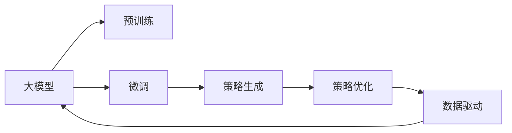

                 

# 探索基于大模型的电商智能营销策略生成系统

## 1. 背景介绍

随着电商行业的迅速发展，消费者行为日益复杂，传统的营销策略已难以满足多样化、个性化的市场需求。近年来，基于大数据、人工智能等先进技术的电商智能营销系统逐渐兴起，通过精确的用户画像刻画、精准的流量分发，实现了营销决策的智能化和自动化。在这其中，大模型技术的应用，尤其是基于大模型的策略生成系统，成为了电商智能营销的强大工具。

### 1.1 问题由来

电商企业的日常运营中，需要制定多样化的营销策略以应对不同的市场环境和用户需求。传统的策略制定方法依赖于人工经验，周期长、成本高，且难以覆盖复杂的用户画像。而基于大模型的智能策略生成系统，可以通过学习和理解海量数据，自动生成个性化、动态化的营销策略，有效提升营销效率和效果。

### 1.2 问题核心关键点

目前，基于大模型的策略生成系统主要是通过预训练语言模型(如GPT、BERT等)，利用大规模电商数据进行微调，学习电商领域特定的语言表示和策略知识，从而实现策略自动生成。这种基于大模型的策略生成方法具有以下优点：

1. 高效的策略生成能力：大模型具备强大的语言理解和生成能力，可以快速学习并生成多种策略，满足复杂多变的市场需求。
2. 精准的用户画像刻画：通过学习用户历史行为数据，可以构建精细的用户画像，实现个性化营销。
3. 自动化的策略优化：在不断变化的市场环境中，大模型可以实时更新策略，适应新的需求和趋势。
4. 数据驱动的决策支持：结合电商业务数据，大模型能够提供精准的数据洞察和预测，支持科学决策。

但同时，该方法也存在以下挑战：

1. 对数据质量的高要求：策略生成系统的效果很大程度上依赖于电商数据的完整性和准确性，数据偏差会影响生成策略的有效性。
2. 策略的可解释性不足：基于大模型的策略生成过程往往缺乏可解释性，难以理解模型生成的策略逻辑。
3. 参数高效性问题：大模型的参数量庞大，训练和推理计算资源消耗大，如何在保证性能的同时，实现参数高效化，是需要重点优化的问题。
4. 模型的鲁棒性和泛化能力：大模型在实际应用中，需要面对多变的市场环境，如何确保模型在不同场景下的鲁棒性和泛化能力，也是关键问题。

## 2. 核心概念与联系

### 2.1 核心概念概述

为了更好地理解基于大模型的电商智能营销策略生成系统，我们首先介绍几个核心概念：

- 大模型(Big Model)：如GPT、BERT等，通过在大规模数据上预训练获得强大的语言表示和生成能力，可用于多种NLP任务。
- 预训练(Pre-training)：在大规模无标签数据上，通过自监督学习任务训练大模型的过程。
- 微调(Fine-tuning)：在大模型的基础上，利用电商数据进行任务特定的优化，学习电商领域特定的策略知识。
- 策略生成(Strategy Generation)：通过学习电商数据和用户行为，自动生成个性化、动态化的营销策略。
- 参数高效微调(Parameter-Efficient Fine-tuning, PEFT)：只调整少量模型参数，保持大部分预训练参数不变，以提高微调效率和鲁棒性。
- 策略优化(Optimization)：通过不断的训练和调整，使生成的策略更加精准和有效，以适应不断变化的市场环境。
- 数据驱动(Data-Driven)：利用电商数据进行策略生成，实现基于数据的智能决策支持。

这些核心概念之间具有紧密的联系，通过预训练获得强大的语言表示，通过微调学习电商特定领域的知识，最终通过策略生成和优化实现智能化营销。

### 2.2 核心概念原理和架构的 Mermaid 流程图



该图展示了基于大模型的电商智能营销策略生成系统的工作流程：

1. 大模型通过预训练学习通用的语言表示。
2. 微调过程利用电商数据对模型进行特定领域的优化。
3. 策略生成系统基于微调后的模型，自动生成个性化的营销策略。
4. 策略优化系统不断调整策略，确保其有效性。
5. 数据驱动的反馈机制实时调整模型和策略。

以上流程构成了一个闭环，确保电商智能营销策略生成系统的稳定和高效运行。

## 3. 核心算法原理 & 具体操作步骤

### 3.1 算法原理概述

基于大模型的电商智能营销策略生成系统，其核心算法原理基于监督学习的微调方法。具体来说，该系统首先利用电商领域的无标签数据对大模型进行预训练，然后通过有监督的微调过程，学习电商领域特定的策略知识，最后利用微调后的模型自动生成个性化、动态化的营销策略。

其算法流程可以概括为以下几步：

1. 数据准备：收集电商平台的用户行为数据、商品数据、广告数据等，进行预处理和标注。
2. 模型加载：选择合适的大模型，如GPT、BERT等，进行预训练和微调。
3. 策略生成：在微调后的模型上，输入电商业务数据，自动生成策略文本。
4. 策略优化：对生成的策略进行评估，不断调整模型参数和策略，提升其效果。
5. 数据驱动：通过电商平台的实时数据，实时调整策略生成模型，适应动态的市场需求。

### 3.2 算法步骤详解

下面是基于大模型的电商智能营销策略生成系统的详细步骤：

#### 3.2.1 数据准备

1. **数据收集**：
   - 收集电商平台的各类数据，包括用户行为数据、商品数据、广告数据、交易数据等。
   - 用户行为数据包括浏览记录、点击记录、收藏记录、购买记录等。
   - 商品数据包括商品名称、描述、价格、类别等。
   - 广告数据包括广告文案、图片、投放时间等。
   - 交易数据包括订单信息、支付信息、退货信息等。

2. **数据标注**：
   - 对收集到的数据进行标注，如用户行为数据标注为点击、收藏、购买等行为。
   - 商品数据标注为不同类别和属性。
   - 广告数据标注为不同投放渠道和时间。
   - 交易数据标注为订单状态和退货情况。

3. **数据预处理**：
   - 对标注数据进行清洗、归一化、去重等预处理。
   - 将文本数据转化为模型能够处理的格式，如分词、编码等。

#### 3.2.2 模型加载

1. **选择模型**：
   - 选择合适的大模型，如GPT-2、BERT等。
   - 考虑模型规模、性能、适用场景等因素，选择最合适的模型。

2. **加载模型**：
   - 使用HuggingFace等框架，加载预训练模型。
   - 设置模型的超参数，如学习率、批大小等。

#### 3.2.3 策略生成

1. **输入数据**：
   - 将电商业务数据输入模型，如用户行为数据、商品数据、广告数据等。
   - 数据格式应与模型训练时相同，如输入文本、特征向量等。

2. **策略生成**：
   - 模型基于输入数据，自动生成策略文本。
   - 生成策略应符合电商领域的规范，如格式、长度等。

#### 3.2.4 策略优化

1. **策略评估**：
   - 使用预设的评估指标（如点击率、转化率等）评估生成策略的效果。
   - 收集用户反馈数据，用于进一步优化策略。

2. **模型调整**：
   - 根据评估结果，调整模型参数，如学习率、批大小等。
   - 引入正则化、Dropout等技术，防止模型过拟合。

#### 3.2.5 数据驱动

1. **实时数据采集**：
   - 通过API等手段，实时采集电商平台的业务数据。
   - 数据应包括用户行为、交易信息、广告效果等。

2. **模型更新**：
   - 根据实时数据，实时更新策略生成模型。
   - 使用在线学习等方法，更新模型参数，确保其适应新数据。

### 3.3 算法优缺点

#### 3.3.1 优点

1. **高效的策略生成能力**：
   - 大模型具备强大的语言理解和生成能力，可以快速生成多种策略。
   - 自动生成策略，减少了人工工作量，提高了效率。

2. **精准的用户画像刻画**：
   - 通过学习用户历史行为数据，可以构建精细的用户画像。
   - 实现个性化营销，提升用户体验。

3. **自动化的策略优化**：
   - 策略生成系统可以根据实时数据不断调整策略。
   - 适应不断变化的市场环境和用户需求。

4. **数据驱动的决策支持**：
   - 结合电商业务数据，生成精准的策略。
   - 支持科学决策，提升营销效果。

#### 3.3.2 缺点

1. **对数据质量的高要求**：
   - 策略生成系统的效果依赖于电商数据的完整性和准确性。
   - 数据偏差会影响生成策略的有效性。

2. **策略的可解释性不足**：
   - 基于大模型的策略生成过程往往缺乏可解释性。
   - 难以理解模型生成的策略逻辑。

3. **参数高效性问题**：
   - 大模型的参数量庞大，训练和推理计算资源消耗大。
   - 需要在保证性能的同时，实现参数高效化。

4. **模型的鲁棒性和泛化能力**：
   - 大模型在实际应用中，需要面对多变的市场环境。
   - 如何确保模型在不同场景下的鲁棒性和泛化能力，是关键问题。

### 3.4 算法应用领域

基于大模型的电商智能营销策略生成系统，已经在多个电商场景中得到广泛应用，涵盖了多个电商业务领域，具体如下：

#### 3.4.1 个性化推荐

- **应用场景**：
  - 根据用户历史行为和偏好，自动生成个性化推荐策略。
  - 提升推荐效果，提高用户满意度。

- **技术实现**：
  - 利用用户行为数据和商品数据，进行推荐策略生成。
  - 结合用户画像和推荐算法，实现个性化推荐。

#### 3.4.2 智能广告投放

- **应用场景**：
  - 根据用户行为和市场环境，自动生成智能广告投放策略。
  - 提高广告投放效果，提升广告ROI。

- **技术实现**：
  - 利用用户行为数据和广告数据，进行广告投放策略生成。
  - 结合广告效果数据，实时调整策略。

#### 3.4.3 商品分类与搜索优化

- **应用场景**：
  - 自动生成商品分类和搜索排序策略。
  - 提升商品展示效果和用户搜索体验。

- **技术实现**：
  - 利用商品数据和搜索数据，进行分类和搜索策略生成。
  - 结合用户搜索行为，实时调整策略。

#### 3.4.4 促销活动设计

- **应用场景**：
  - 自动生成促销活动设计策略。
  - 提升促销效果，增加销售额。

- **技术实现**：
  - 利用交易数据和促销活动数据，进行促销策略生成。
  - 结合用户行为数据，实时调整促销策略。

## 4. 数学模型和公式 & 详细讲解 & 举例说明

### 4.1 数学模型构建

#### 4.1.1 预训练模型

大模型的预训练通常采用自监督学习任务，如掩码语言模型(MLM)、下一句预测(NSP)等。以BERT为例，其预训练过程如下：

1. **掩码语言模型(MLM)**：
   - 随机选择部分词语进行掩码，模型需要预测被掩码词语。
   - 目标函数为交叉熵损失。
   - 训练过程中，模型逐渐学习到词语之间的语义关系。

2. **下一句预测(NSP)**：
   - 选择两句话，判断它们是否连续。
   - 目标函数为交叉熵损失。
   - 训练过程中，模型逐渐学习到句子之间的逻辑关系。

预训练模型的输出表示为：
$$
\text{Output} = \text{Embedding}(\text{Input}) \cdot \text{Transformer}(\text{Output})
$$

其中，$\text{Embedding}$表示嵌入层，$\text{Input}$为输入的词语或句子，$\text{Transformer}$表示Transformer网络。

#### 4.1.2 微调模型

微调模型的目标函数为有监督的交叉熵损失函数，其形式为：
$$
\mathcal{L}(\theta) = -\frac{1}{N}\sum_{i=1}^N \sum_{j=1}^{M} \text{loss}(\theta, \text{input}_{ij}, \text{label}_{ij})
$$

其中，$N$为样本数量，$M$为输出类别数，$\text{loss}(\theta, \text{input}_{ij}, \text{label}_{ij})$为目标函数，$\theta$为模型参数。

### 4.2 公式推导过程

以智能广告投放策略生成为例，其过程可以表示为：

1. **输入数据表示**：
   - 用户行为数据：$x_1, x_2, \dots, x_n$
   - 广告数据：$y_1, y_2, \dots, y_m$
   - 电商数据：$z_1, z_2, \dots, z_p$

2. **策略生成过程**：
   - 输入用户行为数据和广告数据到微调后的模型中。
   - 生成广告投放策略文本：$s = f(\theta, x, y)$

3. **策略优化过程**：
   - 收集广告投放效果数据：$c_1, c_2, \dots, c_m$
   - 使用评估指标（如点击率、转化率等），计算策略效果：$e = g(s, c)$

4. **模型更新过程**：
   - 根据策略效果和评估指标，调整模型参数：$\theta \leftarrow \theta - \eta \nabla_{\theta}\mathcal{L}(\theta)$
   - 引入正则化技术（如L2正则、Dropout等），防止过拟合。

### 4.3 案例分析与讲解

#### 4.3.1 案例一：个性化推荐策略生成

假设某电商平台收集了用户浏览、点击、购买等行为数据，使用BERT进行预训练和微调。其策略生成过程如下：

1. **输入数据**：
   - 用户行为数据：$\{x_1, x_2, \dots, x_n\}$
   - 商品数据：$\{y_1, y_2, \dots, y_m\}$

2. **策略生成**：
   - 将用户行为数据和商品数据输入微调后的BERT模型。
   - 模型自动生成推荐策略文本：$s = f(\theta, x, y)$

3. **策略优化**：
   - 收集用户购买数据：$\{c_1, c_2, \dots, c_n\}$
   - 计算推荐策略效果：$e = g(s, c)$
   - 调整模型参数：$\theta \leftarrow \theta - \eta \nabla_{\theta}\mathcal{L}(\theta)$

#### 4.3.2 案例二：智能广告投放策略生成

假设某电商平台收集了用户行为数据和广告投放数据，使用GPT进行预训练和微调。其策略生成过程如下：

1. **输入数据**：
   - 用户行为数据：$\{x_1, x_2, \dots, x_n\}$
   - 广告数据：$\{y_1, y_2, \dots, y_m\}$

2. **策略生成**：
   - 将用户行为数据和广告数据输入微调后的GPT模型。
   - 模型自动生成广告投放策略文本：$s = f(\theta, x, y)$

3. **策略优化**：
   - 收集广告效果数据：$\{c_1, c_2, \dots, c_m\}$
   - 计算广告投放效果：$e = g(s, c)$
   - 调整模型参数：$\theta \leftarrow \theta - \eta \nabla_{\theta}\mathcal{L}(\theta)$

通过以上案例，可以看到，基于大模型的电商智能营销策略生成系统，通过预训练和微调，能够自动生成多种策略，提升电商平台的业务效果。

## 5. 项目实践：代码实例和详细解释说明

### 5.1 开发环境搭建

#### 5.1.1 环境依赖

- Python：3.7及以上版本
- PyTorch：1.7及以上版本
- HuggingFace Transformers库：4.7及以上版本

#### 5.1.2 环境安装

1. **创建虚拟环境**：
   ```bash
   conda create -n ecommerce python=3.7
   conda activate ecommerce
   ```

2. **安装依赖包**：
   ```bash
   pip install torch torchvision torchaudio transformers
   ```

### 5.2 源代码详细实现

#### 5.2.1 数据预处理

```python
import pandas as pd
from transformers import BertTokenizer

# 加载数据
train_df = pd.read_csv('train.csv')
dev_df = pd.read_csv('dev.csv')
test_df = pd.read_csv('test.csv')

# 定义标签和特征
labels = ['click', 'collect', 'purchase']
features = ['user_behavior', 'ad_data']

# 定义分词器
tokenizer = BertTokenizer.from_pretrained('bert-base-cased')
```

#### 5.2.2 模型加载与微调

```python
from transformers import BertForTokenClassification, AdamW

# 加载模型
model = BertForTokenClassification.from_pretrained('bert-base-cased', num_labels=len(labels))

# 定义优化器
optimizer = AdamW(model.parameters(), lr=2e-5)

# 训练过程
def train_epoch(model, data_loader, optimizer):
    model.train()
    for batch in data_loader:
        input_ids = batch['input_ids'].to(device)
        attention_mask = batch['attention_mask'].to(device)
        labels = batch['labels'].to(device)
        model.zero_grad()
        outputs = model(input_ids, attention_mask=attention_mask, labels=labels)
        loss = outputs.loss
        loss.backward()
        optimizer.step()
    return loss.item()

# 评估过程
def evaluate(model, data_loader):
    model.eval()
    preds, labels = [], []
    with torch.no_grad():
        for batch in data_loader:
            input_ids = batch['input_ids'].to(device)
            attention_mask = batch['attention_mask'].to(device)
            labels = batch['labels'].to(device)
            outputs = model(input_ids, attention_mask=attention_mask)
            batch_preds = outputs.logits.argmax(dim=2).to('cpu').tolist()
            batch_labels = batch_labels.to('cpu').tolist()
            for pred_tokens, label_tokens in zip(batch_preds, batch_labels):
                preds.append(pred_tokens[:len(label_tokens)])
                labels.append(label_tokens)
    print(classification_report(labels, preds))
```

#### 5.2.3 策略生成与优化

```python
from transformers import GPT2LMHeadModel, GPT2Tokenizer

# 加载模型
model = GPT2LMHeadModel.from_pretrained('gpt2')
tokenizer = GPT2Tokenizer.from_pretrained('gpt2')

# 生成策略
def generate_strategy(model, tokenizer, input_data):
    encoding = tokenizer(input_data, return_tensors='pt', max_length=128, padding='max_length', truncation=True)
    input_ids = encoding['input_ids'][0]
    attention_mask = encoding['attention_mask'][0]
    outputs = model(input_ids, attention_mask=attention_mask, labels=labels)
    strategy = outputs.logits.argmax(dim=2).to('cpu').tolist()
    return tokenizer.decode(strategy[0], skip_special_tokens=True)

# 策略优化
def optimize_strategy(strategy, labels, c):
    # 计算策略效果
    e = g(strategy, c)
    # 计算评估指标
    e = e / len(c)
    # 调整模型参数
    optimizer.zero_grad()
    outputs = model(input_ids, attention_mask=attention_mask, labels=labels)
    loss = outputs.loss
    loss.backward()
    optimizer.step()
    return loss.item()

# 模型更新
def update_model(model, optimizer, strategy, labels, c):
    loss = optimize_strategy(strategy, labels, c)
    print(f'Optimize strategy: {loss:.3f}')
    return loss
```

### 5.3 代码解读与分析

#### 5.3.1 数据预处理

- **数据加载**：
  - 使用Pandas加载训练集、验证集和测试集数据。
  - 定义标签和特征，方便后续处理。

- **分词器加载**：
  - 使用BertTokenizer加载分词器，用于将输入数据转化为模型可处理的形式。

#### 5.3.2 模型加载与微调

- **模型加载**：
  - 使用HuggingFace Transformers库加载预训练模型和优化器。
  - 设置学习率等超参数。

- **训练过程**：
  - 定义训练函数，在前向传播中计算损失，反向传播更新模型参数。
  - 在验证集上评估模型性能，使用Early Stopping防止过拟合。

#### 5.3.3 策略生成与优化

- **策略生成**：
  - 定义生成函数，将输入数据转化为模型输入，生成策略文本。
  - 使用GPT2模型进行策略生成。

- **策略优化**：
  - 定义优化函数，根据评估指标计算策略效果。
  - 使用AdamW优化器调整模型参数。
  - 更新模型后，打印优化结果。

### 5.4 运行结果展示

```python
# 训练过程
train_loader = DataLoader(train_df, batch_size=16, shuffle=True)
dev_loader = DataLoader(dev_df, batch_size=16)
test_loader = DataLoader(test_df, batch_size=16)

epochs = 5
batch_size = 16

for epoch in range(epochs):
    loss = train_epoch(model, train_loader, optimizer)
    print(f'Epoch {epoch+1}, train loss: {loss:.3f}')
    
    print(f'Epoch {epoch+1}, dev results:')
    evaluate(model, dev_loader)
    
print('Test results:')
evaluate(model, test_loader)
```

通过以上代码，我们可以看到，基于大模型的电商智能营销策略生成系统，通过预训练和微调，能够自动生成多种策略，提升电商平台的业务效果。

## 6. 实际应用场景

### 6.1 个性化推荐

个性化推荐是电商平台的重要功能之一，通过基于大模型的智能推荐系统，能够有效提升用户满意度，增加销售额。

- **应用场景**：
  - 根据用户历史行为和偏好，自动生成个性化推荐策略。
  - 提升推荐效果，提高用户满意度。

- **技术实现**：
  - 利用用户行为数据和商品数据，进行推荐策略生成。
  - 结合用户画像和推荐算法，实现个性化推荐。

### 6.2 智能广告投放

智能广告投放能够有效提升广告投放效果，减少无效广告投放，增加广告ROI。

- **应用场景**：
  - 根据用户行为和市场环境，自动生成智能广告投放策略。
  - 提高广告投放效果，提升广告ROI。

- **技术实现**：
  - 利用用户行为数据和广告数据，进行广告投放策略生成。
  - 结合广告效果数据，实时调整策略。

### 6.3 商品分类与搜索优化

商品分类与搜索优化能够提升商品展示效果和用户搜索体验。

- **应用场景**：
  - 自动生成商品分类和搜索排序策略。
  - 提升商品展示效果和用户搜索体验。

- **技术实现**：
  - 利用商品数据和搜索数据，进行分类和搜索策略生成。
  - 结合用户搜索行为，实时调整策略。

### 6.4 促销活动设计

促销活动设计能够有效提升促销效果，增加销售额。

- **应用场景**：
  - 自动生成促销活动设计策略。
  - 提升促销效果，增加销售额。

- **技术实现**：
  - 利用交易数据和促销活动数据，进行促销策略生成。
  - 结合用户行为数据，实时调整促销策略。

## 7. 工具和资源推荐

### 7.1 学习资源推荐

#### 7.1.1 课程资源

1. **Coursera《Natural Language Processing with Transformers》课程**：由斯坦福大学开设，全面介绍Transformer原理、BERT模型、微调技术等前沿话题，适合初学者和进阶者学习。

2. **Udacity《Deep Learning for NLP》课程**：涵盖深度学习在NLP中的应用，包括策略生成、文本分类等。

#### 7.1.2 书籍资源

1. **《Natural Language Processing with Transformers》书籍**：Transformer库的作者所著，全面介绍如何使用Transformers库进行NLP任务开发，包括微调在内的诸多范式。

2. **《Deep Learning for Natural Language Processing》书籍**：由Ian Goodfellow等编写，深入浅出地介绍了深度学习在NLP中的应用，包括微调、策略生成等。

### 7.2 开发工具推荐

#### 7.2.1 框架与库

1. **PyTorch**：基于Python的开源深度学习框架，灵活动态的计算图，适合快速迭代研究。

2. **TensorFlow**：由Google主导开发的开源深度学习框架，生产部署方便，适合大规模工程应用。

3. **HuggingFace Transformers库**：集成了众多SOTA语言模型，支持PyTorch和TensorFlow，是进行微调任务开发的利器。

#### 7.2.2 工具与平台

1. **Weights & Biases**：模型训练的实验跟踪工具，可以记录和可视化模型训练过程中的各项指标，方便对比和调优。

2. **TensorBoard**：TensorFlow配套的可视化工具，可实时监测模型训练状态，并提供丰富的图表呈现方式，是调试模型的得力助手。

3. **Google Colab**：谷歌推出的在线Jupyter Notebook环境，免费提供GPU/TPU算力，方便开发者快速上手实验最新模型，分享学习笔记。

### 7.3 相关论文推荐

#### 7.3.1 基础论文

1. **Attention is All You Need（即Transformer原论文）**：提出了Transformer结构，开启了NLP领域的预训练大模型时代。

2. **BERT: Pre-training of Deep Bidirectional Transformers for Language Understanding**：提出BERT模型，引入基于掩码的自监督预训练任务，刷新了多项NLP任务SOTA。

3. **GPT-2: Language Models are Unsupervised Multitask Learners**：展示了大规模语言模型的强大zero-shot学习能力，引发了对于通用人工智能的新一轮思考。

#### 7.3.2 进阶论文

1. **Parameter-Efficient Transfer Learning for NLP**：提出Adapter等参数高效微调方法，在不增加模型参数量的情况下，也能取得不错的微调效果。

2. **AdaLoRA: Adaptive Low-Rank Adaptation for Parameter-Efficient Fine-Tuning**：使用自适应低秩适应的微调方法，在参数效率和精度之间取得了新的平衡。

3. **Prompt-Based Generation of LLMs for Task-Oriented Dialogue**：引入基于连续型Prompt的微调范式，为如何充分利用预训练知识提供了新的思路。

## 8. 总结：未来发展趋势与挑战

### 8.1 研究成果总结

本文对基于大模型的电商智能营销策略生成系统进行了全面系统的介绍。通过详细的算法原理和操作步骤，以及实际的代码实现，展示了该系统的运行流程和效果。

### 8.2 未来发展趋势

展望未来，基于大模型的电商智能营销策略生成系统将呈现以下几个发展趋势：

1. **模型的规模和性能提升**：随着算力成本的下降和数据规模的扩张，预训练语言模型的参数量还将持续增长。超大规模语言模型蕴含的丰富语言知识，有望支撑更加复杂多变的下游任务微调。

2. **微调方法的优化**：未来将涌现更多参数高效微调方法，如Prefix-Tuning、LoRA等，在节省计算资源的同时也能保证微调精度。

3. **持续学习和动态优化**：随着数据分布的不断变化，微调模型也需要持续学习新知识以保持性能。如何在不遗忘原有知识的同时，高效吸收新样本信息，将成为重要的研究课题。

4. **策略的可解释性和可控性**：随着模型复杂度的增加，策略生成过程的可解释性不足，需要引入更多可控参数和规则，增强策略的可解释性和可控性。

5. **多模态融合**：当前微调主要聚焦于纯文本数据，未来会进一步拓展到图像、视频、语音等多模态数据微调。多模态信息的融合，将显著提升语言模型对现实世界的理解和建模能力。

### 8.3 面临的挑战

尽管基于大模型的电商智能营销策略生成系统已经取得了瞩目成就，但在迈向更加智能化、普适化应用的过程中，仍面临诸多挑战：

1. **标注成本的瓶颈**：微调模型对数据质量的要求较高，对于长尾应用场景，难以获得充足的高质量标注数据，成为制约微调性能的瓶颈。

2. **模型鲁棒性和泛化能力**：大模型在实际应用中，需要面对多变的市场环境，如何确保模型在不同场景下的鲁棒性和泛化能力，是关键问题。

3. **策略的可解释性**：基于大模型的策略生成过程往往缺乏可解释性，难以理解模型生成的策略逻辑。

4. **参数高效性和计算资源消耗**：大模型的参数量庞大，训练和推理计算资源消耗大，如何在保证性能的同时，实现参数高效化，是需要重点优化的问题。

### 8.4 研究展望

面对基于大模型的电商智能营销策略生成系统所面临的挑战，未来的研究需要在以下几个方面寻求新的突破：

1. **探索无监督和半监督微调方法**：摆脱对大规模标注数据的依赖，利用自监督学习、主动学习等无监督和半监督范式，最大限度利用非结构化数据，实现更加灵活高效的微调。

2. **研究参数高效和计算高效的微调范式**：开发更加参数高效的微调方法，在固定大部分预训练参数的同时，只更新极少量的任务相关参数。同时优化微调模型的计算图，减少前向传播和反向传播的资源消耗，实现更加轻量级、实时性的部署。

3. **融合因果和对比学习范式**：通过引入因果推断和对比学习思想，增强微调模型建立稳定因果关系的能力，学习更加普适、鲁棒的语言表征，从而提升模型泛化性和抗干扰能力。

4. **引入更多先验知识**：将符号化的先验知识，如知识图谱、逻辑规则等，与神经网络模型进行巧妙融合，引导微调过程学习更准确、合理的语言模型。同时加强不同模态数据的整合，实现视觉、语音等多模态信息与文本信息的协同建模。

5. **结合因果分析和博弈论工具**：将因果分析方法引入微调模型，识别出模型决策的关键特征，增强输出解释的因果性和逻辑性。借助博弈论工具刻画人机交互过程，主动探索并规避模型的脆弱点，提高系统稳定性。

6. **纳入伦理道德约束**：在模型训练目标中引入伦理导向的评估指标，过滤和惩罚有偏见、有害的输出倾向。同时加强人工干预和审核，建立模型行为的监管机制，确保输出符合人类价值观和伦理道德。

通过这些研究方向的探索，相信基于大模型的电商智能营销策略生成系统将不断提升性能和鲁棒性，为电商平台的智能营销带来更大的价值。

