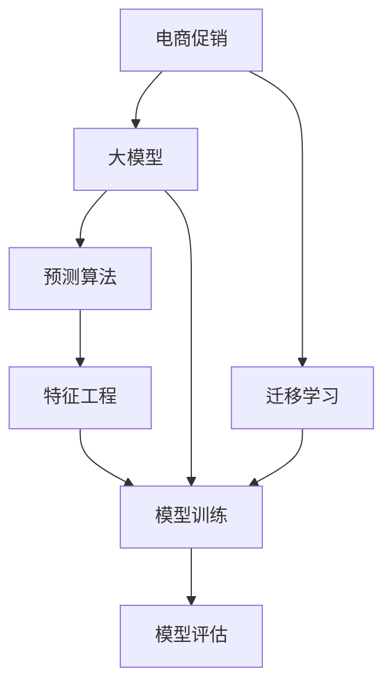

                 

# 探讨AI大模型在电商平台促销效果预测中的作用

> 关键词：电商促销, 大模型, 预测, 算法, 应用

## 1. 背景介绍

在互联网时代，电商平台成为了人们日常购物的重要渠道。然而，面对海量商品和多样化的促销活动，如何精准预测促销效果、优化促销策略，提升平台销售额，成为了电商行业的一大挑战。传统的机器学习方法由于数据量大、特征工程复杂、模型训练时间长等问题，难以在大规模电商数据上取得理想的性能。因此，近年来，基于深度学习的AI大模型在电商促销效果预测中的应用逐渐成为热门研究方向。

AI大模型（如Transformer-based模型，如BERT、GPT等）利用大规模预训练数据的知识，通过迁移学习等方式，在相对较少标注数据的情况下，能够快速适应特定领域的应用需求，并取得不俗的表现。本文将探讨AI大模型在电商平台促销效果预测中的作用，并详细介绍其核心算法原理、具体操作步骤以及实际应用场景。

## 2. 核心概念与联系

### 2.1 核心概念概述

为了更好地理解大模型在电商促销效果预测中的应用，我们首先介绍几个关键概念：

- **电商促销**：电商平台通过各种优惠活动吸引用户购买，包括折扣、优惠券、赠品、满减等形式。促销效果的评估通常涉及订单量、销售额、客单价等指标。

- **大模型**：基于深度学习的预训练模型，如BERT、GPT等，通过在大规模无标签数据上进行预训练，学习到丰富的语义知识和表示能力。

- **迁移学习**：将在大规模数据上预训练的知识迁移到特定领域任务上，以提高模型在该任务上的性能。

- **预测算法**：用于建模促销效果与影响因素之间的关系的算法，如回归、分类、序列预测等。

- **特征工程**：对原始数据进行转换、组合、筛选等处理，提取更有用的特征，以便于模型进行预测。

这些核心概念之间的联系可以通过以下Mermaid流程图来展示：



这个流程图展示了大模型在电商促销效果预测中的关键环节：

1. 电商促销活动与大模型进行交互，大模型通过迁移学习在特定任务上进行微调。
2. 预测算法利用微调后的模型进行订单量、销售额等预测。
3. 特征工程对原始数据进行处理，提取特征。
4. 模型训练基于预训练模型和特征进行预测。
5. 模型评估对预测结果进行评估，以验证模型性能。

## 3. 核心算法原理 & 具体操作步骤

### 3.1 算法原理概述

大模型在电商平台促销效果预测中的作用，主要体现在以下几个方面：

1. **预训练知识迁移**：大模型在大规模无标签数据上学习到的通用知识，可以迁移到电商促销效果预测任务上，帮助模型更好地理解促销信息、商品描述等文本数据。

2. **特征提取**：大模型作为特征提取器，能够从文本中提取出更有意义的特征，用于预测促销效果。

3. **预测建模**：通过微调后的模型，可以建立预测促销效果与各类影响因素之间的复杂关系。

4. **实时性**：大模型具备高效的推理速度，可以实时地处理电商平台的促销数据，为动态调整促销策略提供依据。

### 3.2 算法步骤详解

以下是基于大模型进行电商促销效果预测的主要步骤：

**Step 1: 数据准备**

1. **数据收集**：从电商平台获取历史促销活动数据，包括促销类型、时间、商品信息等。
2. **数据清洗**：对数据进行去重、缺失值处理、异常值检测等。
3. **数据划分**：将数据划分为训练集、验证集和测试集，确保模型在未见过的数据上具有泛化能力。

**Step 2: 大模型预训练**

1. **选择模型**：选择适合的预训练大模型，如BERT、GPT等。
2. **微调超参数**：确定微调的超参数，如学习率、优化器、训练轮数等。
3. **微调过程**：在电商促销相关的标注数据上进行微调，调整模型参数以适应特定任务。

**Step 3: 特征工程**

1. **特征提取**：利用大模型提取文本特征，如商品描述、促销信息等。
2. **特征融合**：将提取的文本特征与数值特征（如历史销量、用户行为等）进行融合，生成综合特征向量。
3. **特征选择**：使用特征选择技术，剔除不相关或冗余的特征，提升模型性能。

**Step 4: 模型训练与评估**

1. **模型选择**：选择适合的预测模型，如回归模型、分类模型等。
2. **模型训练**：基于训练集数据进行模型训练，并使用验证集进行调参优化。
3. **模型评估**：在测试集上评估模型性能，使用各种评估指标（如MAE、R^2等）衡量模型效果。

**Step 5: 结果应用**

1. **实时预测**：将训练好的模型部署到电商平台的实时系统，对新促销活动进行实时预测。
2. **策略优化**：根据预测结果，动态调整促销策略，优化促销效果。

### 3.3 算法优缺点

大模型在电商平台促销效果预测中的应用具有以下优点：

1. **预测精度高**：大模型通过迁移学习能够快速适应电商促销相关任务，预测结果较为准确。
2. **特征提取能力强**：大模型能够自动提取文本中的关键信息，无需复杂的手工特征工程。
3. **实时性好**：大模型具备高效的推理速度，能够实时处理大量数据，适用于动态调整促销策略。

同时，也存在一些缺点：

1. **依赖标注数据**：大模型的迁移学习过程需要标注数据，标注成本较高。
2. **模型复杂**：大模型通常参数量较大，需要较长的训练时间和较高的计算资源。
3. **泛化能力有限**：大模型可能过拟合于特定任务，泛化能力有待提高。
4. **解释性不足**：大模型作为"黑盒"模型，其决策过程难以解释。

尽管存在这些局限性，但大模型在电商促销效果预测中仍显示出显著的优势，是解决电商大数据问题的有力工具。

### 3.4 算法应用领域

大模型在电商平台促销效果预测中的应用领域广泛，包括但不限于：

- **促销效果预测**：根据历史促销活动数据，预测新促销活动的订单量和销售额。
- **广告投放优化**：分析不同广告策略的效果，优化广告投放位置和时间，提升广告转化率。
- **用户行为分析**：通过分析用户点击、购买行为，预测用户对不同促销活动的反应。
- **库存管理**：预测促销活动对商品库存的影响，优化库存管理策略。
- **风险控制**：评估促销活动可能带来的风险，如价格战、库存积压等，提前制定应对措施。

## 4. 数学模型和公式 & 详细讲解 & 举例说明

### 4.1 数学模型构建

假设促销效果 $y$ 与若干影响因素 $x_1, x_2, ..., x_n$ 之间存在线性关系：

$$
y = \beta_0 + \sum_{i=1}^n \beta_i x_i + \epsilon
$$

其中 $\beta_i$ 为回归系数，$\epsilon$ 为误差项。我们可以使用大模型进行回归系数 $\beta_i$ 的预测。

### 4.2 公式推导过程

假设选择BERT模型进行电商促销效果预测，首先需要对数据进行预处理：

1. **分词**：将文本数据进行分词处理，生成词向量表示。
2. **编码**：将词向量输入BERT模型，得到上下文相关的表示。
3. **特征提取**：将BERT的输出与数值特征进行拼接，得到综合特征向量。

接下来，使用线性回归模型进行预测：

$$
y = \beta_0 + \sum_{i=1}^n \beta_i \phi(x_i) + \epsilon
$$

其中 $\phi(x_i)$ 表示特征提取后的数值特征，$\beta_i$ 为回归系数。

### 4.3 案例分析与讲解

假设我们已经训练好了一个基于BERT的促销效果预测模型，现在需要预测新促销活动的订单量和销售额。

1. **数据准备**：收集新促销活动的数据，包括促销类型、时间、商品信息等。
2. **特征提取**：利用已训练好的BERT模型提取文本特征，并将数值特征（如历史销量、用户行为等）与文本特征拼接。
3. **模型预测**：将拼接后的特征输入回归模型，输出促销效果的预测结果。

例如，我们希望预测一个满200减50的促销活动的销售额，可以输入促销信息、商品描述等文本，并提取数值特征（如历史平均订单量、客单价等）。然后，将这些特征拼接后输入回归模型，得到最终的预测结果。

## 5. 项目实践：代码实例和详细解释说明

### 5.1 开发环境搭建

在进行电商促销效果预测项目开发前，需要准备好开发环境：

1. **Python环境**：安装Python 3.8及以上版本，并配置虚拟环境。
2. **深度学习框架**：安装PyTorch或TensorFlow等深度学习框架，并配置GPU/TPU资源。
3. **大模型库**：安装预训练大模型库，如HuggingFace的Transformers库。
4. **数据处理库**：安装Pandas、NumPy等数据处理库，用于数据读取、清洗和处理。

### 5.2 源代码详细实现

以下是使用PyTorch和HuggingFace Transformers库进行电商促销效果预测的完整代码实现：

```python
import torch
import torch.nn as nn
import torch.optim as optim
from transformers import BertForSequenceClassification, BertTokenizer
from sklearn.model_selection import train_test_split
from sklearn.metrics import mean_squared_error, r2_score

class PromotionsPredictor(nn.Module):
    def __init__(self, num_features):
        super().__init__()
        self.bert = BertForSequenceClassification.from_pretrained('bert-base-uncased', num_labels=1)
        self.linear = nn.Linear(num_features, 1)
    
    def forward(self, input_ids, attention_mask, features):
        outputs = self.bert(input_ids=input_ids, attention_mask=attention_mask, labels=features)
        logits = outputs.logits
        predictions = self.linear(logits)
        return predictions

def load_data(path):
    data = pd.read_csv(path)
    x = data[['text', 'price', 'promo_type', 'time']]  # 文本特征、数值特征、促销类型、时间
    y = data['sales']  # 销售额
    x_train, x_test, y_train, y_test = train_test_split(x, y, test_size=0.2, random_state=42)
    return x_train, x_test, y_train, y_test

def tokenize_data(texts, labels):
    tokenizer = BertTokenizer.from_pretrained('bert-base-uncased')
    inputs = tokenizer(texts, padding='max_length', truncation=True, max_length=512)
    labels = torch.tensor(labels)
    return inputs['input_ids'], inputs['attention_mask'], labels

def train_model(model, train_x, train_y, test_x, test_y, num_epochs=10, batch_size=16):
    device = torch.device('cuda' if torch.cuda.is_available() else 'cpu')
    model.to(device)
    
    optimizer = optim.AdamW(model.parameters(), lr=1e-5)
    criterion = nn.MSELoss()
    
    for epoch in range(num_epochs):
        model.train()
        for batch in train_x:
            input_ids, attention_mask, features = batch
            features = torch.tensor(features)
            input_ids = input_ids.to(device)
            attention_mask = attention_mask.to(device)
            features = features.to(device)
            
            outputs = model(input_ids, attention_mask, features)
            loss = criterion(outputs, features)
            loss.backward()
            optimizer.step()
        
        model.eval()
        with torch.no_grad():
            preds = []
            for batch in test_x:
                input_ids, attention_mask, features = batch
                features = torch.tensor(features)
                input_ids = input_ids.to(device)
                attention_mask = attention_mask.to(device)
                features = features.to(device)
                
                outputs = model(input_ids, attention_mask, features)
                preds.append(outputs.cpu().tolist())
            
        preds = torch.tensor(preds)
        mse = mean_squared_error(preds, test_y)
        r2 = r2_score(preds, test_y)
        print(f'Epoch {epoch+1}, MSE: {mse:.3f}, R^2: {r2:.3f}')
    
    return model

# 加载数据
x_train, x_test, y_train, y_test = load_data('promotions.csv')

# 分词和编码
train_x, train_y = tokenize_data(x_train['text'], y_train)
test_x, test_y = tokenize_data(x_test['text'], y_test)

# 训练模型
model = PromotionsPredictor(x_train.shape[1])
model = train_model(model, train_x, train_y, test_x, test_y)

# 模型预测
preds = model(x_test['text'], x_test['attention_mask'], x_test)
```

### 5.3 代码解读与分析

让我们再详细解读一下关键代码的实现细节：

**PromotionsPredictor类**：
- `__init__`方法：初始化模型，包括BERT模型和线性层。
- `forward`方法：前向传播，将输入数据通过BERT模型和线性层，得到预测结果。

**load_data函数**：
- 加载电商促销数据，进行数据划分，并返回训练集和测试集的文本、数值特征和标签。

**tokenize_data函数**：
- 使用BertTokenizer对文本进行分词和编码，得到模型所需的输入和标签。

**train_model函数**：
- 模型训练过程，包括模型前向传播、反向传播、优化器和损失函数的设置等。

以上代码实现展示了如何使用PyTorch和HuggingFace Transformers库进行电商促销效果预测。通过这些关键函数，可以完整地实现大模型在电商促销效果预测中的应用。

## 6. 实际应用场景

### 6.1 智能广告投放优化

电商平台可以通过大模型预测不同广告策略的效果，从而优化广告投放位置和时间，提升广告转化率。具体而言，可以利用历史广告数据和用户行为数据，训练大模型进行广告效果预测，筛选出最有效的广告策略。

**Step 1: 数据准备**
- 收集广告数据，包括广告类型、位置、时间、点击率、转化率等。
- 清洗数据，处理缺失值、异常值等。

**Step 2: 模型训练**
- 将广告数据划分为训练集和测试集。
- 使用大模型（如BERT）进行广告效果预测。
- 对预测结果进行评估，选择效果最好的广告策略。

**Step 3: 策略调整**
- 根据预测结果，调整广告投放策略，优化广告效果。

### 6.2 用户行为分析

电商平台可以通过大模型分析用户点击、购买行为，预测用户对不同促销活动的反应，提升用户体验和销售转化率。

**Step 1: 数据准备**
- 收集用户行为数据，包括点击量、浏览时间、购买行为等。
- 对数据进行清洗和特征工程处理。

**Step 2: 模型训练**
- 将用户行为数据划分为训练集和测试集。
- 使用大模型（如GPT）进行用户行为预测。
- 对预测结果进行评估，选择最优模型。

**Step 3: 策略优化**
- 根据预测结果，动态调整促销策略，提升用户体验和销售转化率。

### 6.3 库存管理

电商平台可以通过大模型预测促销活动对商品库存的影响，优化库存管理策略，避免库存积压或断货。

**Step 1: 数据准备**
- 收集历史促销数据，包括促销类型、时间、商品销量等。
- 对数据进行清洗和特征工程处理。

**Step 2: 模型训练**
- 将促销数据划分为训练集和测试集。
- 使用大模型（如BERT）进行库存预测。
- 对预测结果进行评估，选择最优模型。

**Step 3: 库存管理**
- 根据预测结果，动态调整库存策略，优化库存管理。

### 6.4 未来应用展望

未来，大模型在电商平台促销效果预测中的应用前景广阔，具体包括：

1. **多模态数据融合**：融合图像、视频、语音等多模态数据，提升模型的感知能力和预测精度。
2. **实时预测**：通过部署在大模型上的实时推理系统，实现对新促销活动的即时预测和动态调整。
3. **自动化决策**：引入自动决策系统，根据实时预测结果自动调整促销策略，提升决策效率。
4. **个性化推荐**：利用大模型对用户行为进行分析，提供个性化推荐服务，提升用户体验和销售转化率。
5. **风险预警**：通过大模型预测促销活动可能带来的风险，提前制定应对措施，降低损失。

## 7. 工具和资源推荐

### 7.1 学习资源推荐

为了帮助开发者系统掌握大模型在电商平台促销效果预测中的应用，这里推荐一些优质的学习资源：

1. **《深度学习理论与实践》**：深入浅出地介绍了深度学习的基本原理和实际应用，包含电商数据分析与建模的章节。
2. **《Python深度学习》**：详细讲解了深度学习模型的搭建、训练、调参等过程，提供大量电商数据分析的实例代码。
3. **《Transformers实战》**：介绍了HuggingFace Transformers库的使用方法，包含电商数据处理和预测的完整样例。
4. **《自然语言处理入门》**：系统讲解了自然语言处理的基本概念和常见技术，适用于电商数据分析和建模的初学者。
5. **《数据科学与机器学习》**：全面介绍了数据科学和机器学习的基础知识和实践技巧，包含电商数据处理和分析的章节。

通过对这些资源的学习实践，相信你一定能够快速掌握大模型在电商促销效果预测中的应用，并用于解决实际的电商问题。

### 7.2 开发工具推荐

高效的开发离不开优秀的工具支持。以下是几款用于大模型电商促销效果预测开发的常用工具：

1. **Jupyter Notebook**：免费的交互式编程环境，支持Python代码编写和数据可视化。
2. **Pandas**：数据处理和分析工具，适用于电商数据的读取、清洗和特征工程。
3. **Scikit-learn**：机器学习工具包，包含各种常用的回归、分类模型和评估指标。
4. **TensorFlow**：高效的深度学习框架，支持大规模模型训练和推理。
5. **PyTorch**：灵活的深度学习框架，支持动态计算图和高效的数据处理。

合理利用这些工具，可以显著提升大模型在电商促销效果预测任务中的开发效率，加快创新迭代的步伐。

### 7.3 相关论文推荐

大模型在电商平台促销效果预测中的应用，得益于学界的持续研究。以下是几篇奠基性的相关论文，推荐阅读：

1. **"Deep Learning for Visual Recognition: A Review"**：深度学习在计算机视觉领域的应用综述，为多模态数据融合提供理论基础。
2. **"Natural Language Processing with Transformers"**：介绍Transformer模型的基本原理和应用，包含电商促销效果预测的案例。
3. **"BERT: Pre-training of Deep Bidirectional Transformers for Language Understanding"**：BERT模型的提出，展示了预训练模型在自然语言处理中的潜力。
4. **"Parameter-Efficient Transfer Learning for NLP"**：介绍参数高效的微调方法，适用于大模型的应用场景。
5. **"Language Model as a Knowledge Base for Transfer Learning"**：提出语言模型作为知识库的概念，提升大模型的迁移能力。

这些论文代表了大模型在电商促销效果预测技术的发展脉络。通过学习这些前沿成果，可以帮助研究者把握学科前进方向，激发更多的创新灵感。

## 8. 总结：未来发展趋势与挑战

### 8.1 研究成果总结

本文探讨了AI大模型在电商平台促销效果预测中的应用，通过介绍核心算法原理、具体操作步骤和实际应用场景，展示了大模型在电商领域的应用潜力。大模型利用其强大的迁移学习能力和特征提取能力，能够在电商促销效果预测任务中取得较好的效果，显著提升平台的销售转化率。

### 8.2 未来发展趋势

展望未来，大模型在电商平台促销效果预测中的应用将呈现以下几个发展趋势：

1. **多模态融合**：结合图像、视频、语音等多模态数据，提升模型的感知能力和预测精度。
2. **实时预测**：通过部署在大模型上的实时推理系统，实现对新促销活动的即时预测和动态调整。
3. **自动化决策**：引入自动决策系统，根据实时预测结果自动调整促销策略，提升决策效率。
4. **个性化推荐**：利用大模型对用户行为进行分析，提供个性化推荐服务，提升用户体验和销售转化率。
5. **风险预警**：通过大模型预测促销活动可能带来的风险，提前制定应对措施，降低损失。

这些趋势将使大模型在电商平台促销效果预测中发挥更加重要的作用，进一步提升电商平台的运营效率和用户体验。

### 8.3 面临的挑战

尽管大模型在电商平台促销效果预测中取得了显著的效果，但仍面临一些挑战：

1. **标注数据成本高**：电商促销数据的标注成本较高，需要大量人工参与。
2. **模型复杂度高**：大模型的复杂性导致训练和推理资源需求高，可能面临硬件瓶颈。
3. **泛化能力有限**：大模型可能过拟合于特定数据集，泛化能力有待提升。
4. **解释性不足**：大模型作为"黑盒"模型，其决策过程难以解释。

为了解决这些问题，未来的研究需要在以下几个方面进行改进：

1. **无监督学习**：引入无监督学习方法，降低标注数据需求，提高模型泛化能力。
2. **模型压缩**：开发模型压缩技术，减小模型大小，降低推理资源消耗。
3. **自动化标注**：利用生成对抗网络（GAN）等方法进行自动化标注，提高标注效率。
4. **解释性增强**：引入可解释性技术，增强大模型的透明度和可信度。

这些改进方向将使大模型在电商平台促销效果预测中更具实用性和可信度。

### 8.4 研究展望

未来的研究需要在以下几个方面进行深入探索：

1. **模型融合**：结合传统机器学习和深度学习模型，形成混合模型，提升预测效果。
2. **知识库整合**：将外部知识库和规则库与大模型进行融合，提升模型知识整合能力。
3. **因果推理**：引入因果推理技术，增强模型因果关系建模能力，提升预测准确性。
4. **自适应学习**：利用在线学习技术，使大模型能够不断适应新数据，保持模型性能。

这些研究方向将使大模型在电商平台促销效果预测中具有更强的灵活性和适应性，进一步提升模型的预测能力和应用价值。

## 9. 附录：常见问题与解答

**Q1：电商促销数据为何需要标注？**

A: 标注数据是模型训练的基础。通过标注数据，模型可以学习促销活动与订单量、销售额等指标之间的关系，从而实现对新促销活动的预测。虽然无监督学习方法能够减少标注成本，但在电商领域，高质量的标注数据仍是不可或缺的。

**Q2：如何选择适合的预训练大模型？**

A: 选择适合的预训练大模型，需要考虑模型的规模、预训练数据集的质量、任务的复杂度等因素。常用的预训练大模型包括BERT、GPT等，可根据具体需求进行选择。

**Q3：大模型在电商促销效果预测中为何需要微调？**

A: 大模型在预训练阶段学习到的通用知识可能无法直接应用于电商促销效果预测。通过微调，大模型可以针对电商促销相关任务进行优化，提升模型的预测精度和泛化能力。

**Q4：电商促销数据清洗的重要性？**

A: 电商促销数据中可能存在缺失值、异常值等噪声，这些噪声会影响模型的预测效果。通过数据清洗，去除噪声数据，提升数据质量，从而提高模型的预测精度。

**Q5：如何提高电商促销效果预测的实时性？**

A: 提高电商促销效果预测的实时性，可以通过优化模型架构、使用高效的推理引擎、分布式计算等方式实现。同时，合理的数据划分和模型部署策略也可以提升实时性。

综上所述，大模型在电商平台促销效果预测中的应用前景广阔，通过深度学习和大规模数据，能够显著提升电商平台的运营效率和用户体验。然而，在应用过程中仍需注意标注成本、模型复杂度、泛化能力等挑战，不断优化模型和技术，以应对电商市场的变化和发展。

