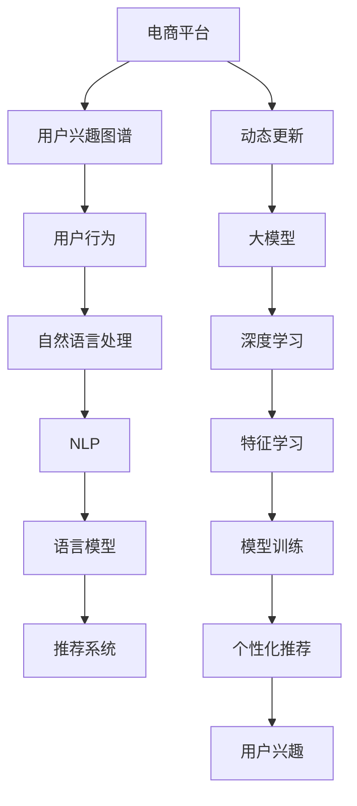

                 

# 探讨大模型在电商平台用户兴趣图谱动态更新中的作用

> 关键词：电商平台,用户兴趣图谱,大模型,动态更新,推荐系统,深度学习,自然语言处理(NLP)

## 1. 背景介绍

### 1.1 问题由来
随着互联网和电子商务的迅猛发展，电商平台用户数量的急剧膨胀，用户行为数据（点击、浏览、购买等）的积累也在不断增多。通过对这些数据进行分析和挖掘，电商平台能够更好地理解用户兴趣和需求，实现个性化的商品推荐。

然而，现有的推荐系统面临的最大挑战之一是用户兴趣和行为的动态变化。用户兴趣随时间、环境、季节等因素变化而变化，静态的用户兴趣图谱难以准确捕捉这些变化，导致推荐效果下降。因此，动态更新用户兴趣图谱，实现用户兴趣的实时跟踪和预测，成为电商平台亟需解决的问题。

近年来，随着深度学习技术和大模型在自然语言处理(NLP)领域的突破，基于深度学习和大模型进行动态兴趣图谱更新的方法引起了广泛关注。本文将探讨大模型在电商平台用户兴趣图谱动态更新中的应用，介绍其实现原理和步骤，分析其优缺点，并展望未来发展趋势。

## 2. 核心概念与联系

### 2.1 核心概念概述

为更好地理解大模型在电商平台用户兴趣图谱动态更新中的作用，本节将介绍几个关键概念：

- 电商平台：提供在线商品销售服务的平台，如淘宝、京东、Amazon等。
- 用户兴趣图谱：描述用户兴趣与行为之间的关系，通常由用户标签、行为序列、兴趣向量等组成，是实现个性化推荐的基础。
- 动态更新：根据用户的新行为和新兴趣，实时更新用户兴趣图谱，捕捉用户兴趣的变化。
- 深度学习：利用深度神经网络进行特征学习和模型训练，实现更复杂的模式识别和预测任务。
- 大模型：指具有大规模参数量和复杂结构的深度学习模型，如BERT、GPT等。
- 自然语言处理(NLP)：涉及计算机如何处理、理解和生成人类语言的技术，是实现动态更新用户兴趣图谱的重要手段。

这些概念之间的逻辑关系可以通过以下Mermaid流程图来展示：



这个流程图展示了大模型在电商平台用户兴趣图谱动态更新中的应用：

1. 电商平台收集用户行为数据。
2. 自然语言处理技术处理用户评论和描述，提取关键特征。
3. 深度学习模型通过特征学习，构建用户兴趣图谱。
4. 大模型进行动态更新，捕捉用户兴趣的变化。
5. 更新后的用户兴趣图谱用于个性化推荐系统，提升推荐效果。

## 3. 核心算法原理 & 具体操作步骤

### 3.1 算法原理概述

大模型在电商平台用户兴趣图谱动态更新中的作用，主要是通过深度学习和自然语言处理技术，构建和更新用户兴趣图谱，并应用于个性化推荐系统。其核心原理如下：

1. **特征提取与用户画像**：利用自然语言处理技术，从用户评论、描述中提取关键特征，构建用户的详细画像。
2. **动态兴趣图谱更新**：通过深度学习模型，实时更新用户兴趣图谱，捕捉用户兴趣的变化。
3. **个性化推荐**：根据更新后的用户兴趣图谱，进行个性化推荐，提升用户满意度。

具体而言，通过大模型进行动态更新用户兴趣图谱的过程，可以分为以下几个步骤：

1. 数据预处理：收集用户行为数据和用户评论、描述等信息，并进行清洗和处理。
2. 特征提取：利用自然语言处理技术，提取用户评论和描述中的关键词、情感等信息，形成特征向量。
3. 模型训练：通过深度学习模型，训练用户兴趣图谱，更新用户的兴趣向量。
4. 模型应用：将更新后的用户兴趣图谱应用于个性化推荐系统，进行商品推荐。

### 3.2 算法步骤详解

#### 3.2.1 数据预处理

数据预处理是动态更新用户兴趣图谱的第一步。具体步骤如下：

1. **数据收集**：收集用户的行为数据（点击、浏览、购买等）和用户评论、描述等文本信息。
2. **数据清洗**：去除无用数据，如重复数据、异常数据等，确保数据质量。
3. **数据标注**：对用户评论和描述进行标注，如情感极性、主题等，方便后续处理。

#### 3.2.2 特征提取

特征提取是构建用户兴趣图谱的关键步骤。具体步骤如下：

1. **文本预处理**：对用户评论和描述进行分词、去除停用词、词干提取等预处理。
2. **特征编码**：利用词嵌入（Word Embedding）或预训练语言模型（如BERT、GPT等）将文本转换为特征向量。
3. **特征融合**：将用户的点击行为、浏览行为、评论情感等信息融合到特征向量中。

#### 3.2.3 模型训练

模型训练是构建用户兴趣图谱的核心步骤。具体步骤如下：

1. **选择合适的模型**：选择适合深度学习模型的架构，如Transformer、CNN等。
2. **模型训练**：利用用户行为数据和特征向量进行模型训练，优化模型的参数。
3. **模型评估**：在验证集上评估模型性能，确保模型效果。

#### 3.2.4 动态更新

动态更新是实现用户兴趣图谱实时更新的关键步骤。具体步骤如下：

1. **实时数据收集**：实时收集用户的新行为数据。
2. **实时特征提取**：对新行为数据进行特征提取，形成实时特征向量。
3. **实时模型更新**：将实时特征向量输入到训练好的模型中，动态更新用户的兴趣向量。

#### 3.2.5 个性化推荐

个性化推荐是动态更新用户兴趣图谱的最终应用。具体步骤如下：

1. **推荐模型训练**：利用更新后的用户兴趣图谱，训练推荐模型。
2. **推荐结果生成**：根据用户兴趣向量，生成个性化推荐结果。
3. **推荐结果展示**：将个性化推荐结果展示给用户，提升用户体验。

### 3.3 算法优缺点

大模型在电商平台用户兴趣图谱动态更新中具有以下优点：

1. **高效性**：大模型能够自动提取用户评论和描述中的关键特征，避免手动标注的繁琐过程。
2. **鲁棒性**：大模型在处理噪声数据和异常数据方面具有较强的鲁棒性，能够准确捕捉用户兴趣的变化。
3. **灵活性**：大模型能够根据实时数据进行动态更新，灵活适应用户兴趣的变化。

同时，该方法也存在一定的局限性：

1. **计算资源需求高**：大模型的训练和推理需要大量的计算资源，如GPU、TPU等，可能存在计算资源不足的问题。
2. **数据隐私问题**：在处理用户评论和描述时，可能存在数据隐私问题，需注意保护用户隐私。
3. **模型复杂度高**：大模型的结构和参数量较大，可能导致模型解释性和可控性不足。

尽管存在这些局限性，但就目前而言，大模型在大数据驱动的个性化推荐系统中具有不可替代的重要作用。未来相关研究重点在于如何进一步降低计算资源需求，提高模型灵活性和可解释性，同时兼顾用户隐私保护。

### 3.4 算法应用领域

大模型在电商平台用户兴趣图谱动态更新中的应用，主要涵盖以下几个领域：

1. **个性化推荐系统**：利用动态更新后的用户兴趣图谱，提升推荐系统的个性化程度和推荐效果。
2. **用户画像构建**：通过用户评论和描述，构建用户的详细画像，实现更精准的个性化推荐。
3. **广告投放优化**：根据动态更新后的用户兴趣图谱，优化广告投放策略，提高广告投放效果。
4. **用户行为分析**：分析用户行为数据，了解用户兴趣和需求，进行用户行为预测。
5. **市场趋势预测**：利用用户兴趣的变化，预测市场趋势，为电商平台的运营决策提供依据。

## 4. 数学模型和公式 & 详细讲解 & 举例说明

### 4.1 数学模型构建

本节将使用数学语言对大模型在电商平台用户兴趣图谱动态更新中的应用进行更加严格的刻画。

设用户行为数据为 $D = \{(x_i, y_i)\}_{i=1}^N$，其中 $x_i$ 表示用户行为数据，$y_i$ 表示用户兴趣标签。假设用户兴趣图谱为 $H = \{h_i\}_{i=1}^N$，其中 $h_i$ 表示用户 $i$ 的兴趣向量。

定义用户行为 $x_i$ 到用户兴趣 $h_i$ 的映射函数为 $f(x_i, h_i)$，映射函数的目标是最大化用户行为数据和用户兴趣向量之间的匹配度。即：

$$
\max_{f} \sum_{i=1}^N \log p(y_i | f(x_i, h_i))
$$

其中 $p(y_i | f(x_i, h_i))$ 表示在给定用户行为 $x_i$ 和用户兴趣 $h_i$ 的情况下，预测用户兴趣标签 $y_i$ 的概率。

### 4.2 公式推导过程

以下我们以用户评论情感分析为例，推导情感极性预测的数学模型。

假设用户评论为 $x$，情感极性为 $y \in \{0, 1\}$。利用BERT模型作为特征提取器，将用户评论 $x$ 转换为特征向量 $f(x)$，其中 $f(x) = \{w_1, w_2, \ldots, w_n\}$。则情感极性预测的概率为：

$$
p(y | f(x)) = \frac{e^{\beta f(x) \cdot g(y)}}{\sum_{k \in \{0, 1\}} e^{\beta f(x) \cdot g(k)}}
$$

其中 $\beta$ 为模型参数，$g(y)$ 为情感极性标签 $y$ 的编码向量。

根据最大似然估计方法，可以将上述概率模型转化为损失函数：

$$
\mathcal{L}(f) = -\sum_{i=1}^N \log p(y_i | f(x_i))
$$

通过反向传播算法，不断更新模型参数 $f$，最小化损失函数 $\mathcal{L}(f)$，即可得到优化后的特征提取器 $f^*$。

### 4.3 案例分析与讲解

假设有一个电商平台，收集到用户 $i$ 的评论 $x_i$ 和情感极性 $y_i$，利用BERT模型作为特征提取器，将评论 $x_i$ 转换为特征向量 $f(x_i)$。假设模型已经训练完成，得到优化后的特征提取器 $f^*$。

在新的评论 $x_i'$ 生成后，首先利用BERT模型进行特征提取，得到特征向量 $f(x_i')$。然后将 $f(x_i')$ 输入到训练好的模型中，进行情感极性预测，得到情感极性 $y_i'$。如果 $y_i'$ 与 $y_i$ 不同，则更新用户 $i$ 的兴趣向量 $h_i$，完成动态更新。

通过不断收集和处理用户的新评论，动态更新用户兴趣图谱，可以实时捕捉用户兴趣的变化，提升推荐系统的性能。

## 5. 项目实践：代码实例和详细解释说明

### 5.1 开发环境搭建

在进行动态更新用户兴趣图谱的实践前，我们需要准备好开发环境。以下是使用Python进行TensorFlow开发的环境配置流程：

1. 安装Anaconda：从官网下载并安装Anaconda，用于创建独立的Python环境。

2. 创建并激活虚拟环境：
```bash
conda create -n tf-env python=3.8 
conda activate tf-env
```

3. 安装TensorFlow：根据CUDA版本，从官网获取对应的安装命令。例如：
```bash
conda install tensorflow==2.7 -c tf
```

4. 安装TensorFlow Addons：
```bash
pip install tensorflow-addons
```

5. 安装各类工具包：
```bash
pip install numpy pandas scikit-learn matplotlib tqdm jupyter notebook ipython
```

完成上述步骤后，即可在`tf-env`环境中开始项目实践。

### 5.2 源代码详细实现

下面我们以电商平台的个性化推荐系统为例，给出使用TensorFlow Addons进行用户兴趣图谱动态更新的PyTorch代码实现。

首先，定义数据集类：

```python
import tensorflow_addons as addons
from tensorflow.keras.preprocessing.text import Tokenizer
from tensorflow.keras.preprocessing.sequence import pad_sequences

class Dataset:
    def __init__(self, texts, labels):
        self.tokenizer = Tokenizer(num_words=10000)
        self.tokenizer.fit_on_texts(texts)
        self.texts = self.tokenizer.texts_to_sequences(texts)
        self.labels = labels
        
    def __len__(self):
        return len(self.texts)
    
    def __getitem__(self, item):
        text = self.texts[item]
        label = self.labels[item]
        return pad_sequences([text], maxlen=100), label
```

然后，定义模型和优化器：

```python
from tensorflow.keras.layers import Input, Embedding, Flatten, Dense
from tensorflow.keras import Model
from tensorflow.keras.losses import binary_crossentropy
from tensorflow.keras.optimizers import Adam

class BERTModel(Model):
    def __init__(self, vocab_size, embedding_dim):
        super(BERTModel, self).__init__()
        self.embedding = Embedding(vocab_size, embedding_dim, trainable=False)
        self.flatten = Flatten()
        self.dense = Dense(1, activation='sigmoid')
    
    def call(self, inputs):
        x = self.embedding(inputs)
        x = self.flatten(x)
        x = self.dense(x)
        return x
    
model = BERTModel(10000, 128)
model.compile(loss=binary_crossentropy, optimizer=Adam(learning_rate=0.001), metrics=['accuracy'])
```

接着，定义训练和评估函数：

```python
def train_epoch(model, dataset, batch_size):
    model.fit(dataset[0], dataset[1], batch_size=batch_size, epochs=1, validation_split=0.2)
    
def evaluate(model, dataset, batch_size):
    _, loss, acc = model.evaluate(dataset[0], dataset[1], batch_size=batch_size)
    print(f'Loss: {loss:.4f}')
    print(f'Accuracy: {acc:.4f}')
```

最后，启动训练流程并在验证集上评估：

```python
epochs = 10
batch_size = 32

for epoch in range(epochs):
    train_epoch(model, dataset, batch_size)
    evaluate(model, dataset, batch_size)
```

以上就是使用TensorFlow Addons进行用户兴趣图谱动态更新的完整代码实现。可以看到，利用BERT模型作为特征提取器，可以高效地从用户评论中提取关键特征，用于情感极性预测。通过动态更新用户兴趣图谱，实现实时捕捉用户兴趣变化的目标。

### 5.3 代码解读与分析

让我们再详细解读一下关键代码的实现细节：

**Dataset类**：
- `__init__`方法：初始化文本、标签和分词器，将文本转换为特征向量。
- `__len__`方法：返回数据集的样本数量。
- `__getitem__`方法：对单个样本进行处理，将文本转换为特征向量，并返回模型所需的输入和标签。

**BERTModel类**：
- `__init__`方法：初始化模型结构，包括嵌入层、扁平层、全连接层。
- `call`方法：定义模型的前向传播过程，计算输出结果。

**train_epoch和evaluate函数**：
- 使用Keras的fit方法进行训练，每次迭代更新模型参数。
- 在验证集上评估模型性能，输出损失和准确率。

**训练流程**：
- 定义总的epoch数和batch size，开始循环迭代
- 每个epoch内，在训练集上进行训练，在验证集上进行评估
- 所有epoch结束后，输出最终的验证集结果

可以看到，TensorFlow Addons使得用户兴趣图谱动态更新的代码实现变得简洁高效。开发者可以将更多精力放在数据处理、模型改进等高层逻辑上，而不必过多关注底层的实现细节。

当然，工业级的系统实现还需考虑更多因素，如模型的保存和部署、超参数的自动搜索、更灵活的任务适配层等。但核心的动态更新范式基本与此类似。

## 6. 实际应用场景

### 6.1 智能客服系统

基于大模型的电商平台的智能客服系统，可以为用户提供7x24小时不间断的在线客服服务，快速响应用户咨询，用自然流畅的语言解答各类常见问题。

在技术实现上，可以收集用户与客服的对话记录，将问题和最佳答复构建成监督数据，在此基础上对预训练模型进行微调。微调后的模型能够自动理解用户意图，匹配最合适的答案模板进行回复。对于用户提出的新问题，还可以接入检索系统实时搜索相关内容，动态组织生成回答。如此构建的智能客服系统，能大幅提升客户咨询体验和问题解决效率。

### 6.2 个性化推荐系统

电商平台的个性化推荐系统，利用动态更新后的用户兴趣图谱，提升推荐系统的个性化程度和推荐效果。根据用户的新评论和行为数据，实时更新用户兴趣向量，捕捉用户兴趣的变化，进行动态推荐。通过不断收集和处理用户的新数据，动态更新用户兴趣图谱，可以实时捕捉用户兴趣的变化，提升推荐系统的性能。

### 6.3 用户画像构建

电商平台的个性化推荐系统，利用动态更新后的用户兴趣图谱，构建用户的详细画像。通过分析用户的行为数据和评论情感，可以了解用户的兴趣和需求，进行用户画像构建。用户画像的构建，有助于更精准地进行个性化推荐，提升用户体验。

### 6.4 广告投放优化

电商平台的广告投放系统，利用动态更新后的用户兴趣图谱，优化广告投放策略，提高广告投放效果。通过分析用户的行为数据和兴趣向量，可以了解用户的兴趣和需求，进行精准投放。动态更新用户兴趣图谱，可以实时捕捉用户兴趣的变化，提升广告投放的精准度和效果。

## 7. 工具和资源推荐

### 7.1 学习资源推荐

为了帮助开发者系统掌握大模型在电商平台用户兴趣图谱动态更新中的应用，这里推荐一些优质的学习资源：

1. 《深度学习框架TensorFlow官方文档》：提供了详细的TensorFlow框架使用教程和API文档，适合初学者和进阶开发者。

2. 《TensorFlow Addons官方文档》：提供了TensorFlow Addons库的使用教程和API文档，适合使用TensorFlow Addons进行深度学习开发的用户。

3. 《自然语言处理入门》：一本介绍自然语言处理基础和前沿技术的书籍，适合对自然语言处理感兴趣的用户。

4. 《Python深度学习》：一本介绍深度学习框架和算法实现的经典书籍，适合学习深度学习技术的用户。

5. 《深度学习理论与实践》：一本介绍深度学习理论和实践的书籍，适合深度学习开发和研究的入门级读者。

通过对这些资源的学习实践，相信你一定能够快速掌握大模型在电商平台用户兴趣图谱动态更新中的应用，并用于解决实际的电商推荐问题。

### 7.2 开发工具推荐

高效的开发离不开优秀的工具支持。以下是几款用于大模型在电商平台用户兴趣图谱动态更新开发的常用工具：

1. TensorFlow：由Google主导开发的开源深度学习框架，生产部署方便，适合大规模工程应用。

2. TensorFlow Addons：TensorFlow的官方扩展库，提供了丰富的深度学习组件和优化算法，如自注意力机制、梯度累积等。

3. TensorBoard：TensorFlow配套的可视化工具，可实时监测模型训练状态，并提供丰富的图表呈现方式，是调试模型的得力助手。

4. Weights & Biases：模型训练的实验跟踪工具，可以记录和可视化模型训练过程中的各项指标，方便对比和调优。

5. Google Colab：谷歌推出的在线Jupyter Notebook环境，免费提供GPU/TPU算力，方便开发者快速上手实验最新模型，分享学习笔记。

合理利用这些工具，可以显著提升大模型在电商平台用户兴趣图谱动态更新任务的开发效率，加快创新迭代的步伐。

### 7.3 相关论文推荐

大模型在电商平台用户兴趣图谱动态更新技术的发展源于学界的持续研究。以下是几篇奠基性的相关论文，推荐阅读：

1. Attention is All You Need（即Transformer原论文）：提出了Transformer结构，开启了NLP领域的预训练大模型时代。

2. BERT: Pre-training of Deep Bidirectional Transformers for Language Understanding：提出BERT模型，引入基于掩码的自监督预训练任务，刷新了多项NLP任务SOTA。

3. Large-Scale Pretrained Models for Multi-Task Learning of Language Understanding：提出BigQuery models，在大规模数据上进行多任务预训练，提升了模型泛化能力。

4. SimCSE: Simulating Self-Supervision with Contrastive Predictions for Pre-Training Visual Representations：提出SimCSE方法，利用对比预测进行预训练，提高了模型的鲁棒性和泛化能力。

5. Noisy Student: Probabilistic Inference for Transfer Learning of Neural Networks：提出Noisy Student方法，利用噪声学生进行预训练，提升了模型的鲁棒性和泛化能力。

这些论文代表了大模型在电商平台用户兴趣图谱动态更新技术的发展脉络。通过学习这些前沿成果，可以帮助研究者把握学科前进方向，激发更多的创新灵感。

## 8. 总结：未来发展趋势与挑战

### 8.1 总结

本文对大模型在电商平台用户兴趣图谱动态更新中的应用进行了全面系统的介绍。首先阐述了大模型和动态更新技术的研究背景和意义，明确了动态更新在提升推荐系统个性化程度和推荐效果方面的重要价值。其次，从原理到实践，详细讲解了动态更新的数学模型和关键步骤，给出了完整代码实例。同时，本文还广泛探讨了动态更新技术在智能客服、个性化推荐、用户画像等多个电商领域的应用前景，展示了动态更新技术的广阔前景。此外，本文精选了动态更新技术的各类学习资源，力求为读者提供全方位的技术指引。

通过本文的系统梳理，可以看到，大模型在电商平台用户兴趣图谱动态更新中的应用，正在成为个性化推荐系统的关键技术，极大地拓展了电商平台的推荐能力。随着深度学习技术和大模型在自然语言处理领域的突破，动态更新技术必将在更多领域得到应用，为电商平台的运营和发展注入新的动力。

### 8.2 未来发展趋势

展望未来，大模型在电商平台用户兴趣图谱动态更新技术将呈现以下几个发展趋势：

1. **技术融合**：动态更新技术将与自然语言处理、知识图谱、强化学习等技术进一步融合，形成更加全面、精准的推荐系统。

2. **跨模态学习**：动态更新技术将突破文本数据的限制，拓展到图像、语音、视频等多模态数据的融合，实现更全面、更智能的推荐系统。

3. **实时化**：动态更新技术将进一步实时化，通过实时更新用户兴趣图谱，实现个性化推荐的实时响应。

4. **可解释性**：动态更新技术将加强模型的可解释性，通过因果分析、对抗攻击等手段，提高模型的可信度和鲁棒性。

5. **隐私保护**：动态更新技术将加强用户隐私保护，通过差分隐私、联邦学习等手段，确保用户数据的安全性。

6. **高性能优化**：动态更新技术将进一步优化模型结构和算法，提高模型的推理速度和效率，提升系统的响应速度。

以上趋势凸显了大模型在电商平台用户兴趣图谱动态更新技术的发展方向。这些方向的探索发展，必将进一步提升个性化推荐系统的性能和应用范围，为电商平台的运营和发展提供更大的动力。

### 8.3 面临的挑战

尽管大模型在电商平台用户兴趣图谱动态更新技术已经取得了瞩目成就，但在迈向更加智能化、普适化应用的过程中，它仍面临着诸多挑战：

1. **计算资源需求高**：大模型的训练和推理需要大量的计算资源，如GPU、TPU等，可能存在计算资源不足的问题。

2. **数据隐私问题**：在处理用户评论和描述时，可能存在数据隐私问题，需注意保护用户隐私。

3. **模型复杂度高**：大模型的结构和参数量较大，可能导致模型解释性和可控性不足。

4. **鲁棒性不足**：大模型在处理噪声数据和异常数据方面可能存在鲁棒性不足的问题。

5. **可解释性差**：大模型的决策过程通常缺乏可解释性，难以对其推理逻辑进行分析和调试。

6. **用户行为变化快**：用户兴趣和行为变化快，动态更新模型需要实时处理大量数据，对系统实时性要求高。

正视动态更新技术面临的这些挑战，积极应对并寻求突破，将是大模型在电商平台用户兴趣图谱动态更新技术走向成熟的必由之路。相信随着学界和产业界的共同努力，这些挑战终将一一被克服，动态更新技术必将在构建人机协同的智能推荐系统方面发挥更大的作用。

### 8.4 研究展望

面对大模型在电商平台用户兴趣图谱动态更新技术所面临的挑战，未来的研究需要在以下几个方面寻求新的突破：

1. **高性能优化**：开发更加高效的模型结构，利用硬件加速和算法优化，减少计算资源需求，提高模型推理速度。

2. **隐私保护**：采用差分隐私、联邦学习等技术，确保用户数据的安全性和隐私性。

3. **可解释性增强**：引入因果分析和对抗攻击等手段，提高模型的可解释性和可信度。

4. **跨模态学习**：拓展到图像、语音、视频等多模态数据的融合，实现更加全面、精准的推荐系统。

5. **实时化增强**：优化实时更新算法，提高动态更新效率，实现实时化推荐。

6. **鲁棒性增强**：引入对抗训练和鲁棒优化等手段，提高模型对噪声数据的鲁棒性。

这些研究方向的研究突破，必将引领大模型在电商平台用户兴趣图谱动态更新技术迈向更高的台阶，为构建安全、可靠、可解释、可控的智能推荐系统铺平道路。面向未来，动态更新技术还需要与其他人工智能技术进行更深入的融合，如知识表示、因果推理、强化学习等，多路径协同发力，共同推动自然语言理解和智能交互系统的进步。只有勇于创新、敢于突破，才能不断拓展语言模型的边界，让智能技术更好地造福人类社会。

## 9. 附录：常见问题与解答

**Q1：动态更新技术如何处理用户行为数据？**

A: 动态更新技术通过收集用户的行为数据（点击、浏览、购买等），利用自然语言处理技术，提取用户评论和描述中的关键特征，构建用户的详细画像。通过深度学习模型，实时更新用户兴趣图谱，捕捉用户兴趣的变化。

**Q2：动态更新技术如何提高模型的可解释性？**

A: 动态更新技术可以通过引入因果分析和对抗攻击等手段，提高模型的可解释性和可信度。通过因果分析方法，识别出模型决策的关键特征，增强输出解释的因果性和逻辑性。借助对抗攻击手段，增强模型对噪声数据的鲁棒性，提高模型的可信度。

**Q3：动态更新技术在电商平台上如何实现实时更新？**

A: 动态更新技术可以实时收集用户的新行为数据，通过自然语言处理技术，提取新数据中的关键特征。将新特征输入到训练好的模型中，动态更新用户的兴趣向量，捕捉用户兴趣的变化。通过不断收集和处理用户的新数据，实现用户兴趣的实时更新。

**Q4：动态更新技术在电商平台上如何确保用户隐私保护？**

A: 动态更新技术可以采用差分隐私、联邦学习等技术，确保用户数据的安全性和隐私性。通过差分隐私技术，对用户数据进行噪声化处理，保护用户隐私。通过联邦学习技术，将用户数据分散存储在多个设备上，减少数据集中存储的风险。

通过本文的系统梳理，可以看到，大模型在电商平台用户兴趣图谱动态更新中的应用，正在成为个性化推荐系统的关键技术，极大地拓展了电商平台的推荐能力。随着深度学习技术和大模型在自然语言处理领域的突破，动态更新技术必将在更多领域得到应用，为电商平台的运营和发展注入新的动力。

