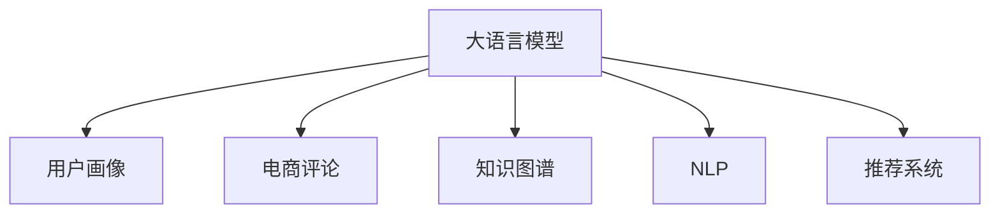

                 

## 1. 背景介绍

### 1.1 问题由来

随着电商平台的快速发展，用户画像的构建已成为电商平台用户增长和营销决策的关键环节。传统的用户画像构建方法，如用户行为数据分析、调查问卷等，往往难以全面、准确地刻画用户特征，且数据收集成本高、响应速度慢。为了更好地理解用户需求和行为，电商平台开始探索利用AI技术，特别是大语言模型，进行用户画像构建。

### 1.2 问题核心关键点

大语言模型在用户画像构建中，主要通过以下方式发挥作用：

- **理解用户意图**：通过分析用户在电商平台上留下的评论、搜索记录、购物车内容等文本数据，理解用户的购物需求和偏好。
- **生成个性化推荐**：基于用户的语义信息，生成个性化的商品推荐，提升用户体验和满意度。
- **实时调整用户策略**：通过持续学习用户的反馈和行为变化，动态调整推荐策略，提高个性化推荐的准确性。
- **构建知识图谱**：将用户的兴趣、行为等信息，转化为知识图谱，方便模型进行推理和分析。

这些核心点使得大语言模型在电商平台用户画像构建中具备了独特优势，能够在复杂多变的电商环境中，提供精准、高效、灵活的用户画像服务。

## 2. 核心概念与联系

### 2.1 核心概念概述

为更好地理解大语言模型在用户画像构建中的作用，本节将介绍几个关键概念：

- **大语言模型(Large Language Model, LLM)**：指预训练在大量文本数据上的深度神经网络模型，具有强大的语言理解和生成能力。
- **用户画像(User Profile)**：指通过分析用户行为、历史数据等信息，构建的用户特征集，用于理解用户需求和行为。
- **电商评论(E-commerce Reviews)**：指用户在电商平台上留下的评论、评分等文本数据。
- **知识图谱(Knowledge Graph)**：指由实体、关系和属性组成的有向图，用于表示实体间的语义关系。
- **自然语言处理(Natural Language Processing, NLP)**：指计算机科学和人工智能领域中关于自然语言处理技术的总称，涉及文本预处理、分词、命名实体识别、情感分析等多个方向。
- **推荐系统(Recommendation System)**：指通过分析用户行为数据，推荐用户可能感兴趣的商品或内容的系统。

这些概念之间的逻辑关系可以通过以下Mermaid流程图来展示：



这个流程图展示了大语言模型与其他核心概念的相互联系和作用：

1. 大语言模型通过分析电商评论，理解用户意图。
2. 用户画像通过大语言模型生成，刻画用户特征。
3. 知识图谱通过大语言模型构建，支撑用户画像的推理分析。
4. NLP技术辅助大语言模型进行文本处理，提升语义理解能力。
5. 推荐系统结合用户画像，生成个性化推荐，改善用户体验。

## 3. 核心算法原理 & 具体操作步骤

### 3.1 算法原理概述

大语言模型在用户画像构建中的主要工作原理如下：

1. **语义理解**：通过大语言模型对电商评论文本进行分析，理解用户的购物需求和偏好。
2. **实体识别**：利用命名实体识别技术，识别评论中的关键实体，如品牌、商品、颜色等。
3. **情感分析**：通过情感分析技术，判断评论的情感倾向，如正面、负面、中性。
4. **知识图谱构建**：将用户评论中的实体和关系信息，构建为知识图谱，用于更深入的分析。
5. **个性化推荐**：基于用户画像和知识图谱，生成个性化推荐内容。
6. **持续学习**：通过持续学习用户反馈，动态调整推荐策略。

### 3.2 算法步骤详解

#### 3.2.1 电商评论的预处理

电商评论的预处理是构建用户画像的基础，主要包括以下几个步骤：

1. **文本清洗**：去除文本中的停用词、标点符号、URL等无关信息。
2. **分词**：将文本进行分词，转化为模型可处理的序列形式。
3. **标准化**：统一不同用户的输入格式，如统一大小写、缩写等。
4. **归一化**：将用户评论转化为标准化的向量形式，便于模型处理。

#### 3.2.2 语义理解与实体识别

基于大语言模型，对电商评论进行语义理解与实体识别，主要步骤如下：

1. **语义理解**：通过大语言模型分析评论，理解用户的购物需求和偏好。
2. **实体识别**：利用命名实体识别技术，识别评论中的品牌、商品、颜色等关键实体。
3. **情感分析**：通过情感分析技术，判断评论的情感倾向。

#### 3.2.3 知识图谱构建

将电商评论中的实体和关系信息构建为知识图谱，主要步骤如下：

1. **实体抽取**：从评论中抽取品牌、商品、颜色等实体。
2. **关系抽取**：识别评论中实体之间的关系，如“购买”、“喜欢”等。
3. **图谱构建**：将实体和关系信息，构建为知识图谱，用于更深入的分析。

#### 3.2.4 个性化推荐生成

基于用户画像和知识图谱，生成个性化推荐内容，主要步骤如下：

1. **用户画像构建**：通过大语言模型分析电商评论，构建用户画像，刻画用户特征。
2. **推荐模型训练**：利用用户画像和知识图谱，训练推荐模型。
3. **推荐生成**：根据用户画像和知识图谱，生成个性化推荐内容。

#### 3.2.5 持续学习与优化

通过持续学习用户反馈，动态调整推荐策略，主要步骤如下：

1. **反馈收集**：收集用户对推荐内容的反馈信息。
2. **模型调整**：根据用户反馈，调整推荐模型。
3. **性能评估**：评估推荐模型性能，确保推荐内容的准确性。

### 3.3 算法优缺点

基于大语言模型的用户画像构建方法，具有以下优点：

1. **全面性**：能够从用户评论中全面、准确地理解用户需求和行为。
2. **高效性**：能够快速生成个性化推荐，提升用户体验。
3. **灵活性**：能够动态调整推荐策略，适应用户需求变化。
4. **可扩展性**：能够处理大规模数据，适应电商平台的实际需求。

同时，该方法也存在以下缺点：

1. **数据依赖**：依赖电商评论数据的质量和数量，数据获取成本高。
2. **泛化能力不足**：对特定领域的用户评论，模型泛化能力可能有限。
3. **解释性不足**：推荐模型输出缺乏可解释性，难以理解推荐逻辑。
4. **计算成本高**：大规模电商评论数据处理和分析，计算成本较高。

### 3.4 算法应用领域

基于大语言模型的用户画像构建方法，在电商平台的多个应用场景中均有应用，例如：

1. **个性化推荐**：根据用户评论，生成个性化商品推荐，提升用户体验。
2. **用户行为分析**：分析用户行为数据，识别用户的购买偏好和行为模式。
3. **用户反馈分析**：通过分析用户评论，了解用户对产品和服务的反馈，指导产品优化。
4. **营销策略制定**：结合用户画像和知识图谱，制定精准的营销策略，提升用户转化率。
5. **广告投放优化**：通过分析用户评论，优化广告投放策略，提高广告投放效果。

## 4. 数学模型和公式 & 详细讲解 & 举例说明

### 4.1 数学模型构建

假设电商评论数据集为 $D=\{(x_i,y_i)\}_{i=1}^N, x_i \in \mathcal{X}, y_i \in \mathcal{Y}$，其中 $x_i$ 为电商评论，$y_i$ 为用户的情感倾向。

定义模型 $M_{\theta}$ 在输入 $x_i$ 上的输出为 $\hat{y}=M_{\theta}(x_i) \in [0,1]$，表示用户情感倾向预测概率。

定义模型 $M_{\theta}$ 在电商评论数据集 $D$ 上的经验风险为：

$$
\mathcal{L}(\theta) = \frac{1}{N} \sum_{i=1}^N \ell(M_{\theta}(x_i),y_i)
$$

其中 $\ell$ 为损失函数，常用的有交叉熵损失、均方误差损失等。

在得到损失函数的梯度后，即可带入参数更新公式，完成模型的迭代优化。

### 4.2 公式推导过程

以下我们以情感分析为例，推导大语言模型在电商评论数据集上进行情感分析的过程。

假设模型 $M_{\theta}$ 在输入 $x_i$ 上的输出为 $\hat{y}=M_{\theta}(x_i) \in [0,1]$，表示用户情感倾向预测概率。真实标签 $y_i \in \{0,1\}$。则二分类交叉熵损失函数定义为：

$$
\ell(M_{\theta}(x_i),y_i) = -[y_i\log \hat{y} + (1-y_i)\log (1-\hat{y})]
$$

将其代入经验风险公式，得：

$$
\mathcal{L}(\theta) = -\frac{1}{N}\sum_{i=1}^N [y_i\log M_{\theta}(x_i)+(1-y_i)\log(1-M_{\theta}(x_i))]
$$

根据链式法则，损失函数对参数 $\theta_k$ 的梯度为：

$$
\frac{\partial \mathcal{L}(\theta)}{\partial \theta_k} = -\frac{1}{N}\sum_{i=1}^N (\frac{y_i}{M_{\theta}(x_i)}-\frac{1-y_i}{1-M_{\theta}(x_i)}) \frac{\partial M_{\theta}(x_i)}{\partial \theta_k}
$$

其中 $\frac{\partial M_{\theta}(x_i)}{\partial \theta_k}$ 可进一步递归展开，利用自动微分技术完成计算。

在得到损失函数的梯度后，即可带入参数更新公式，完成模型的迭代优化。重复上述过程直至收敛，最终得到适应电商评论情感分析任务的最优模型参数 $\theta^*$。

### 4.3 案例分析与讲解

**案例1：情感分析**

假设有一批电商评论数据集 $D=\{(x_i,y_i)\}_{i=1}^N$，其中 $x_i$ 为电商评论，$y_i \in \{0,1\}$ 为情感倾向，0表示负面，1表示正面。

在实际应用中，可以按照以下步骤进行情感分析：

1. **数据预处理**：将电商评论数据集进行清洗和标准化处理。
2. **模型选择**：选择预训练语言模型，如BERT、GPT等。
3. **微调训练**：在电商评论数据集上微调预训练模型，得到情感分析模型 $M_{\theta}$。
4. **情感预测**：利用情感分析模型对新电商评论进行情感倾向预测，生成用户画像中的情感信息。

**案例2：个性化推荐**

假设有一批电商评论数据集 $D=\{(x_i,y_i)\}_{i=1}^N$，其中 $x_i$ 为电商评论，$y_i$ 为用户的情感倾向。

在实际应用中，可以按照以下步骤进行个性化推荐：

1. **数据预处理**：将电商评论数据集进行清洗和标准化处理。
2. **用户画像构建**：利用情感分析模型，对电商评论数据集进行情感分析，构建用户画像。
3. **推荐模型训练**：选择推荐模型，如协同过滤、基于内容的推荐等，在用户画像上进行训练。
4. **推荐生成**：利用推荐模型，生成个性化推荐内容，提供给用户。

## 5. 项目实践：代码实例和详细解释说明

### 5.1 开发环境搭建

在进行用户画像构建实践前，我们需要准备好开发环境。以下是使用Python进行PyTorch开发的环境配置流程：

1. 安装Anaconda：从官网下载并安装Anaconda，用于创建独立的Python环境。

2. 创建并激活虚拟环境：
```bash
conda create -n pytorch-env python=3.8 
conda activate pytorch-env
```

3. 安装PyTorch：根据CUDA版本，从官网获取对应的安装命令。例如：
```bash
conda install pytorch torchvision torchaudio cudatoolkit=11.1 -c pytorch -c conda-forge
```

4. 安装Transformers库：
```bash
pip install transformers
```

5. 安装各类工具包：
```bash
pip install numpy pandas scikit-learn matplotlib tqdm jupyter notebook ipython
```

完成上述步骤后，即可在`pytorch-env`环境中开始用户画像构建实践。

### 5.2 源代码详细实现

这里我们以情感分析为例，给出使用Transformers库对BERT模型进行电商评论情感分析的PyTorch代码实现。

首先，定义情感分析任务的数据处理函数：

```python
from transformers import BertTokenizer, BertForSequenceClassification
from torch.utils.data import Dataset
import torch

class ReviewsDataset(Dataset):
    def __init__(self, texts, labels, tokenizer, max_len=128):
        self.texts = texts
        self.labels = labels
        self.tokenizer = tokenizer
        self.max_len = max_len
        
    def __len__(self):
        return len(self.texts)
    
    def __getitem__(self, item):
        text = self.texts[item]
        label = self.labels[item]
        
        encoding = self.tokenizer(text, return_tensors='pt', max_length=self.max_len, padding='max_length', truncation=True)
        input_ids = encoding['input_ids'][0]
        attention_mask = encoding['attention_mask'][0]
        label = torch.tensor(label, dtype=torch.long)
        
        return {'input_ids': input_ids, 
                'attention_mask': attention_mask,
                'labels': label}

# 标签与id的映射
label2id = {0: 0, 1: 1}
id2label = {v: k for k, v in label2id.items()}

# 创建dataset
tokenizer = BertTokenizer.from_pretrained('bert-base-cased')

train_dataset = ReviewsDataset(train_texts, train_labels, tokenizer)
dev_dataset = ReviewsDataset(dev_texts, dev_labels, tokenizer)
test_dataset = ReviewsDataset(test_texts, test_labels, tokenizer)
```

然后，定义模型和优化器：

```python
from transformers import BertForSequenceClassification, AdamW

model = BertForSequenceClassification.from_pretrained('bert-base-cased', num_labels=2)

optimizer = AdamW(model.parameters(), lr=2e-5)
```

接着，定义训练和评估函数：

```python
from torch.utils.data import DataLoader
from tqdm import tqdm
from sklearn.metrics import accuracy_score

device = torch.device('cuda') if torch.cuda.is_available() else torch.device('cpu')
model.to(device)

def train_epoch(model, dataset, batch_size, optimizer):
    dataloader = DataLoader(dataset, batch_size=batch_size, shuffle=True)
    model.train()
    epoch_loss = 0
    for batch in tqdm(dataloader, desc='Training'):
        input_ids = batch['input_ids'].to(device)
        attention_mask = batch['attention_mask'].to(device)
        labels = batch['labels'].to(device)
        model.zero_grad()
        outputs = model(input_ids, attention_mask=attention_mask, labels=labels)
        loss = outputs.loss
        epoch_loss += loss.item()
        loss.backward()
        optimizer.step()
    return epoch_loss / len(dataloader)

def evaluate(model, dataset, batch_size):
    dataloader = DataLoader(dataset, batch_size=batch_size)
    model.eval()
    preds, labels = [], []
    with torch.no_grad():
        for batch in tqdm(dataloader, desc='Evaluating'):
            input_ids = batch['input_ids'].to(device)
            attention_mask = batch['attention_mask'].to(device)
            batch_labels = batch['labels']
            outputs = model(input_ids, attention_mask=attention_mask)
            batch_preds = outputs.logits.argmax(dim=2).to('cpu').tolist()
            batch_labels = batch_labels.to('cpu').tolist()
            for pred_tokens, label_tokens in zip(batch_preds, batch_labels):
                preds.append(pred_tokens[0])
                labels.append(label_tokens[0])
                
    print(f'Accuracy: {accuracy_score(labels, preds):.4f}')
```

最后，启动训练流程并在测试集上评估：

```python
epochs = 5
batch_size = 16

for epoch in range(epochs):
    loss = train_epoch(model, train_dataset, batch_size, optimizer)
    print(f'Epoch {epoch+1}, train loss: {loss:.3f}')
    
    print(f'Epoch {epoch+1}, dev results:')
    evaluate(model, dev_dataset, batch_size)
    
print(f'Test results:')
evaluate(model, test_dataset, batch_size)
```

以上就是使用PyTorch对BERT进行电商评论情感分析的完整代码实现。可以看到，得益于Transformers库的强大封装，我们可以用相对简洁的代码完成BERT模型的加载和情感分析。

### 5.3 代码解读与分析

让我们再详细解读一下关键代码的实现细节：

**ReviewsDataset类**：
- `__init__`方法：初始化文本、标签、分词器等关键组件。
- `__len__`方法：返回数据集的样本数量。
- `__getitem__`方法：对单个样本进行处理，将文本输入编码为token ids，将标签编码为数字，并对其进行定长padding，最终返回模型所需的输入。

**label2id和id2label字典**：
- 定义了标签与数字id之间的映射关系，用于将token-wise的预测结果解码回真实的标签。

**训练和评估函数**：
- 使用PyTorch的DataLoader对数据集进行批次化加载，供模型训练和推理使用。
- 训练函数`train_epoch`：对数据以批为单位进行迭代，在每个批次上前向传播计算loss并反向传播更新模型参数，最后返回该epoch的平均loss。
- 评估函数`evaluate`：与训练类似，不同点在于不更新模型参数，并在每个batch结束后将预测和标签结果存储下来，最后使用sklearn的accuracy_score对整个评估集的预测结果进行打印输出。

**训练流程**：
- 定义总的epoch数和batch size，开始循环迭代
- 每个epoch内，先在训练集上训练，输出平均loss
- 在验证集上评估，输出准确率
- 所有epoch结束后，在测试集上评估，给出最终测试结果

可以看到，PyTorch配合Transformers库使得BERT情感分析的代码实现变得简洁高效。开发者可以将更多精力放在数据处理、模型改进等高层逻辑上，而不必过多关注底层的实现细节。

当然，工业级的系统实现还需考虑更多因素，如模型的保存和部署、超参数的自动搜索、更灵活的任务适配层等。但核心的微调范式基本与此类似。

## 6. 实际应用场景

### 6.1 智能客服系统

基于大语言模型用户画像构建的智能客服系统，可以为用户提供更加个性化的服务体验。传统客服系统往往依赖人工处理，效率低下且成本高。通过构建详细的用户画像，智能客服系统可以更快速、准确地理解用户需求，提供个性化回复，甚至引导用户完成自助服务，从而大幅提升客户满意度和用户体验。

在技术实现上，可以收集用户的历史聊天记录、购物记录、搜索记录等数据，利用大语言模型构建用户画像，刻画用户兴趣和行为特征。在客服对话过程中，根据用户画像生成个性化回复，并在用户反馈后动态调整回复策略，从而实现智能客服系统的高效运行。

### 6.2 个性化推荐系统

个性化推荐系统是电商平台用户画像构建的重要应用场景。通过分析用户的电商评论数据，生成个性化的商品推荐，能够显著提升用户的购买意愿和满意度。

在实践过程中，可以利用用户画像中的情感信息、行为特征等数据，训练推荐模型，生成个性化推荐内容。例如，通过协同过滤算法，推荐与用户评论相似的推荐商品；或者利用基于内容的推荐方法，根据用户评论中的商品属性，推荐相关商品。

### 6.3 营销策略制定

通过构建详细的用户画像，电商平台可以更好地制定精准的营销策略，提升用户转化率和销售额。利用情感分析、行为分析等技术，挖掘用户需求和行为特征，针对性地推送广告和优惠活动，从而提高营销效果。

例如，在电商平台上，可以通过分析用户评论中的情感倾向，识别出不同用户对不同商品的喜好，进而制定精准的广告投放策略。同时，通过行为分析，了解用户购买路径和决策因素，优化商品定价和促销策略，提升用户购买意愿。

## 7. 工具和资源推荐

### 7.1 学习资源推荐

为了帮助开发者系统掌握大语言模型在用户画像构建中的应用，这里推荐一些优质的学习资源：

1. 《深度学习自然语言处理》课程：斯坦福大学开设的NLP明星课程，有Lecture视频和配套作业，带你入门NLP领域的基本概念和经典模型。

2. CS224N《深度学习自然语言处理》书籍：Transformer库的作者所著，全面介绍了如何使用Transformer库进行NLP任务开发，包括微调在内的诸多范式。

3. 《Natural Language Processing with Transformers》书籍：Transformers库的官方文档，提供了海量预训练模型和完整的微调样例代码，是上手实践的必备资料。

4. 《Transformers for Natural Language Processing》博客：HuggingFace官方博客，深入浅出地介绍了Transformer原理、微调技术等前沿话题。

5. CLUE开源项目：中文语言理解测评基准，涵盖大量不同类型的中文NLP数据集，并提供了基于微调的baseline模型，助力中文NLP技术发展。

通过对这些资源的学习实践，相信你一定能够快速掌握大语言模型在用户画像构建中的应用，并用于解决实际的NLP问题。

### 7.2 开发工具推荐

高效的开发离不开优秀的工具支持。以下是几款用于大语言模型用户画像构建开发的常用工具：

1. PyTorch：基于Python的开源深度学习框架，灵活动态的计算图，适合快速迭代研究。大部分预训练语言模型都有PyTorch版本的实现。

2. TensorFlow：由Google主导开发的开源深度学习框架，生产部署方便，适合大规模工程应用。同样有丰富的预训练语言模型资源。

3. Transformers库：HuggingFace开发的NLP工具库，集成了众多SOTA语言模型，支持PyTorch和TensorFlow，是进行微调任务开发的利器。

4. Weights & Biases：模型训练的实验跟踪工具，可以记录和可视化模型训练过程中的各项指标，方便对比和调优。与主流深度学习框架无缝集成。

5. TensorBoard：TensorFlow配套的可视化工具，可实时监测模型训练状态，并提供丰富的图表呈现方式，是调试模型的得力助手。

6. Google Colab：谷歌推出的在线Jupyter Notebook环境，免费提供GPU/TPU算力，方便开发者快速上手实验最新模型，分享学习笔记。

合理利用这些工具，可以显著提升大语言模型用户画像构建任务的开发效率，加快创新迭代的步伐。

### 7.3 相关论文推荐

大语言模型在用户画像构建中的应用源于学界的持续研究。以下是几篇奠基性的相关论文，推荐阅读：

1. Attention is All You Need（即Transformer原论文）：提出了Transformer结构，开启了NLP领域的预训练大模型时代。

2. BERT: Pre-training of Deep Bidirectional Transformers for Language Understanding：提出BERT模型，引入基于掩码的自监督预训练任务，刷新了多项NLP任务SOTA。

3. Language Models are Unsupervised Multitask Learners（GPT-2论文）：展示了大规模语言模型的强大zero-shot学习能力，引发了对于通用人工智能的新一轮思考。

4. Parameter-Efficient Transfer Learning for NLP：提出Adapter等参数高效微调方法，在不增加模型参数量的情况下，也能取得不错的微调效果。

5. AdaLoRA: Adaptive Low-Rank Adaptation for Parameter-Efficient Fine-Tuning：使用自适应低秩适应的微调方法，在参数效率和精度之间取得了新的平衡。

这些论文代表了大语言模型用户画像构建技术的发展脉络。通过学习这些前沿成果，可以帮助研究者把握学科前进方向，激发更多的创新灵感。

## 8. 总结：未来发展趋势与挑战

### 8.1 研究成果总结

本文对大语言模型在电商平台用户画像构建中的应用进行了全面系统的介绍。首先阐述了大语言模型和用户画像的研究背景和意义，明确了用户画像在电商平台中的重要性和应用场景。其次，从原理到实践，详细讲解了大语言模型在用户画像构建中的作用和具体实现步骤，给出了微调任务开发的完整代码实例。同时，本文还探讨了用户画像构建在电商平台中的应用场景，展示了其广泛的应用前景。

### 8.2 未来发展趋势

展望未来，大语言模型用户画像构建技术将呈现以下几个发展趋势：

1. **多模态数据融合**：用户画像构建将不再局限于文本数据，将融合视觉、音频等多模态数据，提升对用户需求的全面理解。
2. **实时动态更新**：用户画像将实时动态更新，根据用户行为变化，及时调整推荐策略，提升个性化推荐的准确性。
3. **联邦学习**：利用联邦学习技术，保护用户隐私，在多方合作中构建用户画像。
4. **交互式用户画像**：构建交互式用户画像，实时捕捉用户需求，提升用户体验。
5. **基于因果推断的用户画像**：引入因果推断技术，增强用户画像的因果解释能力，提升推荐策略的鲁棒性。
6. **跨领域知识迁移**：将用户画像中的知识迁移到其他领域，提升多领域任务的泛化能力。

这些趋势将使得大语言模型用户画像构建技术更加全面、高效、灵活，为电商平台用户画像构建带来更广阔的应用前景。

### 8.3 面临的挑战

尽管大语言模型用户画像构建技术已经取得了显著成果，但在实际应用中仍面临以下挑战：

1. **隐私保护**：用户画像数据涉及用户隐私，如何在保护用户隐私的前提下，构建高质量的用户画像，仍是一个挑战。
2. **数据质量**：用户画像构建依赖于高质量的数据，数据的获取和处理成本高，且数据质量不稳定。
3. **算法复杂性**：大语言模型用户画像构建技术算法复杂，难以理解和调试，需要更多工程实践的优化。
4. **技术瓶颈**：用户画像构建需要处理大规模数据，计算成本高，需要突破技术瓶颈。
5. **公平性**：用户画像构建中可能存在数据偏差，导致模型输出不公平，需要更多伦理和安全性的研究。

这些挑战需要在未来的研究中逐步攻克，以便更好地发挥大语言模型在用户画像构建中的作用。

### 8.4 研究展望

面对大语言模型用户画像构建所面临的挑战，未来的研究需要在以下几个方面寻求新的突破：

1. **隐私保护技术**：研究隐私保护技术，如差分隐私、联邦学习等，在保护用户隐私的前提下，构建高质量的用户画像。
2. **高效数据处理**：研究高效数据处理技术，如分布式存储、高效计算图等，提升用户画像构建的效率和质量。
3. **解释性算法**：研究解释性算法，提升用户画像构建的透明性和可解释性。
4. **跨领域知识迁移**：研究跨领域知识迁移技术，提升多领域任务的泛化能力。
5. **联邦学习**：研究联邦学习技术，保护用户隐私，在多方合作中构建高质量的用户画像。
6. **因果推断**：研究因果推断技术，增强用户画像的因果解释能力，提升推荐策略的鲁棒性。

这些研究方向的探索，将引领大语言模型用户画像构建技术迈向更高的台阶，为电商平台用户画像构建带来更全面的应用方案。面向未来，大语言模型用户画像构建技术还需要与其他人工智能技术进行更深入的融合，如知识表示、因果推理、强化学习等，多路径协同发力，共同推动自然语言理解和智能交互系统的进步。

## 9. 附录：常见问题与解答

**Q1：大语言模型在用户画像构建中需要处理大规模数据，计算成本高，如何解决？**

A: 大语言模型在用户画像构建中确实需要处理大规模数据，计算成本较高。为了降低计算成本，可以采取以下措施：

1. **分布式训练**：利用分布式计算技术，将数据分布到多个计算节点上进行并行计算，提升训练效率。
2. **模型裁剪和量化**：将大模型裁剪为小型模型，减少计算量；或将模型量化为定点计算，减少内存和计算资源消耗。
3. **混合精度训练**：使用混合精度训练技术，将浮点计算转换为定点计算，降低计算成本。
4. **硬件加速**：利用GPU、TPU等高性能计算设备，加速模型训练和推理。
5. **数据压缩**：对数据进行压缩和分块处理，减少数据传输和存储开销。

这些措施可以有效降低大语言模型用户画像构建中的计算成本，提升模型训练和推理效率。

**Q2：大语言模型在用户画像构建中如何进行隐私保护？**

A: 大语言模型在用户画像构建中需要处理用户隐私数据，隐私保护是一个重要问题。以下是几种常见的隐私保护措施：

1. **差分隐私**：通过在模型训练中加入噪声，保护用户隐私。
2. **联邦学习**：在多方合作中，各方使用本地数据进行模型训练，保护数据隐私。
3. **加密技术**：对用户数据进行加密处理，保护数据隐私。
4. **数据脱敏**：对用户数据进行脱敏处理，减少隐私信息泄露风险。
5. **隐私计算**：利用隐私计算技术，在保护数据隐私的前提下，进行数据处理和分析。

这些措施可以有效保护用户隐私，确保用户画像构建过程中的数据安全性。

**Q3：大语言模型在用户画像构建中如何进行实时动态更新？**

A: 大语言模型在用户画像构建中需要进行实时动态更新，以适应用户行为变化。以下是几种常见的方法：

1. **增量学习**：利用增量学习技术，根据用户最新数据进行模型更新，保持用户画像的实时性。
2. **实时数据流处理**：利用实时数据流处理技术，对用户行为数据进行实时分析和处理。
3. **事件驱动**：根据用户行为事件触发模型更新，保证用户画像的时效性。
4. **分布式更新**：利用分布式计算技术，将数据分布到多个计算节点上进行并行更新，提升实时性。
5. **在线学习**：利用在线学习技术，根据用户行为变化，动态调整推荐策略，提升个性化推荐的准确性。

这些方法可以有效实现大语言模型用户画像的实时动态更新，提升个性化推荐的准确性和用户体验。

**Q4：大语言模型在用户画像构建中如何进行多模态数据融合？**

A: 大语言模型在用户画像构建中，融合多模态数据，可以有效提升对用户需求的全面理解。以下是几种常见的方法：

1. **联合训练**：将不同模态的数据联合训练，提升模型对多模态数据的理解能力。
2. **特征融合**：将不同模态的特征进行融合，生成更全面的用户画像。
3. **数据融合**：将不同模态的数据进行融合，生成统一的数据集，用于模型训练。
4. **模型迁移**：将单模态模型迁移到多模态模型中，提升模型的泛化能力。
5. **跨模态对齐**：将不同模态的数据进行对齐处理，提升数据的一致性。

这些方法可以有效实现大语言模型用户画像的多模态数据融合，提升对用户需求的全面理解。

---

作者：禅与计算机程序设计艺术 / Zen and the Art of Computer Programming

