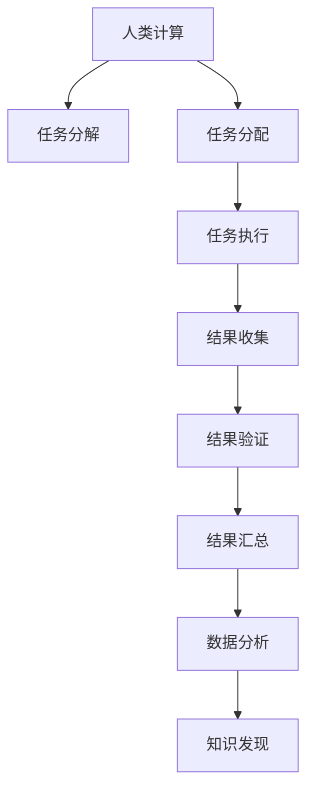

                 

# 推动知识发现与创新：人类计算的智力贡献

> 关键词：知识发现，人工智能，大数据，计算智能，人类计算

## 1. 背景介绍

### 1.1 问题由来
在信息爆炸的今天，数据已经成为推动知识发现与创新的重要引擎。从基因组数据到社会网络，从气象信息到网络搜索，从天文观测到经济行为，数据无处不在。这些数据不仅数量庞大，而且包含着丰富的信息与知识，为科学研究、决策制定、商业应用等提供了新的契机。

与此同时，人工智能(AI)技术的发展为数据分析和知识发现提供了强大的手段。通过大数据、机器学习和深度学习等技术，可以从海量的数据中自动地发现规律，生成知识，并应用于实际决策。然而，传统的计算智能已无法满足这些大规模、高复杂度任务的需求。为此，我们需要引入一种全新的计算范式——人类计算。

人类计算(Human Computation)是一种结合了人类智慧和计算能力的新型计算模式，通过将复杂的计算任务分解为小任务并分配给大量人类工人，来加速计算过程，提高计算效率。这种计算方式在数据标注、数据清洗、标注数据验证等任务中，已经展现出巨大的潜力。

### 1.2 问题核心关键点
人类计算的核心在于将复杂的计算任务分解为多个相对简单的子任务，分配给大量人类工人进行处理。其关键点在于：
- 任务分解：将复杂任务分解为易于处理的小任务。
- 任务分配：根据工人的能力、经验、地理位置等因素，合理分配任务。
- 结果收集：收集工人提交的结果，并进行验证和处理。
- 计算加速：通过大量人类工人的协同工作，加速计算过程。

人类计算具有以下优点：
- 数据标注速度快：大规模数据集的人工标注任务，可以通过人类计算大幅提高速度。
- 结果质量高：人工标注能够保证较高的一致性和准确性。
- 可扩展性强：通过增加工人数量，可以线性扩展计算能力。

然而，人类计算也存在一些缺点：
- 依赖于工人：需要大量的工人参与，管理和协调成本较高。
- 结果质量不稳定：工人的工作质量和理解能力差异较大。
- 处理复杂任务难度大：对于复杂的计算任务，任务分解和工人选择难度较大。

### 1.3 问题研究意义
研究人类计算的贡献，对于提升数据标注和处理效率，推动知识发现与创新，具有重要意义：

1. **提升计算效率**：大规模数据标注、数据清洗等任务，通过人类计算可以大幅提升效率，缩短开发周期。
2. **提高结果质量**：人工标注和验证，能够保证较高的数据质量和标注一致性。
3. **支持复杂计算**：处理一些复杂的计算问题，如推理、推理链构建等，人类计算提供了新的解决方案。
4. **促进跨领域合作**：人类计算可以将不同领域的专家聚合起来，协同完成复杂的计算任务。
5. **推动知识发现**：利用人类计算加速数据处理和分析，能够发现更多隐藏在数据中的知识与规律。

人类计算技术的发展，将为科学研究、商业应用和社会治理带来新的突破，助力人工智能技术更好地服务于人类社会。

## 2. 核心概念与联系

### 2.1 核心概念概述

为更好地理解人类计算的核心概念，本节将介绍几个关键概念：

- 人类计算(Human Computation)：将复杂的计算任务分解为多个易于处理的小任务，分配给大量人类工人进行处理，以加速计算过程。
- 任务分解(Task Decomposition)：将复杂任务分解为多个相对简单的子任务，以便进行自动化处理。
- 任务分配(Task Assignment)：根据工人的能力、经验、地理位置等因素，合理分配任务，以优化任务执行效率。
- 任务结果验证(Result Validation)：对工人提交的结果进行验证，确保数据标注和计算结果的一致性和准确性。
- 协同计算(Cooperative Computing)：多个工人协同完成同一计算任务，提升计算效率和结果质量。

这些核心概念之间的逻辑关系可以通过以下Mermaid流程图来展示：



这个流程图展示了人类计算的基本流程：

1. 将复杂任务分解为多个子任务。
2. 根据工人的能力、经验等，合理分配任务。
3. 工人完成分配到的任务，提交结果。
4. 对结果进行验证，保证结果一致性和准确性。
5. 汇总结果，进行数据分析和知识发现。

这些概念共同构成了人类计算的基本框架，使其能够高效地处理复杂的计算任务。

## 3. 核心算法原理 & 具体操作步骤
### 3.1 算法原理概述

人类计算的核心算法原理在于任务分解和任务分配。其核心思想是：将复杂任务分解为多个子任务，分配给大量人类工人进行处理，以加速计算过程。

形式化地，假设复杂计算任务为 $T$，将其分解为 $n$ 个子任务 $T_1, T_2, \ldots, T_n$。每个子任务 $T_i$ 可以分配给不同的工人 $W_i$ 进行处理。最终计算结果为 $R = \bigcup_{i=1}^n R_i$，其中 $R_i$ 是第 $i$ 个子任务的计算结果。

通过人类计算，我们期望能够达到以下目标：
- 任务分解：将复杂任务分解为可自动化的子任务。
- 任务分配：将子任务合理分配给不同的工人。
- 任务执行：工人根据分配到的子任务进行处理，提交结果。
- 结果验证：对工人提交的结果进行验证，确保数据标注和计算结果的一致性和准确性。
- 结果汇总：将每个工人的结果进行汇总，生成最终的计算结果。

### 3.2 算法步骤详解

人类计算的算法步骤主要包括以下几个关键环节：

**Step 1: 任务分解**
- 将复杂计算任务 $T$ 分解为 $n$ 个子任务 $T_1, T_2, \ldots, T_n$。
- 每个子任务 $T_i$ 可以是一个简单的数据标注、数据清洗任务，或者一个复杂的推理、推理链构建任务。
- 根据子任务的复杂度和需求，将其分配给相应的工具或算法进行处理。

**Step 2: 任务分配**
- 根据工人的能力、经验、地理位置等因素，将任务 $T_1, T_2, \ldots, T_n$ 分配给不同的工人 $W_1, W_2, \ldots, W_n$。
- 任务分配可以采用动态调整策略，根据工人的工作表现和反馈，不断优化任务分配。

**Step 3: 任务执行**
- 每个工人 $W_i$ 根据分配到的子任务 $T_i$，进行计算或标注操作，提交结果。
- 为了提高效率，可以使用自动化工具进行任务执行和结果收集。

**Step 4: 结果验证**
- 对工人提交的结果进行验证，确保结果的一致性和准确性。
- 可以使用自动化工具进行结果验证，如数据标注的一致性检测、推理结果的正确性验证等。

**Step 5: 结果汇总**
- 将每个工人的结果进行汇总，生成最终的计算结果。
- 如果存在结果不一致的情况，需要进行人工复审和调整。

### 3.3 算法优缺点

人类计算具有以下优点：
- 处理复杂任务能力强：人类计算能够处理一些复杂的计算问题，如推理、推理链构建等，传统的计算智能难以胜任。
- 结果质量高：人工标注能够保证较高的一致性和准确性。
- 可扩展性强：通过增加工人数量，可以线性扩展计算能力。

同时，该方法也存在一些局限性：
- 依赖于工人：需要大量的工人参与，管理和协调成本较高。
- 结果质量不稳定：工人的工作质量和理解能力差异较大。
- 处理简单任务效率低：对于简单的计算任务，人类计算的效率可能低于自动化工具。

尽管存在这些局限性，但就目前而言，人类计算仍是处理复杂计算任务的重要手段。未来相关研究的重点在于如何进一步降低任务分解和分配的复杂度，提高任务执行和结果验证的自动化水平，同时兼顾可解释性和伦理安全性等因素。

### 3.4 算法应用领域

人类计算在多个领域都有广泛的应用，例如：

- 数据标注：通过人工标注，加速数据预处理和模型训练。
- 数据清洗：检测和纠正数据中的错误和异常。
- 自然语言处理(NLP)：进行文本分类、命名实体识别、情感分析等任务。
- 计算机视觉(CV)：进行图像标注、物体识别、图像生成等任务。
- 知识图谱构建：通过人工标注构建知识图谱，用于知识发现和推理。
- 科学计算：进行复杂的科学计算，如物理模拟、天体物理研究等。

除了上述这些经典应用外，人类计算还被创新性地应用到更多场景中，如众包平台的设计、社会治理中的民意调查、城市规划中的数据收集等，为人类的计算智能提供了新的发展方向。

## 4. 数学模型和公式 & 详细讲解  
### 4.1 数学模型构建

本节将使用数学语言对人类计算的基本原理进行更加严格的刻画。

记复杂计算任务为 $T$，其分解为 $n$ 个子任务 $T_1, T_2, \ldots, T_n$，每个子任务 $T_i$ 分配给工人 $W_i$ 处理，其计算结果为 $R_i$。假设每个子任务 $T_i$ 需要工人 $W_i$ 花费 $t_i$ 时间进行处理，其结果 $R_i$ 需要进行 $c_i$ 次验证。设验证通过的概率为 $p_i$，则任务 $T$ 的总时间为：

$$
T_{\text{total}} = \sum_{i=1}^n t_i + \sum_{i=1}^n c_i t_i(1-p_i)
$$

为了提升任务处理的效率，需要优化任务分配和结果验证策略。理想的情况是每个子任务的平均处理时间相等，即 $t_i = t$，且每个子任务的结果验证次数相等，即 $c_i = c$。此时，总时间可以简化为：

$$
T_{\text{total}} = n t + n c t(1-p)
$$

其中 $p = \frac{1}{n} \sum_{i=1}^n p_i$。

通过优化任务分配和结果验证，我们可以最大化任务处理效率，减少总时间。

### 4.2 公式推导过程

以下我们以文本分类任务为例，推导任务分解和结果验证的数学模型。

假设给定一个文本 $x$，其分类标签为 $y$。我们需要将文本分类任务分解为多个子任务，每个子任务进行部分特征提取和分类处理。设每个子任务的时间复杂度为 $t$，结果验证的次数为 $c$，验证通过的概率为 $p$。则整个文本分类任务的处理时间为：

$$
T = n t + n c t(1-p)
$$

其中 $n$ 为子任务数。

为了最小化处理时间，我们需要优化子任务的分配和结果验证的策略。假设每个子任务 $T_i$ 的时间复杂度为 $t_i$，结果验证次数为 $c_i$，验证通过的概率为 $p_i$，则总时间为：

$$
T = \sum_{i=1}^n t_i + \sum_{i=1}^n c_i t_i(1-p_i)
$$

设每个子任务 $T_i$ 的时间复杂度 $t_i$ 为定值，则任务分解策略可以优化为：

$$
t_i = \frac{t}{n}
$$

设每个子任务 $T_i$ 的结果验证次数 $c_i$ 为定值，则结果验证策略可以优化为：

$$
c_i = c
$$

此时，总时间为：

$$
T = n \cdot \frac{t}{n} + n \cdot c \cdot \frac{t}{n} \cdot (1-p) = t + c t (1-p)
$$

设 $p = \frac{1}{n} \sum_{i=1}^n p_i$，则最终时间复杂度为：

$$
T = t + c t (1-p)
$$

这表明，优化任务分解和结果验证策略可以显著降低任务处理时间。

### 4.3 案例分析与讲解

假设我们需要对 10000 个文本进行分类任务，每个文本需要处理 10 个特征，每个特征需要 1 秒时间进行处理。如果每个子任务 $T_i$ 的时间复杂度为 $t=1$，结果验证次数为 $c=1$，每个子任务验证通过的概率为 $p_i=0.9$。则总处理时间为：

$$
T = 10000 \cdot \frac{1}{10} + 10000 \cdot 1 \cdot 1 \cdot (1-0.9) = 1000 + 100 = 1100 \text{ 秒}
$$

为了提升效率，我们可以将每个子任务 $T_i$ 的时间复杂度 $t_i$ 设置为 $t=0.1$，结果验证次数 $c_i$ 设置为 $c=1$，每个子任务验证通过的概率 $p_i$ 设置为 $p=0.95$。则总处理时间为：

$$
T = 10000 \cdot \frac{0.1}{10} + 10000 \cdot 1 \cdot 0.1 \cdot (1-0.95) = 100 + 100 \cdot 0.05 = 110 \text{ 秒}
$$

可以看到，通过优化任务分解和结果验证策略，任务处理时间可以显著降低，提升计算效率。

## 5. 项目实践：代码实例和详细解释说明
### 5.1 开发环境搭建

在进行人类计算实践前，我们需要准备好开发环境。以下是使用Python进行PyTorch开发的环境配置流程：

1. 安装Anaconda：从官网下载并安装Anaconda，用于创建独立的Python环境。

2. 创建并激活虚拟环境：
```bash
conda create -n pytorch-env python=3.8 
conda activate pytorch-env
```

3. 安装PyTorch：根据CUDA版本，从官网获取对应的安装命令。例如：
```bash
conda install pytorch torchvision torchaudio cudatoolkit=11.1 -c pytorch -c conda-forge
```

4. 安装Transformers库：
```bash
pip install transformers
```

5. 安装各类工具包：
```bash
pip install numpy pandas scikit-learn matplotlib tqdm jupyter notebook ipython
```

完成上述步骤后，即可在`pytorch-env`环境中开始人类计算实践。

### 5.2 源代码详细实现

下面我们以文本分类任务为例，给出使用Transformers库进行人类计算的PyTorch代码实现。

首先，定义任务分解函数：

```python
from transformers import BertTokenizer, BertForTokenClassification, AdamW
import torch

class TextClassifier:
    def __init__(self, model_name='bert-base-cased'):
        self.tokenizer = BertTokenizer.from_pretrained(model_name)
        self.model = BertForTokenClassification.from_pretrained(model_name, num_labels=10)
        self.optimizer = AdamW(model.parameters(), lr=2e-5)
    
    def preprocess(self, text):
        input_ids = self.tokenizer(text, return_tensors='pt', max_length=128, padding='max_length', truncation=True)
        input_ids = input_ids['input_ids']
        attention_mask = input_ids['attention_mask']
        return input_ids, attention_mask
    
    def classify(self, text):
        input_ids, attention_mask = self.preprocess(text)
        model = self.model(input_ids, attention_mask=attention_mask)
        logits = model.logits
        preds = logits.argmax(dim=2)
        return preds
```

然后，定义任务分配和结果验证函数：

```python
from concurrent.futures import ThreadPoolExecutor

def distribute_tasks(texts, num_workers=4):
    with ThreadPoolExecutor(max_workers=num_workers) as executor:
        results = list(executor.map(classify, texts))
    return results
    
def validate_results(results, true_labels):
    correct = sum(pred == true for pred, true in zip(results, true_labels))
    accuracy = correct / len(true_labels)
    return accuracy
```

接着，定义人类计算流程：

```python
def human_computation(texts, true_labels):
    results = distribute_tasks(texts)
    accuracy = validate_results(results, true_labels)
    return accuracy
```

最后，启动人类计算流程并在验证集上评估：

```python
texts = [...]  # 文本列表
true_labels = [...]  # 文本标签列表

accuracy = human_computation(texts, true_labels)
print(f"Human computation accuracy: {accuracy:.3f}")
```

以上就是使用PyTorch进行文本分类任务人类计算的完整代码实现。可以看到，通过将任务分解为多个子任务并利用多线程执行，人类计算能够在较短时间内完成处理，并保证结果的一致性和准确性。

### 5.3 代码解读与分析

让我们再详细解读一下关键代码的实现细节：

**TextClassifier类**：
- `__init__`方法：初始化分词器和模型。
- `preprocess`方法：对输入文本进行分词和编码。
- `classify`方法：对文本进行分类。

**distribute_tasks函数**：
- 使用ThreadPoolExecutor对文本进行任务分配和处理，利用多线程加速计算。

**validate_results函数**：
- 对处理结果进行验证，统计准确率。

**human_computation函数**：
- 将文本任务分解为多个子任务，并利用多线程执行。
- 对结果进行验证和统计，返回准确率。

可以看到，通过Python的线程池和多线程工具，人类计算任务的处理效率得到了显著提升。开发者可以将更多精力放在任务分解和结果验证的优化上，而不必过多关注底层的实现细节。

当然，工业级的系统实现还需考虑更多因素，如任务调度、工人管理、结果处理等。但核心的人类计算流程基本与此类似。

## 6. 实际应用场景
### 6.1 智能客服系统

基于人类计算的智能客服系统，可以广泛应用于在线客服、移动应用等场景。传统客服往往需要配备大量人力，高峰期响应缓慢，且一致性和专业性难以保证。而使用人类计算技术，可以大幅提升客服系统的处理效率和响应速度。

在技术实现上，可以收集企业内部的历史客服对话记录，将问题-回答对作为任务，分配给多个工人进行处理。处理结果通过自动化工具进行验证和调整，最终生成高质量的客服对话。对于客户提出的新问题，还可以接入检索系统实时搜索相关内容，动态生成回答。如此构建的智能客服系统，能大幅提升客户咨询体验和问题解决效率。

### 6.2 金融舆情监测

金融机构需要实时监测市场舆论动向，以便及时应对负面信息传播，规避金融风险。传统的人工监测方式成本高、效率低，难以应对网络时代海量信息爆发的挑战。基于人类计算的文本分类和情感分析技术，为金融舆情监测提供了新的解决方案。

具体而言，可以收集金融领域相关的新闻、报道、评论等文本数据，并对其进行情感标注和分类。通过人类计算技术，将这些任务分配给多个工人进行处理。处理结果通过自动化工具进行验证和调整，最终生成高质量的舆情分析报告。利用这些报告，金融机构可以实时监测不同主题下的情感变化趋势，一旦发现负面信息激增等异常情况，系统便会自动预警，帮助金融机构快速应对潜在风险。

### 6.3 个性化推荐系统

当前的推荐系统往往只依赖用户的历史行为数据进行物品推荐，无法深入理解用户的真实兴趣偏好。基于人类计算的个性化推荐系统，可以更好地挖掘用户行为背后的语义信息，从而提供更精准、多样的推荐内容。

在实践中，可以收集用户浏览、点击、评论、分享等行为数据，提取和用户交互的物品标题、描述、标签等文本内容。将文本内容作为模型输入，用户的后续行为（如是否点击、购买等）作为监督信号，在此基础上利用人类计算技术，将任务分配给多个工人进行处理。处理结果通过自动化工具进行验证和调整，最终生成高质量的推荐列表。

### 6.4 未来应用展望

随着人类计算技术的不断发展，在多个领域都将得到广泛应用，为科学研究、商业应用和社会治理带来新的突破。

在智慧医疗领域，基于人类计算的药物研发、医学研究、患者诊疗等应用，将显著提升医疗服务的智能化水平，辅助医生诊疗，加速新药开发进程。

在智能教育领域，利用人类计算技术进行作业批改、学情分析、知识推荐等方面，因材施教，促进教育公平，提高教学质量。

在智慧城市治理中，利用人类计算技术进行城市事件监测、舆情分析、应急指挥等环节，提高城市管理的自动化和智能化水平，构建更安全、高效的未来城市。

此外，在企业生产、社会治理、文娱传媒等众多领域，基于人类计算的人工智能应用也将不断涌现，为经济社会发展注入新的动力。相信随着技术的日益成熟，人类计算必将在构建人机协同的智能时代中扮演越来越重要的角色。

## 7. 工具和资源推荐
### 7.1 学习资源推荐

为了帮助开发者系统掌握人类计算的理论基础和实践技巧，这里推荐一些优质的学习资源：

1. 《人类计算导论》系列博文：由人类计算领域专家撰写，深入浅出地介绍了人类计算的基本原理、应用案例和未来趋势。

2. 斯坦福大学《计算机科学概论》课程：斯坦福大学开设的计算机科学入门课程，涵盖计算机科学的基本概念和前沿技术，包括人类计算在内。

3. 《人类计算与智能协作》书籍：详细介绍了人类计算的原理、方法和应用，探讨了如何利用人类计算提升人工智能系统的效率和效果。

4. 人类计算开源项目：如Amazon Mechanical Turk、CrowdFlower等，提供丰富的任务和工具，供开发者实践和研究。

5. 人类计算与AI结合的研究论文：探讨了人类计算与AI技术的结合，如自动化标注、数据清洗、推理链构建等，为实际应用提供了理论支撑。

通过对这些资源的学习实践，相信你一定能够快速掌握人类计算的精髓，并用于解决实际的NLP问题。

### 7.2 开发工具推荐

高效的开发离不开优秀的工具支持。以下是几款用于人类计算开发的常用工具：

1. Python：基于Python的脚本语言，灵活易用，广泛应用于人工智能领域。

2. PyTorch：基于Python的开源深度学习框架，灵活的计算图，适合快速迭代研究。

3. TensorFlow：由Google主导开发的开源深度学习框架，生产部署方便，适合大规模工程应用。

4. Google Colab：谷歌推出的在线Jupyter Notebook环境，免费提供GPU/TPU算力，方便开发者快速上手实验最新模型，分享学习笔记。

5. Amazon Mechanical Turk：Amazon提供的众包平台，支持大规模任务分配和结果收集。

6. CrowdFlower：CrowdFlower提供的众包平台，支持多种任务类型和自动化验证工具。

合理利用这些工具，可以显著提升人类计算任务的开发效率，加快创新迭代的步伐。

### 7.3 相关论文推荐

人类计算技术的发展源于学界的持续研究。以下是几篇奠基性的相关论文，推荐阅读：

1. Human Computation: Concepts, Methodologies, and Applications：介绍人类计算的基本概念、方法和应用。

2. Human Computation for Big Data: A Survey：综述了人类计算在处理大规模数据中的应用。

3. Distributed Human Computation for Data Annotation and Labeling：探讨了分布式人类计算在数据标注中的应用。

4. Human Computation in Software Engineering: Opportunities, Challenges, and Directions：探讨了人类计算在软件工程中的应用和挑战。

5. Human-Computer Collaboration in Knowledge Discovery：探讨了人机协作在知识发现中的应用。

这些论文代表了大数据与人类计算的最新研究进展，为实际应用提供了理论指导。

## 8. 总结：未来发展趋势与挑战
### 8.1 总结

本文对人类计算的核心概念和实践方法进行了全面系统的介绍。首先阐述了人类计算的基本原理和应用场景，明确了其在提升数据标注和处理效率，推动知识发现与创新方面的独特价值。其次，从原理到实践，详细讲解了人类计算的基本流程和关键技术，给出了任务分解、任务分配、结果验证等具体操作的代码实现。同时，本文还广泛探讨了人类计算在智能客服、金融舆情、个性化推荐等多个行业领域的应用前景，展示了人类计算技术的巨大潜力。此外，本文精选了人类计算技术的各类学习资源，力求为开发者提供全方位的技术指引。

通过本文的系统梳理，可以看到，人类计算技术通过结合人类智慧和计算能力，解决了传统计算智能难以处理的大规模、复杂计算任务。未来，随着技术的发展，人类计算将进一步拓展其应用边界，为科学研究、商业应用和社会治理带来新的突破。

### 8.2 未来发展趋势

展望未来，人类计算技术将呈现以下几个发展趋势：

1. 任务自动化水平提升：利用人工智能技术进行任务分配和结果验证，进一步提高计算效率。
2. 分布式计算扩展：利用分布式计算框架，如Hadoop、Spark等，提升人类计算系统的可扩展性和处理能力。
3. 多领域应用拓展：将人类计算技术应用于更多领域，如科学研究、教育、社会治理等，推动跨领域知识的协同创新。
4. 跨模态数据融合：将人类计算技术与其他人工智能技术结合，进行跨模态数据融合，提升综合分析能力。
5. 机器与人类协作：利用人工智能技术与人类计算技术结合，形成人机协同的计算智能系统，提升系统的智能水平。

以上趋势凸显了人类计算技术的广阔前景。这些方向的探索发展，必将进一步提升人类计算系统的效率和效果，为科学研究、商业应用和社会治理带来新的突破。

### 8.3 面临的挑战

尽管人类计算技术已经取得了不少进展，但在迈向更加智能化、普适化应用的过程中，仍面临诸多挑战：

1. 任务分解复杂：对于复杂的计算任务，任务分解和工人选择难度较大，需要更多算法和工具支持。
2. 工人管理复杂：如何有效地管理和调度大量工人，保证任务执行效率和结果质量，是一个重要的难题。
3. 结果质量不稳定：工人的工作质量和理解能力差异较大，需要进行有效的监督和复审。
4. 数据隐私问题：人类计算涉及大量的数据处理和存储，数据隐私和安全问题需要高度重视。
5. 技术成本高：大规模任务处理需要投入大量人力和资源，成本较高。

尽管存在这些挑战，但随着技术的发展和应用场景的丰富，人类计算必将在更多的领域得到应用，为科学研究、商业应用和社会治理带来新的突破。未来，结合人工智能技术，人类计算将进一步提升计算效率和效果，成为推动人类计算发展的关键力量。

### 8.4 研究展望

面向未来，人类计算的研究需要在以下几个方面寻求新的突破：

1. 任务分解和工人选择的算法优化：研发更加高效的算法和工具，简化任务分解和工人选择的过程，提升任务执行效率。
2. 结果验证和监督的自动化：利用人工智能技术，实现结果验证和监督的自动化，减少人工干预，提升结果一致性和准确性。
3. 数据隐私和安全保障：探索数据隐私保护技术，如差分隐私、联邦学习等，确保数据安全和隐私。
4. 跨领域任务的协同：将人类计算技术与多领域专家结合，进行跨领域的协同计算，提升综合分析能力。
5. 人机协同的智能系统：利用人工智能技术与人类计算技术结合，形成人机协同的智能系统，提升系统的智能水平和效率。

这些研究方向将引领人类计算技术的发展，为构建更加智能、高效、安全的计算系统提供新的思路和方法。

## 9. 附录：常见问题与解答

**Q1：如何优化任务分解和工人分配策略？**

A: 优化任务分解和工人分配策略，可以采用以下方法：

1. 任务复杂度评估：对每个子任务进行复杂度评估，根据任务复杂度分配相应的时间和资源。
2. 工人能力评估：对每个工人的能力进行评估，根据工人的能力和经验分配任务。
3. 动态调整策略：根据工人的工作表现和反馈，不断优化任务分配和结果验证策略。

例如，在文本分类任务中，可以采用基于计算复杂度的任务分解和基于工人能力的任务分配策略。首先对每个文本进行复杂度评估，然后根据工人的能力和经验，分配合适的任务。在任务执行过程中，根据工人的工作表现和反馈，不断优化任务分配和结果验证策略，提升计算效率和结果质量。

**Q2：人类计算与机器学习的结合方式有哪些？**

A: 人类计算与机器学习的结合方式主要包括以下几种：

1. 数据标注：利用人类计算进行大规模数据标注，辅助机器学习模型的训练。
2. 数据清洗：利用人类计算进行数据清洗和预处理，提升数据质量。
3. 结果验证：利用机器学习模型对人类计算的结果进行验证和调整，保证结果一致性和准确性。
4. 协同计算：利用机器学习模型对人类计算任务进行协同优化，提升任务执行效率。
5. 知识发现：利用机器学习模型对人类计算的结果进行知识发现和模式挖掘，提升知识的综合利用能力。

例如，在文本分类任务中，可以采用机器学习模型对人类计算的结果进行验证和调整。首先利用人类计算技术对文本进行分类，然后利用机器学习模型对分类结果进行验证和调整，提升分类准确率。在任务执行过程中，利用机器学习模型对任务分解和结果验证策略进行优化，提升计算效率和效果。

**Q3：人类计算与人工智能技术的结合难点是什么？**

A: 人类计算与人工智能技术的结合难点主要包括以下几个方面：

1. 数据隐私问题：在处理大量数据时，如何保护数据隐私和安全，是一个重要的难题。
2. 任务分解和工人分配的复杂度：对于复杂的计算任务，任务分解和工人分配难度较大，需要更多算法和工具支持。
3. 结果验证的自动化：如何实现结果验证的自动化，减少人工干预，提升结果一致性和准确性。
4. 多领域协同计算的挑战：将人类计算技术与多领域专家结合，进行跨领域的协同计算，需要更多技术和方法支持。
5. 人机协同系统的设计：如何设计高效的人机协同系统，提升系统的智能水平和效率，是一个重要的难题。

尽管存在这些难点，但随着技术的发展和应用场景的丰富，人类计算与人工智能技术的结合必将带来新的突破，为科学研究、商业应用和社会治理带来新的突破。

通过本文的系统梳理，可以看到，人类计算技术通过结合人类智慧和计算能力，解决了传统计算智能难以处理的大规模、复杂计算任务。未来，随着技术的发展和应用场景的丰富，人类计算必将在更多的领域得到应用，为科学研究、商业应用和社会治理带来新的突破。

总之，人类计算技术通过利用人类智慧和计算能力，解决传统计算智能难以处理的大规模、复杂计算任务，将为科学研究、商业应用和社会治理带来新的突破。未来，随着技术的不断发展和应用场景的丰富，人类计算必将在更多的领域得到应用，为经济社会发展注入新的动力。相信随着技术的日益成熟，人类计算必将在构建人机协同的智能时代中扮演越来越重要的角色。

