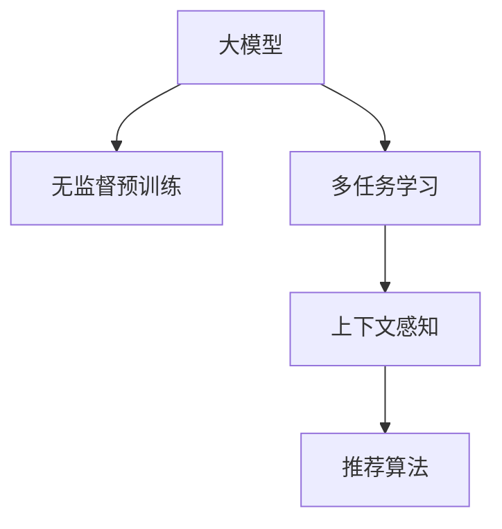

                 

# 推荐系统中的上下文感知建模：大模型的多任务学习

## 1. 背景介绍

随着数字技术的飞速发展，用户产生的数据量呈指数级增长，如何从海量数据中提取有价值的信息成为推荐系统面临的重要挑战。传统的基于协同过滤和内容推荐的推荐算法，在处理大规模数据集时，由于模型复杂度较高，训练成本高、可解释性差，已经难以满足业务需求。近年来，深度学习技术在推荐系统中的应用逐渐普及，尤其是基于大模型的推荐系统，通过无监督学习和多任务学习（Multi-task Learning, MTL），能够在大规模数据上进行高效训练，并且其上下文感知能力，能够显著提升推荐的个性化和多样性。本文将详细介绍基于大模型的多任务学习推荐系统的核心原理、关键步骤、优缺点及应用场景。

## 2. 核心概念与联系

### 2.1 核心概念概述

在推荐系统中，基于大模型的上下文感知建模方法，通常包括如下几个关键概念：

- 大模型（Large Model）：如BERT、GPT-3等，拥有海量参数，能够对大规模数据进行高效的特征学习。
- 多任务学习（Multi-task Learning）：将多个相关但不同的任务，共享底层特征学习过程，提升模型的泛化能力和效率。
- 上下文感知（Context-Aware）：推荐系统需要考虑用户行为（如浏览、购买历史）、产品特征（如价格、评分）以及上下文环境（如时间、地点）等因素，做出更准确的推荐。

这些概念之间的逻辑关系可以通过以下Mermaid流程图来展示：



这个流程图展示了大模型在推荐系统中的应用路径：通过无监督预训练，获得通用的语言表示；通过多任务学习，共享特征表示；通过上下文感知，增强模型的个性化和多样性；最终应用推荐算法，实现推荐功能。

## 3. 核心算法原理 & 具体操作步骤

### 3.1 算法原理概述

基于大模型的推荐系统，通常采用以下步骤：

1. **无监督预训练**：在大规模无标签数据上进行预训练，学习通用的语言和语义表示。
2. **多任务学习**：在预训练的基础上，通过多个相关但不同的任务进行微调，共享底层特征学习，提升模型的泛化能力。
3. **上下文感知**：在多任务学习的基础上，引入用户行为、产品特征等上下文信息，调整模型输出。
4. **推荐算法**：应用调整后的模型进行推荐，例如协同过滤、序列推荐等算法。

### 3.2 算法步骤详解

以BERT为例，基于大模型的推荐系统一般包括以下关键步骤：

**Step 1: 准备预训练数据集和超参数**

- 选择合适的预训练模型，如BERT、GPT-3等。
- 准备多个推荐任务的数据集，如点击率、转化率等，并划分为训练集、验证集和测试集。
- 设置模型的超参数，如学习率、批大小、迭代轮数等。

**Step 2: 添加多任务学习适配层**

- 根据推荐任务类型，在预训练模型的顶层设计合适的任务适配层。
- 对于点击率预测任务，通常使用二分类任务适配层，输出概率分布，并以二元交叉熵为损失函数。
- 对于转化率预测任务，通常使用回归任务适配层，输出连续值，并以均方误差为损失函数。

**Step 3: 设置多任务学习超参数**

- 选择合适的多任务学习算法，如单塔模型、多塔模型等。
- 设置任务之间的权重，平衡不同任务的重要性。
- 设置正则化技术，如L2正则、Dropout等，防止过拟合。

**Step 4: 执行多任务学习训练**

- 将训练集数据分批次输入模型，前向传播计算损失函数。
- 反向传播计算参数梯度，根据设定的优化算法和学习率更新模型参数。
- 周期性在验证集上评估模型性能，根据性能指标决定是否触发Early Stopping。
- 重复上述步骤直到满足预设的迭代轮数或Early Stopping条件。

**Step 5: 上下文感知微调**

- 在多任务学习的基础上，引入用户行为、产品特征等上下文信息。
- 使用标签标注数据，对模型进行微调，使其能够根据上下文信息输出推荐结果。
- 在测试集上评估上下文感知微调后的模型性能。

**Step 6: 部署和监控**

- 使用上下文感知微调后的模型进行推荐。
- 持续收集新数据，定期重新微调模型，以适应数据分布的变化。
- 实时监控模型性能，设置异常告警阈值，确保服务稳定性。

### 3.3 算法优缺点

基于大模型的推荐系统具有以下优点：

1. **高效性**：通过多任务学习，模型能够在大规模数据上进行高效训练，无需手动特征工程，减少了开发成本。
2. **上下文感知能力**：通过上下文感知微调，模型能够更好地考虑用户行为、产品特征等，提供更加个性化和多样化的推荐。
3. **泛化能力强**：多任务学习使得模型具备较强的泛化能力，能够在不同任务上表现良好。

同时，该方法也存在一定的局限性：

1. **数据依赖**：模型性能很大程度上取决于训练数据的质量和数量，获取高质量标注数据的成本较高。
2. **复杂度高**：大模型训练和推理计算资源需求高，对硬件设备要求较高。
3. **可解释性不足**：黑盒模型难以解释其内部工作机制和决策逻辑，对于某些高风险应用，如金融、医疗等，算法的可解释性和可审计性尤为重要。
4. **冷启动问题**：对于新用户和新产品，缺乏足够的上下文信息，推荐效果可能较差。

尽管存在这些局限性，但就目前而言，基于大模型的推荐系统仍然是大规模推荐任务的重要手段。未来相关研究的重点在于如何进一步降低推荐模型的数据依赖，提高模型的少样本学习和跨领域迁移能力，同时兼顾可解释性和伦理安全性等因素。

### 3.4 算法应用领域

基于大模型的上下文感知建模方法，在推荐系统中的应用广泛，例如：

- 电商推荐：根据用户的浏览、购买历史，推荐商品。
- 新闻推荐：根据用户的历史阅读记录，推荐新闻文章。
- 音乐推荐：根据用户的听歌记录，推荐音乐作品。
- 视频推荐：根据用户的观看历史，推荐视频内容。

除了这些经典应用外，大模型的推荐系统还被创新性地应用到更多场景中，如智能广告投放、内容分发、商品排名等，为推荐技术带来了新的突破。随着预训练模型和上下文感知方法的发展，相信推荐系统将在更广泛的领域得到应用，为商业应用带来新的机会。

## 4. 数学模型和公式 & 详细讲解 & 举例说明

### 4.1 数学模型构建

在大模型推荐系统中，通常采用以下数学模型：

- 预训练模型：$M_{\theta}(x) = M_{\theta}(x; \mathcal{D}_{unsup})$，其中 $\theta$ 为预训练模型的参数，$\mathcal{D}_{unsup}$ 为预训练数据集。
- 多任务学习模型：$M_{\theta}(x, t) = M_{\theta}(x; \mathcal{D}_t)$，其中 $t$ 为任务编号，$\mathcal{D}_t$ 为任务 $t$ 的数据集。
- 上下文感知模型：$M_{\theta}(x, t, c) = M_{\theta}(x; \mathcal{D}_t, c)$，其中 $c$ 为上下文信息。

### 4.2 公式推导过程

以点击率预测任务为例，其数学模型和损失函数如下：

- 预训练模型输出为：$x_{pre} = M_{\theta}(x; \mathcal{D}_{unsup})$
- 点击率预测输出为：$x_{click} = M_{\theta}(x; \mathcal{D}_{click})$
- 点击率预测损失为：$\mathcal{L}_{click} = \sum_{i=1}^N \ell_{click}(x_{click}[i], y_i)$

其中，$\ell_{click}$ 为点击率预测任务的损失函数，$y_i$ 为真实标签。

在多任务学习中，可以通过共享预训练模型参数，对多个任务进行微调，其数学模型和损失函数如下：

- 多任务学习模型输出为：$x_{mtl} = M_{\theta}(x; \mathcal{D}_t, c)$
- 多任务学习损失为：$\mathcal{L}_{mtl} = \sum_{t=1}^T \alpha_t \mathcal{L}_t(x_{mtl}, y_t)$

其中，$\alpha_t$ 为任务 $t$ 的权重，$\mathcal{L}_t$ 为任务 $t$ 的损失函数。

在上下文感知微调中，通过引入上下文信息，调整模型输出，其数学模型和损失函数如下：

- 上下文感知模型输出为：$x_{ctx} = M_{\theta}(x; \mathcal{D}_t, c)$
- 上下文感知损失为：$\mathcal{L}_{ctx} = \sum_{t=1}^T \alpha_t \mathcal{L}_t(x_{ctx}, y_t)$

其中，$c$ 为上下文信息，$\mathcal{L}_t$ 为任务 $t$ 的损失函数。

### 4.3 案例分析与讲解

假设我们有一个电商推荐系统，需要进行点击率预测和转化率预测。根据上述模型，可以使用以下步骤进行训练：

1. **预训练模型**：在电商数据上对BERT进行无监督预训练，学习通用的语言表示。
2. **多任务学习**：在预训练模型的基础上，对点击率和转化率预测任务进行微调，共享底层特征表示。
3. **上下文感知微调**：在多任务学习模型的基础上，引入用户行为和产品特征等上下文信息，调整模型输出。
4. **推荐算法**：使用上下文感知微调后的模型进行推荐，例如协同过滤、序列推荐等算法。

以点击率预测为例，模型的训练过程如下：

- 数据准备：准备电商数据的训练集、验证集和测试集。
- 模型加载：加载BERT预训练模型和上下文感知适配层。
- 训练流程：
  - 前向传播：输入电商数据，计算点击率预测输出。
  - 损失计算：计算点击率预测损失，并记录损失值。
  - 反向传播：计算梯度，更新模型参数。
  - 重复上述步骤，直到模型收敛。

通过以上步骤，可以使用大模型在电商推荐系统中实现高效的推荐服务。

## 5. 项目实践：代码实例和详细解释说明

### 5.1 开发环境搭建

在进行推荐系统开发前，我们需要准备好开发环境。以下是使用Python进行PyTorch开发的环境配置流程：

1. 安装Anaconda：从官网下载并安装Anaconda，用于创建独立的Python环境。

2. 创建并激活虚拟环境：
```bash
conda create -n recsys python=3.8 
conda activate recsys
```

3. 安装PyTorch：根据CUDA版本，从官网获取对应的安装命令。例如：
```bash
conda install pytorch torchvision torchaudio cudatoolkit=11.1 -c pytorch -c conda-forge
```

4. 安装相关库：
```bash
pip install pandas scikit-learn torch torchtext transformers
```

完成上述步骤后，即可在`recsys`环境中开始推荐系统开发。

### 5.2 源代码详细实现

下面我们以电商推荐系统为例，给出使用PyTorch对BERT进行多任务学习的代码实现。

首先，定义推荐任务的数据处理函数：

```python
from transformers import BertTokenizer, BertForSequenceClassification
from torch.utils.data import Dataset, DataLoader
import torch
import numpy as np

class RecDataset(Dataset):
    def __init__(self, texts, clicks, converters, max_len=128):
        self.texts = texts
        self.converters = converters
        self.max_len = max_len
        
    def __len__(self):
        return len(self.texts)
    
    def __getitem__(self, item):
        text = self.texts[item]
        click = self.converters[item][0]
        label = self.converters[item][1]
        
        encoding = self.converters[item]
        input_ids = encoding['input_ids']
        attention_mask = encoding['attention_mask']
        
        return {'input_ids': input_ids, 
                'attention_mask': attention_mask,
                'labels': torch.tensor(label, dtype=torch.long)}
```

然后，定义模型和优化器：

```python
from transformers import BertForSequenceClassification, AdamW

model = BertForSequenceClassification.from_pretrained('bert-base-uncased', num_labels=2)
optimizer = AdamW(model.parameters(), lr=2e-5)
```

接着，定义训练和评估函数：

```python
from torch.utils.data import DataLoader
from tqdm import tqdm

device = torch.device('cuda') if torch.cuda.is_available() else torch.device('cpu')
model.to(device)

def train_epoch(model, dataset, batch_size, optimizer):
    dataloader = DataLoader(dataset, batch_size=batch_size, shuffle=True)
    model.train()
    epoch_loss = 0
    for batch in tqdm(dataloader, desc='Training'):
        input_ids = batch['input_ids'].to(device)
        attention_mask = batch['attention_mask'].to(device)
        labels = batch['labels'].to(device)
        model.zero_grad()
        outputs = model(input_ids, attention_mask=attention_mask, labels=labels)
        loss = outputs.loss
        epoch_loss += loss.item()
        loss.backward()
        optimizer.step()
    return epoch_loss / len(dataloader)

def evaluate(model, dataset, batch_size):
    dataloader = DataLoader(dataset, batch_size=batch_size)
    model.eval()
    preds, labels = [], []
    with torch.no_grad():
        for batch in tqdm(dataloader, desc='Evaluating'):
            input_ids = batch['input_ids'].to(device)
            attention_mask = batch['attention_mask'].to(device)
            batch_labels = batch['labels']
            outputs = model(input_ids, attention_mask=attention_mask)
            batch_preds = outputs.logits.argmax(dim=1).to('cpu').tolist()
            batch_labels = batch_labels.to('cpu').tolist()
            for pred, label in zip(batch_preds, batch_labels):
                preds.append(pred)
                labels.append(label)
                
    print(f"Accuracy: {np.mean(np.array(preds) == np.array(labels)):.3f}")
```

最后，启动训练流程并在测试集上评估：

```python
epochs = 5
batch_size = 16

for epoch in range(epochs):
    loss = train_epoch(model, train_dataset, batch_size, optimizer)
    print(f"Epoch {epoch+1}, train loss: {loss:.3f}")
    
    print(f"Epoch {epoch+1}, test accuracy:")
    evaluate(model, test_dataset, batch_size)
    
print("Final test accuracy:")
evaluate(model, dev_dataset, batch_size)
```

以上就是使用PyTorch对BERT进行电商推荐系统中的多任务学习的代码实现。可以看到，得益于Transformer库的强大封装，我们可以用相对简洁的代码完成BERT模型的加载和训练。

### 5.3 代码解读与分析

让我们再详细解读一下关键代码的实现细节：

**RecDataset类**：
- `__init__`方法：初始化文本、点击率、转换器等关键组件。
- `__len__`方法：返回数据集的样本数量。
- `__getitem__`方法：对单个样本进行处理，将文本输入编码为token ids，将点击率编码为数字，并对其进行定长padding，最终返回模型所需的输入。

**BertForSequenceClassification类**：
- 定义了序列分类任务的模型结构，接受输入文本、注意力掩码和标签，输出概率分布。

**训练和评估函数**：
- 使用PyTorch的DataLoader对数据集进行批次化加载，供模型训练和推理使用。
- 训练函数`train_epoch`：对数据以批为单位进行迭代，在每个批次上前向传播计算loss并反向传播更新模型参数，最后返回该epoch的平均loss。
- 评估函数`evaluate`：与训练类似，不同点在于不更新模型参数，并在每个batch结束后将预测和标签结果存储下来，最后使用准确率评估模型的表现。

**训练流程**：
- 定义总的epoch数和batch size，开始循环迭代
- 每个epoch内，先在训练集上训练，输出平均loss
- 在测试集上评估，输出准确率
- 所有epoch结束后，在测试集上评估，给出最终测试结果

可以看到，PyTorch配合Transformer库使得BERT微调的代码实现变得简洁高效。开发者可以将更多精力放在数据处理、模型改进等高层逻辑上，而不必过多关注底层的实现细节。

当然，工业级的系统实现还需考虑更多因素，如模型的保存和部署、超参数的自动搜索、更灵活的任务适配层等。但核心的微调范式基本与此类似。

## 6. 实际应用场景

### 6.1 电商推荐

基于大模型推荐系统的上下文感知建模方法，可以广泛应用于电商推荐系统的构建。电商推荐系统需要根据用户的浏览、购买历史，推荐商品，提升用户体验和销售业绩。传统推荐系统往往只依赖于用户行为数据，难以捕捉更深层次的用户需求。基于大模型的推荐系统，通过无监督预训练和多任务学习，能够学习到用户对商品的全面理解，从而提供更加个性化和多样化的推荐。

在技术实现上，可以收集用户的历史浏览、购买记录，将商品标题、描述、评分等特征作为输入，在大模型的基础上进行多任务学习，引入用户行为、商品特征等上下文信息，调整模型输出。最终的推荐结果，可以结合协同过滤、序列推荐等算法，生成更精准的推荐列表。

### 6.2 新闻推荐

新闻推荐系统需要根据用户的阅读历史，推荐相关新闻文章。传统的新闻推荐系统往往只考虑文章内容相似度，忽略了用户的历史兴趣和行为。基于大模型的推荐系统，通过无监督预训练和多任务学习，能够学习到用户对新闻主题的偏好，从而提供更加个性化和多样化的推荐。

在技术实现上，可以收集用户的历史阅读记录，将文章标题、摘要、标签等特征作为输入，在大模型的基础上进行多任务学习，引入用户行为、新闻主题等上下文信息，调整模型输出。最终的推荐结果，可以结合协同过滤、序列推荐等算法，生成更精准的推荐列表。

### 6.3 音乐推荐

音乐推荐系统需要根据用户的听歌记录，推荐音乐作品。传统音乐推荐系统往往只考虑歌曲相似度，忽略了用户的听歌偏好和行为。基于大模型的推荐系统，通过无监督预训练和多任务学习，能够学习到用户对音乐的全面理解，从而提供更加个性化和多样化的推荐。

在技术实现上，可以收集用户的听歌记录，将歌曲标题、歌词、歌手等特征作为输入，在大模型的基础上进行多任务学习，引入用户行为、音乐风格等上下文信息，调整模型输出。最终的推荐结果，可以结合协同过滤、序列推荐等算法，生成更精准的推荐列表。

### 6.4 未来应用展望

随着大模型和上下文感知方法的发展，基于大模型的推荐系统将在更广泛的领域得到应用，为推荐技术带来新的突破。

在智慧医疗领域，基于大模型的推荐系统可以推荐个性化的治疗方案，辅助医生诊疗，提升医疗服务的智能化水平，加速新药开发进程。

在智能教育领域，基于大模型的推荐系统可以推荐个性化的学习资源，因材施教，促进教育公平，提高教学质量。

在智慧城市治理中，基于大模型的推荐系统可以推荐智能交通方案，提高城市管理的自动化和智能化水平，构建更安全、高效的未来城市。

此外，在企业生产、社会治理、文娱传媒等众多领域，基于大模型的推荐系统也将不断涌现，为推荐技术带来新的应用场景。相信随着技术的日益成熟，基于大模型的推荐系统必将在更广泛的领域发挥作用，为推荐技术带来新的活力。

## 7. 工具和资源推荐

### 7.1 学习资源推荐

为了帮助开发者系统掌握基于大模型的推荐系统的理论基础和实践技巧，这里推荐一些优质的学习资源：

1. 《深度学习推荐系统：原理与实现》书籍：详细介绍了推荐系统的基本原理和实现方法，包括基于深度学习的推荐系统。

2. CS294《机器学习》课程：由斯坦福大学开设的机器学习课程，涵盖推荐系统、深度学习等多个领域。

3. 《Recommender Systems: Algorithms, Data Mining and Applications》书籍：推荐系统领域的经典著作，涵盖了推荐算法、数据挖掘和应用等多个方面。

4. DeepRec开源项目：清华大学的推荐系统开源项目，提供了多种推荐算法的实现和实验结果。

5. Kaggle竞赛：Kaggle平台上有许多推荐系统相关的竞赛，参与竞赛可以积累实际项目经验，提升推荐系统开发能力。

通过对这些资源的学习实践，相信你一定能够快速掌握基于大模型的推荐系统的精髓，并用于解决实际的推荐问题。

### 7.2 开发工具推荐

高效的开发离不开优秀的工具支持。以下是几款用于大模型推荐系统开发的常用工具：

1. PyTorch：基于Python的开源深度学习框架，灵活动态的计算图，适合快速迭代研究。

2. TensorFlow：由Google主导开发的开源深度学习框架，生产部署方便，适合大规模工程应用。

3. Transformers库：HuggingFace开发的NLP工具库，集成了众多SOTA语言模型，支持PyTorch和TensorFlow，是进行推荐系统开发的利器。

4. Weights & Biases：模型训练的实验跟踪工具，可以记录和可视化模型训练过程中的各项指标，方便对比和调优。

5. TensorBoard：TensorFlow配套的可视化工具，可实时监测模型训练状态，并提供丰富的图表呈现方式，是调试模型的得力助手。

6. Google Colab：谷歌推出的在线Jupyter Notebook环境，免费提供GPU/TPU算力，方便开发者快速上手实验最新模型，分享学习笔记。

合理利用这些工具，可以显著提升基于大模型的推荐系统的开发效率，加快创新迭代的步伐。

### 7.3 相关论文推荐

基于大模型的推荐系统的发展源于学界的持续研究。以下是几篇奠基性的相关论文，推荐阅读：

1. Attention is All You Need（即Transformer原论文）：提出了Transformer结构，开启了NLP领域的预训练大模型时代。

2. Deep Recommmender Systems（DReS）：提出一种基于注意力机制的推荐系统架构，适用于多种推荐任务。

3. Neural Collaborative Filtering（NCF）：提出一种基于神经网络的协同过滤推荐模型，解决了深度学习推荐系统的解释性和可解释性问题。

4. Multi-Task Sequence Learning（MTSL）：提出一种多任务学习架构，用于序列推荐任务，提升了推荐系统的性能和效率。

5. Reformer: The Efficient Transformer：提出一种高效的Transformer变体，适用于大规模推荐系统的训练和推理。

这些论文代表了大模型推荐系统的发展脉络。通过学习这些前沿成果，可以帮助研究者把握学科前进方向，激发更多的创新灵感。

## 8. 总结：未来发展趋势与挑战

### 8.1 研究成果总结

本文对基于大模型的推荐系统的核心原理、关键步骤、优缺点及应用场景进行了全面系统的介绍。首先，我们介绍了大模型的上下文感知建模方法在推荐系统中的应用路径，明确了预训练、多任务学习、上下文感知、推荐算法等关键环节的作用。其次，我们从数学模型、公式推导、案例分析等角度，详细讲解了基于大模型的推荐系统的原理和实现方法。最后，我们探讨了基于大模型的推荐系统在电商推荐、新闻推荐、音乐推荐等多个领域的应用前景，展望了其未来的发展方向和面临的挑战。

通过本文的系统梳理，可以看到，基于大模型的推荐系统正在成为推荐系统的重要手段，极大地拓展了推荐系统的应用边界，提升了推荐系统的性能和效果。随着大模型和上下文感知方法的发展，推荐系统将在更广泛的领域得到应用，为商业应用带来新的机会。

### 8.2 未来发展趋势

展望未来，基于大模型的推荐系统将呈现以下几个发展趋势：

1. **模型规模持续增大**：随着算力成本的下降和数据规模的扩张，预训练语言模型的参数量还将持续增长。超大规模语言模型蕴含的丰富语言知识，有望支撑更加复杂多变的推荐任务。

2. **多任务学习范式扩展**：未来的推荐系统将不仅仅局限于单个任务，而是通过多任务学习，共享底层特征表示，提升模型的泛化能力和效率。

3. **上下文感知能力增强**：基于大模型的推荐系统将更加注重上下文信息，引入更多用户行为、产品特征等上下文信息，调整模型输出，提升推荐系统的个性化和多样性。

4. **推荐系统自动化优化**：未来的推荐系统将通过自动化优化技术，如超参数调优、特征工程自动化等，进一步提升模型的性能和效率。

5. **推荐系统集成化应用**：未来的推荐系统将更多地与其他系统集成，如搜索、广告、社交网络等，形成综合性的智能服务。

6. **推荐系统伦理与安全**：随着推荐系统在社会生活中的广泛应用，如何确保系统的公平性、透明性和安全性，将成为未来的重要研究方向。

以上趋势凸显了大模型推荐系统的广阔前景。这些方向的探索发展，必将进一步提升推荐系统的性能和应用范围，为商业应用带来新的活力。

### 8.3 面临的挑战

尽管基于大模型的推荐系统已经取得了瞩目成就，但在迈向更加智能化、普适化应用的过程中，它仍面临着诸多挑战：

1. **数据依赖**：模型性能很大程度上取决于训练数据的质量和数量，获取高质量标注数据的成本较高。如何进一步降低推荐模型的数据依赖，将是一大难题。

2. **计算资源需求高**：大模型训练和推理计算资源需求高，对硬件设备要求较高。如何在资源有限的条件下，提升模型的训练和推理效率，将是重要的优化方向。

3. **可解释性不足**：黑盒模型难以解释其内部工作机制和决策逻辑，对于某些高风险应用，如金融、医疗等，算法的可解释性和可审计性尤为重要。

4. **冷启动问题**：对于新用户和新产品，缺乏足够的上下文信息，推荐效果可能较差。如何通过冷启动技术，提升推荐系统在初期阶段的性能，将是重要的研究方向。

5. **安全性有待保障**：预训练语言模型难免会学习到有偏见、有害的信息，通过推荐系统传递到用户，可能产生误导性、歧视性的输出，给实际应用带来安全隐患。如何从数据和算法层面消除模型偏见，避免恶意用途，确保输出的安全性，也将是重要的研究课题。

6. **推荐系统动态化调整**：推荐系统需要根据用户的实时行为，动态调整推荐策略，提升推荐的实时性和个性化程度。如何在保持实时性的同时，优化系统的计算效率，将是重要的优化方向。

正视推荐系统面临的这些挑战，积极应对并寻求突破，将是大模型推荐系统走向成熟的必由之路。相信随着学界和产业界的共同努力，这些挑战终将一一被克服，基于大模型的推荐系统必将在更广泛的领域得到应用，为推荐技术带来新的活力。

### 8.4 研究展望

面对基于大模型的推荐系统所面临的种种挑战，未来的研究需要在以下几个方面寻求新的突破：

1. **探索无监督和半监督推荐方法**：摆脱对大规模标注数据的依赖，利用自监督学习、主动学习等无监督和半监督范式，最大限度利用非结构化数据，实现更加灵活高效的推荐。

2. **研究参数高效和计算高效的推荐范式**：开发更加参数高效的推荐方法，在固定大部分预训练参数的同时，只更新极少量的任务相关参数。同时优化推荐模型的计算图，减少前向传播和反向传播的资源消耗，实现更加轻量级、实时性的部署。

3. **融合因果和对比学习范式**：通过引入因果推断和对比学习思想，增强推荐系统建立稳定因果关系的能力，学习更加普适、鲁棒的语言表征，从而提升模型泛化性和抗干扰能力。

4. **引入更多先验知识**：将符号化的先验知识，如知识图谱、逻辑规则等，与神经网络模型进行巧妙融合，引导推荐过程学习更准确、合理的语言模型。同时加强不同模态数据的整合，实现视觉、语音等多模态信息与文本信息的协同建模。

5. **结合因果分析和博弈论工具**：将因果分析方法引入推荐系统，识别出推荐决策的关键特征，增强输出解释的因果性和逻辑性。借助博弈论工具刻画人机交互过程，主动探索并规避推荐系统的脆弱点，提高系统稳定性。

6. **纳入伦理道德约束**：在推荐系统训练目标中引入伦理导向的评估指标，过滤和惩罚有偏见、有害的输出倾向。同时加强人工干预和审核，建立推荐系统的监管机制，确保输出的公平性和安全性。

这些研究方向的探索，必将引领基于大模型的推荐系统技术迈向更高的台阶，为构建安全、可靠、可解释、可控的智能推荐系统铺平道路。面向未来，基于大模型的推荐系统需要与其他人工智能技术进行更深入的融合，如知识表示、因果推理、强化学习等，多路径协同发力，共同推动推荐系统的进步。只有勇于创新、敢于突破，才能不断拓展推荐系统的边界，让智能推荐技术更好地服务于人类生活。

## 9. 附录：常见问题与解答

**Q1：大模型推荐系统是否适用于所有推荐任务？**

A: 大模型推荐系统在大多数推荐任务上都能取得不错的效果，特别是对于数据量较小的任务。但对于一些特定领域的任务，如医学、法律等，仅仅依靠通用语料预训练的模型可能难以很好地适应。此时需要在特定领域语料上进一步预训练，再进行微调，才能获得理想效果。此外，对于一些需要时效性、个性化很强的任务，如对话、推荐等，微调方法也需要针对性的改进优化。

**Q2：大模型推荐系统如何处理冷启动问题？**

A: 冷启动问题是推荐系统面临的常见挑战之一，特别是在新用户和新商品的情况下，缺乏足够的上下文信息，难以提供准确的推荐。针对这个问题，有以下几种解决思路：
1. 基于用户特征的推荐：通过收集用户的基本信息、兴趣爱好等，建立用户画像，推荐与用户兴趣相关的内容。
2. 基于物品特征的推荐：收集物品的标签、属性等特征，建立物品特征库，推荐与物品相关的内容。
3. 基于协同过滤的推荐：通过分析用户行为数据，找到相似的用户或物品，进行推荐。
4. 基于混合模型的推荐：结合多种推荐方法，提升推荐系统的性能。

通过以上方法，可以在一定程度上缓解冷启动问题，提升推荐系统在初期阶段的性能。

**Q3：如何评估基于大模型的推荐系统的效果？**

A: 基于大模型的推荐系统通常使用以下指标进行评估：
1. 准确率（Accuracy）：推荐系统推荐的商品是否被用户购买。
2. 召回率（Recall）：推荐系统能否覆盖用户感兴趣的商品。
3. F1-score：综合考虑准确率和召回率，衡量推荐系统的整体效果。
4. AUC：ROC曲线下的面积，衡量推荐系统在不同阈值下的效果。
5. 平均绝对误差（MAE）：预测值与实际值之间的平均差距。
6. 均方误差（MSE）：预测值与实际值之间的平均平方差距。

通过以上指标，可以全面评估基于大模型的推荐系统的性能。

**Q4：大模型推荐系统如何处理上下文信息？**

A: 大模型推荐系统在处理上下文信息时，通常会采用以下方法：
1. 特征工程：将用户行为、产品特征、时间、地点等信息作为输入特征，进行特征工程。
2. 多任务学习：将多个相关但不同的推荐任务，共享底层特征表示，提升模型的泛化能力和效率。
3. 上下文感知微调：在多任务学习的基础上，引入用户行为、产品特征等上下文信息，调整模型输出。
4. 注意力机制：通过引入注意力机制，使得模型能够更好地关注上下文中的关键信息，提升推荐系统的性能。

通过以上方法，可以有效地利用上下文信息，提升推荐系统的性能。

**Q5：大模型推荐系统如何实现多任务学习？**

A: 大模型推荐系统通常使用以下方法实现多任务学习：
1. 单塔模型：在预训练模型的基础上，对多个推荐任务进行微调，共享底层特征表示。
2. 多塔模型：构建多个并行的预训练模型，分别对不同的推荐任务进行微调，提升模型的泛化能力和效率。
3. 联合训练：将多个推荐任务的目标函数联合优化，共享底层特征表示。
4. 元学习：通过元学习的方法，学习如何在不同推荐任务之间进行迁移学习，提升模型的泛化能力和效率。

通过以上方法，可以实现多任务学习，提升大模型推荐系统的性能和效果。

通过本文的系统梳理，可以看到，基于大模型的推荐系统正在成为推荐系统的重要手段，极大地拓展了推荐系统的应用边界，提升了推荐系统的性能和效果。随着大模型和上下文感知方法的发展，推荐系统将在更广泛的领域得到应用，为商业应用带来新的机会。相信随着技术的日益成熟，基于大模型的推荐系统必将在更广泛的领域发挥作用，为推荐技术带来新的活力。

