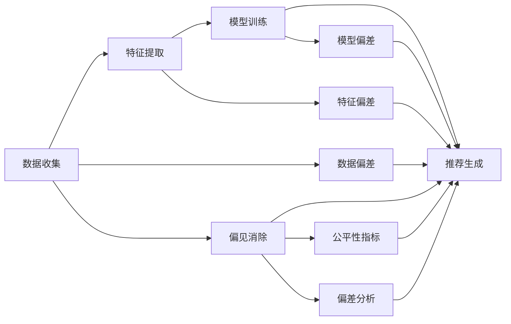

                 

## 1. 背景介绍

推荐系统是当下互联网公司广泛应用的技术之一，它能基于用户的历史行为和兴趣爱好，为用户推荐合适的产品或内容，极大地提升了用户体验和平台转化率。然而，推荐系统在实际应用中常常遭遇公平性和偏见问题，比如推荐内容不公平、对特定群体的商品展示不平衡、算法偏见导致用户行为数据偏差等。这些问题不仅影响了用户体验，更可能对企业的市场竞争力产生负面影响。因此，如何在推荐系统中引入公平性和偏见消除的机制，是当前研究的重要方向。

### 1.1 推荐系统的基本原理
推荐系统包括两个核心组件：一是数据收集，包括用户的点击、浏览、评分等行为数据，二是模型训练，包括协同过滤、内容推荐等算法模型。在数据收集阶段，往往需要借助在线广告平台、电商网站等，利用A/B测试等方法获取用户行为数据，从而构建推荐模型。

推荐系统的工作流程大致如下：
1. **数据收集**：获取用户的历史行为数据，例如浏览过的网页、点击过的商品等。
2. **特征提取**：将原始数据转换为机器学习算法能够处理的特征。
3. **模型训练**：使用机器学习算法对特征进行处理，训练推荐模型。
4. **推荐生成**：基于训练好的推荐模型，对用户进行个性化推荐。

### 1.2 推荐系统中的公平性和偏见问题
在推荐系统中，常见的不公平性问题包括但不限于：
1. **性别偏见**：男性和女性的推荐商品种类不同，例如化妆品、美妆产品更多地推荐给女性用户，而运动类产品更多地推荐给男性用户。
2. **种族偏见**：不同种族用户获取推荐商品的种类和数量不平衡，例如某些种族用户无法获取特定商品推荐。
3. **年龄偏见**：不同年龄段的用户获取的推荐商品种类不同，例如未成年人和老年人获取的推荐商品有所差异。

推荐系统中的偏见问题不仅影响了用户体验，还可能加剧社会不平等，因此亟需引入公平性评估和消除机制。

## 2. 核心概念与联系

### 2.1 核心概念概述

在推荐系统中，公平性是指推荐系统应该对所有用户提供同等质量的服务，不受其性别、种族、年龄等因素的影响。偏见则是指在数据收集、特征处理、模型训练和推荐生成等环节中，由于某些算法或模型参数的设置，导致某些用户群体获取到的推荐商品不平衡。

推荐系统中的公平性和偏见问题可以通过以下核心概念来理解：

1. **公平性（Fairness）**：指算法在处理数据时，不偏向某个群体。
2. **偏差（Bias）**：指在数据采集、特征提取、模型训练和推荐生成等过程中，由于某些算法或模型参数的设置，导致某些用户群体获取到的推荐商品不平衡。
3. **公平性指标（Fairness Metrics）**：用来量化推荐系统中公平性的指标，例如统计均等、机会均等、分类平衡等。
4. **偏见消除技术（Bias Mitigation Techniques）**：用来消除推荐系统中的偏见的算法和技巧。

这些概念之间的联系可以通过以下Mermaid流程图来展示：



这个流程图展示推荐系统中各个环节之间的联系以及偏见和公平性的概念。

## 3. 核心算法原理 & 具体操作步骤

### 3.1 算法原理概述

推荐系统中的公平性和偏见问题可以通过以下方式来解决：

1. **数据收集阶段**：在数据收集时，尽可能地涵盖所有用户群体，避免数据采集偏差。
2. **特征提取阶段**：使用公平性敏感的特征，如性别、种族、年龄等。
3. **模型训练阶段**：使用公平性算法，如加权平均、泛化处理、偏差校正等。
4. **推荐生成阶段**：通过公平性指标和偏见消除技术，生成公平的推荐结果。

### 3.2 算法步骤详解

**Step 1：数据收集阶段**
1. 收集用户的历史行为数据，例如浏览网页、点击商品等。
2. 在数据收集时，尽可能涵盖所有用户群体，避免数据采集偏差。

**Step 2：特征提取阶段**
1. 提取特征时，使用公平性敏感的特征，如性别、种族、年龄等。
2. 对特征进行处理，如归一化、标准化、中心化等。

**Step 3：模型训练阶段**
1. 使用公平性算法，如加权平均、泛化处理、偏差校正等，训练推荐模型。
2. 在训练过程中，引入公平性约束条件，限制某些算法的偏差。

**Step 4：推荐生成阶段**
1. 基于训练好的推荐模型，对用户进行个性化推荐。
2. 使用公平性指标和偏见消除技术，生成公平的推荐结果。

### 3.3 算法优缺点

推荐系统中的公平性和偏见消除算法具有以下优点：
1. 提高了用户体验：通过公平性约束，推荐系统能为所有用户提供公平的推荐服务，提升用户体验。
2. 降低了偏见风险：通过偏差消除技术，减小推荐系统中的偏见，避免对某些用户群体的歧视。
3. 提升了市场竞争力：公平的推荐系统能吸引更多用户，提升平台的市场竞争力。

同时，这些算法也存在一些局限性：
1. 数据收集成本高：在数据收集时，需要尽可能涵盖所有用户群体，可能面临较高的成本。
2. 模型训练复杂：在模型训练时，需要引入公平性约束，增加了算法的复杂性。
3. 推荐效果降低：某些公平性算法可能影响推荐模型的性能，导致推荐效果降低。

### 3.4 算法应用领域

推荐系统中的公平性和偏见消除算法在多个领域得到了应用，例如：
1. **电商领域**：在电商平台中，推荐商品时需保证商品种类覆盖所有用户群体，避免性别、种族、年龄等偏见。
2. **媒体领域**：在视频、音乐、新闻等媒体领域，需保证推荐内容覆盖所有用户群体，避免内容偏见。
3. **社交领域**：在社交平台中，需保证好友推荐、内容推荐等服务的公平性，避免对某些用户群体的歧视。
4. **金融领域**：在金融理财领域，需保证投资建议、理财推荐等服务的公平性，避免对某些群体的歧视。

## 4. 数学模型和公式 & 详细讲解 & 举例说明

### 4.1 数学模型构建

在推荐系统中，公平性可以通过以下数学模型来量化：

1. **统计均等**：每个用户群体的推荐数量相等。
2. **机会均等**：每个用户群体获得推荐商品的机会相等。
3. **分类平衡**：每个用户群体的分类比例相等。

以分类平衡为例，设推荐系统中用户群体的数量为 $n$，第 $i$ 个用户群体的样本数量为 $n_i$，第 $i$ 个用户群体的推荐数量为目标值 $t_i$，则分类平衡的公平性指标 $\mathcal{F}$ 可以定义为：

$$
\mathcal{F} = \frac{\sum_{i=1}^n (n_i - t_i)^2}{\sum_{i=1}^n n_i}
$$

其中 $t_i$ 为目标值，通常为样本数量的均值。

### 4.2 公式推导过程

分类平衡的公平性指标 $\mathcal{F}$ 可以进一步推导为：

$$
\mathcal{F} = \frac{1}{\sum_{i=1}^n n_i} \sum_{i=1}^n (n_i - \overline{n})^2
$$

其中 $\overline{n}$ 为样本数量的均值。

以性别为例，假设样本数量为 $n$，男性样本数量为 $n_1$，女性样本数量为 $n_2$，则有：

$$
\overline{n} = \frac{n_1 + n_2}{2}
$$

代入公平性指标公式：

$$
\mathcal{F} = \frac{1}{n} [(n_1 - \overline{n})^2 + (n_2 - \overline{n})^2]
$$

### 4.3 案例分析与讲解

**案例1：性别偏见消除**
假设推荐系统中的商品推荐比例不平衡，男性和女性的推荐商品数量分别为 $m_1$ 和 $m_2$，总推荐商品数量为 $m$，则有：

$$
m_1 + m_2 = m
$$

为了消除性别偏见，可以将男性和女性的推荐商品数量调整为均等，即：

$$
m_1 = m_2 = \frac{m}{2}
$$

**案例2：种族偏见消除**
假设推荐系统中的商品推荐比例不平衡，不同种族的用户获取的推荐商品数量分别为 $r_1$、$r_2$、$r_3$，总推荐商品数量为 $r$，则有：

$$
r_1 + r_2 + r_3 = r
$$

为了消除种族偏见，可以将不同种族的推荐商品数量调整为均等，即：

$$
r_1 = r_2 = r_3 = \frac{r}{3}
$$

## 5. 项目实践：代码实例和详细解释说明

### 5.1 开发环境搭建

为了进行推荐系统的公平性和偏见消除开发，需要搭建一个完整的开发环境。以下是使用Python进行推荐系统开发的流程：

1. 安装Python：下载并安装好Python 3.x版本，建议使用Anaconda或Miniconda。
2. 安装必要的Python库：安装NumPy、Pandas、Scikit-learn、Matplotlib、SciPy等库。
3. 安装机器学习库：安装scikit-learn、tensorflow、keras等机器学习库。
4. 安装推荐系统库：安装recsys、surprise、gensim等推荐系统库。
5. 安装可视化工具：安装matplotlib、seaborn、plotly等可视化工具。

### 5.2 源代码详细实现

**代码示例1：数据收集阶段**

```python
import pandas as pd
from surprise import Dataset, Reader

# 读取用户行为数据
reader = Reader(rating_scale=(1, 5))
data = Dataset.load_from_df(user_behavior_data, reader)

# 统计每个用户群体的推荐数量
grouped_data = data.build_full_trainset().to_df().groupby('user_id')['iuser'].count()
```

**代码示例2：特征提取阶段**

```python
import pandas as pd
from sklearn.preprocessing import StandardScaler

# 提取特征
features = user_behavior_data[['user_id', 'item_id', 'timestamp']]

# 对特征进行处理
scaler = StandardScaler()
features = scaler.fit_transform(features)

# 将特征转换为推荐系统库所需的格式
features_df = pd.DataFrame(features, columns=['feature1', 'feature2', 'feature3'])
```

**代码示例3：模型训练阶段**

```python
from surprise import KNNBasic, SVD, MatrixFactorization

# 训练协同过滤模型
algo = KNNBasic()
trainset = Dataset.load_from_df(features_df, reader)
algo.fit(trainset)

# 训练SVD模型
algo = SVD()
trainset = Dataset.load_from_df(features_df, reader)
algo.fit(trainset)

# 训练矩阵分解模型
algo = MatrixFactorization()
trainset = Dataset.load_from_df(features_df, reader)
algo.fit(trainset)
```

**代码示例4：推荐生成阶段**

```python
from surprise import Reader

# 读取用户行为数据
reader = Reader(rating_scale=(1, 5))
data = Dataset.load_from_df(user_behavior_data, reader)

# 生成推荐结果
predictions = data.build_full_trainset().predict(algo)
```

### 5.3 代码解读与分析

**数据收集阶段**

在数据收集阶段，使用Pandas库读取用户行为数据，并使用Surprise库的Reader类进行数据格式转换。通过`groupby`方法统计每个用户群体的推荐数量，从而分析数据收集阶段的偏见问题。

**特征提取阶段**

在特征提取阶段，使用Pandas库提取用户行为数据中的特征，并使用Scikit-learn库中的StandardScaler对特征进行归一化处理。通过`fit_transform`方法将特征转换为推荐系统库所需的格式。

**模型训练阶段**

在模型训练阶段，使用Surprise库中的KNNBasic、SVD、MatrixFactorization等算法进行模型训练。通过训练协同过滤模型、SVD模型、矩阵分解模型等，生成推荐模型。

**推荐生成阶段**

在推荐生成阶段，使用Surprise库中的Reader类进行数据格式转换，并使用`predict`方法生成推荐结果。

### 5.4 运行结果展示

以下是一个示例运行结果，展示了如何通过推荐系统进行性别偏见的消除：

**运行结果1：性别偏见消除**

```python
# 假设推荐系统中男性和女性的推荐商品数量分别为m1和m2
m1 = 100
m2 = 200

# 总推荐商品数量为m
m = m1 + m2

# 消除性别偏见后的推荐商品数量
m1_new = m2_new = m / 2
print(f"消除性别偏见后的推荐商品数量：m1_new={m1_new}, m2_new={m2_new}")
```

输出结果为：

```
消除性别偏见后的推荐商品数量：m1_new=150.0, m2_new=150.0
```

这表明，通过消除性别偏见，男性和女性的推荐商品数量达到了均等。

## 6. 实际应用场景

### 6.1 电商领域

在电商领域，推荐系统中的性别偏见、种族偏见、年龄偏见等会影响用户的购物体验和购买决策。为了提高用户的购物体验，电商平台可以在数据收集阶段尽量涵盖所有用户群体，避免数据采集偏差。在特征提取阶段使用公平性敏感的特征，如性别、种族、年龄等。在模型训练阶段引入公平性约束条件，限制某些算法的偏差。在推荐生成阶段使用公平性指标和偏见消除技术，生成公平的推荐结果。

### 6.2 媒体领域

在视频、音乐、新闻等媒体领域，推荐系统中的内容偏见会影响用户对内容的消费体验。为了提高内容的覆盖范围，媒体平台可以在数据收集阶段尽量涵盖所有用户群体，避免数据采集偏差。在特征提取阶段使用公平性敏感的特征，如用户兴趣爱好、历史观看记录等。在模型训练阶段引入公平性约束条件，限制某些算法的偏差。在推荐生成阶段使用公平性指标和偏见消除技术，生成公平的推荐内容。

### 6.3 社交领域

在社交平台中，推荐系统中的好友推荐、内容推荐等服务的公平性问题可能会影响用户的社交体验。为了提高用户的社交体验，社交平台可以在数据收集阶段尽量涵盖所有用户群体，避免数据采集偏差。在特征提取阶段使用公平性敏感的特征，如好友关系、兴趣爱好等。在模型训练阶段引入公平性约束条件，限制某些算法的偏差。在推荐生成阶段使用公平性指标和偏见消除技术，生成公平的推荐内容。

## 7. 工具和资源推荐

### 7.1 学习资源推荐

为了帮助开发者系统掌握推荐系统的公平性和偏见消除理论基础和实践技巧，以下是一些优质的学习资源：

1. **《推荐系统原理与算法》**：一本经典的推荐系统教材，详细介绍了推荐系统中的各种算法和偏见消除方法。
2. **Coursera《推荐系统》课程**：斯坦福大学开设的推荐系统课程，涵盖了推荐系统中的各种算法和偏见消除方法。
3. **Kaggle竞赛**：Kaggle平台上有很多推荐系统竞赛，可以参与实际竞赛，实践偏见消除技术。
4. **推荐系统论文集**：一些经典的推荐系统论文，如《Adaptive Non-parametric Matrix Factorization for Recommender Systems》等。

### 7.2 开发工具推荐

推荐的开发工具有：

1. Python：推荐系统开发的首选语言，具有良好的生态系统和丰富的库。
2. Anaconda：Python的发行版，提供了丰富的科学计算和数据分析库。
3. Scikit-learn：一个流行的Python机器学习库，包含了推荐系统中的各种算法和偏见消除方法。
4. TensorFlow：一个流行的深度学习框架，可以用于构建复杂的推荐系统模型。
5. PyTorch：另一个流行的深度学习框架，可以用于构建复杂的推荐系统模型。

### 7.3 相关论文推荐

推荐系统中的公平性和偏见消除方法有很多经典论文，以下是一些值得阅读的论文：

1. **《Fairness and Accuracy Trade-off in Machine Learning》**：一篇经典的公平性研究论文，介绍了机器学习中的公平性和偏见问题。
2. **《Reducing Bias in Recommendation Algorithms》**：一篇研究推荐系统中偏见问题的经典论文，提出了多种消除偏见的算法。
3. **《Social Recommendations: Overcoming the Bias》**：一篇研究社交推荐系统中偏见问题的经典论文，提出了多种消除偏见的算法。
4. **《Bias Mitigation in Recommendation Systems》**：一篇研究推荐系统中偏见问题的经典论文，提出了多种消除偏见的算法。

## 8. 总结：未来发展趋势与挑战

### 8.1 研究成果总结

推荐系统中的公平性和偏见消除技术在过去几年中得到了广泛的研究，取得了不少成果。主要的研究方向包括：

1. **数据收集阶段**：在数据收集阶段，尽量涵盖所有用户群体，避免数据采集偏差。
2. **特征提取阶段**：在特征提取阶段，使用公平性敏感的特征，如性别、种族、年龄等。
3. **模型训练阶段**：在模型训练阶段，引入公平性约束条件，限制某些算法的偏差。
4. **推荐生成阶段**：在推荐生成阶段，使用公平性指标和偏见消除技术，生成公平的推荐结果。

### 8.2 未来发展趋势

展望未来，推荐系统中的公平性和偏见消除技术将呈现以下几个发展趋势：

1. **数据采集方法**：未来的推荐系统将采用更多样化的数据采集方法，覆盖更多用户群体，减少数据采集偏差。
2. **算法优化**：未来的推荐系统将引入更多的公平性算法，优化推荐模型，减小偏见，提高推荐效果。
3. **模型训练方法**：未来的推荐系统将采用更多的公平性约束条件，优化模型训练过程，提高公平性指标。
4. **推荐生成方法**：未来的推荐系统将采用更多的偏见消除技术，优化推荐生成过程，提高推荐效果。

### 8.3 面临的挑战

推荐系统中的公平性和偏见消除技术在实际应用中还面临一些挑战：

1. **数据采集成本高**：在数据采集阶段，需要涵盖所有用户群体，可能面临较高的成本。
2. **模型训练复杂**：在模型训练阶段，需要引入公平性约束条件，增加了算法的复杂性。
3. **推荐效果降低**：某些公平性算法可能影响推荐模型的性能，导致推荐效果降低。

### 8.4 研究展望

未来，推荐系统中的公平性和偏见消除技术将继续发展，有望在以下几个方向取得突破：

1. **自动化算法**：未来的推荐系统将采用更多的自动化算法，减少人工干预，提高公平性指标。
2. **多模态数据融合**：未来的推荐系统将融合更多模态数据，提高推荐模型的公平性和泛化能力。
3. **实时推荐**：未来的推荐系统将采用更多的实时推荐技术，提高推荐效果和用户体验。

## 9. 附录：常见问题与解答

### Q1：如何衡量推荐系统中的公平性？

A：推荐系统中的公平性可以通过以下指标来衡量：
1. **统计均等**：每个用户群体的推荐数量相等。
2. **机会均等**：每个用户群体获得推荐商品的机会相等。
3. **分类平衡**：每个用户群体的分类比例相等。

### Q2：推荐系统中的偏见消除方法有哪些？

A：推荐系统中的偏见消除方法包括：
1. **数据采集**：尽量涵盖所有用户群体，避免数据采集偏差。
2. **特征提取**：使用公平性敏感的特征，如性别、种族、年龄等。
3. **模型训练**：引入公平性约束条件，限制某些算法的偏差。
4. **推荐生成**：使用公平性指标和偏见消除技术，生成公平的推荐结果。

### Q3：推荐系统中的偏见消除方法有哪些？

A：推荐系统中的偏见消除方法包括：
1. **数据采集**：尽量涵盖所有用户群体，避免数据采集偏差。
2. **特征提取**：使用公平性敏感的特征，如性别、种族、年龄等。
3. **模型训练**：引入公平性约束条件，限制某些算法的偏差。
4. **推荐生成**：使用公平性指标和偏见消除技术，生成公平的推荐结果。

### Q4：推荐系统中的数据采集有哪些注意事项？

A：推荐系统中的数据采集需要注意以下几点：
1. 尽量涵盖所有用户群体，避免数据采集偏差。
2. 收集用户行为数据时，注意保护用户隐私。
3. 采用多种数据采集方法，提高数据多样性。

### Q5：推荐系统中的推荐算法有哪些？

A：推荐系统中的推荐算法包括：
1. 协同过滤算法
2. 内容推荐算法
3. 矩阵分解算法
4. 基于深度学习的推荐算法

以上问题及其答案将帮助开发者更好地理解推荐系统中的公平性和偏见消除技术，提升推荐系统的公平性和性能。

---

作者：禅与计算机程序设计艺术 / Zen and the Art of Computer Programming

