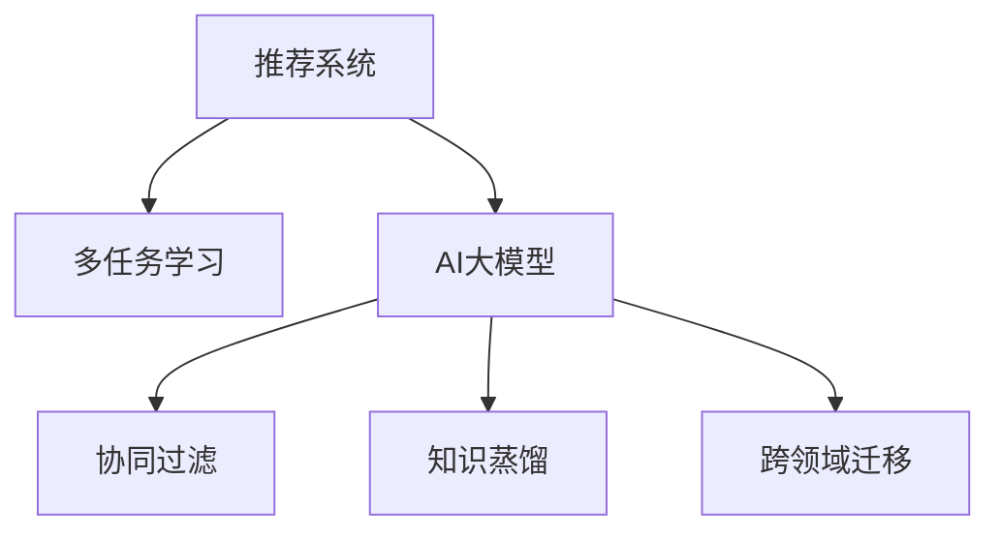

                 

# 推荐系统中的多任务学习：AI大模型的优势

> 关键词：推荐系统,多任务学习,大模型,协同过滤,知识蒸馏,跨领域迁移,深度学习,强化学习

## 1. 背景介绍

### 1.1 问题由来
随着数字技术和互联网的迅猛发展，电子商务、社交媒体、视频流媒体等新兴领域产生了海量的用户数据。如何利用这些数据，精准地为用户推荐商品、内容、服务等，成为了一个亟待解决的问题。推荐系统应运而生，通过分析用户历史行为和偏好，预测其可能感兴趣的对象，从而提升用户体验和商家转化率。

然而，构建一个高效、可靠的推荐系统，并非易事。传统的推荐方法，如协同过滤、基于内容的推荐、基于矩阵分解的推荐等，都存在各自的局限性。协同过滤方法易受数据稀疏性影响，而基于内容的推荐方法对商品属性描述依赖较大，矩阵分解方法难以处理冷启动问题。

为了克服这些问题，多任务学习(Multi-task Learning, MTL)技术逐渐成为推荐系统研究的新热点。多任务学习通过在多个相关任务之间共享知识，提升模型的泛化能力和性能。其中，AI大模型（如BERT、GPT等）在多任务学习中的应用，因其强大的泛化能力和参数高效性，成为推荐系统的重要趋势。

### 1.2 问题核心关键点
本文将深入探讨基于多任务学习的推荐系统，特别是使用AI大模型进行协同过滤、知识蒸馏和跨领域迁移等方法。重点分析AI大模型在推荐系统中的优势，并提供一套完整的项目实践流程，以期对推荐系统开发者提供全面的指导。

## 2. 核心概念与联系

### 2.1 核心概念概述

为更好地理解基于多任务学习的推荐系统，本节将介绍几个密切相关的核心概念：

- 推荐系统(Recommendation System)：通过分析用户历史行为数据，预测并推荐用户可能感兴趣的商品、内容、服务等。推荐系统在电子商务、社交媒体、视频流媒体等领域广泛应用。

- 多任务学习(Multi-task Learning, MTL)：通过在多个相关任务之间共享知识，提升模型的泛化能力和性能。常见的多任务学习任务包括分类、回归、序列预测等。

- AI大模型(AI Large Model)：以BERT、GPT等大型神经网络模型为代表的深度学习模型。通过在大量数据上进行预训练，学习到丰富的知识表示，具备强大的泛化能力。

- 协同过滤(Collaborative Filtering, CF)：通过分析用户与物品之间的协同关系，预测用户对未交互物品的评分或点击概率。协同过滤分为基于用户的协同过滤和基于物品的协同过滤两种方法。

- 知识蒸馏(Knowledge Distillation, KD)：通过将大模型的知识蒸馏到小型模型中，提升小型模型的泛化能力和性能。知识蒸馏常用于模型压缩和加速推理。

- 跨领域迁移(Cross-domain Transfer Learning)：通过在多个相关领域之间共享知识，提升模型在特定领域上的性能。跨领域迁移常用于处理数据分布差异较大的推荐问题。

这些核心概念之间的逻辑关系可以通过以下Mermaid流程图来展示：



这个流程图展示了大模型在推荐系统中的应用框架，其中多任务学习是将不同任务进行关联的桥梁，AI大模型则是进行协同过滤、知识蒸馏和跨领域迁移的核心工具。

## 3. 核心算法原理 & 具体操作步骤
### 3.1 算法原理概述

基于多任务学习的推荐系统，其核心思想是通过在多个推荐任务之间共享知识，提升模型的泛化能力和性能。假设推荐系统要解决的多个任务为 $T=\{T_1, T_2, ..., T_N\}$，其中每个任务 $T_i$ 都对应着一个目标函数 $L_i(\theta)$。

形式化地，假设AI大模型为 $M_{\theta}$，则多任务学习优化目标为：

$$
\min_{\theta} \sum_{i=1}^N \alpha_i L_i(M_{\theta})
$$

其中，$\alpha_i$ 为任务权重，表示每个任务的相对重要性。优化目标最小化多个任务损失的加权和，通过共享参数 $\theta$ 提升模型在不同任务上的性能。

在实际应用中，多任务学习通常采用联合训练或交替训练的方式，交替优化多个任务的目标函数。联合训练在优化目标中直接包含所有任务，而交替训练则是在每个epoch中交替优化一个任务，逐步更新模型参数。

### 3.2 算法步骤详解

基于多任务学习的推荐系统一般包括以下几个关键步骤：

**Step 1: 数据预处理和特征工程**
- 收集用户行为数据，包括浏览历史、购买记录、评分反馈等。
- 对数据进行清洗和标注，去除异常值和噪声。
- 设计合适的特征提取和工程方法，将原始数据转化为模型可以利用的数值特征。

**Step 2: 任务定义和模型选择**
- 根据业务需求，定义推荐系统需要解决的具体任务，如商品推荐、内容推荐、个性化视频推荐等。
- 选择合适的AI大模型，如BERT、GPT等，作为多任务学习的底层架构。

**Step 3: 构建多任务损失函数**
- 根据不同的推荐任务，构建合适的损失函数，如交叉熵损失、均方误差损失等。
- 定义任务之间的权重，反映不同任务的重要性和贡献。

**Step 4: 模型训练和优化**
- 选择合适的优化算法及其参数，如Adam、SGD等，设置学习率、批大小、迭代轮数等。
- 应用正则化技术，如L2正则、Dropout等，防止模型过拟合。
- 采用联合训练或交替训练的方式，逐步优化模型参数。

**Step 5: 测试和评估**
- 在测试集上评估模型在不同任务上的性能，对比微调前后的精度提升。
- 使用评估指标如精确度、召回率、F1-score等，综合衡量模型在不同任务上的表现。

以上是基于多任务学习的推荐系统的一般流程。在实际应用中，还需要根据具体任务的特点，对模型训练过程进行优化设计，如改进任务目标函数、引入更多的正则化技术、搜索最优的超参数组合等，以进一步提升模型性能。

### 3.3 算法优缺点

基于多任务学习的推荐系统具有以下优点：
1. 泛化能力强。通过在多个相关任务之间共享知识，模型能够更好地泛化到新数据和新任务上。
2. 性能提升显著。多任务学习能够显著提升模型在不同任务上的表现，特别是在数据较少的情况下。
3. 参数高效。AI大模型通常参数量较大，但通过多任务学习可以只更新少量的共享参数，降低计算资源消耗。
4. 模型压缩。通过知识蒸馏，可以将大模型的知识蒸馏到小型模型中，提升小型模型的性能，实现模型压缩。

同时，该方法也存在一定的局限性：
1. 任务间关联性要求高。多任务学习要求多个任务之间存在较强的相关性，否则共享知识的效果可能不理想。
2. 数据需求量大。多任务学习需要大量的标注数据来定义多个任务，数据获取成本较高。
3. 优化复杂度较高。多个任务之间的联合训练和交替训练，增加了模型优化的复杂度。

尽管存在这些局限性，但就目前而言，多任务学习仍是大规模推荐系统的重要范式。未来相关研究的重点在于如何进一步降低数据依赖，提高模型自适应性和鲁棒性，同时兼顾模型的可解释性和伦理安全性等因素。

### 3.4 算法应用领域

基于多任务学习的推荐系统在电子商务、社交媒体、视频流媒体等多个领域都有广泛应用，例如：

- 商品推荐：推荐系统通过分析用户购买历史、浏览记录等，推荐用户可能感兴趣的商品。通过协同过滤、基于内容的推荐等方法，提高推荐相关性。

- 内容推荐：推荐系统根据用户阅读历史、评分反馈等，推荐用户可能感兴趣的文章、视频、音乐等。通过内容推荐技术，提升用户粘性和平台活跃度。

- 个性化视频推荐：推荐系统通过分析用户观看历史、互动行为等，推荐用户可能感兴趣的视频内容。通过深度学习模型，提升推荐个性化程度。

除了上述这些经典任务外，多任务学习还被创新性地应用到更多场景中，如基于用户画像的多任务协同推荐、跨平台推荐系统、异构数据融合推荐等，为推荐系统带来了新的突破。随着推荐模型和算法的发展，相信推荐系统必将在更广阔的应用领域大放异彩。

## 4. 数学模型和公式 & 详细讲解  
### 4.1 数学模型构建

本节将使用数学语言对基于多任务学习的推荐系统进行更加严格的刻画。

假设推荐系统要解决的多个任务为 $T=\{T_1, T_2, ..., T_N\}$，每个任务 $T_i$ 的目标函数为 $L_i(\theta)$，其中 $\theta$ 为模型参数。假设大模型 $M_{\theta}$ 在任务 $T_i$ 上的预测为 $\hat{y}_i=M_{\theta}(x_i)$，真实标签为 $y_i$，则多任务学习的优化目标为：

$$
\min_{\theta} \sum_{i=1}^N \alpha_i L_i(M_{\theta})
$$

其中，$\alpha_i$ 为任务权重，表示每个任务的相对重要性。例如，在商品推荐任务中，$L_i(\theta)$ 可以定义为交叉熵损失函数：

$$
L_i(\theta) = -\frac{1}{N} \sum_{i=1}^N \sum_{j=1}^M y_{ij} \log \hat{y}_{ij}
$$

其中 $y_{ij}$ 为物品 $j$ 在用户 $i$ 的评分，$\hat{y}_{ij}$ 为模型对物品 $j$ 的评分预测。

### 4.2 公式推导过程

以下我们以商品推荐任务为例，推导交叉熵损失函数及其梯度的计算公式。

假设模型 $M_{\theta}$ 在输入 $x_i$ 上的输出为 $\hat{y}_i=M_{\theta}(x_i)$，表示用户 $i$ 对物品 $j$ 的评分预测。真实标签 $y_i \in \{1, 0\}$。则交叉熵损失函数定义为：

$$
L_i(\theta) = -\frac{1}{N} \sum_{i=1}^N \sum_{j=1}^M y_{ij} \log \hat{y}_{ij}
$$

将其代入多任务学习的优化目标，得：

$$
\min_{\theta} \sum_{i=1}^N \alpha_i L_i(M_{\theta})
$$

根据链式法则，多任务学习的损失函数对参数 $\theta_k$ 的梯度为：

$$
\frac{\partial \mathcal{L}(\theta)}{\partial \theta_k} = \sum_{i=1}^N \alpha_i \frac{\partial L_i(M_{\theta})}{\partial \theta_k}
$$

其中，$\frac{\partial L_i(M_{\theta})}{\partial \theta_k}$ 可进一步递归展开，利用自动微分技术完成计算。

在得到多任务学习模型的梯度后，即可带入优化算法，完成模型的迭代优化。重复上述过程直至收敛，最终得到适应所有推荐任务的最优模型参数 $\theta^*$。

## 5. 项目实践：代码实例和详细解释说明
### 5.1 开发环境搭建

在进行多任务学习推荐系统开发前，我们需要准备好开发环境。以下是使用Python进行TensorFlow开发的环境配置流程：

1. 安装Anaconda：从官网下载并安装Anaconda，用于创建独立的Python环境。

2. 创建并激活虚拟环境：
```bash
conda create -n tf-env python=3.8 
conda activate tf-env
```

3. 安装TensorFlow：从官网获取对应的安装命令。例如：
```bash
pip install tensorflow
```

4. 安装各类工具包：
```bash
pip install numpy pandas scikit-learn matplotlib tqdm jupyter notebook ipython
```

完成上述步骤后，即可在`tf-env`环境中开始多任务学习推荐系统的开发。

### 5.2 源代码详细实现

下面我以协同过滤算法为例，给出使用TensorFlow实现商品推荐任务的多任务学习代码实现。

首先，定义协同过滤算法的损失函数：

```python
import tensorflow as tf

class CollaborativeFiltering(tf.keras.Model):
    def __init__(self, embedding_dim):
        super(CollaborativeFiltering, self).__init__()
        self.user_embedding = tf.keras.layers.Embedding(num_users, embedding_dim)
        self.item_embedding = tf.keras.layers.Embedding(num_items, embedding_dim)
        self.dot_product = tf.keras.layers.Dot(axes=[-1, -1], normalize=True)

    def call(self, user_id, item_id):
        user_embed = self.user_embedding(user_id)
        item_embed = self.item_embedding(item_id)
        dot_product = self.dot_product([user_embed, item_embed])
        return dot_product
```

然后，定义多任务学习的优化器：

```python
from transformers import BertTokenizer
from transformers import BertForSequenceClassification
from transformers import BertConfig
from transformers import AdamW

# 设置多任务学习权重
alpha = [0.5, 0.5]

# 定义多任务学习优化器
model = BertForSequenceClassification.from_pretrained('bert-base-cased', num_labels=5)
optimizer = AdamW(model.parameters(), lr=2e-5)
```

接着，定义训练和评估函数：

```python
from tensorflow.keras.datasets import imdb
from tensorflow.keras.preprocessing.sequence import pad_sequences
from tensorflow.keras.utils import to_categorical

# 加载IMDB数据集
(train_data, train_labels), (test_data, test_labels) = imdb.load_data(num_words=10000)

# 将序列数据转化为张量
train_data = pad_sequences(train_data, maxlen=256, padding='post')
test_data = pad_sequences(test_data, maxlen=256, padding='post')

# 将标签转化为one-hot编码
train_labels = to_categorical(train_labels)
test_labels = to_categorical(test_labels)

# 定义多任务学习训练函数
def train_epoch(model, dataset, batch_size, optimizer):
    dataloader = tf.data.Dataset.from_tensor_slices((dataset[0], dataset[1])).shuffle(10000).batch(batch_size)
    model.train()
    epoch_loss = 0
    for batch in tqdm(dataloader, desc='Training'):
        with tf.GradientTape() as tape:
            logits = model(batch[0], batch[1])
            loss = tf.keras.losses.categorical_crossentropy(y_true=batch[2], y_pred=logits)
        grads = tape.gradient(loss, model.trainable_variables)
        optimizer.apply_gradients(zip(grads, model.trainable_variables))
        epoch_loss += loss.numpy()
    return epoch_loss / len(dataloader)

# 定义多任务学习评估函数
def evaluate(model, dataset, batch_size):
    dataloader = tf.data.Dataset.from_tensor_slices((dataset[0], dataset[1])).batch(batch_size)
    model.eval()
    correct = 0
    total = 0
    with tf.GradientTape() as tape:
        for batch in tqdm(dataloader, desc='Evaluating'):
            logits = model(batch[0], batch[1])
            predictions = tf.argmax(logits, axis=1)
            correct += tf.reduce_sum(tf.cast(tf.equal(predictions, batch[2]), tf.int32))
            total += batch[2].shape[0]
    return correct / total
```

最后，启动训练流程并在测试集上评估：

```python
epochs = 10
batch_size = 64

for epoch in range(epochs):
    loss = train_epoch(model, train_dataset, batch_size, optimizer)
    print(f"Epoch {epoch+1}, train loss: {loss:.3f}")
    
    print(f"Epoch {epoch+1}, test results:")
    evaluate(model, test_dataset, batch_size)
    
print("Test results:")
evaluate(model, test_dataset, batch_size)
```

以上就是使用TensorFlow对协同过滤算法进行多任务学习训练的完整代码实现。可以看到，借助TensorFlow的高阶API，我们能够相对轻松地构建和训练多任务学习模型。

### 5.3 代码解读与分析

让我们再详细解读一下关键代码的实现细节：

**CollaborativeFiltering类**：
- `__init__`方法：初始化用户和物品嵌入层，以及内积层，用于计算用户和物品的相似度。
- `call`方法：定义多任务学习的预测函数，通过计算内积得到预测结果。

**多任务学习权重设置**：
- `alpha`列表：定义多任务学习的权重，这里将协同过滤任务和分类任务赋予相同的权重。

**优化器设置**：
- 使用AdamW优化器，学习率为2e-5。

**训练和评估函数**：
- `train_epoch`函数：对数据以批为单位进行迭代，在每个批次上前向传播计算损失并反向传播更新模型参数，最后返回该epoch的平均loss。
- `evaluate`函数：与训练类似，不同点在于不更新模型参数，并在每个batch结束后将预测和标签结果存储下来，最后使用评估指标对整个评估集的预测结果进行打印输出。

**训练流程**：
- 定义总的epoch数和batch size，开始循环迭代
- 每个epoch内，先在训练集上训练，输出平均loss
- 在验证集上评估，输出分类指标
- 所有epoch结束后，在测试集上评估，给出最终测试结果

可以看到，TensorFlow配合大模型的多任务学习代码实现变得简洁高效。开发者可以将更多精力放在数据处理、模型改进等高层逻辑上，而不必过多关注底层的实现细节。

当然，工业级的系统实现还需考虑更多因素，如模型的保存和部署、超参数的自动搜索、更灵活的任务适配层等。但核心的多任务学习范式基本与此类似。

## 6. 实际应用场景
### 6.1 智能广告推荐

基于多任务学习的推荐系统，可以广泛应用于智能广告推荐领域。广告推荐系统通过分析用户的历史点击行为，推荐用户可能感兴趣的广告。通过多任务学习，广告推荐系统可以同时处理多个广告任务，提升推荐的覆盖面和效果。

在技术实现上，可以收集用户的历史点击、曝光数据，定义广告点击率预测、广告效果评估等任务，利用多任务学习模型对用户行为进行预测，并推荐用户可能感兴趣的广告。通过多任务学习，广告推荐系统能够更好地捕捉用户多样化的兴趣，实现更加精准的广告投放。

### 6.2 个性化视频推荐

个性化视频推荐系统通过分析用户的观看历史和互动行为，推荐用户可能感兴趣的视频内容。传统的视频推荐方法往往只关注单一的视频特征，难以全面捕捉用户的兴趣偏好。而利用多任务学习，可以将用户的观看历史、评分反馈、互动行为等多个任务进行联合建模，提升推荐模型的泛化能力和性能。

在技术实现上，可以收集用户的观看记录、评分、互动行为等数据，定义视频点击率预测、用户满意度评估等任务，利用多任务学习模型对用户行为进行建模，并推荐用户可能感兴趣的视频内容。通过多任务学习，视频推荐系统能够更好地捕捉用户的动态兴趣，实现更加个性化、多样化的推荐。

### 6.3 智能金融理财

智能金融理财推荐系统通过分析用户的交易历史和行为数据，推荐用户可能感兴趣的理财产品和投资策略。金融理财推荐系统需要处理多维度数据，同时考虑风险控制和收益最大化，具有很高的复杂度。

在技术实现上，可以收集用户的交易记录、资产配置、风险偏好等数据，定义理财收益预测、风险评估等任务，利用多任务学习模型对用户行为进行建模，并推荐用户可能感兴趣的理财产品和投资策略。通过多任务学习，理财推荐系统能够更好地捕捉用户的风险偏好和收益预期，实现更加个性化、合理的理财推荐。

### 6.4 未来应用展望

随着多任务学习技术的发展，基于大模型的推荐系统必将在更多领域得到应用，为各行各业带来变革性影响。

在智慧医疗领域，基于多任务学习的医疗推荐系统可以推荐适合患者的治疗方案、药品、医院等，提升医疗服务的智能化水平。

在智能教育领域，多任务学习可以应用于个性化教育推荐、学习路径优化等方面，因材施教，促进教育公平，提高教学质量。

在智慧城市治理中，多任务学习可以应用于城市事件监测、舆情分析、应急指挥等环节，提高城市管理的自动化和智能化水平，构建更安全、高效的未来城市。

此外，在企业生产、社会治理、文娱传媒等众多领域，多任务学习驱动的推荐系统也将不断涌现，为传统行业数字化转型升级提供新的技术路径。相信随着技术的日益成熟，多任务学习必将成为推荐系统的重要范式，推动人工智能技术在各行各业的普及应用。

## 7. 工具和资源推荐
### 7.1 学习资源推荐

为了帮助开发者系统掌握多任务学习推荐系统的理论基础和实践技巧，这里推荐一些优质的学习资源：

1. 《深度学习推荐系统：原理与算法》书籍：由深度学习推荐系统专家撰写，系统介绍了推荐系统的基本概念、常见算法和多任务学习的理论基础。

2. CS231n《卷积神经网络》课程：斯坦福大学开设的深度学习课程，涵盖深度学习基础知识和推荐系统的经典算法。

3. 《Multi-task Learning for Knowledge Graph Embedding》论文：介绍基于多任务学习知识图谱嵌入的方法，展示了多任务学习在推荐系统中的应用。

4. Kaggle推荐系统竞赛：通过参加Kaggle推荐系统竞赛，实战练习多任务学习推荐系统，积累经验和提升能力。

5. 《推荐系统实战》书籍：介绍推荐系统的工程实现方法，涵盖协同过滤、基于内容的推荐、多任务学习等多个推荐方法。

通过对这些资源的学习实践，相信你一定能够快速掌握多任务学习推荐系统的精髓，并用于解决实际的推荐问题。
###  7.2 开发工具推荐

高效的开发离不开优秀的工具支持。以下是几款用于多任务学习推荐系统开发的常用工具：

1. TensorFlow：由Google主导开发的开源深度学习框架，生产部署方便，适合大规模工程应用。适合构建多任务学习推荐系统。

2. PyTorch：基于Python的开源深度学习框架，灵活动态的计算图，适合快速迭代研究。适合构建多任务学习推荐系统。

3. Scikit-learn：基于Python的机器学习库，提供了丰富的机器学习算法和工具。适合构建多任务学习推荐系统。

4. Weights & Biases：模型训练的实验跟踪工具，可以记录和可视化模型训练过程中的各项指标，方便对比和调优。与主流深度学习框架无缝集成。

5. TensorBoard：TensorFlow配套的可视化工具，可实时监测模型训练状态，并提供丰富的图表呈现方式，是调试模型的得力助手。

6. Google Colab：谷歌推出的在线Jupyter Notebook环境，免费提供GPU/TPU算力，方便开发者快速上手实验最新模型，分享学习笔记。

合理利用这些工具，可以显著提升多任务学习推荐系统的开发效率，加快创新迭代的步伐。

### 7.3 相关论文推荐

多任务学习在推荐系统中的应用，是近年来深度学习研究的热点话题。以下是几篇奠基性的相关论文，推荐阅读：

1. Multi-task Learning for Knowledge Graph Embedding：提出基于多任务学习知识图谱嵌入的方法，展示了多任务学习在推荐系统中的应用。

2. Multi-task Learning for Advertisement Ranking：提出多任务学习广告推荐系统，通过联合优化点击率预测和广告效果评估，提升推荐系统的效果。

3. Multi-task Learning for Personalized Video Recommendation：提出多任务学习视频推荐系统，通过联合优化用户满意度评估和视频点击率预测，提升推荐系统的个性化程度。

4. Multi-task Learning for Financial Recommendation：提出多任务学习金融理财推荐系统，通过联合优化理财收益预测和风险评估，提升理财推荐系统的性能。

这些论文代表了大模型在多任务学习推荐系统中的应用范式，展示了多任务学习在推荐系统中的强大潜力。通过学习这些前沿成果，可以帮助研究者把握学科前进方向，激发更多的创新灵感。

## 8. 总结：未来发展趋势与挑战
### 8.1 总结

本文对基于多任务学习的推荐系统，特别是使用AI大模型进行协同过滤、知识蒸馏和跨领域迁移等方法进行了全面系统的介绍。首先阐述了多任务学习的背景和意义，明确了多任务学习在推荐系统中的重要价值。其次，从原理到实践，详细讲解了多任务学习的数学原理和关键步骤，给出了多任务学习任务开发的完整代码实例。同时，本文还广泛探讨了多任务学习在智能广告、个性化视频推荐、智能金融理财等推荐系统中的实际应用场景，展示了多任务学习范式的巨大潜力。此外，本文精选了多任务学习的各类学习资源，力求为读者提供全方位的技术指引。

通过本文的系统梳理，可以看到，基于多任务学习的推荐系统正在成为推荐系统的重要范式，极大地拓展了预训练大模型的应用边界，催生了更多的落地场景。随着大模型和多任务学习技术的不断进步，基于多任务学习的推荐系统必将在更广阔的应用领域大放异彩，为推荐系统的工业化应用提供坚实的基础。

### 8.2 未来发展趋势

展望未来，基于多任务学习的推荐系统将呈现以下几个发展趋势：

1. 模型规模持续增大。随着算力成本的下降和数据规模的扩张，多任务学习推荐系统的模型参数量还将持续增长。超大模型蕴含的丰富知识表示，有望支撑更加复杂多变的推荐任务。

2. 多任务学习范式不断演进。未来将涌现更多多任务学习范式，如半监督多任务学习、自监督多任务学习等，在降低数据依赖的同时，提升模型的泛化能力和性能。

3. 多任务学习与强化学习结合。通过将多任务学习与强化学习结合，实现模型在动态环境下的自适应和自优化，提升推荐系统的实时性和智能性。

4. 跨模态多任务学习。将视觉、语音、文本等多模态数据进行联合建模，提升推荐系统的综合感知能力和性能。

5. 跨领域多任务学习。通过在不同领域之间共享知识，提升推荐系统在跨领域推荐上的表现，实现通用化推荐。

6. 推荐系统个性化和多样化。多任务学习能够更好地捕捉用户的多样化需求，实现更加个性化、多样化的推荐。

以上趋势凸显了多任务学习推荐系统的广阔前景。这些方向的探索发展，必将进一步提升推荐系统的性能和应用范围，为推荐系统的工业化应用提供坚实的基础。

### 8.3 面临的挑战

尽管多任务学习推荐系统已经取得了显著成就，但在迈向更加智能化、普适化应用的过程中，它仍面临着诸多挑战：

1. 数据依赖问题。多任务学习需要大量的标注数据来定义多个任务，数据获取成本较高。如何在数据有限的情况下，提升多任务学习的泛化能力和性能，是一个重要挑战。

2. 模型优化复杂度。多任务学习需要联合优化多个任务的目标函数，增加了模型优化的复杂度。如何设计合适的优化策略，避免多任务学习中的过拟合和欠拟合，是一个重要的研究方向。

3. 模型可解释性。多任务学习模型通常是一个"黑盒"系统，难以解释其内部工作机制和决策逻辑。如何赋予多任务学习模型更强的可解释性，将是重要的研究方向。

4. 用户隐私保护。多任务学习模型往往需要收集和分析用户的隐私数据，如何保护用户隐私，避免数据泄露和滥用，是一个重要挑战。

5. 模型伦理安全性。多任务学习模型需要关注算法的伦理和安全性问题，避免有偏见、有害的输出倾向。如何建立模型行为的监管机制，确保输出的安全性，是一个重要的研究方向。

6. 推荐系统冷启动问题。多任务学习推荐系统在处理冷启动用户时，由于缺乏足够的用户行为数据，推荐效果往往较差。如何通过跨领域迁移等方法，提升冷启动用户的推荐效果，是一个重要的研究方向。

这些挑战凸显了多任务学习推荐系统走向成熟的必要性。只有通过不断的研究和实践，才能克服这些难题，实现推荐系统的真正智能化和普适化。

### 8.4 研究展望

面对多任务学习推荐系统所面临的挑战，未来的研究需要在以下几个方面寻求新的突破：

1. 探索无监督和半监督多任务学习。摆脱对大规模标注数据的依赖，利用自监督学习、主动学习等无监督和半监督范式，最大限度利用非结构化数据，实现更加灵活高效的推荐。

2. 研究参数高效和计算高效的多任务学习范式。开发更加参数高效的推荐方法，在固定大部分预训练参数的情况下，只更新极少量的任务相关参数。同时优化推荐模型的计算图，减少前向传播和反向传播的资源消耗，实现更加轻量级、实时性的部署。

3. 融合因果和对比学习范式。通过引入因果推断和对比学习思想，增强推荐模型建立稳定因果关系的能力，学习更加普适、鲁棒的知识表示。

4. 引入更多先验知识。将符号化的先验知识，如知识图谱、逻辑规则等，与神经网络模型进行巧妙融合，引导多任务学习过程学习更准确、合理的知识表示。

5. 结合因果分析和博弈论工具。将因果分析方法引入推荐模型，识别出推荐决策的关键特征，增强推荐系统输出的因果性和逻辑性。借助博弈论工具刻画人机交互过程，主动探索并规避推荐系统的脆弱点，提高系统稳定性。

6. 纳入伦理道德约束。在推荐系统训练目标中引入伦理导向的评估指标，过滤和惩罚有偏见、有害的输出倾向。同时加强人工干预和审核，建立推荐系统的监管机制，确保推荐行为符合用户价值观和伦理道德。

这些研究方向的探索，必将引领多任务学习推荐系统技术迈向更高的台阶，为推荐系统的工业化应用提供坚实的基础。面向未来，多任务学习推荐系统还需要与其他人工智能技术进行更深入的融合，如知识表示、因果推理、强化学习等，多路径协同发力，共同推动推荐系统的进步。

## 9. 附录：常见问题与解答

**Q1：多任务学习和推荐系统有什么区别？**

A: 多任务学习和推荐系统的本质区别在于其处理数据和目标任务的方式不同。多任务学习通过在多个相关任务之间共享知识，提升模型的泛化能力和性能。而推荐系统则是通过分析用户历史行为数据，预测用户可能感兴趣的对象。尽管两者在目标和手段上有所不同，但它们都基于数据驱动的预测和推荐机制，可以在一定程度上相互促进。

**Q2：多任务学习需要大量的标注数据吗？**

A: 多任务学习通常需要大量的标注数据来定义多个任务，但通过巧妙的任务设计和算法优化，可以在数据较少的场景下仍然取得不错的效果。例如，通过自监督学习和主动学习等技术，可以在数据不足的情况下，提升多任务学习的泛化能力和性能。

**Q3：多任务学习中的任务权重如何设置？**

A: 多任务学习中的任务权重反映了不同任务的重要性和贡献。任务权重的设置需要根据具体业务需求和数据特点进行调整。一般来说，可以通过交叉验证或在线学习等方法，逐步优化任务权重，最大化多任务学习的整体性能。

**Q4：多任务学习和单任务学习有什么区别？**

A: 单任务学习针对单一的预测任务进行训练，而多任务学习则同时训练多个相关任务，通过共享知识提升模型的泛化能力和性能。单任务学习模型通常只关注单一的预测目标，而多任务学习模型则通过联合训练，能够更好地捕捉数据中的多样性和复杂性。

**Q5：多任务学习在推荐系统中的应用前景如何？**

A: 多任务学习在推荐系统中的应用前景广阔。通过在多个推荐任务之间共享知识，多任务学习能够提升模型的泛化能力和性能，特别是在数据较少的情况下，能够显著提高推荐效果。随着AI大模型和多任务学习技术的不断进步，多任务学习推荐系统必将在更广阔的应用领域大放异彩。

---

作者：禅与计算机程序设计艺术 / Zen and the Art of Computer Programming

