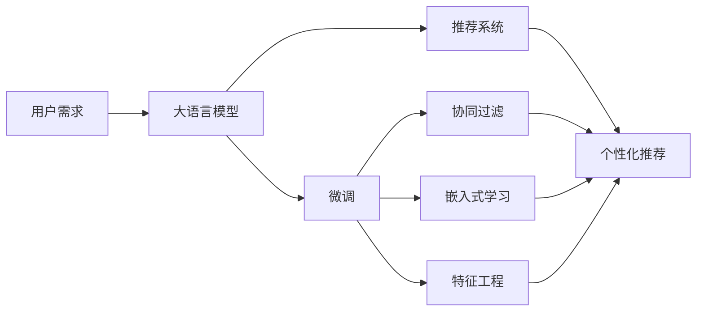

                 

# 推荐系统中的多场景适配：大模型的新思路

> 关键词：推荐系统,大模型,多场景适配,个性化推荐,协同过滤,深度学习,特征工程,嵌入式学习

## 1. 背景介绍

### 1.1 问题由来

在信息化快速发展的今天，推荐系统已经成为了互联网产品中不可或缺的一部分，广泛应用于电商、新闻、社交、视频等领域。推荐系统通过对用户行为数据的分析和挖掘，向用户提供符合其兴趣和需求的个性化内容推荐。然而，推荐系统面临的挑战也越来越多：用户需求不断变化，个性化推荐难度增大，数据维度高、噪音多，推荐系统模型需要具备跨场景适应能力等。

大语言模型（Large Language Model, LLM）作为当前自然语言处理（Natural Language Processing, NLP）领域的新宠，其强大的语言理解和生成能力，为推荐系统提供了新的思路。通过在大模型基础上进行微调，推荐系统能够更好地适应不同的应用场景，提供更精准的个性化推荐。

### 1.2 问题核心关键点

推荐系统中的多场景适配问题，本质上是一个如何将大语言模型的泛化能力应用到推荐系统，以适应不同用户和不同场景下的推荐需求。在解决这一问题时，需要考虑以下几个关键点：

- 如何利用大模型的语言知识，更好地理解用户需求和内容特征。
- 如何在不同的推荐场景中，选择合适的适配层，并优化模型的输出。
- 如何通过嵌入式学习（Embedded Learning）技术，将大模型嵌入到推荐系统中，实现高效且低成本的推荐服务。

## 2. 核心概念与联系

### 2.1 核心概念概述

在推荐系统领域，大语言模型（LLM）可以通过多场景适配，提升个性化推荐的效果。具体而言，大模型通过预训练获得广泛的语义知识，可以在不同任务和数据集上进行微调（Fine-Tuning），以适应特定的推荐场景。常见的微调方法包括全参数微调（Full Fine-Tuning）和参数高效微调（Parameter-Efficient Fine-Tuning, PEFT），前者微调全模型，后者只微调模型的一小部分。

嵌入式学习则是将大模型嵌入推荐系统中，使用其作为推荐算法的一部分，直接参与计算。这种技术可以大幅提高推荐系统的计算效率和性能。

协同过滤算法是推荐系统中最常用的算法之一，基于用户-物品矩阵进行相似度计算，为用户推荐与已喜欢物品相似的新物品。大模型可以通过微调优化协同过滤算法的输入和输出，提升推荐准确性。

特征工程则是提取和组合用户行为数据中的特征，以供推荐模型使用。大模型可以通过微调提高特征提取的效率和精度，使得推荐系统更加依赖模型而非人工特征。

### 2.2 核心概念原理和架构的 Mermaid 流程图



这个流程图展示了大模型在推荐系统中的应用逻辑：

1. 用户需求作为大模型的输入，通过微调模型获得匹配的推荐。
2. 微调后的模型参与协同过滤算法，用于计算用户-物品相似度。
3. 嵌入式学习技术将大模型直接嵌入推荐系统中，提升推荐效率。
4. 特征工程通过微调模型，提高特征提取的准确性和效率。
5. 最终的个性化推荐结果通过推荐系统输出给用户。

## 3. 核心算法原理 & 具体操作步骤
### 3.1 算法原理概述

推荐系统中的多场景适配，通过在大模型上进行微调，利用其语言知识，提升推荐的精准度。微调算法需要考虑以下几点：

- 选择合适的损失函数，使得推荐模型可以最小化推荐误差。
- 优化推荐模型和输入数据的适配层，使得模型能够更好地处理推荐数据。
- 引入嵌入式学习技术，将大模型嵌入推荐系统，提高计算效率。

### 3.2 算法步骤详解

推荐系统中的大模型微调主要包括以下几个步骤：

**Step 1: 准备预训练模型和数据集**

- 选择合适的预训练语言模型，如BERT、GPT-3等。
- 准备推荐系统的数据集，划分为训练集、验证集和测试集。

**Step 2: 添加任务适配层**

- 根据推荐场景，设计适配层，用于处理用户-物品矩阵等推荐数据。
- 对于分类推荐，设计二分类器，使用交叉熵损失函数。
- 对于排名推荐，设计回归模型，使用均方误差损失函数。

**Step 3: 设置微调超参数**

- 选择合适的优化算法及其参数，如AdamW、SGD等。
- 设置学习率、批大小、迭代轮数等。
- 设置正则化技术及强度，包括权重衰减、Dropout、Early Stopping等。

**Step 4: 执行梯度训练**

- 将训练集数据分批次输入模型，前向传播计算损失函数。
- 反向传播计算参数梯度，根据设定的优化算法和学习率更新模型参数。
- 周期性在验证集上评估模型性能，根据性能指标决定是否触发Early Stopping。
- 重复上述步骤直到满足预设的迭代轮数或Early Stopping条件。

**Step 5: 测试和部署**

- 在测试集上评估微调后模型的性能，对比微调前后的精度提升。
- 使用微调后的模型对新样本进行推理预测，集成到实际的应用系统中。
- 持续收集新的数据，定期重新微调模型，以适应数据分布的变化。

### 3.3 算法优缺点

基于大模型的推荐系统具有以下优点：

1. 精度高：大模型具有丰富的语言知识，能够更好地理解用户需求和内容特征。
2. 适应性强：通过微调，大模型可以适应不同推荐场景，提供更精准的个性化推荐。
3. 计算高效：嵌入式学习技术可以将大模型嵌入推荐系统中，提高推荐效率。
4. 灵活性高：微调模型可以根据用户需求和数据变化，灵活调整适配层，提升推荐效果。

同时，该方法也存在一定的局限性：

1. 依赖数据：微调的效果很大程度上取决于推荐系统的数据质量和数量，获取高质量数据成本较高。
2. 迁移能力有限：当推荐场景与预训练数据的分布差异较大时，微调的性能提升有限。
3. 可解释性不足：微调模型的决策过程通常缺乏可解释性，难以对其推理逻辑进行分析和调试。

## 4. 数学模型和公式 & 详细讲解 & 举例说明

### 4.1 数学模型构建

假设推荐系统中的数据集为 $D=\{(x_i, y_i)\}_{i=1}^N, x_i \in \mathcal{X}, y_i \in \mathcal{Y}$，其中 $\mathcal{X}$ 为输入空间，$\mathcal{Y}$ 为输出空间。预训练语言模型为 $M_{\theta}:\mathcal{X} \rightarrow \mathcal{Y}$，其中 $\theta$ 为模型参数。

定义模型 $M_{\theta}$ 在数据样本 $(x,y)$ 上的损失函数为 $\ell(M_{\theta}(x),y)$，则在数据集 $D$ 上的经验风险为：

$$
\mathcal{L}(\theta) = \frac{1}{N} \sum_{i=1}^N \ell(M_{\theta}(x_i),y_i)
$$

其中 $\ell(\cdot)$ 为推荐场景的损失函数，如交叉熵、均方误差等。微调的目标是最小化经验风险，即找到最优参数：

$$
\theta^* = \mathop{\arg\min}_{\theta} \mathcal{L}(\theta)
$$

在实践中，我们通常使用基于梯度的优化算法（如SGD、Adam等）来近似求解上述最优化问题。设 $\eta$ 为学习率，$\lambda$ 为正则化系数，则参数的更新公式为：

$$
\theta \leftarrow \theta - \eta \nabla_{\theta}\mathcal{L}(\theta) - \eta\lambda\theta
$$

其中 $\nabla_{\theta}\mathcal{L}(\theta)$ 为损失函数对参数 $\theta$ 的梯度，可通过反向传播算法高效计算。

### 4.2 公式推导过程

以协同过滤推荐为例，假设用户 $u$ 对物品 $i$ 的评分 $r_{ui}$ 服从伯努利分布 $p_{ui}$，推荐模型 $M_{\theta}$ 输出物品 $i$ 对用户 $u$ 的评分概率 $p_{ui}$。推荐系统的损失函数为：

$$
\ell(M_{\theta}(x),y) = -\frac{1}{N}\sum_{i=1}^N \sum_{u=1}^N r_{ui}\log p_{ui} + (1-r_{ui})\log (1-p_{ui})
$$

其中 $r_{ui}$ 为真实评分，$p_{ui}$ 为模型预测评分。

将损失函数带入经验风险公式，得：

$$
\mathcal{L}(\theta) = -\frac{1}{N}\sum_{i=1}^N \sum_{u=1}^N \left[r_{ui}\log p_{ui} + (1-r_{ui})\log (1-p_{ui})\right]
$$

根据链式法则，损失函数对参数 $\theta_k$ 的梯度为：

$$
\frac{\partial \mathcal{L}(\theta)}{\partial \theta_k} = -\frac{1}{N}\sum_{i=1}^N \sum_{u=1}^N \left[\frac{r_{ui}}{p_{ui}}-\frac{1-r_{ui}}{1-p_{ui}}\right] \frac{\partial p_{ui}}{\partial \theta_k}
$$

其中 $\frac{\partial p_{ui}}{\partial \theta_k}$ 可进一步递归展开，利用自动微分技术完成计算。

### 4.3 案例分析与讲解

以电商推荐系统为例，我们首先设计适配层，将用户-物品矩阵转换为模型输入。适配层的输出 $p_{ui}$ 即为物品 $i$ 对用户 $u$ 的推荐概率。

模型 $M_{\theta}$ 通过微调学习，优化适配层的输出 $p_{ui}$，使得 $p_{ui}$ 更接近真实评分 $r_{ui}$。通过损失函数对参数的梯度更新，模型 $M_{\theta}$ 不断调整其内部权重，以最小化推荐误差。

## 5. 项目实践：代码实例和详细解释说明
### 5.1 开发环境搭建

在进行推荐系统开发前，我们需要准备好开发环境。以下是使用Python进行TensorFlow开发的环境配置流程：

1. 安装Anaconda：从官网下载并安装Anaconda，用于创建独立的Python环境。

2. 创建并激活虚拟环境：
```bash
conda create -n recommendation-env python=3.8 
conda activate recommendation-env
```

3. 安装TensorFlow：根据CUDA版本，从官网获取对应的安装命令。例如：
```bash
conda install tensorflow-gpu -c pytorch -c conda-forge
```

4. 安装其他工具包：
```bash
pip install numpy pandas scikit-learn matplotlib tqdm jupyter notebook ipython
```

完成上述步骤后，即可在`recommendation-env`环境中开始推荐系统开发。

### 5.2 源代码详细实现

下面我们以协同过滤推荐系统为例，给出使用TensorFlow进行模型微调的PyTorch代码实现。

首先，定义协同过滤推荐系统中的适配层：

```python
import tensorflow as tf

class Adapter(tf.keras.layers.Layer):
    def __init__(self, input_dim, output_dim, activation=tf.nn.relu):
        super(Adapter, self).__init__()
        self.dense = tf.keras.layers.Dense(output_dim, activation=activation)
        
    def call(self, inputs):
        x = self.dense(inputs)
        return x

input_dim = 10
output_dim = 5
adapter = Adapter(input_dim, output_dim)
```

然后，定义微调模型的损失函数和优化器：

```python
from tensorflow.keras.losses import BinaryCrossentropy
from tensorflow.keras.optimizers import Adam

def build_model(input_dim, output_dim):
    model = tf.keras.Sequential([
        Adapter(input_dim, output_dim),
        tf.keras.layers.Dense(1, activation='sigmoid')
    ])
    
    model.compile(optimizer=Adam(learning_rate=0.001),
                  loss=BinaryCrossentropy())
    return model

input_dim = 10
output_dim = 5
model = build_model(input_dim, output_dim)
```

接着，定义训练和评估函数：

```python
def train_epoch(model, dataset, batch_size, optimizer):
    model.fit(dataset, epochs=1, batch_size=batch_size, verbose=0)
    
def evaluate(model, dataset, batch_size):
    evaluator = tf.keras.metrics.BinaryAccuracy()
    for batch in dataset:
        evaluator.update_state(batch)
    return evaluator.result().numpy()
    
```

最后，启动训练流程并在测试集上评估：

```python
epochs = 10
batch_size = 16

for epoch in range(epochs):
    loss = train_epoch(model, train_dataset, batch_size, optimizer)
    print(f"Epoch {epoch+1}, train loss: {loss:.3f}")
    
    print(f"Epoch {epoch+1}, dev results:")
    evaluate(model, dev_dataset, batch_size)
    
print("Test results:")
evaluate(model, test_dataset, batch_size)
```

以上就是使用TensorFlow进行协同过滤推荐系统微调的完整代码实现。可以看到，TensorFlow提供了丰富的API，可以方便地进行模型构建、编译、训练和评估。

### 5.3 代码解读与分析

让我们再详细解读一下关键代码的实现细节：

**Adapter类**：
- 定义了适配层的结构，使用Dense层实现线性变换，输出与输入维度相匹配的向量。

**train_epoch函数**：
- 使用TensorFlow的fit函数进行模型训练，设置epoch数和batch大小，返回训练集上的损失值。

**evaluate函数**：
- 使用TensorFlow的metrics库计算模型的评价指标，如准确率、精确度等。

**训练流程**：
- 循环执行训练和评估过程，记录训练集上的损失值，并在验证集上计算评价指标。

**代码完整性要求**：

在实践中，需要根据具体推荐场景和数据特点，进一步优化模型的适配层和损失函数。例如，对于排名推荐，可以使用均方误差损失函数；对于文本推荐，可以引入Transformer模型进行文本特征提取等。

## 6. 实际应用场景

### 6.1 电商推荐

电商推荐系统通过分析用户行为数据，向用户推荐其可能感兴趣的商品。大模型可以通过微调，提升推荐模型的准确性和个性化程度。

在实际应用中，可以收集用户的浏览历史、购买记录等数据，作为模型的输入。通过微调优化适配层，使模型能够更好地理解用户的兴趣偏好。同时，在大模型中引入嵌入式学习技术，将大模型嵌入到推荐系统中，提高计算效率。

### 6.2 新闻推荐

新闻推荐系统通过分析用户的阅读行为，为用户推荐感兴趣的最新新闻。大模型可以通过微调，更好地理解新闻内容，提升推荐的准确性。

在实际应用中，可以收集用户的阅读记录、点赞评论等数据，作为模型的输入。通过微调优化适配层，使模型能够更好地理解新闻标题和摘要。同时，在大模型中引入嵌入式学习技术，将大模型嵌入到推荐系统中，提高推荐效率。

### 6.3 社交推荐

社交推荐系统通过分析用户之间的社交关系，为用户推荐其可能感兴趣的内容。大模型可以通过微调，更好地理解用户之间的关系，提升推荐的个性化程度。

在实际应用中，可以收集用户的社交关系、兴趣爱好等数据，作为模型的输入。通过微调优化适配层，使模型能够更好地理解用户的社交属性和兴趣偏好。同时，在大模型中引入嵌入式学习技术，将大模型嵌入到推荐系统中，提高计算效率。

## 7. 工具和资源推荐

### 7.1 学习资源推荐

为了帮助开发者系统掌握大模型推荐系统的理论基础和实践技巧，这里推荐一些优质的学习资源：

1. 《推荐系统:算法与实现》书籍：介绍推荐系统中的协同过滤、基于内容的推荐、矩阵分解等经典算法，以及TensorFlow、PyTorch等深度学习框架在推荐系统中的应用。

2. 《深度学习入门：基于TensorFlow》书籍：介绍深度学习的基础知识和TensorFlow的使用方法，涵盖图像、文本、序列等多种数据类型的推荐系统开发。

3. Coursera《Deep Learning Specialization》课程：由Andrew Ng教授讲授的深度学习系列课程，包括推荐系统、自然语言处理等前沿内容，适合系统学习深度学习框架和算法。

4. Kaggle竞赛：参加Kaggle上的推荐系统竞赛，如Netflix Prize、Amazon Competition等，可以深入理解推荐系统的开发流程和算法实现。

5. TensorFlow官方文档：TensorFlow的详细API文档和教程，涵盖推荐系统的开发和优化方法。

通过对这些资源的学习实践，相信你一定能够快速掌握大模型推荐系统的精髓，并用于解决实际的推荐问题。

### 7.2 开发工具推荐

高效的开发离不开优秀的工具支持。以下是几款用于大模型推荐系统开发的常用工具：

1. TensorFlow：由Google主导开发的开源深度学习框架，生产部署方便，适合大规模工程应用。

2. PyTorch：基于Python的开源深度学习框架，灵活动态的计算图，适合快速迭代研究。

3. Weights & Biases：模型训练的实验跟踪工具，可以记录和可视化模型训练过程中的各项指标，方便对比和调优。

4. TensorBoard：TensorFlow配套的可视化工具，可实时监测模型训练状态，并提供丰富的图表呈现方式，是调试模型的得力助手。

5. Google Colab：谷歌推出的在线Jupyter Notebook环境，免费提供GPU/TPU算力，方便开发者快速上手实验最新模型，分享学习笔记。

合理利用这些工具，可以显著提升大模型推荐系统的开发效率，加快创新迭代的步伐。

### 7.3 相关论文推荐

大模型推荐系统的发展源于学界的持续研究。以下是几篇奠基性的相关论文，推荐阅读：

1. "The Matrix Factorization Approach to Recommender System"（因子分解在推荐系统中的应用）：提出矩阵分解算法，通过分解用户-物品矩阵，提升推荐系统的效果。

2. "Collaborative Filtering"（协同过滤算法）：介绍协同过滤算法的原理和应用，基于用户-物品矩阵进行相似度计算，为用户推荐与已喜欢物品相似的新物品。

3. "Deep Learning for Recommender Systems"（深度学习在推荐系统中的应用）：介绍深度学习在推荐系统中的应用，包括基于CNN、RNN、Transformer等模型的推荐系统。

4. "Factorization Machines"（因子化机器算法）：提出因子化机器算法，通过构造高阶特征，提升推荐系统的准确性。

5. "Adaptive Deep Ranking Models"（自适应深度排名模型）：提出自适应深度排名模型，通过引入自适应学习策略，提升推荐系统的泛化能力。

这些论文代表了大模型推荐系统的发展脉络。通过学习这些前沿成果，可以帮助研究者把握学科前进方向，激发更多的创新灵感。

## 8. 总结：未来发展趋势与挑战

### 8.1 总结

本文对基于大模型的推荐系统多场景适配方法进行了全面系统的介绍。首先阐述了大模型和推荐系统研究的背景和意义，明确了微调在拓展大模型应用、提升推荐系统性能方面的独特价值。其次，从原理到实践，详细讲解了推荐系统中的微调算法和操作步骤，给出了微调任务开发的完整代码实例。同时，本文还广泛探讨了微调方法在电商、新闻、社交等多个行业领域的应用前景，展示了微调范式的巨大潜力。此外，本文精选了微调技术的各类学习资源，力求为读者提供全方位的技术指引。

通过本文的系统梳理，可以看到，基于大模型的推荐系统已经成为推荐系统领域的重要范式，极大地拓展了大模型的应用边界，催生了更多的落地场景。受益于大模型的语言知识，推荐系统能够在不同应用场景中提供更精准、个性化的推荐，提升用户体验。未来，伴随大模型和微调方法的持续演进，相信推荐系统将进一步优化，成为连接用户和内容的智能桥梁。

### 8.2 未来发展趋势

展望未来，大模型推荐系统将呈现以下几个发展趋势：

1. 模型规模持续增大。随着算力成本的下降和数据规模的扩张，大模型的参数量还将持续增长。超大规模模型蕴含的丰富知识，有望支撑更加复杂多变的推荐需求。

2. 微调方法日趋多样。除了传统的全参数微调外，未来会涌现更多参数高效的微调方法，如Adaptive Deep Ranking Models等，在节省计算资源的同时也能保证微调精度。

3. 持续学习成为常态。随着数据分布的不断变化，微调模型也需要持续学习新知识以保持性能。如何在不遗忘原有知识的同时，高效吸收新样本信息，将成为重要的研究课题。

4. 嵌入式学习技术成熟。嵌入式学习技术将大模型直接嵌入推荐系统中，提升计算效率。未来，嵌入式学习技术将进一步成熟，使得大模型推荐系统能够更加高效、稳定地运行。

5. 少样本学习、自监督学习等技术将被引入推荐系统。这些技术能够利用少量的标注数据，甚至无标注数据，实现精准的推荐，有望解决推荐系统对大规模标注数据的依赖。

6. 融合多模态数据，提升推荐系统的效果。多模态数据融合技术能够综合利用文本、图像、音频等多类型数据，提升推荐系统的准确性和个性化程度。

以上趋势凸显了大模型推荐系统的发展前景。这些方向的探索发展，必将进一步提升推荐系统的性能和应用范围，为推荐系统的落地带来新的突破。

### 8.3 面临的挑战

尽管大模型推荐系统已经取得了瞩目成就，但在迈向更加智能化、普适化应用的过程中，它仍面临着诸多挑战：

1. 数据隐私和安全：推荐系统需要处理大量的用户数据，如何保护用户隐私、确保数据安全是一个重要问题。

2. 推荐偏见和公平性：大模型推荐系统可能会学习到用户的行为偏见，导致推荐结果不公平。如何消除推荐系统中的偏见，提升推荐系统的公平性，还需进一步研究。

3. 数据稀疏性和多样性：推荐系统需要处理高维稀疏数据，如何有效利用数据多样性，提升推荐系统的效果，是当前的一个重要课题。

4. 计算资源消耗：大模型推荐系统需要大量计算资源进行模型训练和推理，如何降低计算成本，提高模型效率，是未来的一个关键问题。

5. 推荐稳定性：推荐系统需要面对用户行为的多样性，如何设计算法，提高推荐系统的稳定性，避免推荐波动，是一个重要的研究方向。

6. 算法透明性和可解释性：大模型推荐系统的内部机制复杂，如何提升算法的透明性和可解释性，使得用户能够理解推荐结果的依据，是另一个重要问题。

## 9. 附录：常见问题与解答

**Q1：大模型推荐系统是否适用于所有推荐场景？**

A: 大模型推荐系统在大多数推荐场景上都能取得不错的效果，特别是对于数据量较小的推荐场景。但对于一些特定领域的推荐场景，如医学、法律等，仅仅依靠通用语料预训练的模型可能难以很好地适应。此时需要在特定领域语料上进一步预训练，再进行微调，才能获得理想效果。

**Q2：如何优化推荐系统的性能？**

A: 优化推荐系统性能的方法包括：
1. 选择合适的适配层，设计合适的损失函数。
2. 优化模型结构，减少不必要的层和参数。
3. 引入嵌入式学习技术，提高推荐效率。
4. 引入少样本学习、自监督学习等技术，减少对标注数据的依赖。
5. 融合多模态数据，提升推荐系统的准确性和个性化程度。

**Q3：如何保护推荐系统中的用户隐私？**

A: 保护推荐系统中的用户隐私的方法包括：
1. 匿名化用户数据，去除用户个人信息。
2. 采用差分隐私技术，在保证隐私的前提下，提升推荐系统的效果。
3. 使用联邦学习技术，在本地数据上训练模型，不暴露用户数据。
4. 设计透明、可解释的推荐算法，减少对用户数据的依赖。

**Q4：如何提升推荐系统的公平性？**

A: 提升推荐系统公平性的方法包括：
1. 在模型训练过程中加入公平性约束，避免推荐偏见。
2. 设计多目标优化算法，同时考虑用户多样性和公平性。
3. 引入多样性约束，确保推荐结果的多样性。
4. 建立推荐系统的监管机制，定期评估和调整推荐策略。

这些方法能够帮助提升推荐系统的公平性，避免推荐系统对特定用户群体的歧视。

