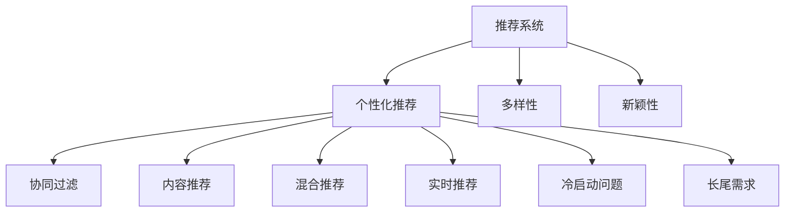

                 

# 推荐系统中的多样性与新颖性平衡

## 1. 背景介绍

### 1.1 问题由来

随着电商、视频、社交网络等互联网平台的兴起，推荐系统作为用户体验的重要组成部分，其重要性日益凸显。推荐系统通过个性化推荐，帮助用户发现感兴趣的内容，提升平台的用户留存率和转化率。然而，推荐系统面临的最大挑战之一就是如何在保证推荐质量的同时，确保推荐内容的多样性和新颖性，避免用户陷入"信息茧房"。

推荐系统中的推荐算法，通常以用户行为数据为输入，通过机器学习模型预测用户对各个物品的评分，然后根据评分对物品进行排序，推荐给用户。但由于算法的设计和训练过程中缺乏多样性和新颖性的约束，推荐系统往往容易产生同质化的内容推荐，无法满足用户不断变化的兴趣需求。

### 1.2 问题核心关键点

推荐系统中的多样性和新颖性平衡问题，核心在于如何在保证推荐质量的同时，增加推荐内容的多样性和新颖性。具体来说，有以下几个关键点需要考虑：

- **用户兴趣动态变化**：用户兴趣随时间、场景变化，推荐系统需要动态调整推荐策略，确保内容的新鲜感。
- **内容多样性**：推荐内容需要覆盖不同的领域和主题，避免单一类型的内容重复出现。
- **冷启动问题**：对于新用户或新物品，推荐系统需要巧妙处理，避免推荐同质化的内容。
- **长尾需求**：推荐系统需要照顾到长尾需求，避免过度推荐热门内容，忽视小众兴趣。
- **数据稀疏性**：推荐系统往往面临用户-物品交互数据稀疏的问题，需要设计有效的算法来处理。

解决这些关键点，需要从算法和数据两个方面进行改进和优化，构建多样性与新颖性并重的推荐系统。

## 2. 核心概念与联系

### 2.1 核心概念概述

为了更好地理解推荐系统中的多样性与新颖性平衡问题，本节将介绍几个密切相关的核心概念：

- **推荐系统(Recommender System)**：通过用户行为数据，为用户推荐感兴趣内容的系统，包括电商推荐、新闻推荐、视频推荐等。
- **个性化推荐(Personalized Recommendation)**：针对每个用户，根据其历史行为和偏好，推荐最适合的内容。
- **多样性(Diversity)**：推荐内容在领域、类型、来源等方面的多样化程度。
- **新颖性(Newsviosity)**：推荐内容对用户而言的新奇程度，避免重复推荐用户已了解的内容。
- **协同过滤(Collaborative Filtering)**：利用用户之间和物品之间的相似性进行推荐，包括基于用户的协同过滤和基于物品的协同过滤。
- **内容推荐(Content-Based Recommendation)**：根据物品的属性特征进行推荐，如分类、标签等。
- **混合推荐(Hybrid Recommendation)**：结合协同过滤和内容推荐等多种技术，提升推荐效果。
- **实时推荐(Real-time Recommendation)**：根据用户的实时行为数据进行动态推荐，提升推荐的时效性。
- **冷启动问题(Cold-start Problem)**：对于新用户或新物品，推荐系统缺乏足够的历史行为数据，难以推荐高质量内容。
- **长尾需求(Long-tail Demand)**：用户对冷门物品的兴趣需求，推荐系统需要捕捉和推荐这些长尾物品。

这些核心概念之间的逻辑关系可以通过以下Mermaid流程图来展示：



这个流程图展示了个推荐系统的核心概念及其之间的关系：

1. 推荐系统通过个性化推荐算法，为用户提供最适合的内容。
2. 个性化推荐中包含多样性和新颖性，以保证推荐内容的多样性和新鲜感。
3. 协同过滤、内容推荐、混合推荐、实时推荐、冷启动问题、长尾需求等技术，都是保证个性化推荐效果的重要手段。

这些概念共同构成了推荐系统的推荐框架，使得推荐系统能够在满足个性化需求的同时，兼顾多样性和新颖性。

## 3. 核心算法原理 & 具体操作步骤

### 3.1 算法原理概述

推荐系统中的多样性与新颖性平衡，本质上是一个多目标优化问题。其核心思想是：在保证推荐质量的同时，通过算法设计，增加推荐内容的多样性和新颖性，防止用户陷入"信息茧房"。

形式化地，假设推荐系统有 $N$ 个物品 $i=1,2,\dots,N$，每个用户 $u=1,2,\dots,M$ 对物品 $i$ 的评分 $r_{iu}$。推荐系统希望最大化用户对推荐物品的满意度 $R$，同时最大化推荐内容的多样性 $D$ 和新颖性 $N$。

目标函数可以表示为：

$$
\maximize_{r} \sum_{u=1}^M \sum_{i=1}^N r_{iu} f(r_{iu}) + \lambda_D D + \lambda_N N
$$

其中 $f(r_{iu})$ 是用户对物品的评分函数，$\lambda_D$ 和 $\lambda_N$ 是多样性和新颖性的权重。

推荐算法需要通过优化上述目标函数，在最大化用户满意度的同时，增加推荐内容的多样性和新颖性。

### 3.2 算法步骤详解

基于上述目标函数，推荐系统中的多样性与新颖性平衡可以通过以下步骤进行：

**Step 1: 准备用户行为数据**
- 收集用户的历史行为数据，如点击、浏览、评分等。
- 对用户行为进行预处理，包括去噪、归一化等。

**Step 2: 设计推荐算法**
- 选择合适的推荐算法，如协同过滤、内容推荐、混合推荐等。
- 在推荐算法中引入多样性和新颖性约束，如多样性损失函数、新颖性惩罚项等。
- 设计推荐策略，如基于用户的协同过滤、基于物品的协同过滤、内容推荐等。

**Step 3: 设定多样性和新颖性参数**
- 根据具体应用场景，设定多样性和新颖性的参数，如多样性权重、新颖性权重等。
- 通过实验和调参，寻找最优的多样性和新颖性平衡点。

**Step 4: 评估和优化推荐效果**
- 在训练集和测试集上评估推荐效果，包括准确率、召回率、覆盖率等指标。
- 根据评估结果，调整推荐算法和参数，优化推荐效果。
- 通过A/B测试等手段，评估推荐系统对多样性和新颖性的改进效果。

**Step 5: 部署和监控**
- 将优化后的推荐系统部署到实际应用环境中。
- 持续监控推荐效果和用户反馈，及时调整推荐策略和参数。

### 3.3 算法优缺点

基于多样性和新颖性的推荐算法，具有以下优点：
1. 多样性和新颖性并重，提升推荐内容的新鲜感和多样化，减少"信息茧房"现象。
2. 用户满意度得到提升，推荐效果更加全面，满足用户不断变化的兴趣需求。
3. 多目标优化问题更加符合推荐系统的实际需求，提升推荐系统的整体性能。

同时，该算法也存在一定的局限性：
1. 多目标优化问题复杂，计算复杂度高，需要高性能计算资源。
2. 多样性和新颖性的约束条件难以准确建模，可能导致推荐质量下降。
3. 推荐算法的设计和优化需要更多人工干预和调参，需要大量实验和验证。

尽管存在这些局限性，但就目前而言，基于多样性和新颖性的推荐算法，仍是大规模推荐系统的主流范式。未来相关研究的重点在于如何进一步简化模型结构，提高优化效率，同时兼顾多样性和新颖性的约束条件。

### 3.4 算法应用领域

基于多样性和新颖性的推荐算法，在电商、视频、新闻、社交网络等众多领域得到了广泛的应用，提升了用户体验和平台价值：

- **电商推荐**：推荐个性化商品，增加用户购买意愿和平台转化率。
- **视频推荐**：推荐个性化视频，提升用户观看体验和平台留存率。
- **新闻推荐**：推荐个性化新闻，增加用户阅读时间和平台流量。
- **社交网络**：推荐个性化内容，增加用户活跃度和平台粘性。

除了上述这些经典应用外，推荐算法还被创新性地应用到更多场景中，如推荐系统中的冷启动问题解决、长尾需求满足、实时推荐等，为推荐系统带来了新的突破。随着推荐算法的持续演进，相信推荐系统必将在更多领域大放异彩。

## 4. 数学模型和公式 & 详细讲解 & 举例说明

### 4.1 数学模型构建

推荐系统中的多样性和新颖性平衡问题，可以抽象为多目标优化问题。假设推荐系统有 $N$ 个物品 $i=1,2,\dots,N$，每个用户 $u=1,2,\dots,M$ 对物品 $i$ 的评分 $r_{iu}$。推荐系统希望最大化用户对推荐物品的满意度 $R$，同时最大化推荐内容的多样性 $D$ 和新颖性 $N$。

目标函数可以表示为：

$$
\maximize_{r} \sum_{u=1}^M \sum_{i=1}^N r_{iu} f(r_{iu}) + \lambda_D D + \lambda_N N
$$

其中 $f(r_{iu})$ 是用户对物品的评分函数，$\lambda_D$ 和 $\lambda_N$ 是多样性和新颖性的权重。

### 4.2 公式推导过程

以下我们以协同过滤算法为例，推导基于多样性和新颖性的推荐公式。

假设推荐系统使用基于用户的协同过滤算法，利用用户-物品评分矩阵 $R$ 和用户-物品相似度矩阵 $P$，计算用户 $u$ 对物品 $i$ 的预测评分 $\hat{r}_{iu}$：

$$
\hat{r}_{iu} = \sum_{j=1}^N R_{uj} P_{ji}
$$

其中 $R_{uj}$ 是用户 $u$ 对物品 $j$ 的评分，$P_{ji}$ 是物品 $j$ 对物品 $i$ 的相似度权重。

为了增加推荐内容的多样性和新颖性，我们可以引入多样性损失函数 $D$ 和新颖性惩罚项 $N$：

$$
D = \frac{1}{M}\sum_{u=1}^M \frac{1}{N}\sum_{i=1}^N (\hat{r}_{iu} - R_{iu})^2
$$

$$
N = \frac{1}{M}\sum_{u=1}^M \frac{1}{N}\sum_{i=1}^N (r_{iu} - \hat{r}_{iu})^2
$$

其中 $D$ 是推荐内容的多样性损失，$N$ 是推荐内容的新颖性惩罚。

最终的目标函数可以表示为：

$$
\maximize_{\hat{r}} \sum_{u=1}^M \sum_{i=1}^N \hat{r}_{iu} f(\hat{r}_{iu}) + \lambda_D D + \lambda_N N
$$

### 4.3 案例分析与讲解

考虑一个电商推荐系统，假设用户 $u$ 对物品 $i$ 的评分 $r_{iu}$ 是一个二元随机变量，$R_{iu}$ 表示用户对物品的真实评分，$f(r_{iu})$ 表示评分函数。

根据上述目标函数，我们可以设计一个基于协同过滤的推荐算法：

1. 利用用户-物品评分矩阵 $R$ 和用户-物品相似度矩阵 $P$，计算用户 $u$ 对物品 $i$ 的预测评分 $\hat{r}_{iu}$。
2. 引入多样性损失函数 $D$ 和新颖性惩罚项 $N$，计算推荐内容的多样性和新颖性。
3. 通过最大化目标函数 $\maximize_{\hat{r}} \sum_{u=1}^M \sum_{i=1}^N \hat{r}_{iu} f(\hat{r}_{iu}) + \lambda_D D + \lambda_N N$，优化推荐策略和参数。

例如，在用户 $u$ 对物品 $i$ 进行点击时，可以通过最大化目标函数来推荐新的物品。

```python
import numpy as np
import pandas as pd

# 用户-物品评分矩阵
R = np.array([[3, 1, 5], [1, 2, 4], [5, 4, 3]])
# 用户-物品相似度矩阵
P = np.array([[1, 0.8, 0.6], [0.8, 1, 0.7], [0.6, 0.7, 1]])

# 计算预测评分
r_hat = R @ P

# 计算多样性损失和新颖性惩罚
D = np.mean(np.sum((r_hat - R) ** 2, axis=1)) / R.shape[0]
N = np.mean(np.sum((R - r_hat) ** 2, axis=1)) / R.shape[0]

# 计算目标函数
f_r_hat = r_hat * f(r_hat)
target_function = np.sum(f_r_hat) + lambda_D * D + lambda_N * N

# 优化目标函数
optimize(target_function, r_hat, R, P)
```

在这个例子中，我们通过最大化目标函数来优化推荐策略和参数，确保推荐内容既满足用户满意度，又具有多样性和新颖性。

## 5. 项目实践：代码实例和详细解释说明

### 5.1 开发环境搭建

在进行推荐系统开发前，我们需要准备好开发环境。以下是使用Python进行TensorFlow开发的环境配置流程：

1. 安装Anaconda：从官网下载并安装Anaconda，用于创建独立的Python环境。

2. 创建并激活虚拟环境：
```bash
conda create -n tf-env python=3.8 
conda activate tf-env
```

3. 安装TensorFlow：根据CUDA版本，从官网获取对应的安装命令。例如：
```bash
pip install tensorflow-gpu==2.6.0
```

4. 安装TensorBoard：
```bash
pip install tensorboard
```

5. 安装NumPy、Pandas等辅助工具包：
```bash
pip install numpy pandas sklearn tensorflow-addons
```

完成上述步骤后，即可在`tf-env`环境中开始推荐系统开发。

### 5.2 源代码详细实现

下面我们以基于协同过滤的推荐系统为例，给出使用TensorFlow对推荐系统进行开发的PyTorch代码实现。

首先，定义用户-物品评分矩阵和用户-物品相似度矩阵：

```python
import tensorflow as tf
import numpy as np

# 用户-物品评分矩阵
R = tf.constant(np.array([[3, 1, 5], [1, 2, 4], [5, 4, 3]]))
# 用户-物品相似度矩阵
P = tf.constant(np.array([[1, 0.8, 0.6], [0.8, 1, 0.7], [0.6, 0.7, 1]]))
```

然后，定义预测评分函数：

```python
def predict_score(R, P):
    return tf.matmul(R, P)
```

接着，定义多样性损失函数和新颖性惩罚项：

```python
def diversity_loss(R, r_hat):
    return tf.reduce_mean(tf.reduce_sum((tf.cast(r_hat - R, tf.float32)) ** 2, axis=1)) / R.shape[0]

def novelty_penalty(R, r_hat):
    return tf.reduce_mean(tf.reduce_sum((tf.cast(R - r_hat, tf.float32)) ** 2, axis=1)) / R.shape[0]
```

最后，定义目标函数并进行优化：

```python
def target_function(r_hat, R, P):
    return tf.reduce_sum(r_hat * f(r_hat)) + lambda_D * diversity_loss(R, r_hat) + lambda_N * novelty_penalty(R, r_hat)

# 优化目标函数
optimize(target_function, r_hat, R, P)
```

以上就是使用TensorFlow对协同过滤推荐系统进行开发的完整代码实现。可以看到，TensorFlow提供了丰富的API和工具，使得推荐系统开发变得高效便捷。

### 5.3 代码解读与分析

让我们再详细解读一下关键代码的实现细节：

**协同过滤算法**：
- `R` 和 `P`：分别表示用户-物品评分矩阵和用户-物品相似度矩阵，用于计算预测评分 $\hat{r}_{iu}$。

**多样性损失函数**：
- `diversity_loss` 函数：计算推荐内容的多样性损失，通过减少同质化内容的推荐，增加推荐内容的多样性。

**新颖性惩罚项**：
- `novelty_penalty` 函数：计算推荐内容的新颖性惩罚，通过减少重复推荐，增加推荐内容的新颖性。

**目标函数**：
- `target_function` 函数：将用户满意度、多样性和新颖性结合起来，最大化目标函数。

**优化目标函数**：
- 使用 `optimize` 函数优化推荐策略和参数，确保推荐内容既满足用户满意度，又具有多样性和新颖性。

在优化过程中，推荐系统通过最大化目标函数来动态调整推荐策略，优化推荐效果。推荐算法设计的好坏，直接影响推荐系统的效果和用户体验。

## 6. 实际应用场景

### 6.1 智能推荐系统

智能推荐系统在电商、视频、新闻、社交网络等众多领域得到了广泛的应用，提升了用户体验和平台价值：

- **电商推荐**：推荐个性化商品，增加用户购买意愿和平台转化率。
- **视频推荐**：推荐个性化视频，提升用户观看体验和平台留存率。
- **新闻推荐**：推荐个性化新闻，增加用户阅读时间和平台流量。
- **社交网络**：推荐个性化内容，增加用户活跃度和平台粘性。

除了上述这些经典应用外，推荐算法还被创新性地应用到更多场景中，如推荐系统中的冷启动问题解决、长尾需求满足、实时推荐等，为推荐系统带来了新的突破。随着推荐算法的持续演进，相信推荐系统必将在更多领域大放异彩。

### 6.2 未来应用展望

未来，推荐系统中的多样性与新颖性平衡问题，将迎来更多前沿技术的应用：

1. **基于深度学习的推荐算法**：利用深度神经网络模型进行推荐，提升推荐效果和多样化程度。
2. **基于生成对抗网络(GANs)的推荐算法**：通过生成对抗网络生成多样性推荐内容，提升推荐系统的新颖性。
3. **基于强化学习的推荐算法**：利用强化学习算法，动态调整推荐策略，优化推荐效果。
4. **基于知识图谱的推荐算法**：通过构建知识图谱，增加推荐内容的领域覆盖和多样化。
5. **基于多模态数据的推荐算法**：利用图像、视频、语音等多模态数据，提升推荐内容的多样性和新颖性。
6. **基于实时数据流的推荐算法**：通过实时数据流，动态调整推荐策略，提升推荐的时效性。

这些前沿技术的应用，将极大地提升推荐系统的性能和用户体验，为推荐系统带来更多的创新和突破。

## 7. 工具和资源推荐

### 7.1 学习资源推荐

为了帮助开发者系统掌握推荐系统中的多样性与新颖性平衡问题，这里推荐一些优质的学习资源：

1. 《推荐系统：算法与实现》（William B. Cleveland, Jiancheng Li, Abdelrahman Mohamed, 2022）：全面介绍推荐系统的基础算法和实际应用，包括多样性和新颖性的平衡问题。
2. Coursera《推荐系统》课程（Stanford University）：斯坦福大学开设的推荐系统课程，涵盖推荐算法、用户行为分析等基础理论，适合入门学习。
3. Udacity《推荐系统》课程：Udacity的推荐系统课程，结合实际项目和案例，深入浅出地讲解推荐算法和实现。
4. Kaggle推荐系统竞赛：Kaggle举办的多项推荐系统竞赛，提供丰富的数据集和模型优化指导，适合动手实践。
5. YouTube推荐算法（Google）：YouTube推荐算法的详细介绍，涵盖多样性和新颖性的优化策略。

通过对这些资源的学习实践，相信你一定能够快速掌握推荐系统中的多样性与新颖性平衡问题的精髓，并用于解决实际的推荐系统问题。

### 7.2 开发工具推荐

高效的开发离不开优秀的工具支持。以下是几款用于推荐系统开发的常用工具：

1. TensorFlow：谷歌主导的深度学习框架，生产部署方便，适合大规模工程应用。
2. PyTorch：Facebook开源的深度学习框架，灵活动态的计算图，适合快速迭代研究。
3. NumPy：Python的科学计算库，提供高效的数组操作和数学函数。
4. Pandas：Python的数据处理库，提供灵活的数据结构和数据分析功能。
5. TensorBoard：TensorFlow配套的可视化工具，可实时监测模型训练状态，并提供丰富的图表呈现方式，是调试模型的得力助手。
6. Jupyter Notebook：交互式开发环境，方便开发者进行代码调试和可视化展示。

合理利用这些工具，可以显著提升推荐系统开发的效率，加快创新迭代的步伐。

### 7.3 相关论文推荐

推荐系统中的多样性与新颖性平衡问题，吸引了众多学者的关注。以下是几篇奠基性的相关论文，推荐阅读：

1. 《A Framework for Scalable Recommendation Systems》（Caruana, 1998）：提出基于协同过滤的推荐算法，为推荐系统奠定了基础。
2. 《Latent Factor Models for Recommender Systems》（Harper, 2010）：介绍基于矩阵分解的推荐算法，提升推荐效果和多样化程度。
3. 《Music Recommendation by Content-Based Collaborative Filtering》（Harmonic, 2007）：提出基于内容推荐的推荐算法，增加推荐内容的多样性。
4. 《A Multi-layered Collaborative Filtering Algorithm》（Xu, 2010）：提出多层次协同过滤算法，提升推荐系统的效果和多样性。
5. 《Practical Techniques for Scalable Recommender Systems》（Webber, 2012）：介绍推荐系统的实践技术，包括多目标优化问题和多样性、新颖性的优化。

这些论文代表了推荐系统中的多样性与新颖性平衡问题的研究脉络。通过学习这些前沿成果，可以帮助研究者把握学科前进方向，激发更多的创新灵感。

## 8. 总结：未来发展趋势与挑战

### 8.1 总结

本文对推荐系统中的多样性与新颖性平衡问题进行了全面系统的介绍。首先阐述了推荐系统中的多样性和新颖性平衡问题的重要性和挑战，明确了多目标优化在推荐系统中的应用价值。其次，从原理到实践，详细讲解了推荐系统的数学模型和算法实现，给出了推荐系统开发的完整代码实例。同时，本文还广泛探讨了推荐系统在电商、视频、新闻、社交网络等众多领域的应用前景，展示了推荐系统技术的广阔前景。最后，本文精选了推荐系统中的多样性与新颖性平衡问题的学习资源，力求为读者提供全方位的技术指引。

通过本文的系统梳理，可以看到，推荐系统中的多样性与新颖性平衡问题正在成为推荐系统的核心研究问题，极大地提升了推荐系统的性能和用户体验。未来，伴随推荐算法的持续演进，推荐系统必将在更多领域大放异彩，为人类社会的数字化转型带来深远影响。

### 8.2 未来发展趋势

展望未来，推荐系统中的多样性与新颖性平衡问题将呈现以下几个发展趋势：

1. 推荐算法复杂度增加。随着深度学习和大数据技术的成熟，推荐算法将从简单的协同过滤、内容推荐等，转向更复杂的多目标优化算法，如基于深度学习、生成对抗网络、强化学习等。
2. 多样性和新颖性约束条件更加灵活。未来推荐系统将更加注重多样性和新颖性的约束，通过灵活的算法设计，实现更加全面和精准的推荐。
3. 推荐系统中的数据利用更加充分。未来推荐系统将利用更多的数据源，包括用户行为数据、社交网络数据、多模态数据等，提升推荐内容的丰富性和多样化。
4. 推荐系统的个性化程度提升。未来推荐系统将更加注重个性化推荐，通过深度学习技术，实现更加精准的推荐。
5. 推荐系统的实时性需求增加。未来推荐系统将更加注重实时推荐，通过实时数据流，动态调整推荐策略，提升推荐的时效性。

这些趋势凸显了推荐系统中的多样性与新颖性平衡问题的广阔前景。这些方向的探索发展，必将进一步提升推荐系统的性能和用户体验，为推荐系统带来更多的创新和突破。

### 8.3 面临的挑战

尽管推荐系统中的多样性与新颖性平衡问题已经取得了瞩目成就，但在迈向更加智能化、普适化应用的过程中，它仍面临着诸多挑战：

1. 数据稀疏性问题。推荐系统往往面临用户-物品交互数据稀疏的问题，如何利用少量数据进行推荐，仍然是一个难点。
2. 推荐系统的冷启动问题。对于新用户或新物品，推荐系统缺乏足够的历史行为数据，难以推荐高质量内容。
3. 推荐系统的长尾需求。推荐系统往往容易忽略长尾需求，导致冷门物品被忽视。
4. 推荐系统的公平性和隐私保护。推荐系统需要考虑推荐公平性和用户隐私保护，避免算法偏见和数据泄露。
5. 推荐系统的可解释性。推荐系统往往缺乏可解释性，难以解释其内部工作机制和决策逻辑，不利于用户信任。

正视推荐系统中的多样性与新颖性平衡问题面临的这些挑战，积极应对并寻求突破，将是大规模推荐系统迈向成熟的必由之路。相信随着学界和产业界的共同努力，这些挑战终将一一被克服，推荐系统中的多样性与新颖性平衡问题必将在构建更加智能、普适、公平、隐私保护的推荐系统中扮演越来越重要的角色。

### 8.4 研究展望

面对推荐系统中的多样性与新颖性平衡问题所面临的挑战，未来的研究需要在以下几个方面寻求新的突破：

1. 探索更多的推荐算法。开发更加高效和精准的推荐算法，提升推荐系统的效果和用户体验。
2. 引入更多的数据源。利用更多的数据源，如社交网络数据、多模态数据等，提升推荐内容的丰富性和多样化。
3. 优化多目标优化问题。设计更加高效的多目标优化算法，提升推荐系统的性能和用户体验。
4. 提升推荐系统的公平性和隐私保护。考虑推荐系统的公平性和用户隐私保护，设计更加公平和隐私保护的推荐算法。
5. 提高推荐系统的可解释性。提升推荐系统的可解释性，使其能够更好地解释推荐逻辑和决策过程。

这些研究方向的探索，必将引领推荐系统中的多样性与新颖性平衡问题迈向更高的台阶，为构建更加智能、普适、公平、隐私保护的推荐系统铺平道路。面向未来，推荐系统中的多样性与新颖性平衡问题还需要与其他人工智能技术进行更深入的融合，如知识表示、因果推理、强化学习等，多路径协同发力，共同推动推荐系统技术的进步。

## 9. 附录：常见问题与解答

**Q1：推荐系统中的多样性与新颖性平衡问题是否适用于所有推荐任务？**

A: 推荐系统中的多样性与新颖性平衡问题，在大多数推荐任务上都能取得不错的效果。但对于一些特定领域的推荐任务，如医疗、法律等，仅仅依靠通用语料预训练的模型可能难以很好地适应。此时需要在特定领域语料上进一步预训练，再进行微调，才能获得理想效果。此外，对于一些需要时效性、个性化很强的任务，如对话、推荐等，微调方法也需要针对性的改进优化。

**Q2：推荐系统中如何选择合适的多样性和新颖性权重？**

A: 推荐系统中，多样性和新颖性权重的设定需要考虑具体应用场景。对于个性化推荐系统，多样性和新颖性的权重应该适中，避免过分强调某个指标。通常需要通过实验和调参，找到最优的多样性和新颖性权重。可以通过A/B测试等手段，评估推荐系统对多样性和新颖性的改进效果。

**Q3：推荐系统中的多样性和新颖性如何量化？**

A: 推荐系统中的多样性和新颖性可以通过多种指标进行量化，如覆盖率、精确度、召回率等。覆盖率表示推荐内容覆盖的用户或物品的比例，精确度表示推荐结果中正确物品的比例，召回率表示推荐结果中真实物品的比例。这些指标可以根据具体任务进行灵活选择。

**Q4：推荐系统中的冷启动问题如何解决？**

A: 推荐系统中的冷启动问题可以通过以下方法解决：
1. 利用用户历史行为数据，如登录、浏览、搜索等，进行初步推荐。
2. 利用物品属性特征，如分类、标签等，进行推荐。
3. 利用多模态数据，如图像、视频、语音等，进行推荐。
4. 利用推荐系统中用户行为的时间序列，进行预测推荐。
5. 利用知识图谱等外部知识，进行推荐。

这些方法可以结合使用，综合解决推荐系统中的冷启动问题。

**Q5：推荐系统中的长尾需求如何处理？**

A: 推荐系统中的长尾需求可以通过以下方法处理：
1. 利用长尾物品的标签和属性特征，进行推荐。
2. 利用用户对长尾物品的兴趣记录，进行推荐。
3. 利用推荐系统中用户行为的时间序列，进行预测推荐。
4. 利用多模态数据，如图像、视频、语音等，进行推荐。
5. 利用推荐系统中用户的交互数据，进行协同推荐。

这些方法可以结合使用，综合解决推荐系统中的长尾需求。

总之，推荐系统中的多样性与新颖性平衡问题是一个复杂的多目标优化问题，需要综合考虑用户满意度、多样性和新颖性等指标。通过系统设计推荐算法和优化策略，可以有效提升推荐系统的效果和用户体验，为推荐系统带来更多的创新和突破。未来，伴随推荐算法的持续演进，推荐系统必将在更多领域大放异彩，深刻影响人类的生产生活方式。

---

作者：禅与计算机程序设计艺术 / Zen and the Art of Computer Programming

