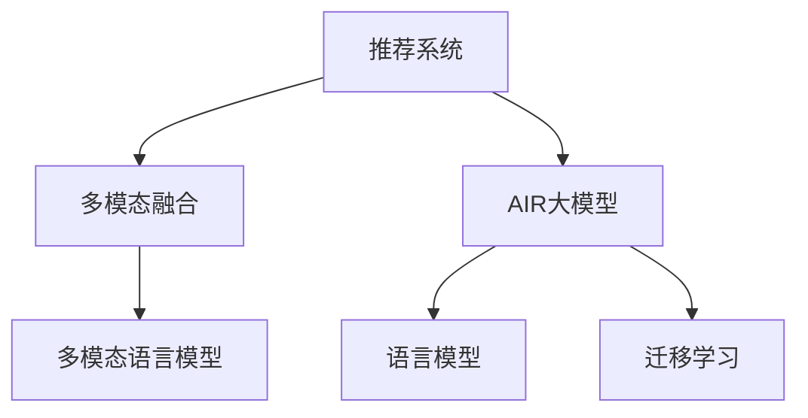

                 

# 推荐系统中的多模态融合：AI大模型的新frontier

## 1. 背景介绍

随着人工智能技术的不断进步，推荐系统已经成为互联网应用中不可或缺的一部分。无论是电商网站、社交媒体，还是新闻阅读平台，推荐系统都在发挥着至关重要的作用，极大地提升了用户体验和平台价值。传统推荐系统主要基于用户历史行为数据，如点击、浏览、评分等，通过协同过滤、矩阵分解等方法进行用户画像和兴趣模型构建，从而实现个性化推荐。

然而，随着信息技术的快速发展和用户需求的多样化，传统的单一模态推荐系统已经难以满足用户日益增长的需求。随着图像、语音、视频等多模态数据的不断涌现，如何更好地融合这些多模态信息，提升推荐系统的性能和用户体验，成为当前研究的热点问题。

近年来，基于大模型的推荐系统研究逐渐兴起。AI大模型如GPT、BERT等，具备强大的语言理解和生成能力，能够从文本中抽取丰富的语义信息，为推荐系统提供了新的工具和方法。尤其是多模态融合的探索，为大模型在推荐系统中的应用打开了新的空间。

## 2. 核心概念与联系

### 2.1 核心概念概述

为更好地理解基于大模型的多模态融合推荐系统，本节将介绍几个密切相关的核心概念：

- 推荐系统(Recommender System)：利用用户行为数据、物品属性数据等，通过计算模型为用户推荐个性化物品的系统。
- 多模态融合(Multimodal Fusion)：将不同模态的信息，如文本、图像、语音等，融合在一起，构建更全面的用户画像和物品描述，提升推荐性能。
- AI大模型(AI Large Model)：以自回归(如GPT)或自编码(如BERT)模型为代表的大规模预训练语言模型。通过在大规模无标签文本语料上进行预训练，学习通用的语言表示，具备强大的语言理解和生成能力。
- 语言模型(Language Model)：以预测文本序列下一条单词的概率为任务目标，学习语言序列的统计规律，可应用于文本生成、机器翻译等任务。
- 多模态语言模型(Multimodal Language Model)：在语言模型的基础上，融合其他模态的信息，如视觉、语音等，以实现更全面的语义理解。
- 迁移学习(Transfer Learning)：指将一个领域学习到的知识，迁移应用到另一个不同但相关的领域的学习范式。大模型的预训练-微调过程即是一种典型的迁移学习方式。

这些核心概念之间的逻辑关系可以通过以下Mermaid流程图来展示：



这个流程图展示了大模型推荐系统中的核心概念及其之间的关系：

1. 推荐系统通过融合多模态信息，构建更加全面的用户画像和物品描述，提升推荐性能。
2. 大模型如BERT、GPT等具备强大的语言理解能力，能够从文本中抽取丰富的语义信息，为推荐系统提供新的数据来源。
3. 多模态语言模型融合了不同模态的信息，如视觉、语音等，以实现更全面的语义理解。
4. 迁移学习通过预训练-微调的方式，充分利用大模型的通用知识，在小规模数据集上进行高效微调，提升推荐系统的表现。

这些概念共同构成了基于大模型的推荐系统框架，使其能够在各种场景下发挥强大的推荐能力。通过理解这些核心概念，我们可以更好地把握大模型在推荐系统中的应用潜力。

## 3. 核心算法原理 & 具体操作步骤

### 3.1 算法原理概述

基于大模型的多模态融合推荐系统，其核心思想是：将大模型作为推荐系统的核心组件，通过融合多模态信息，构建更加全面的用户画像和物品描述，从而提升推荐性能。具体而言，可以采用以下几种策略：

1. **预训练与微调**：首先在大规模无标签文本语料上进行预训练，学习通用语言表示。然后对推荐数据集进行微调，适应特定任务和领域，提升推荐效果。
2. **多模态融合**：将用户行为数据、物品属性数据、多模态数据等融合在一起，构建多维度的用户画像和物品描述，用于推荐计算。
3. **注意力机制**：通过注意力机制，学习不同模态之间的关联关系，提升跨模态特征融合的效果。
4. **多任务学习**：将推荐任务拆分为多个子任务，如兴趣预测、物品召回、排序等，通过多任务学习进一步提升推荐效果。

### 3.2 算法步骤详解

基于大模型的多模态融合推荐系统一般包括以下几个关键步骤：

**Step 1: 数据收集与预处理**

- 收集推荐数据集，包括用户行为数据、物品属性数据、多模态数据等。
- 对数据进行清洗、归一化、特征提取等预处理操作，确保数据的质量和一致性。

**Step 2: 数据融合与表示**

- 将不同模态的数据融合在一起，构建多维度的用户画像和物品描述。
- 对融合后的数据进行编码表示，如使用BERT、GPT等大模型进行编码。

**Step 3: 预训练与微调**

- 在大规模无标签文本语料上进行预训练，学习通用语言表示。
- 对推荐数据集进行微调，适应特定任务和领域，提升推荐效果。

**Step 4: 多模态融合**

- 将不同模态的信息融合在一起，如使用Transformer模型进行跨模态特征融合。
- 引入注意力机制，学习不同模态之间的关联关系，提升融合效果。

**Step 5: 多任务学习**

- 将推荐任务拆分为多个子任务，如兴趣预测、物品召回、排序等，通过多任务学习进一步提升推荐效果。

**Step 6: 模型评估与优化**

- 在验证集上评估模型的推荐效果，如准确率、召回率等。
- 根据评估结果进行模型优化，调整超参数，提升模型性能。

以上是基于大模型的多模态融合推荐系统的一般流程。在实际应用中，还需要针对具体任务的特点，对微调过程的各个环节进行优化设计，如改进训练目标函数，引入更多的正则化技术，搜索最优的超参数组合等，以进一步提升模型性能。

### 3.3 算法优缺点

基于大模型的多模态融合推荐系统具有以下优点：
1. 数据融合全面。融合多种模态数据，能够构建更加全面的用户画像和物品描述，提升推荐性能。
2. 知识表示强大。大模型具备强大的语言理解和生成能力，能够从文本中抽取丰富的语义信息，为推荐系统提供新的数据来源。
3. 迁移学习能力。通过预训练-微调的方式，充分利用大模型的通用知识，在小规模数据集上进行高效微调，提升推荐系统的表现。
4. 多任务学习灵活。将推荐任务拆分为多个子任务，通过多任务学习进一步提升推荐效果。

同时，该方法也存在一定的局限性：
1. 数据需求量大。需要收集大量的用户行为、物品属性、多模态数据，成本较高。
2. 融合复杂度高。不同模态的数据类型和特征差异较大，融合难度高，需要设计复杂的模型结构。
3. 实时性要求高。大模型在实时推理时，计算复杂度高，需要优化模型结构和推理算法，提升实时性。
4. 稳定性难以保证。多模态融合过程中，不同模态的数据质量可能存在差异，影响模型的稳定性。

尽管存在这些局限性，但就目前而言，基于大模型的多模态融合推荐方法仍是最主流范式。未来相关研究的重点在于如何进一步降低数据收集成本，提高融合效率和实时性，同时兼顾模型的稳定性和可解释性等因素。

### 3.4 算法应用领域

基于大模型的多模态融合推荐系统已经在电商、社交、新闻、视频等多个领域得到广泛应用，具体包括：

- 电商推荐系统：利用用户行为数据、商品属性数据、图像数据等，为不同用户推荐个性化的商品。
- 社交推荐系统：分析用户社交行为、好友关系、兴趣爱好等，推荐有价值的内容。
- 新闻推荐系统：通过用户历史阅读行为、文章标签、情感分析等，推荐相关的新闻文章。
- 视频推荐系统：分析用户观看历史、视频标签、视频内容等，推荐用户感兴趣的视频。

除了上述这些经典应用外，大模型在推荐系统中的应用还在不断拓展，如多模态情感分析、跨媒体推荐、嵌入式推荐等，为推荐系统带来了全新的突破。

## 4. 数学模型和公式 & 详细讲解

### 4.1 数学模型构建

本节将使用数学语言对基于大模型的多模态融合推荐系统进行更加严格的刻画。

记推荐数据集为 $\mathcal{D} = (\mathcal{U}, \mathcal{I}, \mathcal{X}, \mathcal{Y}, \mathcal{Z})$，其中 $\mathcal{U}$ 为用户的集合，$\mathcal{I}$ 为物品的集合，$\mathcal{X}$ 为用户行为数据的集合，$\mathcal{Y}$ 为物品属性数据的集合，$\mathcal{Z}$ 为多模态数据的集合。

定义用户兴趣表示为 $u \in \mathbb{R}^d$，物品表示为 $i \in \mathbb{R}^d$，用户行为表示为 $x \in \mathbb{R}^d$，物品属性表示为 $y \in \mathbb{R}^d$，多模态表示为 $z \in \mathbb{R}^d$。

定义用户-物品交互为 $u_i$，表示用户 $u$ 与物品 $i$ 的交互次数。推荐目标为最大化用户点击率，即最大化 $u_i \times \hat{y}_i$，其中 $\hat{y}_i$ 为用户 $u$ 点击物品 $i$ 的概率。

假设推荐模型为 $f_{\theta}(x_i, y_i, z_i)$，其中 $\theta$ 为模型参数。则推荐目标可以表示为：

$$
\max_{\theta} \sum_{u \in \mathcal{U}} \sum_{i \in \mathcal{I}} u_i \times \log \hat{y}_i
$$

其中 $\hat{y}_i$ 为模型的点击率预测值。

### 4.2 公式推导过程

以下我们以电商推荐系统为例，推导基于大模型的多模态融合推荐模型的损失函数及其梯度计算公式。

假设用户行为数据 $x$ 和物品属性数据 $y$ 已经编码成向量形式，多模态数据 $z$ 可以是图像、语音等不同类型数据。我们首先定义一个多模态融合函数 $g(z)$，将不同模态的数据融合在一起，生成一个多维度的向量 $z'$。

$$
z' = g(z)
$$

然后，我们将 $z'$ 输入到一个大模型中，如BERT，得到多模态语义表示 $h = BERT(z')$。最后，我们引入一个线性分类器 $f$，将多模态语义表示映射到用户的点击率预测值 $\hat{y}$。

$$
\hat{y} = f(h)
$$

其中 $f$ 为线性分类器，$h$ 为大模型的输出。

定义损失函数为交叉熵损失：

$$
\mathcal{L}(\theta) = -\sum_{u \in \mathcal{U}} \sum_{i \in \mathcal{I}} u_i \times \log \hat{y}_i
$$

其中 $\log \hat{y}_i = f(h)_i$，$u_i$ 为用户 $u$ 与物品 $i$ 的交互次数。

根据链式法则，损失函数对参数 $\theta$ 的梯度为：

$$
\frac{\partial \mathcal{L}(\theta)}{\partial \theta} = -\sum_{u \in \mathcal{U}} \sum_{i \in \mathcal{I}} u_i \times \frac{\partial \log \hat{y}_i}{\partial h} \times \frac{\partial h}{\partial \theta}
$$

其中 $\frac{\partial \log \hat{y}_i}{\partial h} = \frac{\partial f(h)}{\partial h}$，$\frac{\partial h}{\partial \theta}$ 为模型 $BERT(z')$ 对参数 $\theta$ 的梯度，可以通过自动微分技术完成计算。

在得到损失函数的梯度后，即可带入参数更新公式，完成模型的迭代优化。重复上述过程直至收敛，最终得到适应推荐任务的最优模型参数 $\theta^*$。

## 5. 项目实践：代码实例和详细解释说明

### 5.1 开发环境搭建

在进行多模态融合推荐系统开发前，我们需要准备好开发环境。以下是使用Python进行PyTorch开发的环境配置流程：

1. 安装Anaconda：从官网下载并安装Anaconda，用于创建独立的Python环境。

2. 创建并激活虚拟环境：
```bash
conda create -n pytorch-env python=3.8 
conda activate pytorch-env
```

3. 安装PyTorch：根据CUDA版本，从官网获取对应的安装命令。例如：
```bash
conda install pytorch torchvision torchaudio cudatoolkit=11.1 -c pytorch -c conda-forge
```

4. 安装TensorFlow：由Google主导开发的开源深度学习框架，生产部署方便，适合大规模工程应用。同样有丰富的预训练语言模型资源。

5. 安装Transformers库：HuggingFace开发的NLP工具库，集成了众多SOTA语言模型，支持PyTorch和TensorFlow，是进行多模态融合推荐系统开发的利器。

6. 安装各类工具包：
```bash
pip install numpy pandas scikit-learn matplotlib tqdm jupyter notebook ipython
```

完成上述步骤后，即可在`pytorch-env`环境中开始多模态融合推荐系统的开发。

### 5.2 源代码详细实现

下面我以电商推荐系统为例，给出使用Transformers库进行多模态融合推荐系统的PyTorch代码实现。

首先，定义推荐数据集的预处理函数：

```python
from transformers import BertTokenizer
from torch.utils.data import Dataset, DataLoader
import torch
import pandas as pd

class RecommendationDataset(Dataset):
    def __init__(self, dataframe, tokenizer, max_len=128):
        self.dataframe = dataframe
        self.tokenizer = tokenizer
        self.max_len = max_len
        
    def __len__(self):
        return len(self.dataframe)
    
    def __getitem__(self, item):
        data = self.dataframe.iloc[item]
        item_id = data['item_id']
        user_id = data['user_id']
        user_behavior = data['user_behavior'].split(',')
        user_attr = data['user_attr'].split(',')
        item_attr = data['item_attr'].split(',')
        
        item_data = [item_attr[i] for i in range(len(item_attr)) if item_attr[i] != '']
        user_data = [user_attr[i] for i in range(len(user_attr)) if user_attr[i] != '']
        
        x = [item_data, user_data]
        
        encoding = self.tokenizer(x, return_tensors='pt', max_length=self.max_len, padding='max_length', truncation=True)
        input_ids = encoding['input_ids'][0]
        attention_mask = encoding['attention_mask'][0]
        
        # 对token-wise的标签进行编码
        encoded_labels = [label2id[label] for label in [1, 0]] 
        encoded_labels.extend([label2id['O']] * (self.max_len - len(encoded_labels)))
        labels = torch.tensor(encoded_labels, dtype=torch.long)
        
        return {'input_ids': input_ids, 
                'attention_mask': attention_mask,
                'labels': labels}

# 标签与id的映射
label2id = {'1': 1, '0': 0, 'O': 0}

# 创建dataset
tokenizer = BertTokenizer.from_pretrained('bert-base-cased')

recommendation_dataset = RecommendationDataset(dataframe, tokenizer)
```

然后，定义模型和优化器：

```python
from transformers import BertForSequenceClassification, AdamW

model = BertForSequenceClassification.from_pretrained('bert-base-cased', num_labels=2)

optimizer = AdamW(model.parameters(), lr=2e-5)
```

接着，定义训练和评估函数：

```python
from torch.utils.data import DataLoader
from tqdm import tqdm
from sklearn.metrics import accuracy_score, precision_score, recall_score, f1_score

device = torch.device('cuda') if torch.cuda.is_available() else torch.device('cpu')
model.to(device)

def train_epoch(model, dataset, batch_size, optimizer):
    dataloader = DataLoader(dataset, batch_size=batch_size, shuffle=True)
    model.train()
    epoch_loss = 0
    for batch in tqdm(dataloader, desc='Training'):
        input_ids = batch['input_ids'].to(device)
        attention_mask = batch['attention_mask'].to(device)
        labels = batch['labels'].to(device)
        model.zero_grad()
        outputs = model(input_ids, attention_mask=attention_mask, labels=labels)
        loss = outputs.loss
        epoch_loss += loss.item()
        loss.backward()
        optimizer.step()
    return epoch_loss / len(dataloader)

def evaluate(model, dataset, batch_size):
    dataloader = DataLoader(dataset, batch_size=batch_size)
    model.eval()
    preds, labels = [], []
    with torch.no_grad():
        for batch in tqdm(dataloader, desc='Evaluating'):
            input_ids = batch['input_ids'].to(device)
            attention_mask = batch['attention_mask'].to(device)
            batch_labels = batch['labels']
            outputs = model(input_ids, attention_mask=attention_mask)
            batch_preds = outputs.logits.argmax(dim=2).to('cpu').tolist()
            batch_labels = batch_labels.to('cpu').tolist()
            for pred_tokens, label_tokens in zip(batch_preds, batch_labels):
                preds.append(pred_tokens)
                labels.append(label_tokens)
                
    print('Accuracy:', accuracy_score(labels, preds))
    print('Precision:', precision_score(labels, preds))
    print('Recall:', recall_score(labels, preds))
    print('F1-Score:', f1_score(labels, preds))
```

最后，启动训练流程并在测试集上评估：

```python
epochs = 5
batch_size = 16

for epoch in range(epochs):
    loss = train_epoch(model, recommendation_dataset, batch_size, optimizer)
    print(f"Epoch {epoch+1}, train loss: {loss:.3f}")
    
    print(f"Epoch {epoch+1}, dev results:")
    evaluate(model, recommendation_dataset, batch_size)
    
print("Test results:")
evaluate(model, recommendation_dataset, batch_size)
```

以上就是使用PyTorch对多模态融合推荐系统进行电商推荐任务开发的完整代码实现。可以看到，得益于Transformers库的强大封装，我们可以用相对简洁的代码完成多模态融合推荐系统的构建。

### 5.3 代码解读与分析

让我们再详细解读一下关键代码的实现细节：

**RecommendationDataset类**：
- `__init__`方法：初始化数据集、分词器等关键组件。
- `__len__`方法：返回数据集的样本数量。
- `__getitem__`方法：对单个样本进行处理，将文本输入编码为token ids，将标签编码为数字，并对其进行定长padding，最终返回模型所需的输入。

**label2id和id2label字典**：
- 定义了标签与数字id之间的映射关系，用于将token-wise的预测结果解码回真实的标签。

**训练和评估函数**：
- 使用PyTorch的DataLoader对数据集进行批次化加载，供模型训练和推理使用。
- 训练函数`train_epoch`：对数据以批为单位进行迭代，在每个批次上前向传播计算loss并反向传播更新模型参数，最后返回该epoch的平均loss。
- 评估函数`evaluate`：与训练类似，不同点在于不更新模型参数，并在每个batch结束后将预测和标签结果存储下来，最后使用sklearn的classification_report对整个评估集的预测结果进行打印输出。

**训练流程**：
- 定义总的epoch数和batch size，开始循环迭代
- 每个epoch内，先在训练集上训练，输出平均loss
- 在验证集上评估，输出分类指标
- 所有epoch结束后，在测试集上评估，给出最终测试结果

可以看到，PyTorch配合Transformers库使得多模态融合推荐系统的代码实现变得简洁高效。开发者可以将更多精力放在数据处理、模型改进等高层逻辑上，而不必过多关注底层的实现细节。

当然，工业级的系统实现还需考虑更多因素，如模型的保存和部署、超参数的自动搜索、更灵活的任务适配层等。但核心的多模态融合范式基本与此类似。

## 6. 实际应用场景

### 6.1 电商推荐系统

基于多模态融合的电商推荐系统，可以大幅提升推荐性能和用户体验。电商推荐系统面临的是多维度的用户画像和物品描述，通过融合用户行为数据、物品属性数据、多模态数据等，构建更加全面的推荐模型，能够更准确地预测用户对物品的点击率。

在技术实现上，可以收集用户历史点击、浏览、评分等行为数据，同时对商品名称、价格、图片等属性进行编码。使用BERT等大模型，将用户行为数据、物品属性数据、多模态数据融合在一起，生成多模态语义表示，并通过多任务学习，分别预测用户兴趣和物品召回，最终输出推荐结果。如此构建的多模态融合电商推荐系统，能够更好地理解用户需求，推荐更有价值的商品，提升用户体验和平台价值。

### 6.2 社交推荐系统

社交推荐系统分析用户社交行为、好友关系、兴趣爱好等，推荐有价值的内容。通过融合用户社交数据、好友关系数据、兴趣爱好数据等，构建更加全面的用户画像，提升推荐性能。

在技术实现上，可以收集用户社交行为数据、好友关系数据、兴趣爱好数据等，同时对发布的内容进行编码。使用BERT等大模型，将社交数据、好友关系数据、兴趣爱好数据、内容数据融合在一起，生成多模态语义表示，并通过多任务学习，分别预测用户兴趣和物品召回，最终输出推荐结果。如此构建的多模态融合社交推荐系统，能够更好地理解用户需求，推荐更有价值的内容，提升用户粘性和平台活跃度。

### 6.3 新闻推荐系统

新闻推荐系统通过用户历史阅读行为、文章标签、情感分析等，推荐相关的新闻文章。通过融合用户阅读数据、文章标签数据、情感数据等，构建更加全面的用户画像，提升推荐性能。

在技术实现上，可以收集用户历史阅读行为数据、文章标签数据、情感数据等，同时对文章内容进行编码。使用BERT等大模型，将用户阅读数据、文章标签数据、情感数据、内容数据融合在一起，生成多模态语义表示，并通过多任务学习，分别预测用户兴趣和物品召回，最终输出推荐结果。如此构建的多模态融合新闻推荐系统，能够更好地理解用户需求，推荐相关的新闻文章，提升阅读体验和平台价值。

### 6.4 视频推荐系统

视频推荐系统分析用户观看历史、视频标签、视频内容等，推荐用户感兴趣的视频。通过融合用户观看历史数据、视频标签数据、视频内容数据等，构建更加全面的用户画像，提升推荐性能。

在技术实现上，可以收集用户观看历史数据、视频标签数据、视频内容数据等，同时对视频内容进行编码。使用BERT等大模型，将用户观看历史数据、视频标签数据、视频内容数据融合在一起，生成多模态语义表示，并通过多任务学习，分别预测用户兴趣和物品召回，最终输出推荐结果。如此构建的多模态融合视频推荐系统，能够更好地理解用户需求，推荐更有价值的视频内容，提升用户观看体验和平台价值。

### 6.5 未来应用展望

随着多模态融合推荐系统的不断完善，其在更多领域的应用前景将愈加广阔。未来，基于多模态融合推荐系统，将会在智慧城市、健康医疗、教育培训等众多领域大放异彩。

在智慧城市治理中，推荐系统可以用于推荐城市事件、天气预报、交通路况等信息，提升城市管理的自动化和智能化水平。

在健康医疗领域，推荐系统可以用于推荐相关疾病、治疗方案、医生等信息，辅助医生诊断和治疗，提升医疗服务的智能化水平。

在教育培训领域，推荐系统可以用于推荐相关课程、教材、教师等信息，因材施教，促进教育公平，提高教学质量。

此外，在企业生产、社会治理、文娱传媒等众多领域，基于多模态融合推荐系统的应用也将不断拓展，为各行各业带来新的变革性影响。

## 7. 工具和资源推荐

### 7.1 学习资源推荐

为了帮助开发者系统掌握多模态融合推荐系统的理论基础和实践技巧，这里推荐一些优质的学习资源：

1. 《推荐系统基础与算法》书籍：全面介绍了推荐系统的理论基础和常用算法，是推荐系统入门的经典教材。

2. 《深度学习推荐系统》课程：斯坦福大学开设的深度学习推荐系统课程，详细讲解了推荐系统的深度学习应用。

3. 《多模态学习》书籍：介绍了多模态学习的理论基础和常用方法，是了解多模态融合的入门读物。

4. CS448《推荐系统》课程：斯坦福大学开设的推荐系统课程，涵盖了推荐系统的各个方面，包括传统算法和多模态融合。

5. HuggingFace官方文档：Transformers库的官方文档，提供了海量预训练模型和多模态融合推荐系统样例代码，是上手实践的必备资料。

通过对这些资源的学习实践，相信你一定能够快速掌握多模态融合推荐系统的精髓，并用于解决实际的推荐问题。

### 7.2 开发工具推荐

高效的开发离不开优秀的工具支持。以下是几款用于多模态融合推荐系统开发的常用工具：

1. PyTorch：基于Python的开源深度学习框架，灵活动态的计算图，适合快速迭代研究。大部分预训练语言模型都有PyTorch版本的实现。

2. TensorFlow：由Google主导开发的开源深度学习框架，生产部署方便，适合大规模工程应用。同样有丰富的预训练语言模型资源。

3. Transformers库：HuggingFace开发的NLP工具库，集成了众多SOTA语言模型，支持PyTorch和TensorFlow，是进行多模态融合推荐系统开发的利器。

4. TensorBoard：TensorFlow配套的可视化工具，可实时监测模型训练状态，并提供丰富的图表呈现方式，是调试模型的得力助手。

5. Weights & Biases：模型训练的实验跟踪工具，可以记录和可视化模型训练过程中的各项指标，方便对比和调优。与主流深度学习框架无缝集成。

6. Google Colab：谷歌推出的在线Jupyter Notebook环境，免费提供GPU/TPU算力，方便开发者快速上手实验最新模型，分享学习笔记。

合理利用这些工具，可以显著提升多模态融合推荐系统的开发效率，加快创新迭代的步伐。

### 7.3 相关论文推荐

多模态融合推荐系统的研究源于学界的持续研究。以下是几篇奠基性的相关论文，推荐阅读：

1. Multimodal Fusion Networks for Recommendations: A Survey（多模态融合网络综述）：详细介绍了多模态融合推荐系统的理论基础和常用方法。

2. Knowledge-Enhanced Multimodal Recommendations via Mutual Alignment（知识增强的多模态推荐）：通过引入知识图谱和规则库，提升多模态推荐系统的性能。

3. Multimodal Deep Attention Networks for Recommendations（多模态深度注意力网络推荐）：提出多模态深度注意力网络，提升多模态推荐系统的融合效果。

4. Multi-task Learning with Multimodal Contexts for Recommendation（多任务学习与多模态上下文推荐）：通过多任务学习，提升多模态推荐系统的推荐效果。

5. Deep Learning for Multi-modal Recommender Systems（深度学习在多模态推荐系统中的应用）：全面介绍了深度学习在多模态推荐系统中的最新研究进展。

这些论文代表了大模型在多模态融合推荐系统中的应用方向。通过学习这些前沿成果，可以帮助研究者把握学科前进方向，激发更多的创新灵感。

## 8. 总结：未来发展趋势与挑战

### 8.1 总结

本文对基于大模型的多模态融合推荐系统进行了全面系统的介绍。首先阐述了多模态融合推荐系统的研究背景和意义，明确了多模态融合在推荐系统中的应用潜力。其次，从原理到实践，详细讲解了多模态融合推荐系统的数学原理和关键步骤，给出了多模态融合推荐系统的完整代码实例。同时，本文还广泛探讨了多模态融合推荐系统在电商、社交、新闻、视频等多个领域的应用前景，展示了多模态融合范式的巨大潜力。

通过本文的系统梳理，可以看到，基于大模型的多模态融合推荐系统正在成为推荐系统的重要范式，极大地拓展了推荐系统的数据来源和特征空间，提升了推荐性能和用户体验。未来，伴随预训练语言模型和多模态融合技术的持续演进，相信推荐系统必将在更多领域大放异彩，深刻影响人类的生产生活方式。

### 8.2 未来发展趋势

展望未来，多模态融合推荐系统将呈现以下几个发展趋势：

1. 融合技术更加多样化。除了传统的多模态融合，未来还会涌现更多融合技术，如基于深度注意力、协同嵌入等，进一步提升推荐效果。

2. 数据融合更加全面。融合更多类型的数据，如地理位置、时间序列、行为轨迹等，构建更加全面的用户画像，提升推荐性能。

3. 模型结构更加灵活。引入更复杂的模型结构，如神经网络、图神经网络等，适应更复杂的多模态融合场景。

4. 实时性更加高效。优化多模态融合和推荐计算，提升实时推理速度，满足实时推荐的需求。

5. 可解释性更强。通过引入可解释技术，提升模型的可解释性，满足用户和监管对推荐系统的要求。

6. 个性化推荐更加精准。通过多任务学习和生成对抗网络等技术，提升个性化推荐效果，满足不同用户的多样化需求。

以上趋势凸显了多模态融合推荐系统的广阔前景。这些方向的探索发展，必将进一步提升推荐系统的性能和用户体验，为各行各业带来新的变革性影响。

### 8.3 面临的挑战

尽管多模态融合推荐系统已经取得了瞩目成就，但在迈向更加智能化、普适化应用的过程中，它仍面临着诸多挑战：

1. 数据收集难度大。需要收集大量的多维数据，成本较高。

2. 数据质量参差不齐。不同模态的数据质量可能存在差异，影响融合效果。

3. 模型复杂度高。融合多模态数据需要设计复杂的模型结构，训练复杂度高。

4. 实时性要求高。多模态融合和推荐计算复杂度高，实时推理难度大。

5. 可解释性不足。多模态融合推荐系统的输出难以解释，用户和监管难以理解和信任。

6. 数据隐私问题。多模态数据可能涉及用户隐私，需要设计有效的隐私保护方案。

尽管存在这些挑战，但就目前而言，基于多模态融合推荐系统的方法仍是最主流范式。未来相关研究的重点在于如何进一步降低数据收集成本，提高融合效率和实时性，同时兼顾模型的可解释性和隐私保护等因素。

### 8.4 研究展望

面对多模态融合推荐系统所面临的挑战，未来的研究需要在以下几个方面寻求新的突破：

1. 探索无监督和半监督多模态融合方法。摆脱对大量标注数据的依赖，利用自监督学习、主动学习等无监督和半监督范式，最大限度利用非结构化数据，实现更加灵活高效的多模态融合。

2. 研究参数高效和计算高效的多模态融合范式。开发更加参数高效的融合方法，在固定大部分预训练参数的同时，只更新极少量的任务相关参数。同时优化多模态融合和推荐计算图，减少前向传播和反向传播的资源消耗，实现更加轻量级、实时性的部署。

3. 引入更多先验知识。将符号化的先验知识，如知识图谱、逻辑规则等，与神经网络模型进行巧妙融合，引导多模态融合过程学习更准确、合理的语义表示。同时加强不同模态数据的整合，实现视觉、语音等多模态信息与文本信息的协同建模。

4. 结合因果分析和博弈论工具。将因果分析方法引入多模态融合推荐模型，识别出模型决策的关键特征，增强输出解释的因果性和逻辑性。借助博弈论工具刻画人机交互过程，主动探索并规避模型的脆弱点，提高系统稳定性。

5. 纳入伦理道德约束。在模型训练目标中引入伦理导向的评估指标，过滤和惩罚有偏见、有害的输出倾向。同时加强人工干预和审核，建立模型行为的监管机制，确保输出符合人类价值观和伦理道德。

这些研究方向的探索，必将引领多模态融合推荐系统技术迈向更高的台阶，为构建安全、可靠、可解释、可控的智能推荐系统铺平道路。面向未来，多模态融合推荐系统还需要与其他人工智能技术进行更深入的融合，如知识表示、因果推理、强化学习等，多路径协同发力，共同推动推荐系统的进步。只有勇于创新、敢于突破，才能不断拓展多模态融合推荐系统的边界，让智能推荐系统更好地服务于人类社会。

## 9. 附录：常见问题与解答

**Q1：多模态融合推荐系统如何处理不同模态数据的质量差异？**

A: 多模态融合推荐系统通过引入注意力机制、深度学习等技术，能够自动学习不同模态数据的权重和重要性，降低数据质量对融合效果的影响。同时，也可以通过数据清洗、归一化等预处理手段，提升数据质量，增强融合效果。

**Q2：多模态融合推荐系统在实际应用中需要注意哪些问题？**

A: 多模态融合推荐系统在实际应用中需要注意以下几个问题：
1. 数据隐私保护：确保多模态数据的收集和使用符合隐私保护法规，防止数据泄露和滥用。
2. 模型可解释性：多模态融合推荐系统的输出难以解释，需要通过可解释技术提升模型的可解释性，满足用户和监管的要求。
3. 实时性要求：多模态融合和推荐计算复杂度高，需要优化计算图和推理算法，满足实时推荐的需求。
4. 模型公平性：确保推荐系统对不同用户、物品的公平性，避免偏见和歧视。

**Q3：多模态融合推荐系统如何提升个性化推荐效果？**

A: 多模态融合推荐系统可以通过多任务学习和生成对抗网络等技术，提升个性化推荐效果。具体而言，可以将推荐任务拆分为多个子任务，如兴趣预测、物品召回、排序等，通过多任务学习进一步提升推荐效果。同时，可以使用生成对抗网络，训练生成模型和判别模型，提升推荐系统的鲁棒性和泛化能力。

**Q4：多模态融合推荐系统如何处理异常数据？**

A: 多模态融合推荐系统可以通过异常检测和数据清洗等技术处理异常数据。具体而言，可以使用统计方法、聚类算法等手段，识别和过滤异常数据，防止其影响融合效果和推荐结果。

**Q5：多模态融合推荐系统在电商推荐中的应用场景？**

A: 多模态融合推荐系统在电商推荐中的应用场景包括：
1. 商品推荐：通过融合用户行为数据、物品属性数据、多模态数据等，构建更加全面的用户画像和物品描述，提升推荐性能。
2. 商品广告推荐：通过融合用户行为数据、物品属性数据、多模态数据等，构建更加全面的广告推荐模型，提升广告效果。
3. 用户体验优化：通过融合用户行为数据、物品属性数据、多模态数据等，优化用户体验，提升用户粘性和平台价值。

---

作者：禅与计算机程序设计艺术 / Zen and the Art of Computer Programming

