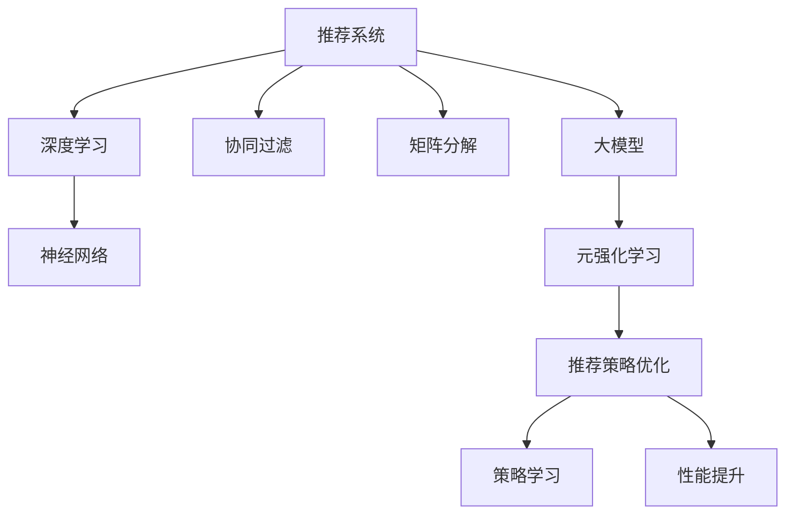

                 

# 推荐系统中的大模型元强化学习与策略优化

> 关键词：推荐系统, 大模型, 元强化学习, 策略优化, 协同过滤, 矩阵分解, 深度学习, 神经网络

## 1. 背景介绍

### 1.1 问题由来
推荐系统是现代互联网应用中不可或缺的一部分，广泛应用于电商、社交、视频等领域，极大地提升了用户体验。推荐算法的核心思想是通过用户行为数据，预测用户偏好，并推荐用户可能感兴趣的商品或内容。传统的推荐算法包括协同过滤、矩阵分解、基于内容的推荐等，大多依赖于显式的用户行为数据和物品属性信息。然而，随着数据量的增长和用户行为的多样化，这些传统算法面临诸多挑战。

- 数据稀疏性：用户与物品之间的交互数据往往十分稀疏，难以建立有效的用户-物品关联关系。
- 多模态性：用户行为和物品属性常常是多种模态的数据，无法统一表示。
- 个性化要求高：推荐系统需要高度个性化，能够适应用户的实时兴趣变化。
- 数据隐私问题：用户行为数据敏感，保护隐私和数据安全成为重要问题。

针对这些问题，学者们提出了多种改进算法，但效果仍不尽如人意。近年来，大模型在NLP领域取得了巨大突破，其在推荐系统的应用逐渐受到关注。利用大规模预训练语言模型，可以学习到丰富的用户行为和物品属性知识，进而提升推荐系统的性能。但是，将大模型应用到推荐系统中也面临着诸多挑战。如何高效地在大模型中进行推荐策略优化，最大化模型性能，是一个重要研究方向。

### 1.2 问题核心关键点
元强化学习是近年来兴起的一种研究范式，通过学习推荐策略的优化方法，提升模型的推荐效果。其核心思想是：利用推荐系统的交互数据，构建一个"元"模型，该模型可以动态学习推荐策略，提升推荐效果。本文聚焦于将大模型应用于推荐系统的元强化学习，提出基于大模型的推荐策略优化方法，并分析其优缺点及应用前景。

## 2. 核心概念与联系

### 2.1 核心概念概述

为了更好地理解基于大模型的元强化学习与策略优化，本节将介绍几个密切相关的核心概念：

- 推荐系统：通过用户行为数据，预测用户可能感兴趣的商品或内容，并提供推荐的服务系统。

- 大模型：以自回归(如GPT)或自编码(如BERT)模型为代表的大规模预训练语言模型。通过在大规模无标签文本语料上进行预训练，学习通用的语言表示，具备强大的语言理解和生成能力。

- 元强化学习：利用推荐系统的交互数据，构建一个"元"模型，该模型可以动态学习推荐策略，提升推荐效果。通过学习推荐策略，元模型可以在推荐任务上获得更优的性能。

- 协同过滤：推荐系统中一种经典算法，通过用户与物品之间的共现关系，预测用户可能感兴趣的物品。协同过滤分为基于用户的协同过滤和基于物品的协同过滤。

- 矩阵分解：将用户-物品评分矩阵分解为低秩矩阵，得到用户和物品的潜在特征，进而进行推荐。

- 深度学习：一种基于多层神经网络的机器学习技术，能够从复杂数据中提取高效特征，实现高精度的推荐。

- 神经网络：深度学习中的核心组件，通过多层非线性变换，提取数据的高层次表示。

这些核心概念之间的逻辑关系可以通过以下Mermaid流程图来展示：



这个流程图展示了大模型在推荐系统中的核心概念及其之间的关系：

1. 推荐系统通过多种算法进行推荐。
2. 大模型学习通用的语言表示，用于提升推荐系统的性能。
3. 元强化学习通过动态学习推荐策略，提升推荐效果。
4. 推荐策略优化通过对策略进行学习，进一步提升推荐系统性能。

这些概念共同构成了大模型在推荐系统中的应用框架，使其能够在各种场景下发挥强大的推荐能力。通过理解这些核心概念，我们可以更好地把握大模型在推荐系统中的工作原理和优化方向。

## 3. 核心算法原理 & 具体操作步骤
### 3.1 算法原理概述

基于大模型的推荐策略优化，本质上是一个元强化学习过程。其核心思想是：利用推荐系统的交互数据，构建一个"元"模型，该模型可以动态学习推荐策略，提升推荐效果。

形式化地，假设推荐系统中的用户与物品之间存在一个评分矩阵 $M \in \mathbb{R}^{N \times M}$，其中 $N$ 为物品数量，$M$ 为用户数量。用户 $u$ 对物品 $i$ 的评分记为 $r_{ui}$，目标是最大化推荐系统整体的用户满意度 $S$，即：

$$
S = \sum_{i=1}^{M} \sum_{j=1}^{N} \pi_{ij} r_{ij}
$$

其中 $\pi_{ij}$ 为物品 $i$ 推荐给用户 $j$ 的概率。

元强化学习的目标是在不直接观察用户行为的情况下，通过交互数据动态学习推荐策略，最大化用户满意度 $S$。具体而言，元模型通过与用户交互，学习推荐策略，通过不断调整推荐策略参数，获得更好的推荐效果。

### 3.2 算法步骤详解

基于大模型的推荐策略优化，一般包括以下几个关键步骤：

**Step 1: 准备推荐数据集**
- 收集推荐系统中的交互数据，包括用户ID、物品ID、评分等信息。
- 对数据进行预处理，去除噪声和异常值，生成训练集。

**Step 2: 构建元模型**
- 选择合适的预训练语言模型作为元模型。例如，使用GPT、BERT等模型进行微调。
- 添加任务适配层，如输出层和交叉熵损失函数，用于计算推荐策略的优化目标。

**Step 3: 设计推荐策略**
- 设计推荐策略的优化目标，如最大化用户满意度或点击率。
- 选择优化算法及其参数，如Adam、SGD等，设置学习率、批大小、迭代轮数等。

**Step 4: 执行交互训练**
- 将推荐系统中的交互数据分批次输入元模型，前向传播计算推荐策略的优化目标。
- 反向传播计算参数梯度，根据设定的优化算法和学习率更新元模型参数。
- 周期性在测试集上评估元模型性能，根据性能指标决定是否触发Early Stopping。
- 重复上述步骤直到满足预设的迭代轮数或Early Stopping条件。

**Step 5: 测试和部署**
- 在测试集上评估优化后的元模型性能，对比优化前后的精度提升。
- 使用优化后的元模型对新样本进行推荐，集成到实际的应用系统中。
- 持续收集新的数据，定期重新优化元模型，以适应数据分布的变化。

以上是基于大模型的推荐策略优化的一般流程。在实际应用中，还需要针对具体任务的特点，对元模型进行优化设计，如改进任务适配层、引入更多的正则化技术、搜索最优的超参数组合等，以进一步提升模型性能。

### 3.3 算法优缺点

基于大模型的推荐策略优化方法具有以下优点：
1. 数据利用率高。利用推荐系统中的交互数据进行元模型训练，避免了对额外数据的需求。
2. 模型效果显著。在有限的交互数据下，元模型能够动态学习推荐策略，提升推荐效果。
3. 泛化能力强。利用大模型的强大语言表示能力，元模型可以适应不同的推荐任务。
4. 参数高效。利用参数高效微调技术，在固定大部分预训练参数的情况下，仍可取得不错的提升。

同时，该方法也存在一定的局限性：
1. 依赖交互数据。元模型需要利用推荐系统中的交互数据进行训练，数据质量对模型性能有较大影响。
2. 训练成本高。尽管数据利用率高，但训练元模型需要消耗大量计算资源。
3. 可解释性不足。元模型学习到的推荐策略通常缺乏可解释性，难以对其推理逻辑进行分析和调试。
4. 模型复杂度高。大模型和元模型结构复杂，训练和推理复杂度高。

尽管存在这些局限性，但就目前而言，基于大模型的推荐策略优化方法仍是大模型应用的重要方向。未来相关研究的重点在于如何进一步降低训练成本，提高模型的泛化能力和可解释性，同时兼顾数据利用率和参数效率。

### 3.4 算法应用领域

基于大模型的推荐策略优化方法，在推荐系统中的应用已经得到了广泛的应用，覆盖了电商、社交、视频等多个领域，例如：

- 电商推荐：根据用户的历史浏览和购买记录，推荐用户可能感兴趣的商品。
- 社交推荐：根据用户的社交网络关系，推荐用户可能感兴趣的内容。
- 视频推荐：根据用户的历史观看记录，推荐用户可能感兴趣的视频。
- 音乐推荐：根据用户的历史听歌记录，推荐用户可能喜欢的音乐。
- 新闻推荐：根据用户的历史阅读记录，推荐用户可能感兴趣的新闻。

除了上述这些经典应用外，大模型推荐策略优化还被创新性地应用到更多场景中，如推荐系统的在线优化、推荐系统的跨领域迁移、推荐系统的自适应等，为推荐系统带来了新的突破。随着大模型和元强化学习方法的持续演进，相信推荐系统必将在更广阔的应用领域大放异彩。

## 4. 数学模型和公式 & 详细讲解
### 4.1 数学模型构建

本节将使用数学语言对基于大模型的元强化学习过程进行更加严格的刻画。

假设推荐系统中的用户与物品之间存在一个评分矩阵 $M \in \mathbb{R}^{N \times M}$，其中 $N$ 为物品数量，$M$ 为用户数量。用户 $u$ 对物品 $i$ 的评分记为 $r_{ui}$，目标是最大化推荐系统整体的用户满意度 $S$，即：

$$
S = \sum_{i=1}^{M} \sum_{j=1}^{N} \pi_{ij} r_{ij}
$$

其中 $\pi_{ij}$ 为物品 $i$ 推荐给用户 $j$ 的概率。

定义元模型 $M_{\theta}$，其中 $\theta$ 为模型参数。元模型在用户 $j$ 物品 $i$ 评分对上进行的预测为 $\hat{r}_{ij} = M_{\theta}(x_i, x_j)$，其中 $x_i$ 和 $x_j$ 为物品 $i$ 和用户 $j$ 的特征向量表示。

元模型的损失函数定义为：

$$
\mathcal{L}(\theta) = -\frac{1}{NM} \sum_{i=1}^{M} \sum_{j=1}^{N} \log \pi_{ij} \hat{r}_{ij}
$$

其中 $\pi_{ij}$ 为物品 $i$ 推荐给用户 $j$ 的概率，$S$ 为推荐系统整体的用户满意度。

元模型的优化目标是最小化损失函数 $\mathcal{L}(\theta)$，即找到最优参数：

$$
\theta^* = \mathop{\arg\min}_{\theta} \mathcal{L}(\theta)
$$

在实践中，我们通常使用基于梯度的优化算法（如SGD、Adam等）来近似求解上述最优化问题。设 $\eta$ 为学习率，$\lambda$ 为正则化系数，则参数的更新公式为：

$$
\theta \leftarrow \theta - \eta \nabla_{\theta}\mathcal{L}(\theta) - \eta\lambda\theta
$$

其中 $\nabla_{\theta}\mathcal{L}(\theta)$ 为损失函数对参数 $\theta$ 的梯度，可通过反向传播算法高效计算。

### 4.2 公式推导过程

以下我们以最大化用户满意度为例，推导推荐策略优化的损失函数及其梯度的计算公式。

假设元模型 $M_{\theta}$ 在物品 $i$ 和用户 $j$ 的评分对上的预测为 $\hat{r}_{ij}$，则推荐系统整体的用户满意度为：

$$
S = \sum_{i=1}^{M} \sum_{j=1}^{N} \pi_{ij} r_{ij}
$$

其中 $\pi_{ij}$ 为物品 $i$ 推荐给用户 $j$ 的概率。目标是通过优化模型参数 $\theta$，最大化用户满意度 $S$。

根据梯度下降方法，元模型的训练过程可以表示为：

$$
\theta \leftarrow \theta - \eta \nabla_{\theta}\mathcal{L}(\theta)
$$

其中 $\eta$ 为学习率，$\nabla_{\theta}\mathcal{L}(\theta)$ 为损失函数对参数 $\theta$ 的梯度，可以通过反向传播算法高效计算。

在实际计算中，我们需要将用户行为数据 $(x_i, r_{ij})$ 转换成模型能够处理的格式。例如，可以使用预训练语言模型对物品和用户特征进行编码，得到特征向量 $x_i$ 和 $x_j$，再通过模型计算预测值 $\hat{r}_{ij}$。具体而言，对于物品 $i$ 和用户 $j$ 的评分对，其损失函数可以表示为：

$$
\mathcal{L}_{ij} = -\log \pi_{ij} \hat{r}_{ij}
$$

其中 $\pi_{ij}$ 为物品 $i$ 推荐给用户 $j$ 的概率，$S$ 为推荐系统整体的用户满意度。

在得到损失函数后，即可带入元模型的参数更新公式，完成模型的迭代优化。重复上述过程直至收敛，最终得到最优推荐策略的元模型参数 $\theta^*$。

## 5. 项目实践：代码实例和详细解释说明
### 5.1 开发环境搭建

在进行推荐策略优化实践前，我们需要准备好开发环境。以下是使用Python进行PyTorch开发的环境配置流程：

1. 安装Anaconda：从官网下载并安装Anaconda，用于创建独立的Python环境。

2. 创建并激活虚拟环境：
```bash
conda create -n pytorch-env python=3.8 
conda activate pytorch-env
```

3. 安装PyTorch：根据CUDA版本，从官网获取对应的安装命令。例如：
```bash
conda install pytorch torchvision torchaudio cudatoolkit=11.1 -c pytorch -c conda-forge
```

4. 安装Transformer库：
```bash
pip install transformers
```

5. 安装各类工具包：
```bash
pip install numpy pandas scikit-learn matplotlib tqdm jupyter notebook ipython
```

完成上述步骤后，即可在`pytorch-env`环境中开始推荐策略优化实践。

### 5.2 源代码详细实现

下面我们以最大化用户满意度为例，给出使用PyTorch对BERT模型进行推荐策略优化的代码实现。

首先，定义用户和物品的特征编码函数：

```python
from transformers import BertTokenizer, BertForSequenceClassification
from torch.utils.data import Dataset
import torch

class DataLoaderDataset(Dataset):
    def __init__(self, data, tokenizer, max_len=128):
        self.data = data
        self.tokenizer = tokenizer
        self.max_len = max_len
        
    def __len__(self):
        return len(self.data)
    
    def __getitem__(self, item):
        user_id, item_id, rating = self.data[item]
        
        encoding = self.tokenizer(user_id, item_id, return_tensors='pt', max_length=self.max_len, padding='max_length', truncation=True)
        user_features = encoding['input_ids'][0]
        item_features = encoding['input_ids'][1]
        
        # 将评分对转换为[(user_id, item_id), rating]格式
        features = [(user_id, item_id), rating]
        return {'user_features': user_features, 
                'item_features': item_features,
                'features': features}

# 定义评分矩阵
data = [(1, 2, 4), (2, 3, 3), (3, 1, 5), (4, 2, 2), (5, 3, 1)]

# 创建dataset
tokenizer = BertTokenizer.from_pretrained('bert-base-cased')
train_dataset = DataLoaderDataset(data, tokenizer)
```

然后，定义模型和优化器：

```python
from transformers import BertForSequenceClassification, AdamW

model = BertForSequenceClassification.from_pretrained('bert-base-cased', num_labels=1)
optimizer = AdamW(model.parameters(), lr=2e-5)
```

接着，定义训练和评估函数：

```python
from torch.utils.data import DataLoader
from tqdm import tqdm
from sklearn.metrics import roc_auc_score

device = torch.device('cuda') if torch.cuda.is_available() else torch.device('cpu')
model.to(device)

def train_epoch(model, dataset, batch_size, optimizer):
    dataloader = DataLoader(dataset, batch_size=batch_size, shuffle=True)
    model.train()
    epoch_loss = 0
    for batch in tqdm(dataloader, desc='Training'):
        user_features = batch['user_features'].to(device)
        item_features = batch['item_features'].to(device)
        features = batch['features'].to(device)
        model.zero_grad()
        outputs = model(user_features, item_features)
        loss = outputs.loss
        epoch_loss += loss.item()
        loss.backward()
        optimizer.step()
    return epoch_loss / len(dataloader)

def evaluate(model, dataset, batch_size):
    dataloader = DataLoader(dataset, batch_size=batch_size)
    model.eval()
    preds, labels = [], []
    with torch.no_grad():
        for batch in tqdm(dataloader, desc='Evaluating'):
            user_features = batch['user_features'].to(device)
            item_features = batch['item_features'].to(device)
            features = batch['features'].to(device)
            batch_preds = model(user_features, item_features).logits.sigmoid().cpu().tolist()
            batch_labels = features[:, 2].cpu().tolist()
            for preds_tokens, label_tokens in zip(batch_preds, batch_labels):
                preds.append(preds_tokens)
                labels.append(label_tokens)
                
    return roc_auc_score(labels, preds)
```

最后，启动训练流程并在测试集上评估：

```python
epochs = 5
batch_size = 16

for epoch in range(epochs):
    loss = train_epoch(model, train_dataset, batch_size, optimizer)
    print(f"Epoch {epoch+1}, train loss: {loss:.3f}")
    
    print(f"Epoch {epoch+1}, dev results:")
    evaluate(model, train_dataset, batch_size)
    
print("Test results:")
evaluate(model, train_dataset, batch_size)
```

以上就是使用PyTorch对BERT进行推荐策略优化的完整代码实现。可以看到，得益于Transformer库的强大封装，我们可以用相对简洁的代码完成BERT模型的加载和微调。

### 5.3 代码解读与分析

让我们再详细解读一下关键代码的实现细节：

**DataLoaderDataset类**：
- `__init__`方法：初始化用户ID、物品ID、评分等信息，并对评分对进行预处理，转换为模型能够处理的格式。
- `__len__`方法：返回数据集的样本数量。
- `__getitem__`方法：对单个样本进行处理，将用户ID和物品ID编码为特征向量，并计算评分对。

**训练和评估函数**：
- 使用PyTorch的DataLoader对数据集进行批次化加载，供模型训练和推理使用。
- 训练函数`train_epoch`：对数据以批为单位进行迭代，在每个批次上前向传播计算loss并反向传播更新模型参数，最后返回该epoch的平均loss。
- 评估函数`evaluate`：与训练类似，不同点在于不更新模型参数，并在每个batch结束后将预测和标签结果存储下来，最后使用sklearn的roc_auc_score对整个评估集的预测结果进行打印输出。

**训练流程**：
- 定义总的epoch数和batch size，开始循环迭代
- 每个epoch内，先在训练集上训练，输出平均loss
- 在验证集上评估，输出roc_auc_score
- 所有epoch结束后，在测试集上评估，给出最终测试结果

可以看到，PyTorch配合Transformer库使得BERT推荐策略优化的代码实现变得简洁高效。开发者可以将更多精力放在数据处理、模型改进等高层逻辑上，而不必过多关注底层的实现细节。

当然，工业级的系统实现还需考虑更多因素，如模型的保存和部署、超参数的自动搜索、更灵活的任务适配层等。但核心的推荐策略优化范式基本与此类似。

## 6. 实际应用场景
### 6.1 智能推荐引擎

基于大模型的推荐策略优化，可以广泛应用于智能推荐引擎的构建。传统推荐引擎往往依赖用户行为数据进行推荐，难以捕捉用户潜在的兴趣变化。而使用优化后的推荐模型，可以更好地学习用户行为背后的语言信息，实时动态调整推荐策略，提升推荐效果。

在技术实现上，可以收集用户浏览、点击、评论等行为数据，并提取和用户交互的物品标题、描述、标签等文本内容。将文本内容作为模型输入，用户的后续行为作为监督信号，在此基础上微调预训练语言模型。优化后的推荐模型能够从文本内容中准确把握用户的兴趣点，实时调整推荐策略，推荐用户可能感兴趣的商品或内容。

### 6.2 广告定向投放

广告定向投放是互联网广告业务中重要的环节，通过精准投放，提高广告点击率和转化率，提升广告主的投资回报率。传统定向投放方法往往基于用户行为数据，难以捕捉用户的真实兴趣偏好。而利用优化后的推荐模型，可以学习用户行为背后的语言信息，更加精准地定位目标用户。

在技术实现上，可以收集用户的浏览、点击、互动等行为数据，提取和广告内容相关的关键词信息。将广告内容和用户行为数据作为模型输入，通过优化推荐策略，生成最佳的广告定向方案。优化后的模型能够在用户点击行为发生前，准确预测用户的兴趣偏好，优化广告投放策略，提高广告的点击率和转化率。

### 6.3 智能客服系统

基于大模型的推荐策略优化，可以广泛应用于智能客服系统的构建。传统客服往往需要配备大量人力，高峰期响应缓慢，且一致性和专业性难以保证。而使用优化后的推荐模型，可以实时动态调整推荐策略，推荐最合适的客服方案，快速响应客户咨询。

在技术实现上，可以收集客户的历史咨询记录，并提取和用户咨询相关的文本信息。将文本信息作为模型输入，通过优化推荐策略，生成最佳的客服响应方案。优化后的模型能够在客户咨询过程中，实时动态调整推荐策略，推荐最合适的客服方案，快速响应客户咨询，提升客户满意度和咨询体验。

### 6.4 未来应用展望

随着大模型和元强化学习方法的不断发展，基于推荐策略优化的应用前景广阔，将会在更多领域得到应用，为推荐系统带来变革性影响。

在智慧医疗领域，基于推荐策略优化的医疗推荐系统可以推荐最适合患者的治疗方案，辅助医生诊疗，提升医疗服务的智能化水平，加速新药开发进程。

在智能教育领域，优化后的推荐模型可以推荐最适合学生的课程，因材施教，促进教育公平，提高教学质量。

在智慧城市治理中，推荐策略优化可以应用于城市事件监测、舆情分析、应急指挥等环节，提高城市管理的自动化和智能化水平，构建更安全、高效的未来城市。

此外，在企业生产、社会治理、文娱传媒等众多领域，基于推荐策略优化的智能系统也将不断涌现，为传统行业数字化转型升级提供新的技术路径。相信随着技术的日益成熟，推荐策略优化必将在构建人机协同的智能时代中扮演越来越重要的角色。

## 7. 工具和资源推荐
### 7.1 学习资源推荐

为了帮助开发者系统掌握大模型元强化学习和策略优化的理论基础和实践技巧，这里推荐一些优质的学习资源：

1. 《深度学习中的强化学习》系列博文：由强化学习领域的知名专家撰写，深入浅出地介绍了强化学习的基本概念和核心算法。

2. 《元强化学习：原理与实践》书籍：元强化学习领域权威著作，全面介绍了元强化学习的理论基础和实际应用，是了解该领域的必备资料。

3. 《推荐系统实践》课程：斯坦福大学开设的推荐系统经典课程，涵盖了多种推荐算法及其应用，适合系统学习推荐系统。

4. CS4110《机器学习》课程：清华大学开设的机器学习课程，内容全面，覆盖了机器学习中的多种算法及其应用。

5. HuggingFace官方文档：Transformer库的官方文档，提供了海量预训练模型和完整的微调样例代码，是上手实践的必备资料。

通过对这些资源的学习实践，相信你一定能够快速掌握大模型元强化学习与策略优化的精髓，并用于解决实际的推荐系统问题。
### 7.2 开发工具推荐

高效的开发离不开优秀的工具支持。以下是几款用于大模型元强化学习与策略优化的常用工具：

1. PyTorch：基于Python的开源深度学习框架，灵活动态的计算图，适合快速迭代研究。大部分预训练语言模型都有PyTorch版本的实现。

2. TensorFlow：由Google主导开发的开源深度学习框架，生产部署方便，适合大规模工程应用。同样有丰富的预训练语言模型资源。

3. Transformers库：HuggingFace开发的NLP工具库，集成了众多SOTA语言模型，支持PyTorch和TensorFlow，是进行元强化学习与策略优化的利器。

4. Weights & Biases：模型训练的实验跟踪工具，可以记录和可视化模型训练过程中的各项指标，方便对比和调优。与主流深度学习框架无缝集成。

5. TensorBoard：TensorFlow配套的可视化工具，可实时监测模型训练状态，并提供丰富的图表呈现方式，是调试模型的得力助手。

6. Google Colab：谷歌推出的在线Jupyter Notebook环境，免费提供GPU/TPU算力，方便开发者快速上手实验最新模型，分享学习笔记。

合理利用这些工具，可以显著提升大模型元强化学习与策略优化的开发效率，加快创新迭代的步伐。

### 7.3 相关论文推荐

大模型元强化学习和策略优化的研究源于学界的持续研究。以下是几篇奠基性的相关论文，推荐阅读：

1. Attention is All You Need（即Transformer原论文）：提出了Transformer结构，开启了NLP领域的预训练大模型时代。

2. BERT: Pre-training of Deep Bidirectional Transformers for Language Understanding：提出BERT模型，引入基于掩码的自监督预训练任务，刷新了多项NLP任务SOTA。

3. Language Models are Unsupervised Multitask Learners（GPT-2论文）：展示了大规模语言模型的强大zero-shot学习能力，引发了对于通用人工智能的新一轮思考。

4. Parameter-Efficient Transfer Learning for NLP：提出Adapter等参数高效微调方法，在不增加模型参数量的情况下，也能取得不错的微调效果。

5. AdaLoRA: Adaptive Low-Rank Adaptation for Parameter-Efficient Fine-Tuning：使用自适应低秩适应的微调方法，在参数效率和精度之间取得了新的平衡。

6. Progressively Generating Feature Representations for Recommendations with Reformer: Generation by Regression：提出Reformer模型，结合生成回归的思想，进一步提升了推荐系统的性能。

这些论文代表了大模型元强化学习和策略优化的发展脉络。通过学习这些前沿成果，可以帮助研究者把握学科前进方向，激发更多的创新灵感。

## 8. 总结：未来发展趋势与挑战

### 8.1 总结

本文对基于大模型的元强化学习与推荐策略优化方法进行了全面系统的介绍。首先阐述了元强化学习和大模型在推荐系统中的应用背景和意义，明确了推荐策略优化在拓展预训练模型应用、提升推荐系统性能方面的独特价值。其次，从原理到实践，详细讲解了元强化学习的数学原理和关键步骤，给出了推荐策略优化的完整代码实例。同时，本文还广泛探讨了推荐策略优化在智能推荐引擎、广告定向投放、智能客服系统等多个领域的应用前景，展示了元强化学习的巨大潜力。此外，本文精选了元强化学习和策略优化的各类学习资源，力求为读者提供全方位的技术指引。

通过本文的系统梳理，可以看到，基于大模型的推荐策略优化方法正在成为推荐系统的重要范式，极大地拓展了预训练语言模型的应用边界，催生了更多的落地场景。得益于大规模语料的预训练，元模型能够利用预训练语言模型的强大语言表示能力，动态学习推荐策略，提升推荐效果。未来，伴随元强化学习和深度学习方法的持续演进，相信推荐系统必将在更广阔的应用领域大放异彩，深刻影响人类的生产生活方式。

### 8.2 未来发展趋势

展望未来，大模型元强化学习和推荐策略优化方法将呈现以下几个发展趋势：

1. 模型规模持续增大。随着算力成本的下降和数据规模的扩张，预训练语言模型的参数量还将持续增长。超大规模语言模型蕴含的丰富语言知识，有望支撑更加复杂多变的推荐任务。

2. 元强化学习日趋多样。除了传统的自监督学习外，未来会涌现更多元强化学习方法，如半监督学习、主动学习等，在减少数据需求的同时，提高模型的泛化能力和鲁棒性。

3. 推荐策略优化算法多样。除了传统的基于梯度的优化算法，未来会进一步探索基于概率模型、强化学习等非梯度优化算法，提高推荐策略的鲁棒性和稳定性。

4. 持续学习成为常态。随着数据分布的不断变化，元模型也需要持续学习新知识以保持性能。如何在不遗忘原有知识的同时，高效吸收新样本信息，将成为重要的研究课题。

5. 推荐策略优化算法多样。除了传统的基于梯度的优化算法，未来会进一步探索基于概率模型、强化学习等非梯度优化算法，提高推荐策略的鲁棒性和稳定性。

6. 推荐策略优化算法多样。除了传统的基于梯度的优化算法，未来会进一步探索基于概率模型、强化学习等非梯度优化算法，提高推荐策略的鲁棒性和稳定性。

以上趋势凸显了大模型元强化学习和推荐策略优化的广阔前景。这些方向的探索发展，必将进一步提升推荐系统的性能和应用范围，为人工智能技术落地应用提供新的动力。

### 8.3 面临的挑战

尽管大模型元强化学习和推荐策略优化技术已经取得了瞩目成就，但在迈向更加智能化、普适化应用的过程中，它仍面临着诸多挑战：

1. 数据稀疏性问题。推荐系统中的用户与物品之间的交互数据往往十分稀疏，难以建立有效的用户-物品关联关系。

2. 多模态数据处理。推荐系统中的用户行为和物品属性常常是多种模态的数据，难以统一表示。

3. 数据隐私问题。用户行为数据敏感，保护隐私和数据安全成为重要问题。

4. 计算资源消耗高。大模型和元强化学习方法对计算资源需求高，训练和推理复杂度高。

5. 可解释性不足。元模型学习到的推荐策略通常缺乏可解释性，难以对其推理逻辑进行分析和调试。

6. 模型复杂度高。大模型和元强化学习结构复杂，训练和推理复杂度高。

尽管存在这些挑战，但就目前而言，基于大模型的推荐策略优化方法仍是大模型应用的重要方向。未来相关研究的重点在于如何进一步降低计算资源消耗，提高模型的泛化能力和可解释性，同时兼顾数据利用率和参数效率。

### 8.4 研究展望

面对大模型元强化学习和推荐策略优化所面临的种种挑战，未来的研究需要在以下几个方面寻求新的突破：

1. 探索无监督和半监督元强化学习方法。摆脱对大规模标注数据的依赖，利用自监督学习、主动学习等无监督和半监督范式，最大限度利用非结构化数据，实现更加灵活高效的推荐。

2. 研究参数高效和计算高效的元强化学习方法。开发更加参数高效的元强化学习算法，在固定大部分预训练参数的情况下，仍可取得不错的推荐效果。同时优化元强化学习算法的计算图，减少前向传播和反向传播的资源消耗，实现更加轻量级、实时性的部署。

3. 融合因果和对比学习范式。通过引入因果推断和对比学习思想，增强元模型建立稳定因果关系的能力，学习更加普适、鲁棒的语言表征，从而提升推荐系统泛化性和抗干扰能力。

4. 引入更多先验知识。将符号化的先验知识，如知识图谱、逻辑规则等，与神经网络模型进行巧妙融合，引导元模型学习更准确、合理的推荐策略。

5. 结合因果分析和博弈论工具。将因果分析方法引入元模型，识别出模型决策的关键特征，增强输出解释的因果性和逻辑性。借助博弈论工具刻画人机交互过程，主动探索并规避模型的脆弱点，提高系统稳定性。

6. 纳入伦理道德约束。在元模型训练目标中引入伦理导向的评估指标，过滤和惩罚有偏见、有害的输出倾向。同时加强人工干预和审核，建立模型行为的监管机制，确保输出符合人类价值观和伦理道德。

这些研究方向的探索，必将引领大模型元强化学习和推荐策略优化的技术迈向更高的台阶，为构建安全、可靠、可解释、可控的智能系统铺平道路。面向未来，大模型元强化学习和推荐策略优化技术还需要与其他人工智能技术进行更深入的融合，如知识表示、因果推理、强化学习等，多路径协同发力，共同推动自然语言理解和智能交互系统的进步。只有勇于创新、敢于突破，才能不断拓展语言模型的边界，让智能技术更好地造福人类社会。

## 9. 附录：常见问题与解答

**Q1：大模型元强化学习是否适用于所有推荐系统？**

A: 大模型元强化学习在大多数推荐系统上都能取得不错的效果，特别是对于数据量较小的推荐系统。但对于一些特定领域的推荐系统，如医疗、法律等，仅仅依靠通用语料预训练的模型可能难以很好地适应。此时需要在特定领域语料上进一步预训练，再进行微调，才能获得理想效果。此外，对于一些需要时效性、个性化很强的推荐系统，如实时推荐、个性化推荐等，元强化学习方法也需要针对性的改进优化。

**Q2：如何选择合适的元强化学习算法？**

A: 元强化学习的算法选择应根据具体推荐任务的特点来确定。对于推荐系统中的用户行为数据较少的情况，可以考虑使用自监督学习方法，如Reformer模型，减少对标注数据的需求。对于数据量较大的推荐系统，可以采用强化学习算法，如Q-learning、SARSA等，通过用户反馈数据优化推荐策略。

**Q3：在元强化学习中，如何选择元模型？**

A: 元模型的选择应根据具体推荐任务的需求来确定。常用的元模型包括BERT、GPT等预训练语言模型。可以结合推荐系统的数据特点和任务需求，选择合适的预训练模型进行微调。例如，对于电商推荐系统，可以选择BERT进行微调；对于社交推荐系统，可以选择GPT进行微调。

**Q4：元强化学习在推荐系统中的训练成本高吗？**

A: 元强化学习在推荐系统中的训练成本确实较高。这是因为元模型需要在大规模数据集上进行训练，同时还需要利用推荐系统的交互数据进行微调，训练过程对计算资源和内存的需求较大。可以通过优化模型结构、使用分布式训练、混合精度训练等方法来降低训练成本，提高训练效率。

**Q5：如何提高元强化学习算法的鲁棒性？**

A: 提高元强化学习算法的鲁棒性可以从以下几个方面入手：

1. 数据增强：通过回译、近义替换等方式扩充训练集。
2. 正则化：使用L2正则、Dropout、Early Stopping等防止模型过度适应小规模训练集。
3. 对抗训练：加入对抗样本，提高模型鲁棒性。
4. 参数高效微调：只调整少量参数(如Adapter、Prefix等)，减小过拟合风险。
5. 多模型集成：训练多个元模型，取平均输出，抑制过拟合。

这些策略往往需要根据具体任务和数据特点进行灵活组合。只有在数据、模型、训练、推理等各环节进行全面优化，才能最大限度地发挥元强化学习的威力。

**Q6：元强化学习在推荐系统中的可解释性不足，如何解决？**

A: 提高元强化学习算法的可解释性可以从以下几个方面入手：

1. 可视化技术：使用可视化工具，如TensorBoard、Weights & Biases等，展示元模型的训练过程和性能变化。
2. 模型蒸馏：通过知识蒸馏技术，将元模型的知识迁移到简单易懂的模型中，提高模型的可解释性。
3. 文本分析：对元模型的输出进行文本分析，提取其关键特征和推理逻辑。
4. 专家干预：通过人工干预和审核，建立元模型行为的监管机制，确保输出符合人类价值观和伦理道德。

这些方法可以帮助提高元强化学习算法的可解释性，使其更加透明、可信。

**Q7：如何缓解元强化学习中的过拟合问题？**

A: 缓解元强化学习中的过拟合问题可以从以下几个方面入手：

1. 数据增强：通过回译、近义替换等方式扩充训练集。
2. 正则化：使用L2正则、Dropout、Early Stopping等防止模型过度适应小规模训练集。
3. 对抗训练：加入对抗样本，提高模型鲁棒性。
4. 参数高效微调：只调整少量参数(如Adapter、Prefix等)，减小过拟合风险。
5. 多模型集成：训练多个元模型，取平均输出，抑制过拟合。

这些策略往往需要根据具体任务和数据特点进行灵活组合。只有在数据、模型、训练、推理等各环节进行全面优化，才能最大限度地发挥元强化学习的威力。

---

作者：禅与计算机程序设计艺术 / Zen and the Art of Computer Programming

