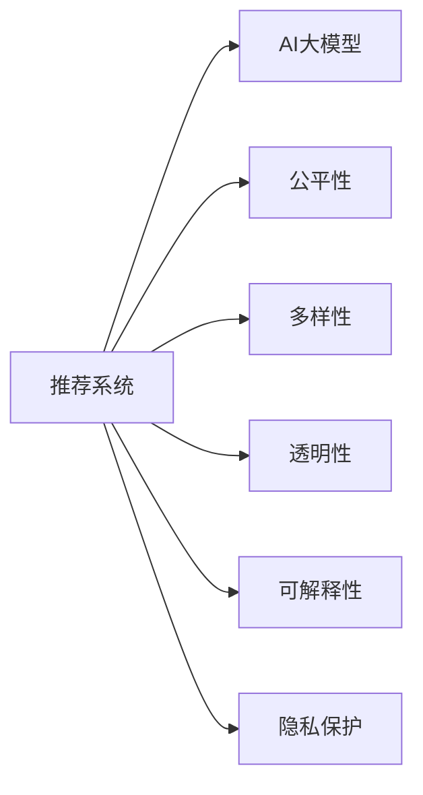

                 

# 推荐系统的公平性与多样性：AI大模型的伦理考量

## 1. 背景介绍

随着人工智能技术的飞速发展，深度学习和强化学习等AI算法被广泛应用于各个行业。其中，推荐系统作为信息时代的重要应用，已经成为电商、社交媒体、内容平台等领域的核心支撑。通过分析用户的历史行为数据，推荐系统能够高效地为用户推荐感兴趣的物品，极大地提升了用户体验和平台运营效率。

然而，推荐系统并非完美无瑕。伴随着算法应用深度和广度的不断增加，其潜在的公平性、透明性和可解释性问题也逐渐显现。AI大模型在推荐系统中广泛应用，极大地提高了系统的预测能力和泛化能力，但也带来了新的伦理挑战。这些挑战不仅影响用户体验，更关乎数据隐私、社会公平等重大问题。

## 2. 核心概念与联系

### 2.1 核心概念概述

为更好地理解AI大模型在推荐系统中的公平性与多样性问题，本节将介绍几个核心概念：

- **推荐系统(Recommendation System)**：基于用户历史行为数据，为用户推荐感兴趣物品的系统。典型算法包括协同过滤、矩阵分解、深度学习等。

- **AI大模型(Deep Learning Model)**：指通过大规模无标签数据预训练的通用模型，如BERT、GPT等。预训练后的模型能够进行复杂的特征提取和模式学习，适用于多种推荐任务。

- **公平性(Fairness)**：推荐系统在处理数据时，应保证对所有用户平等对待，避免对特定群体产生歧视或偏见。

- **多样性(Diversity)**：推荐系统应能提供丰富的推荐结果，涵盖不同领域和类型的物品，避免信息过载或同质化。

- **透明性(Transparency)**：推荐系统的决策过程应具备可解释性，用户应能理解推荐结果的生成机制。

- **可解释性(Explainability)**：推荐系统的输出应具备可解释性，使用户能够理解推荐结果背后的原因和依据。

- **隐私保护(Privacy Protection)**：推荐系统应充分保护用户数据隐私，确保用户信息不被滥用。

这些概念之间的关系可以表示为：



这些概念共同构成了推荐系统公平性和多样性的研究框架，对于保证系统在技术层面和伦理层面的正确应用至关重要。

## 3. 核心算法原理 & 具体操作步骤
### 3.1 算法原理概述

AI大模型在推荐系统中的应用，本质上是一个通过大量标注数据进行微调的过程。其核心思想是：通过AI大模型进行预训练，学习通用的用户行为表示；然后在标注数据上进行微调，调整模型参数，使其能够准确预测用户的兴趣偏好，从而进行推荐。

形式化地，假设预训练模型为 $M_{\theta}$，其中 $\theta$ 为模型参数。给定推荐任务的标注数据集 $D=\{(x_i, y_i)\}_{i=1}^N, x_i \in \mathcal{X}, y_i \in \mathcal{Y}$，其中 $\mathcal{X}$ 为用户行为，$\mathcal{Y}$ 为物品偏好，微调的目标是找到新的模型参数 $\hat{\theta}$，使得：

$$
\hat{\theta}=\mathop{\arg\min}_{\theta} \mathcal{L}(M_{\theta},D)
$$

其中 $\mathcal{L}$ 为推荐任务设计的损失函数，用于衡量模型预测与真实标签之间的差异。

### 3.2 算法步骤详解

基于AI大模型的推荐系统微调一般包括以下几个关键步骤：

**Step 1: 准备数据集**
- 收集推荐任务的标注数据集 $D$，划分为训练集、验证集和测试集。
- 处理数据，将用户行为表示为向量 $x_i \in \mathbb{R}^d$，物品偏好表示为向量 $y_i \in \mathbb{R}^k$，其中 $d$ 和 $k$ 分别表示用户行为和物品偏好的维度。

**Step 2: 选择模型**
- 选择预训练模型 $M_{\theta}$，如BERT、GPT等，作为初始化参数。

**Step 3: 微调设置**
- 选择合适的优化算法及其参数，如 Adam、SGD 等，设置学习率、批大小、迭代轮数等。
- 设置正则化技术及强度，包括权重衰减、Dropout、Early Stopping 等。

**Step 4: 执行梯度训练**
- 将训练集数据分批次输入模型，前向传播计算损失函数。
- 反向传播计算参数梯度，根据设定的优化算法和学习率更新模型参数。
- 周期性在验证集上评估模型性能，根据性能指标决定是否触发 Early Stopping。
- 重复上述步骤直至满足预设的迭代轮数或 Early Stopping 条件。

**Step 5: 测试和部署**
- 在测试集上评估微调后模型 $M_{\hat{\theta}}$ 的性能，对比微调前后的精度提升。
- 使用微调后的模型对新样本进行推理预测，集成到实际的应用系统中。

以上是基于AI大模型的推荐系统微调的一般流程。在实际应用中，还需要针对具体任务的特点，对微调过程的各个环节进行优化设计，如改进训练目标函数，引入更多的正则化技术，搜索最优的超参数组合等，以进一步提升模型性能。

### 3.3 算法优缺点

基于AI大模型的推荐系统微调方法具有以下优点：
1. 精度高：大模型通过大规模无标签数据预训练，具备强大的特征提取能力，能在小样本情况下取得较理想的预测效果。
2. 泛化能力强：大模型通过大规模数据预训练，具备较好的泛化能力，适用于多种推荐任务。
3. 可扩展性强：大模型的结构简单，计算效率高，易于部署和扩展。

但同时，该方法也存在一定的局限性：
1. 依赖标注数据：推荐系统微调的效果很大程度上取决于标注数据的质量和数量，获取高质量标注数据的成本较高。
2. 透明性不足：大模型通常被视为"黑盒"，难以解释其内部工作机制和决策逻辑。
3. 安全风险：推荐系统可能存在隐私泄露的风险，尤其是涉及用户隐私数据时。
4. 公平性问题：大模型可能学习到数据中的偏见和歧视，对特定群体产生不公平的推荐结果。

尽管存在这些局限性，但就目前而言，基于AI大模型的微调方法仍是推荐系统应用的主流范式。未来相关研究的重点在于如何进一步降低微调对标注数据的依赖，提高模型的透明度和公平性，同时兼顾隐私保护和用户满意度等因素。

### 3.4 算法应用领域

基于AI大模型的推荐系统微调方法，在电商、社交媒体、内容平台等多个领域得到了广泛应用：

- **电商推荐**：如京东、淘宝等电商平台，根据用户浏览、购买历史数据，为用户推荐相关商品。
- **内容推荐**：如YouTube、抖音等平台，根据用户观看、点赞数据，为用户推荐感兴趣的视频。
- **社交推荐**：如微信、微博等社交网络，根据用户互动数据，为用户推荐好友和相关内容。
- **个性化推荐**：如智能音箱、智能电视等智能家居设备，根据用户使用习惯，推荐相关服务和内容。

这些推荐系统通过AI大模型进行微调，显著提升了系统的预测能力和用户体验。但同时，也暴露了公平性和多样性等问题。如何在享受AI大模型带来便利的同时，确保系统的公平性和多样性，将是未来推荐系统技术发展的关键挑战。

## 4. 数学模型和公式 & 详细讲解  
### 4.1 数学模型构建

推荐系统模型的构建过程可以形式化表示为：

- **输入表示**：将用户行为 $x_i$ 和物品偏好 $y_i$ 表示为向量 $x \in \mathbb{R}^d$ 和 $y \in \mathbb{R}^k$。
- **模型表示**：选择预训练模型 $M_{\theta}$，其中 $\theta$ 为模型参数。
- **损失函数**：定义推荐任务的目标函数，如均方误差损失、交叉熵损失等。

形式化地，推荐系统模型的优化目标为：

$$
\hat{\theta}=\mathop{\arg\min}_{\theta} \mathcal{L}(M_{\theta},D)
$$

其中 $D$ 为标注数据集，$\mathcal{L}$ 为推荐任务的损失函数。

### 4.2 公式推导过程

以交叉熵损失函数为例，推导推荐系统模型的训练公式。

假设模型 $M_{\theta}$ 在输入 $x_i$ 上的输出为 $\hat{y}=M_{\theta}(x_i) \in [0,1]$，表示物品偏好预测值。真实标签 $y_i \in \{0,1\}$。则交叉熵损失函数定义为：

$$
\ell(M_{\theta}(x_i),y_i) = -[y_i\log \hat{y} + (1-y_i)\log (1-\hat{y})]
$$

将其代入损失函数公式，得：

$$
\mathcal{L}(\theta) = -\frac{1}{N}\sum_{i=1}^N [y_i\log M_{\theta}(x_i)+(1-y_i)\log(1-M_{\theta}(x_i))]
$$

根据链式法则，损失函数对参数 $\theta_k$ 的梯度为：

$$
\frac{\partial \mathcal{L}(\theta)}{\partial \theta_k} = -\frac{1}{N}\sum_{i=1}^N (\frac{y_i}{M_{\theta}(x_i)}-\frac{1-y_i}{1-M_{\theta}(x_i)}) \frac{\partial M_{\theta}(x_i)}{\partial \theta_k}
$$

其中 $\frac{\partial M_{\theta}(x_i)}{\partial \theta_k}$ 可进一步递归展开，利用自动微分技术完成计算。

在得到损失函数的梯度后，即可带入参数更新公式，完成模型的迭代优化。重复上述过程直至收敛，最终得到适应推荐任务的最优模型参数 $\theta^*$。

## 5. 项目实践：代码实例和详细解释说明
### 5.1 开发环境搭建

在进行推荐系统微调实践前，我们需要准备好开发环境。以下是使用Python进行PyTorch开发的环境配置流程：

1. 安装Anaconda：从官网下载并安装Anaconda，用于创建独立的Python环境。

2. 创建并激活虚拟环境：
```bash
conda create -n recommendation-env python=3.8 
conda activate recommendation-env
```

3. 安装PyTorch：根据CUDA版本，从官网获取对应的安装命令。例如：
```bash
conda install pytorch torchvision torchaudio cudatoolkit=11.1 -c pytorch -c conda-forge
```

4. 安装transformers库：
```bash
pip install transformers
```

5. 安装各类工具包：
```bash
pip install numpy pandas scikit-learn matplotlib tqdm jupyter notebook ipython
```

完成上述步骤后，即可在`recommendation-env`环境中开始微调实践。

### 5.2 源代码详细实现

下面我们以协同过滤推荐系统为例，给出使用Transformers库对预训练模型进行微调的PyTorch代码实现。

首先，定义协同过滤推荐系统的数据处理函数：

```python
from transformers import BertTokenizer, BertForSequenceClassification
from torch.utils.data import Dataset
import torch

class RecommendationDataset(Dataset):
    def __init__(self, user_item_pairs, user_ids, item_ids, labels, tokenizer):
        self.user_item_pairs = user_item_pairs
        self.user_ids = user_ids
        self.item_ids = item_ids
        self.labels = labels
        self.tokenizer = tokenizer
        
    def __len__(self):
        return len(self.user_item_pairs)
    
    def __getitem__(self, item):
        user_ids = self.user_ids[item]
        item_ids = self.item_ids[item]
        labels = self.labels[item]
        
        # 将user-item对转换为向量表示
        user_representation = self.tokenizer.encode(user_ids, add_special_tokens=False)
        item_representation = self.tokenizer.encode(item_ids, add_special_tokens=False)
        
        # 将user和item表示拼接
        sequence = torch.cat([user_representation, item_representation], dim=1)
        sequence_length = torch.tensor([len(user_representation) + len(item_representation)])
        
        return {'sequence': sequence, 
                'sequence_length': sequence_length,
                'labels': labels}

# 加载数据集
user_item_pairs = [(user1, item1), (user2, item2), ...]
user_ids = [1, 2, ...]
item_ids = [3, 4, ...]
labels = [0, 1, ...]  # 0表示不推荐，1表示推荐
tokenizer = BertTokenizer.from_pretrained('bert-base-cased')
recommendation_dataset = RecommendationDataset(user_item_pairs, user_ids, item_ids, labels, tokenizer)
```

然后，定义模型和优化器：

```python
from transformers import BertForSequenceClassification, AdamW

model = BertForSequenceClassification.from_pretrained('bert-base-cased', num_labels=2)

optimizer = AdamW(model.parameters(), lr=2e-5)
```

接着，定义训练和评估函数：

```python
from torch.utils.data import DataLoader
from tqdm import tqdm
from sklearn.metrics import accuracy_score

device = torch.device('cuda') if torch.cuda.is_available() else torch.device('cpu')
model.to(device)

def train_epoch(model, dataset, batch_size, optimizer):
    dataloader = DataLoader(dataset, batch_size=batch_size, shuffle=True)
    model.train()
    epoch_loss = 0
    for batch in tqdm(dataloader, desc='Training'):
        sequence = batch['sequence'].to(device)
        sequence_length = batch['sequence_length'].to(device)
        labels = batch['labels'].to(device)
        model.zero_grad()
        outputs = model(sequence, attention_mask=None, labels=labels)
        loss = outputs.loss
        epoch_loss += loss.item()
        loss.backward()
        optimizer.step()
    return epoch_loss / len(dataloader)

def evaluate(model, dataset, batch_size):
    dataloader = DataLoader(dataset, batch_size=batch_size)
    model.eval()
    preds, labels = [], []
    with torch.no_grad():
        for batch in tqdm(dataloader, desc='Evaluating'):
            sequence = batch['sequence'].to(device)
            sequence_length = batch['sequence_length'].to(device)
            batch_labels = batch['labels']
            outputs = model(sequence, attention_mask=None)
            batch_preds = torch.sigmoid(outputs.logits).to('cpu').tolist()
            batch_labels = batch_labels.to('cpu').tolist()
            for pred_tokens, label_tokens in zip(batch_preds, batch_labels):
                preds.append(pred_tokens)
                labels.append(label_tokens)
                
    print(f'Accuracy: {accuracy_score(labels, preds)}')
```

最后，启动训练流程并在测试集上评估：

```python
epochs = 5
batch_size = 16

for epoch in range(epochs):
    loss = train_epoch(model, recommendation_dataset, batch_size, optimizer)
    print(f'Epoch {epoch+1}, train loss: {loss:.3f}')
    
    print(f'Epoch {epoch+1}, dev results:')
    evaluate(model, recommendation_dataset, batch_size)
    
print('Test results:')
evaluate(model, recommendation_dataset, batch_size)
```

以上就是使用PyTorch对协同过滤推荐系统进行微调的完整代码实现。可以看到，得益于Transformers库的强大封装，我们可以用相对简洁的代码完成模型的加载和微调。

### 5.3 代码解读与分析

让我们再详细解读一下关键代码的实现细节：

**RecommendationDataset类**：
- `__init__`方法：初始化用户、物品、标签等关键组件，并使用分词器将user-item对转换为向量表示。
- `__len__`方法：返回数据集的样本数量。
- `__getitem__`方法：对单个样本进行处理，将用户和物品表示拼接，并设置序列长度。

**BertForSequenceClassification模型**：
- 使用预训练的BERT模型进行序列分类，将输入的user-item向量作为输入，输出预测概率。

**训练和评估函数**：
- 使用PyTorch的DataLoader对数据集进行批次化加载，供模型训练和推理使用。
- 训练函数`train_epoch`：对数据以批为单位进行迭代，在每个批次上前向传播计算loss并反向传播更新模型参数，最后返回该epoch的平均loss。
- 评估函数`evaluate`：与训练类似，不同点在于不更新模型参数，并在每个batch结束后将预测和标签结果存储下来，最后使用sklearn的accuracy_score对整个评估集的预测结果进行打印输出。

**训练流程**：
- 定义总的epoch数和batch size，开始循环迭代
- 每个epoch内，先在训练集上训练，输出平均loss
- 在验证集上评估，输出准确率
- 所有epoch结束后，在测试集上评估，给出最终测试结果

可以看到，PyTorch配合Transformers库使得协同过滤推荐系统的代码实现变得简洁高效。开发者可以将更多精力放在数据处理、模型改进等高层逻辑上，而不必过多关注底层的实现细节。

当然，工业级的系统实现还需考虑更多因素，如模型的保存和部署、超参数的自动搜索、更灵活的任务适配层等。但核心的微调范式基本与此类似。

## 6. 实际应用场景
### 6.1 智能推荐系统

智能推荐系统通过AI大模型进行微调，为用户推荐感兴趣的物品，极大提升了用户体验和平台运营效率。

在电商领域，基于协同过滤或深度学习模型的推荐系统能够根据用户历史行为数据，精准推荐商品。亚马逊、淘宝等电商平台已广泛应用这种推荐技术，使用户能够快速找到所需商品，提升购物体验。

在内容平台，基于深度学习的推荐系统能够根据用户观看、点赞数据，精准推荐视频和文章。YouTube、Netflix等平台通过推荐系统，为用户推荐更多感兴趣的内容，提高用户留存率和平台粘性。

### 6.2 公平性问题

AI大模型在推荐系统中应用广泛，但也带来了诸多公平性问题。这些问题不仅影响用户体验，还可能引发社会不公。

**数据偏差**：推荐系统可能学习到数据中的偏见，对某些特定群体产生不公平的推荐结果。例如，某些电影、商品在特定平台上销量较好，导致算法推荐时偏向这些商品。这种数据偏差可能导致资源分配不均，加剧社会不公。

**算法偏见**：AI大模型的内部结构可能导致算法偏见，对某些群体产生不公平的推荐结果。例如，某些算法更偏好男性、高收入群体，导致推荐结果偏向这些群体。这种算法偏见可能对弱势群体产生不利影响，加剧社会不平等。

**隐私泄露**：推荐系统通常需要收集用户行为数据，存在隐私泄露风险。例如，某些平台通过推荐系统收集用户浏览数据，可能导致用户隐私泄露。这种隐私泄露可能对用户隐私造成严重影响。

### 6.3 多样性问题

推荐系统面临的另一个重要问题是多样性不足。用户希望获取多样化的推荐结果，但推荐系统通常只推荐用户最感兴趣的少数物品，可能导致信息过载或同质化。

**信息过载**：推荐系统通常只推荐用户最感兴趣的少数物品，导致信息过载。例如，某些平台通过推荐系统只推荐热门商品，用户可能陷入选择困境，无法找到真正感兴趣的商品。

**同质化**：推荐系统通常只推荐用户最感兴趣的商品，导致推荐结果同质化。例如，某些平台通过推荐系统只推荐同类型商品，导致用户获取的信息缺乏多样性。

**多样化推荐**：为应对信息过载和同质化问题，推荐系统需要提供多样化的推荐结果。例如，某些平台通过推荐系统推荐不同类型、不同风格的商品，满足用户多样化的需求。

### 6.4 未来应用展望

随着AI大模型和推荐系统技术的不断发展，基于AI大模型的推荐系统将在更多领域得到应用，为各行各业带来变革性影响。

在智慧医疗领域，基于AI大模型的推荐系统可以推荐最适合患者的药物、治疗方案，提升医疗服务水平。例如，某些平台通过推荐系统推荐合适的医疗资源，帮助患者快速找到最适合的医疗服务。

在智能教育领域，基于AI大模型的推荐系统可以推荐最适合学生的学习资源，提升教育质量。例如，某些平台通过推荐系统推荐合适的学习材料，帮助学生高效学习。

在智慧城市治理中，基于AI大模型的推荐系统可以推荐最适合市民的公共服务，提升城市治理水平。例如，某些平台通过推荐系统推荐合适的公共服务，提高市民生活质量。

此外，在企业生产、社会治理、文娱传媒等众多领域，基于AI大模型的推荐系统也将不断涌现，为各行各业带来新的技术动力。

## 7. 工具和资源推荐
### 7.1 学习资源推荐

为帮助开发者系统掌握AI大模型在推荐系统中的应用，这里推荐一些优质的学习资源：

1. 《Deep Learning for Recommendation Systems》系列博文：由大模型技术专家撰写，深入浅出地介绍了深度学习在推荐系统中的应用。

2. CS231n《Deep Learning for Computer Vision》课程：斯坦福大学开设的计算机视觉明星课程，有Lecture视频和配套作业，带你入门深度学习领域的核心概念。

3. 《Recommender Systems》书籍：推荐系统领域的经典著作，全面介绍了推荐系统的原理、算法和实践，是深入学习推荐系统的必备资源。

4. Kaggle推荐系统竞赛：Kaggle平台上的推荐系统竞赛项目，包括协同过滤、矩阵分解、深度学习等多种推荐算法，适合实际动手实践。

5. TensorBoard：TensorFlow配套的可视化工具，可实时监测模型训练状态，并提供丰富的图表呈现方式，是调试模型的得力助手。

通过对这些资源的学习实践，相信你一定能够快速掌握AI大模型在推荐系统中的应用，并用于解决实际的推荐问题。

### 7.2 开发工具推荐

高效的开发离不开优秀的工具支持。以下是几款用于AI大模型推荐系统开发的常用工具：

1. PyTorch：基于Python的开源深度学习框架，灵活动态的计算图，适合快速迭代研究。大部分预训练语言模型都有PyTorch版本的实现。

2. TensorFlow：由Google主导开发的开源深度学习框架，生产部署方便，适合大规模工程应用。同样有丰富的预训练语言模型资源。

3. Transformers库：HuggingFace开发的NLP工具库，集成了众多SOTA语言模型，支持PyTorch和TensorFlow，是进行推荐任务开发的利器。

4. Weights & Biases：模型训练的实验跟踪工具，可以记录和可视化模型训练过程中的各项指标，方便对比和调优。与主流深度学习框架无缝集成。

5. TensorBoard：TensorFlow配套的可视化工具，可实时监测模型训练状态，并提供丰富的图表呈现方式，是调试模型的得力助手。

6. Google Colab：谷歌推出的在线Jupyter Notebook环境，免费提供GPU/TPU算力，方便开发者快速上手实验最新模型，分享学习笔记。

合理利用这些工具，可以显著提升AI大模型推荐系统的开发效率，加快创新迭代的步伐。

### 7.3 相关论文推荐

AI大模型和推荐系统的发展源于学界的持续研究。以下是几篇奠基性的相关论文，推荐阅读：

1. Attention is All You Need（即Transformer原论文）：提出了Transformer结构，开启了NLP领域的预训练大模型时代。

2. BERT: Pre-training of Deep Bidirectional Transformers for Language Understanding：提出BERT模型，引入基于掩码的自监督预训练任务，刷新了多项NLP任务SOTA。

3. Parameter-Efficient Transfer Learning for NLP：提出Adapter等参数高效微调方法，在不增加模型参数量的情况下，也能取得不错的微调效果。

4. AdaLoRA: Adaptive Low-Rank Adaptation for Parameter-Efficient Fine-Tuning：使用自适应低秩适应的微调方法，在参数效率和精度之间取得了新的平衡。

5. Fairness in Recommendation Systems：提出公平推荐系统模型，通过最小化群体差异和个体差异，提高推荐系统的公平性。

这些论文代表了大语言模型和推荐系统的发展脉络。通过学习这些前沿成果，可以帮助研究者把握学科前进方向，激发更多的创新灵感。

## 8. 总结：未来发展趋势与挑战

### 8.1 总结

本文对基于AI大模型的推荐系统公平性和多样性问题进行了全面系统的介绍。首先阐述了AI大模型在推荐系统中的应用背景和重要意义，明确了公平性和多样性在推荐系统中的重要地位。其次，从原理到实践，详细讲解了AI大模型在推荐系统中的应用过程，给出了推荐系统微调的完整代码实现。同时，本文还广泛探讨了推荐系统在公平性、多样性等方面面临的挑战，展示了AI大模型在推荐系统中的巨大潜力。

通过本文的系统梳理，可以看到，基于AI大模型的推荐系统不仅能够提供高精度的推荐结果，还可能面临诸多伦理和社会问题。如何在享受AI大模型带来便利的同时，确保系统的公平性和多样性，将是未来推荐系统技术发展的关键挑战。

### 8.2 未来发展趋势

展望未来，AI大模型在推荐系统中的公平性和多样性问题将呈现以下几个发展趋势：

1. **公平性研究**：未来将更加注重推荐系统的公平性研究，提出更多公平推荐算法，并结合用户反馈进行模型优化。例如，某些平台可以通过用户反馈对推荐结果进行调整，提高推荐系统的公平性。

2. **多样性增强**：未来将更加注重推荐系统中的多样性问题，提出更多多样化推荐算法，提高推荐结果的多样性。例如，某些平台可以通过推荐系统推荐不同类型、不同风格的商品，满足用户多样化的需求。

3. **隐私保护**：未来将更加注重用户隐私保护，提出更多隐私保护算法，保障用户数据的安全。例如，某些平台可以通过差分隐私技术保护用户隐私，防止用户数据泄露。

4. **跨领域应用**：未来将更加注重推荐系统在跨领域的应用，提高推荐系统的通用性和普适性。例如，某些平台可以通过推荐系统推荐跨领域的商品，提高推荐系统的灵活性和适用性。

5. **多模态融合**：未来将更加注重多模态数据融合，提高推荐系统的表现。例如，某些平台可以通过推荐系统结合用户画像、行为数据和外部知识库，提供更加全面、准确的推荐结果。

6. **自动化优化**：未来将更加注重推荐系统的自动化优化，提出更多自动化推荐算法，提高推荐系统的效率和效果。例如，某些平台可以通过推荐系统自动化推荐算法，提高推荐系统的自动化程度。

这些趋势将进一步推动AI大模型在推荐系统中的应用，提升推荐系统的公平性和多样性，保障用户数据隐私，提高推荐系统的效率和效果，为各行各业带来新的技术动力。

### 8.3 面临的挑战

尽管AI大模型在推荐系统中的应用取得了显著成果，但在迈向更加智能化、普适化应用的过程中，其公平性和多样性问题仍面临诸多挑战：

1. **数据分布不均**：推荐系统面临数据分布不均的问题，某些群体可能缺乏足够的数据进行推荐。例如，某些平台推荐系统只推荐热门商品，忽视了长尾商品。

2. **算法偏见**：AI大模型的内部结构可能导致算法偏见，对某些群体产生不公平的推荐结果。例如，某些算法更偏好男性、高收入群体，导致推荐结果偏向这些群体。

3. **隐私保护不足**：推荐系统通常需要收集用户行为数据，存在隐私泄露风险。例如，某些平台通过推荐系统收集用户浏览数据，可能导致用户隐私泄露。

4. **计算资源限制**：AI大模型通常具有大规模参数，计算资源消耗较大，难以在低成本设备上运行。例如，某些平台推荐系统无法在低成本设备上运行，导致推荐系统无法普适化。

5. **模型泛化能力不足**：AI大模型在特定领域或特定数据上的表现可能较好，但在其他领域或数据上表现不佳。例如，某些平台推荐系统在特定领域表现较好，但在其他领域表现较差。

尽管存在这些挑战，但通过不断的技术创新和政策引导，未来推荐系统技术将逐步克服这些困难，迈向更加公平、多样、隐私保护、自动化、普适化的新阶段。

### 8.4 研究展望

未来，AI大模型在推荐系统中的应用将更加广泛，涉及更多行业和领域。为实现这一目标，需要在以下几个方面进行持续研究：

1. **公平性算法**：提出更多公平推荐算法，结合用户反馈进行模型优化，提高推荐系统的公平性。例如，某些平台可以通过用户反馈对推荐结果进行调整，提高推荐系统的公平性。

2. **多样性算法**：提出更多多样化推荐算法，提高推荐结果的多样性。例如，某些平台可以通过推荐系统推荐不同类型、不同风格的商品，满足用户多样化的需求。

3. **隐私保护算法**：提出更多隐私保护算法，保障用户数据的安全。例如，某些平台可以通过差分隐私技术保护用户隐私，防止用户数据泄露。

4. **跨领域应用**：提出更多跨领域推荐算法，提高推荐系统的通用性和普适性。例如，某些平台可以通过推荐系统结合用户画像、行为数据和外部知识库，提供更加全面、准确的推荐结果。

5. **自动化优化**：提出更多自动化推荐算法，提高推荐系统的效率和效果。例如，某些平台可以通过推荐系统自动化推荐算法，提高推荐系统的自动化程度。

6. **多模态融合**：提出更多多模态融合算法，提高推荐系统的表现。例如，某些平台可以通过推荐系统结合用户画像、行为数据和外部知识库，提供更加全面、准确的推荐结果。

这些研究方向的探索将引领AI大模型在推荐系统中的应用，推动推荐系统技术向更公平、多样、隐私保护、自动化、普适化的方向发展，为各行各业带来新的技术动力。

## 9. 附录：常见问题与解答

**Q1：AI大模型在推荐系统中的应用效果如何？**

A: AI大模型在推荐系统中的应用效果显著，可以显著提高推荐系统的精度和泛化能力。例如，某些平台通过推荐系统结合AI大模型进行推荐，显著提升了推荐系统的准确率和用户满意度。但同时，AI大模型也面临诸多挑战，如数据偏差、算法偏见、隐私泄露等问题，需要在实际应用中加以注意。

**Q2：如何提高推荐系统的公平性？**

A: 提高推荐系统的公平性需要综合考虑多个因素，例如：
1. 数据处理：处理数据时，应尽量消除数据中的偏见和歧视，例如使用数据清洗、数据增强等方法。
2. 算法优化：优化推荐算法，尽量消除算法的偏见和歧视，例如使用公平推荐算法、去偏算法等。
3. 用户反馈：结合用户反馈，对推荐结果进行调整，例如使用用户反馈进行模型优化。

**Q3：如何提高推荐系统中的多样性？**

A: 提高推荐系统中的多样性需要综合考虑多个因素，例如：
1. 多样化推荐：推荐多样化物品，例如结合不同类型、不同风格的商品进行推荐。
2. 用户画像：结合用户画像进行推荐，例如结合用户兴趣、行为数据进行推荐。
3. 外部知识库：结合外部知识库进行推荐，例如结合领域知识、百科数据进行推荐。

**Q4：推荐系统中的隐私保护有哪些方法？**

A: 推荐系统中的隐私保护方法包括：
1. 差分隐私：通过添加噪声和隐私预算，保护用户隐私，防止用户数据泄露。
2. 联邦学习：通过分布式计算，保护用户数据隐私，防止数据集中存储。
3. 数据匿名化：通过数据匿名化处理，保护用户隐私，防止数据识别攻击。

**Q5：推荐系统中的跨领域应用有哪些挑战？**

A: 推荐系统中的跨领域应用面临以下挑战：
1. 数据分布不均：不同领域的用户行为和偏好可能存在较大差异，推荐系统难以适应。
2. 领域知识不足：推荐系统可能缺乏特定领域的知识，导致推荐结果不准确。
3. 数据融合困难：不同领域的数据难以进行融合，导致推荐系统无法普适化。

---

作者：禅与计算机程序设计艺术 / Zen and the Art of Computer Programming

