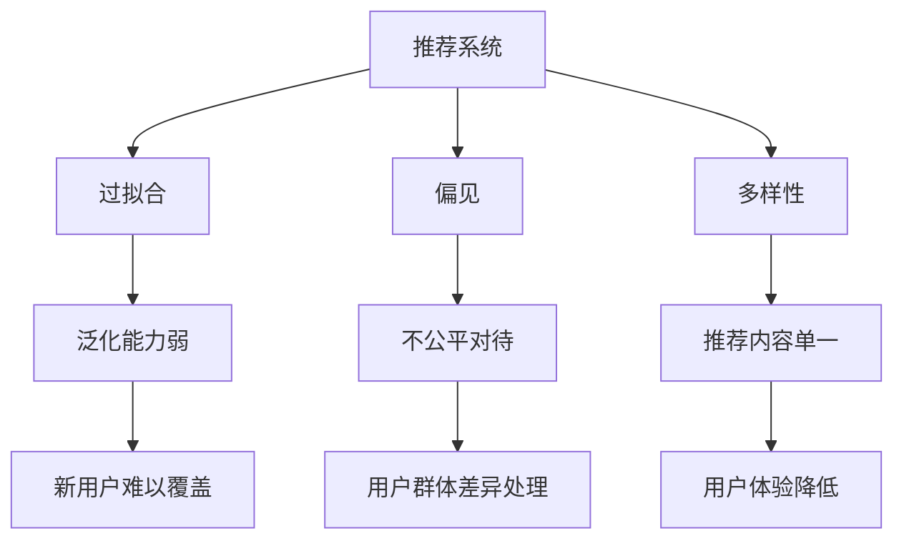

                 

## 1. 背景介绍

推荐系统已成为数字时代各行各业不可或缺的核心技术。无论是电商、媒体、社交平台，还是金融、保险、健康医疗等，推荐系统都在持续优化用户体验，驱动业务增长。然而，尽管推荐系统已取得诸多成就，却仍面临诸多局限和挑战，如过拟合、偏见和多样性问题。

### 1.1 问题由来

推荐系统通常基于用户历史行为数据和物品特征，使用各种算法模型预测用户可能感兴趣的内容，从而实现个性化推荐。然而，由于数据分布的复杂性、用户需求的多样性以及算法的自适应能力限制，推荐系统在实际应用中仍存在以下问题：

- **过拟合**：推荐模型过于依赖历史数据，导致在新用户和未覆盖场景下泛化能力弱。
- **偏见**：推荐模型可能学习到数据的固有偏差，无法公平公正地处理不同用户群体。
- **多样性**：推荐模型倾向于展示用户已知偏好的内容，减少了推荐的丰富性和多样性。

这些问题严重影响了推荐系统的可靠性和用户体验，亟需深入研究和解决。

## 2. 核心概念与联系

### 2.1 核心概念概述

为更好地理解推荐系统的局限和挑战，本节将介绍几个密切相关的核心概念：

- **推荐系统**：一种利用用户历史行为数据和物品特征，预测用户可能感兴趣内容的技术。常见的推荐算法包括协同过滤、矩阵分解、神经网络推荐等。

- **过拟合**：指模型过度适应训练数据，在新数据上表现不佳。在推荐系统中，过拟合可能体现在对特定用户的推荐依赖性过强，无法处理新用户的偏好变化。

- **偏见**：指模型在数据分布不均衡、用户群体差异明显的情况下，无法公正地处理用户需求。在推荐系统中，偏见可能表现为对某些用户群体、物品类型的不公平对待。

- **多样性**：指推荐内容的多样性，推荐系统需平衡用户兴趣与内容多样性，以避免推荐内容的单一性。

这些核心概念之间的逻辑关系可以通过以下Mermaid流程图来展示：



这个流程图展示了他推荐系统的核心概念及其之间的关系：

1. 推荐系统通过预测用户兴趣进行个性化推荐，但面临过拟合、偏见和多样性等挑战。
2. 过拟合会导致模型在新用户和未覆盖场景下泛化能力弱。
3. 偏见会导致模型在用户群体和物品类型上存在不公平。
4. 多样性不足会使得推荐内容单一，影响用户体验。

这些概念共同构成了推荐系统的学习和应用框架，需要综合考虑以实现更公平、更具多样性的推荐。

## 3. 核心算法原理 & 具体操作步骤
### 3.1 算法原理概述

推荐系统中的过拟合、偏见和多样性问题，可以通过优化算法、数据处理和模型设计等手段来缓解。以下详细介绍推荐的各个核心算法及其具体操作步骤：

- **协同过滤**：基于用户历史行为或物品特征进行相似性匹配，预测用户可能感兴趣的物品。协同过滤包括基于用户的协同过滤和基于物品的协同过滤。

- **矩阵分解**：将用户和物品分别表示为向量，通过矩阵分解算法获得用户与物品的潜在因子，进行推荐预测。常用的矩阵分解算法包括奇异值分解(SVD)、梯度下降等。

- **神经网络推荐**：利用深度神经网络模型，融合用户历史行为和物品特征，进行多层次特征提取和兴趣预测。常用的神经网络模型包括深度矩阵分解、多层感知器、循环神经网络等。

- **混合推荐**：将多种推荐算法组合使用，综合其优缺点，提升推荐效果。混合推荐可以解决单一算法的不足，如协同过滤的用户冷启动问题，矩阵分解的计算复杂性等。

### 3.2 算法步骤详解

#### 协同过滤
协同过滤的推荐步骤如下：

1. 数据预处理：收集用户历史行为数据，进行数据清洗和归一化处理。

2. 相似性计算：计算用户或物品之间的相似性，常用的相似性度量方法包括余弦相似度、皮尔逊相关系数等。

3. 推荐计算：根据相似性计算结果，预测用户可能感兴趣的物品。

4. 结果过滤：对推荐结果进行过滤和排序，排除重复和低质量物品，返回最终推荐列表。

#### 矩阵分解
矩阵分解的推荐步骤如下：

1. 数据预处理：收集用户历史行为和物品特征数据，构建用户-物品评分矩阵。

2. 矩阵分解：使用奇异值分解(SVD)等算法，将用户-物品评分矩阵分解为用户因子矩阵和物品因子矩阵。

3. 用户评分预测：根据分解后的用户因子矩阵和物品因子矩阵，预测用户对每个物品的评分。

4. 结果排序：根据评分预测结果进行排序，返回最终推荐列表。

#### 神经网络推荐
神经网络推荐的推荐步骤如下：

1. 数据预处理：收集用户历史行为和物品特征数据，构建用户-物品交互矩阵。

2. 网络设计：设计深度神经网络模型，包括输入层、隐藏层和输出层，定义损失函数和优化器。

3. 模型训练：使用用户-物品交互矩阵作为训练数据，最小化损失函数，训练神经网络模型。

4. 推荐预测：使用训练好的神经网络模型，预测用户对每个物品的评分或概率。

5. 结果排序：根据评分或概率预测结果进行排序，返回最终推荐列表。

#### 混合推荐
混合推荐的推荐步骤如下：

1. 数据预处理：收集用户历史行为和物品特征数据，构建用户-物品评分矩阵。

2. 单一算法训练：分别使用协同过滤、矩阵分解、神经网络推荐等算法，训练模型。

3. 结果融合：将多种算法的结果进行融合，可以采用加权平均、softmax等方法。

4. 推荐预测：根据融合后的结果，预测用户可能感兴趣的物品。

5. 结果过滤：对推荐结果进行过滤和排序，排除重复和低质量物品，返回最终推荐列表。

### 3.3 算法优缺点

推荐算法中的协同过滤、矩阵分解、神经网络推荐和混合推荐各自具有以下优缺点：

- **协同过滤**：
  - 优点：简单高效，可以处理大规模用户和物品数据。
  - 缺点：依赖用户历史行为数据，用户冷启动问题难以解决。

- **矩阵分解**：
  - 优点：能处理大规模稀疏矩阵，适用于冷启动问题。
  - 缺点：计算复杂度高，易受到数据稀疏性和噪声的影响。

- **神经网络推荐**：
  - 优点：具备较强的特征表示能力和泛化能力，适用于复杂的推荐场景。
  - 缺点：计算资源需求高，训练复杂。

- **混合推荐**：
  - 优点：综合多种算法优点，灵活性高，效果好。
  - 缺点：算法复杂度较高，实现难度大。

### 3.4 算法应用领域

推荐系统已广泛应用于电子商务、社交网络、在线教育、影视媒体等众多领域。具体应用场景包括：

- **电商平台**：根据用户浏览和购买历史，推荐商品。
- **社交平台**：根据用户互动和内容消费行为，推荐内容。
- **在线教育**：根据学习历史和互动行为，推荐课程。
- **影视媒体**：根据观看历史和评分记录，推荐影视作品。

推荐系统在实际应用中已经取得了显著的效果，为用户带来了丰富的个性化体验。

## 4. 数学模型和公式 & 详细讲解 & 举例说明
### 4.1 数学模型构建

本节将使用数学语言对协同过滤和矩阵分解的推荐过程进行严格刻画。

**协同过滤**：

设用户集为 $U$，物品集为 $I$，用户 $u$ 对物品 $i$ 的评分记为 $r_{ui}$，令 $R \in \mathbb{R}^{|U| \times |I|}$ 为评分矩阵。

设用户 $u$ 和物品 $i$ 之间的相似性为 $s_{ui}$，令 $S \in \mathbb{R}^{|U| \times |I|}$ 为相似性矩阵。

协同过滤的目标是最小化预测评分与真实评分之间的误差，即：

$$
\min_{S} \frac{1}{2} \sum_{(u,i) \in U \times I} (r_{ui} - s_{ui})^2
$$

**矩阵分解**：

设用户集为 $U$，物品集为 $I$，用户 $u$ 对物品 $i$ 的评分记为 $r_{ui}$，令 $R \in \mathbb{R}^{|U| \times |I|}$ 为评分矩阵。

矩阵分解的目标是将评分矩阵 $R$ 分解为两个低秩矩阵 $P$ 和 $Q$，即：

$$
R \approx P \times Q^T
$$

其中 $P \in \mathbb{R}^{|U| \times k}$ 为用户因子矩阵，$Q \in \mathbb{R}^{|I| \times k}$ 为物品因子矩阵，$k$ 为因子矩阵的维数。

### 4.2 公式推导过程

#### 协同过滤

协同过滤的目标是最大化用户与物品之间的相似性。常用的相似性度量方法包括余弦相似度和皮尔逊相关系数。以余弦相似度为例，其公式如下：

$$
s_{ui} = \cos(\theta_u, \theta_i)
$$

其中 $\theta_u$ 和 $\theta_i$ 分别为用户 $u$ 和物品 $i$ 的特征向量。

协同过滤的推荐公式为：

$$
\hat{r}_{ui} = \sum_{j=1}^k s_{uj} \times r_{ij}
$$

其中 $s_{uj}$ 为物品 $j$ 对用户 $u$ 的相似性，$r_{ij}$ 为物品 $j$ 的评分。

#### 矩阵分解

矩阵分解的目标是将评分矩阵 $R$ 分解为两个低秩矩阵 $P$ 和 $Q$，常用的分解方法为奇异值分解(SVD)，其公式如下：

$$
R \approx P \times Q^T = \sum_{i=1}^{k} \sigma_i \times \alpha_i \times \beta_i^T
$$

其中 $P \in \mathbb{R}^{|U| \times k}$ 为用户因子矩阵，$Q \in \mathbb{R}^{|I| \times k}$ 为物品因子矩阵，$k$ 为因子矩阵的维数。

用户 $u$ 对物品 $i$ 的评分预测公式为：

$$
\hat{r}_{ui} = \sum_{j=1}^k p_{uj} \times q_{ij}
$$

其中 $p_{uj}$ 为用户 $u$ 的 $j$ 维因子向量，$q_{ij}$ 为物品 $i$ 的 $j$ 维因子向量。

### 4.3 案例分析与讲解

**协同过滤案例分析**

某电商平台使用协同过滤算法，推荐用户可能感兴趣的商品。具体实现步骤如下：

1. 收集用户历史行为数据，包括浏览、点击、购买等行为。

2. 计算用户与物品之间的相似性，使用余弦相似度进行计算。

3. 根据相似性计算结果，预测用户可能感兴趣的商品。

4. 对推荐结果进行过滤和排序，排除重复和低质量商品，返回最终推荐列表。

**矩阵分解案例分析**

某在线教育平台使用矩阵分解算法，推荐用户可能感兴趣的课程。具体实现步骤如下：

1. 收集用户历史学习行为数据，包括观看视频、做作业、测验等行为。

2. 构建用户-课程评分矩阵 $R$，使用奇异值分解(SVD)进行矩阵分解。

3. 根据分解后的用户因子矩阵和课程因子矩阵，预测用户对每门课程的评分。

4. 对评分预测结果进行排序，返回最终推荐列表。

## 5. 项目实践：代码实例和详细解释说明
### 5.1 开发环境搭建

在进行推荐系统开发前，我们需要准备好开发环境。以下是使用Python进行推荐系统开发的常见环境配置流程：

1. 安装Anaconda：从官网下载并安装Anaconda，用于创建独立的Python环境。

2. 创建并激活虚拟环境：
```bash
conda create -n recommendation-env python=3.8 
conda activate recommendation-env
```

3. 安装Scikit-learn、Pandas、NumPy等数据处理库：
```bash
pip install scikit-learn pandas numpy
```

4. 安装TensorFlow或PyTorch，用于模型训练和推理：
```bash
pip install tensorflow==2.6.0
```

5. 安装TensorBoard或MLflow，用于模型监控和可视化：
```bash
pip install tensorboard
```

完成上述步骤后，即可在`recommendation-env`环境中开始推荐系统开发。

### 5.2 源代码详细实现

下面我们以协同过滤为例，给出使用Scikit-learn进行推荐系统开发的PyTorch代码实现。

首先，定义数据集类：

```python
from sklearn.datasets import make_biclusters
from sklearn.model_selection import train_test_split
import numpy as np

class RecommendationDataset:
    def __init__(self, n_users=100, n_items=100, n_factors=10):
        self.n_users = n_users
        self.n_items = n_items
        self.n_factors = n_factors
        
        # 生成评分矩阵
        self.R = make_biclusters(n_samples=n_users, n_features=n_items, random_state=0)
        self.R = np.array(self.R)
        
        # 生成用户与物品的相似性矩阵
        self.S = np.abs(self.R - self.R.mean())
        self.S = self.S / (self.S.max() - self.S.min())
        
        # 将评分矩阵和相似性矩阵分割为训练集和测试集
        self.R_train, self.R_test, self.S_train, self.S_test = train_test_split(self.R, self.S, test_size=0.2, random_state=0)
        
    def __len__(self):
        return len(self.R_train)
    
    def __getitem__(self, item):
        u = self.R_train[item, :]
        v = self.S_train[item, :]
        return u, v
```

然后，定义模型类：

```python
from sklearn.metrics.pairwise import cosine_similarity
from sklearn.neighbors import NearestNeighbors

class CollaborativeFiltering:
    def __init__(self, n_factors=10):
        self.n_factors = n_factors
        
    def fit(self, X, y):
        self.X = X
        self.y = y
        
        # 计算用户与物品之间的相似性
        self.S = cosine_similarity(self.X)
        
        # 计算用户对物品的评分预测
        self.y_pred = np.dot(self.S, self.y)
        
        # 计算推荐结果
        self.y_pred = np.max(self.y_pred, axis=1)
        self.recommendations = np.argsort(self.y_pred)[::-1]
        
    def predict(self, u):
        u_index = np.argmax(u)
        similarities = self.S[u_index]
        similar_items = self.recommendations[similarities.argsort()][-1:][::-1]
        return similar_items
```

最后，启动训练流程并在测试集上评估：

```python
from sklearn.model_selection import cross_val_score
from sklearn.metrics import mean_squared_error, mean_absolute_error

# 生成数据集
dataset = RecommendationDataset()

# 训练模型
model = CollaborativeFiltering()
model.fit(dataset.R_train, dataset.S_train)

# 在测试集上评估模型
R_test, S_test = dataset.R_test, dataset.S_test
y_test = S_test[:, np.arange(model.n_factors)]
y_pred = np.dot(model.S, y_test)
mse = mean_squared_error(y_test, y_pred)
mae = mean_absolute_error(y_test, y_pred)
print(f"MSE: {mse:.3f}, MAE: {mae:.3f}")
```

以上就是使用Scikit-learn进行协同过滤推荐系统的完整代码实现。可以看到，使用Scikit-learn实现协同过滤非常简单，仅需调用几行代码即可完成模型的训练和评估。

### 5.3 代码解读与分析

让我们再详细解读一下关键代码的实现细节：

**RecommendationDataset类**：
- `__init__`方法：初始化用户数量、物品数量、因子数量等关键参数，生成评分矩阵和相似性矩阵，并分割为训练集和测试集。
- `__len__`方法：返回数据集的样本数量。
- `__getitem__`方法：返回单个用户和物品的评分和相似性向量。

**CollaborativeFiltering类**：
- `__init__`方法：初始化因子数量。
- `fit`方法：计算用户与物品之间的相似性，并使用协同过滤算法进行评分预测。
- `predict`方法：根据相似性计算推荐结果。

**训练流程**：
- 定义数据集对象。
- 训练协同过滤模型，计算预测评分和推荐结果。
- 在测试集上评估模型性能。

可以看到，Scikit-learn提供了丰富的数据处理和机器学习工具，使得协同过滤推荐系统的开发变得简洁高效。开发者可以将更多精力放在模型设计和优化上，而不必过多关注底层的实现细节。

当然，工业级的系统实现还需考虑更多因素，如用户冷启动问题、模型参数优化、推荐结果多样性等。但核心的协同过滤范式基本与此类似。

## 6. 实际应用场景
### 6.1 电子商务推荐

推荐系统在电子商务中的应用非常广泛，电商平台通过推荐系统，根据用户的历史浏览、购买行为，预测用户可能感兴趣的商品，实现个性化推荐，提升用户体验和销售额。

在技术实现上，可以收集用户历史浏览、点击、购买等行为数据，构建用户-商品评分矩阵，使用协同过滤、矩阵分解等算法进行推荐。对于新用户和未覆盖场景，可以通过数据增强、用户画像等手段进行补充，提升推荐效果。

### 6.2 媒体推荐

媒体平台通过推荐系统，根据用户的历史观看、点赞、评论等行为，预测用户可能感兴趣的视频、文章、音乐等内容，实现个性化推荐。推荐系统能够减少用户搜索时间，提升平台活跃度和用户粘性。

在技术实现上，可以收集用户的历史观看、点赞、评论等行为数据，构建用户-内容评分矩阵，使用协同过滤、矩阵分解等算法进行推荐。对于不同类型的内容，可以使用混合推荐策略，综合多种推荐算法，提升推荐效果。

### 6.3 在线教育推荐

在线教育平台通过推荐系统，根据用户的学习历史、互动行为等数据，预测用户可能感兴趣的视频、课程、习题等，实现个性化推荐。推荐系统能够提升学习效果，提高用户满意度和平台转化率。

在技术实现上，可以收集用户的学习历史、互动行为等数据，构建用户-课程评分矩阵，使用协同过滤、矩阵分解等算法进行推荐。对于新用户和未覆盖场景，可以通过知识图谱、逻辑规则等外部知识进行补充，提升推荐效果。

### 6.4 未来应用展望

随着推荐系统的发展，未来的推荐技术将呈现出以下几个趋势：

1. **深度学习推荐**：深度学习模型在特征表示和泛化能力上具备优势，未来将进一步取代传统的协同过滤和矩阵分解算法，成为推荐系统的主流范式。

2. **跨模态推荐**：推荐系统将不仅仅局限于文本和数值数据，更多地融合图像、语音、视频等多模态数据，提升推荐内容的丰富性和多样性。

3. **元学习推荐**：推荐系统将通过元学习技术，实现对新用户的快速推荐，解决冷启动问题。

4. **自适应推荐**：推荐系统将具备自适应能力，根据用户需求和环境变化动态调整推荐策略，提升推荐效果。

5. **多样性推荐**：推荐系统将更加注重推荐内容的多样性，减少用户已知偏好的推荐，避免内容单一。

6. **个性化推荐**：推荐系统将更加个性化，基于用户的行为数据和偏好，提供量身定制的推荐服务，提升用户体验。

以上趋势将进一步拓展推荐系统的应用范围，为数字化经济和社会带来新的变革。未来，推荐系统将不再是简单的内容推荐工具，而是具备更多智能决策能力的辅助系统。

## 7. 工具和资源推荐
### 7.1 学习资源推荐

为了帮助开发者系统掌握推荐系统的理论基础和实践技巧，这里推荐一些优质的学习资源：

1. 《推荐系统实战》一书：由推荐系统领域专家撰写，系统介绍了推荐系统的主要算法和应用案例。

2. 《深度学习》一书：由深度学习领域的知名专家撰写，详细介绍了深度学习的基本概念和应用。

3. CS401《机器学习》课程：由斯坦福大学开设的机器学习课程，系统介绍了机器学习的基本原理和算法。

4. Kaggle推荐系统竞赛：参加Kaggle推荐系统竞赛，通过实际比赛提升推荐系统的开发和优化能力。

5. Coursera推荐系统专项课程：由Coursera平台提供的推荐系统专项课程，包括协同过滤、矩阵分解、深度学习推荐等内容。

通过对这些资源的学习实践，相信你一定能够快速掌握推荐系统的精髓，并用于解决实际的推荐问题。

### 7.2 开发工具推荐

高效的开发离不开优秀的工具支持。以下是几款用于推荐系统开发的常用工具：

1. PyTorch：基于Python的开源深度学习框架，支持动态计算图，适合快速迭代研究。

2. TensorFlow：由Google主导开发的开源深度学习框架，生产部署方便，适合大规模工程应用。

3. Scikit-learn：基于Python的机器学习库，提供了丰富的数据处理和机器学习算法，非常适合推荐系统开发。

4. Jupyter Notebook：开源的交互式编程环境，支持多种编程语言和数据处理库，非常适合推荐系统研究。

5. Scalene：用于机器学习算法的资源调度和性能分析工具，可以优化推荐系统模型的计算效率。

合理利用这些工具，可以显著提升推荐系统的开发效率，加快创新迭代的步伐。

### 7.3 相关论文推荐

推荐系统的发展离不开学界的持续研究。以下是几篇奠基性的相关论文，推荐阅读：

1. ALS: The Alternating Least Squares Algorithm for Collaborative Filtering（矩阵分解算法）

2. BPR: BPR: Bayesian Personalized Ranking from Implicit Feedback（隐式反馈下的协同过滤）

3. Factorization Machines for Ad Click Prediction（因子化机器学习算法）

4. CNN-RNN-DM: A Generic Sequence Generation Model with Convolutional Neural Network and Recurrent Neural Network（深度学习推荐）

5. Attention-based Recommender Systems（注意力机制下的推荐系统）

这些论文代表了推荐系统的研究进展，深入理解这些前沿成果，可以帮助研究者把握学科前进方向，激发更多的创新灵感。

## 8. 总结：未来发展趋势与挑战
### 8.1 研究成果总结

推荐系统经过多年的发展，已经取得了显著的成就，广泛应用于电子商务、媒体、在线教育等多个领域。推荐算法中的协同过滤、矩阵分解、神经网络推荐和混合推荐各自具有独特的优缺点，适用于不同的应用场景。然而，推荐系统仍面临诸多挑战，如过拟合、偏见和多样性问题，亟需进一步研究解决。

### 8.2 未来发展趋势

展望未来，推荐系统的发展将呈现以下几个趋势：

1. **深度学习推荐**：深度学习模型在特征表示和泛化能力上具备优势，未来将进一步取代传统的协同过滤和矩阵分解算法，成为推荐系统的主流范式。

2. **跨模态推荐**：推荐系统将不仅仅局限于文本和数值数据，更多地融合图像、语音、视频等多模态数据，提升推荐内容的丰富性和多样性。

3. **元学习推荐**：推荐系统将通过元学习技术，实现对新用户的快速推荐，解决冷启动问题。

4. **自适应推荐**：推荐系统将具备自适应能力，根据用户需求和环境变化动态调整推荐策略，提升推荐效果。

5. **多样性推荐**：推荐系统将更加注重推荐内容的多样性，减少用户已知偏好的推荐，避免内容单一。

6. **个性化推荐**：推荐系统将更加个性化，基于用户的行为数据和偏好，提供量身定制的推荐服务，提升用户体验。

### 8.3 面临的挑战

尽管推荐系统已取得诸多成就，但在迈向更加智能化、普适化应用的过程中，它仍面临诸多挑战：

1. **过拟合**：推荐模型过于依赖历史数据，导致在新用户和未覆盖场景下泛化能力弱。

2. **偏见**：推荐模型在数据分布不均衡、用户群体差异明显的情况下，无法公正地处理用户需求。

3. **多样性不足**：推荐模型倾向于展示用户已知偏好的内容，减少了推荐的丰富性和多样性。

4. **计算资源消耗**：深度学习推荐模型的计算资源需求高，训练复杂，难以在大规模系统中部署。

5. **冷启动问题**：新用户和未覆盖场景的推荐效果较差，亟需快速推荐算法进行补充。

6. **隐私保护**：推荐系统需要收集用户行为数据，涉及隐私保护问题，需要合理处理用户数据，保护用户隐私。

7. **可解释性不足**：推荐模型通常像“黑盒”系统，难以解释其内部工作机制和决策逻辑。

8. **安全性问题**：推荐系统可能受到恶意攻击，如数据注入、模型篡改等，需要加强系统安全防护。

### 8.4 研究展望

面对推荐系统面临的挑战，未来的研究需要在以下几个方面寻求新的突破：

1. **深度学习推荐**：开发更加高效、泛化能力更强的深度学习推荐模型，提升推荐效果。

2. **跨模态推荐**：融合多模态数据，提升推荐内容的丰富性和多样性，满足用户多样化的需求。

3. **元学习推荐**：研究元学习技术，实现对新用户的快速推荐，解决冷启动问题。

4. **自适应推荐**：研究自适应算法，根据用户需求和环境变化动态调整推荐策略，提升推荐效果。

5. **多样性推荐**：研究多样性推荐算法，提升推荐内容的丰富性和多样性，减少用户已知偏好的推荐。

6. **个性化推荐**：基于用户的行为数据和偏好，提供量身定制的推荐服务，提升用户体验。

7. **隐私保护**：研究隐私保护技术，合理处理用户数据，保护用户隐私。

8. **可解释性**：研究推荐模型的可解释性，赋予模型更强的可解释性和可审计性。

9. **安全性**：研究推荐系统的安全性，加强系统安全防护，防止恶意攻击。

这些研究方向的探索，必将引领推荐系统技术迈向更高的台阶，为数字化经济和社会带来新的变革。

## 9. 附录：常见问题与解答
### 9.1 问题解答

**Q1：推荐系统如何处理冷启动问题？**

A: 推荐系统可以通过以下方法解决冷启动问题：

1. 数据增强：通过数据生成、数据合成等方法，扩充用户行为数据，提升模型泛化能力。

2. 用户画像：通过用户的社交网络、地理位置等信息，补充用户特征，提升推荐效果。

3. 知识图谱：通过构建用户-物品的知识图谱，补充外部知识，提升推荐效果。

4. 协同过滤：使用协同过滤算法，利用相似用户或相似物品的评分数据，进行推荐预测。

5. 深度学习：使用深度学习模型，学习用户的隐式特征，提升推荐效果。

**Q2：推荐系统如何避免过拟合？**

A: 推荐系统可以通过以下方法避免过拟合：

1. 数据增强：通过数据生成、数据合成等方法，扩充用户行为数据，提升模型泛化能力。

2. 正则化：使用L1、L2正则、Dropout等方法，避免模型过拟合。

3. 交叉验证：使用交叉验证方法，评估模型在不同数据集上的表现，避免模型在特定数据集上过拟合。

4. 集成学习：使用集成学习方法，综合多种推荐算法，提升推荐效果。

5. 自适应推荐：使用自适应算法，根据用户需求和环境变化动态调整推荐策略，提升推荐效果。

**Q3：推荐系统如何解决推荐内容单一问题？**

A: 推荐系统可以通过以下方法解决推荐内容单一问题：

1. 多样性推荐：研究多样性推荐算法，提升推荐内容的丰富性和多样性，减少用户已知偏好的推荐。

2. 混合推荐：使用混合推荐策略，综合多种推荐算法，提升推荐效果。

3. 跨模态推荐：融合多模态数据，提升推荐内容的丰富性和多样性，满足用户多样化的需求。

4. 知识图谱：通过构建用户-物品的知识图谱，补充外部知识，提升推荐效果。

5. 深度学习：使用深度学习模型，学习用户的隐式特征，提升推荐效果。

**Q4：推荐系统如何处理推荐内容质量问题？**

A: 推荐系统可以通过以下方法处理推荐内容质量问题：

1. 数据清洗：对数据进行清洗和归一化处理，去除噪声和异常数据，提升推荐质量。

2. 评分预测：使用评分预测算法，如协同过滤、矩阵分解、深度学习等，提升推荐效果。

3. 推荐过滤：对推荐结果进行过滤和排序，排除重复和低质量物品，返回高质量推荐列表。

4. 用户反馈：通过用户反馈机制，收集用户对推荐结果的评价，优化推荐策略。

5. 实时更新：根据用户实时反馈，实时更新推荐模型，提升推荐质量。

**Q5：推荐系统如何处理推荐系统偏见问题？**

A: 推荐系统可以通过以下方法处理推荐系统偏见问题：

1. 数据预处理：对数据进行预处理，去除固有的偏见，提升推荐效果。

2. 多样性推荐：研究多样性推荐算法，提升推荐内容的丰富性和多样性，减少偏见。

3. 混合推荐：使用混合推荐策略，综合多种推荐算法，提升推荐效果。

4. 知识图谱：通过构建用户-物品的知识图谱，补充外部知识，提升推荐效果。

5. 深度学习：使用深度学习模型，学习用户的隐式特征，提升推荐效果。

这些方法可以帮助推荐系统更好地处理冷启动、过拟合、推荐内容单一、推荐内容质量、推荐系统偏见等问题，提升推荐系统的性能和用户体验。

---

作者：禅与计算机程序设计艺术 / Zen and the Art of Computer Programming

