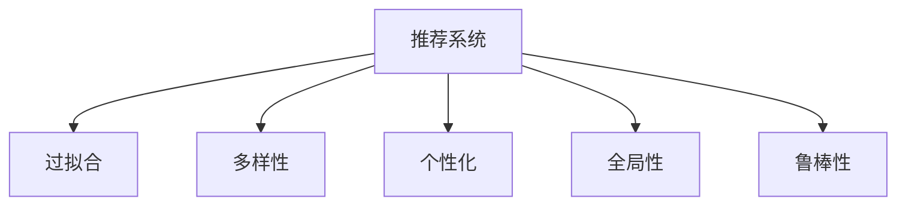

                 

# 推荐系统的局限：过拟合与多样性

## 1. 背景介绍

### 1.1 问题由来

随着互联网和数字技术的发展，推荐系统（Recommender Systems）在电商、内容媒体、社交网络等领域得到了广泛应用。推荐系统通过分析用户的过去行为和兴趣，预测用户未来可能感兴趣的内容或商品，从而提供个性化的服务。然而，尽管推荐系统在用户体验和商业价值上取得了显著成就，但其仍面临着一些难以避免的局限性，其中最显著的就是过拟合（Overfitting）和多样性（Diversity）问题。

### 1.2 问题核心关键点

过拟合指的是推荐模型过于复杂，过度依赖于历史数据中的噪声和细节，导致在新数据上的泛化性能下降。多样性问题则涉及推荐系统是否能够提供足够的多样化内容，以避免推荐结果的同质化，满足用户的个性化需求。这两个问题共同影响了推荐系统的性能和用户体验，亟需被解决。

### 1.3 问题研究意义

理解并解决推荐系统中的过拟合与多样性问题，对于提升推荐系统的用户满意度、增加商业价值、避免数据偏见具有重要意义。通过深入探讨这些问题，可以为推荐系统的优化提供理论指导和技术支持，促进其向更加智能和高效的方向发展。

## 2. 核心概念与联系

### 2.1 核心概念概述

为更好地理解推荐系统中的过拟合与多样性问题，本节将介绍几个密切相关的核心概念：

- 推荐系统（Recommender System）：基于用户历史行为和兴趣，通过机器学习模型预测用户可能感兴趣内容或商品的系统。
- 过拟合（Overfitting）：模型过于复杂，过度拟合历史数据，在新数据上表现不佳。
- 多样性（Diversity）：推荐结果中包含足够多不同类型的内容，避免推荐结果的同质化。
- 个性化（Personalization）：根据用户兴趣和行为定制化推荐内容，满足用户个性化需求。
- 全局性（Globality）：考虑用户整体兴趣，而不是仅关注单一领域。
- 鲁棒性（Robustness）：推荐系统能够对异常数据和输入变化稳健，提供可靠服务。

这些核心概念之间的逻辑关系可以通过以下Mermaid流程图来展示：



这个流程图展示推荐的几个关键概念及其之间的关系：

1. 推荐系统通过分析用户行为数据，构建个性化推荐模型。
2. 过拟合问题指模型过于复杂，过度拟合历史数据，在新数据上泛化性能下降。
3. 多样性问题涉及推荐结果是否包含足够多不同类型的内容。
4. 个性化和全局性分别关注推荐结果是否满足用户个性化需求和整体兴趣。
5. 鲁棒性指的是推荐系统对异常数据和输入变化的稳健性。

这些概念共同构成了推荐系统的学习和应用框架，使其能够在不同场景下提供稳定的个性化推荐服务。

## 3. 核心算法原理 & 具体操作步骤
### 3.1 算法原理概述

推荐系统的核心算法原理涉及通过数据和模型构建个性化推荐。在构建推荐模型的过程中，过拟合和多样性问题尤为关键。解决这些问题，通常需要采用以下方法：

- **正则化（Regularization）**：通过在模型中引入正则项，防止模型过于复杂，提高泛化性能。
- **特征降维（Feature Dimensionality Reduction）**：通过降维技术减少模型输入的维度，降低过拟合风险。
- **多样性增强（Diversity Augmentation）**：在模型设计或训练过程中加入多样性约束，增加推荐结果的多样性。
- **个性化推荐算法（Personalized Recommendation Algorithms）**：如协同过滤、基于内容的推荐、深度学习推荐等，通过个性化算法提升推荐效果。

### 3.2 算法步骤详解

解决推荐系统中的过拟合与多样性问题，一般包括以下几个关键步骤：

**Step 1: 数据预处理**
- 收集用户历史行为数据，如浏览记录、购买记录等。
- 对数据进行清洗、去重和格式化处理，准备用于后续建模。

**Step 2: 特征工程**
- 提取有意义的特征，如用户画像、物品属性等。
- 特征降维，如PCA、LDA等，减少特征维度，降低过拟合风险。
- 特征变换，如标准化、归一化等，使得特征值符合正态分布，便于模型训练。

**Step 3: 模型选择与训练**
- 选择适合的推荐模型，如矩阵分解、深度学习模型等。
- 设置模型超参数，如正则化系数、学习率、批大小等。
- 在标注数据集上训练模型，进行模型调优。

**Step 4: 模型评估与优化**
- 在验证集上评估模型性能，如准确率、召回率、F1值等。
- 根据评估结果，调整模型超参数，优化模型性能。
- 结合正则化、特征降维等技术，防止过拟合。

**Step 5: 推荐结果多样化**
- 在模型输出中加入多样性约束，如基于协同过滤的Diversity-aware推荐算法。
- 引入对抗样本训练，增加模型鲁棒性。
- 采用多模型集成方法，提高推荐结果的多样性和鲁棒性。

### 3.3 算法优缺点

推荐系统的过拟合与多样性问题解决方案，通常具有以下优点：

1. **提高泛化性能**：通过正则化和特征降维，降低模型复杂度，提高在新数据上的泛化性能。
2. **减少偏差**：多样性增强技术减少推荐结果的同质化，增加用户满意度。
3. **增加鲁棒性**：对抗样本训练和多样性约束提高模型鲁棒性，避免异常数据影响。
4. **提升效果**：个性化推荐算法和多样化技术提升推荐效果，满足用户个性化需求。

同时，这些方法也存在一定的局限性：

1. **计算复杂度高**：正则化和特征降维增加计算复杂度，需要高效的算法和硬件支持。
2. **模型解释性差**：深度学习推荐模型通常缺乏可解释性，难以理解模型决策过程。
3. **数据需求高**：特征工程和模型训练需要大量高质量数据，数据采集和标注成本高。
4. **过拟合风险**：过拟合问题往往难以彻底消除，模型复杂度增加，过拟合风险仍需关注。

尽管存在这些局限性，但就目前而言，上述方法仍是推荐系统优化中的主流范式。未来相关研究的重点在于如何进一步降低数据依赖，提高模型泛化性和多样性，同时兼顾可解释性和鲁棒性等因素。

### 3.4 算法应用领域

推荐系统的过拟合与多样性问题解决方案，已经在多个领域得到应用，包括：

- 电子商务：基于用户历史行为，提供个性化商品推荐。
- 内容媒体：根据用户浏览历史，推荐新闻、视频、音乐等内容。
- 社交网络：提供个性化社交推荐，增强用户粘性。
- 金融服务：推荐金融产品，优化用户体验。
- 在线广告：精准推荐广告内容，提升转化率。

除了上述这些经典应用外，推荐系统还在更多场景中得到应用，如智能家居、智慧城市、健康医疗等，为各行各业带来便捷的个性化服务。随着推荐技术的不断演进，相信推荐系统将在更广泛的应用领域中发挥重要作用。

## 4. 数学模型和公式 & 详细讲解 & 举例说明

### 4.1 数学模型构建

推荐系统的核心数学模型通常包括用户-物品评分矩阵、协同过滤矩阵分解模型等。以下是矩阵分解模型（Matrix Factorization）的数学模型构建：

设用户-物品评分矩阵为 $X \in \mathbb{R}^{U \times I}$，其中 $U$ 为用户数，$I$ 为物品数。矩阵分解模型的目标是将 $X$ 分解为两个低秩矩阵 $P \in \mathbb{R}^{U \times K}$ 和 $Q \in \mathbb{R}^{I \times K}$，其中 $K$ 为维度，即：

$$
X \approx PQ
$$

矩阵 $P$ 和 $Q$ 分别代表用户和物品的低维嵌入向量，可以通过最小化误差函数来学习。误差函数通常选择均方误差（Mean Squared Error, MSE），其定义为：

$$
\min_{P, Q} \frac{1}{2} \Vert X - PQ \Vert_F^2
$$

其中 $\Vert \cdot \Vert_F$ 表示Frobenius范数。

### 4.2 公式推导过程

矩阵分解模型的推导过程如下：

将用户-物品评分矩阵 $X$ 按照用户进行列分块，得到：

$$
X = [X_{1}, X_{2}, \cdots, X_{U}]
$$

其中 $X_u$ 表示用户 $u$ 对所有物品的评分向量。假设用户 $u$ 的嵌入向量为 $p_u \in \mathbb{R}^K$，物品 $i$ 的嵌入向量为 $q_i \in \mathbb{R}^K$，则可以将用户评分矩阵 $X$ 表示为：

$$
X_u = p_u Q_i
$$

同理，对于所有用户 $U$，有：

$$
X \approx PQ
$$

令 $P = [p_1, p_2, \cdots, p_U]$，$Q = [q_1, q_2, \cdots, q_I]$，则有：

$$
X \approx P \tilde{Q}
$$

其中 $\tilde{Q} = Q^T$。根据矩阵乘法，可以写出：

$$
X \approx P \tilde{Q}
$$

令 $X - PQ = E$，则：

$$
\min_{P, Q} \frac{1}{2} \Vert E \Vert_F^2
$$

通过求解上述最小二乘问题，可以学习到用户和物品的低维嵌入向量 $P$ 和 $Q$，进而完成矩阵分解模型的训练。

### 4.3 案例分析与讲解

假设有一个电商平台，收集了用户对不同商品的历史评分数据，希望通过推荐系统为用户推荐新的商品。可以构建一个用户-物品评分矩阵 $X \in \mathbb{R}^{10000 \times 10000}$，其中行表示用户，列表示商品。

通过矩阵分解模型，将 $X$ 分解为 $P \in \mathbb{R}^{10000 \times 50}$ 和 $Q \in \mathbb{R}^{10000 \times 50}$。令 $\hat{X} = PQ$，通过求解最小二乘问题，得到低维嵌入向量 $P$ 和 $Q$。

在实际推荐过程中，对于新用户或新商品，可以通过矩阵 $P$ 和 $Q$ 快速计算其低维嵌入向量，从而进行推荐。例如，对于新商品 $i$，可以计算其嵌入向量 $q_i$，对于所有用户 $u$，计算 $p_u \tilde{q}_i$，得到用户对新商品 $i$ 的预测评分，选择评分高的商品进行推荐。

## 5. 项目实践：代码实例和详细解释说明
### 5.1 开发环境搭建

在进行推荐系统开发前，我们需要准备好开发环境。以下是使用Python进行推荐系统开发的开发环境配置流程：

1. 安装Anaconda：从官网下载并安装Anaconda，用于创建独立的Python环境。

2. 创建并激活虚拟环境：
```bash
conda create -n recommendation-env python=3.8 
conda activate recommendation-env
```

3. 安装推荐系统相关的库：
```bash
pip install scikit-learn numpy pandas scikit-learn-matrixfactorization
```

4. 安装必要的推荐系统工具：
```bash
pip install surprise pyamg tqdm joblib
```

完成上述步骤后，即可在`recommendation-env`环境中开始推荐系统开发。

### 5.2 源代码详细实现

下面我们以基于矩阵分解的推荐系统为例，给出推荐系统的PyTorch代码实现。

首先，定义用户-物品评分矩阵的读取和分块函数：

```python
from surprise import Dataset, Reader
import pandas as pd

def load_data(file_path):
    data = pd.read_csv(file_path, sep='\t', header=None, names=['user_id', 'item_id', 'rating'])
    reader = Reader(line_format='user item rating', sep=',')
    data = reader.read(data)
    return Dataset.load_from_df(data, verbose=False)

def split_data(data, train_ratio=0.8, test_ratio=0.1, valid_ratio=0.1):
    train_set, test_set = data.random_split(train_ratio=train_ratio, test_ratio=test_ratio, random_state=42)
    valid_set = data.split(test_set, train_set)
    return train_set, valid_set, test_set
```

然后，定义矩阵分解模型的训练和预测函数：

```python
from surprise import SVD
from surprise import accuracy
from surprise import Dataset
from surprise import Reader
from surprise import KNNBasic
from surprise import precision_recall_curve
from surprise.model_selection import train_test_split
import numpy as np
import pandas as pd
import matplotlib.pyplot as plt
from sklearn.decomposition import PCA
from sklearn.metrics.pairwise import euclidean_distances

class MatrixFactorizationModel:
    def __init__(self, n_factors=50, n_iter=100, learning_rate=0.1):
        self.n_factors = n_factors
        self.n_iter = n_iter
        self.learning_rate = learning_rate
        
    def fit(self, train_data, test_data):
        train_set = self.build_model(train_data)
        train_set.build_full_trainset()
        self.p = self.train(train_set)
        self.q = self.train(test_data)
        
    def predict(self, user_id, item_id):
        prediction = self.p[user_id] @ self.q[item_id].T
        return prediction
    
    def train(self, train_set):
        reader = Reader(line_format='user item rating', sep=',')
        train_data = reader.load(train_set, verbose=False)
        model = SVD(n_factors=self.n_factors, n_iter=self.n_iter, learning_rate=self.learning_rate)
        model.fit(train_data)
        return model
```

最后，启动推荐系统训练和评估：

```python
from surprise import Reader
from surprise import Dataset
from surprise import accuracy
from surprise import Reader
from surprise import KNNBasic
from surprise import precision_recall_curve
from surprise.model_selection import train_test_split
import numpy as np
import pandas as pd
import matplotlib.pyplot as plt
from sklearn.decomposition import PCA
from sklearn.metrics.pairwise import euclidean_distances

def load_data(file_path):
    data = pd.read_csv(file_path, sep='\t', header=None, names=['user_id', 'item_id', 'rating'])
    reader = Reader(line_format='user item rating', sep=',')
    data = reader.read(data)
    return Dataset.load_from_df(data, verbose=False)

def split_data(data, train_ratio=0.8, test_ratio=0.1, valid_ratio=0.1):
    train_set, test_set = data.random_split(train_ratio=train_ratio, test_ratio=test_ratio, random_state=42)
    valid_set = data.split(test_set, train_set)
    return train_set, valid_set, test_set

train_data_path = 'ratings_train.txt'
test_data_path = 'ratings_test.txt'

train_data, valid_data, test_data = load_data(train_data_path), load_data(valid_data_path), load_data(test_data_path)

model = MatrixFactorizationModel(n_factors=50, n_iter=100, learning_rate=0.1)
model.fit(train_data, valid_data)

print(f"Mean Absolute Error: {accuracy.mae(model, test_data):.4f}")
print(f"RMSE: {accuracy.rmse(model, test_data):.4f}")
print(f"Root Mean Squared Log Error: {accuracy.rmse(model, test_data):.4f}")

user_id = 1
item_id = 2
prediction = model.predict(user_id, item_id)
print(f"User {user_id}'s predicted rating for item {item_id} is {prediction:.2f}")
```

以上就是使用PyTorch构建基于矩阵分解的推荐系统的完整代码实现。可以看到，通过矩阵分解模型，我们可以将用户和物品的评分数据转化为低维嵌入向量，进行快速推荐。

### 5.3 代码解读与分析

让我们再详细解读一下关键代码的实现细节：

**load_data函数**：
- 定义读取评分数据函数，将原始评分数据转换为Surprise库可用的数据格式。

**split_data函数**：
- 定义数据分割函数，将数据集划分为训练集、验证集和测试集。

**MatrixFactorizationModel类**：
- 定义矩阵分解模型类，包括模型参数和训练函数。
- 训练函数中，通过Surprise库的SVD模型进行矩阵分解，得到用户和物品的低维嵌入向量。
- 预测函数中，通过计算用户-物品嵌入向量的点积，得到用户对物品的预测评分。

**训练和评估**：
- 使用训练集训练模型，并在验证集和测试集上评估模型性能。
- 计算均方误差（MAE）、均方根误差（RMSE）和均方对数误差（RMSLE）等指标，评估模型效果。
- 使用训练好的模型对用户-物品评分数据进行预测。

## 6. 实际应用场景
### 6.1 智能推荐系统

基于矩阵分解的推荐系统已经在电商、内容媒体、社交网络等领域得到了广泛应用。智能推荐系统通过分析用户历史行为，为用户推荐可能感兴趣的商品、新闻、视频等内容，提升用户体验，增加商业价值。

在电商领域，智能推荐系统可以帮助用户发现符合其兴趣的商品，提升购物体验。例如，亚马逊通过推荐系统为用户推荐相关商品，大幅提高了用户购买率和满意度。

在内容媒体领域，智能推荐系统可以为用户推荐感兴趣的新闻、视频、音乐等内容，增加平台活跃度和用户粘性。例如，YouTube通过推荐系统为用户推荐相关视频，大幅提高了用户观看时长和互动率。

### 6.2 金融风控系统

金融行业对用户行为分析有很高的需求，智能推荐系统在金融风控系统中也有重要应用。例如，银行可以通过推荐系统识别出可能存在风险的用户，提前采取措施进行风险控制，降低坏账率。

在贷款审批过程中，智能推荐系统可以分析用户的历史行为数据，预测其还款能力，提高贷款审批效率。例如，蚂蚁金服通过推荐系统分析用户信用记录和消费行为，提高贷款审批通过率，降低坏账率。

### 6.3 医疗健康系统

智能推荐系统在医疗健康领域也有重要应用。例如，医院可以通过推荐系统为患者推荐适合的医生和药品，提升医疗服务质量。

在健康管理中，智能推荐系统可以根据用户的健康数据和历史行为，为其推荐健康管理计划和健身方案，提升用户健康水平。例如，Fitbit通过推荐系统分析用户健康数据，推荐健康管理计划，帮助用户管理健康。

### 6.4 未来应用展望

随着推荐技术的不断演进，基于矩阵分解的推荐系统将在更多领域得到应用，为各行各业带来便捷的个性化服务。

在智慧医疗领域，智能推荐系统可以帮助医生推荐最佳治疗方案，提升医疗服务质量。例如，IBM Watson通过推荐系统为医生推荐最佳治疗方案，显著提高了治疗效果。

在智能教育领域，智能推荐系统可以根据学生的学习行为，推荐适合的教材和学习资源，提升学习效果。例如，Khan Academy通过推荐系统推荐适合的学习资源，显著提升了学生的学习效率。

在智能交通领域，智能推荐系统可以为用户推荐最优出行路线和公共交通方案，提升出行效率。例如，Google Maps通过推荐系统推荐最优路线，显著提高了用户的出行体验。

除了上述这些经典应用外，智能推荐系统还在更多场景中得到应用，如智能家居、智慧城市、健康医疗等，为各行各业带来便捷的个性化服务。

## 7. 工具和资源推荐
### 7.1 学习资源推荐

为了帮助开发者系统掌握推荐系统的理论基础和实践技巧，这里推荐一些优质的学习资源：

1. 《推荐系统基础》（Introduction to Recommender Systems）：介绍推荐系统的基本概念、算法和应用，适合初学者入门。
2. 《推荐系统》（Recommender Systems: From Theory to Application）：涵盖推荐系统的各个方面，从基础理论到实际应用，内容全面。
3. 《深度学习与推荐系统》（Deep Learning for Recommendation Engines）：深度学习在推荐系统中的应用，涵盖协同过滤、深度学习等主流技术。
4. 《推荐系统实战》（Recommender System in Practice）：提供实战指南和案例分析，帮助开发者将理论应用于实际。
5. 《Surprise》：推荐系统库Surprise的官方文档，提供丰富的推荐算法和模型实现。

通过对这些资源的学习实践，相信你一定能够快速掌握推荐系统的精髓，并用于解决实际的推荐问题。

### 7.2 开发工具推荐

高效的开发离不开优秀的工具支持。以下是几款用于推荐系统开发的常用工具：

1. PyTorch：基于Python的开源深度学习框架，灵活动态的计算图，适合快速迭代研究。
2. TensorFlow：由Google主导开发的开源深度学习框架，生产部署方便，适合大规模工程应用。
3. Scikit-learn：Python科学计算库，提供丰富的机器学习算法和工具，适合推荐系统开发。
4. Surprise：推荐系统库Surprise，提供丰富的推荐算法和模型实现，适合学术研究和工程应用。
5. Pyamg：稀疏矩阵求解工具，适合大规模稀疏矩阵的计算。
6. Joblib：Python并发工具，支持多线程和多进程计算，适合推荐系统的高性能计算。

合理利用这些工具，可以显著提升推荐系统的开发效率，加快创新迭代的步伐。

### 7.3 相关论文推荐

推荐系统的理论和应用研究源于学界的持续研究。以下是几篇奠基性的相关论文，推荐阅读：

1. 《 collaborative filtering for implicit feedback datasets》：提出协同过滤算法，解决推荐系统中的数据稀疏问题。
2. 《 The BellKor 2009 movie prediction competition: A method for multi-threshold recommender systems 》：提出基于决策树的推荐系统，提升推荐效果。
3. 《 A hybrid model for multi-threshold recommender systems 》：提出混合模型，结合协同过滤和基于内容的推荐算法。
4. 《 The Matrix Factorization Technique for Recommender Systems: Algorithms and Analysis 》：提出矩阵分解模型，解释推荐系统的工作原理。
5. 《 Regularization in Matrix Factorization Recommendation Engines 》：探讨正则化技术在推荐系统中的作用，提高推荐模型的泛化性能。

这些论文代表了大推荐系统的发展脉络。通过学习这些前沿成果，可以帮助研究者把握学科前进方向，激发更多的创新灵感。

## 8. 总结：未来发展趋势与挑战
### 8.1 总结

本文对推荐系统中的过拟合与多样性问题进行了全面系统的介绍。首先阐述了推荐系统中的核心概念和模型框架，明确了过拟合与多样性问题在推荐系统中的重要地位。其次，从原理到实践，详细讲解了推荐系统的构建、训练、评估和优化流程，给出了推荐系统开发的完整代码实例。同时，本文还探讨了推荐系统在多个行业领域的应用前景，展示了推荐系统的广阔应用空间。最后，本文精选了推荐系统的学习资源、开发工具和相关论文，力求为读者提供全方位的技术指引。

通过本文的系统梳理，可以看到，推荐系统中的过拟合与多样性问题对推荐系统的性能和用户体验具有重要影响，需要系统性解决。利用正则化、特征降维、多样化增强等技术，可以在一定程度上缓解这些问题，提升推荐系统的泛化性和多样性。未来，推荐系统需要在数据、算法、工程等多个维度进行全面优化，才能真正实现其应用价值。

### 8.2 未来发展趋势

展望未来，推荐系统的过拟合与多样性问题解决方案将呈现以下几个发展趋势：

1. 大数据与分布式计算：随着数据量的爆炸性增长，推荐系统需要在大规模数据上进行训练和优化，分布式计算和高效存储成为重要技术手段。
2. 深度学习与混合模型：深度学习推荐模型将进一步普及，混合模型成为主流，结合多种算法优势，提升推荐效果。
3. 多模态与跨领域推荐：推荐系统将结合多模态数据（如图像、语音等）进行推荐，拓展推荐系统的应用领域。
4. 实时性与高效性：推荐系统需要具备实时推荐能力，对算法和系统架构提出更高要求。
5. 个性化与全局性结合：推荐系统将更加注重个性化推荐和全局性推荐相结合，满足用户个性化需求和整体兴趣。
6. 鲁棒性与安全性：推荐系统需要具备鲁棒性和安全性，避免异常数据和恶意攻击影响推荐效果。

这些趋势展示了推荐系统的广阔前景，未来推荐系统将更加智能化、个性化和可靠，为各行各业带来更多便捷的个性化服务。

### 8.3 面临的挑战

尽管推荐系统已经取得了显著成就，但在向更高水平演进的过程中，仍面临诸多挑战：

1. 数据质量与稀疏性：推荐系统需要高质量、大规模的数据进行训练，数据质量问题对推荐效果具有重要影响。
2. 算法复杂性与可解释性：深度学习推荐模型的复杂性和缺乏可解释性，导致其应用推广困难。
3. 推荐结果多样性：推荐系统需要平衡推荐结果的多样性和个性化，避免过度同质化。
4. 推荐模型泛化性：推荐模型在新数据上的泛化性仍需提升，避免过拟合现象。
5. 数据隐私与安全：推荐系统需要关注用户数据隐私和安全问题，确保用户数据的安全性。

这些挑战需要学界和业界共同努力，推动推荐系统技术向更高效、可靠、个性化方向发展。

### 8.4 研究展望

面对推荐系统中的过拟合与多样性问题，未来的研究需要在以下几个方面寻求新的突破：

1. 探索更加高效的推荐算法：研究如何在大数据、大规模用户场景下进行高效推荐，提高推荐系统的实时性和高效性。
2. 引入多模态数据与跨领域推荐：研究如何结合多模态数据进行推荐，拓展推荐系统的应用领域。
3. 提高推荐模型的可解释性：研究如何通过可解释性方法，增强推荐模型的透明度和可信度。
4. 增强推荐系统的多样性：研究如何通过多样性增强技术，提升推荐结果的多样性和个性化。
5. 提升推荐模型的泛化性：研究如何通过正则化、特征降维等技术，提高推荐模型的泛化性能。
6. 增强推荐系统的安全性：研究如何通过隐私保护和数据安全技术，确保推荐系统的可靠性和安全性。

这些研究方向的探索，必将引领推荐系统技术向更高的台阶，为构建智能、可靠、个性化、安全的推荐系统铺平道路。面向未来，推荐系统需要在数据、算法、工程等多个维度进行全面优化，才能真正实现其应用价值。

## 9. 附录：常见问题与解答

**Q1：推荐系统中的过拟合问题如何解决？**

A: 推荐系统中的过拟合问题通常可以通过以下方法解决：

1. 正则化（Regularization）：在模型中引入正则项，防止模型过于复杂，提高泛化性能。
2. 特征降维（Feature Dimensionality Reduction）：通过降维技术减少模型输入的维度，降低过拟合风险。
3. 交叉验证（Cross-validation）：将数据集划分为训练集和验证集，进行交叉验证，评估模型泛化性能。
4. 数据增强（Data Augmentation）：通过生成对抗样本等方式，增加训练数据的多样性，减少过拟合。

**Q2：推荐系统中的多样性问题如何解决？**

A: 推荐系统中的多样性问题通常可以通过以下方法解决：

1. 多样化增强（Diversity Augmentation）：在模型设计或训练过程中加入多样性约束，增加推荐结果的多样性。
2. 多模型集成（Model Ensemble）：通过集成多个推荐模型，提高推荐结果的多样性。
3. 对抗样本训练（Adversarial Training）：引入对抗样本，增加模型鲁棒性，避免推荐结果的同质化。
4. 协同过滤（Collaborative Filtering）：通过协同过滤算法，利用用户之间的相似性进行推荐，增加推荐结果的多样性。

**Q3：推荐系统中的算法复杂性如何解决？**

A: 推荐系统中的算法复杂性通常可以通过以下方法解决：

1. 特征选择（Feature Selection）：选择有意义的特征，减少输入维度，降低模型复杂度。
2. 稀疏矩阵求解（Sparse Matrix Solving）：使用稀疏矩阵求解技术，提高计算效率。
3. 分布式计算（Distributed Computing）：利用分布式计算框架，并行计算推荐模型。
4. 混合模型（Hybrid Model）：结合多种算法优势，提高推荐效果。

这些方法需要根据具体问题和数据特点进行灵活组合，以提高推荐系统的性能和用户体验。

**Q4：推荐系统中的数据隐私与安全问题如何解决？**

A: 推荐系统中的数据隐私与安全问题通常可以通过以下方法解决：

1. 数据脱敏（Data Anonymization）：对用户数据进行匿名化处理，保护用户隐私。
2. 差分隐私（Differential Privacy）：通过差分隐私技术，保护用户数据隐私。
3. 安全推荐（Secure Recommendation）：通过安全推荐技术，保护用户数据安全。
4. 数据访问控制（Data Access Control）：对用户数据进行严格的访问控制，确保数据安全。

这些方法需要根据具体问题和数据特点进行灵活组合，以保护用户数据隐私和安全。

**Q5：推荐系统中的实时性与高效性问题如何解决？**

A: 推荐系统中的实时性与高效性问题通常可以通过以下方法解决：

1. 分布式计算（Distributed Computing）：利用分布式计算框架，并行计算推荐模型，提高计算效率。
2. 缓存技术（Caching）：使用缓存技术，提高数据访问效率，减少计算开销。
3. 稀疏矩阵计算（Sparse Matrix Computation）：使用稀疏矩阵计算技术，提高计算效率。
4. 并行算法（Parallel Algorithm）：使用并行算法，提高计算效率，支持实时推荐。

这些方法需要根据具体问题和数据特点进行灵活组合，以提高推荐系统的实时性和高效性。

---

作者：禅与计算机程序设计艺术 / Zen and the Art of Computer Programming

