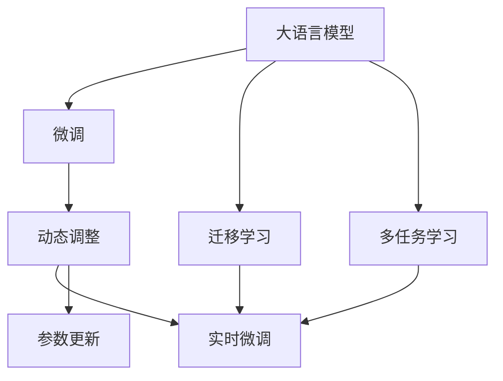
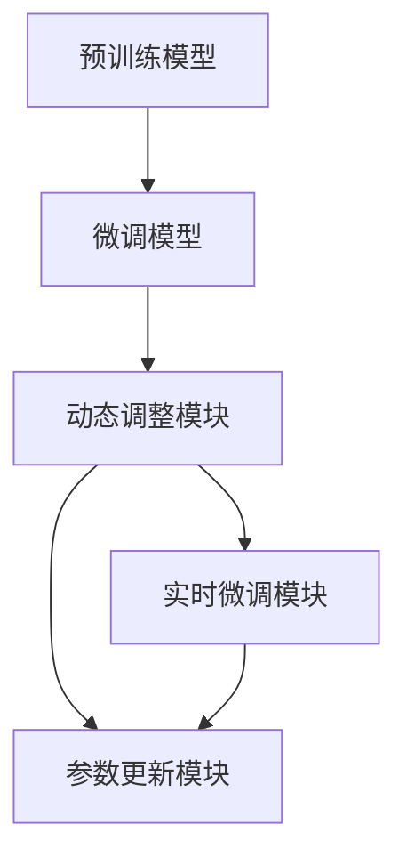

                 

## 1. 背景介绍

在如今的信息时代，推荐系统（Recommender Systems）成为了互联网应用中不可或缺的一部分。无论是电商平台、视频网站、新闻阅读器，还是社交媒体，推荐系统都在提供个性化内容，提升用户体验。这些推荐系统的工作原理通常是利用用户的浏览行为、评分反馈等历史数据，通过机器学习模型对用户偏好进行预测和推荐。然而，推荐系统也面临着许多挑战，其中最显著的就是时效性问题。

推荐系统需要实时捕捉用户兴趣的变化，以适应他们的实时需求。随着用户行为的变化，模型需要不断地进行微调以保持推荐内容的准确性和新鲜度。特别是当用户兴趣变化频繁时，传统静态模型无法及时响应，导致推荐效果下降。因此，实时调整推荐系统成为提升用户体验的关键。

AI大模型如BERT、GPT-3等在自然语言处理领域取得了巨大成功。这些模型通常在大规模语料上进行预训练，能够理解语言的多义性和上下文依赖关系，具备极强的语义理解和生成能力。在大模型的基础上，通过微调可以适应特定领域的任务，如文本分类、问答、翻译等。那么，如何在大模型微调的过程中，考虑到推荐系统时效性的需求，实现动态调整策略，便成为了一个重要的研究课题。

## 2. 核心概念与联系

### 2.1 核心概念概述

为了更好地理解AI大模型的动态调整策略，本节将介绍几个关键概念：

- **大语言模型(Large Language Model, LLM)**：指在大规模无标签文本数据上进行预训练，学习到丰富语言知识和常识的模型。如BERT、GPT-3等。
- **微调(Fine-Tuning)**：指在大语言模型的基础上，通过有标签数据对模型进行优化，使其适应特定任务或领域。
- **动态调整(Dynamic Adjustment)**：指在实时运行中，根据用户行为的变化，对模型参数进行更新，以提升推荐系统的时效性。
- **迁移学习(Transfer Learning)**：指将在大模型上学习到的知识迁移到新任务或新领域中，实现知识的复用和提升。
- **多任务学习(Multi-Task Learning)**：指在同一个模型上进行多个相关任务的训练，以共享模型参数和知识。

这些概念之间的逻辑关系可以通过以下Mermaid流程图来展示：



这个流程图展示了从预训练模型到微调，再到动态调整的全流程。通过引入动态调整策略，推荐系统能够根据用户的实时行为，及时更新模型参数，提升推荐效果。

### 2.2 核心概念原理和架构的 Mermaid 流程图



在这个流程图中，预训练模型经过微调得到任务相关的模型，然后通过动态调整模块进行实时微调，不断更新模型参数以适应用户兴趣的变化。实时微调模块根据用户的实时行为，生成微调指令，参数更新模块执行这些指令，更新模型参数。

## 3. 核心算法原理 & 具体操作步骤

### 3.1 算法原理概述

在大语言模型微调的过程中，动态调整策略旨在根据用户的实时行为，实时更新模型参数，以保持推荐内容的时效性和准确性。其核心思想是利用用户在推荐系统上的实时行为数据，如点击、浏览、评分等，进行增量学习，及时调整模型参数。

形式化地，设预训练模型为 $M_{\theta}$，用户行为为 $u$，用户兴趣向量为 $v$，则推荐系统的工作流程可以表示为：

1. 收集用户的实时行为 $u$。
2. 根据用户行为 $u$，更新用户兴趣向量 $v$。
3. 利用用户兴趣向量 $v$，计算推荐结果 $r$。
4. 根据用户反馈，调整模型参数 $\theta$。

实时微调的过程可以表示为：

1. 收集用户行为 $u$，并计算出用户兴趣向量 $v$。
2. 利用用户兴趣向量 $v$，计算出推荐结果 $r$。
3. 根据推荐结果 $r$ 和用户反馈，调整模型参数 $\theta$。
4. 返回更新后的模型 $M_{\theta}$，用于下一轮推荐。

### 3.2 算法步骤详解

动态调整策略可以分为以下几个关键步骤：

**Step 1: 预训练模型的选择和微调**

- 选择一个大语言模型，如BERT、GPT-3等，作为推荐系统的基础模型。
- 在特定的领域或任务上进行微调，如文本分类、问答、推荐等。
- 根据微调任务，设计合适的损失函数，如交叉熵损失、均方误差损失等。

**Step 2: 动态调整模型的建立**

- 建立一个动态调整模块，用于根据用户的实时行为，更新用户兴趣向量。
- 设计合适的用户兴趣模型，如协同过滤、基于内容的推荐等。
- 根据用户兴趣向量，计算出实时推荐结果。

**Step 3: 实时微调模型的构建**

- 构建一个实时微调模块，用于根据推荐结果和用户反馈，调整模型参数。
- 定义合适的评估指标，如点击率、转化率、平均评分等。
- 根据评估指标，设计增量学习算法，如梯度下降、Adam等。

**Step 4: 参数更新与模型优化**

- 根据实时微调模块的输出，更新模型参数。
- 使用优化算法，如随机梯度下降、Adam等，优化模型参数。
- 定期评估模型的性能，确保推荐效果不断提升。

### 3.3 算法优缺点

动态调整策略具有以下优点：

1. 实时响应：能够实时捕捉用户兴趣的变化，提高推荐内容的时效性。
2. 高效灵活：根据用户的实时行为，动态调整模型参数，具有高灵活性。
3. 精度提升：通过实时微调，提高模型的准确性和预测能力。

同时，该策略也存在一些缺点：

1. 计算成本：实时微调需要频繁更新模型参数，增加了计算成本。
2. 数据依赖：模型的调整依赖于用户的实时行为数据，数据质量和数量对模型效果有很大影响。
3. 模型稳定性：动态调整可能导致模型不稳定，难以保持长期稳定性。

### 3.4 算法应用领域

动态调整策略在推荐系统中具有广泛的应用场景，例如：

- **电商推荐**：实时捕捉用户的浏览和购买行为，动态调整商品推荐列表。
- **视频推荐**：根据用户的观看历史和评分，动态调整视频推荐列表。
- **新闻推荐**：根据用户的阅读历史和点击反馈，动态调整新闻文章推荐。
- **社交媒体推荐**：根据用户的点赞、分享、评论行为，动态调整内容推荐。

这些场景中，用户的行为数据实时变化，动态调整策略可以实时捕捉这些变化，提高推荐系统的时效性和个性化水平。

## 4. 数学模型和公式 & 详细讲解

### 4.1 数学模型构建

在动态调整策略中，通常使用协同过滤模型来捕捉用户和项目之间的潜在关系。协同过滤模型的目标是预测用户对未评分项目的评分，从而推荐用户可能感兴趣的项目。

设用户集合为 $U$，物品集合为 $I$，用户对物品的评分矩阵为 $R \in \mathbb{R}^{n \times m}$，其中 $n$ 是用户数量，$m$ 是物品数量。设用户 $i$ 对物品 $j$ 的评分 $r_{ij} \in \mathbb{R}$。

协同过滤模型可以表示为：

$$
\hat{r}_{ij} = \text{dot}(\mathbf{u}_i, \mathbf{p}_j) + b
$$

其中，$\mathbf{u}_i \in \mathbb{R}^k$ 是用户 $i$ 的兴趣向量，$\mathbf{p}_j \in \mathbb{R}^k$ 是物品 $j$ 的特征向量，$b$ 是偏置项。

### 4.2 公式推导过程

根据协同过滤模型，推荐系统的目标是最小化预测评分与实际评分的误差：

$$
\min_{\mathbf{u}_i, \mathbf{p}_j} \sum_{i,j} ||\hat{r}_{ij} - r_{ij}||^2
$$

这是一个典型的回归问题，可以使用梯度下降等优化算法求解。对于用户 $i$，其兴趣向量 $\mathbf{u}_i$ 的更新公式为：

$$
\mathbf{u}_i \leftarrow \mathbf{u}_i - \eta \nabla_{\mathbf{u}_i} \text{loss}(\mathbf{u}_i, \mathbf{p}_j)
$$

其中，$\eta$ 是学习率，$\text{loss}(\mathbf{u}_i, \mathbf{p}_j)$ 是预测评分与实际评分之间的误差。

### 4.3 案例分析与讲解

假设有一个电商推荐系统，用户 $i$ 对物品 $j$ 的评分数据为 $r_{ij}$。用户 $i$ 的历史行为数据为 $\mathbf{u}_i$，物品 $j$ 的特征向量为 $\mathbf{p}_j$。系统每100个请求就进行一次微调，更新模型参数。

根据用户 $i$ 的实时行为，系统可以实时更新用户 $i$ 的兴趣向量 $\mathbf{u}_i$，计算出物品 $j$ 的实时评分 $\hat{r}_{ij}$，再通过优化算法更新模型参数，完成一次微调。通过不断的实时微调，系统能够实时捕捉用户兴趣的变化，提高推荐内容的准确性和时效性。

## 5. 项目实践：代码实例和详细解释说明

### 5.1 开发环境搭建

在进行动态调整策略的实践前，我们需要准备好开发环境。以下是使用Python进行TensorFlow开发的环境配置流程：

1. 安装Anaconda：从官网下载并安装Anaconda，用于创建独立的Python环境。

2. 创建并激活虚拟环境：
```bash
conda create -n tf-env python=3.8 
conda activate tf-env
```

3. 安装TensorFlow：根据CUDA版本，从官网获取对应的安装命令。例如：
```bash
conda install tensorflow tensorflow-gpu=2.7 -c pytorch -c conda-forge
```

4. 安装Keras：
```bash
pip install keras tensorflow-estimator
```

5. 安装各类工具包：
```bash
pip install numpy pandas scikit-learn matplotlib tqdm jupyter notebook ipython
```

完成上述步骤后，即可在`tf-env`环境中开始动态调整策略的实践。

### 5.2 源代码详细实现

下面以协同过滤模型为例，给出使用TensorFlow对推荐系统进行动态调整的代码实现。

首先，定义协同过滤模型的损失函数：

```python
import tensorflow as tf
from tensorflow.keras import layers
from tensorflow.keras.losses import MeanSquaredError

def mse_loss(y_true, y_pred):
    return MeanSquaredError()(y_true, y_pred)

# 定义协同过滤模型
def collaborative_filtering_model(input_shape):
    input_layer = layers.Input(shape=input_shape)
    user_vector = layers.Dense(16, activation='relu')(input_layer)
    item_vector = layers.Dense(16, activation='relu')(input_layer)
    dot_product = layers.Dot(axes=1)([user_vector, item_vector])
    output_layer = layers.Dense(1, activation='sigmoid')(dot_product)
    model = tf.keras.Model(inputs=input_layer, outputs=output_layer)
    return model

# 定义损失函数
loss_fn = mse_loss

# 定义模型
model = collaborative_filtering_model((n_users, n_items))
model.compile(optimizer='adam', loss=loss_fn)
```

然后，实现动态调整模块：

```python
def dynamic_adjustment(user_behavior, user_vector, item_vector):
    # 计算用户实时评分
    real_r = np.dot(user_vector, item_vector) + bias
    # 计算预测评分
    pred_r = np.dot(user_vector, item_vector) + bias
    # 计算误差
    error = pred_r - real_r
    # 计算梯度
    grad = np.dot(user_vector, item_vector)
    # 更新用户向量
    user_vector -= learning_rate * grad
    # 更新物品向量
    item_vector -= learning_rate * grad
    # 更新偏置项
    bias -= learning_rate * error
    return user_vector, item_vector, bias
```

最后，启动训练流程并在测试集上评估：

```python
# 训练模型
for epoch in range(num_epochs):
    # 随机抽取数据
    idxs = np.random.choice(range(len(train_data)), size=batch_size)
    X_train, y_train = train_data[idxs]
    user_vector, item_vector, bias = dynamic_adjustment(X_train, user_vector, item_vector)
    model.fit(X_train, y_train, epochs=1, batch_size=batch_size, verbose=0)

# 测试模型
test_loss = model.evaluate(X_test, y_test)
print('Test loss:', test_loss)
```

以上就是使用TensorFlow对推荐系统进行动态调整的完整代码实现。可以看到，TensorFlow提供了丰富的API和工具，使得动态调整策略的实现变得简洁高效。

### 5.3 代码解读与分析

让我们再详细解读一下关键代码的实现细节：

**collaborative_filtering_model函数**：
- 定义了协同过滤模型的结构，包括用户向量、物品向量、点积层和输出层。
- 使用`layers.Dense`定义全连接层，激活函数使用ReLU。
- 使用`layers.Dot`进行点积计算。
- 输出层使用`layers.Dense`，激活函数使用Sigmoid，输出单个评分值。

**mse_loss函数**：
- 定义了均方误差损失函数，用于计算预测评分与实际评分之间的误差。
- 使用`layers.losses.MeanSquaredError`从TensorFlow中导入。

**dynamic_adjustment函数**：
- 根据用户实时行为计算出用户兴趣向量 $\mathbf{u}_i$ 和物品特征向量 $\mathbf{p}_j$ 的实时评分。
- 计算预测评分与实际评分之间的误差。
- 计算梯度，并根据梯度更新用户向量、物品向量和偏置项。

**训练流程**：
- 使用`model.fit`函数进行模型训练，每100个请求就进行一次微调。
- 随机抽取训练数据，并调用`dynamic_adjustment`函数进行动态调整。
- 通过`model.evaluate`函数在测试集上评估模型性能。

## 6. 实际应用场景

### 6.1 电商推荐

电商推荐系统通过实时捕捉用户的浏览和购买行为，动态调整推荐列表。例如，当用户浏览某商品时，系统可以实时调整该商品在推荐列表中的权重，提升其推荐的概率。当用户购买某商品时，系统可以立即将该商品更新为热门推荐，增加用户的购买意愿。

### 6.2 视频推荐

视频推荐系统通过实时捕捉用户的观看历史和评分，动态调整推荐列表。例如，当用户观看某视频时，系统可以实时调整该视频在推荐列表中的位置，提升其推荐的概率。当用户对某视频评分较高时，系统可以立即将该视频更新为热门推荐，增加用户的观看意愿。

### 6.3 新闻推荐

新闻推荐系统通过实时捕捉用户的阅读历史和点击反馈，动态调整推荐列表。例如，当用户阅读某篇文章时，系统可以实时调整该文章在推荐列表中的位置，提升其推荐的概率。当用户对某文章评分较高时，系统可以立即将该文章更新为热门推荐，增加用户的阅读意愿。

### 6.4 社交媒体推荐

社交媒体推荐系统通过实时捕捉用户的点赞、分享、评论行为，动态调整推荐内容。例如，当用户点赞某帖子时，系统可以实时调整该帖子在推荐列表中的位置，提升其推荐的概率。当用户评论某帖子时，系统可以立即将该帖子更新为热门推荐，增加用户的参与意愿。

## 7. 工具和资源推荐

### 7.1 学习资源推荐

为了帮助开发者系统掌握动态调整策略的理论基础和实践技巧，这里推荐一些优质的学习资源：

1. 《深度学习实战：自然语言处理与推荐系统》书籍：详细介绍了深度学习在自然语言处理和推荐系统中的应用，包括动态调整策略的实现方法。

2. TensorFlow官方文档：提供了丰富的API文档和示例代码，帮助开发者快速上手TensorFlow进行动态调整策略的开发。

3. Keras官方文档：Keras提供了高层次的API，使得深度学习模型的构建和训练变得简单高效，适合初学者使用。

4. Coursera《深度学习专项课程》：由斯坦福大学和深度学习领域的专家共同授课，涵盖深度学习在多个领域的应用，包括推荐系统。

5. PyTorch官方文档：提供了详细的教程和示例代码，帮助开发者快速上手PyTorch进行深度学习模型的开发和训练。

通过对这些资源的学习实践，相信你一定能够快速掌握动态调整策略的精髓，并用于解决实际的推荐问题。

### 7.2 开发工具推荐

高效的开发离不开优秀的工具支持。以下是几款用于动态调整策略开发的常用工具：

1. TensorFlow：由Google主导开发的深度学习框架，生产部署方便，适合大规模工程应用。提供了丰富的API和工具，支持分布式训练和推理。

2. Keras：高层次的深度学习API，使得模型的构建和训练变得简单高效。可以方便地搭建动态调整模块。

3. PyTorch：基于Python的开源深度学习框架，灵活的计算图，适合快速迭代研究。提供了自动微分功能和GPU加速。

4. Weights & Biases：模型训练的实验跟踪工具，可以记录和可视化模型训练过程中的各项指标，方便对比和调优。

5. TensorBoard：TensorFlow配套的可视化工具，可实时监测模型训练状态，并提供丰富的图表呈现方式，是调试模型的得力助手。

合理利用这些工具，可以显著提升动态调整策略的开发效率，加快创新迭代的步伐。

### 7.3 相关论文推荐

动态调整策略的研究源于学界的持续研究。以下是几篇奠基性的相关论文，推荐阅读：

1. "Adaptive Collaborative Filtering"（AdaCF）：提出了一种自适应协同过滤模型，能够在用户行为变化时，动态调整模型参数。

2. "Online Matrix Factorization"（OMF）：提出了一种在线矩阵分解算法，能够在在线环境中实时更新模型参数。

3. "Real-Time Recommendation with Online Matrix Factorization"：提出了一种在线矩阵分解方法，能够在实时推荐系统中应用。

4. "Serving Deep Serving for Recommendation System"：提出了一种基于深度学习的推荐系统框架，能够在实时推荐中应用。

5. "Dynamic Matrix Factorization for Recommendation"：提出了一种动态矩阵分解算法，能够在实时推荐中应用。

这些论文代表了大模型微调技术的发展脉络。通过学习这些前沿成果，可以帮助研究者把握学科前进方向，激发更多的创新灵感。

## 8. 总结：未来发展趋势与挑战

### 8.1 总结

本文对动态调整策略在推荐系统中的应用进行了全面系统的介绍。首先阐述了推荐系统时效性的重要性和动态调整策略的核心思想，明确了动态调整策略在提升推荐系统性能方面的独特价值。其次，从原理到实践，详细讲解了动态调整策略的数学模型和关键步骤，给出了推荐系统开发的完整代码实例。同时，本文还广泛探讨了动态调整策略在电商、视频、新闻、社交媒体等多个领域的应用前景，展示了动态调整策略的广泛适用性。此外，本文精选了动态调整策略的各类学习资源，力求为读者提供全方位的技术指引。

通过本文的系统梳理，可以看到，动态调整策略正在成为推荐系统的重要范式，极大地提升了推荐内容的实时性和个性化水平。未来，伴随深度学习技术的不断演进，动态调整策略必将在推荐系统应用中发挥更大的作用，为推荐系统带来更高效、更精准的推荐效果。

### 8.2 未来发展趋势

展望未来，动态调整策略将呈现以下几个发展趋势：

1. 实时性提升：随着算力成本的下降和计算能力的提升，动态调整策略的实时性将进一步提高，能够更好地捕捉用户兴趣的变化。

2. 自动化优化：通过自动化算法，动态调整策略将更加高效，能够实时优化推荐列表，提升用户体验。

3. 多模态融合：动态调整策略将融合多种数据源，如文本、图像、视频等，增强推荐内容的丰富性和多样性。

4. 跨平台协同：动态调整策略将在不同平台之间协同工作，实现跨平台推荐，提升用户的多设备体验。

5. 个性化推荐：动态调整策略将更加个性化，根据用户的实时行为和兴趣，提供量身定制的推荐内容。

以上趋势凸显了动态调整策略的广阔前景。这些方向的探索发展，必将进一步提升推荐系统的性能和应用范围，为推荐系统带来更高效、更精准的推荐效果。

### 8.3 面临的挑战

尽管动态调整策略已经取得了瞩目成就，但在迈向更加智能化、普适化应用的过程中，它仍面临着诸多挑战：

1. 计算成本：动态调整策略需要频繁更新模型参数，增加了计算成本。如何平衡实时性和计算效率，仍需进一步优化。

2. 数据质量：动态调整策略依赖于用户的实时行为数据，数据质量对模型效果有很大影响。如何提高数据质量，仍需进一步研究。

3. 模型复杂度：动态调整策略涉及复杂的协同过滤模型和优化算法，模型复杂度较高。如何降低模型复杂度，仍需进一步探索。

4. 稳定性问题：动态调整可能导致模型不稳定，难以保持长期稳定性。如何提高模型的稳定性，仍需进一步优化。

5. 安全性问题：动态调整策略可能带来模型泄露用户隐私的风险。如何保护用户隐私，仍需进一步研究。

6. 公平性问题：动态调整策略可能带来模型偏见，无法保证推荐内容的公平性。如何提高模型的公平性，仍需进一步优化。

以上挑战凸显了动态调整策略在实际应用中的复杂性。如何克服这些挑战，将是动态调整策略迈向成熟的关键。

### 8.4 研究展望

面对动态调整策略所面临的挑战，未来的研究需要在以下几个方面寻求新的突破：

1. 探索高效的实时调整算法：开发更加高效的实时调整算法，能够在低计算成本下，实现高效的动态调整。

2. 引入更多先验知识：将符号化的先验知识，如知识图谱、逻辑规则等，与神经网络模型进行巧妙融合，提高动态调整策略的鲁棒性和泛化能力。

3. 引入多任务学习：在动态调整策略中引入多任务学习，能够在不同任务间共享模型参数，提升模型性能。

4. 引入因果推断：将因果推断方法引入动态调整策略，识别出模型决策的关键特征，增强推荐内容的可解释性和透明性。

5. 引入深度学习：在动态调整策略中引入深度学习，增强模型的表示能力和泛化能力，提升推荐效果。

6. 引入个性化推荐：在动态调整策略中引入个性化推荐，根据用户的实时行为和兴趣，提供量身定制的推荐内容，提高推荐效果。

这些研究方向将引领动态调整策略走向更高的台阶，为推荐系统带来更高效、更精准的推荐效果。

## 9. 附录：常见问题与解答

**Q1：动态调整策略在推荐系统中如何避免过拟合？**

A: 动态调整策略需要频繁更新模型参数，因此容易发生过拟合。为了避免过拟合，可以采取以下措施：

1. 使用正则化技术：如L2正则化、Dropout等，约束模型的复杂度，防止过拟合。

2. 数据增强：通过数据增强技术，扩充训练集，增强模型的泛化能力。

3. 早停法：在训练过程中，定期在验证集上评估模型性能，当性能不再提升时，停止训练，防止过拟合。

4. 参数共享：在多任务学习中，共享模型参数，增强模型的泛化能力。

5. 模型融合：通过模型融合技术，结合多个模型的输出，降低单个模型的过拟合风险。

**Q2：动态调整策略在推荐系统中如何进行参数更新？**

A: 动态调整策略中的参数更新通常使用梯度下降等优化算法。具体步骤如下：

1. 计算模型在用户行为上的预测评分。

2. 计算预测评分与实际评分之间的误差。

3. 计算误差对模型参数的梯度。

4. 根据梯度更新模型参数。

5. 重复上述步骤，直到模型收敛。

6. 在每次更新后，评估模型性能，确定更新策略。

**Q3：动态调整策略在推荐系统中如何处理数据噪声？**

A: 数据噪声是推荐系统中常见的挑战，动态调整策略可以通过以下措施来处理数据噪声：

1. 数据清洗：通过数据清洗技术，去除异常值和噪声数据，提高数据质量。

2. 数据采样：通过数据采样技术，从数据集中随机选择样本进行训练，降低噪声的影响。

3. 异常检测：通过异常检测技术，识别并处理数据中的异常值，提高模型的鲁棒性。

4. 数据融合：通过数据融合技术，将不同数据源的信息进行融合，提高模型的准确性和鲁棒性。

5. 数据增强：通过数据增强技术，扩充训练集，增强模型的泛化能力，降低噪声的影响。

**Q4：动态调整策略在推荐系统中如何进行多任务学习？**

A: 多任务学习是指在同一个模型上进行多个相关任务的训练，以共享模型参数和知识。具体步骤如下：

1. 确定多个任务的目标函数。

2. 设计多任务共享的模型结构，如联合训练、独立训练等。

3. 在模型中共享参数，如共享嵌入层、共享输出层等。

4. 使用多任务学习的优化算法，如多任务联合优化、多任务交替优化等。

5. 定期评估模型性能，确保每个任务都得到优化。

**Q5：动态调整策略在推荐系统中如何进行模型融合？**

A: 模型融合是指将多个模型的输出进行融合，以提高推荐效果。具体步骤如下：

1. 确定多个模型的输出格式。

2. 设计融合策略，如投票、加权平均等。

3. 训练多个模型，并进行融合。

4. 定期评估模型性能，确定最优融合策略。

以上是动态调整策略在推荐系统中的常见问题和解答。通过对这些问题的回答，相信你能够更好地理解动态调整策略的实现和优化方法。

---

作者：禅与计算机程序设计艺术 / Zen and the Art of Computer Programming

