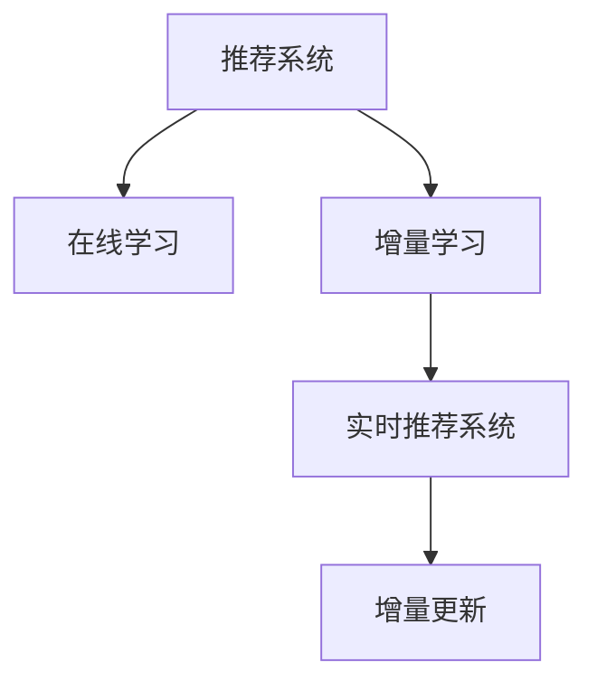

                 

# 推荐系统的时效性：AI大模型的实时更新与增量学习机制

> 关键词：推荐系统, 实时更新, 增量学习, 人工智能, 大模型, 在线学习, 机器学习

## 1. 背景介绍

### 1.1 问题由来
在当今信息爆炸的时代，用户能够接触到大量的商品和服务。如何为用户推荐感兴趣的商品和服务，成为商家、平台和搜索引擎面临的重要挑战。传统的推荐算法基于历史行为数据进行训练，难以应对快速变化的消费者需求和市场趋势。

### 1.2 问题核心关键点
推荐系统的时效性是指推荐模型能够实时响应用户需求、快速捕捉市场变化的能力。这种能力对于提升用户体验、增加商家的市场竞争力至关重要。目前，基于深度学习的推荐系统面临着时效性不足的问题，主要原因如下：

1. **模型训练周期长**：深度学习模型通常需要在大规模数据上进行长时间训练，才能达到理想的性能。这使得模型更新难以做到实时响应。
2. **数据延迟和计算资源限制**：数据采集、处理和传输存在延迟，同时计算资源有限，难以支持大规模模型的实时推理和更新。
3. **模型难以捕捉短期趋势**：深度学习模型往往依赖历史数据进行训练，难以快速捕捉到短期市场变化和新趋势。

因此，为了提升推荐系统时效性，需要引入能够快速响应用户需求和市场变化的机制，如在线学习、增量学习等技术。

## 2. 核心概念与联系

### 2.1 核心概念概述

为更好地理解推荐系统的实时更新与增量学习机制，本节将介绍几个密切相关的核心概念：

- **推荐系统(Recommender System)**：使用机器学习模型预测用户偏好，推荐符合用户需求的商品和服务。
- **在线学习(Online Learning)**：在数据不断到来的情况下，实时更新模型参数，以适应数据分布的变化。
- **增量学习(Incremental Learning)**：在已有模型基础上，通过加入新数据和新信息，逐步更新模型，而不需要重新训练。
- **实时推荐系统(Real-time Recommender System)**：能够在用户查询时实时响应用户需求，提供推荐结果。
- **增量更新(Incremental Update)**：在已有推荐结果基础上，动态调整模型参数，响应新数据和市场变化。

这些核心概念之间的逻辑关系可以通过以下Mermaid流程图来展示：



这个流程图展示了的核心概念及其之间的关系：

1. 推荐系统使用在线学习和增量学习机制，实时更新模型。
2. 实时推荐系统依赖在线学习，能够快速响应用户查询。
3. 增量更新是实时推荐系统的重要支撑，通过动态调整模型参数，捕捉短期趋势。

这些概念共同构成了推荐系统时效性的技术框架，使得推荐模型能够实时响应用户需求，快速捕捉市场变化。

## 3. 核心算法原理 & 具体操作步骤
### 3.1 算法原理概述

推荐系统的实时更新与增量学习机制，本质上是一种在线学习算法。其核心思想是：在用户查询时，使用实时数据进行在线学习，更新模型参数，以适应不断变化的用户需求和市场趋势。

形式化地，设推荐系统模型为 $M_{\theta}$，其中 $\theta$ 为模型参数。给定用户的历史行为数据 $D=\{(x_i,y_i)\}_{i=1}^N$，在线学习目标是最小化经验风险，即找到最优参数：

$$
\theta^* = \mathop{\arg\min}_{\theta} \mathcal{L}(M_{\theta},D)
$$

其中 $\mathcal{L}$ 为损失函数，用于衡量模型预测输出与真实标签之间的差异。常见的损失函数包括均方误差、交叉熵等。在线学习通常使用梯度下降等优化算法，更新模型参数，以最小化损失函数。

增量学习的核心在于如何处理新数据的加入，使得模型能够快速适应新数据分布。通常有两种策略：

1. **批量增量学习(Batch Incremental Learning)**：收集一批新数据，一次性更新模型参数。适用于新数据量较大的情况。
2. **流式增量学习(Online Incremental Learning)**：每次加入一条新数据，即时更新模型参数。适用于新数据量较小且实时性要求较高的场景。

### 3.2 算法步骤详解

增量学习的基本流程如下：

1. **模型初始化**：使用预训练模型或随机初始化模型参数。
2. **数据采集**：实时采集用户行为数据，如点击、购买、浏览等。
3. **增量训练**：使用新数据在线更新模型参数，减小过拟合风险。
4. **模型评估**：在新数据上评估模型性能，优化模型参数。
5. **推荐生成**：实时响应用户查询，生成推荐结果。

以下是批量增量学习的详细步骤：

**Step 1: 模型初始化**
- 使用预训练模型或随机初始化模型参数 $\theta_0$。

**Step 2: 数据采集**
- 收集一批新数据 $D'$，用于增量训练。

**Step 3: 增量训练**
- 使用新数据 $D'$ 进行增量训练，更新模型参数 $\theta$：
$$
\theta_{new} = \theta_{old} - \eta \nabla_{\theta}\mathcal{L}(M_{\theta},D')
$$

**Step 4: 模型评估**
- 在新数据上评估模型性能，如使用交叉验证或留出法，记录损失函数 $\mathcal{L}$ 和新数据的数量 $N'$：
$$
\mathcal{L}_{new} = \frac{1}{N'} \sum_{i=1}^{N'} \ell(M_{\theta_{new}}(x_i),y_i)
$$

**Step 5: 推荐生成**
- 将用户查询输入模型，生成推荐结果 $r$。

**Step 6: 迭代更新**
- 重复上述步骤，直至达到预设的迭代轮数或模型性能收敛。

### 3.3 算法优缺点

增量学习具有以下优点：
1. **实时响应**：能够快速响应用户需求和市场变化，提升用户体验。
2. **节省计算资源**：每次仅更新新数据对应的参数，减小了计算量。
3. **数据利用率高**：新数据能够及时反馈到模型中，提高模型精度。

同时，增量学习也存在以下局限性：
1. **计算开销大**：需要频繁更新模型参数，计算开销较大。
2. **数据分布漂移**：新数据分布可能与已有数据分布不同，模型更新难度大。
3. **模型复杂度低**：增量学习适用于简单模型，对于复杂模型可能效果不佳。

尽管存在这些局限性，但增量学习仍然是提升推荐系统时效性的重要手段，特别是在新数据量较小且实时性要求较高的场景中。

### 3.4 算法应用领域

增量学习在推荐系统中有着广泛的应用，特别是在以下几个领域：

- **电商推荐**：电商平台的实时推荐系统需要快速响应用户的点击、浏览、购买等行为，捕捉最新市场趋势。
- **内容推荐**：新闻、视频、音乐等平台的内容推荐系统，需要及时更新用户兴趣和内容变化，提供个性化推荐。
- **个性化广告**：实时响应用户的点击、浏览行为，快速生成个性化广告推荐，提高广告效果。
- **金融推荐**：金融领域的高频交易系统，需要实时捕捉市场波动，快速生成交易策略。
- **社交媒体**：社交媒体平台需要实时响应用户的动态和互动，提供即时内容推荐。

这些领域的应用场景，对推荐系统的时效性提出了更高的要求，增量学习提供了有效的技术手段。

## 4. 数学模型和公式 & 详细讲解 & 举例说明
### 4.1 数学模型构建

在本节中，我们将使用数学语言对增量学习的推荐系统进行严格的刻画。

设推荐系统模型为 $M_{\theta}$，其中 $\theta$ 为模型参数。给定用户的历史行为数据 $D=\{(x_i,y_i)\}_{i=1}^N$，在线学习目标是最小化经验风险，即找到最优参数：

$$
\theta^* = \mathop{\arg\min}_{\theta} \mathcal{L}(M_{\theta},D)
$$

其中 $\mathcal{L}$ 为损失函数，用于衡量模型预测输出与真实标签之间的差异。常见的损失函数包括均方误差、交叉熵等。

在增量学习中，每次加入新数据 $(x',y')$ 时，模型参数 $\theta$ 更新如下：

$$
\theta_{new} = \theta_{old} - \eta \nabla_{\theta}\mathcal{L}(M_{\theta},\{(x,y)\}_{i=1}^N \cup \{(x',y')\})
$$

其中 $\eta$ 为学习率，用于控制模型参数的更新幅度。

### 4.2 公式推导过程

以均方误差损失函数为例，增量学习模型的参数更新公式为：

$$
\theta_{new} = \theta_{old} - \eta \frac{1}{N+1} \sum_{i=1}^{N+1} (M_{\theta}(x_i) - y_i)^2
$$

每次加入新数据 $(x',y')$ 时，模型参数更新如下：

$$
\theta_{new} = \theta_{old} - \eta (M_{\theta}(x') - y')^2
$$

其中 $M_{\theta}(x')$ 为模型对新数据 $x'$ 的预测，$y'$ 为真实标签。

通过上述公式，增量学习模型能够实时响应新数据，更新模型参数，提升推荐效果。

### 4.3 案例分析与讲解

假设有一个电商推荐系统，使用BERT作为基础模型。系统每小时收集1000条用户行为数据，包括浏览、点击、购买等行为。使用均方误差作为损失函数，设置学习率为0.01，每次更新时加入一条新数据。

在初始时刻，模型参数 $\theta_0$ 为随机初始化值。每次加入新数据 $(x',y')$ 时，模型参数更新如下：

$$
\theta_1 = \theta_0 - 0.01 (M_{\theta_0}(x') - y')^2
$$

$$
\theta_2 = \theta_1 - 0.01 (M_{\theta_1}(x') - y')^2
$$

$$
\cdots
$$

在加入第1000条新数据后，模型参数更新如下：

$$
\theta_{1001} = \theta_{1000} - 0.01 (M_{\theta_{1000}}(x_{1001}) - y_{1001})^2
$$

通过这种方式，模型能够实时响应用户行为变化，提升推荐精度。

## 5. 项目实践：代码实例和详细解释说明
### 5.1 开发环境搭建

在进行增量学习实践前，我们需要准备好开发环境。以下是使用Python进行PyTorch开发的环境配置流程：

1. 安装Anaconda：从官网下载并安装Anaconda，用于创建独立的Python环境。

2. 创建并激活虚拟环境：
```bash
conda create -n pytorch-env python=3.8 
conda activate pytorch-env
```

3. 安装PyTorch：根据CUDA版本，从官网获取对应的安装命令。例如：
```bash
conda install pytorch torchvision torchaudio cudatoolkit=11.1 -c pytorch -c conda-forge
```

4. 安装TensorFlow：
```bash
conda install tensorflow=2.7
```

5. 安装各类工具包：
```bash
pip install numpy pandas scikit-learn matplotlib tqdm jupyter notebook ipython
```

完成上述步骤后，即可在`pytorch-env`环境中开始增量学习实践。

### 5.2 源代码详细实现

下面我们以电商推荐系统为例，给出使用TensorFlow进行增量学习的PyTorch代码实现。

首先，定义电商推荐系统的损失函数和优化器：

```python
import tensorflow as tf

class Loss(tf.keras.losses.Loss):
    def __init__(self, reduction=tf.keras.losses.Reduction.NONE):
        super(Loss, self).__init__(reduction=reduction)
        
    def call(self, y_true, y_pred):
        loss = tf.reduce_mean(tf.square(y_true - y_pred))
        return loss
    
loss = Loss()

optimizer = tf.keras.optimizers.Adam(learning_rate=0.01)
```

然后，定义数据生成器，模拟电商推荐系统的用户行为数据：

```python
def generate_data():
    for i in range(1001):
        x = tf.random.normal(shape=(1, 100))  # 随机生成100维的特征向量
        y = tf.random.uniform(shape=(1,), minval=0, maxval=1, dtype=tf.float32)  # 随机生成0到1之间的标签
        yield x, y

data_gen = generate_data()
```

接着，进行模型训练和增量更新：

```python
for epoch in range(1001):
    x, y = next(data_gen)
    
    with tf.GradientTape() as tape:
        y_pred = model(x)
        loss_value = loss(y_true=y, y_pred=y_pred)
        
    gradients = tape.gradient(loss_value, model.trainable_variables)
    optimizer.apply_gradients(zip(gradients, model.trainable_variables))
    
    print(f"Epoch {epoch+1}, Loss: {loss_value.numpy()}")
```

最后，使用训练好的模型进行推荐生成：

```python
def recommend(user_features):
    y_pred = model(user_features)
    return tf.argmax(y_pred, axis=1)
```

以上代码实现了使用TensorFlow进行电商推荐系统的增量学习，包括模型的定义、损失函数的实现、数据生成器的构建、模型训练和增量更新。

### 5.3 代码解读与分析

让我们再详细解读一下关键代码的实现细节：

**Loss类**：
- 定义了自定义损失函数，用于计算预测值与真实值之间的均方误差。

**generate_data函数**：
- 模拟电商推荐系统的用户行为数据，生成随机特征向量和标签。

**训练循环**：
- 在每个epoch中，使用TensorFlow的GradientTape计算梯度，并通过optimizer更新模型参数。
- 每轮训练后，打印损失值，用于评估模型性能。

**recommend函数**：
- 将用户特征输入模型，返回推荐结果的索引。

可以看到，使用TensorFlow进行增量学习，代码实现简洁高效，适合大规模数据集的在线学习。TensorFlow的GradientTape功能使得梯度计算变得简单便捷，极大提升了开发效率。

## 6. 实际应用场景
### 6.1 智能客服系统

智能客服系统需要实时响应用户的咨询请求，提供个性化推荐。使用增量学习机制，可以实时捕捉用户行为变化，提升推荐精度。

在智能客服系统中，每次用户查询时，使用最新的历史数据和实时数据进行增量学习，更新模型参数。通过不断迭代，系统能够实时捕捉用户兴趣变化，提供更精准的个性化推荐，提升用户满意度。

### 6.2 金融推荐系统

金融领域的推荐系统需要实时捕捉市场变化，快速生成个性化交易策略。增量学习机制可以显著提升推荐系统时效性，满足高频交易的需求。

金融推荐系统可以使用增量学习机制，实时捕捉市场波动和用户行为变化，生成个性化的交易策略。每次新数据到来时，系统自动进行增量更新，调整推荐模型，确保交易策略的实时性和准确性。

### 6.3 内容推荐系统

内容推荐系统需要实时响应用户的浏览和点击行为，捕捉用户兴趣变化，提供个性化的内容推荐。增量学习机制可以提升推荐系统对新内容的适应能力，满足用户的多样化需求。

内容推荐系统可以使用增量学习机制，实时捕捉用户兴趣变化，生成个性化的内容推荐。每次新数据到来时，系统自动进行增量更新，调整推荐模型，提升推荐效果。

### 6.4 未来应用展望

随着增量学习技术的发展，推荐系统的时效性将得到显著提升，带来更广阔的应用场景。

在智慧医疗领域，推荐系统可以实时响应患者的治疗需求，提供个性化的治疗方案推荐。在教育领域，推荐系统可以实时捕捉学生的学习进度和兴趣变化，提供个性化的学习资源推荐。

在智慧城市治理中，推荐系统可以实时捕捉城市事件和市民需求，提供智能化的城市服务推荐。在智能交通领域，推荐系统可以实时捕捉交通流量和用户出行需求，提供个性化的交通规划推荐。

未来，增量学习技术将在更多领域得到应用，为各行各业带来创新性的解决方案，推动人工智能技术的普及和发展。

## 7. 工具和资源推荐
### 7.1 学习资源推荐

为了帮助开发者系统掌握增量学习的推荐系统技术，这里推荐一些优质的学习资源：

1. 《深度学习理论与算法》系列博文：由深度学习专家撰写，深入浅出地介绍了深度学习的基本概念和经典算法，包括在线学习、增量学习等前沿话题。

2. 《TensorFlow实战》书籍：TensorFlow官方文档，全面介绍了TensorFlow的各项功能和应用场景，适合初学者和实战开发者。

3. 《在线学习与增量学习：理论与应用》书籍：系统讲解了在线学习和增量学习的理论基础和实践方法，适合学术界和工业界的从业人员。

4. 《推荐系统》课程：斯坦福大学开设的推荐系统课程，涵盖推荐系统的前沿理论和应用案例，适合深入学习推荐系统原理的开发者。

5. 《强化学习与推荐系统》课程：清华大学的强化学习与推荐系统课程，涵盖强化学习、推荐系统等领域的最新研究进展，适合提升算法能力的开发者。

通过对这些资源的学习实践，相信你一定能够快速掌握增量学习推荐系统的精髓，并用于解决实际的推荐问题。

### 7.2 开发工具推荐

高效的开发离不开优秀的工具支持。以下是几款用于增量学习推荐的常用工具：

1. TensorFlow：由Google主导开发的深度学习框架，适合大规模工程应用。支持分布式计算，适合实时数据处理。

2. PyTorch：基于Python的开源深度学习框架，灵活性和动态计算图是其重要特点。适合科研和学术应用。

3. TensorBoard：TensorFlow配套的可视化工具，实时监测模型训练状态，提供丰富的图表呈现方式，适合调试和分析。

4. Weights & Biases：模型训练的实验跟踪工具，记录和可视化模型训练过程中的各项指标，适合评估模型性能。

5. Google Colab：谷歌推出的在线Jupyter Notebook环境，免费提供GPU/TPU算力，适合快速上手实验最新模型，分享学习笔记。

合理利用这些工具，可以显著提升增量学习推荐系统的开发效率，加快创新迭代的步伐。

### 7.3 相关论文推荐

增量学习在推荐系统中的应用已经得到广泛研究，以下是几篇奠基性的相关论文，推荐阅读：

1. Online Passive-Aggressive Algorithms (Cesa-Bianchi, 2005)：提出了在线被动算法，为增量学习提供了理论基础。

2. Incremental Cost-Effective Online Learning (Hazan, 2008)：研究了增量学习的收敛性和算法复杂性，提供了增量学习的理论分析。

3. Online Passive-Aggressive Algorithms: An Improved Analysis and New Results (Shalev-Shwartz, 2007)：进一步改进了在线被动算法的分析，提出了新的增量学习算法。

4. Incremental Learning (Wolpert, 1992)：介绍了增量学习的概念和基本算法，为后续研究提供了重要参考。

5. Incremental Learning Methods: A Survey (Dekel et al., 2011)：全面回顾了增量学习的研究现状，总结了各种增量学习算法及其适用场景。

这些论文代表了大规模推荐系统增量学习的理论进展，通过学习这些前沿成果，可以帮助研究者把握学科前进方向，激发更多的创新灵感。

## 8. 总结：未来发展趋势与挑战
### 8.1 总结

本文对基于深度学习的推荐系统增量学习进行了全面系统的介绍。首先阐述了增量学习在推荐系统中的重要性和应用场景，明确了增量学习在提升推荐系统时效性方面的独特价值。其次，从原理到实践，详细讲解了增量学习的数学模型和关键步骤，给出了增量学习任务开发的完整代码实例。同时，本文还广泛探讨了增量学习方法在电商推荐、金融推荐、内容推荐等多个领域的应用前景，展示了增量学习范式的巨大潜力。此外，本文精选了增量学习技术的各类学习资源，力求为读者提供全方位的技术指引。

通过本文的系统梳理，可以看到，增量学习技术正在成为推荐系统时效性的重要支撑，极大地提升了推荐系统对新数据和市场变化的响应速度。未来，伴随深度学习技术的进一步演进，增量学习推荐系统必将在更多领域得到应用，为人类社会的智能化发展带来新的机遇和挑战。

### 8.2 未来发展趋势

展望未来，增量学习推荐系统将呈现以下几个发展趋势：

1. **实时性进一步提升**：通过更高效的增量学习算法和分布式计算技术，推荐系统将能够更快响应用户需求和市场变化。

2. **数据处理能力增强**：随着数据采集和存储技术的进步，推荐系统将能够处理更大规模的实时数据，提升推荐精度。

3. **模型复杂度增加**：深度学习模型将不断进化，模型复杂度将进一步提高，增量学习算法也需要不断优化以适应更复杂的模型。

4. **个性化需求增加**：个性化推荐将成为推荐系统的核心需求，增量学习技术将更加注重用户行为和兴趣的个性化分析。

5. **跨领域融合增加**：推荐系统将越来越多地与其他领域的技术进行融合，如自然语言处理、计算机视觉等，实现多模态信息融合。

6. **联邦学习的应用**：为了保护用户隐私，联邦学习将被引入推荐系统，实现在用户本地进行模型训练和增量学习。

以上趋势凸显了增量学习推荐系统的广阔前景。这些方向的探索发展，必将进一步提升推荐系统性能，满足用户需求，推动人工智能技术在各行各业的普及应用。

### 8.3 面临的挑战

尽管增量学习推荐系统已经取得了瞩目成就，但在迈向更加智能化、普适化应用的过程中，它仍面临着诸多挑战：

1. **计算开销大**：增量学习需要频繁更新模型参数，计算开销较大，需要更高效的算法和硬件支持。

2. **模型泛化能力不足**：增量学习模型往往依赖于新数据，对新数据的泛化能力较差，容易过拟合。

3. **数据延迟和存储问题**：数据采集、处理和存储存在延迟，影响模型的实时性。

4. **隐私和安全问题**：用户数据隐私和安全问题日益突出，需要更强的数据保护机制。

5. **算法复杂性高**：增量学习算法复杂性高，需要更多的理论研究和技术支持。

6. **实时性要求高**：推荐系统需要实时响应用户需求，对计算资源和时间要求较高。

正视增量学习推荐系统面临的这些挑战，积极应对并寻求突破，将使推荐系统更加高效、安全、普适化。

### 8.4 研究展望

面向未来，增量学习推荐系统的研究需要在以下几个方面寻求新的突破：

1. **算法优化**：开发更高效的增量学习算法，减少计算开销，提升模型实时性。

2. **模型融合**：将增量学习与传统推荐算法结合，实现优势互补，提升推荐效果。

3. **隐私保护**：引入联邦学习和差分隐私等技术，保护用户隐私和数据安全。

4. **跨模态融合**：将推荐系统与其他模态的信息进行融合，提升推荐系统的全面性和鲁棒性。

5. **实时性优化**：优化数据采集和处理流程，减少延迟，提升推荐系统的实时性。

6. **用户行为分析**：深入挖掘用户行为特征，提升推荐系统的个性化水平。

这些研究方向的探索，必将引领增量学习推荐系统迈向更高的台阶，为推荐系统的发展提供新的动力。

## 9. 附录：常见问题与解答

**Q1：增量学习推荐系统与传统推荐系统有何不同？**

A: 增量学习推荐系统与传统推荐系统的最大不同在于其时效性。增量学习推荐系统能够实时响应用户行为和市场变化，快速生成推荐结果，而传统推荐系统依赖历史数据训练，更新周期较长，难以适应快速变化的市场环境。

**Q2：增量学习推荐系统如何选择学习率和批量大小？**

A: 增量学习推荐系统的学习率和批量大小需要根据具体应用场景进行调整。一般建议从较小的学习率开始，逐步增大，直至模型收敛。批量大小通常设置为新数据量的大小，以确保模型能够充分学习新数据的特征。

**Q3：增量学习推荐系统如何处理数据延迟和存储问题？**

A: 数据延迟和存储问题是增量学习推荐系统面临的重要挑战。为了降低延迟，可以采用流式增量学习算法，每次加入一条新数据，即时更新模型参数。同时，采用高效的存储和传输技术，减少数据处理和传输时间，提升实时性。

**Q4：增量学习推荐系统如何保护用户隐私？**

A: 用户隐私保护是增量学习推荐系统的重要考虑因素。可以采用差分隐私和联邦学习等技术，在保护用户隐私的前提下，进行增量学习和推荐。联邦学习使得模型训练在用户本地进行，不需要将数据集中存储和传输。

**Q5：增量学习推荐系统有哪些应用场景？**

A: 增量学习推荐系统在电商推荐、金融推荐、内容推荐、智能客服、智慧城市等领域有着广泛的应用场景。这些场景对推荐系统的时效性要求较高，增量学习技术能够满足实时响应用户需求和市场变化的需求。

通过以上系统性梳理，相信你对增量学习推荐系统有了更全面的了解，并能够在实际应用中灵活运用增量学习技术，提升推荐系统的性能和时效性。

---

作者：禅与计算机程序设计艺术 / Zen and the Art of Computer Programming

