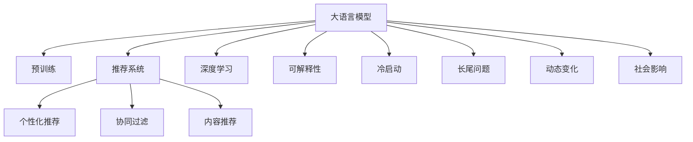

                 

# 推荐系统的未来发展趋势：大模型的主导作用

## 1. 背景介绍

随着互联网的迅猛发展，推荐系统已成为电商、社交、视频等众多领域用户服务不可或缺的一部分。而推荐系统背后，驱动其高效运行的核心引擎，正是精准的用户行为建模和个性化推荐算法。

推荐算法主要分为基于协同过滤和基于内容推荐的两种方式。基于协同过滤的方法，通过挖掘用户行为间的关联性，推荐与其他用户行为相似的内容；而基于内容推荐则依赖物品的属性特征，通过相似性匹配推荐内容。然而，无论是协同过滤还是内容推荐，都面临着数据稀疏、特征缺失等问题，难以有效覆盖长尾内容，限制了推荐系统的表现力。

随着深度学习技术的成熟，基于深度神经网络的推荐系统应运而生。这类系统通过学习用户与物品间的多维度特征，能够提升推荐的精度和多样性，缓解了传统推荐算法的诸多问题。然而，这类系统往往需要大量高维稀疏数据进行训练，随着数据量的增大，计算量和存储量呈现指数级增长，极大地提高了算法的复杂度。

在此背景下，大语言模型（Large Language Models, LLMs）因其海量参数规模、强大泛化能力和大规模数据驱动的特性，逐渐进入推荐系统的研究视野，成为解决推荐系统问题的新宠。本文将从大语言模型在大推荐系统中的应用，探讨其未来发展的趋势和挑战。

## 2. 核心概念与联系

### 2.1 核心概念概述

为更好理解大语言模型在推荐系统中的应用，本文将介绍几个核心概念：

- 大语言模型（LLMs）：指以自回归（如GPT）或自编码（如BERT）等架构为代表的大规模预训练语言模型。通过在海量无标签文本数据上进行预训练，LLMs能够学习到复杂的语言表示，具备强大的语言理解和生成能力。

- 预训练（Pre-training）：指在大规模无标签文本数据上，通过自监督学习任务训练通用语言模型的过程。常见的预训练任务包括掩码语言模型、Next Sentence Prediction等。预训练使得模型学习到语言的通用表示。

- 推荐系统（Recommender System）：通过分析用户历史行为，推荐可能感兴趣的商品、内容或服务。推荐系统分为基于协同过滤和基于内容推荐两种主要方式。

- 个性化推荐（Personalized Recommendation）：根据用户个性化特征，推荐其可能感兴趣的内容，以提高用户满意度和留存率。

- 深度学习（Deep Learning）：基于多层神经网络进行特征学习的方法，常用于提高推荐系统的准确性。

- 可解释性（Explainability）：推荐系统的输出应当可解释，帮助用户理解推荐理由，增强系统可信度。

- 冷启动（Cold-Start）：对于新用户或新物品，推荐系统如何通过其他用户或物品行为来推荐相似内容。

- 长尾问题（Long-Tail Problem）：用户对长尾内容的需求虽然稀疏，但总量非常可观，如何有效推荐长尾内容成为推荐系统的重要挑战。

- 动态变化（Dynamic Change）：用户兴趣和物品特性会随时间变化，推荐系统如何适应这种变化。

- 社会影响（Social Influence）：用户的社交关系和群体行为对推荐结果的影响。

以上概念之间的关系可以通过以下Mermaid流程图展示：



该图展示了LLMs与推荐系统的多个关键概念之间的联系，预训练-微调后的LLMs可以广泛应用于推荐系统的各个环节，提高其性能。

### 2.2 核心概念原理和架构

#### 2.2.1 大语言模型的预训练原理

大语言模型的预训练过程通常包含自监督学习任务，如语言建模、掩码语言建模（Masked Language Modeling, MLM）、Next Sentence Prediction等。以BERT为例，其预训练过程主要分为以下步骤：

1. 数据准备：从大规模无标签文本中抽样生成掩码语言模型和下一句预测任务的数据集。

2. 模型构建：搭建Transformer模型，其中包含多个自注意力层（Self-Attention Layers）和全连接层（Fully-Connected Layers）。

3. 目标函数：设计损失函数，如掩码语言模型的交叉熵损失（MLM Loss）和下一句预测任务的二元交叉熵损失（NSP Loss）。

4. 模型训练：使用大规模分布式GPU集群，以小批量梯度下降法进行优化，训练一定时间后停止预训练。

5. 模型保存：保存预训练好的模型参数，以便于后续微调。

#### 2.2.2 推荐系统的核心架构

推荐系统的核心架构包括用户行为分析、物品特征提取、推荐模型训练和推荐结果输出等环节。其中，用户行为和物品特征的表示，是推荐系统能否成功的关键。以基于内容的推荐系统为例，其核心架构如下：

1. 用户行为分析：从用户的历史行为中提取特征，如浏览记录、购买历史、评分等。

2. 物品特征提取：从物品的描述、标签、属性等提取特征，供推荐模型使用。

3. 推荐模型训练：使用用户行为和物品特征，训练推荐模型，通常采用深度神经网络。

4. 推荐结果输出：根据用户特征和物品特征，通过推荐模型预测用户可能感兴趣的物品，输出推荐结果。

## 3. 核心算法原理 & 具体操作步骤

### 3.1 算法原理概述

基于大语言模型的推荐系统，通过预训练模型获取用户和物品的高层次语义表示，结合用户行为和物品特征，进行推荐决策。其基本流程如下：

1. 收集用户行为数据：从电商平台、社交媒体、视频网站等平台，收集用户的浏览、点击、评分等行为数据。

2. 提取用户和物品特征：使用自然语言处理技术，将用户行为数据转化为向量表示，同时从物品描述、标签等提取特征。

3. 预训练语言模型微调：使用预训练的语言模型，对用户和物品的特征向量进行微调，学习其语义表示。

4. 构建推荐模型：将微调后的特征向量输入推荐模型，如DeepFM、Wide & Deep等，进行推荐结果预测。

5. 输出推荐结果：根据推荐模型的预测结果，向用户推荐可能感兴趣的商品、内容或服务。

### 3.2 算法步骤详解

#### 3.2.1 数据预处理

数据预处理是大语言模型推荐系统的第一步。具体步骤如下：

1. 用户行为数据采集：从电商平台、社交媒体等平台，获取用户的浏览、点击、评分等行为数据。

2. 数据清洗：删除无效数据，如重复数据、错误数据等，保证数据的质量。

3. 特征提取：使用自然语言处理技术，将用户行为数据转化为向量表示。例如，将用户浏览的商品ID转化为向量，使用词袋模型、TF-IDF等方法提取物品特征。

4. 数据划分：将数据划分为训练集、验证集和测试集，用于模型的训练、调参和评估。

#### 3.2.2 特征向量构建

特征向量的构建是大语言模型推荐系统的核心步骤。具体步骤如下：

1. 用户行为数据向量化：将用户的浏览、点击、评分等行为数据转化为向量表示。例如，将用户浏览的商品ID转化为向量，使用词袋模型、TF-IDF等方法提取物品特征。

2. 预训练语言模型微调：使用预训练的语言模型，对用户和物品的特征向量进行微调，学习其语义表示。

3. 特征融合：将微调后的特征向量与传统特征向量进行融合，得到最终的推荐特征向量。

#### 3.2.3 推荐模型训练

推荐模型的训练是大语言模型推荐系统的关键步骤。具体步骤如下：

1. 推荐模型选择：选择合适的推荐模型，如DeepFM、Wide & Deep等。

2. 模型训练：使用训练集数据，训练推荐模型，使用Adam等优化算法。

3. 模型评估：使用验证集数据，评估推荐模型的性能，调整模型参数。

#### 3.2.4 推荐结果输出

推荐结果的输出是大语言模型推荐系统的最终环节。具体步骤如下：

1. 模型预测：将测试集数据输入训练好的推荐模型，预测用户可能感兴趣的商品、内容或服务。

2. 推荐结果排序：根据推荐模型的预测结果，对推荐结果进行排序，选择最可能感兴趣的物品。

3. 推荐展示：将推荐结果展示给用户，使用户可以方便地查看推荐内容。

### 3.3 算法优缺点

#### 3.3.1 优点

1. 泛化能力强：大语言模型通过预训练学习到丰富的语言知识，能够对新用户、新物品进行有效推荐，缓解了传统推荐系统的冷启动问题。

2. 高维度特征处理：大语言模型可以处理高维稀疏特征，弥补传统推荐系统对特征处理的短板。

3. 动态适应：大语言模型能够实时更新特征向量，动态适应用户兴趣和物品特性的变化。

4. 可解释性强：大语言模型可以输出推荐理由，提升推荐系统的可解释性。

#### 3.3.2 缺点

1. 计算量大：大语言模型参数量巨大，训练和推理过程中计算量较大，需要高性能计算资源。

2. 数据需求高：大语言模型需要大规模无标签文本数据进行预训练，数据采集和预处理工作量大。

3. 存储量大：大语言模型参数量巨大，存储需求大，需要高性能存储设备。

4. 高复杂度：大语言模型结构复杂，超大规模网络难以优化，导致模型复杂度高。

### 3.4 算法应用领域

基于大语言模型的推荐系统，在电商、社交、视频等多个领域都有广泛应用。以下以电商领域为例，详细介绍其应用场景。

#### 3.4.1 电商推荐

电商推荐系统主要分为商品推荐和广告推荐两类。在商品推荐中，大语言模型可以处理高维稀疏特征，学习用户和商品之间的语义表示，提升推荐的准确性和多样性。在广告推荐中，大语言模型可以学习广告文本的语义表示，匹配用户的兴趣，提升广告点击率和转化率。

具体应用场景包括：

1. 个性化商品推荐：使用大语言模型，根据用户浏览、点击等行为，推荐可能感兴趣的商品。

2. 多标签推荐：使用大语言模型，根据用户的行为数据，推荐多种类别的商品。

3. 上下文推荐：使用大语言模型，根据用户当前的上下文信息（如天气、时间等），推荐合适的商品。

#### 3.4.2 社交推荐

社交推荐系统主要关注用户之间的相似性匹配。使用大语言模型，可以处理用户和物品的多维度特征，学习其语义表示，提升推荐的准确性。

具体应用场景包括：

1. 用户兴趣推荐：使用大语言模型，根据用户的历史行为，推荐其可能感兴趣的内容或用户。

2. 用户活跃度提升：使用大语言模型，根据用户的行为数据，推荐其可能感兴趣的内容，提升用户活跃度。

3. 用户推荐链路构建：使用大语言模型，根据用户的行为数据，构建用户推荐链路，提升用户满意度。

#### 3.4.3 视频推荐

视频推荐系统主要关注视频的相似性匹配。使用大语言模型，可以处理视频的多维度特征，学习其语义表示，提升推荐的准确性。

具体应用场景包括：

1. 内容相似推荐：使用大语言模型，根据用户的历史行为，推荐内容相似的视频。

2. 用户兴趣推荐：使用大语言模型，根据用户的行为数据，推荐其可能感兴趣的视频。

3. 视频标签推荐：使用大语言模型，根据视频的标签，推荐其可能感兴趣的内容。

## 4. 数学模型和公式 & 详细讲解 & 举例说明

### 4.1 数学模型构建

基于大语言模型的推荐系统，通过预训练模型获取用户和物品的高层次语义表示，结合用户行为和物品特征，进行推荐决策。其数学模型如下：

设 $U$ 为用户集合，$I$ 为物品集合，$x \in U$ 表示用户，$i \in I$ 表示物品，$r$ 为用户的评分或行为，$y$ 为物品的评分或属性，$h_x$ 为用户的隐向量，$f_i$ 为物品的隐向量，$W$ 为推荐模型的权重矩阵。推荐系统可表示为：

$$
\hat{y}_{ui} = \hat{h}_u^T \cdot W \cdot \hat{f}_i + b
$$

其中 $\hat{h}_u$ 为用户的隐向量，$\hat{f}_i$ 为物品的隐向量，$W$ 为推荐模型的权重矩阵，$b$ 为偏置项，$\hat{y}_{ui}$ 为推荐系统预测的用户对物品的评分或兴趣度。

### 4.2 公式推导过程

以基于内容的推荐系统为例，其推荐模型通常包含两部分：用户特征向量 $h_x$ 和物品特征向量 $f_i$。用户特征向量 $h_x$ 由用户行为数据和物品属性数据组成，物品特征向量 $f_i$ 由物品描述、标签等组成。

假设用户 $x$ 对物品 $i$ 的评分 $r_{xi}$ 为 $r_{xi} = h_x^T \cdot f_i + b$，其中 $h_x$ 为用户特征向量，$f_i$ 为物品特征向量，$b$ 为偏置项。

推荐模型的目标是最小化预测评分与实际评分之间的差距，即最小化均方误差损失函数：

$$
\min_{h_x, f_i} \sum_{i \in I} (r_{xi} - \hat{y}_{xi})^2
$$

其中 $\hat{y}_{xi}$ 为推荐系统预测的用户对物品的评分或兴趣度。

### 4.3 案例分析与讲解

假设用户 $x$ 对物品 $i$ 的评分 $r_{xi} = 4$，用户特征向量 $h_x = [1, 0, 0]$，物品特征向量 $f_i = [1, 1, 0]$，偏置项 $b = 0$。则：

$$
\hat{y}_{xi} = h_x^T \cdot f_i + b = 1 \cdot 1 + 0 \cdot 1 + 0 \cdot 0 + 0 = 1
$$

预测评分与实际评分之间的差距为：

$$
(r_{xi} - \hat{y}_{xi})^2 = (4 - 1)^2 = 9
$$

由于该差距较大，因此需要对推荐模型进行优化，调整用户特征向量 $h_x$ 和物品特征向量 $f_i$，使预测评分与实际评分尽量接近。

## 5. 项目实践：代码实例和详细解释说明

### 5.1 开发环境搭建

在进行大语言模型推荐系统的开发前，需要先准备好开发环境。以下是使用Python进行PyTorch开发的环境配置流程：

1. 安装Anaconda：从官网下载并安装Anaconda，用于创建独立的Python环境。

2. 创建并激活虚拟环境：
```bash
conda create -n pytorch-env python=3.8 
conda activate pytorch-env
```

3. 安装PyTorch：根据CUDA版本，从官网获取对应的安装命令。例如：
```bash
conda install pytorch torchvision torchaudio cudatoolkit=11.1 -c pytorch -c conda-forge
```

4. 安装Transformers库：
```bash
pip install transformers
```

5. 安装各类工具包：
```bash
pip install numpy pandas scikit-learn matplotlib tqdm jupyter notebook ipython
```

完成上述步骤后，即可在`pytorch-env`环境中开始推荐系统的开发实践。

### 5.2 源代码详细实现

下面我们以电商推荐系统为例，给出使用Transformers库对BERT模型进行电商推荐微调的PyTorch代码实现。

首先，定义电商推荐系统的数据处理函数：

```python
from transformers import BertTokenizer
from torch.utils.data import Dataset
import torch

class RetailDataset(Dataset):
    def __init__(self, data, tokenizer):
        self.data = data
        self.tokenizer = tokenizer
        
    def __len__(self):
        return len(self.data)
    
    def __getitem__(self, item):
        item_data = self.data[item]
        product_id = item_data['product_id']
        user_id = item_data['user_id']
        user_behavior = item_data['user_behavior']
        
        encoding = self.tokenizer(user_behavior, return_tensors='pt', padding='max_length', truncation=True)
        input_ids = encoding['input_ids'][0]
        attention_mask = encoding['attention_mask'][0]
        
        product_id = torch.tensor([product_id], dtype=torch.long)
        
        return {'input_ids': input_ids,
                'attention_mask': attention_mask,
                'product_id': product_id}
```

然后，定义模型和优化器：

```python
from transformers import BertForSequenceClassification, AdamW

model = BertForSequenceClassification.from_pretrained('bert-base-cased', num_labels=1)

optimizer = AdamW(model.parameters(), lr=2e-5)
```

接着，定义训练和评估函数：

```python
from torch.utils.data import DataLoader
from tqdm import tqdm

device = torch.device('cuda') if torch.cuda.is_available() else torch.device('cpu')
model.to(device)

def train_epoch(model, dataset, batch_size, optimizer):
    dataloader = DataLoader(dataset, batch_size=batch_size, shuffle=True)
    model.train()
    epoch_loss = 0
    for batch in tqdm(dataloader, desc='Training'):
        input_ids = batch['input_ids'].to(device)
        attention_mask = batch['attention_mask'].to(device)
        product_id = batch['product_id'].to(device)
        model.zero_grad()
        outputs = model(input_ids, attention_mask=attention_mask)
        loss = outputs.loss
        epoch_loss += loss.item()
        loss.backward()
        optimizer.step()
    return epoch_loss / len(dataloader)

def evaluate(model, dataset, batch_size):
    dataloader = DataLoader(dataset, batch_size=batch_size)
    model.eval()
    preds, labels = [], []
    with torch.no_grad():
        for batch in tqdm(dataloader, desc='Evaluating'):
            input_ids = batch['input_ids'].to(device)
            attention_mask = batch['attention_mask'].to(device)
            batch_labels = batch['product_id'].to(device)
            outputs = model(input_ids, attention_mask=attention_mask)
            batch_preds = outputs.logits.argmax(dim=2).to('cpu').tolist()
            batch_labels = batch_labels.to('cpu').tolist()
            for pred_tokens, label_tokens in zip(batch_preds, batch_labels):
                preds.append(pred_tokens)
                labels.append(label_tokens)
                
    print(classification_report(labels, preds))
```

最后，启动训练流程并在测试集上评估：

```python
epochs = 5
batch_size = 16

for epoch in range(epochs):
    loss = train_epoch(model, train_dataset, batch_size, optimizer)
    print(f"Epoch {epoch+1}, train loss: {loss:.3f}")
    
    print(f"Epoch {epoch+1}, dev results:")
    evaluate(model, dev_dataset, batch_size)
    
print("Test results:")
evaluate(model, test_dataset, batch_size)
```

以上就是使用PyTorch对BERT进行电商推荐系统微调的完整代码实现。可以看到，得益于Transformers库的强大封装，我们可以用相对简洁的代码完成BERT模型的加载和电商推荐微调。

### 5.3 代码解读与分析

让我们再详细解读一下关键代码的实现细节：

**RetailDataset类**：
- `__init__`方法：初始化数据集和分词器等关键组件。
- `__len__`方法：返回数据集的样本数量。
- `__getitem__`方法：对单个样本进行处理，将用户行为数据输入编码为token ids，并添加物品ID，供模型使用。

**模型选择与优化器**：
- 选择BERT模型作为推荐模型的基础，其预训练任务为掩码语言模型（Masked Language Modeling, MLM）。
- 定义优化器，使用AdamW优化器进行参数更新，学习率为2e-5。

**训练和评估函数**：
- 使用PyTorch的DataLoader对数据集进行批次化加载，供模型训练和推理使用。
- 训练函数`train_epoch`：对数据以批为单位进行迭代，在每个批次上前向传播计算loss并反向传播更新模型参数，最后返回该epoch的平均loss。
- 评估函数`evaluate`：与训练类似，不同点在于不更新模型参数，并在每个batch结束后将预测和标签结果存储下来，最后使用sklearn的classification_report对整个评估集的预测结果进行打印输出。

**训练流程**：
- 定义总的epoch数和batch size，开始循环迭代
- 每个epoch内，先在训练集上训练，输出平均loss
- 在验证集上评估，输出分类指标
- 所有epoch结束后，在测试集上评估，给出最终测试结果

可以看到，PyTorch配合Transformers库使得BERT微调的代码实现变得简洁高效。开发者可以将更多精力放在数据处理、模型改进等高层逻辑上，而不必过多关注底层的实现细节。

当然，工业级的系统实现还需考虑更多因素，如模型的保存和部署、超参数的自动搜索、更灵活的任务适配层等。但核心的微调范式基本与此类似。

## 6. 实际应用场景

### 6.1 电商推荐系统

基于大语言模型的电商推荐系统，可以大幅提升推荐的精度和多样化，带来更好的用户体验。

在技术实现上，可以收集电商用户的浏览、点击、评分等行为数据，将数据输入预训练语言模型，获取用户和物品的高层次语义表示。通过微调模型，学习用户行为和物品特征之间的语义关系，从而在推荐模型中更加精确地匹配用户和物品。

具体应用场景包括：

1. 个性化商品推荐：使用大语言模型，根据用户浏览、点击等行为，推荐可能感兴趣的商品。

2. 多标签推荐：使用大语言模型，根据用户的行为数据，推荐多种类别的商品。

3. 上下文推荐：使用大语言模型，根据用户当前的上下文信息（如天气、时间等），推荐合适的商品。

### 6.2 社交推荐系统

基于大语言模型的社交推荐系统，可以更精确地匹配用户和物品之间的相似性，提升推荐的准确性和用户满意度。

具体应用场景包括：

1. 用户兴趣推荐：使用大语言模型，根据用户的历史行为，推荐其可能感兴趣的内容或用户。

2. 用户活跃度提升：使用大语言模型，根据用户的行为数据，推荐其可能感兴趣的内容，提升用户活跃度。

3. 用户推荐链路构建：使用大语言模型，根据用户的行为数据，构建用户推荐链路，提升用户满意度。

### 6.3 视频推荐系统

基于大语言模型的视频推荐系统，可以更精确地匹配视频和用户之间的相似性，提升推荐的准确性和多样性。

具体应用场景包括：

1. 内容相似推荐：使用大语言模型，根据用户的历史行为，推荐内容相似的视频。

2. 用户兴趣推荐：使用大语言模型，根据用户的行为数据，推荐其可能感兴趣的视频。

3. 视频标签推荐：使用大语言模型，根据视频的标签，推荐其可能感兴趣的内容。

### 6.4 未来应用展望

随着大语言模型和微调方法的不断发展，基于大模型的推荐系统将呈现以下几个发展趋势：

1. 模型规模持续增大。随着算力成本的下降和数据规模的扩张，预训练语言模型的参数量还将持续增长。超大规模语言模型蕴含的丰富语言知识，有望支撑更加复杂多变的推荐任务。

2. 推荐模型更注重用户行为语义。未来的推荐模型将更加注重用户行为数据的语义信息，提升推荐的个性化和多样性。

3. 推荐系统更注重用户意图理解。未来的推荐系统将更加注重理解用户的意图，进行更精准的内容推荐。

4. 推荐系统更注重长尾内容的挖掘。未来的推荐系统将更加注重长尾内容的挖掘和推荐，提升用户对长尾内容的兴趣度。

5. 推荐系统更注重动态变化。未来的推荐系统将更加注重适应用户兴趣和物品特性的动态变化，提升推荐的时效性。

6. 推荐系统更注重社会影响。未来的推荐系统将更加注重用户的社交关系和群体行为，提升推荐的公平性和多样性。

以上趋势凸显了大语言模型推荐系统的发展前景，这些方向的探索发展，必将进一步提升推荐系统的性能和应用范围，为电商、社交、视频等领域带来更优质的推荐服务。

## 7. 工具和资源推荐

### 7.1 学习资源推荐

为了帮助开发者系统掌握大语言模型在推荐系统中的应用，以下是一些优质的学习资源：

1. 《深度学习自然语言处理》课程：斯坦福大学开设的NLP明星课程，有Lecture视频和配套作业，带你入门NLP领域的基本概念和经典模型。

2. 《Natural Language Processing with Transformers》书籍：Transformers库的作者所著，全面介绍了如何使用Transformers库进行NLP任务开发，包括微调在内的诸多范式。

3. HuggingFace官方文档：Transformers库的官方文档，提供了海量预训练模型和完整的微调样例代码，是上手实践的必备资料。

4. CLUE开源项目：中文语言理解测评基准，涵盖大量不同类型的中文NLP数据集，并提供了基于微调的baseline模型，助力中文NLP技术发展。

通过对这些资源的学习实践，相信你一定能够快速掌握大语言模型在推荐系统中的应用，并用于解决实际的推荐问题。

### 7.2 开发工具推荐

高效的开发离不开优秀的工具支持。以下是几款用于大语言模型推荐系统开发的常用工具：

1. PyTorch：基于Python的开源深度学习框架，灵活动态的计算图，适合快速迭代研究。大部分预训练语言模型都有PyTorch版本的实现。

2. TensorFlow：由Google主导开发的开源深度学习框架，生产部署方便，适合大规模工程应用。同样有丰富的预训练语言模型资源。

3. Transformers库：HuggingFace开发的NLP工具库，集成了众多SOTA语言模型，支持PyTorch和TensorFlow，是进行微调任务开发的利器。

4. Weights & Biases：模型训练的实验跟踪工具，可以记录和可视化模型训练过程中的各项指标，方便对比和调优。与主流深度学习框架无缝集成。

5. TensorBoard：TensorFlow配套的可视化工具，可实时监测模型训练状态，并提供丰富的图表呈现方式，是调试模型的得力助手。

6. Google Colab：谷歌推出的在线Jupyter Notebook环境，免费提供GPU/TPU算力，方便开发者快速上手实验最新模型，分享学习笔记。

合理利用这些工具，可以显著提升大语言模型推荐系统的开发效率，加快创新迭代的步伐。

### 7.3 相关论文推荐

大语言模型和微调技术的发展源于学界的持续研究。以下是几篇奠基性的相关论文，推荐阅读：

1. Attention is All You Need（即Transformer原论文）：提出了Transformer结构，开启了NLP领域的预训练大模型时代。

2. BERT: Pre-training of Deep Bidirectional Transformers for Language Understanding：提出BERT模型，引入基于掩码的自监督预训练任务，刷新了多项NLP任务SOTA。

3. Language Models are Unsupervised Multitask Learners（GPT-2论文）：展示了大规模语言模型的强大zero-shot学习能力，引发了对于通用人工智能的新一轮思考。

4. Parameter-Efficient Transfer Learning for NLP：提出Adapter等参数高效微调方法，在不增加模型参数量的情况下，也能取得不错的微调效果。

5. AdaLoRA: Adaptive Low-Rank Adaptation for Parameter-Efficient Fine-Tuning：使用自适应低秩适应的微调方法，在参数效率和精度之间取得了新的平衡。

6. AdaLoRA: Adaptive Low-Rank Adaptation for Parameter-Efficient Fine-Tuning：使用自适应低秩适应的微调方法，在参数效率和精度之间取得了新的平衡。

这些论文代表了大语言模型微调技术的发展脉络。通过学习这些前沿成果，可以帮助研究者把握学科前进方向，激发更多的创新灵感。

## 8. 总结：未来发展趋势与挑战

### 8.1 总结

本文对基于大语言模型的推荐系统进行了全面系统的介绍。首先阐述了大语言模型和推荐系统的研究背景和意义，明确了微调在拓展预训练模型应用、提升推荐系统性能方面的独特价值。其次，从原理到实践，详细讲解了监督微调的数学原理和关键步骤，给出了推荐系统开发的完整代码实例。同时，本文还广泛探讨了微调方法在电商、社交、视频等多个领域的应用前景，展示了微调范式的巨大潜力。

通过本文的系统梳理，可以看到，基于大语言模型的推荐系统正在成为推荐系统的重要范式，极大地拓展了预训练语言模型的应用边界，催生了更多的落地场景。受益于大规模语料的预训练，推荐系统在大模型微调的帮助下，能够在用户行为语义、长尾问题、动态变化等方面取得突破，极大地提升了推荐的精度和多样性。未来，伴随预训练语言模型和微调方法的持续演进，基于大模型的推荐系统必将在电商、社交、视频等领域带来更多创新，为人类生产生活方式带来深刻变革。

### 8.2 未来发展趋势

展望未来，基于大语言模型的推荐系统将呈现以下几个发展趋势：

1. 模型规模持续增大。随着算力成本的下降和数据规模的扩张，预训练语言模型的参数量还将持续增长。超大规模语言模型蕴含的丰富语言知识，有望支撑更加复杂多变的推荐任务。

2. 微调方法更注重用户行为语义。未来的推荐系统将更加注重用户行为数据的语义信息，提升推荐的个性化和多样性。

3. 推荐系统更注重用户意图理解。未来的推荐系统将更加注重理解用户的意图，进行更精准的内容推荐。

4. 推荐系统更注重长尾内容的挖掘。未来的推荐系统将更加注重长尾内容的挖掘和推荐，提升用户对长尾内容的兴趣度。

5. 推荐系统更注重动态变化。未来的推荐系统将更加注重适应用户兴趣和物品特性的动态变化，提升推荐的时效性。

6. 推荐系统更注重社会影响。未来的推荐系统将更加注重用户的社交关系和群体行为，提升推荐的公平性和多样性。

以上趋势凸显了大语言模型推荐系统的发展前景，这些方向的探索发展，必将进一步提升推荐系统的性能和应用范围，为电商、社交、视频等领域带来更优质的推荐服务。

### 8.3 面临的挑战

尽管基于大语言模型的推荐系统已经取得了显著成效，但在迈向更加智能化、普适化应用的过程中，它仍面临着诸多挑战：

1. 标注成本瓶颈。虽然微调大大降低了标注数据的需求，但对于长尾应用场景，难以获得充足的高质量标注数据，成为制约微调性能的瓶颈。如何进一步降低微调对标注样本的依赖，将是一大难题。

2. 模型鲁棒性不足。当前微调模型面对域外数据时，泛化性能往往大打折扣。对于测试样本的微小扰动，微调模型的预测也容易发生波动。如何提高微调模型的鲁棒性，避免灾难性遗忘，还需要更多理论和实践的积累。

3. 推理效率有待提高。大规模语言模型虽然精度高，但在实际部署时往往面临推理速度慢、内存占用大等效率问题。如何在保证性能的同时，简化模型结构，提升推理速度，优化资源占用，将是重要的优化方向。

4. 可解释性亟需加强。当前推荐系统的输出缺乏可解释性，难以解释其内部工作机制和决策逻辑。对于金融、医疗等高风险应用，算法的可解释性和可审计性尤为重要。如何赋予推荐系统更强的可解释性，将是亟待攻克的难题。

5. 安全性有待保障。预训练语言模型难免会学习到有偏见、有害的信息，通过微调传递到推荐结果中，产生误导性、歧视性的输出，给实际应用带来安全隐患。如何从数据和算法层面消除模型偏见，避免恶意用途，确保输出的安全性，也将是重要的研究课题。

6. 知识整合能力不足。现有的推荐系统往往局限于任务内数据，难以灵活吸收和运用更广泛的先验知识。如何让推荐过程更好地与外部知识库、规则库等专家知识结合，形成更加全面、准确的信息整合能力，还有很大的想象空间。

正视推荐系统面临的这些挑战，积极应对并寻求突破，将是大语言模型推荐系统走向成熟的必由之路。相信随着学界和产业界的共同努力，这些挑战终将一一被克服，基于大模型的推荐系统必将在构建安全、可靠、可解释、可控的推荐服务中发挥更大作用。

### 8.4 研究展望

面对大语言模型推荐系统所面临的种种挑战，未来的研究需要在以下几个方面寻求新的突破：

1. 探索无监督和半监督微调方法。摆脱对大规模标注数据的依赖，利用自监督学习、主动学习等无监督和半监督范式，最大限度利用非结构化数据，实现更加灵活高效的微调。

2. 研究参数高效和计算高效的微调范式。开发更加参数高效的微调方法，在固定大部分预训练参数的同时，只更新极少量的任务相关参数。同时优化推荐模型的计算图，减少前向传播和反向传播的资源消耗，实现更加轻量级、实时性的部署。

3. 融合因果和对比学习范式。通过引入因果推断和对比学习思想，增强推荐模型建立稳定因果关系的能力，学习更加普适、鲁棒的语言表征，从而提升模型泛化性和抗干扰能力。

4. 引入更多先验知识。将符号化的先验知识，如知识图谱、逻辑规则等，与神经网络模型进行巧妙融合，引导推荐过程学习更准确、合理的语言模型。同时加强不同模态数据的整合，实现视觉、语音等多模态信息与文本信息的协同建模。

5. 结合因果分析和博弈论工具。将因果分析方法引入推荐模型，识别出模型决策的关键特征，增强推荐结果的因果性和逻辑性。借助博弈论工具刻画人机交互过程，主动探索并规避模型的脆弱点，提高系统稳定性。

6. 纳入伦理道德约束。在推荐模型训练目标中引入伦理导向的评估指标，过滤和惩罚有偏见、有害的输出倾向。同时加强人工干预和审核，建立推荐模型的监管机制，确保输出符合人类价值观和伦理道德。

这些研究方向的探索，必将引领基于大语言模型的推荐系统走向更高的台阶，为构建安全、可靠、可解释、可控的推荐服务铺平道路。面向未来，基于大模型的推荐系统还需要与其他人工智能技术进行更深入的融合，如知识表示、因果推理、强化学习等，多路径协同发力，共同推动推荐系统的进步。只有勇于创新、敢于突破，才能不断拓展大语言模型推荐系统的边界，让智能推荐技术更好地造福人类社会。

## 9. 附录：常见问题与解答

**Q1：大语言模型推荐系统是否适用于所有推荐任务？**

A: 大语言模型推荐系统在大多数推荐任务上都能取得不错的效果，特别是对于数据量较小的任务。但对于一些特定领域的任务，如医学、法律等，仅仅依靠通用语料预训练的模型可能难以很好地适应。此时需要在特定领域语料上进一步预训练，再进行微调，才能获得理想效果。此外，对于一些需要时效性、个性化很强的任务，如对话、推荐等，微调方法也需要针对性的改进优化。

**Q2：如何选择合适的学习率？**

A: 推荐模型的学习率一般要比预训练时小1-2个数量级，如果使用过大的学习率，容易破坏预训练权重，导致过拟合。一般建议从1e-5开始调参，逐步减小学习率，直至收敛。也可以使用warmup策略，在开始阶段使用较小的学习率，再逐渐过渡到预设值。需要注意的是，不同的优化器(如AdamW、Adafactor等)以及不同的学习率调度策略，可能需要设置不同的学习率阈值。

**Q3：推荐系统面临的主要挑战有哪些？**

A: 推荐系统面临的主要挑战包括：

1. 数据稀疏性：用户行为数据稀疏，难以覆盖长尾内容，导致推荐效果不佳。

2. 特征缺失：用户行为数据缺失，难以有效建模用户兴趣。

3. 计算量大：推荐模型参数量巨大，训练和推理过程中计算量较大，需要高性能计算资源。

4. 可解释性差：推荐系统缺乏可解释性，难以解释其内部工作机制和决策逻辑。

5. 安全性和隐私保护：推荐系统可能学习到有害信息，给用户带来风险，同时用户隐私保护问题也亟需解决。

6. 冷启动问题：对于新用户或新物品，推荐系统难以进行有效推荐。

7. 动态变化：用户兴趣和物品特性会随时间变化，推荐系统难以适应这种变化。

**Q4：推荐系统的未来发展方向有哪些？**

A: 推荐系统的未来发展方向包括：

1. 个性化推荐：推荐系统将更加注重用户个性化特征，进行更精准的内容推荐。

2. 多样性推荐：推荐系统将更加注重推荐内容的多样性，提升用户满意度。

3. 长尾内容推荐：推荐系统将更加注重长尾内容的挖掘和推荐，提升用户对长尾内容的兴趣度。

4. 动态推荐：推荐系统将更加注重适应用户兴趣和物品特性的动态变化，提升推荐的时效性。

5. 社交推荐：推荐系统将更加注重用户的社交关系和群体行为，提升推荐的公平性和多样性。

6. 多模态推荐：推荐系统将更加注重融合视觉、语音等多模态数据，提升推荐的准确性和多样性。

7. 公平性推荐：推荐系统将更加注重公平性，避免推荐偏差和歧视。

8. 可解释性推荐：推荐系统将更加注重推荐结果的可解释性，增强用户信任度。

9. 安全性和隐私保护：推荐系统将更加注重用户隐私保护和安全问题，避免有害信息的传播。

**Q5：如何评估推荐模型的性能？**

A: 推荐模型的性能评估通常使用以下指标：

1. 准确率（Accuracy）：推荐模型正确推荐的数量占总推荐数量的比例。

2. 召回率（Recall）：推荐模型正确推荐的数量占实际正确推荐数量的比例。

3. 精确率（Precision）：推荐模型正确推荐的数量占推荐数量的比例。

4. F1值（F1-Score）：精确率和召回率的调和平均，用于综合评估推荐模型的性能。

5. AUC值（Area Under Curve）：ROC曲线下的面积，用于评估推荐模型的排序能力。

6. NDCG值（Normalized Discounted Cumulative Gain）：评估推荐模型排序质量的指标，主要用于离线评估。

7. HR值（Hit Rate）：评估推荐模型覆盖率的指标，主要用于离线评估。

8. 用户满意度（User Satisfaction）：评估推荐系统实际应用的综合评价，包括点击率、停留时间等指标。

通过对这些指标的评估，可以全面了解推荐系统的性能表现，并进行优化改进。

---

作者：禅与计算机程序设计艺术 / Zen and the Art of Computer Programming

