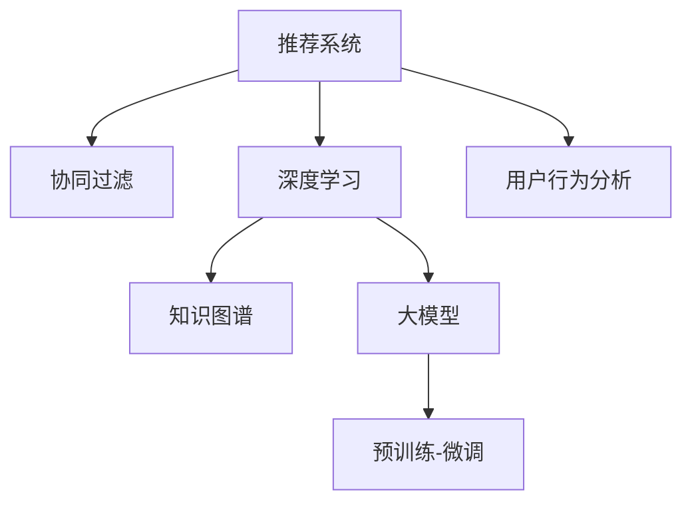

                 

# 推荐系统的未来发展：大模型的主导

> 关键词：推荐系统, 大模型, 协同过滤, 深度学习, 知识图谱, 大语言模型, 推荐算法, 用户行为分析

## 1. 背景介绍

### 1.1 问题由来

推荐系统在电子商务、新闻、社交媒体、音乐、视频等领域广泛应用，其核心目标是通过个性化推荐满足用户的不同需求，提高用户满意度和系统转化率。传统推荐系统主要基于用户的历史行为数据，如浏览记录、评分、点击等，采用协同过滤、矩阵分解等方法，进行商品或内容推荐。但这种基于历史数据的推荐方式，面临数据稀疏、冷启动、数据隐私等问题。近年来，随着深度学习技术和大语言模型的快速发展，基于深度学习的推荐系统逐步取代了传统方法，成为主流的推荐手段。

### 1.2 问题核心关键点

大模型在推荐系统中应用的突破在于其强大的表示能力和泛化能力。通过在大规模语料上预训练的深度学习模型，可以学习到丰富的语言特征和知识表示，从而显著提升推荐系统的性能。大模型在推荐系统中可以应用于多个方面，包括内容推荐、广告推荐、个性化搜索等。通过微调大模型，可以实现个性化的推荐服务，更好地匹配用户需求。

### 1.3 问题研究意义

研究基于大模型的推荐系统，对于提升推荐系统的性能、丰富推荐内容、提高用户体验、优化算法和模型设计具有重要意义：

1. **性能提升**：大模型具备丰富的特征表示和知识表示能力，可以提升推荐结果的准确性和多样性。
2. **内容丰富**：大模型可以自动生成推荐内容，丰富推荐系统的内容库。
3. **用户体验优化**：基于大模型的推荐系统可以根据用户的实时行为进行动态推荐，提高用户体验。
4. **算法优化**：通过与深度学习模型的结合，推荐算法可以更加高效和灵活。
5. **模型设计改进**：大模型可以提供更多的优化目标和改进点，推动推荐模型设计的发展。

## 2. 核心概念与联系

### 2.1 核心概念概述

为更好地理解基于大模型的推荐系统，本节将介绍几个密切相关的核心概念：

- **推荐系统**：通过分析用户的行为数据和偏好信息，为用户推荐其感兴趣的商品或内容的技术系统。

- **协同过滤**：基于用户行为数据进行推荐，通过分析相似用户或相似商品之间的关系，进行推荐。

- **深度学习**：一类强大的机器学习技术，通过构建多层次神经网络，学习到特征表示和知识表示。

- **知识图谱**：将实体、关系和属性映射到图结构中的技术，用于语义理解和知识推理。

- **大模型**：通过大规模语料预训练的深度学习模型，具备强大的表示能力和泛化能力。

- **预训练-微调**：利用大模型在大规模语料上进行预训练，然后针对特定任务进行微调，提升模型在该任务上的性能。

这些核心概念之间的逻辑关系可以通过以下Mermaid流程图来展示：



这个流程图展示了大模型在推荐系统中的核心概念及其之间的关系：

1. 推荐系统通过协同过滤和深度学习算法进行推荐。
2. 深度学习模型利用知识图谱和大模型，提升表示和推理能力。
3. 大模型通过预训练-微调，学习到特定的推荐任务特征。
4. 用户行为分析为推荐算法提供输入，同时接收推荐结果。

## 3. 核心算法原理 & 具体操作步骤
### 3.1 算法原理概述

基于大模型的推荐系统，其核心思想是：将大模型视为一个强大的特征提取器，通过在大规模语料上进行预训练，学习到通用的特征表示。然后针对推荐任务进行微调，利用微调后的模型进行特征提取和推荐，以获得更好的个性化推荐效果。

形式化地，假设大模型为 $M_{\theta}$，其中 $\theta$ 为预训练得到的模型参数。给定推荐任务 $T$ 的训练集 $D=\{(x_i,y_i)\}_{i=1}^N$，其中 $x_i$ 为用户行为数据，$y_i$ 为用户对该行为的评分或兴趣标签。微调的目标是找到新的模型参数 $\hat{\theta}$，使得：

$$
\hat{\theta}=\mathop{\arg\min}_{\theta} \mathcal{L}(M_{\theta},D)
$$

其中 $\mathcal{L}$ 为针对推荐任务设计的损失函数，用于衡量模型预测与真实标签之间的差异。常见的损失函数包括均方误差损失、交叉熵损失等。

### 3.2 算法步骤详解

基于大模型的推荐系统一般包括以下几个关键步骤：

**Step 1: 准备数据集和预训练模型**
- 准备推荐任务 $T$ 的训练集 $D=\{(x_i,y_i)\}_{i=1}^N$，其中 $x_i$ 为用户行为数据，$y_i$ 为用户评分或兴趣标签。
- 选择合适的大模型 $M_{\theta}$，如BERT、GPT等。

**Step 2: 添加任务适配层**
- 根据任务类型，在预训练模型顶层设计合适的输出层和损失函数。
- 对于评分预测任务，通常使用回归函数作为输出层，以均方误差为损失函数。
- 对于内容推荐任务，通常使用softmax函数作为输出层，以交叉熵为损失函数。

**Step 3: 设置微调超参数**
- 选择合适的优化算法及其参数，如 AdamW、SGD 等，设置学习率、批大小、迭代轮数等。
- 设置正则化技术及强度，包括权重衰减、Dropout、Early Stopping 等。
- 确定冻结预训练参数的策略，如仅微调顶层，或全部参数都参与微调。

**Step 4: 执行梯度训练**
- 将训练集数据分批次输入模型，前向传播计算损失函数。
- 反向传播计算参数梯度，根据设定的优化算法和学习率更新模型参数。
- 周期性在验证集上评估模型性能，根据性能指标决定是否触发 Early Stopping。
- 重复上述步骤直到满足预设的迭代轮数或 Early Stopping 条件。

**Step 5: 测试和部署**
- 在测试集上评估微调后模型 $M_{\hat{\theta}}$ 的性能，对比微调前后的精度提升。
- 使用微调后的模型对新样本进行推荐，集成到实际的应用系统中。

以上是基于大模型的推荐系统的一般流程。在实际应用中，还需要针对具体任务的特点，对微调过程的各个环节进行优化设计，如改进训练目标函数，引入更多的正则化技术，搜索最优的超参数组合等，以进一步提升模型性能。

### 3.3 算法优缺点

基于大模型的推荐系统具有以下优点：
1. 性能提升显著：大模型具备强大的表示能力和泛化能力，能够从大规模语料中学习到丰富的特征和知识。
2. 可扩展性强：大模型的参数量通常很大，可以适应多种复杂的推荐任务。
3. 适应性强：大模型可以通过微调学习到新的知识，适应不同的推荐任务和数据分布。
4. 泛化能力强：大模型可以通过预训练和微调，提升模型的泛化性能，减少冷启动问题。

同时，该方法也存在一些局限性：
1. 计算资源需求高：大模型的训练和推理需要大量的计算资源，包括高性能计算设备和大量的数据。
2. 数据隐私问题：在用户行为数据上的预训练和微调，可能涉及用户隐私保护问题。
3. 可解释性不足：大模型通常是黑盒模型，难以解释其内部工作机制和决策逻辑。
4. 模型复杂度高：大模型的结构复杂，训练和微调过程较难调试和优化。

尽管存在这些局限性，但就目前而言，基于大模型的推荐系统仍是推荐领域的主流范式。未来相关研究的重点在于如何进一步降低计算成本，保护用户隐私，提高模型可解释性，优化模型训练和微调过程。

### 3.4 算法应用领域

基于大模型的推荐系统已经在电商、社交媒体、新闻推荐、音乐推荐等多个领域取得了优异的效果，成为推荐系统研究的新趋势。

1. **电商平台推荐**：通过微调大模型，能够对用户的浏览记录和购买记录进行分析，推荐符合用户兴趣的商品。
2. **社交媒体推荐**：利用大模型分析用户的社交互动和内容消费行为，推荐相关的内容和用户。
3. **新闻推荐**：通过大模型对新闻文章进行分类和摘要，推荐用户感兴趣的新闻内容。
4. **音乐推荐**：分析用户听歌记录和音乐风格，推荐用户可能喜欢的音乐作品。
5. **视频推荐**：利用大模型对视频内容进行语义理解和分类，推荐符合用户兴趣的视频内容。

除了这些传统领域外，大模型还被创新性地应用于更多场景中，如跨模态推荐、交互式推荐、隐私保护推荐等，为推荐系统带来了新的突破。随着大模型和推荐技术的不断进步，相信推荐系统必将在更多领域发挥更大的作用。

## 4. 数学模型和公式 & 详细讲解  
### 4.1 数学模型构建

本节将使用数学语言对基于大模型的推荐系统进行更加严格的刻画。

假设推荐任务 $T$ 的训练集为 $D=\{(x_i,y_i)\}_{i=1}^N$，其中 $x_i$ 为用户行为数据，$y_i$ 为用户评分或兴趣标签。定义大模型 $M_{\theta}$ 在输入 $x_i$ 上的输出为 $\hat{y}_i=M_{\theta}(x_i)$。

定义模型 $M_{\theta}$ 在数据样本 $(x_i,y_i)$ 上的损失函数为 $\ell(M_{\theta}(x_i),y_i)$，则在数据集 $D$ 上的经验风险为：

$$
\mathcal{L}(\theta) = \frac{1}{N} \sum_{i=1}^N \ell(M_{\theta}(x_i),y_i)
$$

微调的优化目标是最小化经验风险，即找到最优参数：

$$
\theta^* = \mathop{\arg\min}_{\theta} \mathcal{L}(\theta)
$$

在实践中，我们通常使用基于梯度的优化算法（如SGD、Adam等）来近似求解上述最优化问题。设 $\eta$ 为学习率，$\lambda$ 为正则化系数，则参数的更新公式为：

$$
\theta \leftarrow \theta - \eta \nabla_{\theta}\mathcal{L}(\theta) - \eta\lambda\theta
$$

其中 $\nabla_{\theta}\mathcal{L}(\theta)$ 为损失函数对参数 $\theta$ 的梯度，可通过反向传播算法高效计算。

### 4.2 公式推导过程

以下我们以评分预测任务为例，推导均方误差损失函数及其梯度的计算公式。

假设模型 $M_{\theta}$ 在输入 $x_i$ 上的输出为 $\hat{y}_i=M_{\theta}(x_i)$，表示用户对商品 $x_i$ 的评分预测。真实标签 $y_i$ 表示用户对该商品的评分。均方误差损失函数定义为：

$$
\ell(M_{\theta}(x_i),y_i) = \frac{1}{2}(y_i - \hat{y}_i)^2
$$

将其代入经验风险公式，得：

$$
\mathcal{L}(\theta) = \frac{1}{N}\sum_{i=1}^N [(y_i - \hat{y}_i)^2]
$$

根据链式法则，损失函数对参数 $\theta_k$ 的梯度为：

$$
\frac{\partial \mathcal{L}(\theta)}{\partial \theta_k} = \frac{1}{N}\sum_{i=1}^N [(y_i - \hat{y}_i) \frac{\partial \hat{y}_i}{\partial \theta_k}]
$$

其中 $\frac{\partial \hat{y}_i}{\partial \theta_k}$ 可进一步递归展开，利用自动微分技术完成计算。

在得到损失函数的梯度后，即可带入参数更新公式，完成模型的迭代优化。重复上述过程直至收敛，最终得到适应推荐任务的最优模型参数 $\theta^*$。

## 5. 项目实践：代码实例和详细解释说明
### 5.1 开发环境搭建

在进行推荐系统开发前，我们需要准备好开发环境。以下是使用Python进行PyTorch开发的环境配置流程：

1. 安装Anaconda：从官网下载并安装Anaconda，用于创建独立的Python环境。

2. 创建并激活虚拟环境：
```bash
conda create -n pytorch-env python=3.8 
conda activate pytorch-env
```

3. 安装PyTorch：根据CUDA版本，从官网获取对应的安装命令。例如：
```bash
conda install pytorch torchvision torchaudio cudatoolkit=11.1 -c pytorch -c conda-forge
```

4. 安装Transformers库：
```bash
pip install transformers
```

5. 安装各类工具包：
```bash
pip install numpy pandas scikit-learn matplotlib tqdm jupyter notebook ipython
```

完成上述步骤后，即可在`pytorch-env`环境中开始推荐系统开发。

### 5.2 源代码详细实现

下面我们以电商平台推荐为例，给出使用Transformers库对BERT模型进行推荐系统微调的PyTorch代码实现。

首先，定义推荐任务的数据处理函数：

```python
from transformers import BertTokenizer
from torch.utils.data import Dataset
import torch

class RecommendationDataset(Dataset):
    def __init__(self, items, users, interactions, tokenizer, max_len=128):
        self.items = items
        self.users = users
        self.interactions = interactions
        self.tokenizer = tokenizer
        self.max_len = max_len
        
    def __len__(self):
        return len(self.items)
    
    def __getitem__(self, item):
        user_id = self.users[item]
        item_id = self.items[item]
        interaction = self.interactions[item]
        
        encoding = self.tokenizer(user_id, interaction, return_tensors='pt', max_length=self.max_len, padding='max_length', truncation=True)
        user_ids = encoding['input_ids'][0]
        user_interactions = encoding['attention_mask'][0]
        
        # 对token-wise的标签进行编码
        encoded_tags = [tag2id[tag] for tag in interaction] 
        encoded_tags.extend([tag2id['O']] * (self.max_len - len(encoded_tags)))
        labels = torch.tensor(encoded_tags, dtype=torch.long)
        
        return {'user_ids': user_ids, 
                'user_interactions': user_interactions,
                'labels': labels}

# 标签与id的映射
tag2id = {'O': 0, 'B': 1, 'I': 2}
id2tag = {v: k for k, v in tag2id.items()}

# 创建dataset
tokenizer = BertTokenizer.from_pretrained('bert-base-cased')

train_dataset = RecommendationDataset(train_items, train_users, train_interactions, tokenizer)
dev_dataset = RecommendationDataset(dev_items, dev_users, dev_interactions, tokenizer)
test_dataset = RecommendationDataset(test_items, test_users, test_interactions, tokenizer)
```

然后，定义模型和优化器：

```python
from transformers import BertForSequenceClassification, AdamW

model = BertForSequenceClassification.from_pretrained('bert-base-cased', num_labels=len(tag2id))

optimizer = AdamW(model.parameters(), lr=2e-5)
```

接着，定义训练和评估函数：

```python
from torch.utils.data import DataLoader
from tqdm import tqdm
from sklearn.metrics import classification_report

device = torch.device('cuda') if torch.cuda.is_available() else torch.device('cpu')
model.to(device)

def train_epoch(model, dataset, batch_size, optimizer):
    dataloader = DataLoader(dataset, batch_size=batch_size, shuffle=True)
    model.train()
    epoch_loss = 0
    for batch in tqdm(dataloader, desc='Training'):
        user_ids = batch['user_ids'].to(device)
        user_interactions = batch['user_interactions'].to(device)
        labels = batch['labels'].to(device)
        model.zero_grad()
        outputs = model(user_ids, user_interactions)
        loss = outputs.loss
        epoch_loss += loss.item()
        loss.backward()
        optimizer.step()
    return epoch_loss / len(dataloader)

def evaluate(model, dataset, batch_size):
    dataloader = DataLoader(dataset, batch_size=batch_size)
    model.eval()
    preds, labels = [], []
    with torch.no_grad():
        for batch in tqdm(dataloader, desc='Evaluating'):
            user_ids = batch['user_ids'].to(device)
            user_interactions = batch['user_interactions'].to(device)
            batch_labels = batch['labels']
            outputs = model(user_ids, user_interactions)
            batch_preds = outputs.logits.argmax(dim=2).to('cpu').tolist()
            batch_labels = batch_labels.to('cpu').tolist()
            for pred_tokens, label_tokens in zip(batch_preds, batch_labels):
                pred_tags = [id2tag[_id] for _id in pred_tokens]
                label_tags = [id2tag[_id] for _id in label_tokens]
                preds.append(pred_tags[:len(label_tokens)])
                labels.append(label_tags)
                
    print(classification_report(labels, preds))
```

最后，启动训练流程并在测试集上评估：

```python
epochs = 5
batch_size = 16

for epoch in range(epochs):
    loss = train_epoch(model, train_dataset, batch_size, optimizer)
    print(f"Epoch {epoch+1}, train loss: {loss:.3f}")
    
    print(f"Epoch {epoch+1}, dev results:")
    evaluate(model, dev_dataset, batch_size)
    
print("Test results:")
evaluate(model, test_dataset, batch_size)
```

以上就是使用PyTorch对BERT进行电商平台推荐系统微调的完整代码实现。可以看到，得益于Transformers库的强大封装，我们可以用相对简洁的代码完成BERT模型的加载和微调。

### 5.3 代码解读与分析

让我们再详细解读一下关键代码的实现细节：

**RecommendationDataset类**：
- `__init__`方法：初始化用户ID、商品ID和交互记录等关键组件。
- `__len__`方法：返回数据集的样本数量。
- `__getitem__`方法：对单个样本进行处理，将用户ID和交互记录输入编码为token ids，将标签编码为数字，并对其进行定长padding，最终返回模型所需的输入。

**tag2id和id2tag字典**：
- 定义了标签与数字id之间的映射关系，用于将token-wise的预测结果解码回真实的标签。

**训练和评估函数**：
- 使用PyTorch的DataLoader对数据集进行批次化加载，供模型训练和推理使用。
- 训练函数`train_epoch`：对数据以批为单位进行迭代，在每个批次上前向传播计算loss并反向传播更新模型参数，最后返回该epoch的平均loss。
- 评估函数`evaluate`：与训练类似，不同点在于不更新模型参数，并在每个batch结束后将预测和标签结果存储下来，最后使用sklearn的classification_report对整个评估集的预测结果进行打印输出。

**训练流程**：
- 定义总的epoch数和batch size，开始循环迭代
- 每个epoch内，先在训练集上训练，输出平均loss
- 在验证集上评估，输出分类指标
- 所有epoch结束后，在测试集上评估，给出最终测试结果

可以看到，PyTorch配合Transformers库使得BERT微调的代码实现变得简洁高效。开发者可以将更多精力放在数据处理、模型改进等高层逻辑上，而不必过多关注底层的实现细节。

当然，工业级的系统实现还需考虑更多因素，如模型的保存和部署、超参数的自动搜索、更灵活的任务适配层等。但核心的微调范式基本与此类似。

## 6. 实际应用场景
### 6.1 电商平台推荐

基于大语言模型微调的推荐系统，可以广泛应用于电商平台推荐系统的构建。传统推荐系统往往需要配置大量规则和特征工程，以应对不同用户和商品的复杂需求。而使用微调后的推荐模型，可以实时处理用户行为数据，动态生成个性化推荐结果，提升推荐效果。

在技术实现上，可以收集用户的浏览记录、购买记录、评价等信息，作为监督数据，训练微调后的推荐模型。微调后的模型能够自动分析用户行为数据，生成符合用户偏好的商品推荐。对于新商品或新用户，还可以引入推荐系统中的缺失值填补和冷启动策略，提高推荐效果。

### 6.2 社交媒体推荐

社交媒体推荐系统需要实时处理海量用户行为数据，推荐符合用户兴趣的内容和用户。基于大语言模型微调的推荐系统可以自动分析用户的行为数据，推荐相关的内容和用户，提升用户的活跃度和留存率。

在技术实现上，可以收集用户的点赞、评论、转发等行为数据，作为监督数据，训练微调后的推荐模型。微调后的模型能够自动分析用户的行为数据，生成符合用户兴趣的内容推荐。对于新用户或新内容，还可以引入推荐系统中的缺失值填补和冷启动策略，提高推荐效果。

### 6.3 新闻推荐

新闻推荐系统需要根据用户的阅读历史和兴趣，推荐用户可能感兴趣的新闻内容。基于大语言模型微调的推荐系统可以自动分析用户的行为数据，推荐相关的新闻内容，提升用户的阅读体验。

在技术实现上，可以收集用户的阅读历史和新闻互动数据，作为监督数据，训练微调后的推荐模型。微调后的模型能够自动分析用户的行为数据，生成符合用户兴趣的新闻推荐。对于新用户或新新闻，还可以引入推荐系统中的缺失值填补和冷启动策略，提高推荐效果。

### 6.4 未来应用展望

随着大语言模型微调技术的发展，基于微调范式的推荐系统将在更多领域得到应用，为推荐系统带来新的突破：

1. **跨模态推荐**：未来推荐系统不仅局限于文本数据，将结合图像、语音、视频等多模态数据，实现更加全面和精准的推荐。

2. **交互式推荐**：结合用户实时反馈，动态调整推荐策略，提供个性化的交互式推荐服务。

3. **隐私保护推荐**：利用差分隐私、联邦学习等技术，保护用户隐私，同时实现推荐模型的训练和优化。

4. **实时推荐**：通过流式数据处理和实时学习，实现推荐模型的动态更新和推荐结果的实时生成。

5. **多任务推荐**：结合推荐任务和知识推理任务，提升推荐模型的泛化能力和表现。

6. **深度推荐**：利用深度学习模型和大模型进行推荐，提高推荐模型的精度和表现。

未来，基于大模型的推荐系统必将在更广泛的场景中发挥作用，为推荐系统带来新的突破和发展。相信随着技术的不断进步，推荐系统必将在更多领域大放异彩，为用户的个性化需求提供更精准、高效的服务。

## 7. 工具和资源推荐
### 7.1 学习资源推荐

为了帮助开发者系统掌握大语言模型微调的理论基础和实践技巧，这里推荐一些优质的学习资源：

1. **《Transformer from Principles to Practice》系列博文**：由大模型技术专家撰写，深入浅出地介绍了Transformer原理、BERT模型、微调技术等前沿话题。

2. **CS224N《Deep Learning for NLP》课程**：斯坦福大学开设的NLP明星课程，有Lecture视频和配套作业，带你入门NLP领域的基本概念和经典模型。

3. **《Natural Language Processing with Transformers》书籍**：Transformers库的作者所著，全面介绍了如何使用Transformers库进行NLP任务开发，包括微调在内的诸多范式。

4. **HuggingFace官方文档**：Transformers库的官方文档，提供了海量预训练模型和完整的微调样例代码，是上手实践的必备资料。

5. **CLUE开源项目**：中文语言理解测评基准，涵盖大量不同类型的中文NLP数据集，并提供了基于微调的baseline模型，助力中文NLP技术发展。

通过对这些资源的学习实践，相信你一定能够快速掌握大语言模型微调的精髓，并用于解决实际的NLP问题。
###  7.2 开发工具推荐

高效的开发离不开优秀的工具支持。以下是几款用于大语言模型微调开发的常用工具：

1. **PyTorch**：基于Python的开源深度学习框架，灵活动态的计算图，适合快速迭代研究。大部分预训练语言模型都有PyTorch版本的实现。

2. **TensorFlow**：由Google主导开发的开源深度学习框架，生产部署方便，适合大规模工程应用。同样有丰富的预训练语言模型资源。

3. **Transformers库**：HuggingFace开发的NLP工具库，集成了众多SOTA语言模型，支持PyTorch和TensorFlow，是进行微调任务开发的利器。

4. **Weights & Biases**：模型训练的实验跟踪工具，可以记录和可视化模型训练过程中的各项指标，方便对比和调优。与主流深度学习框架无缝集成。

5. **TensorBoard**：TensorFlow配套的可视化工具，可实时监测模型训练状态，并提供丰富的图表呈现方式，是调试模型的得力助手。

6. **Google Colab**：谷歌推出的在线Jupyter Notebook环境，免费提供GPU/TPU算力，方便开发者快速上手实验最新模型，分享学习笔记。

合理利用这些工具，可以显著提升大语言模型微调任务的开发效率，加快创新迭代的步伐。

### 7.3 相关论文推荐

大语言模型和微调技术的发展源于学界的持续研究。以下是几篇奠基性的相关论文，推荐阅读：

1. **Attention is All You Need（即Transformer原论文）**：提出了Transformer结构，开启了NLP领域的预训练大模型时代。

2. **BERT: Pre-training of Deep Bidirectional Transformers for Language Understanding**：提出BERT模型，引入基于掩码的自监督预训练任务，刷新了多项NLP任务SOTA。

3. **Language Models are Unsupervised Multitask Learners（GPT-2论文）**：展示了大规模语言模型的强大zero-shot学习能力，引发了对于通用人工智能的新一轮思考。

4. **Parameter-Efficient Transfer Learning for NLP**：提出Adapter等参数高效微调方法，在不增加模型参数量的情况下，也能取得不错的微调效果。

5. **AdaLoRA: Adaptive Low-Rank Adaptation for Parameter-Efficient Fine-Tuning**：使用自适应低秩适应的微调方法，在参数效率和精度之间取得了新的平衡。

这些论文代表了大语言模型微调技术的发展脉络。通过学习这些前沿成果，可以帮助研究者把握学科前进方向，激发更多的创新灵感。

## 8. 总结：未来发展趋势与挑战

### 8.1 总结

本文对基于大模型的推荐系统进行了全面系统的介绍。首先阐述了大模型和微调技术的研究背景和意义，明确了微调在拓展预训练模型应用、提升推荐系统性能方面的独特价值。其次，从原理到实践，详细讲解了基于大模型的推荐系统数学原理和关键步骤，给出了推荐系统开发的完整代码实例。同时，本文还广泛探讨了推荐系统在大规模电商、社交媒体、新闻推荐等领域的实际应用，展示了微调范式的巨大潜力。此外，本文精选了推荐技术的各类学习资源，力求为读者提供全方位的技术指引。

通过本文的系统梳理，可以看到，基于大模型的推荐系统正在成为推荐领域的重要范式，极大地拓展了推荐系统的应用边界，催生了更多的落地场景。得益于大规模语料的预训练，推荐模型在保持个性化推荐的同时，能够实现实时化、智能化和动态化的推荐服务，更好地满足用户的多样化需求。未来，伴随大模型和推荐技术的不断进步，相信推荐系统必将在更多领域发挥更大的作用，为用户的个性化需求提供更精准、高效的服务。

### 8.2 未来发展趋势

展望未来，基于大模型的推荐系统将呈现以下几个发展趋势：

1. **推荐模型的规模化**：随着大模型的预训练规模不断扩大，推荐模型的参数量和计算资源需求将持续增加，但也在不断提升推荐系统的精度和泛化能力。

2. **推荐模型的复杂化**：大模型可以学习到更加复杂的特征和知识表示，未来推荐系统将结合多模态数据、因果推理等技术，提升推荐模型的复杂性和表现力。

3. **推荐模型的实时化**：结合流式数据处理和实时学习技术，实现推荐模型的动态更新和推荐结果的实时生成，提升推荐系统的时效性和响应速度。

4. **推荐模型的个性化**：利用大模型的个性化推荐能力，结合用户的实时反馈，动态调整推荐策略，提供个性化的推荐服务。

5. **推荐模型的可解释性**：未来推荐系统将结合可解释性技术，提高推荐模型的透明度和可解释性，提升用户对推荐结果的信任度。

6. **推荐模型的多样性**：结合推荐任务和知识推理任务，提升推荐模型的多样性和表现力，满足用户多样化的需求。

以上趋势凸显了大模型在推荐系统中的重要作用。这些方向的探索发展，必将进一步提升推荐系统的性能和应用范围，为推荐系统带来新的突破和发展。

### 8.3 面临的挑战

尽管基于大模型的推荐系统取得了显著进展，但在迈向更加智能化、普适化应用的过程中，仍面临诸多挑战：

1. **计算资源瓶颈**：大模型的预训练和微调需要大量的计算资源，如何高效地利用计算资源，是未来推荐系统需要解决的重要问题。

2. **数据隐私问题**：在用户行为数据上的预训练和微调，可能涉及用户隐私保护问题。如何在保证隐私安全的前提下，进行高效的推荐系统训练，是一个重要课题。

3. **模型复杂性**：大模型的结构复杂，训练和微调过程较难调试和优化。如何简化模型结构，提高模型的可解释性和可维护性，是未来推荐系统需要解决的重要问题。

4. **模型鲁棒性**：推荐模型在面对噪声、缺失值等异常数据时，泛化性能可能受到影响。如何提高推荐模型的鲁棒性，减少异常数据对推荐结果的影响，是一个重要研究方向。

5. **推荐模型的不公平性**：大模型可能继承和放大原有数据中的偏见和歧视，导致推荐结果的不公平性。如何在推荐过程中引入公平性约束，是一个重要研究方向。

6. **推荐模型的可解释性**：推荐模型通常是黑盒模型，难以解释其内部工作机制和决策逻辑。如何提高推荐模型的可解释性，提高用户对推荐结果的信任度，是一个重要研究方向。

7. **推荐模型的泛化性**：大模型在面对不同数据分布和不同推荐任务时，泛化性能可能受到影响。如何提高推荐模型的泛化性，是未来推荐系统需要解决的重要问题。

8. **推荐模型的实时性**：在实时推荐场景下，推荐模型需要快速响应推荐请求，对计算资源和时间成本有较高要求。如何提升推荐模型的实时性和响应速度，是一个重要研究方向。

这些挑战展示了基于大模型的推荐系统需要面对的复杂性和多样性。解决这些挑战，需要跨学科的合作和不断的技术创新，推动推荐系统向更加智能化、普适化和可解释化方向发展。

### 8.4 未来突破

面对基于大模型的推荐系统所面临的种种挑战，未来的研究需要在以下几个方面寻求新的突破：

1. **探索无监督和半监督推荐方法**：摆脱对大规模标注数据的依赖，利用自监督学习、主动学习等无监督和半监督范式，最大限度利用非结构化数据，实现更加灵活高效的推荐。

2. **研究参数高效和计算高效的推荐范式**：开发更加参数高效的推荐方法，在固定大部分预训练参数的同时，只更新极少量的任务相关参数。同时优化推荐模型的计算图，减少前向传播和反向传播的资源消耗，实现更加轻量级、实时性的部署。

3. **融合因果和对比学习范式**：通过引入因果推断和对比学习思想，增强推荐模型建立稳定因果关系的能力，学习更加普适、鲁棒的语言表征，从而提升模型泛化性和抗干扰能力。

4. **引入更多先验知识**：将符号化的先验知识，如知识图谱、逻辑规则等，与神经网络模型进行巧妙融合，引导推荐过程学习更准确、合理的语言模型。同时加强不同模态数据的整合，实现视觉、语音等多模态信息与文本信息的协同建模。

5. **结合因果分析和博弈论工具**：将因果分析方法引入推荐模型，识别出推荐决策的关键特征，增强推荐结果的因果性和逻辑性。借助博弈论工具刻画人机交互过程，主动探索并规避推荐模型的脆弱点，提高系统稳定性。

6. **纳入伦理道德约束**：在推荐模型训练目标中引入伦理导向的评估指标，过滤和惩罚有偏见、有害的输出倾向。同时加强人工干预和审核，建立推荐行为的监管机制，确保输出符合人类价值观和伦理道德。

这些研究方向的探索，必将引领基于大模型的推荐系统迈向更高的台阶，为构建安全、可靠、可解释、可控的推荐系统铺平道路。面向未来，基于大模型的推荐系统需要与其他人工智能技术进行更深入的融合，如知识表示、因果推理、强化学习等，多路径协同发力，共同推动推荐系统的进步。只有勇于创新、敢于突破，才能不断拓展推荐系统的边界，让智能技术更好地造福用户。

## 9. 附录：常见问题与解答

**Q1：大模型推荐系统是否适用于所有推荐任务？**

A: 大模型推荐系统在大多数推荐任务上都能取得不错的效果，特别是对于数据量较大的推荐任务。但对于一些特定领域的推荐任务，如医药、金融等，仅仅依靠通用语料预训练的模型可能难以很好地适应。此时需要在特定领域语料上进一步预训练，再进行微调，才能获得理想效果。此外，对于一些需要时效性、个性化很强的推荐任务，如广告推荐、个性化搜索等，微调方法也需要针对性的改进优化。

**Q2：微调过程中如何选择合适的学习率？**

A: 微调的学习率一般要比预训练时小1-2个数量级，如果使用过大的学习率，容易破坏预训练权重，导致过拟合。一般建议从1e-5开始调参，逐步减小学习率，直至收敛。也可以使用warmup策略，在开始阶段使用较小的学习率，再逐渐过渡到预设值。需要注意的是，不同的优化器(如AdamW、Adafactor等)以及不同的学习率调度策略，可能需要设置不同的学习率阈值。

**Q3：采用大模型推荐时会面临哪些资源瓶颈？**

A: 目前主流的预训练大模型动辄以亿计的参数规模，对算力、内存、存储都提出了很高的要求。GPU/TPU等高性能设备是必不可少的，但即便如此，超大批次的训练和推理也可能遇到显存不足的问题。因此需要采用一些资源优化技术，如梯度积累、混合精度训练、模型并行等，来突破硬件瓶颈。同时，模型的存储和读取也可能占用大量时间和空间，需要采用模型压缩、稀疏化存储等方法进行优化。

**Q4：如何缓解推荐系统中的冷启动问题？**

A: 冷启动问题是推荐系统中常见的问题之一。为了缓解冷启动问题，可以采用以下方法：

1. **迁移学习**：利用预训练大模型在通用领域的知识，进行迁移学习，提升新领域推荐系统的性能。
2. **知识图谱融合**：将知识图谱中的实体和关系信息，与推荐模型结合，提高推荐模型的泛化能力。
3. **用户行为分析**：利用用户行为数据，分析用户的兴趣和偏好，推荐相关的商品或内容。
4. **多模态融合**：结合图像、语音、视频等多模态数据，提升推荐模型的表现力。

这些方法可以有效缓解冷启动问题，提升推荐系统的性能和用户体验。

**Q5：如何提升推荐系统的鲁棒性？**

A: 推荐系统在面对噪声、缺失值等异常数据时，泛化性能可能受到影响。为了提升推荐系统的鲁棒性，可以采用以下方法：

1. **异常检测**：利用异常检测技术，识别并过滤掉异常数据，减少异常数据对推荐结果的影响。
2. **缺失值填补**：采用插值、回归等方法，填补缺失数据，提高推荐模型的完整性。
3. **鲁棒优化**：在训练过程中引入鲁棒优化算法，提高推荐模型的鲁棒性和泛化能力。
4. **对抗训练**：引入对抗样本，训练鲁棒推荐模型，提高推荐系统的鲁棒性。

这些方法可以有效提升推荐系统的鲁棒性，增强其应对异常数据的能力。

**Q6：推荐系统如何结合用户实时反馈进行动态调整？**

A: 结合用户实时反馈，动态调整推荐策略，提供个性化的推荐服务，是推荐系统的重要目标之一。为了实现这一目标，可以采用以下方法：

1. **在线学习**：利用在线学习技术，根据用户的实时反馈，动态调整推荐模型。
2. **实时推荐算法**：采用实时推荐算法，根据用户实时行为数据，生成个性化的推荐结果。
3. **强化学习**：结合强化学习技术，利用用户反馈进行动态调整，提升推荐系统的表现力。

这些方法可以有效结合用户实时反馈，动态调整推荐策略，提供个性化的推荐服务。

**Q7：推荐系统如何实现跨模态推荐？**

A: 跨模态推荐是将推荐系统扩展到多模态数据领域，提升推荐系统的表现力和用户体验。为了实现跨模态推荐，可以采用以下方法：

1. **多模态特征融合**：结合图像、语音、视频等多模态数据，提升推荐模型的表现力。
2. **多模态协同训练**：将不同模态的数据结合在一起，进行协同训练，提升推荐模型的泛化能力。
3. **多模态推荐算法**：设计多模态推荐算法，根据多模态数据，生成个性化的推荐结果。

这些方法可以有效实现跨模态推荐，提升推荐系统的表现力和用户体验。

总之，推荐系统需要在不断优化算法和模型设计的基础上，结合最新的技术手段，实现更加智能化、普适化和可解释化的推荐服务，满足用户的个性化需求。只有勇于创新、敢于突破，才能不断拓展推荐系统的边界，让智能技术更好地造福用户。

