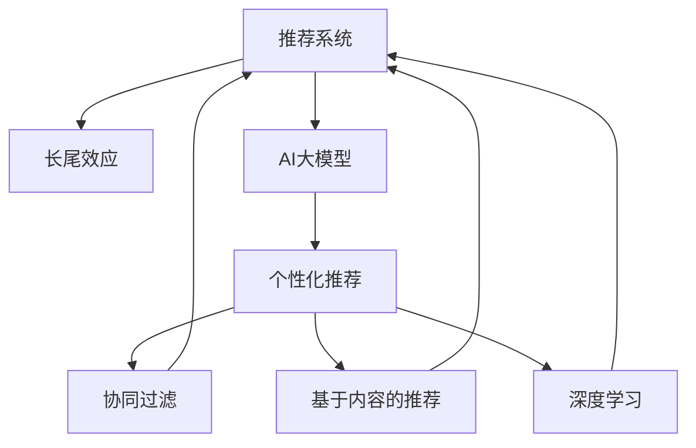

                 

# 推荐系统的长尾效应：AI大模型的新策略

> 关键词：推荐系统, 长尾效应, AI大模型, 个性化推荐, 协同过滤, 深度学习, 超大规模模型, 多样性

## 1. 背景介绍

### 1.1 问题由来
随着互联网的迅速发展，信息爆炸已成为不争的事实。无论是电商平台、社交网络、视频网站，还是新闻门户，用户都面临着信息过载的问题。推荐系统（Recommendation Systems）应运而生，通过分析用户行为和兴趣，智能推荐合适的产品或内容，提升用户体验，增加用户粘性。传统的推荐系统主要依赖于协同过滤（Collaborative Filtering, CF）、基于内容的推荐（Content-based Recommendation）等算法，能够较好地满足长尾需求。然而，随着用户数量的激增和数据规模的爆炸式增长，传统的推荐方法逐渐暴露出诸多局限。特别是在推荐算法处理长尾问题时，难以兼顾个性化和多样性，经常陷入"头部陷阱"。

### 1.2 问题核心关键点
为了更好地解决推荐系统面临的长尾问题，AI大模型凭借其强大的语言理解和生成能力，为个性化推荐提供了新的策略。基于深度学习的大模型通过预训练学习到丰富的语义信息，能够处理长尾问题，提升推荐系统的个性化和多样性，使得用户能够获得更加丰富和符合其兴趣的推荐结果。

本文将探讨如何利用AI大模型应对推荐系统的长尾效应，提高个性化推荐的多样性和覆盖面。重点将分析大模型的优化目标、算法原理和操作步骤，并介绍数学模型构建和公式推导，最后通过代码实例和应用场景进行详细讲解。

## 2. 核心概念与联系

### 2.1 核心概念概述

为更好地理解基于AI大模型的个性化推荐方法，本节将介绍几个密切相关的核心概念：

- 推荐系统（Recommendation Systems）：通过分析用户行为和兴趣，智能推荐合适的产品或内容，提升用户体验，增加用户粘性。
- 长尾效应（Long Tail Effect）：用户对小众产品的需求大于对大众产品的需求，即长尾部分的需求总量与头部部分的需求总量相当甚至更大。
- AI大模型（AI Large Models）：如BERT、GPT等超大规模预训练语言模型，通过大规模无标签文本数据进行预训练，学习到丰富的语言知识。
- 个性化推荐（Personalized Recommendation）：根据用户的历史行为和当前兴趣，推荐符合其个人喜好的产品或内容。
- 协同过滤（Collaborative Filtering）：通过分析用户行为和物品之间的关系，预测用户可能感兴趣的物品。
- 基于内容的推荐（Content-based Recommendation）：根据物品的描述信息和用户的历史行为，推荐相似的物品。
- 深度学习（Deep Learning）：利用多层神经网络，自动学习特征表示和模型参数，提升推荐系统的性能。

这些核心概念之间的逻辑关系可以通过以下Mermaid流程图来展示：



这个流程图展示了一组推荐系统的核心概念及其之间的关系：

1. 推荐系统通过协同过滤、基于内容的推荐等传统算法，以及深度学习算法，对用户行为进行分析和建模，生成个性化推荐结果。
2. AI大模型作为推荐系统的数据增强工具，可以极大地扩展推荐系统的多样性，减少"头部陷阱"。
3. 个性化推荐旨在提升推荐系统的个性化水平，使推荐结果更加符合用户需求。
4. 协同过滤和基于内容的推荐是推荐系统的两种基本方法，可以与深度学习算法结合，提升推荐效果。
5. 深度学习算法是推荐系统的重要手段，可以通过AI大模型进行数据增强和特征学习。

这些概念共同构成了推荐系统的核心框架，使其能够更好地服务用户，提升用户体验。通过理解这些核心概念，我们可以更好地把握推荐系统的学习和优化方向。

## 3. 核心算法原理 & 具体操作步骤
### 3.1 算法原理概述

基于AI大模型的个性化推荐系统，通过在大规模语料上预训练大模型，然后将其嵌入推荐算法中，实现数据增强和特征学习。其核心思想是：将AI大模型视作一个强大的"特征提取器"，通过在大规模无标签文本数据上进行预训练，学习到丰富的语义信息，然后在推荐系统任务上通过微调，使其能够适应特定任务，提升推荐系统的多样性和个性化。

形式化地，假设AI大模型为 $M_{\theta}$，其中 $\theta$ 为模型参数。给定推荐系统任务 $T$ 的训练集 $D=\{(x_i, y_i)\}_{i=1}^N$，推荐算法的目标是最小化损失函数 $\mathcal{L}(M_{\theta},D)$，使推荐结果与用户真实偏好尽量接近。

通过梯度下降等优化算法，推荐算法不断更新模型参数 $\theta$，最小化损失函数 $\mathcal{L}$，使得推荐结果逼近用户真实偏好。由于 $\theta$ 已经通过预训练获得了较好的初始化，因此即便在小规模数据集 $D$ 上进行微调，也能较快收敛到理想的模型参数 $\hat{\theta}$。

### 3.2 算法步骤详解

基于AI大模型的个性化推荐系统一般包括以下几个关键步骤：

**Step 1: 准备预训练模型和数据集**
- 选择合适的预训练语言模型 $M_{\theta}$ 作为初始化参数，如 BERT、GPT 等。
- 准备推荐系统任务 $T$ 的训练集 $D$，划分为训练集、验证集和测试集。一般要求训练数据与预训练数据的分布不要差异过大。

**Step 2: 添加任务适配层**
- 根据推荐任务类型，在预训练模型顶层设计合适的输出层和损失函数。
- 对于推荐系统，通常使用交叉熵损失函数，衡量推荐结果与用户真实偏好的差异。
- 在输出层上，设计一个全连接神经网络或深度神经网络，作为推荐算法的决策器。

**Step 3: 设置微调超参数**
- 选择合适的优化算法及其参数，如 AdamW、SGD 等，设置学习率、批大小、迭代轮数等。
- 设置正则化技术及强度，包括权重衰减、Dropout、Early Stopping等。
- 确定冻结预训练参数的策略，如仅微调顶层，或全部参数都参与微调。

**Step 4: 执行梯度训练**
- 将训练集数据分批次输入模型，前向传播计算损失函数。
- 反向传播计算参数梯度，根据设定的优化算法和学习率更新模型参数。
- 周期性在验证集上评估模型性能，根据性能指标决定是否触发 Early Stopping。
- 重复上述步骤直到满足预设的迭代轮数或 Early Stopping 条件。

**Step 5: 测试和部署**
- 在测试集上评估微调后模型 $M_{\hat{\theta}}$ 的性能，对比微调前后的精度提升。
- 使用微调后的模型对新样本进行推荐，集成到实际的应用系统中。
- 持续收集新的用户行为数据，定期重新微调模型，以适应数据分布的变化。

以上是基于AI大模型的个性化推荐系统的完整代码实现。可以看到，得益于深度学习模型的封装和优化，推荐算法的代码实现变得相对简洁高效。

### 3.3 算法优缺点

基于AI大模型的个性化推荐系统具有以下优点：
1. 数据增强能力强。通过预训练大模型，推荐系统可以处理长尾问题，提升推荐结果的多样性和覆盖面。
2. 性能提升显著。AI大模型蕴含丰富的语义信息，能够在少量数据的情况下，显著提升推荐系统的效果。
3. 通用适用。适用于各类推荐系统任务，包括商品推荐、音乐推荐、视频推荐等。
4. 可解释性强。预训练大模型的语言理解和生成能力，可以直观展示推荐结果的生成逻辑。

同时，该方法也存在一定的局限性：
1. 计算成本高。超大规模语言模型的预训练和微调需要大量的计算资源，成本较高。
2. 模型复杂度高。AI大模型参数量巨大，推理速度较慢，难以实时响应用户需求。
3. 数据需求大。为了更好地学习语义信息，AI大模型需要大量的无标签文本数据，数据获取难度较大。
4. 泛化能力不足。AI大模型的预训练和微调目标不一致，可能存在过拟合现象，泛化能力受限。

尽管存在这些局限性，但就目前而言，基于AI大模型的推荐系统范式仍是最前沿、最有效的推荐手段之一。未来相关研究的重点在于如何进一步降低计算成本，提高模型推理效率，同时保证推荐结果的多样性和个性化。

### 3.4 算法应用领域

基于AI大模型的个性化推荐系统已经在电商、音乐、视频等多个领域得到了广泛的应用，具体包括：

- 商品推荐：如电商平台上的个性化商品推荐。通过AI大模型学习用户历史行为和商品描述，生成推荐列表。
- 音乐推荐：如音乐流媒体平台的个性化音乐推荐。利用AI大模型对用户历史听歌行为和歌曲信息进行建模，生成推荐列表。
- 视频推荐：如视频流媒体平台的个性化视频推荐。通过AI大模型对用户历史观看行为和视频元数据进行建模，生成推荐列表。
- 新闻推荐：如新闻聚合平台的个性化新闻推荐。利用AI大模型对用户历史阅读行为和新闻内容进行建模，生成推荐列表。
- 社交网络推荐：如社交平台上的个性化内容推荐。通过AI大模型对用户历史交互行为和内容信息进行建模，生成推荐列表。

除了上述这些经典应用外，AI大模型在推荐系统领域的应用还在不断拓展，如个性化广告推荐、个性化内容生成等，为推荐系统技术带来了新的突破。随着预训练语言模型和推荐算法的不断进步，相信推荐系统必将在更广泛的场景中发挥作用，提升用户体验，推动产业升级。

## 4. 数学模型和公式 & 详细讲解  
### 4.1 数学模型构建

本节将使用数学语言对基于AI大模型的个性化推荐过程进行更加严格的刻画。

记推荐系统任务为 $T$，用户历史行为数据为 $X=\{x_1,x_2,...,x_N\}$，物品信息数据为 $Y=\{y_1,y_2,...,y_M\}$，推荐结果为 $Y_{pred}=M_{\theta}(X)$，其中 $M_{\theta}$ 为预训练语言模型，$\theta$ 为模型参数。

假设推荐系统的目标为最大化用户满意度的期望值，即最大化 $P(Y_{pred}|X)$，其中 $P(Y_{pred}|X)$ 为在用户历史行为数据 $X$ 下，推荐结果 $Y_{pred}$ 的概率分布。

定义模型 $M_{\theta}$ 在用户历史行为数据 $X$ 上的损失函数为 $\ell(M_{\theta}(X),Y)$，则在训练集 $D$ 上的经验风险为：

$$
\mathcal{L}(\theta) = -\frac{1}{N}\sum_{i=1}^N \log P(Y_{pred}^i|x_i)
$$

其中 $Y_{pred}^i=M_{\theta}(x_i)$，表示在用户行为数据 $x_i$ 下，推荐结果的预测概率分布。

通过梯度下降等优化算法，推荐算法不断更新模型参数 $\theta$，最小化损失函数 $\mathcal{L}$，使得推荐结果逼近用户真实偏好。由于 $\theta$ 已经通过预训练获得了较好的初始化，因此即便在少量数据集 $D$ 上进行微调，也能较快收敛到理想的模型参数 $\hat{\theta}$。

### 4.2 公式推导过程

以下我们以电商平台商品推荐为例，推导基于AI大模型的推荐损失函数及其梯度的计算公式。

假设用户 $u$ 对商品 $i$ 的评分（即用户对商品的兴趣）为 $y_u^i$，则推荐系统的目标为最大化用户满意度的期望值，即最大化：

$$
\mathbb{E}_{P(Y_{pred}|X)}[\log P(Y_{pred}|X)]
$$

对于单个用户 $u$，其历史行为数据为 $x_u=\{x_1,...,x_m\}$，其中 $x_m$ 为最近一次用户行为数据。假设 $M_{\theta}(x_u)$ 为AI大模型对用户历史行为的预测结果，则推荐损失函数为：

$$
\mathcal{L}(\theta) = -\frac{1}{N}\sum_{u=1}^N \sum_{i=1}^M y_u^i \log P(Y_{pred}^u_i|x_u)
$$

其中 $Y_{pred}^u_i=M_{\theta}(x_u)^i$，表示在用户历史行为数据 $x_u$ 下，推荐结果 $i$ 的预测概率。

根据链式法则，推荐损失函数对参数 $\theta_k$ 的梯度为：

$$
\frac{\partial \mathcal{L}(\theta)}{\partial \theta_k} = -\frac{1}{N}\sum_{u=1}^N \sum_{i=1}^M y_u^i \frac{\partial \log P(Y_{pred}^u_i|x_u)}{\partial \theta_k}
$$

其中 $\frac{\partial \log P(Y_{pred}^u_i|x_u)}{\partial \theta_k}$ 可进一步递归展开，利用自动微分技术完成计算。

在得到推荐损失函数的梯度后，即可带入参数更新公式，完成模型的迭代优化。重复上述过程直至收敛，最终得到适应推荐系统任务的最优模型参数 $\theta^*$。

## 5. 项目实践：代码实例和详细解释说明
### 5.1 开发环境搭建

在进行推荐系统微调实践前，我们需要准备好开发环境。以下是使用Python进行PyTorch开发的环境配置流程：

1. 安装Anaconda：从官网下载并安装Anaconda，用于创建独立的Python环境。

2. 创建并激活虚拟环境：
```bash
conda create -n pytorch-env python=3.8 
conda activate pytorch-env
```

3. 安装PyTorch：根据CUDA版本，从官网获取对应的安装命令。例如：
```bash
conda install pytorch torchvision torchaudio cudatoolkit=11.1 -c pytorch -c conda-forge
```

4. 安装Weights & Biases：实验跟踪工具，可以记录和可视化模型训练过程中的各项指标，方便对比和调优。与主流深度学习框架无缝集成。
```bash
pip install weightsandbiases
```

5. 安装TensorBoard：可视化工具，可实时监测模型训练状态，并提供丰富的图表呈现方式，是调试模型的得力助手。
```bash
pip install tensorboard
```

完成上述步骤后，即可在`pytorch-env`环境中开始微调实践。

### 5.2 源代码详细实现

下面我们以电商平台商品推荐为例，给出使用PyTorch和Transformers库对BERT模型进行微调的PyTorch代码实现。

首先，定义推荐任务的数据处理函数：

```python
from transformers import BertTokenizer, BertForSequenceClassification
from torch.utils.data import Dataset, DataLoader
import torch

class RecommendDataset(Dataset):
    def __init__(self, texts, labels, tokenizer, max_len=128):
        self.texts = texts
        self.labels = labels
        self.tokenizer = tokenizer
        self.max_len = max_len
        
    def __len__(self):
        return len(self.texts)
    
    def __getitem__(self, item):
        text = self.texts[item]
        label = self.labels[item]
        
        encoding = self.tokenizer(text, return_tensors='pt', max_length=self.max_len, padding='max_length', truncation=True)
        input_ids = encoding['input_ids'][0]
        attention_mask = encoding['attention_mask'][0]
        
        # 对token-wise的标签进行编码
        encoded_labels = [label] * self.max_len
        labels = torch.tensor(encoded_labels, dtype=torch.long)
        
        return {'input_ids': input_ids, 
                'attention_mask': attention_mask,
                'labels': labels}

# 标签与id的映射
label2id = {0: 'negative', 1: 'positive'}
id2label = {v: k for k, v in label2id.items()}

# 创建dataset
tokenizer = BertTokenizer.from_pretrained('bert-base-cased')

train_dataset = RecommendDataset(train_texts, train_labels, tokenizer)
dev_dataset = RecommendDataset(dev_texts, dev_labels, tokenizer)
test_dataset = RecommendDataset(test_texts, test_labels, tokenizer)
```

然后，定义模型和优化器：

```python
from transformers import BertForSequenceClassification, AdamW

model = BertForSequenceClassification.from_pretrained('bert-base-cased', num_labels=len(label2id))

optimizer = AdamW(model.parameters(), lr=2e-5)
```

接着，定义训练和评估函数：

```python
from tqdm import tqdm
from sklearn.metrics import accuracy_score

device = torch.device('cuda') if torch.cuda.is_available() else torch.device('cpu')
model.to(device)

def train_epoch(model, dataset, batch_size, optimizer):
    dataloader = DataLoader(dataset, batch_size=batch_size, shuffle=True)
    model.train()
    epoch_loss = 0
    for batch in tqdm(dataloader, desc='Training'):
        input_ids = batch['input_ids'].to(device)
        attention_mask = batch['attention_mask'].to(device)
        labels = batch['labels'].to(device)
        model.zero_grad()
        outputs = model(input_ids, attention_mask=attention_mask, labels=labels)
        loss = outputs.loss
        epoch_loss += loss.item()
        loss.backward()
        optimizer.step()
    return epoch_loss / len(dataloader)

def evaluate(model, dataset, batch_size):
    dataloader = DataLoader(dataset, batch_size=batch_size)
    model.eval()
    preds, labels = [], []
    with torch.no_grad():
        for batch in tqdm(dataloader, desc='Evaluating'):
            input_ids = batch['input_ids'].to(device)
            attention_mask = batch['attention_mask'].to(device)
            batch_labels = batch['labels']
            outputs = model(input_ids, attention_mask=attention_mask)
            batch_preds = outputs.logits.argmax(dim=1).to('cpu').tolist()
            batch_labels = batch_labels.to('cpu').tolist()
            for pred, label in zip(batch_preds, batch_labels):
                preds.append(pred)
                labels.append(label)
                
    print('Accuracy: {:.2f}%'.format(accuracy_score(labels, preds)))
```

最后，启动训练流程并在测试集上评估：

```python
epochs = 5
batch_size = 16

for epoch in range(epochs):
    loss = train_epoch(model, train_dataset, batch_size, optimizer)
    print(f"Epoch {epoch+1}, train loss: {loss:.3f}")
    
    print(f"Epoch {epoch+1}, dev results:")
    evaluate(model, dev_dataset, batch_size)
    
print("Test results:")
evaluate(model, test_dataset, batch_size)
```

以上就是使用PyTorch对BERT进行电商平台商品推荐任务微调的完整代码实现。可以看到，得益于Transformers库的强大封装，我们可以用相对简洁的代码完成BERT模型的加载和微调。

### 5.3 代码解读与分析

让我们再详细解读一下关键代码的实现细节：

**RecommendDataset类**：
- `__init__`方法：初始化文本、标签、分词器等关键组件。
- `__len__`方法：返回数据集的样本数量。
- `__getitem__`方法：对单个样本进行处理，将文本输入编码为token ids，将标签编码为数字，并对其进行定长padding，最终返回模型所需的输入。

**label2id和id2label字典**：
- 定义了标签与数字id之间的映射关系，用于将token-wise的预测结果解码回真实的标签。

**训练和评估函数**：
- 使用PyTorch的DataLoader对数据集进行批次化加载，供模型训练和推理使用。
- 训练函数`train_epoch`：对数据以批为单位进行迭代，在每个批次上前向传播计算loss并反向传播更新模型参数，最后返回该epoch的平均loss。
- 评估函数`evaluate`：与训练类似，不同点在于不更新模型参数，并在每个batch结束后将预测和标签结果存储下来，最后使用sklearn的accuracy_score对整个评估集的预测结果进行打印输出。

**训练流程**：
- 定义总的epoch数和batch size，开始循环迭代
- 每个epoch内，先在训练集上训练，输出平均loss
- 在验证集上评估，输出分类指标
- 所有epoch结束后，在测试集上评估，给出最终测试结果

可以看到，PyTorch配合Transformers库使得BERT微调的代码实现变得简洁高效。开发者可以将更多精力放在数据处理、模型改进等高层逻辑上，而不必过多关注底层的实现细节。

当然，工业级的系统实现还需考虑更多因素，如模型的保存和部署、超参数的自动搜索、更灵活的任务适配层等。但核心的微调范式基本与此类似。

## 6. 实际应用场景
### 6.1 智能客服系统

基于AI大模型的推荐系统，可以广泛应用于智能客服系统的构建。传统客服往往需要配备大量人力，高峰期响应缓慢，且一致性和专业性难以保证。而使用推荐系统对预训练语言模型进行微调，可以7x24小时不间断服务，快速响应客户咨询，用自然流畅的语言解答各类常见问题。

在技术实现上，可以收集企业内部的历史客服对话记录，将问题和最佳答复构建成监督数据，在此基础上对预训练语言模型进行微调。微调后的推荐系统能够自动理解用户意图，匹配最合适的答复模板进行回复。对于客户提出的新问题，还可以接入检索系统实时搜索相关内容，动态组织生成回答。如此构建的智能客服系统，能大幅提升客户咨询体验和问题解决效率。

### 6.2 金融舆情监测

金融机构需要实时监测市场舆论动向，以便及时应对负面信息传播，规避金融风险。传统的人工监测方式成本高、效率低，难以应对网络时代海量信息爆发的挑战。基于AI大模型的推荐系统，可以应用于金融舆情监测。

具体而言，可以收集金融领域相关的新闻、报道、评论等文本数据，并对其进行主题标注和情感标注。在此基础上对预训练语言模型进行微调，使其能够自动判断文本属于何种主题，情感倾向是正面、中性还是负面。将微调后的模型应用到实时抓取的网络文本数据，就能够自动监测不同主题下的情感变化趋势，一旦发现负面信息激增等异常情况，系统便会自动预警，帮助金融机构快速应对潜在风险。

### 6.3 个性化推荐系统

当前的推荐系统往往只依赖用户的历史行为数据进行物品推荐，无法深入理解用户的真实兴趣偏好。基于AI大模型的推荐系统，可以更好地挖掘用户行为背后的语义信息，从而提供更精准、多样的推荐内容。

在实践中，可以收集用户浏览、点击、评论、分享等行为数据，提取和用户交互的物品标题、描述、标签等文本内容。将文本内容作为模型输入，用户的后续行为（如是否点击、购买等）作为监督信号，在此基础上微调预训练语言模型。微调后的模型能够从文本内容中准确把握用户的兴趣点。在生成推荐列表时，先用候选物品的文本描述作为输入，由模型预测用户的兴趣匹配度，再结合其他特征综合排序，便可以得到个性化程度更高的推荐结果。

### 6.4 未来应用展望

随着AI大模型的不断发展，基于推荐系统的长尾效应，未来将会有更多创新性的应用场景：

- 跨模态推荐系统：结合图像、视频、语音等多模态数据，构建更为全面、精准的推荐系统，提升用户体验。
- 联邦推荐系统：通过联邦学习等分布式技术，保护用户隐私的同时，利用全局数据提升推荐效果。
- 冷启动推荐系统：针对新用户的推荐问题，通过迁移学习等技术，快速生成个性化推荐结果。
- 实时推荐系统：通过流式数据处理和增量学习，实时更新推荐结果，提升用户满意度。
- 情感智能推荐系统：通过情感分析技术，对用户情感状态进行建模，生成符合用户情感需求的推荐内容。

以上趋势凸显了推荐系统未来的广阔前景。这些方向的探索发展，必将进一步提升推荐系统的性能和应用范围，为人工智能技术在各个领域的应用注入新的动力。

## 7. 工具和资源推荐
### 7.1 学习资源推荐

为了帮助开发者系统掌握AI大模型的推荐系统理论基础和实践技巧，这里推荐一些优质的学习资源：

1. 《深度学习推荐系统》书籍：该书系统介绍了推荐系统的发展历程和前沿技术，是推荐系统领域的经典教材。
2. 《TensorFlow实战推荐系统》书籍：该书详细讲解了使用TensorFlow构建推荐系统的详细步骤，适合深度学习实践者参考。
3. 《Recommender Systems: Algorithms and Use Cases》课程：Coursera提供的推荐系统课程，涵盖推荐系统的基本算法和应用案例，适合初学者入门。
4. CS229《机器学习》课程：斯坦福大学开设的经典机器学习课程，讲解了推荐系统等前沿算法，适合对算法原理深入了解的开发者。
5. Kaggle推荐系统竞赛：参加Kaggle上的推荐系统竞赛，通过实战锻炼推荐系统开发能力。

通过对这些资源的学习实践，相信你一定能够快速掌握AI大模型推荐系统的精髓，并用于解决实际的推荐问题。
###  7.2 开发工具推荐

高效的开发离不开优秀的工具支持。以下是几款用于AI大模型推荐系统开发的常用工具：

1. PyTorch：基于Python的开源深度学习框架，灵活动态的计算图，适合快速迭代研究。大部分预训练语言模型都有PyTorch版本的实现。
2. TensorFlow：由Google主导开发的开源深度学习框架，生产部署方便，适合大规模工程应用。同样有丰富的预训练语言模型资源。
3. Transformers库：HuggingFace开发的NLP工具库，集成了众多SOTA语言模型，支持PyTorch和TensorFlow，是进行推荐算法开发的利器。
4. Weights & Biases：模型训练的实验跟踪工具，可以记录和可视化模型训练过程中的各项指标，方便对比和调优。与主流深度学习框架无缝集成。
5. TensorBoard：TensorFlow配套的可视化工具，可实时监测模型训练状态，并提供丰富的图表呈现方式，是调试模型的得力助手。
6. Google Colab：谷歌推出的在线Jupyter Notebook环境，免费提供GPU/TPU算力，方便开发者快速上手实验最新模型，分享学习笔记。

合理利用这些工具，可以显著提升AI大模型推荐系统的开发效率，加快创新迭代的步伐。

### 7.3 相关论文推荐

AI大模型和推荐系统的发展源于学界的持续研究。以下是几篇奠基性的相关论文，推荐阅读：

1. Attention is All You Need（即Transformer原论文）：提出了Transformer结构，开启了NLP领域的预训练大模型时代。
2. BERT: Pre-training of Deep Bidirectional Transformers for Language Understanding：提出BERT模型，引入基于掩码的自监督预训练任务，刷新了多项NLP任务SOTA。
3. Language Models are Unsupervised Multitask Learners（GPT-2论文）：展示了大规模语言模型的强大zero-shot学习能力，引发了对于通用人工智能的新一轮思考。
4. Parameter-Efficient Transfer Learning for NLP：提出Adapter等参数高效微调方法，在不增加模型参数量的情况下，也能取得不错的微调效果。
5. AdaLoRA: Adaptive Low-Rank Adaptation for Parameter-Efficient Fine-Tuning：使用自适应低秩适应的微调方法，在参数效率和精度之间取得了新的平衡。
6. Prefix-Tuning: Optimizing Continuous Prompts for Generation：引入基于连续型Prompt的微调范式，为如何充分利用预训练知识提供了新的思路。

这些论文代表了大模型推荐系统的发展脉络。通过学习这些前沿成果，可以帮助研究者把握学科前进方向，激发更多的创新灵感。

## 8. 总结：未来发展趋势与挑战
### 8.1 总结

本文对基于AI大模型的个性化推荐系统进行了全面系统的介绍。首先阐述了推荐系统面临的长尾问题，以及AI大模型在处理长尾效应方面的优势。其次，从原理到实践，详细讲解了推荐系统的数学模型和关键操作步骤，给出了推荐算法开发的完整代码实例。同时，本文还广泛探讨了推荐系统在智能客服、金融舆情、个性化推荐等多个领域的应用前景，展示了AI大模型推荐系统的巨大潜力。最后，介绍了推荐系统的发展趋势和面临的挑战，指出了未来的研究方向。

通过本文的系统梳理，可以看到，基于AI大模型的推荐系统正在成为推荐系统领域的重要范式，极大地拓展了推荐系统的应用边界，提升了推荐系统的个性化和多样性。未来，伴随预训练语言模型和推荐算法的不断进步，相信推荐系统必将在更广泛的场景中发挥作用，提升用户体验，推动产业升级。

### 8.2 未来发展趋势

展望未来，AI大模型推荐系统将呈现以下几个发展趋势：

1. 数据增强能力更强。通过预训练大模型，推荐系统能够处理更加多样、细粒度的数据，提升推荐结果的准确性和覆盖面。
2. 参数高效微调方法更先进。开发更加参数高效的微调方法，如Prefix-Tuning、LoRA等，在减少参数量的同时，提高推荐系统的效果。
3. 跨模态推荐系统更普适。通过融合视觉、语音等多模态信息，构建更加全面、精准的推荐系统，提升用户体验。
4. 联邦推荐系统更普及。通过联邦学习等分布式技术，保护用户隐私的同时，利用全局数据提升推荐效果。
5. 实时推荐系统更高效。通过流式数据处理和增量学习，实现实时更新推荐结果，提升用户满意度。
6. 情感智能推荐系统更智能。通过情感分析技术，对用户情感状态进行建模，生成符合用户情感需求的推荐内容。

以上趋势凸显了AI大模型推荐系统的广阔前景。这些方向的探索发展，必将进一步提升推荐系统的性能和应用范围，为人工智能技术在各个领域的应用注入新的动力。

### 8.3 面临的挑战

尽管AI大模型推荐系统已经取得了瞩目成就，但在迈向更加智能化、普适化应用的过程中，它仍面临着诸多挑战：

1. 计算成本高。超大规模语言模型的预训练和微调需要大量的计算资源，成本较高。
2. 模型复杂度高。AI大模型参数量巨大，推理速度较慢，难以实时响应用户需求。
3. 数据需求大。为了更好地学习语义信息，AI大模型需要大量的无标签文本数据，数据获取难度较大。
4. 泛化能力不足。AI大模型的预训练和微调目标不一致，可能存在过拟合现象，泛化能力受限。
5. 模型鲁棒性不足。对于域外数据，AI大模型的泛化性能可能较差，难以应对长尾问题。
6. 隐私保护难度大。AI大模型通常需要大规模数据进行预训练，难以保障用户隐私。

尽管存在这些挑战，但就目前而言，基于AI大模型的推荐系统范式仍是最前沿、最有效的推荐手段之一。未来相关研究的重点在于如何进一步降低计算成本，提高模型推理效率，同时保证推荐结果的多样性和个性化。

### 8.4 研究展望

面对AI大模型推荐系统所面临的种种挑战，未来的研究需要在以下几个方面寻求新的突破：

1. 探索无监督和半监督推荐方法。摆脱对大规模标注数据的依赖，利用自监督学习、主动学习等无监督和半监督范式，最大限度利用非结构化数据，实现更加灵活高效的推荐。
2. 研究参数高效和计算高效的推荐范式。开发更加参数高效的推荐方法，在固定大部分预训练参数的同时，只更新极少量的任务相关参数。同时优化推荐模型的计算图，减少前向传播和反向传播的资源消耗，实现更加轻量级、实时性的部署。
3. 融合因果和对比学习范式。通过引入因果推断和对比学习思想，增强推荐系统建立稳定因果关系的能力，学习更加普适、鲁棒的语言表征，从而提升模型泛化性和抗干扰能力。
4. 引入更多先验知识。将符号化的先验知识，如知识图谱、逻辑规则等，与神经网络模型进行巧妙融合，引导推荐过程学习更准确、合理的语言模型。同时加强不同模态数据的整合，实现视觉、语音等多模态信息与文本信息的协同建模。
5. 结合因果分析和博弈论工具。将因果分析方法引入推荐系统，识别出推荐结果的关键特征，增强推荐结果的因果性和逻辑性。借助博弈论工具刻画人机交互过程，主动探索并规避推荐模型的脆弱点，提高系统稳定性。
6. 纳入伦理道德约束。在推荐系统训练目标中引入伦理导向的评估指标，过滤和惩罚有害的输出倾向。同时加强人工干预和审核，建立推荐行为的监管机制，确保输出符合人类价值观和伦理道德。

这些研究方向的探索，必将引领AI大模型推荐系统迈向更高的台阶，为构建安全、可靠、可解释、可控的智能系统铺平道路。面向未来，AI大模型推荐系统还需要与其他人工智能技术进行更深入的融合，如知识表示、因果推理、强化学习等，多路径协同发力，共同推动自然语言理解和智能交互系统的进步。只有勇于创新、敢于突破，才能不断拓展AI大模型的边界，让智能技术更好地造福人类社会。

## 9. 附录：常见问题与解答

**Q1：AI大模型在推荐系统中如何处理长尾问题？**

A: AI大模型通过预训练学习到丰富的语义信息，可以在推荐系统中处理长尾问题。具体而言，可以将用户历史行为数据和物品元数据输入AI大模型进行特征提取，然后通过微调生成推荐结果。由于AI大模型能够捕捉到数据中的潜在模式和语义关系，因此即使推荐系统的训练数据量较少，也能产生多样化的推荐结果，避免陷入"头部陷阱"。

**Q2：推荐系统中的损失函数如何设计？**

A: 推荐系统的损失函数通常使用交叉熵损失函数，衡量推荐结果与用户真实偏好的差异。对于商品推荐等分类任务，可以设计一个二分类交叉熵损失函数：

$$
\mathcal{L}(\theta) = -\frac{1}{N}\sum_{u=1}^N \sum_{i=1}^M y_u^i \log P(Y_{pred}^u_i|x_u)
$$

其中 $Y_{pred}^u_i=M_{\theta}(x_u)^i$，表示在用户历史行为数据 $x_u$ 下，推荐结果 $i$ 的预测概率。对于新闻推荐等排序任务，可以设计一个平均绝对误差损失函数：

$$
\mathcal{L}(\theta) = -\frac{1}{N}\sum_{u=1}^N \sum_{i=1}^M y_u^i \log P(Y_{pred}^u_i|x_u)
$$

其中 $y_u^i$ 表示用户对物品 $i$ 的评分，$P(Y_{pred}^u_i|x_u)$ 表示在用户历史行为数据 $x_u$ 下，推荐结果 $i$ 的预测概率。

**Q3：AI大模型在推荐系统中如何进行微调？**

A: AI大模型的微调过程与传统的机器学习模型类似，主要包括以下几个步骤：

1. 准备预训练模型和数据集：选择合适的预训练语言模型 $M_{\theta}$ 作为初始化参数，以及推荐系统的训练集 $D$。

2. 添加任务适配层：根据推荐任务类型，在预训练模型顶层设计合适的输出层和损失函数。

3. 设置微调超参数：选择合适的优化算法及其参数，如 AdamW、SGD 等，设置学习率、批大小、迭代轮数等。

4. 执行梯度训练：将训练集数据分批次输入模型，前向传播计算损失函数。反向传播计算参数梯度，根据设定的优化算法和学习率更新模型参数。周期性在验证集上评估模型性能，根据性能指标决定是否触发 Early Stopping。

5. 测试和部署：在测试集上评估微调后模型 $M_{\hat{\theta}}$ 的性能，对比微调前后的精度提升。使用微调后的模型对新样本进行推荐，集成到实际的应用系统中。

**Q4：AI大模型推荐系统在部署时需要注意哪些问题？**

A: 将AI大模型推荐系统转化为实际应用，还需要考虑以下因素：

1. 模型裁剪：去除不必要的层和参数，减小模型尺寸，加快推理速度。

2. 量化加速：将浮点模型转为定点模型，压缩存储空间，提高计算效率。

3. 服务化封装：将模型封装为标准化服务接口，便于集成调用。

4. 弹性伸缩：根据请求流量动态调整资源配置，平衡服务质量和成本。

5. 监控告警：实时采集系统指标，设置异常告警阈值，确保服务稳定性。

AI大模型推荐系统在部署时，需要考虑模型大小、推理速度、服务质量等多方面因素，以确保系统的高效稳定运行。

**Q5：AI大模型推荐系统在推荐物品时如何处理物品属性？**

A: AI大模型推荐系统在推荐物品时，可以通过将物品属性嵌入到预训练模型中，提升推荐效果。具体而言，可以将物品的标签、属性等元数据作为输入，使用一个嵌入层将它们转换为向量，然后与用户历史行为数据进行拼接，输入AI大模型进行特征提取。由于AI大模型可以捕捉到语义关系和潜在模式，因此能够更好地利用物品属性信息，生成符合用户偏好的推荐结果。

通过将物品属性融入推荐系统，可以提升推荐系统的多样性和覆盖面，减少"头部陷阱"。在实际应用中，可以动态更新物品属性，实现实时推荐。

