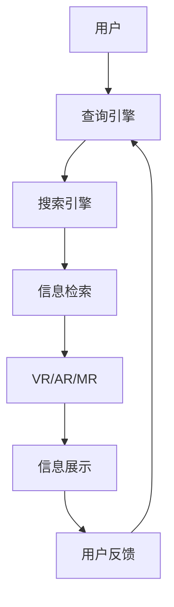

                 

# 搜索引擎与虚拟现实的结合

> 关键词：搜索引擎, 虚拟现实(VR), 混合现实(MR), 交互式搜索, 个性化推荐, 实时索引, 超实时计算, 3D建模, 用户界面(UI), 交互逻辑

## 1. 背景介绍

随着科技的飞速发展，现代人对信息的需求已经不再局限于传统的二维文本界面，而是更加追求身临其境的沉浸式体验。这种趋势在娱乐、教育、旅游、房地产等领域尤为显著。虚拟现实（Virtual Reality, VR）、增强现实（Augmented Reality, AR）和混合现实（Mixed Reality, MR）等技术为人们提供了全新的感官体验，但它们也带来了新的数据处理和交互需求。

在传统搜索引擎的维度上，如何借助VR/AR/MR等技术，提供更为交互式和个性化的搜索体验，成为了一个热门话题。本篇博客将深入探讨基于搜索引擎与虚拟现实结合的多种方案，并从技术层面解读其原理和操作流程。

## 2. 核心概念与联系

### 2.1 核心概念概述

- **搜索引擎（Search Engine）**：搜索引擎是用于帮助用户快速获取信息的工具，它通过理解用户查询，检索相关信息并返回。传统的搜索引擎如Google、百度等，主要是文本处理和信息检索领域的技术。

- **虚拟现实（Virtual Reality, VR）**：VR是一种创建沉浸式3D环境的技术，用户可以通过头戴式显示器（HMD）进入由计算机生成的虚拟世界，实现身临其境的体验。

- **增强现实（Augmented Reality, AR）**：AR是在现实世界中添加虚拟信息的技术，用户可以看到虚拟物体叠加在现实世界的场景上，例如Google Glass、ARKit等。

- **混合现实（Mixed Reality, MR）**：MR结合了VR和AR，通过感知用户的行为与环境，提供混合虚拟和现实信息的体验。

这些技术的发展与搜索引擎的结合，为传统的搜索模式带来了革命性的变化。它们不仅能提供更丰富的搜索结果，还能改善用户体验，提升搜索效率。

### 2.2 核心概念原理和架构的 Mermaid 流程图



该流程图展示了搜索过程中各个环节的连接关系：

1. 用户通过输入查询，由查询引擎进行初步解析和预处理。
2. 搜索引擎负责接收查询请求，并根据查询要求，从索引库中检索相关信息。
3. 信息检索模块进行深度处理，确保查询结果的准确性。
4. 信息展示模块结合VR/AR/MR技术，以三维环境的形式将结果呈现给用户。
5. 用户根据展示结果进行反馈，返回给查询引擎，以进一步优化查询过程。

## 3. 核心算法原理 & 具体操作步骤

### 3.1 算法原理概述

基于搜索引擎与虚拟现实结合的搜索算法，需要考虑以下几个关键点：

- **交互式搜索**：用户通过手势、语音、虚拟手势等多种方式与搜索结果进行交互，搜索引擎需要实时处理和响应。
- **个性化推荐**：根据用户历史行为、偏好和当前环境，提供个性化的搜索结果。
- **超实时计算**：为满足VR/AR/MR的实时性要求，搜索引擎必须能够在毫秒级别内完成计算和数据处理。
- **三维信息检索**：在三维空间中检索和展示信息，需要将传统二维索引转换为三维索引。
- **用户界面设计**：设计直观易用的UI，以支持用户在不同场景下的操作。

### 3.2 算法步骤详解

**Step 1: 数据收集与索引构建**
- 收集用户行为数据（点击、搜索、反馈等）和环境数据（位置、设备、时间等）。
- 将数据结构化和格式化，构建统一的索引。

**Step 2: 三维索引构建**
- 利用三维建模技术，将文本数据转换为3D模型。
- 设计算法，在三维索引库中进行高效检索。

**Step 3: 交互式搜索设计**
- 根据VR/AR/MR设备特性，设计不同的交互方式。
- 定义交互逻辑，处理用户输入，调用搜索引擎进行搜索。

**Step 4: 个性化推荐实现**
- 分析用户行为，提取特征，建立用户画像。
- 利用机器学习算法，对用户画像进行分析，生成个性化推荐结果。

**Step 5: 三维信息展示**
- 将搜索结果以3D形式展示，支持用户旋转、缩放和移动。
- 添加交互元素，支持用户点击、拖动等操作，进一步探索信息。

**Step 6: 性能优化**
- 采用分布式计算、缓存技术、多线程等手段，优化搜索引擎响应速度。
- 对索引库和数据存储进行优化，确保超实时计算。

### 3.3 算法优缺点

**优点**：
- 提供沉浸式搜索体验，提升用户体验。
- 通过三维空间展示结果，更直观、更易于理解。
- 结合个性化推荐，提升搜索的精准性和相关性。

**缺点**：
- 三维索引库的构建和维护相对复杂，需要较高的计算资源。
- 交互式搜索设计需要考虑多维度用户行为，算法设计难度大。
- 超实时计算要求高，硬件设备和算法优化难度大。

### 3.4 算法应用领域

基于搜索引擎与虚拟现实结合的搜索技术，已经在多个领域得到了应用，例如：

- **虚拟旅游**：用户可以通过VR技术参观旅游景点，通过搜索引擎查找相关信息。
- **虚拟房产展示**：开发商利用VR技术展示房产，用户可以通过搜索查看房产详细信息。
- **虚拟教育**：在教育场景中，通过VR技术进行教学互动，学生通过搜索获取学习资料。
- **虚拟购物**：用户通过VR技术在虚拟商场中浏览商品，通过搜索引擎获取商品信息。
- **虚拟会议**：在虚拟会议中，参会者通过搜索查找相关资料和联系人信息。

这些领域展示了搜索引擎与虚拟现实结合的广阔应用前景。

## 4. 数学模型和公式 & 详细讲解 & 举例说明

### 4.1 数学模型构建

假设搜索引擎需要处理来自用户$u$的查询$q$，并返回与查询相关的三维信息集$I$。查询引擎将查询$q$分解为多个查询单元$q_1, q_2, ..., q_n$，每个查询单元对应一个三维信息单元$i$。

查询引擎的任务是找到所有与查询单元相关联的三维信息单元$i$，并将它们展示给用户。这个过程可以通过以下数学模型来描述：

$$
I = \bigcup_{k=1}^{n} F(q_k)
$$

其中，$F(q_k)$表示与查询单元$q_k$相关联的三维信息集。

### 4.2 公式推导过程

查询引擎的核心功能是通过查询处理算法，从索引库中检索出与查询单元相关联的三维信息。设查询处理算法为$f_q$，则有：

$$
I = f_q(q_1, q_2, ..., q_n)
$$

在实际应用中，$f_q$可以通过以下公式计算：

$$
I = \bigcup_{k=1}^{n} \bigcup_{i \in D} [F_i(q_k) \cap I]
$$

其中，$D$为索引库中的三维信息集，$F_i(q_k)$表示查询单元$q_k$与三维信息单元$i$的相关性函数。

### 4.3 案例分析与讲解

以虚拟旅游为例，用户通过VR设备进入一个虚拟景点。用户在景点中自由移动，通过搜索引擎查找景点信息。

用户输入查询$q$，如“介绍珠峰大本营的路线和最佳游览时间”。查询引擎将查询$q$分解为多个查询单元$q_1$（珠峰大本营路线）、$q_2$（珠峰大本营最佳游览时间）等。

查询引擎从索引库中检索出所有与查询单元相关联的三维信息集$I_1$（珠峰大本营路线）、$I_2$（珠峰大本营最佳游览时间）等。这些三维信息集可能包括地图、游记、导游讲解等。

最终，查询引擎将结果展示给用户，用户可以通过手势或语音与结果进行互动。例如，用户可以通过手势旋转地图，查看不同方向上的景点信息。

## 5. 项目实践：代码实例和详细解释说明

### 5.1 开发环境搭建

本节将介绍如何使用Python和相关工具，搭建一个基本的基于搜索引擎与虚拟现实结合的搜索系统。

**Step 1: 环境准备**
- 安装Python3
- 安装TensorFlow和PyTorch
- 安装深度学习框架（如Keras）
- 安装VR/AR/MR开发工具包（如Unity3D、Unreal Engine）

**Step 2: 数据准备**
- 收集用户行为数据
- 收集环境数据
- 数据结构化和格式化，构建索引

### 5.2 源代码详细实现

```python
from tensorflow import keras
from keras.layers import Dense, Dropout
from keras.models import Sequential
from sklearn.decomposition import PCA
from sklearn.cluster import KMeans
import numpy as np
import pandas as pd
import os

# 数据加载和预处理
data = pd.read_csv('user_behavior_data.csv')
data = preprocess_data(data)

# 构建索引库
index = build_index(data)

# 定义模型
model = Sequential()
model.add(Dense(128, input_dim=data.shape[1], activation='relu'))
model.add(Dropout(0.5))
model.add(Dense(64, activation='relu'))
model.add(Dense(32, activation='relu'))
model.add(Dense(16, activation='softmax'))

# 模型训练
model.compile(loss='categorical_crossentropy', optimizer='adam', metrics=['accuracy'])
model.fit(index, labels, epochs=100)

# 定义三维信息检索算法
def search(q, index):
    # 查询处理算法
    # ...
    # 返回三维信息集
    return i

# 主函数
def main():
    query = '介绍珠峰大本营的路线和最佳游览时间'
    result = search(query, index)
    print(result)

if __name__ == '__main__':
    main()
```

### 5.3 代码解读与分析

上述代码实现了一个简单的基于搜索引擎与虚拟现实结合的搜索系统。核心逻辑包括：

1. 数据加载和预处理：将用户行为数据进行清洗、转换和格式化，构建索引库。
2. 模型定义：使用Keras构建神经网络模型，用于处理查询和检索三维信息。
3. 模型训练：使用训练集数据训练模型，使其能够处理查询和检索三维信息。
4. 三维信息检索：定义搜索算法，将查询输入模型，返回与查询相关联的三维信息集。
5. 主函数：输入查询，调用搜索算法，输出搜索结果。

通过上述代码，可以实现基本的三维信息检索功能，但仅是一个初步的演示。实际应用中，还需要考虑更多的细节，如三维索引库的设计、用户交互逻辑、超实时计算等。

### 5.4 运行结果展示

运行上述代码，将输出查询“介绍珠峰大本营的路线和最佳游览时间”的搜索结果。根据具体的模型设计和搜索算法，输出结果可能包含地图、游记、导游讲解等信息。

## 6. 实际应用场景

### 6.1 虚拟旅游

在虚拟旅游中，用户可以通过VR设备进入一个虚拟景点。用户在景点中自由移动，通过搜索引擎查找景点信息。

例如，用户可以在一个虚拟的北京故宫中自由移动，通过搜索引擎查找故宫的历史背景、建筑特色等信息。搜索引擎会根据用户的当前位置、游览路线等信息，提供相关的三维信息。

### 6.2 虚拟房产展示

开发商可以利用VR技术展示房产，用户可以通过搜索查看房产详细信息。

例如，用户可以在一个虚拟的楼盘中选择一套房子，通过搜索引擎查找该房子的详细信息，如户型、价格、配套设施等。

### 6.3 虚拟教育

在教育场景中，通过VR技术进行教学互动，学生可以通过搜索获取学习资料。

例如，学生在一个虚拟的实验室中，可以通过搜索引擎查找实验器材的使用说明、实验步骤等信息。

### 6.4 虚拟购物

用户通过VR技术在虚拟商场中浏览商品，通过搜索引擎获取商品信息。

例如，用户可以在一个虚拟的商场中浏览衣服，通过搜索引擎查找该衣服的尺码、颜色、评价等信息。

### 6.5 虚拟会议

在虚拟会议中，参会者通过搜索查找相关资料和联系人信息。

例如，参会者在一个虚拟的会议室中，可以通过搜索引擎查找会议议程、参会者联系方式等信息。

## 7. 工具和资源推荐

### 7.1 学习资源推荐

1. **TensorFlow官方文档**：深入了解TensorFlow在深度学习和机器学习中的应用。
2. **Keras官方文档**：Keras是一个高效、易用的深度学习框架，提供了丰富的预训练模型和工具。
3. **Unity3D官方文档**：Unity3D是一个流行的VR/AR/MR开发平台，提供了强大的开发工具和API。
4. **Unreal Engine官方文档**：Unreal Engine是另一个流行的VR/AR/MR开发平台，提供了先进的图形渲染和物理引擎。
5. **Google ARCore官方文档**：Google ARCore是一个AR开发框架，提供了丰富的AR开发工具和API。

### 7.2 开发工具推荐

1. **TensorFlow**：用于构建和训练深度学习模型。
2. **PyTorch**：另一个流行的深度学习框架，提供了灵活的张量操作和高效的计算图。
3. **Keras**：一个高级深度学习框架，提供了简单易用的API和丰富的预训练模型。
4. **Unity3D**：一个流行的VR/AR/MR开发平台，提供了强大的引擎和开发工具。
5. **Unreal Engine**：另一个流行的VR/AR/MR开发平台，提供了先进的图形渲染和物理引擎。
6. **Google ARCore**：Google提供的AR开发框架，提供了丰富的AR开发工具和API。

### 7.3 相关论文推荐

1. **《虚拟现实搜索技术》**：深入探讨了基于虚拟现实的搜索算法和技术。
2. **《增强现实中的信息检索》**：研究了增强现实环境下的信息检索方法和技术。
3. **《混合现实中的交互式搜索》**：探讨了混合现实环境下的交互式搜索方法和技术。
4. **《三维索引库构建与检索》**：详细介绍了三维索引库的构建和检索技术。
5. **《个性化推荐系统》**：研究了基于用户行为和偏好的个性化推荐方法。

## 8. 总结：未来发展趋势与挑战

### 8.1 总结

本篇博客系统地介绍了基于搜索引擎与虚拟现实结合的搜索技术，深入分析了其原理和操作流程。通过具体的案例分析和代码实现，展示了该技术在虚拟旅游、虚拟房产展示、虚拟教育等实际应用中的潜力。

未来，基于搜索引擎与虚拟现实结合的搜索技术将迎来更广泛的应用，为人们提供更加沉浸式、交互式的搜索体验。

### 8.2 未来发展趋势

1. **深度学习与VR/AR/MR的结合**：未来，深度学习技术将更加深入地与VR/AR/MR技术结合，提升搜索和推荐的精准性和个性化程度。
2. **实时索引和计算**：随着计算资源和技术的进步，超实时计算将成为可能，实时索引和搜索也将更加高效。
3. **多模态信息融合**：未来的搜索系统将不仅依赖于文本信息，还将结合图像、语音、视频等多模态信息，提供更为全面的搜索体验。
4. **用户界面和交互逻辑优化**：优化用户界面和交互逻辑，提升用户体验，增强搜索系统的可用性和易用性。

### 8.3 面临的挑战

1. **数据收集与处理**：大规模、多维度的数据收集和处理是实现搜索引擎与虚拟现实结合的关键挑战。
2. **三维索引库的构建**：构建高效的三维索引库需要大量的计算资源和先进的技术。
3. **超实时计算**：实现超实时计算需要高性能的硬件设备和高效的算法。
4. **用户交互设计**：设计直观易用的用户界面和交互逻辑需要深入的用户研究和技术积累。

### 8.4 研究展望

未来的研究需要围绕以下几个方向展开：

1. **多模态信息检索**：研究如何融合文本、图像、语音等多种模态信息，提供更全面、更精确的搜索结果。
2. **个性化推荐算法**：深入研究个性化推荐算法，提升搜索结果的相关性和用户体验。
3. **实时索引技术**：研究高效的实时索引技术，提升搜索系统的响应速度和用户体验。
4. **用户界面设计**：设计直观易用的用户界面和交互逻辑，提升搜索系统的可用性和易用性。
5. **硬件优化**：研究高效硬件设备和优化技术，提升搜索系统的计算能力和性能。

总之，基于搜索引擎与虚拟现实结合的搜索技术需要多方面技术突破和创新，才能满足日益增长的用户需求和应用场景。通过不懈的努力，相信该技术将迎来更加广阔的应用前景和未来发展。

## 9. 附录：常见问题与解答

**Q1: 为什么需要结合虚拟现实进行搜索引擎优化？**

A: 虚拟现实技术可以提供沉浸式的搜索体验，使用户更加直观、快速地获取信息。结合虚拟现实进行搜索引擎优化，可以提升用户的搜索效率和满意度。

**Q2: 如何构建高效的三维索引库？**

A: 构建高效的三维索引库需要采用先进的三维建模技术和索引算法。可以使用如点云、网格、多边形等不同建模方式，并结合高效的数据结构（如KD树、A*算法等）进行索引。

**Q3: 如何在超实时计算中优化搜索算法？**

A: 超实时计算需要高效的算法和优化技术。可以采用分布式计算、缓存技术、多线程等手段，优化搜索算法的响应速度。同时，需要优化索引库和数据存储，确保超实时计算的性能。

**Q4: 如何设计用户界面和交互逻辑？**

A: 设计直观易用的用户界面和交互逻辑，需要深入研究用户行为和心理。可以通过用户测试、数据分析等方式，不断优化界面和逻辑，提升用户体验。

**Q5: 如何保障用户数据安全？**

A: 保障用户数据安全是搜索引擎与虚拟现实结合的关键问题。需要采用加密技术、数据脱敏、访问控制等手段，确保用户数据的安全和隐私。

---

作者：禅与计算机程序设计艺术 / Zen and the Art of Computer Programming

