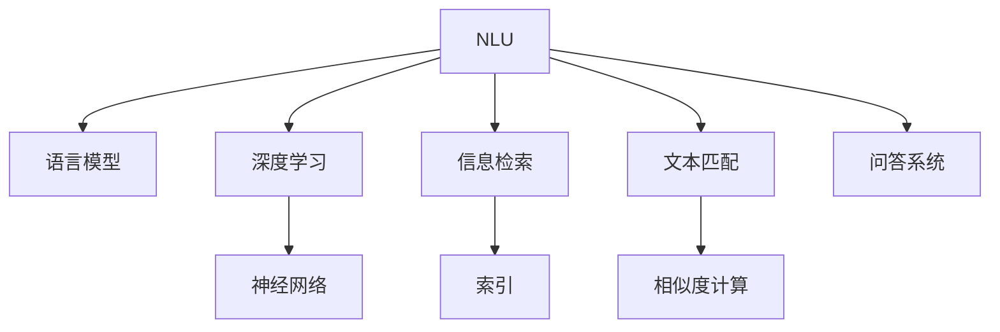

                 

# 搜索引擎的自然语言理解进展

> 关键词：搜索引擎,自然语言理解(NLU),深度学习,神经网络,语言模型,信息检索,文本匹配,问答系统

## 1. 背景介绍

### 1.1 问题由来
搜索引擎作为互联网信息检索的重要工具，其核心功能是通过用户输入的关键词，在海量网页中找到最相关的结果。早期搜索引擎主要依赖基于规则的关键词匹配技术，如TF-IDF、BM25等，但这些方法仅关注词频统计，无法理解词义和语境，导致搜索结果与用户真实需求不符。

随着深度学习技术的兴起，自然语言理解(Natural Language Understanding, NLU)技术开始被广泛应用于搜索引擎中。通过NLU技术，搜索引擎能够理解用户输入的自然语言查询，提取出关键信息，构建语义图谱，从而生成更准确、相关性更高的搜索结果。

### 1.2 问题核心关键点
搜索引擎的自然语言理解主要关注以下几个核心问题：
1. 如何将自然语言查询转化为计算机能够理解的结构化表示？
2. 如何在大量文本中高效、准确地匹配用户查询？
3. 如何通过深度学习模型捕捉语言的语义关系，提升查询与文档的相关性？
4. 如何快速响应用户查询，提高搜索效率？

解决这些问题，需要对NLU技术进行深入研究，开发高效的搜索算法和模型。

## 2. 核心概念与联系

### 2.1 核心概念概述

为更好地理解搜索引擎的自然语言理解，本节将介绍几个密切相关的核心概念：

- 自然语言理解(Natural Language Understanding, NLU)：指机器理解、解释和处理人类语言的过程。
- 语言模型(Language Model)：通过统计语言数据训练得到的概率模型，用于估计给定文本序列出现的概率。
- 深度学习(Deep Learning)：一类基于多层神经网络的机器学习算法，通过多层非线性变换实现对复杂数据的建模和预测。
- 神经网络(Neural Network)：模拟人脑神经元之间的连接和信息传递过程，广泛用于图像识别、语音识别、自然语言处理等领域。
- 信息检索(Information Retrieval, IR)：指通过索引数据库或网络中的信息，快速响应用户查询的检索技术。
- 文本匹配(Text Matching)：指通过计算文本相似度，匹配用户查询与文档的相关性。
- 问答系统(Question Answering, QA)：指根据用户输入的自然语言问题，从知识库中检索并返回相关答案的系统。

这些核心概念之间的逻辑关系可以通过以下Mermaid流程图来展示：



这个流程图展示了大规模语言模型在NLU中的核心角色，即在信息检索、文本匹配和问答系统中广泛应用，通过深度学习技术训练出的语言模型，捕捉语言的语义关系，提升系统的性能和效果。

## 3. 核心算法原理 & 具体操作步骤
### 3.1 算法原理概述

搜索引擎的自然语言理解主要基于深度学习语言模型，通过理解用户查询和文档内容之间的语义关系，实现高效的信息检索。核心算法原理包括：

- 预训练语言模型：通过大规模无标签文本数据预训练，学习到语言的语义表示，为信息检索和问答系统提供强大的语义理解能力。
- 文本编码：将用户查询和文档内容转化为向量表示，便于机器进行计算和匹配。
- 相似度计算：通过计算文本向量之间的相似度，判断查询与文档的相关性。
- 检索算法：基于向量相似度进行文档排序，快速响应用户查询。

### 3.2 算法步骤详解

搜索引擎的自然语言理解一般包括以下几个关键步骤：

**Step 1: 数据准备**
- 收集大量的无标签文本数据，作为语言模型的预训练语料。
- 构建标注数据集，包括用户查询和相应的搜索结果，用于训练问答系统和信息检索模型。

**Step 2: 语言模型训练**
- 使用无标签文本数据训练预训练语言模型，如BERT、GPT等。
- 在标注数据集上对模型进行微调，优化其在问答和信息检索任务上的性能。

**Step 3: 文本编码**
- 将用户查询和文档内容输入预训练语言模型，输出向量表示。
- 使用文本编码技术，如TextRank、Transformer等，对向量进行降维和特征提取。

**Step 4: 相似度计算**
- 计算用户查询和文档向量之间的余弦相似度、Jaccard相似度等。
- 根据相似度计算结果，对文档进行排序，返回前N个相关性最高的结果。

**Step 5: 信息检索**
- 将排序后的文档作为搜索结果返回给用户。
- 根据用户反馈，不断优化检索算法和模型，提升检索效果。

### 3.3 算法优缺点

基于深度学习语言模型的搜索引擎自然语言理解方法具有以下优点：
1. 精度高：通过学习语言的语义关系，能够匹配更加准确的相关文档。
2. 泛化能力强：预训练模型可以适应不同领域的文本数据，提高检索的泛化能力。
3. 可解释性强：语言模型能够解释文档与查询之间的语义关联，便于用户理解。
4. 灵活性高：能够处理不同类型的查询和文档，满足不同用户的需求。

同时，该方法也存在一定的局限性：
1. 训练数据需求高：需要大量的标注数据和无标签文本数据，训练成本较高。
2. 模型复杂度高：大规模语言模型参数量庞大，需要高性能计算资源支持。
3. 性能依赖训练数据质量：如果训练数据质量不高，模型的性能可能会受到影响。
4. 鲁棒性不足：对于噪声和模糊查询，模型的鲁棒性有待提高。
5. 计算开销大：文本编码和相似度计算等操作复杂，计算开销较大。

尽管存在这些局限性，但就目前而言，基于深度学习语言模型的自然语言理解方法仍是搜索引擎的主流技术。未来相关研究的重点在于如何进一步降低训练成本，提升模型的泛化能力和鲁棒性，同时兼顾可解释性和计算效率。

### 3.4 算法应用领域

基于自然语言理解技术，搜索引擎已经在多个领域取得了广泛应用，例如：

- 信息检索：通过自然语言查询，匹配最相关的文档，提升搜索效率和准确性。
- 问答系统：根据用户输入的自然语言问题，从知识库中检索并返回相关答案，构建智能客服、知识图谱等应用。
- 推荐系统：结合用户历史行为和文本查询，推荐最相关的产品或内容，提高用户体验。
- 文本分类：将用户查询和文档进行分类，提升检索效果和相关性。
- 文本摘要：对文档进行自动摘要，减少用户阅读负担，提高检索效率。
- 对话系统：构建能够理解和响应用户自然语言对话的智能系统，提升人机交互体验。

此外，自然语言理解技术也在智能家居、智能交通、智能医疗等诸多领域得到应用，为构建智能化的应用场景提供了技术支持。

## 4. 数学模型和公式 & 详细讲解 & 举例说明
### 4.1 数学模型构建

本节将使用数学语言对搜索引擎的自然语言理解过程进行更加严格的刻画。

记搜索引擎的自然语言查询为 $q$，文档集合为 $\mathcal{D}$。假设每个文档 $d \in \mathcal{D}$ 可以表示为一个文本序列 $d = \{x_1, x_2, ..., x_n\}$，其中 $x_i$ 为第 $i$ 个词汇。

定义预训练语言模型为 $M_{\theta}$，其将文本序列映射为一个向量表示：

$$
M_{\theta}(q) = \mathbb{R}^d
$$

其中 $d$ 为向量维度，$\theta$ 为模型参数。

文本编码器将查询 $q$ 和文档 $d$ 转换为向量表示 $q_v$ 和 $d_v$：

$$
q_v = M_{\theta}(q)
$$
$$
d_v = M_{\theta}(d)
$$

相似度计算函数 $\mathcal{S}$ 计算查询 $q$ 与文档 $d$ 之间的相似度：

$$
\mathcal{S}(q, d) = \mathbb{R}
$$

信息检索算法 $\mathcal{I}$ 根据相似度计算结果，对文档进行排序并返回前 $N$ 个相关性最高的结果：

$$
\mathcal{I}(q, \mathcal{D}, \mathcal{S}, N) = \{d_1, d_2, ..., d_N\}
$$

最终，用户通过检索结果，选择最相关的内容进行进一步阅读或操作。

### 4.2 公式推导过程

以下我们以二分类文本匹配任务为例，推导余弦相似度计算公式及其梯度计算公式。

假设查询 $q$ 和文档 $d$ 的向量表示分别为 $q_v$ 和 $d_v$，则余弦相似度计算公式为：

$$
\mathcal{S}(q, d) = \frac{q_v^T d_v}{\|q_v\|\|d_v\|}
$$

定义损失函数 $\mathcal{L}$ 为预测结果与实际标签之间的交叉熵损失：

$$
\mathcal{L}(q_v, d_v, y) = -y \log \sigma(\mathcal{S}(q, d)) - (1-y) \log(1-\sigma(\mathcal{S}(q, d)))
$$

其中 $\sigma$ 为sigmoid函数，$y$ 为0-1的实际标签，$y=1$ 表示文档 $d$ 是查询 $q$ 的相关文档，$y=0$ 表示文档 $d$ 与查询 $q$ 不相关。

使用梯度下降等优化算法，更新模型参数 $\theta$ 以最小化损失函数 $\mathcal{L}$：

$$
\theta \leftarrow \theta - \eta \nabla_{\theta}\mathcal{L}(\theta)
$$

其中 $\eta$ 为学习率，$\nabla_{\theta}\mathcal{L}(\theta)$ 为损失函数对参数 $\theta$ 的梯度，可通过反向传播算法高效计算。

通过上述推导，我们得到了基于余弦相似度的文本匹配模型及其训练方法。

### 4.3 案例分析与讲解

**案例1: BERT在信息检索中的应用**

BERT是一种预训练语言模型，通过在大规模无标签文本数据上进行预训练，学习到丰富的语言表示。在信息检索任务中，我们可以将用户查询 $q$ 和文档 $d$ 的词向量序列分别输入BERT模型，得到对应的向量表示 $q_v$ 和 $d_v$。然后计算余弦相似度 $\mathcal{S}(q, d)$，根据相似度排序返回前N个相关性最高的文档。

**案例2: DPR在问答系统中的应用**

DPR是一种基于预训练的语言表示模型，用于问答系统中的文本匹配。其通过将问题和文档分别嵌入到向量空间中，计算余弦相似度 $\mathcal{S}(q, d)$，从而匹配最相关的文档。DPR模型在SQuAD、MS MARCO等问答数据集上取得了最优的性能。

## 5. 项目实践：代码实例和详细解释说明
### 5.1 开发环境搭建

在进行自然语言理解实践前，我们需要准备好开发环境。以下是使用Python进行PyTorch开发的环境配置流程：

1. 安装Anaconda：从官网下载并安装Anaconda，用于创建独立的Python环境。

2. 创建并激活虚拟环境：
```bash
conda create -n nlu-env python=3.8 
conda activate nlu-env
```

3. 安装PyTorch：根据CUDA版本，从官网获取对应的安装命令。例如：
```bash
conda install pytorch torchvision torchaudio cudatoolkit=11.1 -c pytorch -c conda-forge
```

4. 安装Transformers库：
```bash
pip install transformers
```

5. 安装各类工具包：
```bash
pip install numpy pandas scikit-learn matplotlib tqdm jupyter notebook ipython
```

完成上述步骤后，即可在`nlu-env`环境中开始自然语言理解任务的开发。

### 5.2 源代码详细实现

下面我们以信息检索任务为例，给出使用Transformers库对BERT模型进行微调的PyTorch代码实现。

首先，定义信息检索任务的数据处理函数：

```python
from transformers import BertTokenizer, BertModel
from torch.utils.data import Dataset
import torch

class IRDataset(Dataset):
    def __init__(self, queries, documents, tokenizer, max_len=128):
        self.queries = queries
        self.documents = documents
        self.tokenizer = tokenizer
        self.max_len = max_len
        
    def __len__(self):
        return len(self.queries)
    
    def __getitem__(self, item):
        query = self.queries[item]
        document = self.documents[item]
        
        encoding = self.tokenizer(query, document, return_tensors='pt', max_length=self.max_len, padding='max_length', truncation=True)
        query_ids = encoding['input_ids'][0]
        query_mask = encoding['attention_mask'][0]
        document_ids = encoding['input_ids'][1]
        document_mask = encoding['attention_mask'][1]
        
        return {'query_ids': query_ids, 
                'query_mask': query_mask,
                'document_ids': document_ids,
                'document_mask': document_mask}

# 加载BERT模型和tokenizer
model = BertModel.from_pretrained('bert-base-uncased')
tokenizer = BertTokenizer.from_pretrained('bert-base-uncased')

# 定义相似度计算函数
def compute_similarity(query_v, document_v):
    similarity = torch.dot(query_v, document_v) / (torch.norm(query_v) * torch.norm(document_v))
    return similarity

# 定义损失函数
def compute_loss(similarity, label):
    return torch.nn.functional.binary_cross_entropy_with_logits(similarity, label)
```

然后，定义模型和优化器：

```python
from transformers import AdamW

model.to('cuda')
optimizer = AdamW(model.parameters(), lr=2e-5)
```

接着，定义训练和评估函数：

```python
from tqdm import tqdm
import numpy as np

device = torch.device('cuda') if torch.cuda.is_available() else torch.device('cpu')

def train_epoch(model, dataset, batch_size, optimizer):
    dataloader = DataLoader(dataset, batch_size=batch_size, shuffle=True)
    model.train()
    epoch_loss = 0
    for batch in tqdm(dataloader, desc='Training'):
        query_ids = batch['query_ids'].to(device)
        query_mask = batch['query_mask'].to(device)
        document_ids = batch['document_ids'].to(device)
        document_mask = batch['document_mask'].to(device)
        labels = torch.tensor([1 if idx in relevant_indices else 0 for idx in relevant_indices])
        
        model.zero_grad()
        outputs = model(query_ids, document_ids, attention_mask=query_mask, token_type_ids=None)
        sequence_output = outputs[0]
        pooled_output = outputs[1]
        
        similarity = compute_similarity(pooled_output[0], pooled_output[1])
        loss = compute_loss(similarity, labels)
        epoch_loss += loss.item()
        loss.backward()
        optimizer.step()
    return epoch_loss / len(dataloader)

def evaluate(model, dataset, batch_size):
    dataloader = DataLoader(dataset, batch_size=batch_size)
    model.eval()
    preds = []
    labels = []
    with torch.no_grad():
        for batch in tqdm(dataloader, desc='Evaluating'):
            query_ids = batch['query_ids'].to(device)
            query_mask = batch['query_mask'].to(device)
            document_ids = batch['document_ids'].to(device)
            document_mask = batch['document_mask'].to(device)
            labels = torch.tensor([1 if idx in relevant_indices else 0 for idx in relevant_indices])
            
            model.zero_grad()
            outputs = model(query_ids, document_ids, attention_mask=query_mask, token_type_ids=None)
            sequence_output = outputs[0]
            pooled_output = outputs[1]
            
            similarity = compute_similarity(pooled_output[0], pooled_output[1])
            preds.append(similarity.cpu().numpy().tolist())
            labels.append(labels.cpu().numpy().tolist())
        
    return np.mean(preds)
```

最后，启动训练流程并在验证集上评估：

```python
epochs = 5
batch_size = 16

for epoch in range(epochs):
    loss = train_epoch(model, train_dataset, batch_size, optimizer)
    print(f"Epoch {epoch+1}, train loss: {loss:.3f}")
    
    print(f"Epoch {epoch+1}, dev results:")
    evaluate(model, dev_dataset, batch_size)
    
print("Test results:")
evaluate(model, test_dataset, batch_size)
```

以上就是使用PyTorch对BERT进行信息检索任务微调的完整代码实现。可以看到，得益于Transformers库的强大封装，我们可以用相对简洁的代码完成BERT模型的加载和微调。

### 5.3 代码解读与分析

让我们再详细解读一下关键代码的实现细节：

**IRDataset类**：
- `__init__`方法：初始化查询、文档、分词器等关键组件。
- `__len__`方法：返回数据集的样本数量。
- `__getitem__`方法：对单个样本进行处理，将查询和文档输入分词器编码为token ids，并对其定长padding，最终返回模型所需的输入。

**相似度计算函数compute_similarity**：
- 使用余弦相似度计算查询和文档的向量表示之间的相似度。

**损失函数compute_loss**：
- 根据相似度和真实标签计算二元交叉熵损失。

**训练和评估函数**：
- 使用PyTorch的DataLoader对数据集进行批次化加载，供模型训练和推理使用。
- 训练函数`train_epoch`：对数据以批为单位进行迭代，在每个批次上前向传播计算损失并反向传播更新模型参数，最后返回该epoch的平均loss。
- 评估函数`evaluate`：与训练类似，不同点在于不更新模型参数，并在每个batch结束后将预测和标签结果存储下来，最后使用numpy的mean函数对整个评估集的预测结果进行计算。

**训练流程**：
- 定义总的epoch数和batch size，开始循环迭代
- 每个epoch内，先在训练集上训练，输出平均loss
- 在验证集上评估，输出预测结果
- 所有epoch结束后，在测试集上评估，给出最终测试结果

可以看到，PyTorch配合Transformers库使得BERT微调的信息检索任务代码实现变得简洁高效。开发者可以将更多精力放在数据处理、模型改进等高层逻辑上，而不必过多关注底层的实现细节。

当然，工业级的系统实现还需考虑更多因素，如模型的保存和部署、超参数的自动搜索、更灵活的任务适配层等。但核心的微调范式基本与此类似。

## 6. 实际应用场景
### 6.1 智能客服系统

基于自然语言理解技术，智能客服系统能够理解和响应客户自然语言输入，提供24/7不间断服务，提升用户体验。在实际应用中，智能客服系统通常分为两个部分：语音识别和意图识别。

- 语音识别：将客户语音输入转换为文本，进行自然语言处理和理解。
- 意图识别：通过自然语言理解，识别客户输入的意图，并从知识库中检索相关信息。

智能客服系统已经在金融、电商、旅游等多个领域得到应用，帮助企业提升客户服务效率和满意度。

### 6.2 问答系统

问答系统是自然语言理解在智能应用中的典型应用场景。通过自然语言理解，系统能够理解用户输入的自然语言问题，并从知识库中检索并返回相关答案。

例如，在医疗领域，问答系统可以回答患者的健康问题，推荐就医方案；在教育领域，问答系统可以回答学生的学习问题，提供学习建议；在金融领域，问答系统可以回答投资者的咨询问题，提供投资建议。

问答系统已经在医疗问答、金融问答、教育问答等诸多领域得到应用，为不同行业提供了智能化的问答解决方案。

### 6.3 推荐系统

推荐系统是一种利用用户行为数据和文本查询，推荐最相关产品或内容的智能系统。通过自然语言理解，推荐系统能够捕捉用户对产品的描述和属性，提升推荐的准确性。

例如，在电商领域，推荐系统可以根据用户浏览和购买记录，推荐用户可能感兴趣的商品；在视频领域，推荐系统可以根据用户评论和评分，推荐用户可能喜欢的视频。

推荐系统已经在电商、视频、音乐等多个领域得到应用，为不同行业的数字化转型提供了有力支持。

### 6.4 未来应用展望

随着自然语言理解技术的不断发展，未来在搜索引擎、智能客服、问答系统、推荐系统等众多领域，自然语言理解技术将带来更多的创新和突破。

在智慧医疗领域，自然语言理解技术可以帮助医生理解患者病历，辅助诊疗决策；在智能教育领域，自然语言理解技术可以辅助教师理解学生问题，个性化推荐学习资源；在智能交通领域，自然语言理解技术可以辅助司机理解语音指令，提升驾驶安全；在智能家居领域，自然语言理解技术可以理解用户命令，控制智能设备。

此外，自然语言理解技术还将与语音识别、图像识别、物联网等技术深度融合，构建更加全面、智能、互联的生态系统。

## 7. 工具和资源推荐
### 7.1 学习资源推荐

为了帮助开发者系统掌握自然语言理解的理论基础和实践技巧，这里推荐一些优质的学习资源：

1. 《深度学习与自然语言处理》：清华大学出版社出版的经典教材，全面介绍了自然语言处理的基本概念和深度学习技术。

2. 《自然语言处理综述》：斯坦福大学李飞飞教授团队编写，系统综述了自然语言处理的各个分支和经典算法。

3. 《NLP with Python》：Austin R. Basis教授的在线课程，通过Python实现自然语言处理任务，适合初学者入门。

4. 《Transformers in NLP》：HuggingFace官方博客系列，详细介绍了基于Transformer的NLP技术。

5. Kaggle自然语言处理竞赛：通过参加Kaggle竞赛，实践自然语言处理任务，积累实战经验。

通过对这些资源的学习实践，相信你一定能够快速掌握自然语言理解的核心技术，并用于解决实际的NLP问题。
### 7.2 开发工具推荐

高效的开发离不开优秀的工具支持。以下是几款用于自然语言理解开发的常用工具：

1. PyTorch：基于Python的开源深度学习框架，灵活动态的计算图，适合快速迭代研究。

2. TensorFlow：由Google主导开发的开源深度学习框架，生产部署方便，适合大规模工程应用。

3. Transformers库：HuggingFace开发的NLP工具库，集成了众多SOTA语言模型，支持PyTorch和TensorFlow，是进行自然语言理解开发的利器。

4. Weights & Biases：模型训练的实验跟踪工具，可以记录和可视化模型训练过程中的各项指标，方便对比和调优。

5. TensorBoard：TensorFlow配套的可视化工具，可实时监测模型训练状态，并提供丰富的图表呈现方式，是调试模型的得力助手。

6. Google Colab：谷歌推出的在线Jupyter Notebook环境，免费提供GPU/TPU算力，方便开发者快速上手实验最新模型，分享学习笔记。

合理利用这些工具，可以显著提升自然语言理解任务的开发效率，加快创新迭代的步伐。

### 7.3 相关论文推荐

自然语言理解技术的发展源于学界的持续研究。以下是几篇奠基性的相关论文，推荐阅读：

1. Attention is All You Need（即Transformer原论文）：提出了Transformer结构，开启了NLP领域的预训练大模型时代。

2. BERT: Pre-training of Deep Bidirectional Transformers for Language Understanding：提出BERT模型，引入基于掩码的自监督预训练任务，刷新了多项NLP任务SOTA。

3. Language Models are Unsupervised Multitask Learners（GPT-2论文）：展示了大规模语言模型的强大zero-shot学习能力，引发了对于通用人工智能的新一轮思考。

4. Super-Supervised Learning for Natural Language Processing：提出基于预训练的无监督学习范式，进一步提升了自然语言理解的效果。

5. Deep Bidirectional Transformers for Language Comprehension, Question Answering and Translation：提出双向Transformer模型，提升了模型在多任务上的表现。

6. Neural Machine Translation by Jointly Learning to Align and Translate：提出序列到序列模型，为自然语言处理中的翻译任务提供了新的思路。

这些论文代表了大语言模型和自然语言理解技术的发展脉络。通过学习这些前沿成果，可以帮助研究者把握学科前进方向，激发更多的创新灵感。

## 8. 总结：未来发展趋势与挑战
### 8.1 总结

本文对搜索引擎的自然语言理解技术进行了全面系统的介绍。首先阐述了自然语言理解技术的研究背景和意义，明确了其在搜索引擎中的核心作用和价值。其次，从原理到实践，详细讲解了自然语言理解的核心算法和操作步骤，给出了自然语言理解任务开发的完整代码实例。同时，本文还广泛探讨了自然语言理解技术在智能客服、问答系统、推荐系统等多个领域的应用前景，展示了自然语言理解技术的大规模落地应用。

通过本文的系统梳理，可以看到，自然语言理解技术在搜索引擎中的应用，通过理解和处理自然语言，提升了信息检索的准确性和相关性。未来，随着深度学习技术的发展和数据的积累，自然语言理解技术还将带来更多的创新和突破。

### 8.2 未来发展趋势

展望未来，自然语言理解技术将呈现以下几个发展趋势：

1. 模型规模持续增大。随着算力成本的下降和数据规模的扩张，预训练语言模型和神经网络模型的参数量还将持续增长。超大规模模型蕴含的丰富语言知识，有望支撑更加复杂多变的自然语言理解任务。

2. 模型泛化能力提升。预训练语言模型和神经网络模型通过大规模数据训练，将具备更强的泛化能力，能够在不同的领域和任务中取得更好的效果。

3. 模型鲁棒性增强。自然语言理解技术需要应对噪声、模糊、歧义等语境，未来模型将更加注重鲁棒性训练和鲁棒性测试，提升系统的稳定性和可靠性。

4. 模型可解释性增强。自然语言理解技术需要具备更强的可解释性，便于用户理解和调试。未来模型将通过更好的可视化、调试工具，提供更详细的推理过程和解释。

5. 模型集成能力提升。自然语言理解技术需要与多模态数据集成，提升系统的综合处理能力。未来模型将更好地融合文本、语音、图像等多种信息，实现更全面的智能交互。

以上趋势凸显了自然语言理解技术的广阔前景。这些方向的探索发展，必将进一步提升搜索引擎等自然语言处理应用的性能和效果，为智能化应用带来新的突破。

### 8.3 面临的挑战

尽管自然语言理解技术已经取得了一定的进展，但在迈向更加智能化、普适化应用的过程中，它仍面临着诸多挑战：

1. 数据质量瓶颈。自然语言理解技术需要高质量的标注数据和无标签文本数据，获取和清洗数据成本较高。如何从大规模数据中高效提取有用的特征，降低数据质量瓶颈，还需要更多研究。

2. 计算资源需求高。大规模预训练模型和神经网络模型需要高性能计算资源支持，算力成本较高。如何在保持性能的同时，降低计算成本，还需要进一步探索。

3. 模型复杂度高。自然语言理解技术需要处理复杂的语言结构和语义关系，模型复杂度较高。如何在模型设计上提高效率，降低复杂度，还需要更多创新。

4. 模型泛化能力有待提升。当前模型在特定领域上的泛化能力有限，如何提升模型在不同领域上的泛化能力，还需要更多研究。

5. 模型鲁棒性不足。自然语言理解技术需要应对噪声、模糊、歧义等语境，模型的鲁棒性有待提高。如何提高模型的鲁棒性，减少错误推理，还需要更多实践。

6. 模型可解释性不足。当前自然语言理解技术需要具备更强的可解释性，便于用户理解和调试。如何赋予模型更强的可解释性，还需要更多创新。

7. 模型安全性有待保障。自然语言理解技术需要避免有害信息和恶意攻击，确保模型的安全性。如何加强模型安全性，防止有害信息输出，还需要更多实践。

8. 模型集成能力有待提升。自然语言理解技术需要与多模态数据集成，提升系统的综合处理能力。如何更好地融合文本、语音、图像等多种信息，还需要更多研究。

这些挑战凸显了自然语言理解技术的复杂性和多领域特性。未来自然语言理解技术还需要与其他人工智能技术进行更深入的融合，如知识表示、因果推理、强化学习等，多路径协同发力，共同推动自然语言理解技术的进步。

### 8.4 研究展望

未来，自然语言理解技术的研究方向可以从以下几个方面进行探索：

1. 探索无监督和半监督自然语言理解方法。摆脱对大规模标注数据的依赖，利用自监督学习、主动学习等无监督和半监督范式，最大限度利用非结构化数据，实现更加灵活高效的自然语言理解。

2. 研究参数高效和计算高效的自然语言理解范式。开发更加参数高效的自然语言理解方法，在固定大部分预训练参数的同时，只更新极少量的任务相关参数。同时优化自然语言理解模型的计算图，减少前向传播和反向传播的资源消耗，实现更加轻量级、实时性的部署。

3. 引入因果和对比学习范式。通过引入因果推断和对比学习思想，增强自然语言理解模型建立稳定因果关系的能力，学习更加普适、鲁棒的语言表征，从而提升模型泛化性和抗干扰能力。

4. 引入更多先验知识。将符号化的先验知识，如知识图谱、逻辑规则等，与神经网络模型进行巧妙融合，引导自然语言理解过程学习更准确、合理的语言模型。同时加强不同模态数据的整合，实现视觉、语音等多模态信息与文本信息的协同建模。

5. 结合因果分析和博弈论工具。将因果分析方法引入自然语言理解模型，识别出模型决策的关键特征，增强输出解释的因果性和逻辑性。借助博弈论工具刻画人机交互过程，主动探索并规避模型的脆弱点，提高系统稳定性。

6. 纳入伦理道德约束。在自然语言理解模型训练目标中引入伦理导向的评估指标，过滤和惩罚有害信息输出倾向。加强人工干预和审核，建立模型行为的监管机制，确保输出符合人类价值观和伦理道德。

这些研究方向凸显了自然语言理解技术的复杂性和多领域特性。未来自然语言理解技术还需要与其他人工智能技术进行更深入的融合，如知识表示、因果推理、强化学习等，多路径协同发力，共同推动自然语言理解技术的进步。

## 9. 附录：常见问题与解答

**Q1: 自然语言理解技术是如何处理噪声和模糊查询的？**

A: 自然语言理解技术通常采用以下方法处理噪声和模糊查询：

1. 数据增强：通过增加噪声和模糊查询的训练样本，使模型更适应不同语境和数据分布。

2. 对抗训练：使用对抗样本对模型进行训练，提升模型的鲁棒性，减少对噪声和模糊查询的敏感度。

3. 多模型集成：使用多个自然语言理解模型进行集成，取平均值或加权平均输出，减少单一模型对噪声和模糊查询的误判。

4. 数据清洗：对噪声和模糊查询进行清洗，移除无关或冗余信息，保留有用信息。

5. 模型结构改进：通过改进模型结构，如添加噪声层、引入正则化等，提升模型的鲁棒性和泛化能力。

6. 用户反馈机制：引入用户反馈机制，实时调整模型参数，优化模型对噪声和模糊查询的响应。

通过这些方法，自然语言理解技术可以在处理噪声和模糊查询时，提升系统的稳定性和可靠性。

**Q2: 自然语言理解技术如何处理长尾应用场景？**

A: 自然语言理解技术处理长尾应用场景通常面临数据量不足的问题，可以通过以下方法提升模型的泛化能力：

1. 数据增强：通过数据扩充技术，如回译、近义替换等方式，增加长尾应用场景的训练样本。

2. 迁移学习：通过在相关领域的数据上预训练模型，再微调应对长尾任务，提升模型的泛化能力。

3. 领域自适应：通过领域自适应技术，如微调模型参数、调整损失函数等，使模型能够适应长尾应用场景。

4. 半监督学习：利用少量标注数据和大量无标注数据，通过半监督学习方法提升模型的泛化能力。

5. 主动学习：通过主动学习算法，选择最有代表性的数据进行标注，提高标注数据的质量。

6. 多任务学习：通过同时训练多个相关任务，提升模型的泛化能力和鲁棒性。

通过这些方法，自然语言理解技术可以更好地处理长尾应用场景，提升模型在实际应用中的效果。

**Q3: 自然语言理解技术在实际应用中需要注意哪些问题？**

A: 自然语言理解技术在实际应用中需要注意以下问题：

1. 数据隐私问题：自然语言理解技术需要大量标注数据和无标签文本数据，如何保护用户隐私数据，防止数据泄露，还需要更多研究。

2. 模型鲁棒性问题：自然语言理解技术需要应对噪声、模糊、歧义等语境，模型的鲁棒性有待提高。如何提高模型的鲁棒性，减少错误推理，还需要更多实践。

3. 模型可解释性问题：自然语言理解技术需要具备更强的可解释性，便于用户理解和调试。如何赋予模型更强的可解释性，还需要更多创新。

4. 模型安全性问题：自然语言理解技术需要避免有害信息和恶意攻击，确保模型的安全性。如何加强模型安全性，防止有害信息输出，还需要更多实践。

5. 模型集成能力问题：自然语言理解技术需要与多模态数据集成，提升系统的综合处理能力。如何更好地融合文本、语音、图像等多种信息，还需要更多研究。

6. 模型计算开销问题：自然语言理解技术需要处理复杂的语言结构和语义关系，计算开销较大。如何降低计算成本，提升系统效率，还需要更多研究。

7. 模型实时性问题：自然语言理解技术需要在实时环境下快速响应用户查询，如何优化模型结构，提升推理速度，还需要更多实践。

通过这些研究，自然语言理解技术可以更好地应对实际应用中的各种挑战，实现更加智能化、普适化的应用。

**Q4: 自然语言理解技术在搜索中的应用有哪些？**

A: 自然语言理解技术在搜索中的应用主要包括：

1. 智能问答系统：通过自然语言理解技术，用户可以提出自然语言问题，系统自动回答相关答案。

2. 信息检索：自然语言理解技术可以理解用户的查询意图，匹配最相关的文档，提升搜索效率和准确性。

3. 文本摘要：自然语言理解技术可以对搜索结果进行自动摘要，减少用户阅读负担，提高搜索结果的准确性和相关性。

4. 推荐系统：自然语言理解技术可以理解用户的查询和浏览记录，推荐最相关的产品或内容，提升用户体验。

5. 情感分析：自然语言理解技术可以分析用户对搜索结果的情感反馈，优化搜索结果的相关性和准确性。

6. 知识图谱构建：自然语言理解技术可以构建知识图谱，将搜索结果中的信息进行结构化表示，便于用户快速理解。

7. 跨语言搜索：自然语言理解技术可以理解不同语言的用户查询，跨语言搜索相关文档，提升国际化搜索效果。

通过自然语言理解技术，搜索系统可以更好地理解用户需求，匹配最相关的信息，提升搜索体验和效果。

---

作者：禅与计算机程序设计艺术 / Zen and the Art of Computer Programming

