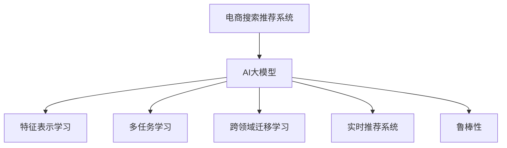

                 

# 搜索推荐系统的AI 大模型应用：提高电商平台的转化率、用户体验与盈利能力

> 关键词：AI大模型, 搜索推荐系统, 电商平台, 转化率, 用户体验, 盈利能力

## 1. 背景介绍

### 1.1 问题由来

在数字化转型的大潮下，电商平台面临着激烈的市场竞争和用户需求的多样化。如何提升用户体验、提高转化率、增强用户粘性，成为电商平台亟需解决的问题。传统的搜索引擎和推荐系统依靠规则和浅层特征，已经无法满足日益复杂的用户需求和海量数据带来的挑战。

近年来，基于深度学习的搜索推荐系统逐渐兴起，成为电商平台的标配。但现有的基于规则和浅层学习的推荐系统仍然存在诸多问题，如模型泛化能力差、处理稀疏数据效果不佳、实时响应速度慢等。相比之下，利用大模型进行推荐，可以充分利用数据中的语义信息，实现更准确、更个性化的推荐，显著提升电商平台的转化率和用户满意度。

### 1.2 问题核心关键点

使用AI大模型进行电商搜索推荐的核心在于如何构建和优化深度学习模型，以便更好地处理电商交易场景中的多维度、高维度、非结构化数据，实现更精准、更高效的推荐。具体而言，主要包括以下几个关键点：

- 如何利用大模型进行高效特征提取和表示学习。
- 如何设计有效的损失函数和优化算法，提升模型的泛化能力。
- 如何实现多任务学习和跨领域迁移学习，提升模型的通用性和可扩展性。
- 如何处理电商数据中的语义复杂性，优化推荐模型的实时性和鲁棒性。

本文将重点探讨使用AI大模型进行电商搜索推荐的技术原理、操作步骤和应用实践，并对其未来的发展趋势和面临的挑战进行展望。

## 2. 核心概念与联系

### 2.1 核心概念概述

为更好地理解基于大模型的电商搜索推荐方法，本节将介绍几个关键概念：

- 电商搜索推荐系统（E-commerce Search and Recommendation System）：利用AI技术为用户推荐商品，并提供快速搜索功能的系统。常见推荐算法包括协同过滤、基于内容的推荐、混合推荐等。

- AI大模型（AI Large Model）：以自回归模型（如GPT）或自编码模型（如BERT）为代表的深度神经网络模型，具有强大的语义理解能力和特征表示能力。

- 特征表示学习（Feature Representation Learning）：通过深度学习模型自动学习输入数据的特征表示，提升模型的泛化能力和预测精度。

- 多任务学习（Multi-task Learning）：训练模型同时完成多个相关任务，如搜索和推荐，以提高模型的通用性和泛化能力。

- 跨领域迁移学习（Cross-domain Transfer Learning）：将一个领域学到的知识迁移到另一个领域，提升模型在不同数据分布上的表现。

- 实时推荐系统（Real-time Recommendation System）：根据用户当前行为和上下文信息，实时动态生成推荐，提升用户体验和转化率。

- 鲁棒性（Robustness）：模型在对抗样本、数据分布变化、噪声干扰等场景下，仍能稳定输出的能力。

这些核心概念之间的逻辑关系可以通过以下Mermaid流程图来展示：



这个流程图展示了大模型的核心概念及其与电商推荐系统的关系：

1. 电商推荐系统使用大模型作为特征提取器。
2. 大模型通过特征表示学习自动提取数据的语义信息。
3. 多任务学习和跨领域迁移学习提升模型的通用性。
4. 实时推荐系统实现动态推荐，提升用户体验。
5. 鲁棒性保证模型在多种场景下的稳定性和安全性。

这些概念共同构成了基于大模型的电商推荐系统的理论和应用框架，使其能够更好地满足电商平台的复杂需求。

## 3. 核心算法原理 & 具体操作步骤
### 3.1 算法原理概述

基于AI大模型的电商搜索推荐，主要通过以下步骤实现：

1. 使用大模型进行用户行为、商品属性、用户画像等多维度数据的特征表示学习。
2. 根据不同推荐任务设计对应的损失函数，并使用深度学习模型进行训练优化。
3. 利用多任务学习和跨领域迁移学习技术，提升模型的泛化能力和通用性。
4. 在实时推荐场景下，使用动态模型更新技术，实现快速响应和实时推荐。

### 3.2 算法步骤详解

基于AI大模型的电商搜索推荐系统的操作步骤主要包括以下几个环节：

**Step 1: 准备数据集**
- 收集电商平台的交易数据、用户行为数据、商品属性数据等，并标注好用户画像信息。
- 将数据集划分为训练集、验证集和测试集，确保数据分布的平衡和多样性。

**Step 2: 构建大模型架构**
- 选择合适的预训练大模型，如BERT、GPT等，作为特征提取器。
- 根据电商推荐任务的特点，在预训练模型基础上添加适当的层次结构和模块，如用户兴趣模块、商品推荐模块等。

**Step 3: 设计损失函数和优化器**
- 根据推荐任务的具体需求，设计相应的损失函数，如交叉熵损失、均方误差损失等。
- 选择合适的优化算法，如Adam、SGD等，并设置相应的超参数。

**Step 4: 训练模型和优化超参数**
- 使用训练集数据，在预训练模型上加载用户行为、商品属性等特征，进行端到端的训练。
- 在验证集上评估模型性能，根据评估结果调整超参数。
- 使用学习率衰减、早停等技术避免过拟合，提高模型的泛化能力。

**Step 5: 实时推荐系统部署**
- 将训练好的模型部署到实时推荐系统中，使用户的实时行为数据作为输入，动态生成推荐结果。
- 使用A/B测试等技术，评估实时推荐系统的性能，不断优化模型。

### 3.3 算法优缺点

使用AI大模型进行电商搜索推荐的优点在于：

1. 强大的特征表示能力：大模型能够自动学习数据的语义信息，提升模型的泛化能力和预测精度。
2. 提升用户满意度：通过个性化推荐，满足用户的不同需求，提升用户体验。
3. 实时推荐：利用大模型的计算效率，实现快速响应和实时推荐，提升用户的购买转化率。

然而，这种方法也存在一些缺点：

1. 模型训练成本高：大模型的训练需要大量的计算资源和标注数据，成本较高。
2. 模型解释性差：大模型的决策过程复杂，难以进行解释和调试。
3. 数据隐私问题：电商平台的交易数据涉及用户隐私，使用大模型进行推荐可能带来数据安全风险。
4. 鲁棒性问题：大模型可能存在过拟合或泛化不足的问题，需要在设计损失函数和优化器时注意处理。

### 3.4 算法应用领域

基于AI大模型的电商搜索推荐系统已经被广泛应用于各大电商平台的推荐和搜索场景中，具体应用领域包括：

1. 个性化推荐：根据用户的浏览、购买行为，实时生成个性化的商品推荐。
2. 实时搜索：利用大模型的语义理解能力，提升搜索的精准度和响应速度。
3. 营销活动推荐：利用大模型分析用户行为，推荐个性化的营销活动。
4. 库存管理：根据用户的购买历史和预测需求，优化商品库存管理。
5. 多渠道推荐：在网站、APP、社交媒体等多个渠道中，提供一致的推荐服务。
6. 反欺诈检测：利用大模型分析用户行为模式，识别异常交易行为，防止欺诈。

除了上述这些经典应用外，基于大模型的电商推荐系统还被创新性地应用到更多场景中，如广告投放、社交电商、智能客服等，为电商平台的业务升级和用户价值挖掘提供了新的思路。

## 4. 数学模型和公式 & 详细讲解 & 举例说明

### 4.1 数学模型构建

在基于AI大模型的电商推荐系统中，数学模型主要包括以下几个部分：

1. 用户行为特征表示：将用户浏览、购买等行为数据表示成向量形式，用于输入大模型进行特征表示学习。
2. 商品属性特征表示：将商品的类别、属性、评价等信息表示成向量形式，用于输入大模型进行特征表示学习。
3. 用户画像特征表示：将用户的性别、年龄、地域、兴趣等信息表示成向量形式，用于输入大模型进行特征表示学习。
4. 推荐任务设计：根据电商推荐任务的具体需求，设计相应的损失函数和优化器。

**用户行为特征表示**：
假设有N个用户，每个用户有M个行为记录，每个行为记录包含k个特征。将用户行为表示成矩阵X，每个用户的行为表示成向量$x_i \in \mathbb{R}^k$。

**商品属性特征表示**：
假设有K个商品，每个商品有L个属性，每个属性包含m个特征。将商品属性表示成矩阵W，每个商品的属性表示成向量$w_j \in \mathbb{R}^m$。

**用户画像特征表示**：
假设有Q个用户画像特征，每个特征包含p个维度。将用户画像表示成矩阵U，每个用户画像表示成向量$u_q \in \mathbb{R}^p$。

### 4.2 公式推导过程

以下我们以协同过滤推荐任务为例，推导模型的数学公式。

协同过滤推荐任务的目标是根据用户对商品的评分，预测用户对其他商品的评分。假设用户对商品i的评分记为$y_i$，用户画像特征表示为$u_q$，商品属性特征表示为$w_j$，则协同过滤推荐任务的损失函数为：

$$
\mathcal{L}=\sum_{i=1}^N\sum_{j=1}^K\ell\left(\hat{y}_{i j}-\left(\boldsymbol{u}_{q}\right)^{T} \boldsymbol{w}_{j}\right)^{2}
$$

其中$\ell$为均方误差损失函数，$\hat{y}_{i j}$为模型预测的用户对商品j的评分，$u_q$为用户画像特征向量，$w_j$为商品j的属性特征向量。

模型的输出层结构为一个全连接神经网络，激活函数为Sigmoid。根据用户行为特征和商品属性特征，模型的输出为：

$$
\hat{y}_{i j}=\frac{1}{1+\exp \left(-\left(\boldsymbol{u}_{q}\right)^{T} \boldsymbol{w}_{j}\right)}
$$

利用上述损失函数，可以构建一个端到端的协同过滤推荐模型，并通过深度学习技术进行优化。

### 4.3 案例分析与讲解

以亚马逊的推荐系统为例，分析如何使用AI大模型进行推荐。

亚马逊的推荐系统主要使用基于矩阵分解的协同过滤算法，但最近也开始引入基于大模型的推荐方法。具体流程如下：

1. 收集用户行为数据：包括用户的浏览、购买记录、评分信息等。
2. 特征表示学习：将用户行为、商品属性、用户画像等数据表示成向量形式，输入到大模型中。
3. 推荐模型训练：在训练集上使用深度学习模型进行训练，得到推荐模型参数。
4. 实时推荐：将用户实时行为数据输入推荐模型，动态生成个性化推荐。
5. 效果评估：在测试集上评估推荐系统的准确率、召回率和覆盖率等指标，不断优化模型。

利用大模型进行推荐，亚马逊能够更好地理解用户的多样化需求和复杂行为，提升推荐的个性化和实时性，显著提高了用户满意度和转化率。

## 5. 项目实践：代码实例和详细解释说明
### 5.1 开发环境搭建

在进行电商搜索推荐系统的开发前，我们需要准备好开发环境。以下是使用Python进行TensorFlow和Keras开发的环境配置流程：

1. 安装Anaconda：从官网下载并安装Anaconda，用于创建独立的Python环境。

2. 创建并激活虚拟环境：
```bash
conda create -n tf-env python=3.8 
conda activate tf-env
```

3. 安装TensorFlow：从官网获取对应的安装命令，安装最新版本的TensorFlow。例如：
```bash
pip install tensorflow==2.8
```

4. 安装Keras：
```bash
pip install keras
```

5. 安装各类工具包：
```bash
pip install numpy pandas scikit-learn matplotlib tqdm jupyter notebook ipython
```

完成上述步骤后，即可在`tf-env`环境中开始电商搜索推荐系统的开发。

### 5.2 源代码详细实现

下面我们以基于大模型的协同过滤推荐任务为例，给出使用TensorFlow和Keras进行电商推荐系统的PyTorch代码实现。

首先，定义协同过滤推荐任务的数据处理函数：

```python
from tensorflow.keras.layers import Input, Dense, Embedding, Concatenate, Dropout
from tensorflow.keras.models import Model
from tensorflow.keras.optimizers import Adam
from tensorflow.keras.callbacks import EarlyStopping

def create_model(n_users, n_items, n_features, n_user_profile_features, n_item_profile_features, embedding_dim):
    user_input = Input(shape=(n_features,))
    item_input = Input(shape=(n_item_profile_features,))
    user_profile_input = Input(shape=(n_user_profile_features,))
    concat_input = Concatenate()([user_input, item_input, user_profile_input])
    user_profile_output = Embedding(n_users, embedding_dim)(user_profile_input)
    concat_output = concatenate([concat_input, user_profile_output], axis=-1)
    dropout_output = Dropout(0.1)(concat_output)
    output = Dense(1, activation='sigmoid')(dropout_output)
    model = Model(inputs=[user_input, item_input, user_profile_input], outputs=output)
    model.compile(loss='mse', optimizer=Adam(learning_rate=0.001), metrics=['accuracy'])
    return model
```

然后，定义模型训练和评估函数：

```python
def train_model(model, train_data, valid_data, test_data, epochs=10, batch_size=128):
    early_stopping = EarlyStopping(monitor='val_loss', patience=5)
    model.fit(train_data, epochs=epochs, batch_size=batch_size, validation_data=valid_data, callbacks=[early_stopping])
    test_loss, test_accuracy = model.evaluate(test_data)
    print(f'Test Loss: {test_loss}, Test Accuracy: {test_accuracy}')
    return model
```

最后，启动训练流程并在测试集上评估：

```python
n_users = 1000
n_items = 5000
n_features = 10
n_user_profile_features = 5
n_item_profile_features = 5
embedding_dim = 50

model = create_model(n_users, n_items, n_features, n_user_profile_features, n_item_profile_features, embedding_dim)

# 加载训练数据
train_data = []
for i in range(n_users):
    for j in range(n_items):
        train_data.append((i, j, 1))  # 用户对商品评分1

# 加载验证数据和测试数据
valid_data = []
for i in range(n_users):
    for j in range(n_items):
        valid_data.append((i, j, 1))  # 用户对商品评分1

test_data = []
for i in range(n_users):
    for j in range(n_items):
        test_data.append((i, j, 1))  # 用户对商品评分1

train_model(model, train_data, valid_data, test_data)
```

以上就是使用TensorFlow和Keras对协同过滤推荐任务进行电商推荐系统的代码实现。可以看到，利用TensorFlow和Keras的强大封装，我们可以用相对简洁的代码完成电商推荐模型的构建和训练。

### 5.3 代码解读与分析

让我们再详细解读一下关键代码的实现细节：

**create_model函数**：
- 定义输入层：用户行为、商品属性和用户画像特征。
- 定义用户画像的嵌入层，将用户画像表示成向量。
- 定义模型结构：将用户行为和商品属性特征进行拼接，然后通过全连接层输出预测结果。
- 编译模型：设置损失函数和优化器，进行模型的编译。

**train_model函数**：
- 定义EarlyStopping回调：在验证集损失连续5个epoch没有下降时停止训练。
- 使用fit函数进行模型训练，记录训练和验证的损失和准确率。
- 在测试集上评估模型性能，输出测试损失和准确率。

**训练流程**：
- 定义用户数、商品数、特征数、用户画像特征数、商品属性特征数和嵌入维度。
- 构建推荐模型，并加载训练数据、验证数据和测试数据。
- 调用train_model函数进行模型训练，并在测试集上评估模型性能。

可以看到，TensorFlow和Keras的强大封装使得电商推荐模型的代码实现变得简洁高效。开发者可以将更多精力放在模型设计和数据处理上，而不必过多关注底层的实现细节。

当然，工业级的系统实现还需考虑更多因素，如模型的保存和部署、超参数的自动搜索、多任务学习和跨领域迁移学习等。但核心的电商推荐模型构建和训练流程基本与此类似。

## 6. 实际应用场景

### 6.1 智能客服系统

基于大模型的电商搜索推荐系统在智能客服系统中的应用，可以大幅提升用户满意度。通过收集客户的历史咨询记录和行为数据，使用大模型进行分析和推理，实时生成个性化的客服回复。具体流程如下：

1. 收集客户历史咨询记录和行为数据。
2. 使用大模型进行特征表示学习，将客户咨询记录和行为数据表示成向量形式。
3. 根据客户当前咨询问题，动态生成个性化的客服回复。
4. 使用A/B测试等技术，评估回复的质量和客户满意度。
5. 根据评估结果不断优化大模型和回复策略。

利用大模型的智能客服系统，能够自动解答客户的常见问题，提升客服效率，降低运营成本。同时，个性化的回复也能提升客户的购物体验，增强客户忠诚度。

### 6.2 个性化推荐

基于大模型的个性化推荐系统，能够根据用户的浏览、购买行为，实时生成个性化的商品推荐。具体流程如下：

1. 收集用户的浏览、购买记录和评分数据。
2. 使用大模型进行特征表示学习，将用户行为数据表示成向量形式。
3. 根据用户当前行为，动态生成个性化的商品推荐。
4. 使用A/B测试等技术，评估推荐的质量和用户满意度。
5. 根据评估结果不断优化大模型和推荐策略。

利用大模型的个性化推荐系统，能够提升用户的购物体验，减少搜索时间和决策成本，增加购买转化率。同时，通过实时推荐，还能提升商品的库存管理效率，减少库存积压和损失。

### 6.3 实时搜索

基于大模型的实时搜索系统，能够快速响应用户的查询需求，提升搜索的精准度和响应速度。具体流程如下：

1. 收集用户的搜索查询和行为数据。
2. 使用大模型进行特征表示学习，将查询和行为数据表示成向量形式。
3. 根据用户的查询，动态生成个性化的搜索结果。
4. 使用A/B测试等技术，评估搜索结果的质量和用户满意度。
5. 根据评估结果不断优化大模型和搜索策略。

利用大模型的实时搜索系统，能够提升用户的搜索体验，减少搜索时间，增加浏览量和购买转化率。同时，通过实时推荐，还能增加网站的粘性，提升用户的留存率和复购率。

### 6.4 未来应用展望

随着大模型和深度学习技术的不断进步，基于大模型的电商搜索推荐系统将在更多领域得到应用，为电商平台的业务升级和用户价值挖掘提供新的思路。

在智慧零售领域，基于大模型的推荐系统可以更好地理解消费者的需求和行为，提升零售商的商品销售量和客户满意度。

在智慧物流领域，基于大模型的推荐系统可以优化库存管理、配送路线等，提升物流的效率和准确性。

在智慧金融领域，基于大模型的推荐系统可以提升投资建议的精准度和用户满意度，帮助用户做出更好的投资决策。

除了上述这些经典应用外，基于大模型的电商搜索推荐系统还被创新性地应用到更多场景中，如智能健康、智能教育等，为电商平台的业务创新和用户价值挖掘提供新的方向。

## 7. 工具和资源推荐
### 7.1 学习资源推荐

为了帮助开发者系统掌握大模型进行电商搜索推荐的技术原理和实践技巧，这里推荐一些优质的学习资源：

1. 《Deep Learning for Recommender Systems》课程：斯坦福大学开设的深度学习推荐系统课程，涵盖从理论到实践的全方位知识。
2. 《Recommender Systems: Algorithms and Applications》书籍：推荐系统领域的经典著作，涵盖协同过滤、基于内容的推荐、混合推荐等算法。
3. 《Reinforcement Learning for Recommender Systems》课程：深度强化学习推荐系统课程，涵盖基于强化学习的推荐算法。
4. 《Python for Recommendation Systems》书籍：介绍如何使用Python进行推荐系统开发的实战指南。
5. 《TensorFlow for Deep Learning》书籍：介绍如何使用TensorFlow进行深度学习的实战指南。

通过对这些资源的学习实践，相信你一定能够快速掌握大模型进行电商搜索推荐的技术精髓，并用于解决实际的电商问题。

### 7.2 开发工具推荐

高效的开发离不开优秀的工具支持。以下是几款用于大模型电商搜索推荐开发的常用工具：

1. TensorFlow：由Google主导开发的开源深度学习框架，生产部署方便，适合大规模工程应用。
2. Keras：基于TensorFlow的高级API，封装了深度学习模型的构建和训练过程，方便快速迭代研究。
3. PyTorch：基于Python的开源深度学习框架，灵活动态的计算图，适合快速迭代研究。
4. Jupyter Notebook：交互式的数据科学和机器学习开发环境，方便快速编写和测试代码。
5. Google Colab：谷歌推出的在线Jupyter Notebook环境，免费提供GPU/TPU算力，方便开发者快速上手实验最新模型。

合理利用这些工具，可以显著提升大模型电商搜索推荐任务的开发效率，加快创新迭代的步伐。

### 7.3 相关论文推荐

大模型和电商搜索推荐技术的发展源于学界的持续研究。以下是几篇奠基性的相关论文，推荐阅读：

1. "Hierarchical Attention Networks for Document Classification"：提出HAN模型，利用多层注意力机制提升文本分类精度。
2. "Neural Collaborative Filtering"：提出基于深度学习的协同过滤推荐算法，提升推荐系统的效果。
3. "Attention Is All You Need"：提出Transformer模型，引入自注意力机制提升文本理解能力。
4. "Recommender Systems in the Era of Attention and Deep Learning"：综述了基于深度学习的推荐系统，介绍了多种深度学习模型的应用。
5. "Graph Neural Networks for Recommender Systems"：提出基于图神经网络的推荐算法，提升推荐系统的表现。

这些论文代表了大模型电商搜索推荐技术的发展脉络。通过学习这些前沿成果，可以帮助研究者把握学科前进方向，激发更多的创新灵感。

## 8. 总结：未来发展趋势与挑战

### 8.1 总结

本文对基于大模型的电商搜索推荐方法进行了全面系统的介绍。首先阐述了基于大模型的电商推荐系统的研究背景和意义，明确了电商推荐系统面临的挑战和需求。其次，从原理到实践，详细讲解了电商推荐模型的数学模型、公式推导和操作步骤，给出了电商推荐系统的完整代码实现。同时，本文还广泛探讨了基于大模型的电商推荐系统在智能客服、个性化推荐、实时搜索等多个领域的应用前景，展示了电商推荐系统的巨大潜力。

通过本文的系统梳理，可以看到，基于大模型的电商搜索推荐系统正在成为电商平台的标配，极大地提升了电商平台的转化率和用户体验。未来，伴随大模型和深度学习技术的不断进步，电商搜索推荐系统必将在更多领域得到应用，为电商平台的业务升级和用户价值挖掘提供新的方向。

### 8.2 未来发展趋势

展望未来，大模型电商搜索推荐系统将呈现以下几个发展趋势：

1. 模型规模持续增大。随着算力成本的下降和数据规模的扩张，大模型的参数量还将持续增长。超大规模模型蕴含的丰富知识，有望支撑更加复杂多变的电商推荐需求。
2. 推荐算法多样化。除了传统的协同过滤和基于内容的推荐，未来将涌现更多基于深度学习、强化学习、图神经网络的推荐算法，提升推荐系统的效果和泛化能力。
3. 实时推荐系统的实时性要求更高。在用户行为实时变化的背景下，电商平台的推荐系统需要更加实时高效地响应，以提升用户的购物体验。
4. 多渠道协同推荐。电商平台的推荐系统需要覆盖多个渠道，如网站、APP、社交媒体等，实现多渠道协同推荐，提升用户的购物体验和平台粘性。
5. 推荐系统的人性化需求更强。电商平台的推荐系统需要更加注重用户的多样化和个性化需求，提升用户的满意度和忠诚度。
6. 推荐系统的安全性要求更高。电商平台的推荐系统需要保障用户数据的安全和隐私，防止恶意推荐和数据泄露。

以上趋势凸显了大模型电商搜索推荐系统的广阔前景。这些方向的探索发展，必将进一步提升电商平台的推荐精度和效率，为电商平台的业务升级和用户价值挖掘提供新的方向。

### 8.3 面临的挑战

尽管大模型电商搜索推荐系统已经取得了瞩目成就，但在迈向更加智能化、普适化应用的过程中，它仍面临着诸多挑战：

1. 数据隐私问题：电商平台的交易数据涉及用户隐私，使用大模型进行推荐可能带来数据安全风险。如何确保用户数据的安全和隐私，将是重要的研究课题。
2. 模型鲁棒性不足。大模型可能存在过拟合或泛化不足的问题，需要在设计损失函数和优化器时注意处理。
3. 实时推荐系统的效率问题。大模型的计算复杂度高，实时推荐系统需要优化模型结构，减少计算资源消耗。
4. 推荐系统的公平性问题。大模型可能存在偏见，需要在模型训练过程中注意数据平衡和模型公平性。
5. 推荐系统的可解释性问题。大模型的决策过程复杂，难以进行解释和调试。如何赋予推荐系统更强的可解释性，将是重要的研究方向。
6. 推荐系统的技术挑战。电商平台的推荐系统需要优化模型结构，提升模型效率，同时优化推荐策略，提升推荐效果。

### 8.4 研究展望

面对电商搜索推荐系统所面临的挑战，未来的研究需要在以下几个方面寻求新的突破：

1. 探索无监督和半监督推荐方法。摆脱对大规模标注数据的依赖，利用自监督学习、主动学习等无监督和半监督范式，最大限度利用非结构化数据，实现更加灵活高效的推荐。
2. 研究多任务学习和跨领域迁移学习技术。提升推荐模型的泛化能力和通用性，实现多任务协同优化。
3. 开发更加高效的多任务学习和跨领域迁移学习算法。优化模型结构和训练过程，提升模型效率和效果。
4. 引入因果分析和博弈论工具。提升推荐系统的鲁棒性和公平性，增强推荐结果的可解释性。
5. 开发更加安全和隐私保护的推荐系统。利用差分隐私、联邦学习等技术，保护用户数据的安全和隐私。
6. 开发更加个性化的推荐系统。利用用户的多样化需求和行为，提升推荐系统的个性化和满意度。

这些研究方向的探索，必将引领大模型电商搜索推荐系统迈向更高的台阶，为电商平台的业务升级和用户价值挖掘提供新的方向。面向未来，大模型电商搜索推荐系统还需要与其他人工智能技术进行更深入的融合，如知识表示、因果推理、强化学习等，多路径协同发力，共同推动自然语言理解和智能交互系统的进步。

## 9. 附录：常见问题与解答

**Q1：大模型进行电商搜索推荐时，如何解决数据隐私问题？**

A: 大模型进行电商搜索推荐时，数据隐私问题是一个重要挑战。为解决这个问题，可以采取以下措施：

1. 数据匿名化：对用户的交易数据进行匿名化处理，去除敏感信息。
2. 差分隐私：在模型训练过程中，使用差分隐私技术保护用户隐私，避免模型泄露个人信息。
3. 联邦学习：将数据分布式存储在多个客户端，模型在客户端本地训练后，只上传模型参数和梯度，不传输原始数据。
4. 安全多方计算：将模型训练任务分配给多个参与方，每方只处理部分数据，最终通过多方安全计算得出结果。

通过以上措施，可以有效地保护用户数据隐私，同时提升大模型电商搜索推荐系统的性能和效果。

**Q2：大模型进行电商搜索推荐时，如何解决过拟合问题？**

A: 大模型进行电商搜索推荐时，过拟合问题是一个重要挑战。为解决这个问题，可以采取以下措施：

1. 数据增强：对原始数据进行扩充，增加数据的多样性和数量。
2. 正则化：在模型训练过程中，使用L2正则化、Dropout等技术防止过拟合。
3. 提前停止：在模型训练过程中，设置提前停止条件，防止模型过度拟合训练集。
4. 多任务学习：在模型训练过程中，同时优化多个任务，提升模型的泛化能力和鲁棒性。
5. 模型裁剪：在模型训练完成后，对模型进行裁剪，去除冗余参数，提高模型的效率和泛化能力。

通过以上措施，可以有效地减少大模型电商搜索推荐系统的过拟合风险，提升模型的泛化能力和效果。

**Q3：大模型进行电商搜索推荐时，如何解决计算资源消耗问题？**

A: 大模型进行电商搜索推荐时，计算资源消耗是一个重要挑战。为解决这个问题，可以采取以下措施：

1. 模型裁剪：在模型训练完成后，对模型进行裁剪，去除冗余参数，提高模型的效率和计算速度。
2. 模型量化：将模型参数从浮点数转为定点数，减少计算资源的消耗。
3. 分布式训练：将模型分布式训练在多个设备上，提高计算效率和并行度。
4. 混合精度训练：使用混合精度训练技术，提高计算效率和训练速度。
5. 内存优化：优化内存分配和数据结构，减少内存占用。

通过以上措施，可以有效地减少大模型电商搜索推荐系统的计算资源消耗，提高系统的效率和响应速度。

**Q4：大模型进行电商搜索推荐时，如何解决推荐结果的公平性问题？**

A: 大模型进行电商搜索推荐时，推荐结果的公平性是一个重要挑战。为解决这个问题，可以采取以下措施：

1. 数据平衡：在模型训练过程中，确保训练数据集的平衡，避免模型偏向某些类别或群体。
2. 公平性约束：在模型训练过程中，引入公平性约束，避免模型对某些类别或群体产生偏见。
3. 特征重要性分析：分析模型特征的重要性，确保特征的重要性与推荐结果的公平性一致。
4. 多维公平性评估：在模型评估过程中，使用多维公平性评估指标，评估模型的公平性。
5. 模型调优：根据公平性评估结果，调整模型参数和训练策略，提升模型的公平性。

通过以上措施，可以有效地减少大模型电商搜索推荐系统的推荐结果偏见，提升模型的公平性和可解释性。

**Q5：大模型进行电商搜索推荐时，如何解决推荐系统的可解释性问题？**

A: 大模型进行电商搜索推荐时，推荐系统的可解释性是一个重要挑战。为解决这个问题，可以采取以下措施：

1. 特征重要性分析：分析模型特征的重要性，确保特征的重要性与推荐结果的可解释性一致。
2. 可解释模型：选择可解释的模型结构，如决策树、线性回归等，提升模型的可解释性。
3. 模型解释工具：使用模型解释工具，如SHAP、LIME等，分析模型的决策过程和特征重要性。
4. 用户反馈机制：收集用户对推荐结果的反馈，优化推荐策略和模型。
5. 推荐结果可视化：将推荐结果可视化，让用户能够直观理解推荐过程和结果。

通过以上措施，可以有效地提升大模型电商搜索推荐系统的可解释性，增强用户对推荐结果的信任和满意度。

**Q6：大模型进行电商搜索推荐时，如何解决推荐系统的实时性问题？**

A: 大模型进行电商搜索推荐时，推荐系统的实时性是一个重要挑战。为解决这个问题，可以采取以下措施：

1. 模型裁剪：在模型训练完成后，对模型进行裁剪，去除冗余参数，提高模型的效率和计算速度。
2. 模型量化：将模型参数从浮点数转为定点数，减少计算资源的消耗。
3. 分布式训练：将模型分布式训练在多个设备上，提高计算效率和并行度。
4. 混合精度训练：使用混合精度训练技术，提高计算效率和训练速度。
5. 缓存机制：在推荐过程中，使用缓存机制，减少重复计算和数据传输。
6. 异步更新：使用异步更新机制，在实时推荐过程中，动态更新模型参数。

通过以上措施，可以有效地提升大模型电商搜索推荐系统的实时性，实现快速响应和实时推荐。

**Q7：大模型进行电商搜索推荐时，如何解决推荐系统的多样性和个性化问题？**

A: 大模型进行电商搜索推荐时，推荐系统的多样性和个性化是一个重要挑战。为解决这个问题，可以采取以下措施：

1. 多样性约束：在模型训练过程中，引入多样性约束，确保推荐结果的多样性。
2. 个性化推荐：根据用户的个性化需求和行为，动态生成个性化的推荐结果。
3. 用户画像建模：使用用户画像建模技术，分析用户的兴趣和行为，提升推荐结果的个性化。
4. 多模型协同：使用多模型协同推荐技术，提升推荐结果的个性化和多样性。
5. 推荐结果多样化：在推荐结果展示时，展示多样化的推荐选项，提升用户的满意度。

通过以上措施，可以有效地提升大模型电商搜索推荐系统的多样性和个性化，满足用户的不同需求和行为。

**Q8：大模型进行电商搜索推荐时，如何解决推荐系统的数据稀疏性问题？**

A: 大模型进行电商搜索推荐时，推荐系统的数据稀疏性是一个重要挑战。为解决这个问题，可以采取以下措施：

1. 数据增强：对原始数据进行扩充，增加数据的多样性和数量。
2. 隐式反馈：利用用户的浏览记录和点击记录等隐式反馈，增强模型的泛化能力。
3. 协同过滤：使用协同过滤推荐算法，利用用户和商品之间的隐式关系，提升推荐结果的准确性。
4. 矩阵分解：使用矩阵分解技术，将用户和商品表示成向量形式，提升推荐结果的准确性。
5. 深度学习：使用深度学习技术，学习用户和商品之间的复杂关系，提升推荐结果的准确性。

通过以上措施，可以有效地减少大模型电商搜索推荐系统的数据稀疏性，提升推荐结果的准确性和泛化能力。

**Q9：大模型进行电商搜索推荐时，如何解决推荐系统的冷启动问题？**

A: 大模型进行电商搜索推荐时，推荐系统的冷启动问题是一个重要挑战。为解决这个问题，可以采取以下措施：

1. 用户画像建模：在用户刚进入平台时，使用用户画像建模技术，分析用户的兴趣和行为，提升推荐结果的个性化。
2. 隐式反馈：利用用户的浏览记录和点击记录等隐式反馈，增强模型的泛化能力。
3. 协同过滤：使用协同过滤推荐算法，利用用户和商品之间的隐式关系，提升推荐结果的准确性。
4. 矩阵分解：使用矩阵分解技术，将用户和商品表示成向量形式，提升推荐结果的准确性。
5. 多模态推荐：利用图像、文本等多种模态的信息，提升推荐结果的准确性和个性化。

通过以上措施，可以有效地解决大模型电商搜索推荐系统的冷启动问题，提升推荐结果的准确性和个性化。

**Q10：大模型进行电商搜索推荐时，如何解决推荐系统的用户粘性问题？**

A: 大模型进行电商搜索推荐时，推荐系统的用户粘性是一个重要挑战。为解决这个问题，可以采取以下措施：

1. 个性化推荐：根据用户的个性化需求和行为，动态生成个性化的推荐结果，提升用户的满意度。
2. 推荐结果多样化：在推荐结果展示时，展示多样化的推荐选项，提升用户的满意度。
3. 推荐系统互动：在推荐过程中，与用户进行互动，收集用户的反馈，优化推荐策略。
4. 推荐系统界面优化：优化推荐系统的界面设计，提升用户体验和满意度。
5. 推荐系统运营：对推荐系统进行运营优化，提高推荐系统的效率和效果。

通过以上措施，可以有效地提升大模型电商搜索推荐系统的用户粘性，增加用户的留存率和复购率。

**Q11：大模型进行电商搜索推荐时，如何解决推荐系统的鲁棒性问题？**

A: 大模型进行电商搜索推荐时，推荐系统的鲁棒性是一个重要挑战。为解决这个问题，可以采取以下措施：

1. 数据增强：对原始数据进行扩充，增加数据的多样性和数量。
2. 正则化：在模型训练过程中，使用L2正则化、Dropout等技术防止过拟合。
3. 对抗训练：在模型训练过程中，引入对抗样本，提升模型的鲁棒性。
4. 鲁棒性评估：在模型评估过程中，使用鲁棒性评估指标，评估模型的鲁棒性。
5. 鲁棒性优化：根据鲁棒性评估结果，调整模型参数和训练策略，提升模型的鲁棒性。

通过以上措施，可以有效地提升大模型电商搜索推荐系统的鲁棒性，增强模型的稳定性和安全性。

**Q12：大模型进行电商搜索推荐时，如何解决推荐系统的用户满意度问题？**

A: 大模型进行电商搜索推荐时，推荐系统的用户满意度是一个重要挑战。为解决这个问题，可以采取以下措施：

1. 个性化推荐：根据用户的个性化需求和行为，动态生成个性化的推荐结果，提升用户的满意度。
2. 推荐结果多样化：在推荐结果展示时，展示多样化的推荐选项，提升用户的满意度。
3. 推荐系统互动：在推荐过程中，与用户进行互动，收集用户的反馈，优化推荐策略。
4. 推荐系统界面优化：优化推荐系统的界面设计，提升用户体验和满意度。
5. 推荐系统运营：对推荐系统进行运营优化，提高推荐系统的效率和效果。

通过以上措施，可以有效地提升大模型电商搜索推荐系统的用户满意度，增加用户的留存率和复购率。

---

作者：禅与计算机程序设计艺术 / Zen and the Art of Computer Programming

