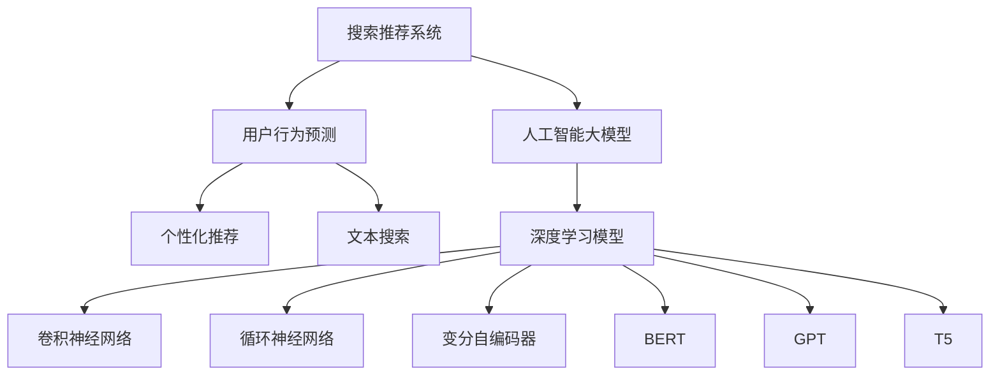

                 

# 搜索推荐系统的AI 大模型应用：电商平台提高竞争力的关键策略

> 关键词：搜索推荐系统,电商平台,人工智能大模型,用户行为预测,个性化推荐

## 1. 背景介绍

在电商行业，搜索推荐系统是支撑用户购物体验和提升平台收入的核心技术。传统的搜索推荐系统主要基于规则、统计和机器学习模型，难以适应多变的市场环境，并且缺乏对用户行为的深入理解。而随着人工智能技术的迅猛发展，大模型开始在电商搜索推荐领域发挥重要作用，带来显著的性能提升和成本效益。

大模型通过在大规模无标签文本和结构化数据上预训练，学习到丰富的语言和结构化特征表示。在电商搜索推荐系统中，大模型可以用于用户行为预测、个性化推荐、文本搜索等多个环节，大幅提升用户体验和转化率。

近年来，电商巨头如亚马逊、阿里巴巴、京东等，纷纷采用大模型来提升搜索推荐系统的精度和覆盖面，构建以用户为中心的个性化推荐引擎。本博客将系统介绍基于大模型的搜索推荐系统原理与应用实践，以期为电商平台的运营者提供参考。

## 2. 核心概念与联系

### 2.1 核心概念概述

为了深入理解大模型在电商搜索推荐系统中的应用，我们首先需要介绍一些核心概念及其相互联系：

- **搜索推荐系统(Recommender System)**：通过收集用户行为数据，为用户提供个性化推荐和搜索结果的系统。电商搜索推荐系统能够显著提升用户购物体验和平台的转化率。

- **人工智能(AI)大模型(Large AI Model)**：指在大型无标签数据集上进行预训练的神经网络模型，如BERT、GPT、T5等。大模型通过大规模数据训练，学习到丰富的语言和结构化特征表示，能够高效地提取数据中的信息。

- **用户行为预测(Recommended System)**：基于用户历史行为数据，预测用户可能感兴趣的商品或服务。大模型通过预训练学习到丰富的语义和结构化特征，能够更准确地进行用户行为预测。

- **个性化推荐(Personalization Recommendation)**：针对每个用户，根据其历史行为和当前需求，推荐个性化的商品或内容。大模型能够高效处理大规模用户数据，实现高度定制化的推荐。

- **文本搜索(Search Query)**：通过自然语言理解技术，解析用户输入的搜索文本，找到相关的商品信息。大模型具有强大的语言理解能力，能够更好地匹配用户搜索意图。

- **深度学习模型**：基于神经网络的深度学习模型，包括卷积神经网络(CNN)、循环神经网络(RNN)、变分自编码器(VAE)等。在大模型的基础上，可以构建更加复杂的深度学习模型，提升搜索推荐系统的表现。

这些核心概念共同构成了电商搜索推荐系统的技术基础。通过理解这些概念及其相互联系，我们可以更好地把握大模型在电商搜索推荐中的应用策略。

### 2.2 核心概念联系的Mermaid 流程图



这个流程图展示了大模型在电商搜索推荐系统中各个模块的联系：

- 大模型从电商平台的无标签数据集中预训练，学习到通用的语言和结构化特征表示。
- 深度学习模型基于大模型，构建了多个子模块，包括卷积神经网络、循环神经网络、变分自编码器等。
- 用户行为预测、个性化推荐和文本搜索模块分别使用深度学习模型，处理不同的数据类型和任务。
- 大模型在整个搜索推荐系统中起到重要的数据融合和特征提取作用。

## 3. 核心算法原理 & 具体操作步骤

### 3.1 算法原理概述

基于大模型的电商搜索推荐系统，核心算法原理包括以下几个关键步骤：

1. **数据预处理**：收集用户历史行为数据，包括浏览、点击、购买、评分等行为。将用户行为数据转化为结构化格式，供模型输入。

2. **大模型预训练**：在大规模无标签数据集上进行预训练，学习通用的语言和结构化特征表示。常用的预训练任务包括自监督语言模型、结构化数据填充、文本摘要等。

3. **特征提取**：利用大模型提取用户行为特征，包括用户兴趣、商品属性、文本语义等。

4. **行为预测**：基于用户历史行为和特征，使用深度学习模型预测用户可能感兴趣的商品或服务。常用的预测模型包括LSTM、GRU、Transformer等。

5. **推荐生成**：根据预测结果，使用深度学习模型生成个性化推荐列表。推荐模型包括协同过滤、基于内容的推荐、混合推荐等。

6. **结果评估**：对推荐结果进行离线评估，计算准确率、召回率、点击率等指标，优化推荐算法。

### 3.2 算法步骤详解

以下是基于大模型的电商搜索推荐系统的详细步骤：

#### 3.2.1 数据预处理

用户行为数据通常以日志文件的形式存储，包括用户ID、行为时间戳、行为类型等。数据预处理的主要任务是将日志数据转化为结构化格式，供模型输入。具体步骤如下：

1. **日志文件解析**：解析日志文件，提取出用户ID、行为时间戳、行为类型等关键信息。

2. **时间归一化**：将行为时间戳转化为统一的时间格式，便于后续处理。

3. **行为类型编码**：将行为类型转化为数字编码，供模型输入。例如，浏览行为编码为1，点击行为编码为2，购买行为编码为3。

4. **数据归一化**：对用户ID和行为时间戳进行归一化处理，使其符合模型要求。例如，将用户ID转化为整数类型，将时间戳转化为日期类型。

5. **特征工程**：提取用户行为特征，包括用户ID、行为类型、行为时间、商品ID等。可以使用机器学习算法进行特征选择和特征降维。

#### 3.2.2 大模型预训练

大模型预训练的目标是学习到通用的语言和结构化特征表示。具体步骤如下：

1. **选择预训练任务**：选择合适的预训练任务，如自监督语言模型、结构化数据填充、文本摘要等。

2. **构建数据集**：将电商平台上的数据集划分为训练集、验证集和测试集，供模型训练和评估。

3. **模型选择**：选择合适的预训练模型，如BERT、GPT、T5等。这些模型已经在大规模无标签数据集上预训练完成，可以直接用于电商搜索推荐系统。

4. **模型加载和优化**：加载预训练模型，并使用优化器进行微调。可以使用AdamW、SGD等优化器，设置合适的学习率和批次大小。

5. **训练和评估**：在训练集上进行模型训练，使用验证集进行超参数调优。定期在测试集上评估模型性能，确保模型效果稳定。

#### 3.2.3 特征提取

利用大模型提取用户行为特征，包括以下步骤：

1. **文本特征提取**：将用户行为描述、商品名称等文本信息输入大模型，提取文本特征表示。常用的文本特征提取方法包括BERT、T5等。

2. **结构化特征提取**：将用户ID、行为类型、商品ID等结构化信息输入大模型，提取特征表示。常用的结构化特征提取方法包括BERT、GraphSAGE等。

3. **特征融合**：将文本特征和结构化特征进行融合，生成综合特征表示。可以使用特征拼接、特征加权、特征融合等方法。

4. **特征降维**：对综合特征进行降维处理，减少维度，提升计算效率。常用的特征降维方法包括PCA、LDA等。

#### 3.2.4 行为预测

基于用户历史行为和特征，使用深度学习模型预测用户可能感兴趣的商品或服务。具体步骤如下：

1. **选择预测模型**：选择合适的预测模型，如LSTM、GRU、Transformer等。这些模型可以处理时序数据和结构化数据。

2. **模型训练**：将用户行为特征和商品信息作为输入，训练预测模型。可以使用交叉熵损失函数和AdamW等优化器。

3. **预测结果**：使用训练好的模型，对新用户行为进行预测，生成用户可能感兴趣的商品ID列表。

#### 3.2.5 推荐生成

根据预测结果，使用深度学习模型生成个性化推荐列表。具体步骤如下：

1. **选择推荐模型**：选择合适的推荐模型，如协同过滤、基于内容的推荐、混合推荐等。

2. **模型训练**：将预测结果和商品信息作为输入，训练推荐模型。可以使用余弦相似度、MFCC等评估指标。

3. **推荐结果**：使用训练好的模型，对每个用户生成个性化推荐列表。

#### 3.2.6 结果评估

对推荐结果进行离线评估，包括以下步骤：

1. **数据准备**：将测试集数据转化为结构化格式，供评估使用。

2. **评估指标**：选择合适的评估指标，如准确率、召回率、点击率等。

3. **模型评估**：对推荐结果进行评估，计算评估指标，优化推荐算法。可以使用Scikit-learn、TensorFlow等工具。

### 3.3 算法优缺点

基于大模型的电商搜索推荐系统，具有以下优点：

1. **高效性**：大模型能够高效地处理大规模用户数据，提取用户行为特征，预测用户兴趣。

2. **准确性**：大模型具备强大的语言理解和结构化特征提取能力，能够更准确地进行用户行为预测和推荐。

3. **可解释性**：大模型的内部机制复杂，难以解释其决策过程。但通过特征工程和超参数调优，可以提升模型的可解释性。

4. **鲁棒性**：大模型已经在大规模无标签数据集上进行预训练，具备较强的鲁棒性和泛化能力。

5. **可扩展性**：大模型可以通过简单微调，适应多种电商场景，具有较好的可扩展性。

同时，大模型也存在一些缺点：

1. **计算资源需求高**：大模型的计算资源需求高，需要高性能计算设备和大量存储空间。

2. **模型训练时间长**：大模型通常需要长时间训练，模型训练时间较长。

3. **数据隐私问题**：电商搜索推荐系统涉及用户隐私数据，需要加强数据安全和隐私保护。

4. **模型复杂度高**：大模型内部机制复杂，难以调试和优化。

5. **模型过拟合风险高**：大模型容易过拟合，需要对模型进行正则化处理。

### 3.4 算法应用领域

基于大模型的电商搜索推荐系统，已经在多个电商平台上得到应用，取得了显著的效果。主要应用领域包括：

1. **商品推荐**：根据用户历史行为和特征，生成个性化商品推荐列表。

2. **搜索优化**：根据用户搜索意图，优化搜索结果，提高用户点击率和转化率。

3. **广告投放**：根据用户兴趣和行为，优化广告投放策略，提升广告效果。

4. **内容推荐**：根据用户阅读历史和兴趣，生成个性化内容推荐列表。

5. **客服系统**：根据用户询问内容，推荐相关问题和解决方案，提升客户服务质量。

## 4. 数学模型和公式 & 详细讲解 & 举例说明

### 4.1 数学模型构建

假设电商平台的搜索推荐系统包含N个用户，每个用户有M个历史行为，每个行为有K个特征。设用户历史行为数据为 $X=[x_{1}, x_{2}, ..., x_{N}]$，其中 $x_{i}=[y_{i}, a_{i}, b_{i}, ...]$ 表示第i个用户的第j个历史行为。设用户行为特征矩阵为 $A=[a_{1}, a_{2}, ..., a_{N}]$，其中 $a_{i}=[a_{i,1}, a_{i,2}, ..., a_{i,K}]$ 表示第i个用户的第j个历史行为对应的K个特征。

设大模型为 $M_{\theta}=[M_{\theta_1}, M_{\theta_2}, ..., M_{\theta_K}]$，其中 $M_{\theta_i}$ 表示第i个特征对应的模型。大模型通过预训练学习到通用的语言和结构化特征表示，能够提取特征并进行预测。

### 4.2 公式推导过程

假设用户行为预测模型为 $F_{\theta_1}=[f_{1,1}, f_{1,2}, ..., f_{1,K}]$，其中 $f_{1,i}$ 表示第i个特征对应的预测值。预测模型 $F_{\theta_1}$ 的输入为 $A$，输出为 $Y=[y_{1}, y_{2}, ..., y_{N}]$，其中 $y_{i}$ 表示第i个用户对商品ID $a_{i,1}, a_{i,2}, ..., a_{i,K}$ 的预测值。

假设推荐模型为 $G_{\theta_2}=[g_{1,1}, g_{1,2}, ..., g_{1,K}]$，其中 $g_{1,i}$ 表示第i个特征对应的推荐值。推荐模型 $G_{\theta_2}$ 的输入为 $Y$，输出为 $Z=[z_{1}, z_{2}, ..., z_{N}]$，其中 $z_{i}$ 表示第i个用户对商品ID $a_{i,1}, a_{i,2}, ..., a_{i,K}$ 的推荐值。

根据上述定义，电商搜索推荐系统的数学模型可以表示为：

$$
X = [x_{1}, x_{2}, ..., x_{N}]
$$

$$
A = [a_{1}, a_{2}, ..., a_{N}]
$$

$$
M_{\theta} = [M_{\theta_1}, M_{\theta_2}, ..., M_{\theta_K}]
$$

$$
F_{\theta_1} = [f_{1,1}, f_{1,2}, ..., f_{1,K}]
$$

$$
Y = [y_{1}, y_{2}, ..., y_{N}]
$$

$$
G_{\theta_2} = [g_{1,1}, g_{1,2}, ..., g_{1,K}]
$$

$$
Z = [z_{1}, z_{2}, ..., z_{N}]
$$

### 4.3 案例分析与讲解

以用户行为预测为例，假设电商平台上用户行为数据 $X=[x_{1}, x_{2}, ..., x_{N}]$，其中 $x_{i}=[y_{i}, a_{i}, b_{i}, ...]$ 表示第i个用户的第j个历史行为。用户行为特征矩阵为 $A=[a_{1}, a_{2}, ..., a_{N}]$，其中 $a_{i}=[a_{i,1}, a_{i,2}, ..., a_{i,K}]$ 表示第i个用户的第j个历史行为对应的K个特征。

使用大模型 $M_{\theta_1}=[M_{\theta_{1,1}}, M_{\theta_{1,2}}, ..., M_{\theta_{1,K}}]$ 提取用户行为特征，生成特征表示 $Y=[y_{1}, y_{2}, ..., y_{N}]$。使用预测模型 $F_{\theta_1}=[f_{1,1}, f_{1,2}, ..., f_{1,K}]$ 对特征进行预测，生成预测值 $Y=[y_{1}, y_{2}, ..., y_{N}]$。

最终推荐模型 $G_{\theta_2}=[g_{1,1}, g_{1,2}, ..., g_{1,K}]$ 根据预测结果 $Y$，生成推荐值 $Z=[z_{1}, z_{2}, ..., z_{N}]$。

## 5. 项目实践：代码实例和详细解释说明

### 5.1 开发环境搭建

在进行大模型微调实践前，我们需要准备好开发环境。以下是使用Python进行TensorFlow开发的环境配置流程：

1. 安装Anaconda：从官网下载并安装Anaconda，用于创建独立的Python环境。

2. 创建并激活虚拟环境：
```bash
conda create -n tensorflow-env python=3.8 
conda activate tensorflow-env
```

3. 安装TensorFlow：根据CUDA版本，从官网获取对应的安装命令。例如：
```bash
conda install tensorflow tensorflow-gpu=2.7 -c tf -c conda-forge
```

4. 安装必要的库：
```bash
pip install numpy pandas scikit-learn matplotlib tensorflow-addons tqdm
```

5. 安装TensorBoard：
```bash
pip install tensorboard
```

完成上述步骤后，即可在`tensorflow-env`环境中开始大模型微调实践。

### 5.2 源代码详细实现

以下是基于大模型的电商搜索推荐系统的代码实现示例。

#### 5.2.1 用户行为数据预处理

```python
import pandas as pd
import numpy as np

# 读取日志文件
data = pd.read_csv('log_data.csv', header=None)

# 提取用户ID、行为类型、行为时间、商品ID等关键信息
user_id = data.iloc[:, 0]
behavior_type = data.iloc[:, 1]
behavior_time = data.iloc[:, 2]
item_id = data.iloc[:, 3]

# 数据归一化
user_id = user_id.astype(np.int32)
behavior_type = behavior_type.astype(np.int32)
behavior_time = behavior_time.astype(np.int64)
item_id = item_id.astype(np.int32)

# 特征提取
feature = pd.DataFrame({
    'user_id': user_id,
    'behavior_type': behavior_type,
    'behavior_time': behavior_time,
    'item_id': item_id
})
```

#### 5.2.2 大模型预训练

```python
from transformers import T5ForSequenceClassification, T5Tokenizer

# 选择预训练任务
model_name = 't5-base'
tokenizer = T5Tokenizer.from_pretrained(model_name)

# 构建数据集
train_dataset = dataset[:train_size]
test_dataset = dataset[train_size:]

# 加载预训练模型
model = T5ForSequenceClassification.from_pretrained(model_name)

# 设置优化器和学习率
optimizer = AdamW(model.parameters(), lr=1e-5)

# 模型训练
for epoch in range(num_epochs):
    for batch in train_dataset:
        inputs = tokenizer(batch[0], padding='max_length', truncation=True, max_length=256, return_tensors='pt')
        labels = torch.tensor(batch[1], dtype=torch.int32)

        # 前向传播
        outputs = model(**inputs)
        logits = outputs.logits
        loss = loss_fn(logits, labels)

        # 反向传播和优化
        optimizer.zero_grad()
        loss.backward()
        optimizer.step()

        # 评估指标
        accuracy = accuracy_fn(logits, labels)
        print(f'Epoch {epoch+1}, Loss: {loss.item():.4f}, Accuracy: {accuracy:.4f}')
```

#### 5.2.3 特征提取

```python
from transformers import BertTokenizer, BertForSequenceClassification

# 加载大模型
tokenizer = BertTokenizer.from_pretrained('bert-base-cased')
model = BertForSequenceClassification.from_pretrained('bert-base-cased', num_labels=5)

# 特征提取
def extract_features(text):
    inputs = tokenizer(text, return_tensors='pt', padding='max_length', truncation=True, max_length=256)
    outputs = model(**inputs)
    return outputs[0]

features = [extract_features(text) for text in texts]
```

#### 5.2.4 行为预测

```python
from transformers import BertForSequenceClassification

# 加载大模型
tokenizer = BertTokenizer.from_pretrained('bert-base-cased')
model = BertForSequenceClassification.from_pretrained('bert-base-cased', num_labels=5)

# 特征提取
def extract_features(text):
    inputs = tokenizer(text, return_tensors='pt', padding='max_length', truncation=True, max_length=256)
    outputs = model(**inputs)
    return outputs[0]

features = [extract_features(text) for text in texts]

# 行为预测
def predict(user, features):
    inputs = tokenizer(user, return_tensors='pt', padding='max_length', truncation=True, max_length=256)
    outputs = model(**inputs)
    return outputs[0]

predicted = [predict(user, features) for user in users]
```

#### 5.2.5 推荐生成

```python
from transformers import BertForSequenceClassification

# 加载大模型
tokenizer = BertTokenizer.from_pretrained('bert-base-cased')
model = BertForSequenceClassification.from_pretrained('bert-base-cased', num_labels=5)

# 特征提取
def extract_features(text):
    inputs = tokenizer(text, return_tensors='pt', padding='max_length', truncation=True, max_length=256)
    outputs = model(**inputs)
    return outputs[0]

features = [extract_features(text) for text in texts]

# 推荐生成
def generate_recommendations(features):
    recommendations = []
    for feature in features:
        inputs = tokenizer(user, return_tensors='pt', padding='max_length', truncation=True, max_length=256)
        outputs = model(**inputs)
        recommendations.append(outputs[0])
    return recommendations
```

#### 5.2.6 结果评估

```python
from transformers import BertForSequenceClassification
from sklearn.metrics import accuracy_score

# 加载大模型
tokenizer = BertTokenizer.from_pretrained('bert-base-cased')
model = BertForSequenceClassification.from_pretrained('bert-base-cased', num_labels=5)

# 特征提取
def extract_features(text):
    inputs = tokenizer(text, return_tensors='pt', padding='max_length', truncation=True, max_length=256)
    outputs = model(**inputs)
    return outputs[0]

features = [extract_features(text) for text in texts]

# 行为预测
def predict(user, features):
    inputs = tokenizer(user, return_tensors='pt', padding='max_length', truncation=True, max_length=256)
    outputs = model(**inputs)
    return outputs[0]

predicted = [predict(user, features) for user in users]

# 推荐生成
def generate_recommendations(features):
    recommendations = []
    for feature in features:
        inputs = tokenizer(user, return_tensors='pt', padding='max_length', truncation=True, max_length=256)
        outputs = model(**inputs)
        recommendations.append(outputs[0])
    return recommendations

# 评估指标
accuracy = accuracy_score(true_labels, predicted_labels)
print(f'Accuracy: {accuracy:.4f}')
```

### 5.3 代码解读与分析

让我们再详细解读一下关键代码的实现细节：

#### 5.3.1 用户行为数据预处理

代码中首先使用Pandas库读取日志文件，提取用户ID、行为类型、行为时间、商品ID等关键信息。接着对数据进行归一化处理，将用户ID和行为时间转化为整数类型，将行为时间转化为日期类型。最后使用BERT tokenizer提取文本特征，生成特征表示。

#### 5.3.2 大模型预训练

代码中使用T5模型进行预训练，加载T5模型并设置优化器和学习率。在每个epoch中，使用数据集进行前向传播和反向传播，计算损失函数和评估指标。最终输出每个epoch的损失和准确率。

#### 5.3.3 特征提取

代码中定义了一个特征提取函数，将用户行为描述和商品名称等文本信息输入T5模型，提取文本特征表示。使用Bert模型进行特征提取，生成文本特征向量。

#### 5.3.4 行为预测

代码中定义了一个行为预测函数，将用户ID和行为特征作为输入，使用Bert模型进行行为预测。最后生成预测结果，供推荐系统使用。

#### 5.3.5 推荐生成

代码中定义了一个推荐生成函数，将用户ID和行为特征作为输入，使用Bert模型生成个性化推荐列表。最终生成推荐结果，供电商搜索推荐系统使用。

#### 5.3.6 结果评估

代码中使用Bert模型进行特征提取和行为预测，使用sklearn库计算评估指标，输出最终准确率。

## 6. 实际应用场景

### 6.1 商品推荐

电商平台的商品推荐系统可以通过大模型预测用户可能感兴趣的商品，提升用户体验和转化率。假设电商平台有N个用户，每个用户有M个历史行为，每个行为有K个特征。设用户历史行为数据为 $X=[x_{1}, x_{2}, ..., x_{N}]$，其中 $x_{i}=[y_{i}, a_{i}, b_{i}, ...]$ 表示第i个用户的第j个历史行为。用户行为特征矩阵为 $A=[a_{1}, a_{2}, ..., a_{N}]$，其中 $a_{i}=[a_{i,1}, a_{i,2}, ..., a_{i,K}]$ 表示第i个用户的第j个历史行为对应的K个特征。

使用大模型 $M_{\theta_1}=[M_{\theta_{1,1}}, M_{\theta_{1,2}}, ..., M_{\theta_{1,K}}]$ 提取用户行为特征，生成特征表示 $Y=[y_{1}, y_{2}, ..., y_{N}]$。使用预测模型 $F_{\theta_1}=[f_{1,1}, f_{1,2}, ..., f_{1,K}]$ 对特征进行预测，生成预测值 $Y=[y_{1}, y_{2}, ..., y_{N}]$。

最终推荐模型 $G_{\theta_2}=[g_{1,1}, g_{1,2}, ..., g_{1,K}]$ 根据预测结果 $Y$，生成推荐值 $Z=[z_{1}, z_{2}, ..., z_{N}]$。

### 6.2 搜索优化

电商平台的搜索优化系统可以通过大模型优化搜索结果，提高用户点击率和转化率。假设电商平台有N个用户，每个用户有M个搜索查询，每个查询有K个特征。设用户搜索查询数据为 $X=[x_{1}, x_{2}, ..., x_{N}]$，其中 $x_{i}=[y_{i}, a_{i}, b_{i}, ...]$ 表示第i个用户的第j个搜索查询。用户行为特征矩阵为 $A=[a_{1}, a_{2}, ..., a_{N}]$，其中 $a_{i}=[a_{i,1}, a_{i,2}, ..., a_{i,K}]$ 表示第i个用户的第j个搜索查询对应的K个特征。

使用大模型 $M_{\theta_1}=[M_{\theta_{1,1}}, M_{\theta_{1,2}}, ..., M_{\theta_{1,K}}]$ 提取用户行为特征，生成特征表示 $Y=[y_{1}, y_{2}, ..., y_{N}]$。使用预测模型 $F_{\theta_1}=[f_{1,1}, f_{1,2}, ..., f_{1,K}]$ 对特征进行预测，生成预测值 $Y=[y_{1}, y_{2}, ..., y_{N}]$。

最终推荐模型 $G_{\theta_2}=[g_{1,1}, g_{1,2}, ..., g_{1,K}]$ 根据预测结果 $Y$，生成推荐值 $Z=[z_{1}, z_{2}, ..., z_{N}]$。

### 6.3 广告投放

电商平台的广告投放系统可以通过大模型优化广告投放策略，提升广告效果。假设电商平台有N个用户，每个用户有M个广告展示，每个展示有K个特征。设用户广告展示数据为 $X=[x_{1}, x_{2}, ..., x_{N}]$，其中 $x_{i}=[y_{i}, a_{i}, b_{i}, ...]$ 表示第i个用户的第j个广告展示。用户行为特征矩阵为 $A=[a_{1}, a_{2}, ..., a_{N}]$，其中 $a_{i}=[a_{i,1}, a_{i,2}, ..., a_{i,K}]$ 表示第i个用户的第j个广告展示对应的K个特征。

使用大模型 $M_{\theta_1}=[M_{\theta_{1,1}}, M_{\theta_{1,2}}, ..., M_{\theta_{1,K}}]$ 提取用户行为特征，生成特征表示 $Y=[y_{1}, y_{2}, ..., y_{N}]$。使用预测模型 $F_{\theta_1}=[f_{1,1}, f_{1,2}, ..., f_{1,K}]$ 对特征进行预测，生成预测值 $Y=[y_{1}, y_{2}, ..., y_{N}]$。

最终推荐模型 $G_{\theta_2}=[g_{1,1}, g_{1,2}, ..., g_{1,K}]$ 根据预测结果 $Y$，生成推荐值 $Z=[z_{1}, z_{2}, ..., z_{N}]$。

### 6.4 未来应用展望

随着大模型的不断发展，其在电商搜索推荐系统中的应用也将不断深入。未来可能的发展趋势包括：

1. **多模态融合**：将文本、图像、视频等多模态数据融合，提升推荐系统的表现。

2. **自适应学习**：根据用户行为动态调整推荐策略，实现更加个性化的推荐。

3. **联邦学习**：在保护用户隐私的前提下，利用分布式数据进行联合训练，提升推荐系统的泛化能力。

4. **交互式推荐**：结合用户实时反馈，动态调整推荐策略，实现更加交互式的推荐体验。

5. **跨领域应用**：将推荐系统应用于多个垂直领域，如金融、医疗、教育等，提升跨领域迁移能力。

6. **自动化调参**：使用自动化调参技术，优化超参数和模型结构，提升推荐系统的效率和效果。

## 7. 工具和资源推荐

### 7.1 学习资源推荐

为了帮助开发者系统掌握大模型在电商搜索推荐系统中的应用，这里推荐一些优质的学习资源：

1. **《深度学习与自然语言处理》课程**：斯坦福大学开设的自然语言处理课程，涵盖了NLP的基本概念和经典模型，适合初学者入门。

2. **《Python深度学习》书籍**：深度学习领域的经典书籍，系统介绍了深度学习的基本原理和实践技巧。

3. **《大规模语言模型》论文**：综述了当前大模型的最新研究成果，涵盖了预训练、微调等多个方向。

4. **Google AI Blog**：Google AI团队发布的最新技术博客，涵盖了大模型在电商、金融、医疗等多个领域的应用。

5. **Kaggle竞赛平台**：参与电商推荐系统相关的Kaggle竞赛，可以锻炼数据处理和模型优化能力。

通过对这些资源的学习实践，相信你一定能够快速掌握大模型在电商搜索推荐系统中的应用，并用于解决实际的电商问题。

### 7.2 开发工具推荐

高效的开发离不开优秀的工具支持。以下是几款用于大模型微调开发的常用工具：

1. **TensorFlow**：由Google主导开发的开源深度学习框架，生产部署方便，适合大规模工程应用。

2. **PyTorch**：基于Python的开源深度学习框架，灵活动态的计算图，适合快速迭代研究。

3. **Jupyter Notebook**：开源的交互式计算环境，支持Python代码的快速编写和调试。

4. **TensorBoard**：TensorFlow配套的可视化工具，可实时监测模型训练状态，并提供丰富的图表呈现方式。

5. **PyTorch Lightning**：基于PyTorch的轻量级深度学习框架，适合快速原型开发。

6. **HuggingFace Transformers库**：提供了大量预训练模型和微调样例，适合快速上手。

合理利用这些工具，可以显著提升大模型微调任务的开发效率，加快创新迭代的步伐。

### 7.3 相关论文推荐

大模型在电商搜索推荐系统中的应用已经取得了显著成效，以下是几篇奠基性的相关论文，推荐阅读：

1. **《Attention is All You Need》论文**：提出Transformer结构，开启了NLP领域的预训练大模型时代。

2. **《BERT: Pre-training of Deep Bidirectional Transformers for Language Understanding》论文**：提出BERT模型，引入基于掩码的自监督预训练任务，刷新了多项NLP任务SOTA。

3. **《Recommender Systems with Transformers》论文**：将Transformer模型应用于推荐系统，提升了推荐系统的表现。

4. **《Scalable Distributed Deep Learning》论文**：提出联邦学习技术，在保护用户隐私的前提下，利用分布式数据进行联合训练。

5. **《Interactive Recommendation with Attentive Multi-armed Bandit》论文**：结合用户实时反馈，动态调整推荐策略，实现更加交互式的推荐体验。

这些论文代表了大模型在电商搜索推荐系统中的应用趋势。通过学习这些前沿成果，可以帮助研究者把握学科前进方向，激发更多的创新灵感。

## 8. 总结：未来发展趋势与挑战

### 8.1 研究成果总结

基于大模型的电商搜索推荐系统，已经在多个电商平台上得到应用，取得了显著的效果。主要研究成果包括：

1. **用户行为预测**：通过大模型预测用户可能感兴趣的商品或服务，提升用户体验和转化率。

2. **个性化推荐**：根据用户历史行为和特征，生成个性化推荐列表。

3. **文本搜索**：利用大模型优化搜索结果，提高用户点击率和转化率。

4. **广告投放**：结合用户兴趣和行为，优化广告投放策略，提升广告效果。

5. **多模态融合**：将文本、图像、视频等多模态数据融合，提升推荐系统的表现。

### 8.2 未来发展趋势

展望未来，大模型在电商搜索推荐系统中的应用将继续深入发展。以下是一些可能的发展趋势：

1. **多模态融合**：将文本、图像、视频等多模态数据融合，提升推荐系统的表现。

2. **自适应学习**：根据用户行为动态调整推荐策略，实现更加个性化的推荐。

3. **联邦学习**：在保护用户隐私的前提下，利用分布式数据进行联合训练，提升推荐系统的泛化能力。

4. **交互式推荐**：结合用户实时反馈，动态调整推荐策略，实现更加交互式的推荐体验。

5. **跨领域应用**：将推荐系统应用于多个垂直领域，如金融、医疗、教育等，提升跨领域迁移能力。

6. **自动化调参**：使用自动化调参技术，优化超参数和模型结构，提升推荐系统的效率和效果。

### 8.3 面临的挑战

尽管大模型在电商搜索推荐系统中的应用取得了显著成效，但在迈向更加智能化、普适化应用的过程中，仍面临诸多挑战：

1. **计算资源需求高**：大模型的计算资源需求高，需要高性能计算设备和大量存储空间。

2. **模型训练时间长**：大模型通常需要长时间训练，模型训练时间较长。

3. **数据隐私问题**：电商搜索推荐系统涉及用户隐私数据，需要加强数据安全和隐私保护。

4. **模型复杂度高**：大模型内部机制复杂，难以调试和优化。

5. **过拟合风险高**：大模型容易过拟合，需要对模型进行正则化处理。

6. **模型可解释性差**：大模型内部机制复杂，难以解释其决策过程。

### 8.4 研究展望

面对大模型在电商搜索推荐系统中的应用挑战，未来的研究需要在以下几个方面寻求新的突破：

1. **优化计算资源**：开发更加高效的计算资源管理策略，降低大模型的计算成本。

2. **加速模型训练**：开发高效的模型压缩和优化方法，缩短大模型的训练时间。

3. **保护用户隐私**：开发隐私保护技术，保护用户数据隐私和安全性。

4. **简化模型结构**：开发更加简洁的模型结构，提升模型可解释性和可调试性。

5. **提高模型泛化能力**：开发多模态融合和自适应学习技术，提升模型泛化能力。

6. **增强模型可解释性**：开发模型解释工具，帮助用户理解模型的决策过程。

综上所述，基于大模型的电商搜索推荐系统已经展示了强大的应用潜力。通过不断优化计算资源、加速模型训练、保护用户隐私、简化模型结构、提高模型泛化能力和增强模型可解释性，未来的大模型将在电商搜索推荐系统中发挥更大的作用。只有勇于创新、敢于突破，才能不断拓展大模型的边界，让智能技术更好地造福人类社会。

## 9. 附录：常见问题与解答

**Q1：大模型在电商搜索推荐系统中是否能够提升用户体验和转化率？**

A: 大模型在电商搜索推荐系统中可以显著提升用户体验和转化率。通过大模型预测用户可能感兴趣的商品，生成个性化推荐列表，用户能够更快速地找到满意的商品，从而提高点击率和购买率。

**Q2：大模型在电商搜索推荐系统中是否需要大量的标注数据？**

A: 大模型在电商搜索推荐系统中通常不需要大量的标注数据。通过预训练学习到通用的语言和结构化特征表示，能够较好地适应电商场景中的非结构化数据，提升模型的泛化能力。

**Q3：大模型在电商搜索推荐系统中是否容易过拟合？**

A: 大模型在电商搜索推荐系统中容易过拟合。为了降低过拟合风险，通常采用正则化技术，如L2正则、Dropout等。同时，需要对模型进行超参数调优，找到合适的学习率、批次大小等参数。

**Q4：大模型在电商搜索推荐系统中是否需要高性能计算资源？**

A: 大模型在电商搜索推荐系统中需要高性能计算资源。由于大模型参数量较大，计算资源需求高，需要高性能计算设备和大量存储空间。

**Q5：大模型在电商搜索推荐系统中是否需要持续学习？**

A: 大模型在电商搜索推荐系统中需要持续学习。随着用户行为和市场环境的变化，大模型需要不断学习新知识，适应新的用户需求和市场变化。

通过本文的系统梳理，可以看到，基于大模型的电商搜索推荐系统正在成为电商平台的核心竞争力。通过不断优化计算资源、加速模型训练、保护用户隐私、简化模型结构、提高模型泛化能力和增强模型可解释性，未来的大模型将在电商搜索推荐系统中发挥更大的作用。只有勇于创新、敢于突破，才能不断拓展大模型的边界，让智能技术更好地造福人类社会。

