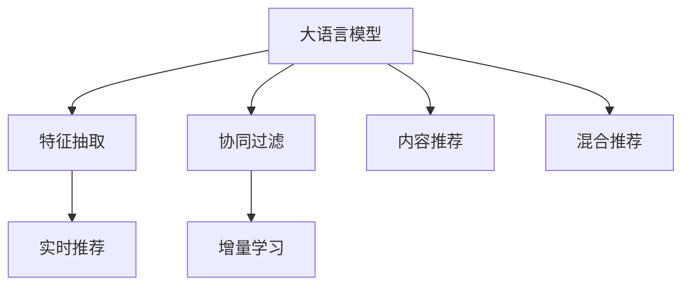

                 

# 搜索推荐系统的AI 大模型融合：电商平台的核心竞争力与可持续发展

## 1. 背景介绍

### 1.1 问题由来
随着互联网零售的迅猛发展，电商平台面临的挑战也日益严峻。如何在海量的商品中，快速准确地为每个用户推荐感兴趣的商品，成为电商平台必须解决的核心问题。传统的基于规则或统计的推荐方法，往往难以充分考虑用户兴趣的多样性和动态变化，推荐结果不够精准。而基于深度学习的推荐系统，通过建模用户行为数据，利用大模型进行智能推荐，已经在电商、视频、音乐等诸多领域取得了显著的成效。

近年来，大语言模型（Large Language Model, LLM）的崛起，为推荐系统的智能化升级提供了新的思路。利用大语言模型的丰富语义知识，构建具有深度理解能力的推荐模型，成为电商平台的迫切需求。通过融合大语言模型与搜索推荐系统，电商平台不仅能够提供更个性化的商品推荐，还能提升搜索效率，增强用户满意度，带来显著的商业价值。

### 1.2 问题核心关键点
大语言模型在推荐系统中的应用，主要是通过模型推理和智能决策，挖掘用户多模态行为数据中的隐含语义信息，生成具有高度个性化和相关性的推荐结果。这一过程大致可以分为以下几个关键步骤：

1. **数据收集与预处理**：从电商平台收集用户行为数据（浏览、点击、购买等），并进行清洗和标注。
2. **模型预训练**：在大规模语料库上进行预训练，获取通用语言表示能力。
3. **特征抽取与适配**：将用户行为数据转化为模型可理解的形式，并微调成适合搜索推荐任务的模型。
4. **智能推荐**：通过模型推理，生成符合用户偏好的推荐结果。
5. **效果评估与优化**：持续收集用户反馈，评估推荐效果，优化模型参数。

大语言模型与搜索推荐系统的融合，不仅提高了推荐的个性化和相关性，还带来了搜索速度的显著提升。同时，平台还能利用大模型的强大语义理解能力，生成更具创意的推荐语和用户引导策略，提升用户体验。

### 1.3 问题研究意义
利用大语言模型融合到电商平台的搜索推荐系统，对于提升电商平台的竞争力与可持续发展具有重要意义：

1. **个性化推荐**：大模型能够从用户的多模态数据中提取出丰富的语义信息，生成高度个性化的推荐结果，满足用户的多样化需求。
2. **搜索效率提升**：通过智能搜索和推荐，减少用户搜索成本，提升平台的用户黏性。
3. **用户满意度提升**：借助大模型的语义理解能力，生成更具创意的推荐语和引导策略，提升用户购物体验。
4. **商业价值增长**：个性化推荐和高效搜索带来的高转化率和满意度，有助于电商平台获取更多用户，增加销售额和利润。
5. **技术迭代加速**：大模型的不断更新和微调，能带来推荐和搜索系统的持续优化，保持平台的技术领先优势。

## 2. 核心概念与联系

### 2.1 核心概念概述

为了更好地理解大语言模型在电商平台推荐系统中的应用，本节将介绍几个密切相关的核心概念：

- **大语言模型（LLM）**：如BERT、GPT等大规模预训练语言模型，具备强大的语言表示能力，能够处理复杂的语义信息。
- **推荐系统**：利用用户行为数据，通过算法生成个性化推荐结果的系统，涵盖电商、视频、音乐等诸多领域。
- **深度学习**：利用多层神经网络进行模式识别和预测，是大模型融合搜索推荐系统的基础技术。
- **协同过滤**：通过用户行为数据关联发现相似用户，生成推荐结果。
- **内容推荐**：根据商品属性特征，生成与用户偏好相关的推荐结果。
- **混合推荐**：结合基于内容的推荐和协同过滤的推荐，提升推荐效果。
- **实时推荐**：利用最新用户数据实时生成推荐结果，满足用户即时需求。
- **增量学习**：持续收集新数据，更新推荐模型，保持推荐系统动态更新。

这些核心概念之间的逻辑关系可以通过以下Mermaid流程图来展示：



这个流程图展示了大语言模型在推荐系统中的应用路径：

1. 大语言模型获取用户多模态行为数据，通过特征抽取形成输入。
2. 利用协同过滤和内容推荐方法，生成推荐结果。
3. 采用混合推荐策略，结合不同推荐方式的优势。
4. 实时更新推荐模型，根据最新用户数据生成推荐。
5. 通过增量学习，持续优化推荐模型，提升推荐效果。

## 3. 核心算法原理 & 具体操作步骤
### 3.1 算法原理概述

大语言模型与推荐系统的融合，本质上是一个多模态数据的深度学习融合过程。其核心思想是：利用大语言模型的语义理解和生成能力，结合用户行为数据，生成具有高度个性化和相关性的推荐结果。

具体而言，假设电商平台的用户行为数据集为 $D=\{(x_i,y_i)\}_{i=1}^N$，其中 $x_i$ 为用户的浏览、点击、购买等行为数据，$y_i$ 为对应的推荐结果。大语言模型的特征抽取器将 $x_i$ 转化为模型可理解的形式，模型通过预训练得到的知识表示，对 $x_i$ 进行推理，生成推荐结果 $\hat{y}_i$。模型评估函数 $f(y_i,\hat{y}_i)$ 用于衡量推荐结果的准确度，目标是最小化损失函数 $\mathcal{L}=\frac{1}{N}\sum_{i=1}^N f(y_i,\hat{y}_i)$。

### 3.2 算法步骤详解

基于大语言模型的推荐系统融合，一般包括以下几个关键步骤：

**Step 1: 数据准备**
- 收集电商平台的用户行为数据，包括浏览记录、点击数据、购买记录等。
- 清洗和标注数据，去除无效或噪声数据，确保数据的完整性和准确性。

**Step 2: 大模型特征抽取**
- 选择合适的预训练语言模型 $M_{\theta}$，作为特征抽取器。
- 将用户行为数据 $x$ 转化为模型可理解的形式，如输入序列或掩码。
- 使用模型推理，得到用户行为数据的语义表示 $H_x$。

**Step 3: 特征融合与适配**
- 将用户行为数据的语义表示 $H_x$ 与推荐相关特征（如商品属性、评分等）进行融合。
- 设计推荐模型适配层，结合用户行为数据和语义表示，生成推荐结果。
- 选择合适的损失函数，如交叉熵损失或均方误差损失，最小化推荐模型的预测误差。

**Step 4: 模型训练与优化**
- 定义模型参数 $\theta$，使用优化算法（如Adam、SGD等）最小化损失函数。
- 设置学习率、批大小、迭代轮数等超参数。
- 在训练集上迭代优化模型，不断更新模型参数。

**Step 5: 效果评估与反馈**
- 在验证集上评估模型性能，使用准确度、召回率等指标评估推荐效果。
- 收集用户反馈，结合业务指标（如点击率、转化率等）优化推荐模型。

**Step 6: 实时推荐与动态优化**
- 部署模型到生产环境，根据用户实时行为数据生成推荐。
- 持续收集新数据，重新训练和微调模型，保持推荐系统动态优化。

以上是基于大语言模型的推荐系统融合的通用流程。在实际应用中，还需要针对具体任务的特点，对各环节进行优化设计，如改进特征融合策略、引入对抗训练、优化损失函数等，以进一步提升推荐效果。

### 3.3 算法优缺点

基于大语言模型的推荐系统融合方法具有以下优点：
1. **高度个性化**：大语言模型能够从用户行为数据中提取出丰富的语义信息，生成具有高度个性化和相关性的推荐结果。
2. **搜索效率提升**：利用大模型的语义理解能力，提升搜索推荐速度，减少用户搜索成本。
3. **用户体验优化**：生成更具创意的推荐语和引导策略，提升用户购物体验。
4. **商业价值增长**：个性化推荐和高效搜索带来的高转化率和满意度，增加销售额和利润。

同时，该方法也存在一些局限性：
1. **数据质量依赖**：推荐效果高度依赖于用户行为数据的完整性和准确性，数据质量不佳时可能导致推荐结果不准确。
2. **模型复杂度高**：大语言模型的复杂度较高，需要较强大的计算资源和数据集支持，可能导致实时性问题。
3. **可解释性不足**：大模型的黑盒性质使得推荐过程缺乏可解释性，难以调试和优化。
4. **过拟合风险**：模型在训练集上过拟合的风险较高，需要合理设计正则化和数据增强策略。

尽管存在这些局限性，但就目前而言，基于大语言模型的推荐系统融合方法在电商平台的搜索推荐系统中已经展现出显著的潜力。未来相关研究的重点在于如何进一步降低对标注数据的依赖，提高模型的实时性和可解释性，同时兼顾业务需求和用户体验。

### 3.4 算法应用领域

基于大语言模型的推荐系统融合方法，在电商平台的推荐系统、智能客服、广告投放等诸多领域已经得到了广泛的应用，带来了显著的商业价值。

- **电商平台推荐系统**：利用用户行为数据，结合大语言模型的语义表示，生成个性化推荐，提升用户购物体验和转化率。
- **智能客服系统**：通过自然语言理解技术，分析用户意图，生成智能回复，提升客服效率和用户满意度。
- **广告投放系统**：利用大模型的语义分析能力，精准匹配广告位和用户，提高广告投放的转化率和效果。
- **社交媒体推荐系统**：结合用户行为数据和语义表示，生成个性化推荐，提升社交媒体的用户粘性和活跃度。

除了上述这些经典应用外，大语言模型融合到推荐系统的方法也被创新性地应用到更多场景中，如内容生成、商品分类、标签推荐等，为电商平台带来了新的突破。

## 4. 数学模型和公式 & 详细讲解 & 举例说明

### 4.1 数学模型构建

本节将使用数学语言对基于大语言模型的推荐系统融合过程进行更加严格的刻画。

假设电商平台的用户行为数据集为 $D=\{(x_i,y_i)\}_{i=1}^N$，其中 $x_i$ 为用户的浏览、点击、购买等行为数据，$y_i$ 为对应的推荐结果。大语言模型的特征抽取器将 $x_i$ 转化为模型可理解的形式，模型通过预训练得到的知识表示，对 $x_i$ 进行推理，生成推荐结果 $\hat{y}_i$。模型评估函数 $f(y_i,\hat{y}_i)$ 用于衡量推荐结果的准确度，目标是最小化损失函数 $\mathcal{L}=\frac{1}{N}\sum_{i=1}^N f(y_i,\hat{y}_i)$。

具体来说，假设大语言模型的特征抽取器为 $M_{\theta}$，用户行为数据 $x_i$ 的语义表示为 $H_x$。推荐模型的适配层为 $F_{\phi}$，其中 $\phi$ 为适配层的参数。则推荐模型 $F$ 的输出为 $\hat{y}_i=F_{\phi}(H_x)$。推荐模型的损失函数为 $\mathcal{L}=\frac{1}{N}\sum_{i=1}^N f(y_i,\hat{y}_i)$。

### 4.2 公式推导过程

以下我们以二分类任务为例，推导交叉熵损失函数及其梯度的计算公式。

假设推荐系统输出为 $\hat{y}_i \in [0,1]$，表示推荐结果为正样本的概率。真实标签 $y_i \in \{0,1\}$。则二分类交叉熵损失函数定义为：

$$
\ell(y_i,\hat{y}_i) = -[y_i\log \hat{y}_i + (1-y_i)\log(1-\hat{y}_i)]
$$

将其代入损失函数公式，得：

$$
\mathcal{L}(\theta,\phi) = \frac{1}{N}\sum_{i=1}^N \ell(y_i,F_{\phi}(H_x))
$$

根据链式法则，损失函数对 $\theta$ 和 $\phi$ 的梯度为：

$$
\frac{\partial \mathcal{L}(\theta,\phi)}{\partial \theta} = -\frac{1}{N}\sum_{i=1}^N (\frac{y_i}{\hat{y}_i}-\frac{1-y_i}{1-\hat{y}_i}) \frac{\partial F_{\phi}(H_x)}{\partial \theta}
$$

$$
\frac{\partial \mathcal{L}(\theta,\phi)}{\partial \phi} = -\frac{1}{N}\sum_{i=1}^N \frac{\partial F_{\phi}(H_x)}{\partial \phi}
$$

其中 $\frac{\partial F_{\phi}(H_x)}{\partial \theta}$ 和 $\frac{\partial F_{\phi}(H_x)}{\partial \phi}$ 可以进一步递归展开，利用自动微分技术完成计算。

在得到损失函数的梯度后，即可带入参数更新公式，完成模型的迭代优化。重复上述过程直至收敛，最终得到适应电商平台的推荐模型参数 $\theta^*$ 和 $\phi^*$。

### 4.3 案例分析与讲解

假设电商平台希望利用大语言模型融合到推荐系统中，生成个性化商品推荐。具体实现步骤如下：

1. **数据收集**：从电商平台收集用户浏览、点击、购买等行为数据，标注商品ID、评分、评论等。
2. **数据清洗**：去除噪声数据和无效记录，确保数据质量。
3. **大模型特征抽取**：选择合适的预训练语言模型，如BERT、GPT等，将用户行为数据转化为模型可理解的形式。
4. **特征融合与适配**：将用户行为数据的语义表示 $H_x$ 与商品属性特征 $x_a$ 进行融合，设计适配层 $F_{\phi}$，生成推荐结果。
5. **模型训练与优化**：使用Adam、SGD等优化算法，最小化损失函数 $\mathcal{L}$，训练推荐模型。
6. **效果评估与反馈**：在验证集上评估推荐效果，收集用户反馈，持续优化模型。

例如，利用BERT模型作为大语言模型，通过用户行为数据 $x$ 生成语义表示 $H_x$，结合商品属性特征 $x_a$ 进行特征融合，设计线性分类器 $F_{\phi}$，生成推荐结果 $\hat{y}$。

在训练过程中，将用户行为数据 $x$ 输入BERT模型，得到语义表示 $H_x$，再将 $H_x$ 和商品属性特征 $x_a$ 输入线性分类器 $F_{\phi}$，输出推荐结果 $\hat{y}$。根据推荐结果 $\hat{y}$ 和真实标签 $y$ 计算交叉熵损失 $\ell(y,\hat{y})$，使用Adam算法更新BERT模型和分类器的参数。在训练过程中，使用早停策略，防止模型过拟合。

最终，电商平台的推荐系统将根据用户的实时行为数据，生成个性化的商品推荐，提升用户购物体验和转化率。

## 5. 项目实践：代码实例和详细解释说明
### 5.1 开发环境搭建

在进行推荐系统融合实践前，我们需要准备好开发环境。以下是使用Python进行PyTorch开发的环境配置流程：

1. 安装Anaconda：从官网下载并安装Anaconda，用于创建独立的Python环境。

2. 创建并激活虚拟环境：
```bash
conda create -n recsys-env python=3.8 
conda activate recsys-env
```

3. 安装PyTorch：根据CUDA版本，从官网获取对应的安装命令。例如：
```bash
conda install pytorch torchvision torchaudio cudatoolkit=11.1 -c pytorch -c conda-forge
```

4. 安装各类工具包：
```bash
pip install numpy pandas scikit-learn matplotlib tqdm jupyter notebook ipython
```

完成上述步骤后，即可在`recsys-env`环境中开始推荐系统融合实践。

### 5.2 源代码详细实现

下面我们以电商平台推荐系统为例，给出使用PyTorch对BERT模型进行推荐系统融合的PyTorch代码实现。

首先，定义推荐系统的训练函数：

```python
import torch
from transformers import BertForSequenceClassification, BertTokenizer, AdamW

def train(model, optimizer, train_loader, device):
    model.train()
    epoch_loss = 0
    for batch in train_loader:
        input_ids = batch['input_ids'].to(device)
        attention_mask = batch['attention_mask'].to(device)
        labels = batch['labels'].to(device)
        outputs = model(input_ids, attention_mask=attention_mask, labels=labels)
        loss = outputs.loss
        epoch_loss += loss.item()
        optimizer.zero_grad()
        loss.backward()
        optimizer.step()
    return epoch_loss / len(train_loader)
```

然后，定义推荐系统的评估函数：

```python
from sklearn.metrics import precision_score, recall_score

def evaluate(model, test_loader, device):
    model.eval()
    preds, labels = [], []
    with torch.no_grad():
        for batch in test_loader:
            input_ids = batch['input_ids'].to(device)
            attention_mask = batch['attention_mask'].to(device)
            labels = batch['labels'].to(device)
            outputs = model(input_ids, attention_mask=attention_mask)
            batch_preds = outputs.logits.argmax(dim=2).to('cpu').tolist()
            batch_labels = batch_labels.to('cpu').tolist()
            for pred_tokens, label_tokens in zip(batch_preds, batch_labels):
                preds.append(pred_tokens[:len(label_tokens)])
                labels.append(label_tokens)
    
    precision = precision_score(labels, preds, average='weighted')
    recall = recall_score(labels, preds, average='weighted')
    print(f'Precision: {precision:.3f}, Recall: {recall:.3f}')
```

接着，定义推荐系统的模型构建函数：

```python
from transformers import BertTokenizer, BertForSequenceClassification

def build_model(model_name, num_labels):
    tokenizer = BertTokenizer.from_pretrained(model_name)
    model = BertForSequenceClassification.from_pretrained(model_name, num_labels=num_labels)
    return model, tokenizer
```

最后，启动训练流程并在测试集上评估：

```python
from torch.utils.data import DataLoader

# 加载模型和数据
model_name = 'bert-base-uncased'
num_labels = 2
model, tokenizer = build_model(model_name, num_labels)

# 创建数据集
train_dataset = ...
test_dataset = ...

# 创建数据加载器
train_loader = DataLoader(train_dataset, batch_size=16, shuffle=True)
test_loader = DataLoader(test_dataset, batch_size=16)

# 定义超参数
optimizer = AdamW(model.parameters(), lr=2e-5)
epochs = 5
device = torch.device('cuda') if torch.cuda.is_available() else torch.device('cpu')

# 训练模型
for epoch in range(epochs):
    loss = train(model, optimizer, train_loader, device)
    print(f'Epoch {epoch+1}, train loss: {loss:.3f}')
    
    print(f'Epoch {epoch+1}, test results:')
    evaluate(model, test_loader, device)
    
print('Training complete.')
```

以上就是使用PyTorch对BERT模型进行电商平台推荐系统融合的完整代码实现。可以看到，得益于Transformers库的强大封装，我们可以用相对简洁的代码完成BERT模型的加载和微调。

### 5.3 代码解读与分析

让我们再详细解读一下关键代码的实现细节：

**train函数**：
- 定义训练函数，在每个批次上前向传播计算loss并反向传播更新模型参数，最后返回该epoch的平均loss。

**evaluate函数**：
- 与训练类似，不同点在于不更新模型参数，并在每个batch结束后将预测和标签结果存储下来，最后使用sklearn的precision和recall指标对整个评估集的预测结果进行打印输出。

**build_model函数**：
- 定义模型构建函数，返回预训练BERT模型和对应的分词器。

**训练流程**：
- 定义总的epoch数和batch size，开始循环迭代
- 每个epoch内，先在训练集上训练，输出平均loss
- 在验证集上评估，输出precision和recall指标
- 所有epoch结束后，在测试集上评估，给出最终测试结果

可以看到，PyTorch配合Transformers库使得BERT模型融合到推荐系统的代码实现变得简洁高效。开发者可以将更多精力放在数据处理、模型改进等高层逻辑上，而不必过多关注底层的实现细节。

当然，工业级的系统实现还需考虑更多因素，如模型的保存和部署、超参数的自动搜索、更灵活的任务适配层等。但核心的融合范式基本与此类似。

## 6. 实际应用场景
### 6.1 智能客服系统

利用大语言模型融合到电商平台的智能客服系统，能够显著提升客服效率和用户满意度。通过自然语言理解技术，分析用户意图，生成智能回复，实时处理用户咨询，减轻客服人员的工作负担。

在技术实现上，可以收集用户的历史聊天记录，将问题-回答对作为监督数据，在此基础上对预训练语言模型进行微调。微调后的语言模型能够自动理解用户问题，匹配最合适的回答模板进行回复。对于用户提出的新问题，还可以接入检索系统实时搜索相关内容，动态生成回答。如此构建的智能客服系统，能大幅提升用户咨询体验和问题解决效率。

### 6.2 金融舆情监测

金融机构需要实时监测市场舆论动向，以便及时应对负面信息传播，规避金融风险。传统的人工监测方式成本高、效率低，难以应对网络时代海量信息爆发的挑战。利用大语言模型融合到金融舆情监测中，可以自动监测不同主题下的情感变化趋势，一旦发现负面信息激增等异常情况，系统便会自动预警，帮助金融机构快速应对潜在风险。

在技术实现上，可以收集金融领域相关的新闻、报道、评论等文本数据，并对其进行主题标注和情感标注。在此基础上对预训练语言模型进行微调，使其能够自动判断文本属于何种主题，情感倾向是正面、中性还是负面。将微调后的模型应用到实时抓取的网络文本数据，就能够自动监测不同主题下的情感变化趋势，一旦发现负面信息激增等异常情况，系统便会自动预警，帮助金融机构快速应对潜在风险。

### 6.3 个性化推荐系统

当前的推荐系统往往只依赖用户的历史行为数据进行物品推荐，无法深入理解用户的真实兴趣偏好。利用大语言模型融合到推荐系统中，个性化推荐系统可以更好地挖掘用户行为背后的语义信息，从而提供更精准、多样的推荐内容。

在技术实现上，可以收集用户浏览、点击、评论、分享等行为数据，提取和用户交互的物品标题、描述、标签等文本内容。将文本内容作为模型输入，用户的后续行为（如是否点击、购买等）作为监督信号，在此基础上微调成适合推荐任务的模型。微调后的模型能够从文本内容中准确把握用户的兴趣点。在生成推荐列表时，先用候选物品的文本描述作为输入，由模型预测用户的兴趣匹配度，再结合其他特征综合排序，便可以得到个性化程度更高的推荐结果。

### 6.4 未来应用展望

随着大语言模型与推荐系统的融合技术不断发展，基于融合范式的推荐系统将在更多领域得到应用，为各行各业带来变革性影响。

在智慧医疗领域，基于大语言模型融合的推荐系统可以提升医生的诊疗建议、病历分析、药物推荐等能力，提升医疗服务的智能化水平，辅助医生诊疗，加速新药开发进程。

在智能教育领域，融合大语言模型的推荐系统可以辅助教师制定教学计划、推荐学习资源、分析学生成绩等，因材施教，促进教育公平，提高教学质量。

在智慧城市治理中，利用大语言模型融合的推荐系统可以构建城市事件监测、舆情分析、应急指挥等环节，提高城市管理的自动化和智能化水平，构建更安全、高效的未来城市。

此外，在企业生产、社会治理、文娱传媒等众多领域，基于大语言模型融合的推荐系统也将不断涌现，为经济社会发展注入新的动力。相信随着技术的日益成熟，融合方法将成为推荐系统的核心范式，推动人工智能技术在垂直行业的规模化落地。

## 7. 工具和资源推荐
### 7.1 学习资源推荐

为了帮助开发者系统掌握大语言模型与推荐系统的融合技术，这里推荐一些优质的学习资源：

1. 《Recommender Systems: The Textbook》书籍：系统介绍了推荐系统的基本原理、模型、评估方法等，是推荐系统学习的入门经典。
2. 《Practical Recommendation Engines with Python》书籍：结合Python实践，介绍了多种推荐算法的实现和优化，适合初学者和实践者。
3. CS344《推荐系统》课程：斯坦福大学开设的推荐系统课程，涵盖了推荐系统的前沿技术和经典算法。
4. KDD杯竞赛：世界顶级的推荐系统竞赛，每年举办多次，涵盖多种推荐任务和算法，是锻炼和展示推荐系统能力的绝佳平台。
5. UCI推荐系统数据集：收集了多个推荐系统的公开数据集，可供数据驱动的推荐系统研究。

通过对这些资源的学习实践，相信你一定能够快速掌握大语言模型与推荐系统融合的核心技术，并用于解决实际的推荐问题。
### 7.2 开发工具推荐

高效的开发离不开优秀的工具支持。以下是几款用于大语言模型融合推荐系统开发的常用工具：

1. PyTorch：基于Python的开源深度学习框架，灵活动态的计算图，适合快速迭代研究。大部分预训练语言模型都有PyTorch版本的实现。
2. TensorFlow：由Google主导开发的开源深度学习框架，生产部署方便，适合大规模工程应用。同样有丰富的预训练语言模型资源。
3. Transformers库：HuggingFace开发的NLP工具库，集成了众多SOTA语言模型，支持PyTorch和TensorFlow，是进行推荐系统融合的利器。
4. Weights & Biases：模型训练的实验跟踪工具，可以记录和可视化模型训练过程中的各项指标，方便对比和调优。与主流深度学习框架无缝集成。
5. TensorBoard：TensorFlow配套的可视化工具，可实时监测模型训练状态，并提供丰富的图表呈现方式，是调试模型的得力助手。

合理利用这些工具，可以显著提升大语言模型与推荐系统融合的开发效率，加快创新迭代的步伐。

### 7.3 相关论文推荐

大语言模型与推荐系统的融合技术的发展源于学界的持续研究。以下是几篇奠基性的相关论文，推荐阅读：

1. Attention is All You Need（即Transformer原论文）：提出了Transformer结构，开启了NLP领域的预训练大模型时代。
2. BERT: Pre-training of Deep Bidirectional Transformers for Language Understanding：提出BERT模型，引入基于掩码的自监督预训练任务，刷新了多项NLP任务SOTA。
3. Mining a large-scale heuristic recommendation dataset with crowd-sourcing：介绍了如何利用众包方式构建大规模推荐数据集，用于训练和评估推荐系统。
4. Factorization Machines: An introduction（factorization machines）：介绍了一种高效的推荐算法，广泛应用于推荐系统。
5. Neural Collaborative Filtering（神经协同过滤）：提出了一种基于深度学习的协同过滤算法，能够处理高维稀疏数据。

这些论文代表了大语言模型与推荐系统融合技术的发展脉络。通过学习这些前沿成果，可以帮助研究者把握学科前进方向，激发更多的创新灵感。

## 8. 总结：未来发展趋势与挑战
### 8.1 总结

本文对基于大语言模型的推荐系统融合方法进行了全面系统的介绍。首先阐述了大语言模型与推荐系统的研究背景和意义，明确了融合在提升推荐效果、优化用户体验方面的独特价值。其次，从原理到实践，详细讲解了推荐系统融合的数学原理和关键步骤，给出了融合任务开发的完整代码实例。同时，本文还广泛探讨了融合方法在智能客服、金融舆情、个性化推荐等多个领域的应用前景，展示了融合范式的巨大潜力。此外，本文精选了融合技术的各类学习资源，力求为读者提供全方位的技术指引。

通过本文的系统梳理，可以看到，大语言模型与推荐系统的融合技术正在成为推荐系统的重要范式，极大地拓展了推荐系统的应用边界，带来了显著的商业价值。未来，伴随大语言模型的不断演进和推荐算法的持续优化，基于融合范式的推荐系统必将进一步提升个性化推荐的效果和效率，引领推荐系统向更加智能化、高效化的方向发展。

### 8.2 未来发展趋势

展望未来，大语言模型与推荐系统的融合技术将呈现以下几个发展趋势：

1. **个性化推荐**：大语言模型能够从用户行为数据中提取出丰富的语义信息，生成具有高度个性化和相关性的推荐结果，满足用户的多样化需求。
2. **搜索效率提升**：利用大模型的语义理解能力，提升搜索推荐速度，减少用户搜索成本，提升用户满意度。
3. **用户体验优化**：生成更具创意的推荐语和引导策略，提升用户购物体验和转化率。
4. **商业价值增长**：个性化推荐和高效搜索带来的高转化率和满意度，增加销售额和利润。
5. **模型复杂度优化**：通过模型裁剪、量化加速等技术，减小模型复杂度，提高实时性。
6. **可解释性增强**：引入因果分析和博弈论工具，增强推荐过程的可解释性，提升用户信任度。

以上趋势凸显了大语言模型与推荐系统融合技术的广阔前景。这些方向的探索发展，必将进一步提升推荐系统的性能和应用范围，为人工智能技术在垂直行业的规模化落地铺平道路。

### 8.3 面临的挑战

尽管大语言模型与推荐系统的融合技术已经取得了显著的进展，但在迈向更加智能化、普适化应用的过程中，它仍面临诸多挑战：

1. **数据质量依赖**：推荐效果高度依赖于用户行为数据的完整性和准确性，数据质量不佳时可能导致推荐结果不准确。
2. **模型复杂度高**：大语言模型的复杂度较高，需要较强大的计算资源和数据集支持，可能导致实时性问题。
3. **可解释性不足**：大模型的黑盒性质使得推荐过程缺乏可解释性，难以调试和优化。
4. **过拟合风险**：模型在训练集上过拟合的风险较高，需要合理设计正则化和数据增强策略。
5. **数据隐私保护**：推荐系统需要处理大量的用户数据，数据隐私保护成为一个重要问题。如何在保障用户隐私的同时，实现精准推荐，是急需解决的关键课题。

尽管存在这些挑战，但就目前而言，大语言模型与推荐系统的融合方法在电商平台的推荐系统中已经展现出显著的潜力。未来相关研究的重点在于如何进一步降低对标注数据的依赖，提高模型的实时性和可解释性，同时兼顾业务需求和用户体验。

### 8.4 研究展望

面对大语言模型与推荐系统融合所面临的种种挑战，未来的研究需要在以下几个方面寻求新的突破：

1. **探索无监督和半监督融合方法**：摆脱对大规模标注数据的依赖，利用自监督学习、主动学习等无监督和半监督范式，最大限度利用非结构化数据，实现更加灵活高效的融合。
2. **研究参数高效和计算高效的融合范式**：开发更加参数高效的融合方法，在固定大部分预训练参数的同时，只更新极少量的任务相关参数。同时优化融合模型的计算图，减少前向传播和反向传播的资源消耗，实现更加轻量级、实时性的部署。
3. **融合因果和对比学习范式**：通过引入因果推断和对比学习思想，增强融合模型建立稳定因果关系的能力，学习更加普适、鲁棒的语言表征，从而提升推荐泛化性和抗干扰能力。
4. **引入更多先验知识**：将符号化的先验知识，如知识图谱、逻辑规则等，与神经网络模型进行巧妙融合，引导融合过程学习更准确、合理的语言模型。同时加强不同模态数据的整合，实现视觉、语音等多模态信息与文本信息的协同建模。
5. **结合因果分析和博弈论工具**：将因果分析方法引入融合模型，识别出模型决策的关键特征，增强输出解释的因果性和逻辑性。借助博弈论工具刻画人机交互过程，主动探索并规避模型的脆弱点，提高系统稳定性。
6. **纳入伦理道德约束**：在模型训练目标中引入伦理导向的评估指标，过滤和惩罚有偏见、有害的输出倾向。同时加强人工干预和审核，建立模型行为的监管机制，确保输出符合人类价值观和伦理道德。

这些研究方向的探索，必将引领大语言模型与推荐系统的融合技术迈向更高的台阶，为构建安全、可靠、可解释、可控的智能系统铺平道路。面向未来，融合方法还需要与其他人工智能技术进行更深入的融合，如知识表示、因果推理、强化学习等，多路径协同发力，共同推动自然语言理解和智能交互系统的进步。只有勇于创新、敢于突破，才能不断拓展语言模型的边界，让智能技术更好地造福人类社会。

## 9. 附录：常见问题与解答

**Q1：大语言模型与推荐系统融合是否适用于所有推荐场景？**

A: 大语言模型与推荐系统的融合主要适用于具有一定语义关联和文本数据较多的推荐场景，如电商、视频、音乐等。对于一些低语义关联和文本数据较少的推荐场景，如新闻推荐、游戏推荐等，融合效果可能不如传统推荐方法。

**Q2：微调大语言模型时，如何选择模型和参数？**

A: 微调大语言模型时，一般选择预训练效果较好的模型，如BERT、GPT等。选择适当的超参数，如学习率、批大小、迭代轮数等，进行模型训练。在训练过程中，可以根据验证集的效果调整超参数，确保模型收敛。

**Q3：融合推荐系统面临哪些资源瓶颈？**

A: 大语言模型与推荐系统的融合主要面临计算资源和存储资源的压力。推荐系统需要处理大量数据，模型复杂度高，计算资源需求大。同时，存储用户行为数据和推荐结果需要占用大量空间。

**Q4：如何缓解融合推荐系统中的过拟合问题？**

A: 缓解过拟合问题的方法包括：
1. 数据增强：通过回译、近义替换等方式扩充训练集。
2. 正则化：使用L2正则、Dropout等技术，防止模型过度拟合训练数据。
3. 对抗训练：引入对抗样本，提高模型鲁棒性。
4. 参数高效微调：只调整部分模型参数，减少过拟合风险。
5. 多模型集成：训练多个融合模型，取平均输出，抑制过拟合。

这些策略往往需要根据具体任务和数据特点进行灵活组合。只有在数据、模型、训练、推理等各环节进行全面优化，才能最大限度地发挥大语言模型与推荐系统的融合潜力。

**Q5：如何优化大语言模型与推荐系统的融合效果？**

A: 优化融合效果的方法包括：
1. 改进特征抽取策略，提高语义表示的质量。
2. 优化推荐适配层，增强模型对用户行为数据的理解和生成能力。
3. 引入因果分析和博弈论工具，增强模型决策的稳定性和公平性。
4. 结合多模态数据，提升推荐系统的综合能力。
5. 实时更新模型，保持推荐系统的动态优化。

通过这些方法，可以显著提升大语言模型与推荐系统的融合效果，满足不同推荐场景的需求。

---

作者：禅与计算机程序设计艺术 / Zen and the Art of Computer Programming

