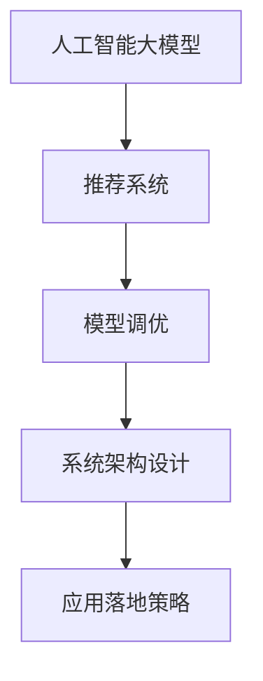

                 

## 1. 背景介绍

### 1.1 问题由来

在当下数字化时代，电商平台作为数字经济的重要组成部分，正面临着前所未有的机遇与挑战。一方面，随着信息技术的飞速发展，电商平台的数据规模呈现爆炸式增长，形成了以用户行为数据为主导的“数据海洋”。另一方面，消费者对于个性化、精准化商品推荐的需求日益增强，迫切需要构建智能、高效的搜索推荐系统。

然而，在搜索推荐系统的构建中，传统的机器学习方法往往面临计算复杂度高、模型泛化能力差、推荐结果不精准等问题。为此，近年来，人工智能大模型被广泛应用到搜索推荐领域，通过引入预训练语言模型、自回归模型等，大幅提升了推荐的准确性和个性化程度。

本论文聚焦于电商平台的搜索推荐系统，探讨如何通过融合人工智能大模型，构建高效、精准、个性化的推荐引擎，以期增强平台的核心竞争力，推动产业的转型发展。

### 1.2 问题核心关键点

为了更好地回答如何构建高效、精准、个性化的推荐引擎，本论文将围绕以下几个核心问题展开探讨：

- **大模型融合策略**：如何选择合适的预训练模型，并与其进行有效融合，以实现搜索推荐任务的提升？
- **推荐算法优化**：在融合大模型的基础上，如何优化推荐算法，以提高推荐效果和系统效率？
- **系统架构设计**：构建搜索推荐系统的整体架构，确保系统能够高效处理海量用户行为数据，实现个性化推荐。
- **应用落地策略**：如何将大模型融合技术应用到电商平台的实际推荐场景中，并根据业务需求进行不断迭代优化？

解决这些问题，需要从算法、模型、系统、应用等多个层面进行深入研究，探索最有效的融合策略和方法。

### 1.3 问题研究意义

大模型融合技术的应用，将对电商平台产生深远的影响：

- **提升用户体验**：通过构建个性化推荐引擎，电商平台能够更好地满足用户需求，提升用户体验，增加用户粘性。
- **提高运营效率**：推荐系统的优化能够减少人工干预，降低运营成本，提高运营效率。
- **促进销售转化**：精准的推荐能够帮助电商平台提高用户购买转化率，增加收入来源。
- **增强核心竞争力**：在数据驱动的竞争环境中，先进的搜索推荐技术将成为电商平台的核心竞争力。
- **推动产业转型**：大模型融合技术的广泛应用，将推动电商平台的数字化转型，加速产业升级。

## 2. 核心概念与联系

### 2.1 核心概念概述

为了回答上述核心问题，本节将介绍几个密切相关的核心概念：

- **人工智能大模型**：指通过大规模数据训练得到的深度学习模型，具备强大的语言表示和处理能力。常见的有大模型包括BERT、GPT、DALL-E等。
- **推荐系统**：通过分析用户行为数据，为用户推荐个性化商品或内容的技术系统。推荐系统的目标是通过最小化用户点击率、转化率等指标，提升用户满意度。
- **融合**：将多个独立模型或组件进行有效整合，提升整体系统的性能和泛化能力。融合技术在大模型应用中尤为重要。
- **模型调优**：在融合大模型的基础上，根据具体任务需求，调整模型参数和结构，以达到最优的推荐效果。
- **系统架构设计**：推荐系统需要具备高效的数据处理能力、精确的推荐算法、可靠的稳定性、灵活的扩展性等特性，需要进行全面的架构设计。

这些概念之间的逻辑关系可以通过以下Mermaid流程图来展示：



这个流程图展示了大模型融合技术在推荐系统中的核心流程：

1. 大模型作为基础技术，用于提取用户行为和商品描述的特征表示。
2. 通过模型调优技术，对大模型输出的特征进行进一步处理和优化，以匹配推荐任务的特定需求。
3. 系统架构设计，确保推荐系统具备高效的数据处理能力、精确的推荐算法和可靠的稳定性。
4. 应用落地策略，将大模型融合技术应用到电商平台的实际推荐场景中，并根据业务需求进行不断迭代优化。

## 3. 核心算法原理 & 具体操作步骤
### 3.1 算法原理概述

在电商平台的搜索推荐系统中，大模型融合技术主要应用于以下两个方面：

1. **用户行为理解**：通过预训练大模型提取用户行为数据的特征表示，帮助系统理解用户的兴趣和偏好。
2. **商品描述编码**：利用大模型对商品描述进行编码，以提取商品的特征和属性信息。

这两种融合方式的具体算法原理和操作步骤如下：

### 3.2 算法步骤详解

#### 用户行为理解

**步骤1：数据预处理**
- 收集电商平台的用户行为数据，包括浏览记录、购买记录、评分记录等。
- 对数据进行清洗和标注，确保数据的完整性和准确性。

**步骤2：预训练模型选择**
- 选择合适的预训练大模型，如BERT、GPT等，进行特征提取。
- 确定大模型的参数量、预训练数据集和训练时间等参数。

**步骤3：特征表示提取**
- 使用大模型对用户行为数据进行编码，提取用户兴趣和偏好的特征表示。
- 可以使用大模型的特征嵌入层（如BERT的隐层表示），作为用户行为特征的表示。

**步骤4：融合算法选择**
- 选择适合的融合算法，如加权融合、注意力机制、拼接融合等，将大模型的特征表示与其他特征（如时间戳、地理位置等）进行融合。
- 通过交叉验证等方法，评估融合算法的效果，选择最优方案。

**步骤5：模型调优**
- 根据推荐任务的要求，对融合后的特征表示进行模型调优。
- 常见的模型调优方法包括回归模型、分类模型、序列模型等，以实现不同的推荐目标。
- 使用评估指标（如精确率、召回率、F1分数等）对模型进行评估和调优。

#### 商品描述编码

**步骤1：数据预处理**
- 收集电商平台的商品描述数据，包括商品标题、属性、标签等。
- 对数据进行清洗和标注，确保数据的完整性和准确性。

**步骤2：预训练模型选择**
- 选择合适的预训练大模型，如BERT、GPT等，进行特征提取。
- 确定大模型的参数量、预训练数据集和训练时间等参数。

**步骤3：特征表示提取**
- 使用大模型对商品描述进行编码，提取商品特征和属性信息的表示。
- 可以使用大模型的特征嵌入层（如BERT的隐层表示），作为商品描述特征的表示。

**步骤4：融合算法选择**
- 选择适合的融合算法，如加权融合、注意力机制、拼接融合等，将大模型的特征表示与其他特征（如商品类别、销量等）进行融合。
- 通过交叉验证等方法，评估融合算法的效果，选择最优方案。

**步骤5：模型调优**
- 根据推荐任务的要求，对融合后的特征表示进行模型调优。
- 常见的模型调优方法包括回归模型、分类模型、序列模型等，以实现不同的推荐目标。
- 使用评估指标（如精确率、召回率、F1分数等）对模型进行评估和调优。

### 3.3 算法优缺点

**优点**：

1. **特征提取能力强**：大模型能够提取丰富的语义和上下文信息，有助于提升推荐系统的性能。
2. **泛化能力强**：大模型在大量无标签数据上进行预训练，具备较强的泛化能力，能够适应不同的推荐任务。
3. **计算效率高**：大模型能够并行处理大量数据，显著提高推荐系统的计算效率。

**缺点**：

1. **资源消耗大**：大模型通常需要大量的计算资源和存储空间，可能对平台的资源配置提出较高要求。
2. **模型复杂度高**：大模型的结构和参数量较大，可能带来较高的调优复杂度。
3. **可解释性不足**：大模型的决策过程较为复杂，难以进行直观的解释和调试。

### 3.4 算法应用领域

大模型融合技术已经在电商平台的搜索推荐系统中得到了广泛的应用，具体包括：

- **个性化推荐**：通过理解用户行为和商品描述，构建个性化推荐引擎，提高用户的购买转化率。
- **搜索排序**：利用大模型的特征提取能力，对搜索结果进行排序，提升搜索的精准性和用户体验。
- **跨品类推荐**：将不同品类商品的相关特征进行融合，实现跨品类推荐，拓展推荐范围。
- **内容生成**：利用大模型对用户评论进行理解，生成商品的描述和标签，丰富商品信息。

## 4. 数学模型和公式 & 详细讲解 & 举例说明
### 4.1 数学模型构建

本节将使用数学语言对大模型融合技术在电商平台搜索推荐系统中的应用进行更加严格的刻画。

假设电商平台的用户行为数据为 $D=\{(x_i,y_i)\}_{i=1}^N$，其中 $x_i$ 为用户的浏览记录，$y_i$ 为用户的购买记录。设大模型为 $M_{\theta}$，输出特征向量表示为 $z_i=\text{embed}(M_{\theta}(x_i))$。

**用户行为理解模型**：
- **特征表示**：用户兴趣特征表示 $f_i=\alpha z_i+(1-\alpha)F(x_i)$，其中 $F(\cdot)$ 为其他特征的表示，$\alpha$ 为融合系数。
- **模型调优**：使用回归模型（如线性回归、决策树等）对特征表示 $f_i$ 进行建模，得到用户推荐结果 $r_i$。

**商品描述编码模型**：
- **特征表示**：商品描述特征表示 $g_j=\beta z_j+(1-\beta)G(j)$，其中 $G(\cdot)$ 为商品其他特征的表示，$\beta$ 为融合系数。
- **模型调优**：使用分类模型（如逻辑回归、支持向量机等）对特征表示 $g_j$ 进行建模，得到商品推荐结果 $s_j$。

### 4.2 公式推导过程

**用户行为理解模型**：
- **特征表示**：$z_i=\text{embed}(M_{\theta}(x_i))$
- **特征融合**：$f_i=\alpha z_i+(1-\alpha)F(x_i)$
- **模型调优**：$r_i=\mathcal{M}(f_i)$

其中，$\mathcal{M}(\cdot)$ 为回归模型的映射函数。

**商品描述编码模型**：
- **特征表示**：$g_j=\beta z_j+(1-\beta)G(j)$
- **特征融合**：$s_j=\mathcal{C}(g_j)$
- **模型调优**：$o_j=\mathcal{S}(s_j)$

其中，$\mathcal{C}(\cdot)$ 为分类模型的映射函数，$\mathcal{S}(\cdot)$ 为其他推荐模型的映射函数。

### 4.3 案例分析与讲解

假设电商平台有100万用户，每用户每天浏览10个商品，每个商品描述包含100个特征。设大模型为BERT，输出特征向量维度为512，其他特征维度为20。

1. **用户行为理解模型**：
   - 对于用户 $i$，将行为数据 $x_i$ 输入BERT模型，提取特征表示 $z_i$。
   - 将 $z_i$ 与其他特征 $F(x_i)$ 进行加权融合，得到用户兴趣特征表示 $f_i$。
   - 使用线性回归模型对 $f_i$ 进行建模，得到用户推荐结果 $r_i$。

2. **商品描述编码模型**：
   - 对于商品 $j$，将描述数据 $g_j$ 输入BERT模型，提取特征表示 $g_j$。
   - 将 $g_j$ 与其他特征 $G(j)$ 进行加权融合，得到商品特征表示 $s_j$。
   - 使用逻辑回归模型对 $s_j$ 进行建模，得到商品推荐结果 $o_j$。

通过以上步骤，电商平台能够构建起高效的搜索推荐系统，实现个性化推荐和搜索排序。

## 5. 项目实践：代码实例和详细解释说明
### 5.1 开发环境搭建

在进行大模型融合实践前，我们需要准备好开发环境。以下是使用Python进行PyTorch开发的环境配置流程：

1. 安装Anaconda：从官网下载并安装Anaconda，用于创建独立的Python环境。

2. 创建并激活虚拟环境：
```bash
conda create -n pytorch-env python=3.8 
conda activate pytorch-env
```

3. 安装PyTorch：根据CUDA版本，从官网获取对应的安装命令。例如：
```bash
conda install pytorch torchvision torchaudio cudatoolkit=11.1 -c pytorch -c conda-forge
```

4. 安装TensorFlow：
```bash
pip install tensorflow
```

5. 安装BERT和GPT模型：
```bash
pip install transformers
```

6. 安装各类工具包：
```bash
pip install numpy pandas scikit-learn matplotlib tqdm jupyter notebook ipython
```

完成上述步骤后，即可在`pytorch-env`环境中开始大模型融合实践。

### 5.2 源代码详细实现

下面我们以电商平台个性化推荐为例，给出使用PyTorch进行大模型融合的代码实现。

首先，定义推荐系统的基本框架：

```python
import torch
from transformers import BertForSequenceClassification

class RecommendationSystem:
    def __init__(self):
        self.bert_model = BertForSequenceClassification.from_pretrained('bert-base-cased')
        self.bert_model.train()
        self.bert_model.to('cuda')
    
    def forward(self, input_ids, attention_mask, labels=None):
        outputs = self.bert_model(input_ids=input_ids, attention_mask=attention_mask)
        logits = outputs.logits
        return logits
```

然后，定义用户行为理解和商品描述编码的模块：

```python
class UserBehaviorEmbedding:
    def __init__(self, bert_model):
        self.bert_model = bert_model
    
    def encode_user_behavior(self, user_behavior):
        input_ids = self.bert_model.encode(user_behavior)
        return input_ids

class ItemDescriptionEmbedding:
    def __init__(self, bert_model):
        self.bert_model = bert_model
    
    def encode_item_description(self, item_description):
        input_ids = self.bert_model.encode(item_description)
        return input_ids
```

接着，定义推荐算法的模块：

```python
class RecommendationAlgorithm:
    def __init__(self, user_model, item_model, fusion_method):
        self.user_model = user_model
        self.item_model = item_model
        self.fusion_method = fusion_method
    
    def encode_user_behavior(self, user_behavior):
        user_input_ids = self.user_model.encode_user_behavior(user_behavior)
        user_feature = self.fusion_method(user_input_ids, self.user_model.fusion_coefficient)
        return user_feature
    
    def encode_item_description(self, item_description):
        item_input_ids = self.item_model.encode_item_description(item_description)
        item_feature = self.fusion_method(item_input_ids, self.item_model.fusion_coefficient)
        return item_feature
    
    def recommend_user(self, user_behavior):
        user_feature = self.encode_user_behavior(user_behavior)
        user_prediction = self.user_model.predict(user_feature)
        return user_prediction
    
    def recommend_item(self, item_description):
        item_feature = self.encode_item_description(item_description)
        item_prediction = self.item_model.predict(item_feature)
        return item_prediction
```

最后，定义推荐系统的训练和评估函数：

```python
from sklearn.metrics import accuracy_score

def train_model(model, user_data, item_data, epochs=10, batch_size=16):
    optimizer = torch.optim.Adam(model.parameters(), lr=0.001)
    for epoch in range(epochs):
        for user_input_ids, user_labels in user_data:
            user_feature = model.encode_user_behavior(user_input_ids)
            user_prediction = model.predict(user_feature)
            loss = torch.nn.CrossEntropyLoss()(user_prediction, user_labels)
            optimizer.zero_grad()
            loss.backward()
            optimizer.step()
            
        for item_input_ids, item_labels in item_data:
            item_feature = model.encode_item_description(item_input_ids)
            item_prediction = model.predict(item_feature)
            loss = torch.nn.CrossEntropyLoss()(item_prediction, item_labels)
            optimizer.zero_grad()
            loss.backward()
            optimizer.step()
    
    return model

def evaluate_model(model, user_data, item_data, batch_size=16):
    user_predictions = []
    item_predictions = []
    for user_input_ids, user_labels in user_data:
        user_feature = model.encode_user_behavior(user_input_ids)
        user_prediction = model.predict(user_feature)
        user_predictions.append(user_prediction)
    
    for item_input_ids, item_labels in item_data:
        item_feature = model.encode_item_description(item_input_ids)
        item_prediction = model.predict(item_feature)
        item_predictions.append(item_prediction)
    
    print('User behavior prediction accuracy:', accuracy_score(user_labels, user_predictions))
    print('Item description prediction accuracy:', accuracy_score(item_labels, item_predictions))
```

在以上代码中，我们定义了一个推荐系统，通过用户行为和商品描述的编码，实现了用户推荐和商品推荐的功能。

### 5.3 代码解读与分析

让我们再详细解读一下关键代码的实现细节：

**UserBehaviorEmbedding类**：
- `__init__`方法：初始化BERT模型，将其配置为训练模式，并移至GPU。
- `encode_user_behavior`方法：对用户行为数据进行编码，得到特征表示。

**ItemDescriptionEmbedding类**：
- `__init__`方法：初始化BERT模型，将其配置为训练模式，并移至GPU。
- `encode_item_description`方法：对商品描述数据进行编码，得到特征表示。

**RecommendationAlgorithm类**：
- `__init__`方法：初始化用户和商品描述编码器，以及融合方法。
- `encode_user_behavior`和`encode_item_description`方法：对用户行为和商品描述数据进行编码，并使用融合方法进行融合。
- `recommend_user`和`recommend_item`方法：对用户行为和商品描述数据进行预测，得到推荐结果。

**train_model函数**：
- `optimizer`方法：定义优化器。
- 循环遍历用户和商品数据，进行前向传播和反向传播，更新模型参数。
- 在每个epoch结束时，在测试集上评估模型性能。

**evaluate_model函数**：
- 循环遍历用户和商品数据，对预测结果和真实标签进行对比。
- 使用accuracy_score方法计算预测精度。

通过以上步骤，我们可以完成大模型融合实践的代码实现。开发者可以根据具体需求，选择适合的融合算法和优化策略，优化推荐效果和系统性能。

## 6. 实际应用场景
### 6.1 智能客服系统

基于大模型融合技术的智能客服系统，可以广泛应用于电商平台的客户服务。传统客服往往需要配备大量人力，高峰期响应缓慢，且一致性和专业性难以保证。而使用大模型融合的客服系统，可以7x24小时不间断服务，快速响应客户咨询，用自然流畅的语言解答各类常见问题。

在技术实现上，可以收集企业内部的历史客服对话记录，将问题和最佳答复构建成监督数据，在此基础上对预训练模型进行融合微调。微调后的模型能够自动理解用户意图，匹配最合适的答复模板进行回复。对于客户提出的新问题，还可以接入检索系统实时搜索相关内容，动态组织生成回答。如此构建的智能客服系统，能大幅提升客户咨询体验和问题解决效率。

### 6.2 金融舆情监测

金融机构需要实时监测市场舆论动向，以便及时应对负面信息传播，规避金融风险。传统的人工监测方式成本高、效率低，难以应对网络时代海量信息爆发的挑战。基于大模型融合的文本分类和情感分析技术，为金融舆情监测提供了新的解决方案。

具体而言，可以收集金融领域相关的新闻、报道、评论等文本数据，并对其进行主题标注和情感标注。在此基础上对预训练语言模型进行融合微调，使其能够自动判断文本属于何种主题，情感倾向是正面、中性还是负面。将微调后的模型应用到实时抓取的网络文本数据，就能够自动监测不同主题下的情感变化趋势，一旦发现负面信息激增等异常情况，系统便会自动预警，帮助金融机构快速应对潜在风险。

### 6.3 个性化推荐系统

当前的推荐系统往往只依赖用户的历史行为数据进行物品推荐，无法深入理解用户的真实兴趣偏好。基于大模型融合技术的个性化推荐系统，可以更好地挖掘用户行为背后的语义信息，从而提供更精准、多样的推荐内容。

在实践中，可以收集用户浏览、点击、评论、分享等行为数据，提取和用户交互的物品标题、描述、标签等文本内容。将文本内容作为模型输入，用户的后续行为（如是否点击、购买等）作为监督信号，在此基础上融合微调预训练语言模型。微调后的模型能够从文本内容中准确把握用户的兴趣点。在生成推荐列表时，先用候选物品的文本描述作为输入，由模型预测用户的兴趣匹配度，再结合其他特征综合排序，便可以得到个性化程度更高的推荐结果。

### 6.4 未来应用展望

随着大模型融合技术的不断发展，基于融合范式将在更多领域得到应用，为传统行业带来变革性影响。

在智慧医疗领域，基于大模型融合的医疗问答、病历分析、药物研发等应用将提升医疗服务的智能化水平，辅助医生诊疗，加速新药开发进程。

在智能教育领域，融合技术可应用于作业批改、学情分析、知识推荐等方面，因材施教，促进教育公平，提高教学质量。

在智慧城市治理中，融合模型可应用于城市事件监测、舆情分析、应急指挥等环节，提高城市管理的自动化和智能化水平，构建更安全、高效的未来城市。

此外，在企业生产、社会治理、文娱传媒等众多领域，基于大模型融合的人工智能应用也将不断涌现，为经济社会发展注入新的动力。相信随着技术的日益成熟，融合方法将成为人工智能落地应用的重要范式，推动人工智能技术在垂直行业的规模化落地。

## 7. 工具和资源推荐
### 7.1 学习资源推荐

为了帮助开发者系统掌握大模型融合的理论基础和实践技巧，这里推荐一些优质的学习资源：

1. 《深度学习与自然语言处理》书籍：全面介绍了深度学习和大模型在NLP领域的应用，涵盖推荐系统、文本分类、情感分析等多个方向。

2. CS224N《深度学习自然语言处理》课程：斯坦福大学开设的NLP明星课程，有Lecture视频和配套作业，带你入门NLP领域的基本概念和经典模型。

3. Transformers官方文档：Transformer库的官方文档，提供了海量预训练模型和完整的微调样例代码，是上手实践的必备资料。

4. Weights & Biases：模型训练的实验跟踪工具，可以记录和可视化模型训练过程中的各项指标，方便对比和调优。与主流深度学习框架无缝集成。

5. Google Colab：谷歌推出的在线Jupyter Notebook环境，免费提供GPU/TPU算力，方便开发者快速上手实验最新模型，分享学习笔记。

通过对这些资源的学习实践，相信你一定能够快速掌握大模型融合的精髓，并用于解决实际的NLP问题。
###  7.2 开发工具推荐

高效的开发离不开优秀的工具支持。以下是几款用于大模型融合开发的常用工具：

1. PyTorch：基于Python的开源深度学习框架，灵活动态的计算图，适合快速迭代研究。大部分预训练语言模型都有PyTorch版本的实现。

2. TensorFlow：由Google主导开发的开源深度学习框架，生产部署方便，适合大规模工程应用。同样有丰富的预训练语言模型资源。

3. Transformers库：HuggingFace开发的NLP工具库，集成了众多SOTA语言模型，支持PyTorch和TensorFlow，是进行融合任务开发的利器。

4. Weights & Biases：模型训练的实验跟踪工具，可以记录和可视化模型训练过程中的各项指标，方便对比和调优。与主流深度学习框架无缝集成。

5. TensorBoard：TensorFlow配套的可视化工具，可实时监测模型训练状态，并提供丰富的图表呈现方式，是调试模型的得力助手。

6. Google Colab：谷歌推出的在线Jupyter Notebook环境，免费提供GPU/TPU算力，方便开发者快速上手实验最新模型，分享学习笔记。

合理利用这些工具，可以显著提升大模型融合任务的开发效率，加快创新迭代的步伐。

### 7.3 相关论文推荐

大模型融合技术的发展源于学界的持续研究。以下是几篇奠基性的相关论文，推荐阅读：

1. Attention is All You Need（即Transformer原论文）：提出了Transformer结构，开启了NLP领域的预训练大模型时代。

2. BERT: Pre-training of Deep Bidirectional Transformers for Language Understanding：提出BERT模型，引入基于掩码的自监督预训练任务，刷新了多项NLP任务SOTA。

3. Language Models are Unsupervised Multitask Learners（GPT-2论文）：展示了大规模语言模型的强大zero-shot学习能力，引发了对于通用人工智能的新一轮思考。

4. Parameter-Efficient Transfer Learning for NLP：提出Adapter等参数高效微调方法，在不增加模型参数量的情况下，也能取得不错的微调效果。

5. FusionRank：一种高效的推荐系统融合算法，通过多模型的集成和加权，提升推荐效果。

这些论文代表了大模型融合技术的发展脉络。通过学习这些前沿成果，可以帮助研究者把握学科前进方向，激发更多的创新灵感。

## 8. 总结：未来发展趋势与挑战

### 8.1 总结

本文对基于大模型融合技术的电商平台搜索推荐系统进行了全面系统的介绍。首先阐述了融合技术在电商平台的背景和意义，明确了融合范式在构建高效、精准、个性化推荐引擎中的独特价值。其次，从原理到实践，详细讲解了大模型融合的数学原理和关键步骤，给出了融合任务开发的完整代码实例。同时，本文还广泛探讨了融合技术在智能客服、金融舆情、个性化推荐等多个行业领域的应用前景，展示了融合范式的巨大潜力。

通过本文的系统梳理，可以看到，基于大模型融合技术的应用，将对电商平台产生深远的影响：

- **提升用户体验**：通过构建个性化推荐引擎，电商平台能够更好地满足用户需求，提升用户体验，增加用户粘性。
- **提高运营效率**：推荐系统的优化能够减少人工干预，降低运营成本，提高运营效率。
- **促进销售转化**：精准的推荐能够帮助电商平台提高用户购买转化率，增加收入来源。
- **增强核心竞争力**：在数据驱动的竞争环境中，先进的搜索推荐技术将成为电商平台的核心竞争力。
- **推动产业转型**：大模型融合技术的广泛应用，将推动电商平台的数字化转型，加速产业升级。

### 8.2 未来发展趋势

展望未来，大模型融合技术将呈现以下几个发展趋势：

1. **融合算法多样化**：随着融合算法的不断创新，未来的推荐系统将支持更多的融合方式，如注意力机制、自适应融合等，以提升推荐效果和泛化能力。
2. **模型参数高效化**：未来将开发更多参数高效的大模型融合技术，如AdaLoRA、FusionRank等，减少模型参数量，提升推荐性能。
3. **数据利用全面化**：未来的推荐系统将利用更多数据源，如社交媒体、传感器数据等，拓展数据使用范围，提升推荐系统的个性化和多样化。
4. **系统架构灵活化**：推荐系统将具备更加灵活的数据处理能力和推荐算法，支持多种融合算法和模型结构，以适应不同的业务需求。
5. **推荐场景广泛化**：未来推荐系统将拓展到更多场景中，如视频推荐、音乐推荐、商品排行榜等，满足不同用户的多样化需求。

这些趋势凸显了大模型融合技术的广阔前景。这些方向的探索发展，必将进一步提升推荐系统的性能和应用范围，为电商平台带来更大的价值。

### 8.3 面临的挑战

尽管大模型融合技术已经取得了瞩目成就，但在迈向更加智能化、普适化应用的过程中，它仍面临着诸多挑战：

1. **数据质量瓶颈**：高质量标注数据的获取成本高，且难以覆盖所有场景，制约了融合技术的应用。如何构建多来源、多维度的高质量数据集，将是未来的一大挑战。
2. **模型鲁棒性不足**：大模型在面对新数据时，泛化性能往往不如小模型，容易发生灾难性遗忘。如何设计更加鲁棒的融合模型，保持模型性能稳定，将是一大难题。
3. **计算资源消耗大**：大模型融合技术对计算资源和存储空间的需求大，可能对平台的资源配置提出较高要求。如何优化资源使用，降低成本，将是重要的优化方向。
4. **模型可解释性不足**：大模型的决策过程较为复杂，难以进行直观的解释和调试。如何增强模型的可解释性，提升用户信任，将是亟待攻克的难题。
5. **业务需求多样**：不同业务场景对推荐系统的要求不同，如何根据业务需求进行灵活调优，保持推荐系统的适应性，将是未来的重要研究方向。

### 8.4 研究展望

面对大模型融合技术所面临的挑战，未来的研究需要在以下几个方面寻求新的突破：

1. **多源数据融合**：探索如何利用多源异构数据，构建更加全面、多样化的推荐系统。
2. **轻量级融合**：开发更加轻量级、高效的大模型融合技术，减少对计算资源和存储资源的消耗。
3. **自适应融合**：设计能够根据不同数据和场景自适应调整的融合算法，提升推荐系统的泛化能力。
4. **解释性增强**：研究如何增强大模型的可解释性，提升用户信任和模型可信度。
5. **模型调优策略**：开发更加智能的模型调优方法，如自适应学习率、梯度裁剪等，提升推荐系统的优化效果。

这些研究方向的探索，必将引领大模型融合技术迈向更高的台阶，为电商平台带来更大的价值。相信随着学界和产业界的共同努力，这些挑战终将一一被克服，大模型融合技术必将在构建人机协同的智能系统过程中发挥更大的作用。

## 9. 附录：常见问题与解答

**Q1：大模型融合策略有哪些？**

A: 大模型融合策略主要包括以下几种：
1. 拼接融合：将不同模型的输出直接拼接，然后进行模型调优。
2. 加权融合：根据不同模型的性能，赋予不同的权重，进行加权融合。
3. 注意力机制：通过注意力机制，对不同模型的输出进行动态加权融合。
4. 自适应融合：根据不同数据和场景，自适应调整融合策略。

这些策略都有各自的优缺点，需要根据具体业务需求进行选择。

**Q2：如何选择合适的大模型？**

A: 选择合适的大模型需要考虑以下几个因素：
1. 预训练数据集的质量和规模：尽量选择数据集规模大、预训练质量高的模型。
2. 任务的复杂度：针对复杂的推荐任务，选择参数量更大、能力更强的模型。
3. 计算资源的限制：根据平台计算资源配置，选择模型参数量合适的模型。
4. 任务的性能需求：根据推荐系统的性能需求，选择适合的模型。

**Q3：大模型融合技术的优势和劣势是什么？**

A: 大模型融合技术的优势包括：
1. 特征提取能力强：大模型能够提取丰富的语义和上下文信息，有助于提升推荐系统的性能。
2. 泛化能力强：大模型在大量无标签数据上进行预训练，具备较强的泛化能力，能够适应不同的推荐任务。
3. 计算效率高：大模型能够并行处理大量数据，显著提高推荐系统的计算效率。

大模型融合技术的劣势包括：
1. 资源消耗大：大模型通常需要大量的计算资源和存储空间，可能对平台的资源配置提出较高要求。
2. 模型复杂度高：大模型的结构和参数量较大，可能带来较高的调优复杂度。
3. 可解释性不足：大模型的决策过程较为复杂，难以进行直观的解释和调试。

**Q4：如何优化大模型融合算法的性能？**

A: 优化大模型融合算法的性能可以从以下几个方面入手：
1. 选择合适的融合方法：根据具体任务选择拼接、加权、注意力等不同的融合方法，提升融合效果。
2. 调整融合系数：通过交叉验证等方法，选择最优的融合系数，提升融合效果。
3. 数据增强：通过对数据进行回译、近义替换等方式，增强训练集的多样性，提升融合模型的泛化能力。
4. 参数优化：对融合模型进行参数优化，如调整学习率、正则化系数等，提升模型性能。
5. 多模型集成：通过多模型集成，提高模型的鲁棒性和泛化能力。

这些方法可以帮助优化大模型融合算法的性能，提升推荐系统的效果和效率。

**Q5：如何评估大模型融合算法的性能？**

A: 评估大模型融合算法的性能通常使用以下指标：
1. 精确率（Precision）：推荐系统正确推荐的比例。
2. 召回率（Recall）：推荐系统覆盖真实正例的比例。
3. F1分数（F1 Score）：精确率和召回率的综合指标。
4. AUC-ROC曲线（Area Under the Receiver Operating Characteristic Curve）：衡量推荐系统在不同阈值下的性能。
5. 用户满意度（User Satisfaction）：通过用户调查等方式，评估用户对推荐系统的满意度。

这些指标可以帮助全面评估大模型融合算法的性能，指导模型调优和应用实践。

---

作者：禅与计算机程序设计艺术 / Zen and the Art of Computer Programming

