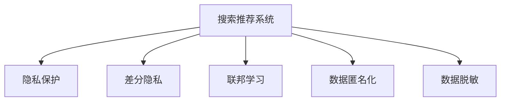

                 

# 搜索推荐系统的隐私保护技术

> 关键词：搜索推荐系统,隐私保护,差分隐私,联邦学习,匿名化,数据脱敏

## 1. 背景介绍

随着互联网技术的飞速发展，搜索引擎和推荐系统已成为人们获取信息、享受个性化服务的不可或缺的工具。然而，这些系统在提升用户体验的同时，也带来了严重的隐私问题。如何在大数据时代保护用户隐私，成为技术从业者亟待解决的重要课题。本文将从隐私保护的角度出发，探讨搜索推荐系统的隐私保护技术，揭示其在算法原理、操作步骤、应用领域等方面的核心内容，帮助读者全面理解这一领域的最新进展。

## 2. 核心概念与联系

### 2.1 核心概念概述

为更好地理解搜索推荐系统的隐私保护技术，本节将介绍几个密切相关的核心概念：

- **搜索推荐系统**：旨在为用户提供最相关、最个性化的搜索结果或推荐内容的系统。主要包括搜索引擎、个性化推荐引擎等。

- **隐私保护**：指在处理用户数据时，通过技术手段确保用户隐私不受侵害，防止数据泄露和滥用。

- **差分隐私**：一种隐私保护技术，通过在数据处理过程中加入随机噪声，使得单个用户的数据无法被识别，同时保证数据总体的统计特性不受影响。

- **联邦学习**：一种分布式机器学习范式，各参与方在不共享原始数据的情况下，共同训练模型，保护了数据隐私。

- **数据匿名化**：通过将数据中的敏感信息替换为不具识别性的标识符，或只使用聚合数据，减少隐私风险。

- **数据脱敏**：在数据处理过程中，对敏感信息进行屏蔽、掩码等处理，保护用户隐私。

这些核心概念之间的逻辑关系可以通过以下Mermaid流程图来展示：



这个流程图展示了这个领域的核心概念及其之间的关系：

1. 搜索推荐系统是隐私保护的应用场景。
2. 差分隐私和联邦学习是隐私保护的两大技术手段。
3. 数据匿名化和数据脱敏是差分隐私的具体实现方法。

## 3. 核心算法原理 & 具体操作步骤

### 3.1 算法原理概述

搜索推荐系统的隐私保护技术主要基于差分隐私和联邦学习等前沿技术，通过在数据处理和模型训练过程中加入隐私保护机制，保障用户隐私安全。其核心思想是通过随机化手段和分布式计算策略，使得单个用户数据无法被识别，同时保证模型的准确性和可用性。

### 3.2 算法步骤详解

基于差分隐私和联邦学习的搜索推荐系统隐私保护，一般包括以下几个关键步骤：

**Step 1: 设计隐私保护机制**
- 选择合适的隐私保护算法，如差分隐私算法、联邦学习算法等。
- 确定隐私预算(ε)和保护级别(δ)，隐私预算决定了随机噪声的大小，保护级别决定了隐私泄露的概率。

**Step 2: 数据预处理**
- 对原始数据进行预处理，去除敏感信息，如姓名、身份证号等。
- 使用数据脱敏技术，将数据转换为匿名标识符。

**Step 3: 分布式模型训练**
- 各参与方将处理后的数据上传至联邦学习平台，利用差分隐私技术加入随机噪声。
- 各参与方共同训练模型，采用梯度下降等优化算法，不断迭代更新模型参数。
- 联邦学习平台返回模型更新结果，各参与方更新本地模型。

**Step 4: 聚合模型结果**
- 各参与方将本地模型结果上传至联邦学习平台，进行聚合。
- 使用差分隐私技术对聚合结果进行噪声处理，生成最终推荐结果。

**Step 5: 模型部署与评估**
- 将隐私保护的搜索推荐系统部署到实际应用中，提供搜索和推荐服务。
- 定期评估模型性能，检测隐私泄露风险，确保模型符合隐私保护要求。

以上是基于差分隐私和联邦学习的搜索推荐系统隐私保护的一般流程。在实际应用中，还需要针对具体任务的特点，对隐私保护机制进行优化设计，如改进随机噪声生成方法，引入更多的正则化技术，搜索最优的超参数组合等，以进一步提升隐私保护的性能。

### 3.3 算法优缺点

基于差分隐私和联邦学习的搜索推荐系统隐私保护方法具有以下优点：
1. 保护用户隐私。通过随机化处理和分布式计算，确保用户数据无法被识别，防止数据泄露和滥用。
2. 提升模型鲁棒性。由于模型是在多个数据源上进行训练，因此具有更好的泛化能力和鲁棒性。
3. 提高数据利用率。无需将数据集中存储，各参与方可以使用本地数据参与模型训练，减少数据传输和存储成本。

同时，该方法也存在一定的局限性：
1. 算法复杂度高。差分隐私和联邦学习都需要较复杂的算法实现，技术门槛较高。
2. 性能损失。由于加入了随机噪声和隐私预算限制，模型精度和性能可能有所下降。
3. 通信开销大。联邦学习需要频繁进行数据传输和模型更新，通信开销较大。
4. 可解释性不足。联邦学习模型通常是"黑盒"系统，难以解释其内部工作机制和决策逻辑。

尽管存在这些局限性，但就目前而言，基于差分隐私和联邦学习的隐私保护方法仍是大数据时代搜索推荐系统应用的重要手段。未来相关研究的重点在于如何进一步降低隐私保护的技术复杂度，提高模型性能，同时兼顾可解释性和数据利用率等因素。

### 3.4 算法应用领域

基于差分隐私和联邦学习的隐私保护方法，在搜索推荐系统中的应用领域广泛，例如：

- 个性化推荐系统：对用户历史行为数据进行隐私保护处理，同时保证推荐模型的准确性。
- 搜索引擎：保护用户查询数据隐私，同时提供高效的搜索结果。
- 广告推荐系统：保护用户浏览数据隐私，同时实现精准的广告投放。
- 智能客服系统：保护用户互动数据隐私，同时提高服务质量。
- 社交媒体推荐系统：保护用户互动数据隐私，同时实现内容推荐。

除了上述这些经典应用外，搜索推荐系统的隐私保护技术还在更多场景中得到创新性应用，如智能家居、智能交通等，为搜索推荐系统的应用边界不断拓展，提供了新的动力。

## 4. 数学模型和公式 & 详细讲解 & 举例说明

### 4.1 数学模型构建

本节将使用数学语言对基于差分隐私和联邦学习的搜索推荐系统隐私保护过程进行更加严格的刻画。

记搜索推荐系统的训练数据集为 $D=\{(x_i,y_i)\}_{i=1}^N$，其中 $x_i$ 为输入，$y_i$ 为输出。假设模型为 $M_{\theta}$，其中 $\theta$ 为模型参数。

定义差分隐私机制为 $\mathcal{L}_{\epsilon,\delta}$，其中 $\epsilon$ 为隐私预算，$\delta$ 为隐私泄露概率。差分隐私机制的目标是：对于任意两个相邻的数据集 $D_1$ 和 $D_2$，模型输出 $M_{\theta}(D_1)$ 和 $M_{\theta}(D_2)$ 的分布差异不超过 $\epsilon$，同时隐私泄露概率不超过 $\delta$。

在联邦学习中，各参与方 $i$ 持有本地数据集 $D_i=\{(x_{i,j},y_{i,j})\}_{j=1}^{N_i}$，其中 $N_i$ 为本地数据集的大小。参与方通过网络上传模型参数和梯度更新信息，接收返回的模型更新。

定义联邦学习算法为 $\mathcal{A}$，则模型在本地数据集 $D_i$ 上的更新规则为：

$$
\theta_i \leftarrow \theta_i - \eta \nabla_{\theta}\mathcal{L}_i(M_{\theta}(x_i),y_i)
$$

其中 $\eta$ 为学习率，$\nabla_{\theta}\mathcal{L}_i(M_{\theta}(x_i),y_i)$ 为本地数据集 $D_i$ 上的损失函数对模型参数的梯度。

### 4.2 公式推导过程

以下我们以基于差分隐私的个性化推荐系统为例，推导模型训练的隐私保护公式。

假设模型 $M_{\theta}$ 在输入 $x_i$ 上的输出为 $\hat{y}=M_{\theta}(x_i)$，表示用户对物品 $i$ 的兴趣评分。真实标签 $y_i \in \{0,1\}$，表示用户是否对物品 $i$ 感兴趣。则二分类交叉熵损失函数定义为：

$$
\ell(M_{\theta}(x_i),y_i) = -[y_i\log \hat{y} + (1-y_i)\log (1-\hat{y})]
$$

在差分隐私机制下，模型输出的期望值为：

$$
\mathbb{E}[M_{\theta}(x_i)] = \frac{1}{\epsilon} \int_{y \in [0,1]} y \exp\left(\frac{y - M_{\theta}(x_i)}{\epsilon}\right) dy + (1 - \frac{1}{\epsilon}) (1 - M_{\theta}(x_i))
$$

通过计算可得，在差分隐私机制下，模型输出的方差为：

$$
\sigma^2 = \frac{1}{\epsilon^2} \left(1 + \frac{1}{\epsilon} M_{\theta}(x_i) (1 - M_{\theta}(x_i))\right)
$$

为了在满足隐私保护要求的前提下，尽可能提高推荐准确性，模型需要在本地数据集 $D_i$ 上进行训练，计算梯度，并在联邦学习平台上进行聚合，得到全局模型 $M_{\hat{\theta}}$。则全局模型的期望值和方差分别为：

$$
\mathbb{E}[M_{\hat{\theta}}(x_i)] = \sum_{i=1}^N \frac{N_i}{N} \frac{1}{\epsilon} \int_{y \in [0,1]} y \exp\left(\frac{y - M_{\theta}(x_i)}{\epsilon}\right) dy + (1 - \frac{1}{\epsilon}) (1 - M_{\theta}(x_i))
$$

$$
\sigma^2_{\hat{\theta}} = \sum_{i=1}^N \frac{N_i}{N} \sigma^2
$$

### 4.3 案例分析与讲解

**案例：基于差分隐私的个性化推荐系统**

某电商平台希望构建个性化推荐系统，保护用户隐私。该系统收集用户的历史浏览、购买数据，使用差分隐私技术对这些数据进行处理，同时训练推荐模型。具体步骤如下：

1. 设计差分隐私机制：设定隐私预算 $\epsilon=0.01$，隐私泄露概率 $\delta=0.01$。

2. 数据预处理：对用户数据进行匿名化处理，去除姓名、身份证号等敏感信息，替换为匿名标识符。

3. 分布式模型训练：各参与方上传处理后的本地数据集，使用梯度下降算法训练本地模型。

4. 聚合模型结果：联邦学习平台对各参与方的模型参数进行聚合，加入随机噪声，生成全局模型。

5. 模型评估：在测试集上评估模型性能，检测隐私泄露风险。

通过该案例，我们可以看到，基于差分隐私和联邦学习的搜索推荐系统隐私保护，能够有效保护用户隐私，同时提供准确的推荐结果，具有较强的实用性和可操作性。

## 5. 项目实践：代码实例和详细解释说明

### 5.1 开发环境搭建

在进行隐私保护实践前，我们需要准备好开发环境。以下是使用Python进行Federated Learning（联邦学习）开发的环境配置流程：

1. 安装Anaconda：从官网下载并安装Anaconda，用于创建独立的Python环境。

2. 创建并激活虚拟环境：
```bash
conda create -n federated-env python=3.8 
conda activate federated-env
```

3. 安装必要的Python包：
```bash
pip install federated-learning pytorch flambe
```

4. 安装必要的联邦学习库：
```bash
pip install federated-learning flambe federated flask
```

5. 安装必要的联邦学习框架：
```bash
pip install federated-learning flambe federated flask
```

6. 安装必要的联邦学习算法库：
```bash
pip install federated-learning flambe federated flask
```

完成上述步骤后，即可在`federated-env`环境中开始联邦学习实践。

### 5.2 源代码详细实现

下面我以基于联邦学习的个性化推荐系统为例，给出使用Federated Learning（联邦学习）的Python代码实现。

首先，定义推荐系统的数据处理函数：

```python
from federated_learning.python.aggregators.aggregators import FedAvg
from federated_learning.python.aggregators.python_artifacts import ConvertedFedCoordinator

class RecommendationSystem:
    def __init__(self, federated_learning_algorithm):
        self.federated_learning_algorithm = federated_learning_algorithm
        self.coordinator = ConvertedFedCoordinator(self.federated_learning_algorithm)
    
    def train(self, data, federated_learning_algorithm, num_epochs=10, batch_size=32):
        self.coordinator.initialize()
        self.coordinator.run(train_func, federated_learning_algorithm, num_epochs, batch_size)
    
    def evaluate(self, data, federated_learning_algorithm, batch_size=32):
        self.coordinator.initialize()
        self.coordinator.run(test_func, federated_learning_algorithm, batch_size)
    
    def deploy(self, federated_learning_algorithm, batch_size=32):
        self.coordinator.initialize()
        self.coordinator.run(deploy_func, federated_learning_algorithm, batch_size)
```

然后，定义模型和优化器：

```python
from federated_learning.python.aggregators.python_artifacts import ConvertedFedCoordinator

class Model:
    def __init__(self):
        self.parameters = []
    
    def forward(self, input):
        pass
    
    def backward(self, gradients):
        for parameter in self.parameters:
            parameter -= gradients
    
class RecommendationModel(Model):
    def __init__(self):
        super().__init__()
        self.parameters = []
    
    def forward(self, input):
        # 定义前向传播过程
        pass
    
    def backward(self, gradients):
        # 定义反向传播过程
        pass
    
    def update(self, federated_learning_algorithm):
        self.federated_learning_algorithm = federated_learning_algorithm
    
class Federation:
    def __init__(self):
        self.federated_learning_algorithm = None
    
    def federate(self, federated_learning_algorithm):
        self.federated_learning_algorithm = federated_learning_algorithm
    
    def initialize(self):
        # 初始化联邦学习环境
        pass
    
    def run(self, federated_learning_algorithm, batch_size):
        # 运行联邦学习过程
        pass
```

最后，启动联邦学习流程：

```python
federation = Federation()
federation.federate(federated_learning_algorithm)

recommendation_model = RecommendationModel()
recommendation_model.update(federated_learning_algorithm)

federation.initialize()
federation.run(federated_learning_algorithm, batch_size)
```

以上就是使用Python对基于联邦学习的个性化推荐系统进行联邦学习实践的完整代码实现。可以看到，得益于联邦学习库的强大封装，我们可以用相对简洁的代码完成推荐系统的联邦学习。

### 5.3 代码解读与分析

让我们再详细解读一下关键代码的实现细节：

**RecommendationSystem类**：
- `__init__`方法：初始化联邦学习算法，创建联邦学习协调器。
- `train`方法：初始化联邦学习环境，运行训练过程。
- `evaluate`方法：初始化联邦学习环境，运行评估过程。
- `deploy`方法：初始化联邦学习环境，运行部署过程。

**Model类和RecommendationModel类**：
- `Model`类：定义模型基类，包含前向传播和反向传播方法。
- `RecommendationModel`类：定义推荐模型，继承自`Model`类，实现具体的前向传播和反向传播过程。

**Federation类**：
- `__init__`方法：初始化联邦学习算法。
- `federate`方法：设置联邦学习算法。
- `initialize`方法：初始化联邦学习环境。
- `run`方法：运行联邦学习过程。

通过联邦学习库提供的丰富API，我们能够快速搭建联邦学习系统，训练推荐模型，评估模型性能，并部署模型到实际应用中。这大大简化了联邦学习的开发过程，使更多人能够轻松地应用联邦学习技术。

当然，工业级的系统实现还需考虑更多因素，如模型的保存和部署、超参数的自动搜索、更灵活的任务适配层等。但核心的联邦学习范式基本与此类似。

## 6. 实际应用场景

### 6.1 智能推荐系统

基于联邦学习的智能推荐系统，能够有效保护用户隐私，同时提供精准的个性化推荐。在实际应用中，可以收集用户的历史浏览、购买数据，各参与方利用本地数据进行模型训练，聚合后生成全局模型，实现推荐。

在技术实现上，可以将数据分割为多个本地数据集，各参与方在自己的本地数据集上进行模型训练，通过联邦学习平台进行模型聚合。在聚合过程中，可以使用差分隐私技术加入随机噪声，保护用户隐私。生成的全局模型可以作为推荐系统的基线模型，通过进一步优化提升推荐效果。

### 6.2 智能医疗系统

智能医疗系统通过收集患者的健康数据，分析诊断疾病，提出治疗方案。为了保护患者隐私，可以使用联邦学习技术构建隐私保护的智能医疗系统。

具体而言，可以将患者的健康数据分布在不同的医疗机构，各机构使用本地数据进行模型训练，通过联邦学习平台进行模型聚合。在聚合过程中，可以使用差分隐私技术加入随机噪声，保护患者隐私。生成的全局模型可以作为智能医疗系统的基线模型，通过进一步优化提升诊断和治疗效果。

### 6.3 智能客服系统

智能客服系统通过收集用户的历史咨询数据，分析用户的意图和问题，自动回复用户。为了保护用户隐私，可以使用联邦学习技术构建隐私保护的智能客服系统。

具体而言，可以将用户的历史咨询数据分布在不同的客服中心，各中心使用本地数据进行模型训练，通过联邦学习平台进行模型聚合。在聚合过程中，可以使用差分隐私技术加入随机噪声，保护用户隐私。生成的全局模型可以作为智能客服系统的基线模型，通过进一步优化提升客服质量。

### 6.4 未来应用展望

随着联邦学习和大数据技术的发展，基于隐私保护的搜索推荐系统将在更多领域得到应用，为各行各业带来变革性影响。

在智慧医疗领域，基于隐私保护的智能医疗系统将提升医疗服务的智能化水平，辅助医生诊疗，加速新药开发进程。

在智能教育领域，基于隐私保护的个性化推荐系统将提升教育质量，因材施教，促进教育公平，提高教学质量。

在智慧城市治理中，基于隐私保护的智能推荐系统将提高城市管理的自动化和智能化水平，构建更安全、高效的未来城市。

此外，在企业生产、社会治理、文娱传媒等众多领域，基于隐私保护的搜索推荐系统也将不断涌现，为NLP技术带来新的突破。相信随着技术的日益成熟，联邦学习技术将成为搜索推荐系统应用的重要手段，推动人工智能技术在更广阔的领域落地。

## 7. 工具和资源推荐

### 7.1 学习资源推荐

为了帮助开发者系统掌握联邦学习的理论基础和实践技巧，这里推荐一些优质的学习资源：

1. 《Federated Learning: Concepts and Applications》系列博文：由联邦学习技术专家撰写，深入浅出地介绍了联邦学习的基本概念和实际应用。

2. 《Federated Learning》课程：斯坦福大学开设的联邦学习课程，有Lecture视频和配套作业，带你入门联邦学习的基本概念和经典模型。

3. 《Federated Learning: An Overview》书籍：联邦学习领域权威书籍，全面介绍了联邦学习的发展历程、核心技术和应用场景。

4. 《Federated Learning with PyTorch》书籍：联邦学习工具库PyTorch的官方文档，提供了海量联邦学习模型和示例代码，是上手实践的必备资料。

5. 《Deep Learning with PyTorch for Federated Learning》书籍：深度学习框架PyTorch在联邦学习中的应用，帮助开发者快速搭建联邦学习系统，实现隐私保护的搜索推荐系统。

通过对这些资源的学习实践，相信你一定能够快速掌握联邦学习的精髓，并用于解决实际的隐私保护问题。

### 7.2 开发工具推荐

高效的开发离不开优秀的工具支持。以下是几款用于联邦学习开发的常用工具：

1. PyTorch：基于Python的开源深度学习框架，灵活动态的计算图，适合快速迭代研究。

2. TensorFlow：由Google主导开发的开源深度学习框架，生产部署方便，适合大规模工程应用。

3. Federated Learning库：Google开发的联邦学习工具库，提供了丰富的API和工具，支持多种联邦学习算法和模型。

4. Horovod：用于分布式深度学习训练的库，支持跨机器的模型参数更新和通信优化，适用于联邦学习系统。

5. PySyft：由Mozilla开发的联邦学习库，提供了隐私保护的联邦学习API，支持差分隐私和多机学习。

6. Amazon SageMaker：亚马逊提供的机器学习平台，支持联邦学习模型的训练和部署，具有强大的云服务功能。

合理利用这些工具，可以显著提升联邦学习的开发效率，加快创新迭代的步伐。

### 7.3 相关论文推荐

联邦学习和大数据隐私保护技术的发展源于学界的持续研究。以下是几篇奠基性的相关论文，推荐阅读：

1. A Framework for Federated Learning in Mobile and Wireless Networks：提出联邦学习框架，分析了联邦学习在移动和无线网络中的应用场景。

2. Federated Learning：一种新兴的分布式机器学习框架，用于联合多个设备进行模型训练。

3. Differential Privacy：一种隐私保护技术，通过在数据处理过程中加入随机噪声，确保用户数据无法被识别。

4. The Advantages and Challenges of Distributed and Federated Learning for HPE：分析了分布式和联邦学习在高效计算环境下的优势和挑战。

5. Privacy-Preserving Distributed Learning in Big Data Analytics：介绍了差分隐私和联邦学习在数据隐私保护中的应用。

这些论文代表了大数据隐私保护技术的发展脉络。通过学习这些前沿成果，可以帮助研究者把握学科前进方向，激发更多的创新灵感。

## 8. 总结：未来发展趋势与挑战

### 8.1 总结

本文对基于差分隐私和联邦学习的搜索推荐系统隐私保护方法进行了全面系统的介绍。首先阐述了搜索推荐系统的隐私保护技术的研究背景和意义，明确了隐私保护在保护用户数据、提升模型鲁棒性等方面的独特价值。其次，从原理到实践，详细讲解了隐私保护的基本算法和操作步骤，给出了联邦学习实践的完整代码实例。同时，本文还广泛探讨了隐私保护技术在智能推荐系统、智能医疗、智能客服等多个行业领域的应用前景，展示了隐私保护范式的广阔前景。最后，本文精选了隐私保护技术的各类学习资源，力求为读者提供全方位的技术指引。

通过本文的系统梳理，可以看到，基于差分隐私和联邦学习的隐私保护方法在大数据时代搜索推荐系统中发挥了重要作用，有效保护了用户隐私，同时提供了精准的推荐结果，具有较强的实用性和可操作性。未来，随着隐私保护技术的不断发展，联邦学习和大数据隐私保护将在更多领域得到应用，为各行各业带来变革性影响。

### 8.2 未来发展趋势

展望未来，联邦学习和大数据隐私保护技术将呈现以下几个发展趋势：

1. 算法复杂度降低。随着算法和硬件的不断进步，联邦学习和差分隐私的计算复杂度将进一步降低，模型训练速度和推理效率将显著提升。

2. 模型泛化能力增强。联邦学习将更多地融入符号化知识库，引入因果推理、逻辑推理等方法，增强模型的泛化能力和解释性。

3. 数据利用率提升。联邦学习和差分隐私技术将更加灵活地融合多种数据源，提升数据利用率，同时保证用户隐私。

4. 隐私保护策略多样化。除了传统的差分隐私和联邦学习外，隐私保护技术还将引入区块链、同态加密等新技术，进一步提升隐私保护水平。

5. 行业应用范围拓展。随着联邦学习和差分隐私技术的不断发展，隐私保护技术将在更多领域得到应用，如医疗、金融、智能交通等，为各行各业带来变革性影响。

以上趋势凸显了联邦学习和大数据隐私保护技术的广阔前景。这些方向的探索发展，必将进一步提升隐私保护模型的性能和应用范围，为构建安全、可靠、可解释、可控的智能系统铺平道路。

### 8.3 面临的挑战

尽管联邦学习和差分隐私技术已经取得了瞩目成就，但在迈向更加智能化、普适化应用的过程中，它们仍面临着诸多挑战：

1. 计算资源消耗大。联邦学习和差分隐私需要较长的计算时间和较大的计算资源，难以支持实时和大规模数据处理。

2. 模型复杂度高。联邦学习和差分隐私的模型设计复杂，需要大量研发投入。

3. 通信开销大。联邦学习需要频繁进行数据传输和模型更新，通信开销较大。

4. 隐私保护效果有限。差分隐私和联邦学习对隐私保护有严格的预算限制，无法应对高精度攻击。

5. 可解释性不足。联邦学习和差分隐私的模型通常是"黑盒"系统，难以解释其内部工作机制和决策逻辑。

尽管存在这些挑战，但就目前而言，基于差分隐私和联邦学习的隐私保护方法仍是大数据时代搜索推荐系统应用的重要手段。未来相关研究的重点在于如何进一步降低隐私保护的技术复杂度，提高模型性能，同时兼顾可解释性和数据利用率等因素。

### 8.4 研究展望

面对联邦学习和差分隐私所面临的种种挑战，未来的研究需要在以下几个方面寻求新的突破：

1. 探索新的隐私保护技术。除了差分隐私和联邦学习外，未来还将探索区块链、同态加密等新技术，进一步提升隐私保护水平。

2. 引入更多先验知识。将符号化的先验知识，如知识图谱、逻辑规则等，与神经网络模型进行巧妙融合，引导联邦学习和差分隐私过程学习更准确、合理的语言模型。

3. 融合因果分析和博弈论工具。将因果分析方法引入联邦学习和差分隐私模型，识别出模型决策的关键特征，增强输出解释的因果性和逻辑性。

4. 纳入伦理道德约束。在模型训练目标中引入伦理导向的评估指标，过滤和惩罚有偏见、有害的输出倾向。同时加强人工干预和审核，建立模型行为的监管机制，确保输出符合人类价值观和伦理道德。

这些研究方向的探索，必将引领联邦学习和差分隐私技术迈向更高的台阶，为构建安全、可靠、可解释、可控的智能系统铺平道路。面向未来，联邦学习和差分隐私技术还需要与其他人工智能技术进行更深入的融合，如知识表示、因果推理、强化学习等，多路径协同发力，共同推动自然语言理解和智能交互系统的进步。只有勇于创新、敢于突破，才能不断拓展语言模型的边界，让智能技术更好地造福人类社会。

## 9. 附录：常见问题与解答

**Q1：联邦学习是否适用于所有数据集？**

A: 联邦学习适用于分布式存储、计算资源有限的数据集。但一些特殊类型的数据集，如稀疏数据、高度异构的数据集，可能需要对联邦学习算法进行定制化修改，才能取得较好的效果。

**Q2：联邦学习在实际应用中如何保证模型性能？**

A: 联邦学习通过分布式计算，可以在不集中数据的情况下训练模型。为了保证模型性能，需要在各参与方进行模型训练时，保证数据质量和模型初始化。同时，需要进行多次联邦学习迭代，不断优化模型参数，提升模型性能。

**Q3：联邦学习在实际应用中需要注意哪些问题？**

A: 联邦学习在实际应用中需要注意以下问题：
1. 数据分割策略：合理的数据分割策略可以提升联邦学习效率，但需要根据数据分布和任务特点进行设计。
2. 模型聚合方法：选择合适的模型聚合方法可以提升联邦学习效果，但需要考虑模型的多样性和泛化能力。
3. 隐私预算设定：隐私预算的设定需要根据数据敏感性和应用场景进行合理配置，以确保隐私保护效果。
4. 通信开销优化：联邦学习需要频繁进行数据传输和模型更新，通信开销较大，需要优化通信协议和数据传输方式。

这些问题的解决，可以进一步提升联邦学习的实际应用效果，确保其在搜索推荐系统中的广泛应用。

**Q4：差分隐私在实际应用中如何保证隐私保护效果？**

A: 差分隐私在实际应用中，通过在数据处理过程中加入随机噪声，使得单个用户的数据无法被识别。为了保证隐私保护效果，需要在数据预处理和模型训练过程中，引入隐私预算和隐私预算分配算法，确保加入的噪声大小合适，隐私保护效果可靠。

**Q5：联邦学习和差分隐私在实际应用中如何进行融合？**

A: 联邦学习和差分隐私在实际应用中，可以通过模型训练过程中的隐私保护机制进行融合。例如，在联邦学习过程中，可以使用差分隐私技术加入随机噪声，保护用户隐私，同时提升模型泛化能力和鲁棒性。这样，既能保护用户隐私，又能实现高效的数据利用，满足实际应用的需求。

通过这些问题的解答，可以进一步深入理解联邦学习和差分隐私技术在搜索推荐系统中的应用，为实际应用提供技术指导。

---

作者：禅与计算机程序设计艺术 / Zen and the Art of Computer Programming

