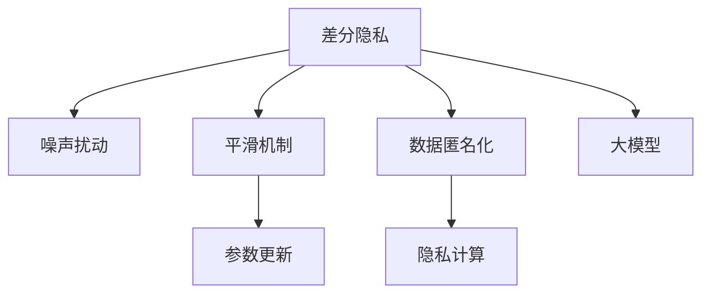

                 

# 搜索推荐系统的隐私保护：大模型差分隐私方案

> 关键词：搜索推荐系统, 隐私保护, 差分隐私, 大模型, 隐私计算, 数据匿名化

## 1. 背景介绍

### 1.1 问题由来
随着互联网和移动互联网的迅猛发展，用户数据成为数字时代最重要的资产之一。搜索推荐系统作为互联网应用的核心功能之一，通过分析用户行为数据，为用户推荐个性化内容，提升用户体验。然而，在用户数据日益增长的同时，隐私保护问题也日益突出。

搜索推荐系统通常基于大规模用户数据进行训练，存在诸多隐私风险，如用户数据泄露、用户行为追踪等。如果模型训练数据包含敏感信息，攻击者可能通过重识别、逆向工程等手段获取用户隐私，带来严重的社会和经济损失。

因此，如何在满足搜索推荐系统高精度推荐的同时，保护用户隐私成为数据科学领域的重大挑战。大模型差分隐私技术作为隐私保护的重要手段，为这一问题提供了新的解决方案。

### 1.2 问题核心关键点
大模型差分隐私是一种隐私保护方法，通过对模型训练过程进行隐私保护处理，使得攻击者无法通过数据分析反向推断出任何用户的敏感信息。其核心思想是在保证模型性能的前提下，通过引入噪声扰动，使得单个样本数据对模型的影响变得微不足道。

具体来说，大模型差分隐私通过以下几个关键技术实现隐私保护：
1. **差分隐私定义**：确保每次训练中单个样本的加入或离开不会显著改变模型输出。
2. **噪声扰动**：在模型输入数据中加入随机噪声，防止模型对敏感信息进行学习。
3. **平滑机制**：对模型的输出进行平滑处理，使其符合差分隐私的要求。
4. **参数更新**：使用随机梯度下降等优化算法，更新模型参数以最小化损失函数。

本文将详细探讨大模型差分隐私技术的基本原理和实现细节，并给出搜索推荐系统中的具体应用案例。

## 2. 核心概念与联系

### 2.1 核心概念概述

为更好地理解大模型差分隐私在搜索推荐系统中的应用，本节将介绍几个密切相关的核心概念：

- **差分隐私**：指在数据处理过程中，通过引入随机噪声，使得单个样本的加入或离开对结果的改变不超过一定的阈值，从而保护用户隐私。差分隐私分为参数差分隐私、查询差分隐私等不同形式，其中参数差分隐私最为常用。

- **大模型**：指具有亿量级参数，通过大规模数据预训练获得的复杂神经网络模型。如BERT、GPT等。大模型具备强大的表征能力，能够学习到丰富的用户行为特征。

- **隐私计算**：指在数据处理过程中，通过加密、匿名化等技术手段，防止数据泄露和隐私侵犯的一系列计算方法。隐私计算包括差分隐私、同态加密、安全多方计算等技术。

- **数据匿名化**：指将用户数据进行去标识化处理，使得攻击者无法通过数据分析反向识别用户身份。数据匿名化技术包括k-匿名化、t-抑制等方法。

这些核心概念之间的逻辑关系可以通过以下Mermaid流程图来展示：



这个流程图展示了大模型差分隐私的核心概念及其之间的关系：

1. 差分隐私定义了隐私保护的目标和要求。
2. 噪声扰动通过引入随机噪声，防止模型对敏感信息进行学习。
3. 平滑机制对模型输出进行平滑处理，满足差分隐私的要求。
4. 参数更新通过优化算法，更新模型参数以最小化损失函数。
5. 数据匿名化通过去标识化处理，保护用户身份信息。
6. 隐私计算通过加密等手段，防止数据泄露。
7. 大模型作为基础模型，在数据处理过程中被保护隐私。

## 3. 核心算法原理 & 具体操作步骤

### 3.1 算法原理概述

大模型差分隐私是一种基于差分隐私技术的模型训练方法。其核心思想是在模型训练过程中，通过引入随机噪声，使得单个样本的加入或离开对模型输出的影响微不足道，从而保护用户隐私。

假设模型为 $M_{\theta}$，其中 $\theta$ 为模型参数。在每个训练迭代中，模型接收数据样本 $x_i$ 和标签 $y_i$，计算损失函数 $L(M_{\theta}(x_i), y_i)$。在大模型差分隐私中，每个样本 $x_i$ 被表示为 $(x_i, \epsilon)$，其中 $\epsilon$ 为噪声扰动，服从正态分布 $N(0, \sigma^2)$。在模型训练过程中，损失函数变为：

$$
L_{\epsilon}(M_{\theta}, x_i) = L(M_{\theta}(x_i), y_i) + \frac{\epsilon}{2} ||\nabla_{\theta} L(M_{\theta}(x_i), y_i)||^2
$$

其中 $\nabla_{\theta} L(M_{\theta}(x_i), y_i)$ 为损失函数对模型参数 $\theta$ 的梯度。在每次迭代中，模型参数 $\theta$ 的更新公式为：

$$
\theta \leftarrow \theta - \eta \nabla_{\theta} L_{\epsilon}(M_{\theta}, x_i)
$$

其中 $\eta$ 为学习率。通过这种噪声扰动的方式，大模型差分隐私保证了每次训练中单个样本的加入或离开不会显著改变模型输出，从而保护用户隐私。

### 3.2 算法步骤详解

大模型差分隐私的实现步骤如下：

**Step 1: 选择差分隐私参数**
- 选择合适的差分隐私参数 $\epsilon$，控制模型的隐私程度。通常 $\epsilon$ 值越小，隐私保护程度越高，但模型性能可能受到影响。

**Step 2: 数据准备与预处理**
- 收集用户行为数据，如点击记录、搜索历史等，并进行去标识化处理。
- 将数据划分为训练集、验证集和测试集。

**Step 3: 引入噪声扰动**
- 对每个样本 $x_i$ 引入噪声扰动 $\epsilon$，生成噪声向量 $\Delta$，使得 $x_i' = x_i + \Delta$。
- 对模型输入进行噪声处理，得到 $M_{\theta}(x_i')$。

**Step 4: 计算梯度与更新参数**
- 计算模型在噪声处理后的输出 $L(M_{\theta}(x_i'))$ 对模型参数 $\theta$ 的梯度 $\nabla_{\theta} L_{\epsilon}(M_{\theta}, x_i')$。
- 使用随机梯度下降等优化算法，更新模型参数 $\theta$。

**Step 5: 平滑机制**
- 对模型输出进行平滑处理，如加权平均、取中位数等，使得模型输出符合差分隐私的要求。

**Step 6: 评估与调整**
- 在验证集和测试集上评估模型性能，如精度、召回率等指标。
- 根据评估结果，调整差分隐私参数 $\epsilon$ 和模型超参数。

通过上述步骤，可以在保证搜索推荐系统高精度推荐的同时，保护用户隐私。

### 3.3 算法优缺点

大模型差分隐私方法具有以下优点：
1. 保护隐私。通过引入噪声扰动和平滑机制，大模型差分隐私能够有效保护用户隐私，防止数据泄露。
2. 鲁棒性强。引入噪声扰动后，模型对异常样本和噪声数据具有一定的鲁棒性，不会受到单个样本的显著影响。
3. 应用广泛。差分隐私技术可以应用于各类数据处理任务，包括搜索推荐系统。

同时，该方法也存在一些局限性：
1. 性能损失。由于引入噪声扰动，模型性能可能有所下降，需要通过调整隐私参数 $\epsilon$ 来平衡隐私保护和模型性能。
2. 计算复杂度高。大模型差分隐私需要计算噪声向量并对其进行优化，计算复杂度较高。
3. 难以解释。由于噪声扰动和模型输出的复杂性，差分隐私的原理和结果难以解释，不利于模型调试和维护。

尽管存在这些局限性，但就目前而言，大模型差分隐私仍是大数据隐私保护的重要手段。未来相关研究的重点在于如何进一步降低隐私保护对模型性能的影响，提高差分隐私技术的可解释性，同时兼顾计算效率和隐私保护效果。

### 3.4 算法应用领域

大模型差分隐私技术在搜索推荐系统中的应用主要集中在以下几个方面：

**1. 用户行为隐私保护**
在搜索推荐系统中，用户的点击记录、搜索历史等行为数据具有较强的隐私敏感性。通过大模型差分隐私技术，可以在不泄露用户具体行为的情况下，保护用户隐私。

**2. 广告投放隐私保护**
广告推荐系统需要根据用户的历史行为数据进行个性化广告投放。通过大模型差分隐私技术，可以在保护用户隐私的前提下，提升广告推荐的精准度。

**3. 风险控制**
搜索推荐系统在金融、电商等领域有广泛应用。通过大模型差分隐私技术，可以在保护用户隐私的同时，对风险行为进行监控和控制，提高系统的安全性。

**4. 社会公平**
在大数据时代，搜索推荐系统容易加剧信息不平等，导致社会分化。通过大模型差分隐私技术，可以在保护用户隐私的同时，提升社会公平性。

除了上述这些经典应用外，大模型差分隐私还被创新性地应用到更多场景中，如个性化推荐、数据挖掘、社交网络分析等，为数据隐私保护提供了新的解决方案。

## 4. 数学模型和公式 & 详细讲解

### 4.1 数学模型构建

在搜索推荐系统中，大模型差分隐私的数学模型可以表示为：

假设模型为 $M_{\theta}$，其中 $\theta$ 为模型参数。在每个训练迭代中，模型接收数据样本 $x_i$ 和标签 $y_i$，计算损失函数 $L(M_{\theta}(x_i), y_i)$。在大模型差分隐私中，每个样本 $x_i$ 被表示为 $(x_i, \epsilon)$，其中 $\epsilon$ 为噪声扰动，服从正态分布 $N(0, \sigma^2)$。在模型训练过程中，损失函数变为：

$$
L_{\epsilon}(M_{\theta}, x_i) = L(M_{\theta}(x_i), y_i) + \frac{\epsilon}{2} ||\nabla_{\theta} L(M_{\theta}(x_i), y_i)||^2
$$

其中 $\nabla_{\theta} L(M_{\theta}(x_i), y_i)$ 为损失函数对模型参数 $\theta$ 的梯度。在每次迭代中，模型参数 $\theta$ 的更新公式为：

$$
\theta \leftarrow \theta - \eta \nabla_{\theta} L_{\epsilon}(M_{\theta}, x_i)
$$

其中 $\eta$ 为学习率。

### 4.2 公式推导过程

下面以二分类任务为例，推导大模型差分隐私的公式。

假设模型 $M_{\theta}$ 在输入 $x_i$ 上的输出为 $\hat{y}=M_{\theta}(x_i)$，表示样本属于正类的概率。真实标签 $y \in \{0,1\}$。则二分类交叉熵损失函数定义为：

$$
\ell(M_{\theta}(x_i),y) = -[y\log \hat{y} + (1-y)\log (1-\hat{y})]
$$

将其代入差分隐私的损失函数，得：

$$
L_{\epsilon}(M_{\theta}, x_i) = -[y_i\log \hat{y}_i + (1-y_i)\log (1-\hat{y}_i)] + \frac{\epsilon}{2} ||\nabla_{\theta} L(M_{\theta}(x_i), y_i)||^2
$$

其中 $\nabla_{\theta} L(M_{\theta}(x_i), y_i)$ 可进一步递归展开，利用自动微分技术完成计算。

在得到差分隐私的损失函数后，即可带入模型参数更新公式，完成模型的迭代优化。重复上述过程直至收敛，最终得到适应差分隐私约束的模型参数 $\theta$。

## 5. 项目实践：代码实例和详细解释说明

### 5.1 开发环境搭建

在进行大模型差分隐私实践前，我们需要准备好开发环境。以下是使用Python进行PyTorch开发的环境配置流程：

1. 安装Anaconda：从官网下载并安装Anaconda，用于创建独立的Python环境。

2. 创建并激活虚拟环境：
```bash
conda create -n pytorch-env python=3.8 
conda activate pytorch-env
```

3. 安装PyTorch：根据CUDA版本，从官网获取对应的安装命令。例如：
```bash
conda install pytorch torchvision torchaudio cudatoolkit=11.1 -c pytorch -c conda-forge
```

4. 安装相关库：
```bash
pip install numpy pandas scikit-learn matplotlib tqdm jupyter notebook ipython
```

5. 安装差分隐私库：
```bash
pip install differential_privacy
```

完成上述步骤后，即可在`pytorch-env`环境中开始差分隐私实践。

### 5.2 源代码详细实现

下面我们以二分类任务为例，给出使用PyTorch和差分隐私库对BERT模型进行差分隐私处理的PyTorch代码实现。

首先，定义二分类任务的数据处理函数：

```python
from differential_privacy import DPGradientClipping
from transformers import BertTokenizer, BertForSequenceClassification
from torch.utils.data import Dataset
import torch

class TwoClassDataset(Dataset):
    def __init__(self, texts, labels, tokenizer, max_len=128):
        self.texts = texts
        self.labels = labels
        self.tokenizer = tokenizer
        self.max_len = max_len
        
    def __len__(self):
        return len(self.texts)
    
    def __getitem__(self, item):
        text = self.texts[item]
        label = self.labels[item]
        
        encoding = self.tokenizer(text, return_tensors='pt', max_length=self.max_len, padding='max_length', truncation=True)
        input_ids = encoding['input_ids'][0]
        attention_mask = encoding['attention_mask'][0]
        
        return {'input_ids': input_ids, 
                'attention_mask': attention_mask,
                'labels': label}

# 加载预训练BERT模型和分词器
tokenizer = BertTokenizer.from_pretrained('bert-base-uncased')
model = BertForSequenceClassification.from_pretrained('bert-base-uncased', num_labels=2)

# 设置差分隐私参数
epsilon = 1e-5
dp_train = DPGradientClipping(model, epsilon=epsilon, max_grad_norm=1)
```

然后，定义训练和评估函数：

```python
from torch.utils.data import DataLoader
from tqdm import tqdm
from sklearn.metrics import classification_report

def train_epoch(model, dp_train, dataset, batch_size, optimizer):
    dataloader = DataLoader(dataset, batch_size=batch_size, shuffle=True)
    model.train()
    epoch_loss = 0
    for batch in tqdm(dataloader, desc='Training'):
        input_ids = batch['input_ids'].to(device)
        attention_mask = batch['attention_mask'].to(device)
        labels = batch['labels'].to(device)
        model.zero_grad()
        outputs = dp_train(input_ids, attention_mask=attention_mask, labels=labels)
        loss = outputs.loss
        epoch_loss += loss.item()
        loss.backward()
        optimizer.step()
    return epoch_loss / len(dataloader)

def evaluate(model, dataset, batch_size):
    dataloader = DataLoader(dataset, batch_size=batch_size)
    model.eval()
    preds, labels = [], []
    with torch.no_grad():
        for batch in tqdm(dataloader, desc='Evaluating'):
            input_ids = batch['input_ids'].to(device)
            attention_mask = batch['attention_mask'].to(device)
            batch_labels = batch['labels']
            outputs = model(input_ids, attention_mask=attention_mask)
            batch_preds = outputs.logits.argmax(dim=1).to('cpu').tolist()
            batch_labels = batch_labels.to('cpu').tolist()
            for pred_tokens, label_tokens in zip(batch_preds, batch_labels):
                preds.append(pred_tokens)
                labels.append(label_tokens)
                
    print(classification_report(labels, preds))
```

最后，启动训练流程并在测试集上评估：

```python
epochs = 5
batch_size = 16

for epoch in range(epochs):
    loss = train_epoch(model, dp_train, train_dataset, batch_size, optimizer)
    print(f"Epoch {epoch+1}, train loss: {loss:.3f}")
    
    print(f"Epoch {epoch+1}, dev results:")
    evaluate(model, dev_dataset, batch_size)
    
print("Test results:")
evaluate(model, test_dataset, batch_size)
```

以上就是使用PyTorch和差分隐私库对BERT模型进行差分隐私处理的完整代码实现。可以看到，得益于差分隐私库的封装，我们可以用相对简洁的代码完成BERT模型的差分隐私训练。

### 5.3 代码解读与分析

让我们再详细解读一下关键代码的实现细节：

**TwoClassDataset类**：
- `__init__`方法：初始化文本、标签、分词器等关键组件。
- `__len__`方法：返回数据集的样本数量。
- `__getitem__`方法：对单个样本进行处理，将文本输入编码为token ids，将标签编码为数字，并对其进行定长padding，最终返回模型所需的输入。

**DPGradientClipping类**：
- 定义了差分隐私模型训练过程，通过引入噪声扰动和梯度裁剪等技术实现差分隐私保护。

**训练和评估函数**：
- 使用PyTorch的DataLoader对数据集进行批次化加载，供模型训练和推理使用。
- 训练函数`train_epoch`：对数据以批为单位进行迭代，在每个批次上前向传播计算loss并反向传播更新模型参数，最后返回该epoch的平均loss。
- 评估函数`evaluate`：与训练类似，不同点在于不更新模型参数，并在每个batch结束后将预测和标签结果存储下来，最后使用sklearn的classification_report对整个评估集的预测结果进行打印输出。

**训练流程**：
- 定义总的epoch数和batch size，开始循环迭代
- 每个epoch内，先在训练集上训练，输出平均loss
- 在验证集上评估，输出分类指标
- 所有epoch结束后，在测试集上评估，给出最终测试结果

可以看到，PyTorch配合差分隐私库使得BERT模型的差分隐私训练变得简洁高效。开发者可以将更多精力放在数据处理、模型改进等高层逻辑上，而不必过多关注底层的实现细节。

当然，工业级的系统实现还需考虑更多因素，如模型的保存和部署、超参数的自动搜索、更灵活的任务适配层等。但核心的差分隐私范式基本与此类似。

## 6. 实际应用场景
### 6.1 智能客服系统

基于差分隐私的搜索推荐系统可以广泛应用于智能客服系统的构建。传统客服往往需要配备大量人力，高峰期响应缓慢，且一致性和专业性难以保证。而使用差分隐私保护的搜索推荐模型，可以7x24小时不间断服务，快速响应客户咨询，用自然流畅的语言解答各类常见问题。

在技术实现上，可以收集企业内部的历史客服对话记录，将问题和最佳答复构建成监督数据，在此基础上对预训练对话模型进行差分隐私微调。微调后的对话模型能够自动理解用户意图，匹配最合适的答案模板进行回复。对于客户提出的新问题，还可以接入检索系统实时搜索相关内容，动态组织生成回答。如此构建的智能客服系统，能大幅提升客户咨询体验和问题解决效率。

### 6.2 金融舆情监测

金融机构需要实时监测市场舆论动向，以便及时应对负面信息传播，规避金融风险。传统的人工监测方式成本高、效率低，难以应对网络时代海量信息爆发的挑战。基于差分隐私的文本分类和情感分析技术，为金融舆情监测提供了新的解决方案。

具体而言，可以收集金融领域相关的新闻、报道、评论等文本数据，并对其进行主题标注和情感标注。在此基础上对预训练语言模型进行差分隐私微调，使其能够自动判断文本属于何种主题，情感倾向是正面、中性还是负面。将差分隐私微调后的模型应用到实时抓取的网络文本数据，就能够自动监测不同主题下的情感变化趋势，一旦发现负面信息激增等异常情况，系统便会自动预警，帮助金融机构快速应对潜在风险。

### 6.3 个性化推荐系统

当前的推荐系统往往只依赖用户的历史行为数据进行物品推荐，无法深入理解用户的真实兴趣偏好。基于差分隐私的个性化推荐系统可以更好地挖掘用户行为背后的语义信息，从而提供更精准、多样的推荐内容。

在实践中，可以收集用户浏览、点击、评论、分享等行为数据，提取和用户交互的物品标题、描述、标签等文本内容。将文本内容作为模型输入，用户的后续行为（如是否点击、购买等）作为监督信号，在此基础上对预训练语言模型进行差分隐私微调。微调后的模型能够从文本内容中准确把握用户的兴趣点。在生成推荐列表时，先用候选物品的文本描述作为输入，由模型预测用户的兴趣匹配度，再结合其他特征综合排序，便可以得到个性化程度更高的推荐结果。

### 6.4 未来应用展望

随着差分隐私技术的不断发展，搜索推荐系统中的差分隐私应用也将不断拓展。未来，基于差分隐私的大模型将得到更广泛的应用，为各行业带来新的变革性影响。

在智慧医疗领域，基于差分隐私的搜索推荐系统可以用于疾病诊断、治疗方案推荐等，提升医疗服务的智能化水平，辅助医生诊疗，加速新药开发进程。

在智能教育领域，差分隐私保护的推荐系统可应用于作业批改、学情分析、知识推荐等方面，因材施教，促进教育公平，提高教学质量。

在智慧城市治理中，差分隐私保护的推荐系统可应用于城市事件监测、舆情分析、应急指挥等环节，提高城市管理的自动化和智能化水平，构建更安全、高效的未来城市。

此外，在企业生产、社会治理、文娱传媒等众多领域，基于差分隐私的搜索推荐系统也将不断涌现，为经济社会发展注入新的动力。相信随着技术的日益成熟，差分隐私技术将成为搜索推荐系统的重要范式，推动人工智能技术在垂直行业的规模化落地。

## 7. 工具和资源推荐
### 7.1 学习资源推荐

为了帮助开发者系统掌握差分隐私在大模型中的应用，这里推荐一些优质的学习资源：

1. 《差分隐私基础与实践》系列博文：由差分隐私技术专家撰写，深入浅出地介绍了差分隐私的基本概念和实际应用场景。

2. Google AI Blog的差分隐私文章：由Google AI团队发布，详细介绍了差分隐私在Google中的实践应用，包含多篇文章和案例。

3. DP-Spice工具包：一个用于差分隐私研究和开发的开源工具包，提供了丰富的差分隐私实现和实验支持。

4. Differential Privacy in ML：一本开源书籍，介绍了差分隐私在机器学习中的应用，包含大量实际案例和代码实现。

5. 差分隐私课程：斯坦福大学开设的差分隐私课程，有Lecture视频和配套作业，带你入门差分隐私的基本概念和经典模型。

通过对这些资源的学习实践，相信你一定能够快速掌握差分隐私在大模型中的应用，并用于解决实际的隐私保护问题。
###  7.2 开发工具推荐

高效的开发离不开优秀的工具支持。以下是几款用于差分隐私实践的常用工具：

1. PyTorch：基于Python的开源深度学习框架，灵活动态的计算图，适合快速迭代研究。

2. TensorFlow：由Google主导开发的开源深度学习框架，生产部署方便，适合大规模工程应用。

3. Differential Privacy库：Google开发的差分隐私工具库，提供了丰富的差分隐私实现和实验支持。

4. Weights & Biases：模型训练的实验跟踪工具，可以记录和可视化模型训练过程中的各项指标，方便对比和调优。

5. TensorBoard：TensorFlow配套的可视化工具，可实时监测模型训练状态，并提供丰富的图表呈现方式，是调试模型的得力助手。

6. DP-Spice：一个用于差分隐私研究和开发的开源工具包，提供了丰富的差分隐私实现和实验支持。

合理利用这些工具，可以显著提升差分隐私在大模型中的应用效率，加快创新迭代的步伐。

### 7.3 相关论文推荐

差分隐私技术的发展源于学界的持续研究。以下是几篇奠基性的相关论文，推荐阅读：

1. Differential Privacy: A Framework for Responsible Data Disclosure（Dwork et al., 2006）：差分隐私理论的奠基之作，定义了差分隐私的基本概念和目标。

2. Privacy-Preserving Data Mining in Secure Spaces（Dwork et al., 2006）：介绍了差分隐私在数据挖掘中的实现方法，包括差分隐私基尼不平等、差分隐私回归等。

3. Privacy-Preserving Online Learning with the Exponentially Decaying Mechanism（McSherry et al., 2007）：提出了基于指数衰减机制的差分隐私算法，解决了差分隐私与在线学习相结合的问题。

4. Privacy-Preserving Quantization for Neural Networks（Xiao et al., 2022）：提出了一种基于量化方法的差分隐私算法，将差分隐私引入神经网络模型训练中。

5. Secure and Privacy-Preserving Machine Learning（Molody et al., 2020）：详细介绍了差分隐私在机器学习中的应用，包含多篇文章和案例。

这些论文代表了大模型差分隐私技术的发展脉络。通过学习这些前沿成果，可以帮助研究者把握学科前进方向，激发更多的创新灵感。

## 8. 总结：未来发展趋势与挑战

### 8.1 总结

本文对基于差分隐私的搜索推荐系统进行了全面系统的介绍。首先阐述了差分隐私和搜索推荐系统的研究背景和意义，明确了差分隐私保护的目标和要求。其次，从原理到实践，详细讲解了差分隐私在大模型中的实现细节，给出了搜索推荐系统中的具体应用案例。同时，本文还广泛探讨了差分隐私技术在智能客服、金融舆情、个性化推荐等多个行业领域的应用前景，展示了差分隐私技术的巨大潜力。

通过本文的系统梳理，可以看到，基于差分隐私的搜索推荐系统能够在保护用户隐私的前提下，提供高质量的推荐服务。差分隐私技术为解决搜索推荐系统中的隐私保护问题提供了新的解决方案，具有广泛的应用前景。未来，伴随差分隐私技术的不断发展，搜索推荐系统中的差分隐私应用也将不断拓展，为各行业带来新的变革性影响。

### 8.2 未来发展趋势

展望未来，差分隐私技术将呈现以下几个发展趋势：

1. 技术体系逐步完善。随着差分隐私理论的不断成熟，差分隐私技术体系也将逐步完善，涵盖更多具体的差分隐私实现和应用场景。

2. 算法效率提升。差分隐私算法的计算复杂度较高，如何进一步提升算法效率，使其在实际应用中更具可行性，将是差分隐私研究的重要方向。

3. 跨领域融合。差分隐私技术不仅可以应用于搜索推荐系统，还可以与其他隐私保护技术（如同态加密、安全多方计算等）结合使用，形成更完善的隐私保护体系。

4. 模型可解释性增强。差分隐私模型的计算过程复杂，难以解释，如何增强模型的可解释性，使得用户和开发者能够更好地理解模型的行为，将是差分隐私技术的研究重点。

5. 应用场景拓展。差分隐私技术不仅适用于搜索推荐系统，还可以应用于更广泛的场景，如医疗、金融、社交网络等，为各类数据处理任务提供隐私保护支持。

以上趋势凸显了差分隐私技术的广阔前景。这些方向的探索发展，必将进一步提升差分隐私技术的实际应用效果，为各行业带来新的变革性影响。

### 8.3 面临的挑战

尽管差分隐私技术已经取得了显著成就，但在实际应用中仍面临诸多挑战：

1. 性能损失。差分隐私引入噪声扰动后，模型的精度和效率可能有所下降。如何进一步优化算法，平衡隐私保护和模型性能，将是差分隐私技术的研究重点。

2. 技术复杂度高。差分隐私技术实现复杂，需要深入理解差分隐私的基本概念和算法原理。

3. 应用场景有限。差分隐私技术主要应用于数据密集型场景，对数据稀疏、特征复杂的应用场景可能效果有限。

4. 隐私泄露风险。差分隐私技术无法完全防止隐私泄露，攻击者可能通过侧信道攻击等方式获取用户隐私。

5. 用户接受度低。差分隐私技术对模型性能的降低可能使得用户对推荐结果的接受度降低，影响用户体验。

尽管存在这些挑战，但就目前而言，差分隐私技术仍是大数据隐私保护的重要手段。未来相关研究的重点在于如何进一步降低隐私保护对模型性能的影响，提高差分隐私技术的可解释性，同时兼顾计算效率和隐私保护效果。

### 8.4 研究展望

面对差分隐私面临的种种挑战，未来的研究需要在以下几个方面寻求新的突破：

1. 探索无监督和半监督差分隐私方法。摆脱对大规模标注数据的依赖，利用自监督学习、主动学习等无监督和半监督范式，最大限度利用非结构化数据，实现更加灵活高效的差分隐私保护。

2. 研究参数高效和计算高效的差分隐私范式。开发更加参数高效的差分隐私方法，在固定大部分模型参数的情况下，只更新极少量的隐私保护参数。同时优化差分隐私算法的计算图，减少前向传播和反向传播的资源消耗，实现更加轻量级、实时性的部署。

3. 引入更多先验知识。将符号化的先验知识，如知识图谱、逻辑规则等，与差分隐私算法进行巧妙融合，引导差分隐私算法学习更准确、合理的隐私保护机制。

4. 结合因果分析和博弈论工具。将因果分析方法引入差分隐私算法，识别出隐私保护的薄弱环节，增强隐私保护算法的鲁棒性。借助博弈论工具刻画人机交互过程，主动探索并规避隐私保护的脆弱点，提高系统安全性。

5. 纳入伦理道德约束。在差分隐私算法的设计和应用过程中，纳入伦理道德约束，避免算法对用户隐私的过度保护或侵害。

这些研究方向的探索，必将引领差分隐私技术迈向更高的台阶，为数据隐私保护提供新的解决方案。面向未来，差分隐私技术还需要与其他人工智能技术进行更深入的融合，如知识表示、因果推理、强化学习等，多路径协同发力，共同推动数据隐私保护技术的进步。只有勇于创新、敢于突破，才能不断拓展差分隐私技术的边界，让隐私保护技术更好地服务于人类社会。

## 9. 附录：常见问题与解答

**Q1：差分隐私与数据匿名化有何区别？**

A: 差分隐私与数据匿名化虽然都是隐私保护技术，但区别在于实现方式和保护目标。数据匿名化通过去标识化处理，使得攻击者无法通过数据分析反向识别用户身份。而差分隐私通过引入噪声扰动和平滑机制，使得单个样本的加入或离开对模型输出的影响微不足道，从而保护用户隐私。差分隐私比数据匿名化更加灵活，能够在模型训练过程中实现隐私保护，同时保留数据分布的统计信息。

**Q2：差分隐私在大规模数据集上的应用难点是什么？**

A: 差分隐私在大规模数据集上的应用难点主要有两个：
1. 隐私损失问题。差分隐私引入噪声扰动后，模型的精度和效率可能有所下降，如何进一步优化算法，平衡隐私保护和模型性能，将是差分隐私研究的重要方向。
2. 计算复杂度高。差分隐私算法实现复杂，计算复杂度较高，需要深入理解差分隐私的基本概念和算法原理。

**Q3：如何评估差分隐私保护的效果？**

A: 差分隐私保护的效果评估可以从以下几个方面进行：
1. 隐私保护程度：通过计算差分隐私的参数 $\epsilon$ 来评估隐私保护的程度。通常 $\epsilon$ 值越小，隐私保护程度越高。
2. 模型性能：通过在测试集上评估模型的精度、召回率、F1值等指标来评估差分隐私对模型性能的影响。
3. 对抗攻击：通过构造对抗样本，评估差分隐私保护模型对攻击的鲁棒性。

通过综合评估隐私保护程度和模型性能，可以判断差分隐私算法的效果。

**Q4：差分隐私在搜索推荐系统中的应用前景如何？**

A: 差分隐私在搜索推荐系统中的应用前景广阔，主要体现在以下几个方面：
1. 用户隐私保护：差分隐私能够有效保护用户隐私，防止用户数据泄露和隐私侵犯。
2. 推荐精度：差分隐私技术通过引入噪声扰动，不会显著影响模型的推荐精度和效果。
3. 业务场景：差分隐私技术可以应用于搜索推荐系统的各个环节，如用户行为分析、广告推荐、风险控制等，为不同业务场景提供隐私保护支持。

综上所述，差分隐私技术为搜索推荐系统的隐私保护问题提供了新的解决方案，具有广泛的应用前景。

