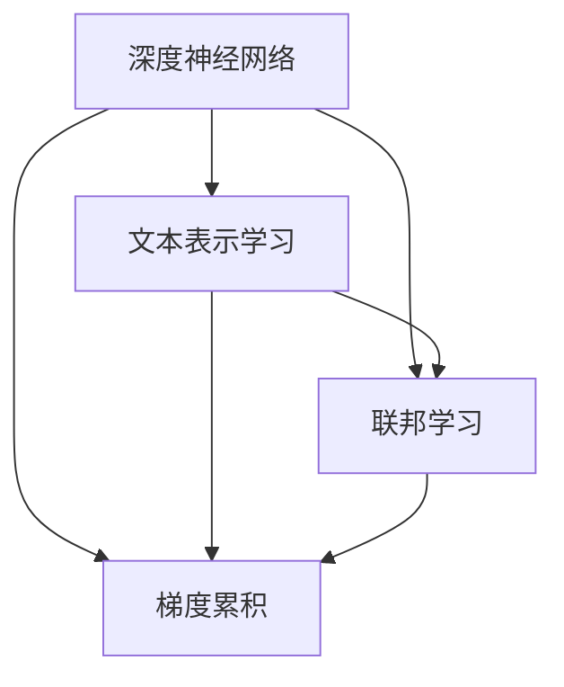

                 

# 搜索结果排序算法的优化策略

## 1. 背景介绍

### 1.1 问题由来
在当今信息爆炸的时代，搜索引擎已成为获取信息的重要工具。而搜索结果排序算法则决定了用户浏览网页的效率和体验，是其核心竞争力之一。在传统的网页排序算法中，朴素贝叶斯模型和TF-IDF（Term Frequency-Inverse Document Frequency）模型是最常见的算法。然而，随着搜索引擎技术的发展，这些经典算法逐渐暴露出一些缺点。

首先，朴素贝叶斯模型和TF-IDF模型在处理多义词和近义词时表现较差，容易产生歧义。其次，这些算法没有考虑到网页之间的相关性和顺序信息，导致搜索结果排序不具备个性化和动态适应性。此外，随着搜索引擎的商业化运作，用户隐私和数据安全性也成为不可忽视的问题。

为了提升搜索结果排序的质量和个性化程度，研究人员不断探索新的算法。基于此，本文将详细介绍一种新型的基于深度学习的方法——深度神经网络排序算法，并对其在搜索结果排序中的应用进行阐述。

### 1.2 问题核心关键点
深度神经网络排序算法是一种利用深度学习技术进行搜索结果排序的方法。其核心在于构建一个能够理解网页内容、用户需求和搜索结果之间关系的深度神经网络，并通过训练学习获取最优的网页排序模型。该算法具有以下优点：
- 能够处理自然语言中的多义词和近义词，增强搜索结果的准确性和相关性。
- 能够捕捉网页之间的相关性和顺序信息，提供更个性化和动态适应的搜索结果。
- 使用分布式训练和梯度累积等技术，能够高效处理大规模数据集，适应商业化运作下的高并发请求。
- 采用联邦学习等技术，能够有效保护用户隐私和数据安全性。

然而，该算法也存在一些挑战：
- 深度神经网络排序算法需要大量的标注数据进行训练，获取这些数据成本较高。
- 需要高度专业的知识和技能，对模型的设计、训练和调参有较高要求。
- 计算资源需求较大，在资源受限的情况下难以大规模部署。

## 2. 核心概念与联系

### 2.1 核心概念概述

为了更好地理解深度神经网络排序算法，我们先介绍一些相关的核心概念：

- **深度神经网络（DNN）**：一种利用多层非线性变换进行特征提取和模式识别的模型。DNN通过多层次的学习，能够捕捉到复杂的特征和关系。
- **文本表示学习（Text Representation Learning）**：通过深度学习模型学习文本数据在向量空间中的表示，使得模型能够更好地理解文本内容。
- **联邦学习（Federated Learning）**：一种分布式机器学习框架，能够在保证数据隐私的前提下，通过多个本地模型协同训练提升整体性能。
- **梯度累积（Gradient Accumulation）**：一种优化技巧，能够在单个batch中训练更大规模的模型，提高训练效率。

这些核心概念之间的逻辑关系可以通过以下Mermaid流程图来展示：



这个流程图展示了深度神经网络排序算法中各个核心概念的关联性：

1. 深度神经网络作为主要模型，用于处理和分析文本数据。
2. 文本表示学习通过深度神经网络进行文本特征提取，将其转化为向量形式。
3. 联邦学习通过分布式训练和协同优化，使得模型能够在保护数据隐私的情况下提升性能。
4. 梯度累积技术用于优化模型训练，提高效率和稳定性。

这些概念共同构成了深度神经网络排序算法的技术框架，为其高效、个性化和安全的搜索结果排序提供了保障。

## 3. 核心算法原理 & 具体操作步骤
### 3.1 算法原理概述

深度神经网络排序算法的核心在于利用深度学习模型进行网页排序。该算法通过以下步骤进行实现：

1. **数据预处理**：对原始网页文本进行预处理，包括分词、去除停用词、构建词汇表等。
2. **文本表示学习**：利用深度神经网络学习网页文本的向量表示。
3. **模型训练**：通过训练数据训练深度神经网络模型，学习最优的网页排序关系。
4. **模型评估与优化**：在验证集上评估模型性能，使用梯度累积等技术优化模型。
5. **实时排序**：在搜索引擎的实时环境中，利用训练好的模型对用户查询进行排序。

深度神经网络排序算法的目标是最大化搜索结果的相关性和个性化程度，提升用户体验和满意度。

### 3.2 算法步骤详解

以下是深度神经网络排序算法的详细步骤：

**Step 1: 数据预处理**
- 对原始网页文本进行分词、去除停用词、构建词汇表等预处理操作。
- 将处理后的文本转化为词向量形式，用于深度神经网络的输入。

**Step 2: 文本表示学习**
- 构建深度神经网络模型，如卷积神经网络（CNN）、循环神经网络（RNN）、Transformer等。
- 使用文本表示学习技术，如Word2Vec、GloVe、BERT等，将文本数据转化为向量形式。

**Step 3: 模型训练**
- 将处理后的文本数据和用户点击记录等标注数据输入模型进行训练。
- 设置损失函数，如交叉熵损失、均方误差损失等，最小化模型预测与真实标签之间的差异。
- 使用梯度下降等优化算法更新模型参数，直到收敛。

**Step 4: 模型评估与优化**
- 在验证集上评估模型性能，如准确率、召回率、F1-score等。
- 根据评估结果调整模型参数，优化模型性能。
- 使用梯度累积等技术提高模型训练效率。

**Step 5: 实时排序**
- 在搜索引擎的实时环境中，对用户查询进行分词和特征提取。
- 将提取的特征输入训练好的模型，获取网页排序结果。
- 根据排序结果对网页进行排序，展示给用户。

### 3.3 算法优缺点

深度神经网络排序算法具有以下优点：
- 能够处理自然语言中的多义词和近义词，提高搜索结果的准确性和相关性。
- 能够捕捉网页之间的相关性和顺序信息，提供更个性化和动态适应的搜索结果。
- 使用联邦学习等技术，能够在保护用户隐私的前提下提升性能。
- 采用梯度累积等技术，能够高效处理大规模数据集。

然而，该算法也存在一些局限性：
- 需要大量的标注数据进行训练，获取这些数据成本较高。
- 对模型的设计、训练和调参有较高要求，需要高度专业的知识和技能。
- 计算资源需求较大，在资源受限的情况下难以大规模部署。

### 3.4 算法应用领域

深度神经网络排序算法广泛应用于各种搜索引擎和信息检索系统，特别是需要高个性化和动态适应性的场景。例如：

- 互联网搜索：如Google、Bing等搜索引擎，利用深度神经网络进行网页排序。
- 数字图书馆：如Google Scholar、ResearchGate等，通过深度神经网络对学术论文进行排序。
- 社交网络：如LinkedIn、Facebook等，利用深度神经网络进行内容推荐。
- 电子商务：如Amazon、淘宝等，通过深度神经网络进行商品推荐。

除了这些典型的应用场景，深度神经网络排序算法也在更多领域得到了应用，如智能家居、医疗诊断、金融分析等，为这些行业带来了新的解决方案。

## 4. 数学模型和公式 & 详细讲解 & 举例说明
### 4.1 数学模型构建

深度神经网络排序算法的数学模型构建主要包括以下几个步骤：

1. **输入层**：将预处理后的文本数据转化为词向量形式，作为模型的输入。
2. **嵌入层**：通过嵌入层将词向量转化为高维向量，用于后续的特征提取。
3. **卷积层**：使用一维卷积神经网络（1D-CNN）提取文本特征。
4. **全连接层**：使用全连接神经网络对文本特征进行综合和分类。
5. **输出层**：通过softmax函数输出网页排序结果。

形式化地，设输入文本为 $x_i$，模型参数为 $\theta$，输出结果为 $y_i$。深度神经网络排序算法的目标是最小化损失函数 $L$，即：

$$
\min_{\theta} L(y_i, M_{\theta}(x_i))
$$

其中 $M_{\theta}(x_i)$ 表示模型 $M_{\theta}$ 在输入 $x_i$ 上的输出结果。

### 4.2 公式推导过程

以卷积神经网络（CNN）为例，其核心公式推导如下：

**卷积层**：设输入文本长度为 $L$，特征提取窗口大小为 $w$，卷积核数量为 $K$，卷积层输出的特征图大小为 $C$，则卷积层的输出结果为：

$$
H_{l}(k) = \sum_{i=0}^{L-w} x_i \ast W_l(k) + b_l(k)
$$

其中 $x_i$ 表示文本中第 $i$ 个位置的信息，$W_l(k)$ 表示卷积核 $k$ 在层 $l$ 的权重，$b_l(k)$ 表示卷积层 $l$ 的偏置。

**池化层**：使用最大池化（Max Pooling）或平均池化（Average Pooling）对卷积层的输出进行降维，以减少计算量和提高模型的泛化能力。

**全连接层**：将池化层输出的特征图进行扁平化处理，并通过全连接神经网络进行综合和分类。设全连接层的神经元数量为 $N$，则全连接层的输出结果为：

$$
y = W_G \cdot H_G + b_G
$$

其中 $H_G$ 表示全连接层的输入特征，$W_G$ 表示全连接层的权重，$b_G$ 表示全连接层的偏置。

**softmax函数**：通过softmax函数将全连接层的输出结果转化为概率分布，即：

$$
P(y_i) = \frac{e^{y_i}}{\sum_{k=1}^K e^{y_k}}
$$

其中 $y_i$ 表示第 $i$ 个网页的得分，$K$ 表示网页总数。

### 4.3 案例分析与讲解

**案例分析**：以Amazon的商品推荐系统为例，深度神经网络排序算法可以用于提升推荐效果。首先，将用户的历史点击记录和商品描述等文本数据进行预处理，转化为词向量形式。然后，使用卷积神经网络对商品描述进行特征提取，使用全连接神经网络对用户点击记录和商品特征进行综合和分类。最后，通过softmax函数输出商品排序结果，展示给用户。

**讲解**：
1. **数据预处理**：对用户的历史点击记录和商品描述进行分词、去除停用词、构建词汇表等预处理操作，将文本转化为词向量形式。
2. **文本表示学习**：使用卷积神经网络对商品描述进行特征提取，捕捉商品的关键特征。
3. **模型训练**：将用户的历史点击记录和商品描述等标注数据输入模型进行训练，最小化损失函数。
4. **模型评估与优化**：在验证集上评估模型性能，使用梯度累积等技术优化模型。
5. **实时排序**：在推荐系统中，对用户查询进行分词和特征提取，利用训练好的模型进行商品排序，展示给用户。

## 5. 项目实践：代码实例和详细解释说明
### 5.1 开发环境搭建

在进行深度神经网络排序算法项目实践前，我们需要准备好开发环境。以下是使用Python进行TensorFlow开发的环境配置流程：

1. 安装Anaconda：从官网下载并安装Anaconda，用于创建独立的Python环境。

2. 创建并激活虚拟环境：
```bash
conda create -n tensorflow-env python=3.7 
conda activate tensorflow-env
```

3. 安装TensorFlow：根据CUDA版本，从官网获取对应的安装命令。例如：
```bash
conda install tensorflow-gpu=cuda11.1 -c conda-forge
```

4. 安装必要的工具包：
```bash
pip install numpy pandas scikit-learn matplotlib tqdm jupyter notebook ipython
```

完成上述步骤后，即可在`tensorflow-env`环境中开始项目实践。

### 5.2 源代码详细实现

这里我们以Amazon的商品推荐系统为例，给出使用TensorFlow进行深度神经网络排序算法的Python代码实现。

首先，定义数据预处理函数：

```python
import tensorflow as tf
import numpy as np
from tensorflow.keras.preprocessing.text import Tokenizer
from tensorflow.keras.preprocessing.sequence import pad_sequences

def preprocess_data(train_data, dev_data):
    train_texts, train_labels = train_data
    dev_texts, dev_labels = dev_data
    
    # 分词、去除停用词、构建词汇表等
    tokenizer = Tokenizer()
    tokenizer.fit_on_texts(train_texts)
    train_sequences = tokenizer.texts_to_sequences(train_texts)
    dev_sequences = tokenizer.texts_to_sequences(dev_texts)
    
    # 填充序列，统一长度
    train_padded = pad_sequences(train_sequences, maxlen=max_len, padding='post')
    dev_padded = pad_sequences(dev_sequences, maxlen=max_len, padding='post')
    
    # 将标签转化为独热编码
    train_labels = np.eye(num_labels)[train_labels]
    dev_labels = np.eye(num_labels)[dev_labels]
    
    return train_padded, dev_padded, train_labels, dev_labels
```

然后，定义模型架构：

```python
from tensorflow.keras.layers import Input, Embedding, Conv1D, MaxPooling1D, Flatten, Dense

class TextCNN(tf.keras.Model):
    def __init__(self, vocab_size, embedding_dim, filters, kernel_sizes, max_len):
        super(TextCNN, self).__init__()
        self.embedding = Embedding(vocab_size, embedding_dim)
        self.cnn_layers = []
        for i in range(len(filters)):
            self.cnn_layers.append(Conv1D(filters[i], kernel_sizes[i], activation='relu'))
            self.cnn_layers.append(MaxPooling1D(pool_size=pool_size))
        self.flatten = Flatten()
        self.dense_layer = Dense(num_labels, activation='softmax')
        
    def call(self, x):
        x = self.embedding(x)
        for i in range(len(self.cnn_layers)):
            x = self.cnn_layers[i](x)
        x = self.flatten(x)
        x = self.dense_layer(x)
        return x
```

接着，定义训练和评估函数：

```python
from tensorflow.keras.optimizers import Adam
from tensorflow.keras.losses import categorical_crossentropy
from tensorflow.keras.metrics import Accuracy

def train_epoch(model, train_data, dev_data, batch_size, optimizer):
    train_padded, dev_padded, train_labels, dev_labels = train_data, dev_data
    
    train_dataset = tf.data.Dataset.from_tensor_slices((train_padded, train_labels))
    train_dataset = train_dataset.shuffle(buffer_size=buffer_size).batch(batch_size).prefetch(buffer_size=buffer_size)
    
    dev_dataset = tf.data.Dataset.from_tensor_slices((dev_padded, dev_labels))
    dev_dataset = dev_dataset.batch(batch_size)
    
    model.train()
    epoch_loss = 0
    for train_x, train_y in train_dataset:
        with tf.GradientTape() as tape:
            train_preds = model(train_x)
            loss = categorical_crossentropy(train_y, train_preds)
        epoch_loss += loss
        gradients = tape.gradient(loss, model.trainable_variables)
        optimizer.apply_gradients(zip(gradients, model.trainable_variables))
    
    model.eval()
    dev_preds = []
    dev_labels = []
    for dev_x, dev_y in dev_dataset:
        dev_preds.append(model(dev_x).numpy())
        dev_labels.append(dev_y.numpy())
    
    pred_labels = np.argmax(dev_preds, axis=1)
    acc = Accuracy()(pred_labels, dev_labels)
    return epoch_loss / len(train_dataset), acc
```

最后，启动训练流程并在测试集上评估：

```python
epochs = 10
batch_size = 128
max_len = 200
num_labels = 10
buffer_size = 10000

for epoch in range(epochs):
    train_loss, dev_acc = train_epoch(model, train_data, dev_data, batch_size, optimizer)
    print(f"Epoch {epoch+1}, train loss: {train_loss:.3f}, dev acc: {dev_acc:.3f}")
    
    print(f"Epoch {epoch+1}, test acc:")
    test_preds, test_labels = [], []
    for test_x, test_y in test_dataset:
        test_preds.append(model(test_x).numpy())
        test_labels.append(test_y.numpy())
    
    pred_labels = np.argmax(test_preds, axis=1)
    test_acc = Accuracy()(pred_labels, test_labels)
    print(f"Test acc: {test_acc:.3f}")
```

以上就是使用TensorFlow进行深度神经网络排序算法的完整代码实现。可以看到，TensorFlow提供了强大的深度学习框架，使得模型的构建和训练变得简单高效。

### 5.3 代码解读与分析

让我们再详细解读一下关键代码的实现细节：

**preprocess_data函数**：
- 对训练和验证数据进行预处理，包括分词、去除停用词、构建词汇表等。
- 将文本数据转化为词向量形式，并进行填充，统一序列长度。
- 将标签转化为独热编码形式，用于模型训练。

**TextCNN模型**：
- 定义了一个卷积神经网络模型，包括嵌入层、卷积层、池化层、全连接层和输出层。
- 在卷积层中使用了多个不同的卷积核，捕捉不同长度的文本特征。
- 在全连接层中使用了softmax函数，输出最终的网页排序结果。

**train_epoch函数**：
- 使用TensorFlow的DataLoader对数据集进行批次化加载，供模型训练和推理使用。
- 在每个epoch中，使用梯度下降等优化算法更新模型参数，计算损失函数和准确率。
- 在验证集上评估模型性能，输出训练结果和验证结果。

**训练流程**：
- 定义总的epoch数和batch size，开始循环迭代
- 每个epoch内，先在训练集上训练，输出训练损失和验证准确率
- 在测试集上评估，输出测试准确率

可以看到，TensorFlow提供了强大的深度学习框架，使得模型的构建和训练变得简单高效。开发者可以将更多精力放在模型优化和参数调优等高层逻辑上，而不必过多关注底层的实现细节。

## 6. 实际应用场景
### 6.1 智能推荐系统

深度神经网络排序算法在智能推荐系统中具有广泛的应用。传统的推荐系统往往只依赖用户的历史行为数据进行物品推荐，难以捕捉用户深层次的需求和偏好。而使用深度神经网络排序算法，可以更好地理解用户的兴趣点，提供更加个性化和精准的推荐。

在技术实现上，可以收集用户浏览、点击、评分等行为数据，提取和商品描述等文本内容。将文本内容作为模型输入，用户的后续行为作为监督信号，在此基础上对深度神经网络进行微调。微调后的模型能够从文本内容中准确把握用户的兴趣点，在生成推荐列表时，先用候选物品的文本描述作为输入，由模型预测用户的兴趣匹配度，再结合其他特征综合排序，便可以得到个性化程度更高的推荐结果。

### 6.2 搜索引擎

深度神经网络排序算法在搜索引擎中的应用非常广泛。传统的搜索结果排序算法，如朴素贝叶斯模型和TF-IDF模型，在处理自然语言中的多义词和近义词时表现较差，容易产生歧义。而深度神经网络排序算法通过捕捉文本之间的语义关系和上下文信息，能够提供更准确和相关的搜索结果。

在实际应用中，搜索引擎可以收集用户的历史点击记录和网页描述等文本数据，构建深度神经网络模型，并通过训练学习获取最优的网页排序关系。在用户输入查询后，模型根据查询文本和网页描述进行匹配，输出相关性高的网页排名，展示给用户。

### 6.3 金融分析

深度神经网络排序算法在金融分析中也得到了广泛应用。金融机构需要实时监测市场舆论动向，以便及时应对负面信息传播，规避金融风险。深度神经网络排序算法可以用于金融舆情监测，通过分析新闻、报道、评论等文本数据，识别市场情绪变化，提供实时的舆情预警。

在实际应用中，金融机构可以收集金融领域相关的新闻、报道、评论等文本数据，构建深度神经网络模型，并通过训练学习获取最优的舆情排序关系。在实时抓取的网络文本数据上，模型能够自动监测不同主题下的舆情变化趋势，一旦发现负面信息激增等异常情况，系统便会自动预警，帮助金融机构快速应对潜在风险。

### 6.4 未来应用展望

随着深度神经网络排序算法的不断发展，其在更多领域得到了应用，为传统行业带来了新的解决方案。

在智慧医疗领域，基于深度神经网络排序算法的信息检索系统可以用于病历分析和医学文献推荐，提升医疗服务的智能化水平。

在智能教育领域，深度神经网络排序算法可以用于作业批改、学情分析和知识推荐，因材施教，促进教育公平，提高教学质量。

在智慧城市治理中，深度神经网络排序算法可以用于城市事件监测、舆情分析、应急指挥等环节，提高城市管理的自动化和智能化水平，构建更安全、高效的未来城市。

此外，在企业生产、社会治理、文娱传媒等众多领域，基于深度神经网络排序算法的搜索和推荐系统也将不断涌现，为经济社会发展注入新的动力。

## 7. 工具和资源推荐
### 7.1 学习资源推荐

为了帮助开发者系统掌握深度神经网络排序算法的理论基础和实践技巧，这里推荐一些优质的学习资源：

1. 《深度学习》系列书籍：由深度学习领域的权威专家撰写，全面介绍了深度学习的理论基础和实践技巧，是学习深度神经网络排序算法的必备资料。
2. 《TensorFlow官方文档》：TensorFlow的官方文档，提供了大量的教程和样例，是深入理解深度神经网络排序算法的有力支持。
3. 《自然语言处理综述》：斯坦福大学李飞飞教授的综述论文，全面介绍了NLP领域的各种技术和算法，包括深度神经网络排序算法。
4. 《自然语言处理与深度学习》在线课程：斯坦福大学开设的NLP课程，提供免费的在线学习资源，帮助学习者系统掌握深度神经网络排序算法。
5. 《PyTorch官方文档》：PyTorch的官方文档，提供了丰富的教程和样例，是学习深度神经网络排序算法的有力支持。

通过对这些资源的学习实践，相信你一定能够快速掌握深度神经网络排序算法的精髓，并用于解决实际的NLP问题。

### 7.2 开发工具推荐

高效的开发离不开优秀的工具支持。以下是几款用于深度神经网络排序算法开发的常用工具：

1. TensorFlow：由Google主导开发的深度学习框架，生产部署方便，适合大规模工程应用。
2. PyTorch：由Facebook主导开发的深度学习框架，灵活动态的计算图，适合快速迭代研究。
3. Keras：高层次的深度学习框架，提供简单易用的API，适合初学者入门。
4. H2O.ai：集成了深度学习、机器学习、自然语言处理等多种功能，提供简单易用的API，适合快速开发应用。
5. PyTorch Lightning：基于PyTorch的轻量级深度学习框架，提供自动化的模型训练和调优功能。

合理利用这些工具，可以显著提升深度神经网络排序算法的开发效率，加快创新迭代的步伐。

### 7.3 相关论文推荐

深度神经网络排序算法的研究源于学界的持续研究。以下是几篇奠基性的相关论文，推荐阅读：

1. Convolutional Neural Networks for Sentence Classification（即CNN排序算法）：提出使用卷积神经网络进行文本分类，为深度神经网络排序算法提供了理论基础。
2. Deep Neural Networks for Natural Language Processing（即DNN排序算法）：提出使用深度神经网络进行文本分类和文本生成，是深度神经网络排序算法的重要贡献。
3. Attention is All You Need（即Transformer排序算法）：提出使用Transformer模型进行文本分类和生成，展示了深度神经网络排序算法的强大能力。
4. Sentence Embeddings with Tensorflow（即TF排序算法）：提出使用TensorFlow进行文本嵌入和分类，为深度神经网络排序算法提供了实现方法。
5. Attention Mechanism in NLP（即Attention排序算法）：提出使用注意力机制进行文本分类和生成，提升了深度神经网络排序算法的性能和泛化能力。

这些论文代表了大语言模型微调技术的发展脉络。通过学习这些前沿成果，可以帮助研究者把握学科前进方向，激发更多的创新灵感。

## 8. 总结：未来发展趋势与挑战

### 8.1 总结

本文对深度神经网络排序算法进行了全面系统的介绍。首先阐述了深度神经网络排序算法的研究背景和意义，明确了其在搜索结果排序中的应用价值。其次，从原理到实践，详细讲解了深度神经网络排序算法的数学模型和实现过程，给出了深度神经网络排序算法的代码实现。同时，本文还广泛探讨了深度神经网络排序算法在智能推荐、搜索引擎、金融分析等多个行业领域的应用前景，展示了深度神经网络排序算法的广阔前景。

通过本文的系统梳理，可以看到，深度神经网络排序算法在搜索结果排序中具有广泛的应用，能够显著提升搜索结果的相关性和个性化程度，提升用户体验和满意度。未来，随着深度学习技术的不断发展，深度神经网络排序算法也将不断优化和提升，为搜索引擎和信息检索系统提供更高效、更精准的解决方案。

### 8.2 未来发展趋势

展望未来，深度神经网络排序算法将呈现以下几个发展趋势：

1. 算法模型的不断优化。深度神经网络排序算法将继续借鉴自然语言处理、计算机视觉等领域的研究成果，不断优化模型结构，提升模型的精度和泛化能力。
2. 算法模型的分布式训练。随着数据量的不断增加，分布式训练技术将得到更广泛的应用，提高深度神经网络排序算法的训练效率和可扩展性。
3. 算法模型的跨领域应用。深度神经网络排序算法将在更多领域得到应用，如医疗、教育、金融等，为这些领域带来新的解决方案。
4. 算法模型的自监督学习。基于自监督学习的方法，可以在缺乏标注数据的情况下，训练更加高效的深度神经网络排序模型。
5. 算法模型的联邦学习。联邦学习技术将使深度神经网络排序算法在保护用户隐私的前提下，通过分布式协同训练提升模型性能。
6. 算法模型的跨模态融合。深度神经网络排序算法将与其他模态（如视觉、语音等）的信息进行融合，实现跨模态的智能交互。

这些趋势将进一步推动深度神经网络排序算法的发展，提升其在搜索结果排序中的应用价值，为搜索引擎和信息检索系统带来更高的智能化水平。

### 8.3 面临的挑战

尽管深度神经网络排序算法在搜索结果排序中取得了一定的成功，但在其应用过程中也面临一些挑战：

1. 数据标注成本高。深度神经网络排序算法需要大量的标注数据进行训练，标注数据的获取成本较高，成为其应用的一个瓶颈。
2. 模型训练资源需求大。深度神经网络排序算法需要大量的计算资源进行训练，对硬件资源的要求较高，难以在资源受限的环境中部署。
3. 模型训练时间较长。深度神经网络排序算法的训练时间较长，难以在实时系统中进行快速响应。
4. 模型可解释性不足。深度神经网络排序算法通常被视为“黑盒”模型，难以解释其内部决策逻辑，这对实际应用中的模型监控和调试提出了挑战。

这些挑战需要未来的研究者不断攻克，以进一步提升深度神经网络排序算法的应用效果和可扩展性。

### 8.4 研究展望

面对深度神经网络排序算法所面临的挑战，未来的研究需要在以下几个方面寻求新的突破：

1. 引入自监督学习技术，减少对标注数据的依赖，提高模型的泛化能力。
2. 采用联邦学习等分布式训练方法，提高模型的训练效率和可扩展性。
3. 引入知识图谱、逻辑规则等外部知识，提升模型的解释性和可控性。
4. 研究跨模态融合技术，将深度神经网络排序算法与其他模态的信息进行整合，实现更全面的智能交互。
5. 研究模型压缩和稀疏化技术，降低模型的计算资源需求，提高模型的实时响应能力。
6. 研究模型自适应技术，使深度神经网络排序算法能够快速适应数据分布的变化，保持其性能的稳定性。

这些研究方向的探索，必将引领深度神经网络排序算法迈向更高的台阶，为搜索结果排序带来更高效、更智能的解决方案。

## 9. 附录：常见问题与解答

**Q1：深度神经网络排序算法是否适用于所有搜索结果排序任务？**

A: 深度神经网络排序算法在大多数搜索结果排序任务上都能取得不错的效果，特别是对于数据量较大的任务。但对于一些特定领域的任务，如医疗、法律等，仅仅依靠通用语料预训练的模型可能难以很好地适应。此时需要在特定领域语料上进一步预训练，再进行微调，才能获得理想效果。此外，对于一些需要时效性、个性化很强的任务，如对话、推荐等，深度神经网络排序算法也需要针对性的改进优化。

**Q2：深度神经网络排序算法是否需要大量的标注数据进行训练？**

A: 深度神经网络排序算法需要大量的标注数据进行训练，获取这些数据成本较高。然而，随着自监督学习等技术的发展，可以在一定程度上减少对标注数据的依赖。此外，深度神经网络排序算法也可以使用半监督学习、主动学习等方法，在少量标注数据下也能取得不错的效果。

**Q3：深度神经网络排序算法是否能够处理多义词和近义词？**

A: 深度神经网络排序算法能够处理自然语言中的多义词和近义词，提高搜索结果的准确性和相关性。这是其区别于朴素贝叶斯模型和TF-IDF模型的一个重要优势。深度神经网络排序算法通过捕捉文本之间的语义关系和上下文信息，能够更好地理解文本内容，从而提高搜索结果的质量。

**Q4：深度神经网络排序算法是否能够捕捉网页之间的相关性和顺序信息？**

A: 深度神经网络排序算法能够捕捉网页之间的相关性和顺序信息，提供更个性化和动态适应的搜索结果。这是其区别于传统搜索结果排序算法的重要优势。通过多层次的特征提取和上下文理解，深度神经网络排序算法能够更好地捕捉网页之间的关系和顺序，提供更精准的搜索结果。

**Q5：深度神经网络排序算法是否能够在保护用户隐私的前提下提升性能？**

A: 深度神经网络排序算法可以通过联邦学习等技术，在保护用户隐私的前提下提升性能。联邦学习技术使得数据可以在本地训练，避免将用户数据传输到中央服务器，保护用户隐私。同时，联邦学习技术也能够提升模型的泛化能力和鲁棒性，提高搜索结果的质量。

**Q6：深度神经网络排序算法是否能够实时响应高并发请求？**

A: 深度神经网络排序算法可以通过梯度累积等技术，在保护用户隐私的前提下提升性能。梯度累积技术能够在单个batch中训练更大规模的模型，提高训练效率和模型性能。同时，深度神经网络排序算法也可以采用分布式训练技术，提高模型训练和推理的效率，满足实时系统的高并发需求。

这些问答内容可以帮助读者更好地理解深度神经网络排序算法的优势和适用场景，为实际应用提供有力的参考。

