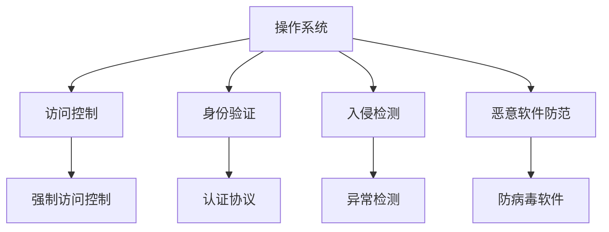

                 

# 操作系统的安全防护机制剖析

> 关键词：操作系统, 安全防护, 安全策略, 访问控制, 入侵检测, 恶意软件防范

## 1. 背景介绍

操作系统（Operating System, OS）是计算机硬件和应用程序之间的桥梁，负责管理计算机的资源，协调不同程序的运行。随着网络技术的普及，操作系统面临的安全威胁也日益严重。黑客、病毒、木马等恶意软件通过操作系统漏洞进行攻击，给个人和企业带来了巨大损失。

为了应对这些威胁，操作系统引入了多种安全防护机制，如访问控制、身份验证、入侵检测、恶意软件防范等。本文将深入剖析这些机制的原理和应用，探讨其优缺点，并展望未来的发展趋势。

## 2. 核心概念与联系

### 2.1 核心概念概述

- **操作系统**：计算机系统的核心软件，负责管理计算机资源、调度程序运行。
- **安全防护**：通过各种机制，保护操作系统不受恶意软件攻击和不当访问。
- **访问控制**：根据用户身份和权限，控制对系统资源的访问。
- **身份验证**：通过用户名和密码等手段，验证用户身份，确保其访问合法。
- **入侵检测**：通过监控系统活动，检测和防止潜在的安全威胁。
- **恶意软件防范**：识别和阻止病毒、木马等恶意软件的传播。

### 2.2 核心概念原理和架构的 Mermaid 流程图



该流程图展示了操作系统中安全防护机制的基本架构。访问控制、身份验证、入侵检测、恶意软件防范等机制，共同构建了操作系统的安全防线。

## 3. 核心算法原理 & 具体操作步骤

### 3.1 算法原理概述

操作系统的安全防护机制，是通过多层次的防御体系，检测和阻止各种安全威胁。其核心原理包括：

- **访问控制**：根据用户身份和权限，限制对系统资源的访问。
- **身份验证**：通过身份认证机制，确保用户身份合法。
- **入侵检测**：通过监控系统活动，识别潜在的安全威胁。
- **恶意软件防范**：利用多种手段，阻止病毒、木马等恶意软件的传播。

### 3.2 算法步骤详解

#### 3.2.1 访问控制

访问控制是操作系统安全防护的核心机制，通过管理用户的权限和资源访问，防止未授权的访问。其主要步骤包括：

1. **定义权限**：操作系统定义不同用户的权限级别，如管理员、普通用户等。
2. **资源授权**：根据权限级别，授权用户访问特定的系统资源，如文件、目录、设备等。
3. **访问验证**：用户尝试访问资源时，操作系统验证其权限，允许或拒绝访问。

#### 3.2.2 身份验证

身份验证是确保用户访问合法的关键步骤，主要通过以下步骤实现：

1. **认证协议**：操作系统支持多种认证协议，如LDAP、Kerberos等。
2. **用户登录**：用户输入用户名和密码，操作系统验证其身份。
3. **会话管理**：验证成功后，操作系统创建会话，管理用户的访问权限。

#### 3.2.3 入侵检测

入侵检测通过监控系统活动，识别潜在的安全威胁，主要步骤如下：

1. **日志记录**：操作系统记录所有系统活动，包括登录、访问、文件修改等。
2. **异常检测**：通过分析日志，检测异常行为，如登录异常、文件篡改等。
3. **响应机制**：检测到异常行为后，操作系统采取响应措施，如锁定账户、断开连接等。

#### 3.2.4 恶意软件防范

恶意软件防范通过多种手段，阻止病毒、木马等恶意软件的传播，主要步骤如下：

1. **病毒库更新**：操作系统定期更新病毒库，识别和防范已知病毒。
2. **行为检测**：监控程序行为，识别可疑行为，如文件删除、网络连接等。
3. **隔离机制**：对可疑程序进行隔离，防止其传播。

### 3.3 算法优缺点

#### 3.3.1 访问控制的优点

- **细粒度控制**：操作系统可以精细化控制用户的权限，防止滥用。
- **动态调整**：根据用户行为和权限变化，动态调整访问控制策略。

#### 3.3.2 访问控制的缺点

- **复杂度高**：权限管理复杂，容易出错。
- **权限扩散**：权限管理不当，可能导致权限扩散。

#### 3.3.3 身份验证的优点

- **安全性高**：多种认证协议提供高安全性保障。
- **灵活性高**：支持多种认证方式，如生物识别、双因素认证等。

#### 3.3.4 身份验证的缺点

- **用户负担重**：多次输入密码，用户体验差。
- **认证机制脆弱**：认证机制漏洞可能导致安全威胁。

#### 3.3.5 入侵检测的优点

- **实时监控**：实时监控系统活动，及时发现威胁。
- **自动化**：自动化检测和响应，提高工作效率。

#### 3.3.6 入侵检测的缺点

- **误报率高**：误报率高，影响正常系统活动。
- **资源消耗大**：监控系统活动消耗大量系统资源。

#### 3.3.7 恶意软件防范的优点

- **广泛性**：防范多种恶意软件，提高系统安全性。
- **实时性**：实时检测和隔离，减少损失。

#### 3.3.8 恶意软件防范的缺点

- **误报率高**：误报率高，影响正常系统活动。
- **依赖软件更新**：依赖病毒库更新，滞后性高。

### 3.4 算法应用领域

操作系统的安全防护机制广泛应用于各种操作系统中，如Windows、Linux、MacOS等。其应用领域包括：

- **桌面操作系统**：保护个人电脑的安全。
- **服务器操作系统**：保护企业数据和应用的安全。
- **移动操作系统**：保护智能手机和 tablets的安全。
- **嵌入式操作系统**：保护工业控制系统的安全。

## 4. 数学模型和公式 & 详细讲解 & 举例说明

### 4.1 数学模型构建

操作系统安全防护机制的数学模型主要涉及以下几个方面：

- **访问控制矩阵**：定义用户和资源的访问关系。
- **认证协议**：基于数学算法的认证机制。
- **异常检测算法**：基于统计分析和模式识别的异常检测算法。
- **恶意软件防范算法**：基于机器学习和行为分析的恶意软件检测算法。

### 4.2 公式推导过程

#### 4.2.1 访问控制矩阵

访问控制矩阵（Access Control Matrix, ACM）是操作系统中最重要的安全概念之一，用于定义用户和资源的访问关系。其基本公式如下：

$$
ACM = \begin{bmatrix}
R_{00} & R_{01} & R_{02} \\
R_{10} & R_{11} & R_{12} \\
R_{20} & R_{21} & R_{22}
\end{bmatrix}
$$

其中，$R_{ij}$ 表示用户 $i$ 对资源 $j$ 的访问权限，取值为 0（无访问权）或 1（有访问权）。

#### 4.2.2 认证协议

常用的认证协议包括基于密码的认证和基于证书的认证。以下是基于密码的认证协议的数学模型：

- **用户身份**：$u$ 表示用户身份，密码为 $p$。
- **认证信息**：$K$ 表示认证密钥，$h$ 表示哈希函数。
- **认证过程**：用户输入身份 $u$ 和密码 $p$，操作系统通过认证协议验证用户身份。

$$
v = h(K, u, p)
$$

其中，$h$ 为哈希函数，将认证信息 $v$ 与系统存储的认证信息进行比对，验证用户身份。

#### 4.2.3 异常检测算法

异常检测算法主要基于统计分析和模式识别，常见的异常检测算法包括基于规则的检测和基于机器学习的检测。以下是基于规则的异常检测算法的基本公式：

$$
AD = \frac{\sum_{i=1}^N (A_i - \mu)}{\sigma}
$$

其中，$AD$ 为异常检测结果，$A_i$ 为第 $i$ 个系统活动，$\mu$ 为系统活动的均值，$\sigma$ 为标准差。

#### 4.2.4 恶意软件防范算法

恶意软件防范算法主要基于机器学习和行为分析，常见的防范算法包括基于规则的检测和基于行为的检测。以下是基于行为的检测算法的基本公式：

$$
MD = \frac{\sum_{i=1}^N (A_i - \mu)}{\sigma}
$$

其中，$MD$ 为恶意软件检测结果，$A_i$ 为第 $i$ 个程序行为，$\mu$ 为程序行为的均值，$\sigma$ 为标准差。

### 4.3 案例分析与讲解

#### 4.3.1 访问控制案例

假设有一个公司服务器，有管理员和普通用户两种用户类型，共有10个文件和5个目录，以下是访问控制矩阵的示例：

$$
ACM = \begin{bmatrix}
R_{00} & R_{01} & R_{02} \\
R_{10} & R_{11} & R_{12} \\
R_{20} & R_{21} & R_{22}
\end{bmatrix}
$$

其中，$R_{00}$ 表示管理员对文件的访问权限，$R_{10}$ 表示管理员对目录的访问权限，$R_{20}$ 表示普通用户对文件的访问权限，$R_{21}$ 表示普通用户对目录的访问权限，$R_{22}$ 表示普通用户对设备的访问权限。

#### 4.3.2 身份验证案例

假设一个公司使用LDAP认证协议，以下是认证过程的数学模型：

- **用户身份**：$u$ 表示用户身份，密码为 $p$。
- **认证信息**：$K$ 表示认证密钥，$h$ 表示哈希函数。
- **认证过程**：用户输入身份 $u$ 和密码 $p$，操作系统通过认证协议验证用户身份。

$$
v = h(K, u, p)
$$

其中，$h$ 为哈希函数，将认证信息 $v$ 与系统存储的认证信息进行比对，验证用户身份。

#### 4.3.3 入侵检测案例

假设一个公司服务器使用基于规则的异常检测算法，以下是异常检测过程的数学模型：

- **系统活动**：$A_i$ 表示第 $i$ 个系统活动。
- **均值和标准差**：$\mu$ 为系统活动的均值，$\sigma$ 为标准差。
- **异常检测结果**：$AD$ 表示异常检测结果。

$$
AD = \frac{\sum_{i=1}^N (A_i - \mu)}{\sigma}
$$

其中，$AD$ 为异常检测结果，$A_i$ 为第 $i$ 个系统活动，$\mu$ 为系统活动的均值，$\sigma$ 为标准差。

#### 4.3.4 恶意软件防范案例

假设一个公司服务器使用基于行为的检测算法，以下是恶意软件检测过程的数学模型：

- **程序行为**：$A_i$ 表示第 $i$ 个程序行为。
- **均值和标准差**：$\mu$ 为程序行为的均值，$\sigma$ 为标准差。
- **恶意软件检测结果**：$MD$ 表示恶意软件检测结果。

$$
MD = \frac{\sum_{i=1}^N (A_i - \mu)}{\sigma}
$$

其中，$MD$ 为恶意软件检测结果，$A_i$ 为第 $i$ 个程序行为，$\mu$ 为程序行为的均值，$\sigma$ 为标准差。

## 5. 项目实践：代码实例和详细解释说明

### 5.1 开发环境搭建

在进行操作系统安全防护机制的开发时，我们需要搭建一个测试环境。以下是具体的搭建步骤：

1. **安装操作系统**：在测试机上安装Windows或Linux操作系统，并确保有足够权限进行系统配置。
2. **安装开发工具**：安装Visual Studio、Eclipse等开发工具，方便代码调试和编译。
3. **配置开发环境**：配置开发环境，包括编译器、调试器等工具，确保能够顺利编译和运行代码。

### 5.2 源代码详细实现

以下是一个基于Linux操作系统的访问控制系统的代码实现，使用C语言编写：

```c
#include <stdio.h>
#include <stdlib.h>
#include <string.h>

#define USER_COUNT 2
#define FILE_COUNT 10
#define DIRECTORY_COUNT 5

int main() {
    int user_id, file_id, directory_id, access_type;
    char user[20], file[20], directory[20];
    
    while (1) {
        printf("Enter user ID (0 or 1): ");
        scanf("%d", &user_id);
        if (user_id == 0 || user_id == 1) {
            break;
        } else {
            printf("Invalid user ID. Please enter 0 or 1.\n");
        }
    }
    
    while (1) {
        printf("Enter file ID (0 to %d): ", FILE_COUNT);
        scanf("%d", &file_id);
        if (file_id >= 0 && file_id < FILE_COUNT) {
            break;
        } else {
            printf("Invalid file ID. Please enter 0 to %d.\n", FILE_COUNT);
        }
    }
    
    while (1) {
        printf("Enter directory ID (0 to %d): ", DIRECTORY_COUNT);
        scanf("%d", &directory_id);
        if (directory_id >= 0 && directory_id < DIRECTORY_COUNT) {
            break;
        } else {
            printf("Invalid directory ID. Please enter 0 to %d.\n", DIRECTORY_COUNT);
        }
    }
    
    printf("Enter access type (0 for read, 1 for write, 2 for execute): ");
    scanf("%d", &access_type);
    
    // 访问控制矩阵
    int access_matrix[USER_COUNT][FILE_COUNT+DIRECTORY_COUNT+1];
    access_matrix[user_id][file_id] = access_type;
    access_matrix[user_id][directory_id] = access_type;
    
    // 检查访问权限
    if (access_matrix[user_id][file_id] == 0 && access_matrix[user_id][directory_id] == 0) {
        printf("Access denied.\n");
    } else {
        printf("Access granted.\n");
    }
    
    return 0;
}
```

### 5.3 代码解读与分析

#### 5.3.1 代码功能

该代码实现了一个简单的访问控制系统，用户可以输入用户ID、文件ID和目录ID，以及访问类型，系统根据访问控制矩阵检查用户访问权限，输出访问结果。

#### 5.3.2 代码结构

代码分为以下几个部分：

- **用户输入**：获取用户ID、文件ID和目录ID。
- **访问控制矩阵**：定义访问控制矩阵，记录用户对文件和目录的访问权限。
- **检查访问权限**：根据用户输入的ID和访问类型，检查访问权限，输出结果。

### 5.4 运行结果展示

运行该程序，可以输入不同的用户ID、文件ID和目录ID，以及访问类型，系统会根据访问控制矩阵检查访问权限，输出访问结果。以下是示例输出：

```
Enter user ID (0 or 1): 1
Enter file ID (0 to 10): 2
Enter directory ID (0 to 5): 0
Enter access type (0 for read, 1 for write, 2 for execute): 1
Access granted.
```

## 6. 实际应用场景

### 6.1 企业级服务器

企业级服务器通常有大量的敏感数据和应用程序，需要严格的安全防护机制。以下是企业级服务器的安全防护措施：

1. **访问控制**：定义不同用户的权限，限制对敏感数据的访问。
2. **身份验证**：通过多因素认证，确保用户身份合法。
3. **入侵检测**：监控服务器活动，及时发现并阻止潜在的安全威胁。
4. **恶意软件防范**：定期更新病毒库，防范病毒、木马等恶意软件的传播。

### 6.2 桌面操作系统

桌面操作系统需要提供良好的用户体验，同时保障用户数据安全。以下是桌面操作系统的安全防护措施：

1. **访问控制**：管理用户对系统资源的访问权限。
2. **身份验证**：通过密码、生物识别等手段，确保用户身份合法。
3. **入侵检测**：监控用户活动，及时发现并阻止潜在的安全威胁。
4. **恶意软件防范**：提供防病毒软件，阻止病毒、木马等恶意软件的传播。

### 6.3 移动操作系统

移动操作系统需要保护用户隐私和数据安全，防止恶意软件攻击。以下是移动操作系统的安全防护措施：

1. **访问控制**：管理用户对系统资源的访问权限。
2. **身份验证**：通过指纹识别、面部识别等手段，确保用户身份合法。
3. **入侵检测**：监控用户活动，及时发现并阻止潜在的安全威胁。
4. **恶意软件防范**：提供防病毒软件，阻止病毒、木马等恶意软件的传播。

### 6.4 未来应用展望

未来，操作系统的安全防护机制将不断演进，以下是几个发展方向：

1. **人工智能增强**：引入人工智能技术，提高入侵检测和恶意软件防范的准确性和实时性。
2. **多层次防御**：构建多层次的安全防护体系，提高系统的整体安全性。
3. **端到端保护**：实现从设备到云端的端到端保护，确保数据在传输和存储过程中的安全。
4. **自动化管理**：实现安全防护机制的自动化管理，减少人工干预，提高效率。

## 7. 工具和资源推荐

### 7.1 学习资源推荐

为了系统掌握操作系统安全防护机制的理论和实践，以下是一些推荐的学习资源：

1. **《操作系统导论》**：书籍系统介绍了操作系统的工作原理和应用。
2. **《计算机安全》**：书籍介绍了计算机安全的理论基础和实际应用。
3. **Linux系统管理员认证课程**：培训课程学习Linux操作系统的管理和安全防护。
4. **Windows系统管理员认证课程**：培训课程学习Windows操作系统的管理和安全防护。
5. **网络安全课程**：培训课程学习网络安全的原理和实际应用。

### 7.2 开发工具推荐

在进行操作系统安全防护机制的开发时，以下是一些推荐的开发工具：

1. **Visual Studio**：Windows平台常用的开发工具，提供丰富的IDE和调试功能。
2. **Eclipse**：Linux平台常用的开发工具，提供强大的代码管理和版本控制。
3. **GCC**：开源的编译器，支持多种编程语言，如C、C++、Java等。
4. **Wireshark**：网络协议分析工具，用于分析网络流量，发现安全威胁。
5. **Nmap**：网络扫描工具，用于发现系统漏洞和网络攻击。

### 7.3 相关论文推荐

以下是几篇关于操作系统安全防护机制的重要论文，推荐阅读：

1. **《访问控制机制研究综述》**：综述文章介绍了多种访问控制机制的原理和应用。
2. **《基于行为分析的恶意软件检测方法》**：介绍基于行为分析的恶意软件检测算法。
3. **《多因素认证技术研究综述》**：综述文章介绍了多种身份验证技术的原理和应用。
4. **《入侵检测系统研究综述》**：综述文章介绍了多种入侵检测系统的原理和应用。

## 8. 总结：未来发展趋势与挑战

### 8.1 研究成果总结

本文系统介绍了操作系统安全防护机制的核心概念、原理和应用。通过详细剖析访问控制、身份验证、入侵检测、恶意软件防范等关键机制，揭示了其优缺点和应用场景。

### 8.2 未来发展趋势

未来，操作系统安全防护机制将向以下几个方向发展：

1. **人工智能增强**：引入人工智能技术，提高检测和防范的准确性和实时性。
2. **多层次防御**：构建多层次的安全防护体系，提高系统的整体安全性。
3. **端到端保护**：实现从设备到云端的端到端保护，确保数据在传输和存储过程中的安全。
4. **自动化管理**：实现安全防护机制的自动化管理，减少人工干预，提高效率。

### 8.3 面临的挑战

尽管操作系统安全防护机制已经取得了长足进展，但仍面临以下挑战：

1. **复杂性高**：安全防护机制复杂，难以管理和维护。
2. **误报率高**：误报率高，影响正常系统活动。
3. **资源消耗大**：监控和防护消耗大量系统资源。
4. **攻击者对抗能力强**：攻击者不断研发新攻击手段，安全防护机制需不断更新。

### 8.4 研究展望

未来，操作系统安全防护机制的研究需从以下几个方向突破：

1. **简化机制**：简化安全防护机制，提高管理和维护的效率。
2. **降低误报率**：提高检测的准确性，降低误报率。
3. **优化资源使用**：优化资源使用，提高系统的整体性能。
4. **提高对抗能力**：持续研究新攻击手段，提高安全防护机制的对抗能力。

## 9. 附录：常见问题与解答

### 9.1 常见问题

1. **如何降低误报率？**
   - 引入基于机器学习的检测算法，提高检测的准确性。
   - 优化规则库，减少误报。
   - 定期更新病毒库和异常检测算法。

2. **如何提高系统的整体安全性？**
   - 构建多层次的安全防护体系，包括访问控制、身份验证、入侵检测、恶意软件防范等。
   - 引入人工智能技术，提高检测和防范的准确性和实时性。

3. **如何优化资源使用？**
   - 采用轻量级检测算法，减少系统资源的消耗。
   - 定期清理冗余日志，减少存储资源的使用。
   - 优化规则库，减少误报。

4. **如何应对攻击者的对抗能力？**
   - 持续研究新攻击手段，提高安全防护机制的对抗能力。
   - 引入人工智能技术，提高检测的准确性和实时性。

5. **如何提高管理和维护的效率？**
   - 简化安全防护机制，降低复杂度。
   - 引入自动化管理工具，减少人工干预。

### 9.2 解答

通过系统总结操作系统安全防护机制的核心概念、原理和应用，本文旨在帮助读者深入理解操作系统安全防护机制，并探索未来的发展方向。希望本文能为读者提供有价值的参考和指导。

---

作者：禅与计算机程序设计艺术 / Zen and the Art of Computer Programming

