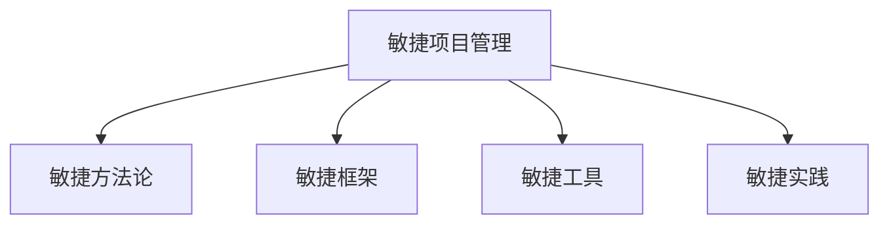

                 

# 敏捷项目管理：在复杂环境中快速交付

> 关键词：敏捷项目管理,快速交付,复杂环境,敏捷方法论,敏捷框架,敏捷工具,项目案例,敏捷实践

## 1. 背景介绍

### 1.1 问题由来
在当今快速变化的市场环境中，企业面临着前所未有的复杂性和不确定性。传统的项目管理和流程管理方式已经难以应对这种复杂环境。敏捷项目管理作为一种灵活、高效的管理方法，逐渐成为了企业应对复杂环境的首选。敏捷项目管理强调快速交付、持续改进和客户反馈，能够帮助企业快速适应市场变化，提高项目成功率和客户满意度。

### 1.2 问题核心关键点
敏捷项目管理的关键在于快速响应变化、迭代优化、持续交付、客户反馈和团队协作。敏捷项目管理与传统的瀑布式项目管理有着根本的区别，敏捷项目管理采用迭代式和增量式的开发方式，通过快速构建和交付产品特性，快速响应客户需求的变化，从而在复杂环境中取得成功。

### 1.3 问题研究意义
敏捷项目管理的研究和应用，对于提升项目管理效率、应对复杂环境、提高企业竞争力和客户满意度具有重要意义：

1. 提高项目管理效率：敏捷项目管理通过持续交付和快速迭代，缩短了项目周期，提高了项目管理的效率。
2. 应对复杂环境：敏捷项目管理通过灵活应对市场变化，提高了企业对复杂环境的适应能力。
3. 提高企业竞争力：敏捷项目管理通过快速交付和客户反馈，增强了企业的市场竞争力和客户满意度。
4. 客户满意度：敏捷项目管理通过持续交付和客户反馈，提升了客户满意度和忠诚度。

## 2. 核心概念与联系

### 2.1 核心概念概述

为更好地理解敏捷项目管理方法，本节将介绍几个密切相关的核心概念：

- **敏捷项目管理**：敏捷项目管理是一种采用迭代式和增量式开发方式的项目管理方法，强调快速响应变化、持续交付、客户反馈和团队协作。
- **敏捷方法论**：敏捷方法论是一套基于人本管理的项目管理实践，旨在通过快速响应变化、持续交付、客户反馈和团队协作，提升项目管理效率和客户满意度。
- **敏捷框架**：敏捷框架是一套指导敏捷项目管理实践的规范和指南，包括Scrum、Kanban、Extreme Programming等。
- **敏捷工具**：敏捷工具是支持敏捷项目管理实践的软件工具，如JIRA、Trello、Confluence等。
- **敏捷实践**：敏捷实践是敏捷项目管理方法的具体实践活动，如Daily Standup、Retrospective、Sprint等。

这些核心概念之间的逻辑关系可以通过以下Mermaid流程图来展示：

这个流程图展示了的核心概念及其之间的关系：

1. 敏捷项目管理通过敏捷方法论、敏捷框架和敏捷工具，指导具体的敏捷实践活动。
2. 敏捷方法论是敏捷项目管理的核心理念，提供了一套系统化的人本管理方法。
3. 敏捷框架和敏捷工具提供了具体的执行指南和软件支持，帮助敏捷实践得以落地。
4. 敏捷实践是敏捷项目管理的具体执行活动，通过持续交付、客户反馈和团队协作，提升项目管理效率和客户满意度。

## 3. 核心算法原理 & 具体操作步骤

### 3.1 算法原理概述

敏捷项目管理通过敏捷方法论、敏捷框架和敏捷工具，指导具体的敏捷实践活动，实现快速响应变化、持续交付、客户反馈和团队协作。其核心思想是：采用迭代式和增量式开发方式，通过快速构建和交付产品特性，快速响应客户需求的变化，从而在复杂环境中取得成功。

### 3.2 算法步骤详解

敏捷项目管理的主要步骤包括：

**Step 1: 项目规划**
- 定义项目愿景和目标，明确项目范围和需求。
- 制定项目计划，包括项目时间表、资源配置、里程碑等。
- 选择合适的敏捷框架，如Scrum、Kanban等。

**Step 2: 团队组建**
- 组建多学科团队，包括产品负责人、Scrum Master、开发团队等。
- 选择合适的敏捷工具，如JIRA、Trello等，进行任务管理和进度跟踪。
- 开展敏捷培训，提高团队成员的敏捷意识和技能。

**Step 3: 迭代开发**
- 进行迭代规划，确定Sprint目标和任务。
- 每天进行Daily Standup会议，确保团队成员同步信息和进展。
- 持续交付和测试，通过Sprint评审和验收确认交付成果。
- 定期进行Sprint回顾，总结经验和改进建议。

**Step 4: 持续交付**
- 通过自动化测试和CI/CD工具，确保快速交付高质量的软件。
- 持续收集客户反馈，根据反馈快速迭代优化产品特性。
- 定期进行产品发布和市场推广，提升产品竞争力和客户满意度。

**Step 5: 持续改进**
- 定期进行Retrospective会议，总结项目进展和改进建议。
- 持续优化项目管理流程和团队协作方式。
- 引入新技术和新工具，提升项目管理的效率和质量。

### 3.3 算法优缺点

敏捷项目管理方法具有以下优点：
1. 快速响应变化：通过迭代式和增量式开发方式，快速构建和交付产品特性，快速响应客户需求的变化。
2. 持续交付：通过持续集成和持续交付，保证高质量的软件交付速度。
3. 客户反馈：通过定期收集客户反馈，快速迭代优化产品特性，提升客户满意度。
4. 团队协作：通过Daily Standup、Sprint评审等协作机制，提高团队成员的协作效率。

同时，该方法也存在一定的局限性：
1. 适用范围有限：敏捷项目管理主要适用于复杂环境下的项目管理，对于简单稳定的项目可能不够适用。
2. 需要经验丰富的团队：敏捷项目管理需要团队成员具备敏捷意识和技能，对于缺乏敏捷经验的企业，可能需要时间培养。
3. 管理复杂：敏捷项目管理需要持续监控和管理，对项目管理人员提出了较高的要求。

尽管存在这些局限性，但就目前而言，敏捷项目管理仍是应对复杂环境的最佳选择。未来相关研究的重点在于如何进一步降低敏捷项目管理的复杂度，提高其普适性和适用性，同时兼顾高效和稳健的管理模式。

### 3.4 算法应用领域

敏捷项目管理在软件开发、产品开发、市场营销、项目管理等诸多领域得到了广泛的应用，具体应用领域包括：

- 软件开发：敏捷项目管理在软件开发中尤为常见，如敏捷开发、DevOps等。通过敏捷项目管理，软件团队能够快速响应客户需求，持续交付高质量的软件。
- 产品开发：敏捷项目管理在产品开发中也非常适用，如敏捷产品管理、敏捷迭代等。通过敏捷项目管理，产品团队能够快速迭代产品特性，快速响应市场变化。
- 市场营销：敏捷项目管理在市场营销中同样适用，如敏捷营销、客户反馈等。通过敏捷项目管理，市场营销团队能够快速响应市场变化，提升客户满意度和市场竞争力。
- 项目管理：敏捷项目管理在项目管理中也有广泛应用，如敏捷项目管理、敏捷发布计划等。通过敏捷项目管理，项目团队能够快速响应变化，提高项目管理效率和客户满意度。

## 4. 数学模型和公式 & 详细讲解

### 4.1 数学模型构建

敏捷项目管理的方法论和框架可以通过数学模型进行更严格的刻画。以下是一个简化的敏捷项目管理数学模型：

设 $T$ 为总的项目时间，$S$ 为总的项目Sprint次数，每个Sprint的时间为 $t$，每个Sprint的目标任务数为 $n$，每个Sprint的交付任务数为 $m$，则项目总任务数为 $N=nS$。

令 $V_i$ 为第 $i$ 个Sprint的目标任务价值，则项目总任务价值为 $V=N\sum_{i=1}^S V_i$。

设每个Sprint的交付速度为 $D_i$，则项目总交付速度为 $D=N\sum_{i=1}^S D_i$。

令每个Sprint的交付质量为 $Q_i$，则项目总交付质量为 $Q=N\sum_{i=1}^S Q_i$。

定义敏捷项目管理的指标 $K$ 为：

$$
K=\frac{V}{D}
$$

表示每个Sprint的任务价值与交付速度之比，即敏捷项目管理的效率。

### 4.2 公式推导过程

定义每个Sprint的目标任务价值 $V_i$ 为：

$$
V_i=\sum_{j=1}^n c_jr_j
$$

其中 $c_j$ 为第 $j$ 个任务的时间成本，$r_j$ 为第 $j$ 个任务的风险系数。

定义每个Sprint的交付速度 $D_i$ 为：

$$
D_i=\frac{n}{m}
$$

其中 $m$ 为第 $i$ 个Sprint的交付任务数。

定义每个Sprint的交付质量 $Q_i$ 为：

$$
Q_i=\sum_{j=1}^n f_jr_j
$$

其中 $f_j$ 为第 $j$ 个任务的交付质量系数。

则项目总任务价值 $V$ 和项目总交付速度 $D$ 分别为：

$$
V=N\sum_{i=1}^S \sum_{j=1}^n c_jr_j
$$

$$
D=N\sum_{i=1}^S \frac{n}{m}
$$

将 $V$ 和 $D$ 代入敏捷项目管理效率指标 $K$ 的定义中，得：

$$
K=\frac{N\sum_{i=1}^S \sum_{j=1}^n c_jr_j}{N\sum_{i=1}^S \frac{n}{m}}
$$

化简得：

$$
K=\frac{\sum_{i=1}^S \sum_{j=1}^n c_jr_j}{\sum_{i=1}^S \frac{n}{m}}
$$

上式即为敏捷项目管理效率指标 $K$ 的数学模型。

### 4.3 案例分析与讲解

以软件开发项目为例，分析敏捷项目管理的应用。

假设软件开发项目有10个任务，每个任务的时间成本为1天，风险系数为0.1，交付质量系数为0.8。每个Sprint的目标任务数为3个，交付任务数为2个，每个Sprint的时间为2天。

则每个Sprint的目标任务价值 $V_i$ 和交付速度 $D_i$ 分别为：

$$
V_i=\sum_{j=1}^3 c_jr_j=1*0.1*3+1*0.1*3+1*0.1*3=0.9
$$

$$
D_i=\frac{3}{2}=1.5
$$

代入 $K$ 的定义，得：

$$
K=\frac{\sum_{i=1}^S 0.9}{\sum_{i=1}^S 1.5}=\frac{0.9*5}{1.5*5}=0.6
$$

即每个Sprint的任务价值与交付速度之比为0.6，表明敏捷项目管理效率较高。

## 5. 项目实践：代码实例和详细解释说明

### 5.1 开发环境搭建

在进行敏捷项目管理实践前，我们需要准备好开发环境。以下是使用JIRA和Trello进行敏捷项目管理的环境配置流程：

1. 安装JIRA和Trello软件，并创建项目。
2. 配置JIRA的敏捷管理插件，如Scrum for JIRA、Kanban for JIRA等。
3. 配置Trello的项目面板，包括Sprint看板、任务看板等。
4. 组建敏捷团队，分配任务和责任。

完成上述步骤后，即可在JIRA和Trello上进行敏捷项目管理实践。

### 5.2 源代码详细实现

这里我们以Scrum框架为例，使用JIRA和Trello进行敏捷项目管理。

首先，在JIRA中配置Scrum for JIRA插件，并设置项目类型、Sprint、Product Backlog等参数。

在Trello中创建Sprint看板，包括待办任务（To Do）、进行中任务（In Progress）、待评审任务（Ready for Review）、已评审任务（Reviewed）、待发布任务（Ready to Deploy）和已发布任务（Deployed）。

其次，进行Sprint规划，将Product Backlog中的任务分配到不同的Sprint中。

接着，每天进行Daily Standup会议，在JIRA中更新任务状态，在Trello中移动任务卡片。

然后，进行Sprint评审，在JIRA中确认交付任务，在Trello中关闭任务卡片。

最后，进行Sprint回顾，在JIRA中进行回顾总结，在Trello中讨论改进建议。

### 5.3 代码解读与分析

让我们再详细解读一下关键代码的实现细节：

**JIRA和Trello的配置**：
- 在JIRA中配置Scrum for JIRA插件，设置Sprint、Product Backlog等参数。
- 在Trello中创建Sprint看板，包括待办任务、进行中任务、待评审任务、已评审任务、待发布任务和已发布任务。

**Sprint规划**：
- 将Product Backlog中的任务分配到不同的Sprint中。
- 在JIRA中更新任务状态，在Trello中移动任务卡片。

**Daily Standup会议**：
- 每天进行Daily Standup会议，更新任务状态。
- 在JIRA中记录每日任务进度，在Trello中更新任务卡片状态。

**Sprint评审**：
- 进行Sprint评审，在JIRA中确认交付任务。
- 在Trello中关闭任务卡片，完成交付。

**Sprint回顾**：
- 进行Sprint回顾，在JIRA中进行回顾总结。
- 在Trello中讨论改进建议，更新看板。

## 6. 实际应用场景

### 6.1 软件开发

敏捷项目管理在软件开发中尤为常见，如敏捷开发、DevOps等。通过敏捷项目管理，软件开发团队能够快速响应客户需求，持续交付高质量的软件。

在实际开发中，可以采用Scrum框架进行项目管理。Scrum框架通过Sprint进行迭代开发，每天进行Daily Standup会议，及时解决问题，保证项目进度。通过Sprint评审和回顾，持续优化开发流程和团队协作。

### 6.2 产品开发

敏捷项目管理在产品开发中也非常适用，如敏捷产品管理、敏捷迭代等。通过敏捷项目管理，产品团队能够快速迭代产品特性，快速响应市场变化。

在实际开发中，可以采用Kanban框架进行项目管理。Kanban框架通过看板管理任务进度，明确任务状态和责任人。通过每日任务更新和回顾，持续优化产品特性，提升产品质量。

### 6.3 市场营销

敏捷项目管理在市场营销中同样适用，如敏捷营销、客户反馈等。通过敏捷项目管理，市场营销团队能够快速响应市场变化，提升客户满意度和市场竞争力。

在实际营销中，可以采用Scrum框架进行项目管理。通过Sprint规划和评审，明确营销目标和任务。通过Daily Standup会议，及时解决问题，保证营销进度。通过Sprint回顾，持续优化营销策略和客户反馈。

### 6.4 未来应用展望

随着敏捷项目管理方法的不断演进，未来将呈现出以下几个发展趋势：

1. 敏捷项目管理的普适性将进一步提升。敏捷项目管理将不再局限于软件和产品开发领域，将在更多行业领域得到广泛应用。
2. 敏捷项目管理将更加注重用户体验和客户满意度。通过持续交付和客户反馈，敏捷项目管理将更好地满足客户需求，提升用户体验。
3. 敏捷项目管理将更加注重团队协作和知识共享。通过团队协作和知识共享，敏捷项目管理将提升团队效率和项目成功率。
4. 敏捷项目管理将更加注重数据驱动和决策科学。通过数据分析和决策科学，敏捷项目管理将更好地进行项目规划和进度管理。

## 7. 工具和资源推荐

### 7.1 学习资源推荐

为了帮助开发者系统掌握敏捷项目管理的方法和实践，这里推荐一些优质的学习资源：

1. 《敏捷项目管理》系列博文：由敏捷项目管理专家撰写，深入浅出地介绍了敏捷项目管理的原理、方法和实践。

2. CS242《软件工程与项目管理》课程：斯坦福大学开设的软件工程课程，详细介绍了敏捷项目管理的理论基础和实践方法。

3. 《敏捷开发实践指南》书籍：国内敏捷开发领域的经典著作，全面介绍了敏捷开发的方法和实践。

4. JIRA官方文档：JIRA官方文档提供了丰富的敏捷项目管理指导和案例，是学习和实践的重要资源。

5. Trello官方文档：Trello官方文档提供了详细的敏捷项目管理指导和工具使用指南，是学习和实践的重要资源。

通过对这些资源的学习实践，相信你一定能够快速掌握敏捷项目管理的精髓，并用于解决实际的NLP问题。

### 7.2 开发工具推荐

高效的开发离不开优秀的工具支持。以下是几款用于敏捷项目管理开发的常用工具：

1. JIRA：基于云计算的项目管理工具，支持敏捷项目管理，提供了丰富的敏捷管理插件和模板。

2. Trello：基于卡片的项目管理工具，支持敏捷项目管理，提供了简单易用的看板管理界面。

3. Confluence：基于云计算的协作工具，支持敏捷项目管理，提供了丰富的文档协作和知识共享功能。

4. Slack：基于云计算的团队协作工具，支持敏捷项目管理，提供了实时通信和任务分配功能。

5. GitHub：基于云计算的版本控制工具，支持敏捷项目管理，提供了持续集成和持续交付功能。

合理利用这些工具，可以显著提升敏捷项目管理的开发效率，加快创新迭代的步伐。

### 7.3 相关论文推荐

敏捷项目管理的研究源于学界的持续研究。以下是几篇奠基性的相关论文，推荐阅读：

1. Agile Development: Principles, Patterns, and Practices（《敏捷开发实践指南》）：这本书详细介绍了敏捷开发的方法和实践，是敏捷项目管理领域的经典之作。

2. Scrum Guide（《Scrum指南》）：Scrum官方文档，详细介绍了Scrum框架的原理、方法和实践，是敏捷项目管理的重要参考。

3. Kanban: Successful Evolutionary Change for Your Technology Business（《看板：技术业务的成功演变》）：这本书详细介绍了Kanban框架的方法和实践，是敏捷项目管理的另一经典之作。

这些论文代表了大敏捷项目管理的发展脉络。通过学习这些前沿成果，可以帮助研究者把握学科前进方向，激发更多的创新灵感。

## 8. 总结：未来发展趋势与挑战

### 8.1 总结

本文对敏捷项目管理方法进行了全面系统的介绍。首先阐述了敏捷项目管理的研究背景和意义，明确了敏捷项目管理在应对复杂环境、提高项目管理效率、提升客户满意度等方面的独特价值。其次，从原理到实践，详细讲解了敏捷项目管理的方法和步骤，给出了敏捷项目管理任务开发的完整代码实例。同时，本文还广泛探讨了敏捷项目管理在软件开发、产品开发、市场营销等多个行业领域的应用前景，展示了敏捷项目管理范式的巨大潜力。此外，本文精选了敏捷项目管理的各类学习资源，力求为读者提供全方位的技术指引。

通过本文的系统梳理，可以看到，敏捷项目管理方法正在成为项目管理的重要范式，极大地拓展了项目管理的边界，提升了项目管理的效率和质量。未来，伴随敏捷项目管理方法的持续演进，相信项目管理将迎来更加灵活、高效、智能的新时代。

### 8.2 未来发展趋势

展望未来，敏捷项目管理将呈现以下几个发展趋势：

1. 敏捷项目管理的普适性将进一步提升。敏捷项目管理将不再局限于软件和产品开发领域，将在更多行业领域得到广泛应用。
2. 敏捷项目管理将更加注重用户体验和客户满意度。通过持续交付和客户反馈，敏捷项目管理将更好地满足客户需求，提升用户体验。
3. 敏捷项目管理将更加注重团队协作和知识共享。通过团队协作和知识共享，敏捷项目管理将提升团队效率和项目成功率。
4. 敏捷项目管理将更加注重数据驱动和决策科学。通过数据分析和决策科学，敏捷项目管理将更好地进行项目规划和进度管理。

### 8.3 面临的挑战

尽管敏捷项目管理技术已经取得了瞩目成就，但在迈向更加智能化、普适化应用的过程中，它仍面临着诸多挑战：

1. 敏捷项目管理方法需要较强的项目管理背景。敏捷项目管理需要团队成员具备较强的项目管理背景和敏捷意识，对于缺乏项目管理经验的企业，可能需要时间培养。
2. 敏捷项目管理需要灵活调整。敏捷项目管理需要根据具体项目情况灵活调整，对于复杂的项目管理环境，需要更多的经验和实践。
3. 敏捷项目管理需要持续改进。敏捷项目管理需要持续改进和优化，对于持续改进的流程和机制，需要更多的工具和资源。

尽管存在这些挑战，但敏捷项目管理在项目管理领域的地位将不可动摇。未来相关研究的重点在于如何进一步降低敏捷项目管理的复杂度，提高其普适性和适用性，同时兼顾高效和稳健的管理模式。

### 8.4 研究展望

面对敏捷项目管理所面临的种种挑战，未来的研究需要在以下几个方面寻求新的突破：

1. 探索无监督和半监督敏捷项目管理方法。摆脱对大规模标注数据的依赖，利用自监督学习、主动学习等无监督和半监督范式，最大限度利用非结构化数据，实现更加灵活高效的敏捷项目管理。
2. 研究参数高效和计算高效的敏捷项目管理范式。开发更加参数高效和计算高效的敏捷项目管理方法，在固定大部分敏捷项目管理参数的情况下，只更新极少量的任务相关参数。同时优化敏捷项目管理的计算图，减少前向传播和反向传播的资源消耗，实现更加轻量级、实时性的部署。
3. 融合因果和对比学习范式。通过引入因果推断和对比学习思想，增强敏捷项目管理建立稳定因果关系的能力，学习更加普适、鲁棒的任务价值与交付速度之比，从而提升敏捷项目管理效率。
4. 引入更多先验知识。将符号化的先验知识，如知识图谱、逻辑规则等，与敏捷项目管理模型进行巧妙融合，引导敏捷项目管理过程学习更准确、合理的任务价值与交付速度之比。同时加强不同模态数据的整合，实现视觉、语音等多模态信息与文本信息的协同建模。
5. 结合因果分析和博弈论工具。将因果分析方法引入敏捷项目管理模型，识别出敏捷项目管理决策的关键特征，增强输出解释的因果性和逻辑性。借助博弈论工具刻画人机交互过程，主动探索并规避敏捷项目管理的脆弱点，提高系统稳定性。
6. 纳入伦理道德约束。在敏捷项目管理目标中引入伦理导向的评估指标，过滤和惩罚有偏见、有害的输出倾向。同时加强人工干预和审核，建立敏捷项目管理行为的监管机制，确保输出符合人类价值观和伦理道德。

这些研究方向的探索，必将引领敏捷项目管理技术迈向更高的台阶，为构建安全、可靠、可解释、可控的智能系统铺平道路。面向未来，敏捷项目管理技术还需要与其他人工智能技术进行更深入的融合，如知识表示、因果推理、强化学习等，多路径协同发力，共同推动敏捷项目管理的进步。

## 9. 附录：常见问题与解答

**Q1：敏捷项目管理是否适用于所有项目管理？**

A: 敏捷项目管理主要适用于复杂环境下的项目管理，对于简单稳定的项目可能不够适用。但敏捷项目管理可以灵活调整，适应不同类型的项目管理需求。

**Q2：敏捷项目管理需要经验丰富的团队吗？**

A: 敏捷项目管理需要团队成员具备敏捷意识和技能，对于缺乏敏捷经验的企业，可能需要时间培养。但通过敏捷培训和实践，团队成员可以快速掌握敏捷项目管理的方法和实践。

**Q3：敏捷项目管理是否需要持续改进？**

A: 敏捷项目管理需要持续改进和优化，对于持续改进的流程和机制，需要更多的工具和资源。但通过持续改进，敏捷项目管理将不断提高项目管理的效率和质量。

**Q4：敏捷项目管理如何应对复杂环境？**

A: 敏捷项目管理通过迭代式和增量式开发方式，快速构建和交付产品特性，快速响应客户需求的变化，从而在复杂环境中取得成功。

**Q5：敏捷项目管理是否需要持续交付？**

A: 敏捷项目管理需要持续交付和客户反馈，通过持续交付和客户反馈，敏捷项目管理将更好地满足客户需求，提升用户体验。

总之，敏捷项目管理需要开发者根据具体项目，不断迭代和优化项目管理流程和团队协作方式，方能得到理想的效果。

---

作者：禅与计算机程序设计艺术 / Zen and the Art of Computer Programming

